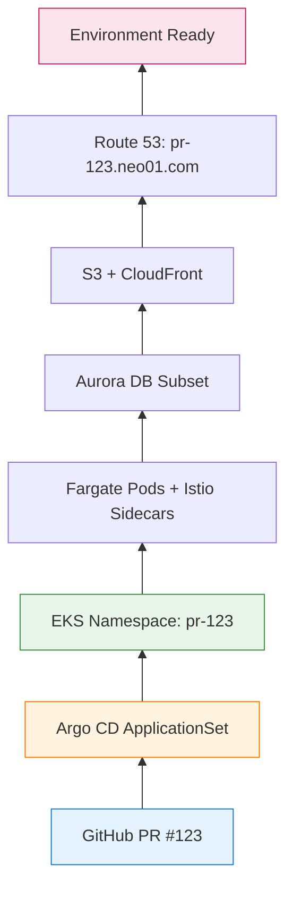
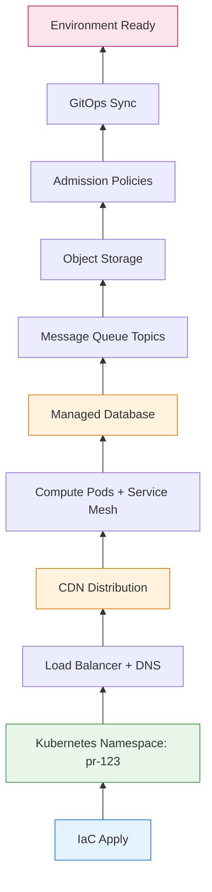
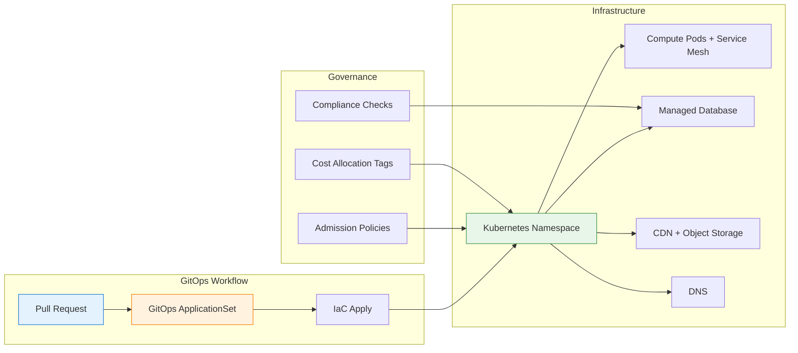

你的团队开启的每个 pull request——无论是简单的 bug 修复还是横跨多个微服务的复杂功能——都可以拥有自己独立的、类生产环境：**按需环境** (EoD，Environment on Demand)。

这个模式让团队能够：
- 在几分钟内（而非几天）启动预览环境
- 在合并到 main 分支前，在隔离环境中测试变更
- 使用基础设施即代码 (IaC) 安全地验证基础设施变更
- 在 PR 关闭时自动清理，避免成本浪费

但这也是为什么采用 EoD 的团队会在**配置延迟**、**CDN 传播延迟**、**成本超支**和**运营复杂性**方面遇到类似的痛点。以下是深入探讨：什么是按需环境、为什么团队需要它、如何架构设计它，以及现实中的挑战。

有了这个概述，让我们深入探讨按需环境的真正含义，首先从其核心定义开始。

---

## 1 什么是按需环境？

**按需环境** 是一种基础设施模式，其中开发、staging 和预览环境通过 GitOps 工作流**自动**配置，通常由 pull request 或分支推送触发。

每个环境包括：
- 计算命名空间或集群（Kubernetes，使用 serverless 或节点组）
- 应用部署（微服务、前端、后端）
- 支持基础设施（托管数据库、消息队列、对象存储）
- 网络（负载均衡器入口、DNS、CDN 分发）
- 策略（准入控制、IAM 角色、服务网格）

这种**拉取式**模型意味着基础设施从 Git 流出，一次一个提交，直到环境准备好进行测试。

!!! info "第一次接触这些概念？"
    *   **GitOps**：一种运营框架，将应用开发中使用的 DevOps 最佳实践（如版本控制、协作、合规性和 CI/CD）应用于基础设施自动化。这意味着使用 Git 作为单一事实来源来管理基础设施和应用。
    *   **Argo CD**：一种用于 Kubernetes 的声明式 GitOps 持续交付工具。它自动将 Git 仓库中指定的期望应用状态部署到 Kubernetes 集群。
    *   **Terraform**：一种开源的基础设施即代码 (IaC) 工具，允许使用声明式配置语言定义和配置基础设施。它可以管理广泛的云服务和本地资源。
    *   **PR (Pull Request)**：版本控制系统（如 Git）中的一种机制，开发人员用它通知团队成员他们已完成功能或 bug 修复，并准备将他们从独立分支的变更合并到主代码库中。它启动审查流程。

有了这个基础理解，正确分类按需环境至关重要。它是一个平台、一个模式，还是其他什么？

### 它是一个平台？一个模式？还是其他什么？

按需环境经常使用不同的术语来描述。以下是精确的分类：

| 术语 | EoD 是这个吗？ | 为什么 |
|------|--------------|-----|
| **部署模式** | ✅ **最准确** | 定义了*如何*创建和管理环境 |
| **架构模式** | ✅ **也正确** | 定义高层结构（GitOps 驱动、临时资源） |
| **平台** | ⚠️ **部分** | 构建*在*Kubernetes + CI/CD 工具*之上*，但不仅仅是一个平台 |
| **软件架构** | ❌ **太宽泛** | 它是团队 DevOps 架构的*一部分*，而不是整个架构 |
| **方法论** | ❌ **不是** | 它是一个实现模式，而不是流程方法论 |

**关系：**

```
GitOps（方法论）
        ↓
    启用
        ↓
Environment on Demand（部署模式 / 架构模式）
        ↓
    实现于
        ↓
Argo CD + Terraform + Kubernetes（平台栈）
```

**为什么会混淆？**

| 来源 | 使用术语 | 原因 |
|--------|-----------|--------|
| **DevOps 博客** | "平台" | 营销；听起来更实质 |
| **工程团队** | "模式" | 来自架构词汇的熟悉感 |
| **供应商文档** | "解决方案" | 产品导向的命名 |
| **SRE 团队** | "工作流" | 运营导向的命名 |

**精确答案：**

按需环境最好描述为一种**基础设施部署模式**，它：
- 使用 **GitOps 方法论** 作为基础
- 定义**配置模型**（自动、临时、每 PR）
- 是团队整体 DevOps 架构的**一部分**

这样理解：
- **GitOps** = "我如何通过 Git 管理基础设施？"
- **按需环境** = "我如何为每个 PR 创建隔离环境？"
- **Argo CD + Terraform + Kubernetes** = "实现 EoD 的实际工具"

为了说明这个概念，让我们通过一个简单的按需环境配置流程示例。

---

**简单示例：**

```yaml
# PR #123 开启 → GitOps 工作流触发
# 环境：pr-123.neo01.com
```

配置如下：



**配置流程：**

```
开发人员："开启 PR #123"
  ↓
GitHub Actions："触发 Terraform Cloud"
  ↓
Terraform："创建命名空间 + 资源"
  ↓
Argo CD："同步应用到命名空间"
  ↓
环境："就绪于 pr-123.neo01.com"
```

每个组件都是**独立的**。命名空间不知道 pod 是运行在 Fargate 还是 EC2 上。DNS 不知道它是预览环境还是 staging 环境。这种**模块化**是 EoD 的超能力。

现在我们已经看到了高级概述，让我们放大核心机制，首先从 GitOps 接口和 Argo CD ApplicationSets 开始。

---

## 2 GitOps 接口：Argo CD ApplicationSets

在 GitOps 驱动的设置中，每个环境都表示为一个 **Argo CD Application**（或 ApplicationSet，用于模板化环境）：

```yaml
# 简化的 Argo CD ApplicationSet
apiVersion: argoproj.io/v1alpha1
kind: ApplicationSet
metadata:
  name: preview-environments
spec:
  generators:
    - pullRequest:
        github:
          api: https://api.github.com
          tokenRef:
            secretName: github-token
            key: token
          repo: neo01/neo01.com
          branch: main
  template:
    metadata:
      name: 'pr-{{number}}'
    spec:
      project: default
      source:
        repoURL: https://github.com/neo01/neo01.com
        targetRevision: 'pr-{{number}}'
        path: 'environments/preview'
      destination:
        server: https://kubernetes.default.svc
        namespace: 'pr-{{number}}'
      syncPolicy:
        automated:
          prune: true
          selfHeal: true
```

**合约：**

| 字段 | 含义 |
|-------|---------|
| `generators.pullRequest` | 监视 PR，为每个 PR 创建环境 |
| `template.metadata.name` | 环境名称（例如 `pr-123`） |
| `destination.namespace` | Kubernetes 命名空间隔离 |
| `syncPolicy.automated` | Git 变更时自动同步，删除时清理 |

**通用同步循环：**

```yaml
# Argo CD 持续协调
while true; do
  desired_state = git_repo.get_latest()
  current_state = k8s_cluster.get_current()

  if desired_state != current_state
    k8s_cluster.apply(desired_state)

  sleep 3s  # 协调间隔
end
```

这个循环——**将 Git 协调到集群，重复**——就是整个 GitOps 模型。每个环境，无论多么复杂，都归结为这个模式。

理解了 GitOps 同步机制，让我们探讨这些环境如何转换为实际的云资源，形成一个「基础设施树」。

---

## 3 基础设施树：环境如何成为资源

当你开启 PR 时，Terraform 构建一个**基础设施树**。每个节点是一个具有特定依赖关系的资源类型。

### 常见资源类型

| 资源 | 作用 | 配置时间 |
|----------|--------------|-------------------|
| **Kubernetes Namespace** | 集群中的逻辑隔离 | < 1 分钟 |
| **Serverless Pods** | 计算（无需节点管理） | 2-5 分钟 |
| **Service Mesh Sidecars** | mTLS、流量整形 | 1-2 分钟 |
| **Admission Policies** | 安全性、合规性 | < 1 分钟 |
| **Managed Database** | PostgreSQL/MySQL（可以是 serverless） | 10-15 分钟 |
| **Message Queue Topics** | Kafka/RabbitMQ（或使用共享集群） | 5-10 分钟 |
| **Object Storage** | 桶（资产、上传） | < 1 分钟 |
| **CDN** | 静态资产分发 | 5-15 分钟 |
| **DNS Records** | 每个环境的 CNAME/ALIAS | 1-5 分钟 |
| **Load Balancer** | 基于路径的路由 | 2-5 分钟 |

### 示例：完整预览环境

```hcl
# 简化的 Terraform 模块
module "preview_env" {
  source = "./modules/preview"

  pr_number      = var.pr_number
  namespace      = "pr-${var.pr_number}"
  domain         = "pr-${var.pr_number}.neo01.com"
  image_tag      = var.image_tag
  cloud_region   = "ap-east-1"

  # 共享资源（更便宜、更快）
  shared_mq_cluster_arn = data.aws_mq_cluster.shared.arn
  shared_vpc_id          = data.aws_vpc.main.id

  # 不活动后自动销毁
  ttl_hours = 24
}
```

**基础设施计划（简化）：**



**配置流程（第一个环境）：**

```
1. 开发人员开启 PR #123
2. CI/CD 触发 IaC apply
3. IaC 创建命名空间（1 分钟）
4. IaC 配置托管数据库（10-15 分钟）← 阻塞
5. IaC 创建 CDN 分发（5-15 分钟）← 阻塞
6. IaC 设置 DNS 记录（1-5 分钟）
7. GitOps 同步应用到命名空间（2-5 分钟）
8. 带有 sidecar 的计算 pod 启动（2-5 分钟）
9. 健康检查通过，环境标记为就绪
10. 通知："pr-123.neo01.com 已就绪"
```

注意：**数据库和 CDN 必须在环境可用之前完成**。这些是**阻塞资源**——它们破坏了快速反馈循环。

!!! question "🤔 为什么这很重要？"
    像数据库、CDN 和消息队列这样的阻塞资源迫使 IaC **等待云提供商 API** 然后才能继续。这意味着：

    - **开发人员等待时间** — 测试前等待 15-30 分钟
    - **成本累积** — 资源在等待时也在计费
    - **反馈延迟** — 无法快速验证变更

    当你在 IaC 计划中看到这些时，问自己：*"我可以使用共享资源而不是每环境配置吗？"*

掌握了配置流程，是时候通过检视其优缺点来分析按需环境的有效性了。

---

## 4 配置模型：好的、坏的和慢的

### 好的：为什么 EoD 运作良好

**1. 隔离**

每个 PR 获得具有专用资源的自己命名空间：

```yaml
# pr-123 不能影响 pr-124
namespace: pr-123
resources:
  cpu_limit: 2
  memory_limit: 4Gi
  network_policy: deny-cross-namespace
```

**爆炸半径：** 每个环境 O(1)（仅该命名空间）

---

**2. 模块化**

环境由可重用模块组成。相同的 IaC 模块适用于：
- 预览环境（每 PR）
- Staging 环境（共享、长期存在）
- 开发环境（持久、团队特定）

不需要为每个层级编写自定义代码。

---

**3. 自动清理**

```yaml
# GitOps + cron job
when PR.closed OR TTL.expired:
  delete namespace
  destroy IaC resources
  invalidate CDN cache (if needed)
  notify team: "Environment pr-123 destroyed"
```

环境在不活动 24 小时后自毁——无需手动清理。

---

**4. 审计追踪**

每个环境变更都在 Git 中追踪：

```bash
$ git log --oneline environments/preview/
a1b2c3d  feat: Add payment service to pr-123
e4f5g6h  fix: Update database config for pr-122
i7j8k9l  chore: Bump TTL to 24h for all previews
```

约 3 行 Git 历史。易于审计。易于回滚。

!!! tip "💡 关键洞察：简单性实现治理"
    因为每个环境都在 Git 中定义，合规团队可以像审查代码变更一样审查基础设施变更。这就是为什么 EoD 在受监管行业（金融、医疗保健、博彩）中有效。**GitOps 审计追踪**是 EoD 合规的原因。

---

### 坏的：EoD 遇到困难的地方

**1. 配置延迟**

每个环境需要：
- IaC apply（5-30 分钟）
- GitOps sync（2-5 分钟）
- Health checks（1-3 分钟）
- DNS propagation（1-5 分钟，或 CDN 需 10-15 分钟）

对于 10 个并发 PR：**累计等待时间 50-300 分钟**。

---

**2. CDN 传播**

静态资产的 CDN 失效在全球范围内几秒到约 2-5 分钟内完成，但可能飙升到 10-15+ 分钟（或在云提供商高峰/API 限流期间罕见地达到数小时）。

**EoD 中的挑战：**

```
每个临时环境需要：
  - 自定义域名：pr-123.neo01.com
  - CDN 行为：/assets/* → Object Storage
  - DNS 记录：CNAME to CDN
  - 失效：/*（或使用版本化路径）
```

当 CI/CD/GitOps 流程触发每个 PR 的失效时：
- PR 合并 → 部署 → 失效 → 用户看到旧内容
- "为什么我的变更没有上线？！"

---

**3. 成本累积**

```
10-30 个并发预览环境：
  - Serverless compute: $0.04/vCPU-hour × 2 vCPU × 24h = ~$2/环境/天
  - Managed database: $0.12/unit-hour × 2 units × 24h = ~$6/环境/天
  - CDN: $0.085/GB (egress) + $0.009/10k requests
  - DNS: $0.50/hosted zone + $0.40/million queries
  - Load Balancer: $0.0225/hour + $0.008/LCU-hour
```

**20 个环境的月成本：** 约 $500-1500（如果积极清理）到 $3000-5000（如果留着运行）

---

**4. 依赖复杂性**

一些资源必须跨服务协调：

| 阻塞依赖 | 为什么阻塞 |
|---------------------|---------------|
| **Database init** | 必须在应用启动前完成迁移 |
| **CDN deploy** | 必须有有效的 SSL 证书（验证可能需要几分钟） |
| **Message Queue topic creation** | 必须在生产者/消费者启动前存在 |
| **Secrets sync** | 必须在 pod 启动前有 secrets manager 条目 |

当计划中存在阻塞依赖时，**上游资源无法继续**——它们必须等待。

探讨了权衡之后，让我们看看按需环境的具体云实现，重点关注 Kubernetes、serverless 和基础设施即代码。

---

## 5 云实现：Kubernetes + Serverless + IaC 示例

在生产设置中，EoD 栈通常使用云原生服务。以下示例使用 AWS，但这些模式适用于 Azure（AKS + Container Apps）、GCP（GKE + Cloud Run）或任何 Kubernetes 平台：

```hcl
# 简化的 Kubernetes namespace Terraform
resource "kubernetes_namespace" "preview" {
  metadata {
    name = "pr-${var.pr_number}"

    labels = {
      "app.kubernetes.io/name"       = "preview"
      "app.kubernetes.io/instance"   = "pr-${var.pr_number}"
      "environment.on-demand/owner"  = var.github_user
      "environment.on-demand/ttl"    = var.ttl_hours
    }

    annotations = {
      "environment.on-demand/created-at" = timestamp()
      "environment.on-demand/pr-url"     = var.pr_url
    }
  }
}

resource "kubernetes_pod" "app" {
  # ... 带有服务网格 sidecar 的 Serverless pod spec ...
}

resource "dns_record" "preview" {
  zone_id = data.dns_zone.main.zone_id
  name    = "pr-${var.pr_number}.neo01.com"
  type    = "A"

  alias {
    name                   = cdn_distribution.preview.domain_name
    zone_id                = cdn_distribution.preview.hosted_zone_id
    evaluate_target_health = true
  }
}
```

每个资源类型实现自己的配置逻辑：

| 资源类型 | IaC 资源 | 配置复杂度 |
|---------------|--------------|------------------------|
| Kubernetes Namespace | `kubernetes_namespace` | 低 (< 1 分钟) |
| Serverless Pods | `kubernetes_pod` | 中 (2-5 分钟) |
| Managed Database | `managed_database_cluster` | 高 (10-15 分钟) |
| CDN | `cdn_distribution` | 高 (5-15 分钟) |
| DNS | `dns_record` | 低 (1-5 分钟) |
| Message Queue Topics | `mq_topic` (或共享) | 中 (5-10 分钟) |

### 示例：使用版本化资产的 CDN

```hcl
# 使用版本化路径避免 CDN 失效
resource "cdn_distribution" "preview" {
  origin {
    domain_name = object_storage.assets.bucket_regional_domain_name
    origin_id   = "Storage-pr-${var.pr_number}"

    # 每个 PR 的自定义 origin 路径
    origin_path = "/pr-${var.pr_number}"
  }

  # 如果使用 /assets/v123/ 路径，则不需要失效
  # 与其失效 /*，不如使用不可变缓存
  default_cache_behavior {
    # ... 版本化资产的 1 年 TTL 缓存策略 ...
  }

  # 仅在实际内容变更时失效
  # （由 CI/CD 处理，而不是每次部署）
}
```

**关键观察：**

1. **版本化路径** 完全避免 CDN 失效
2. **命名空间隔离** 防止跨环境污染
3. **TTL 注解** 实现自动清理
4. **通过 IaC 依赖委托给子** 资源

这个模式在每个环境的约 20-30 个资源类型中重复。

理解了 EoD 如何实现，让我们现在分析其性能影响，并识别它真正擅长或挣扎的场景。

---

## 6 性能影响：EoD 何时擅长 vs. 挣扎

### EoD 擅长：

| 工作负载 | 为什么 |
|----------|-----|
| **功能开发**（隔离测试） | 每个开发人员获得自己的环境；无冲突 |
| **集成测试**（多服务） | 每个 PR 可用完整栈 |
| **利益相关者演示** | 可分享 URL (pr-123.neo01.com) |
| **基础设施变更** | PR 中的 IaC plan，合并时 apply |

**示例：功能分支测试**

```yaml
# PR #123: 添加支付网关
environment: pr-123.neo01.com
services:
  - frontend:v1.2.3-pr123
  - backend:v1.2.3-pr123
  - payment-service:v2.0.0-pr123  # 新服务
database:
  - Managed database (migrated)
testing:
  - E2E tests pass
  - Stakeholder approval
```

- 开发人员开启 PR → 环境在 15-30 分钟内配置
- QA 在实时环境上测试
- 产品负责人在可分享 URL 上审查
- **总反馈时间：** 30-60 分钟（包括配置）
- **EoD 开销：** 对于功能工作可接受

---

### EoD 挣扎之处：

| 工作负载 | 为什么 |
|----------|-----|
| **快速修复**（错字、CSS 调整） | 5 分钟的变更需要 15-30 分钟配置 |
| **高频迭代**（A/B 测试） | 配置时间超过开发时间 |
| **资源密集型测试**（负载测试） | 每个环境的计算/数据库限制 |
| **跨 PR 依赖**（PR #123 需要 PR #124 的变更） | 协调开销 |

**示例：热修复部署**

```yaml
# Hotfix: 修复首页错字
# 预期：5 分钟内部署
# 实际：20-30 分钟（配置 + 测试）
```

- 开发人员开启 PR → 环境在 15-20 分钟内配置
- QA 验证修复（2 分钟）
- 合并 → 生产部署（5 分钟）
- **总时间：** 25-30 分钟
- **EoD 开销：** 总时间的 80-90%

!!! warning "⚠️ 隐藏成本：不仅是等待时间"
    配置延迟只是问题的一部分。EoD 还引入了：

    1. **上下文切换** — 开发人员在等待环境时失去动力
    2. **调试复杂性** — 哪个环境有问题？
    3. **成本不确定性** — 孤儿环境的意外账单
    4. **治理摩擦** — 合规门减慢「自助服务」

    对于快速迭代，这些工作流低效通常比配置时间本身更重要。

鉴于这些性能挑战和潜在开销，值得探讨按需环境的替代方法并了解它们各自的权衡。

---

## 7 替代方法：权衡

**轻量级替代方案**（虚拟集群、仅命名空间、共享 staging）减少配置时间但牺牲隔离：

```yaml
# 替代方案 1：仅命名空间（无数据库、无 CDN）
environment:
  type: namespace-isolation
  shared_resources:
    - database-cluster: shared-staging
    - cdn: shared-cdn
  provision_time: 2-5 分钟
  isolation: medium
```

**执行：**

```yaml
while (pr = pull_request.opened) {
  # 仅创建命名空间（无新数据库/CDN）
  kubectl.create_namespace(`pr-${pr.number}`)

  # 使用共享 DB 部署应用（schema 隔离）
  helm.install(apps, { namespace: `pr-${pr.number}` })

  # 就绪时通知（总共 2-5 分钟）
  notify(`PR ${pr.number} env ready: pr-${pr.number}.neo01.com`)
}
```

**好处（示例）：**

| 方面 | 完整 EoD（每环境资源） | 轻量级（命名空间 + 共享） |
|--------|------------------------------|----------------------------------|
| 配置时间 | 15-30 分钟 | 2-5 分钟 |
| 隔离 | 高（专用数据库、MQ） | 中（共享 DB、schema 隔离） |
| 成本每环境 | $25-75/天 | $5-15/天 |
| 复杂度 | 高（IaC + GitOps） | 中（仅 GitOps） |
| 使用场景 | 功能测试、合规 | 快速修复、高频迭代 |

!!! question "🤔 那么为什么不总是使用轻量级？"
    如果仅命名空间快 6 倍且便宜 5 倍，为什么要配置完整环境？

    - **数据隔离** — 一些测试需要专用 DB（迁移、数据播种）
    - **性能测试** — 共享资源扭曲负载测试结果
    - **合规** — 受监管行业需要环境隔离（审计追踪）
    - **爆炸半径** — 一个环境中的错误配置不应影响其他环境

    答案：**分层环境**（快速修复使用轻量级，功能使用完整 EoD）。

---

### 为什么团队不标准化于一种方法

**1. 权衡复杂性**

不同的 PR 需要不同的隔离级别：
- 错字修复 → 仅命名空间（2 分钟）
- 数据库迁移 → 完整数据库（20 分钟）
- 前端调整 → 无 CDN（直接负载均衡器）
- 支付功能 → 完整隔离（合规）

**2. 成本耦合**

所有 PR 使用完整 EoD = 成本增加 10 倍，而简单变更没有速度增益。

**3. 治理要求**

受监管行业需要审计追踪、某些资源的审批门（例如预览中无公共存储）。

自助服务理想与敏感变更「需要审查」冲突。

将所有这些概念结合在一起，让我们总结按需环境的架构组件和关键特征。

---

## 总结：按需环境架构



**关键要点：**

| 方面 | 按需环境 |
|--------|----------------------|
| **接口** | GitOps（ApplicationSets + IaC） |
| **结构** | 分层环境（轻量级到完整） |
| **数据流** | Git → IaC → Kubernetes → 环境 |
| **内存** | 临时（基于 TTL 的清理） |
| **最适合** | 功能测试、集成、利益相关者演示 |
| **最不适合** | 快速修复、高频迭代 |

按需环境并不完美——但对于在 Kubernetes 上快速交付的团队（无论是 EKS、AKS、GKE 还是 vanilla），它是「等待几天获得环境」和「15 分钟内测试」之间的区别。了解权衡有助于你构建与团队工作流配合的 EoD，而不是对抗它。

!!! success "✅ 关键要点"
    按需环境是一种**权衡**，不是银弹：

    - **收获：** 隔离、自助服务、审计追踪、更快反馈
    - **损失：** 配置延迟、成本累积、运营复杂性

    关键是根据你的团队需求选择正确的层级。

---

**下一篇文章：** [按需环境（第二篇）：生命周期、AI 编码与优化](/zh-CN/2026/02/Environment-on-Demand-Part2-Lifecycle/)
