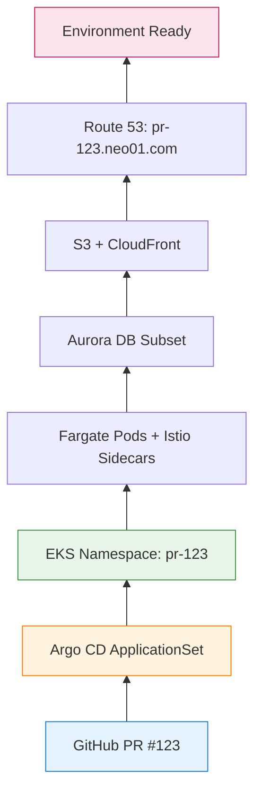
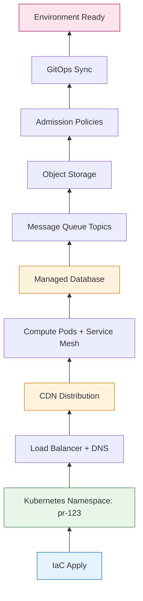
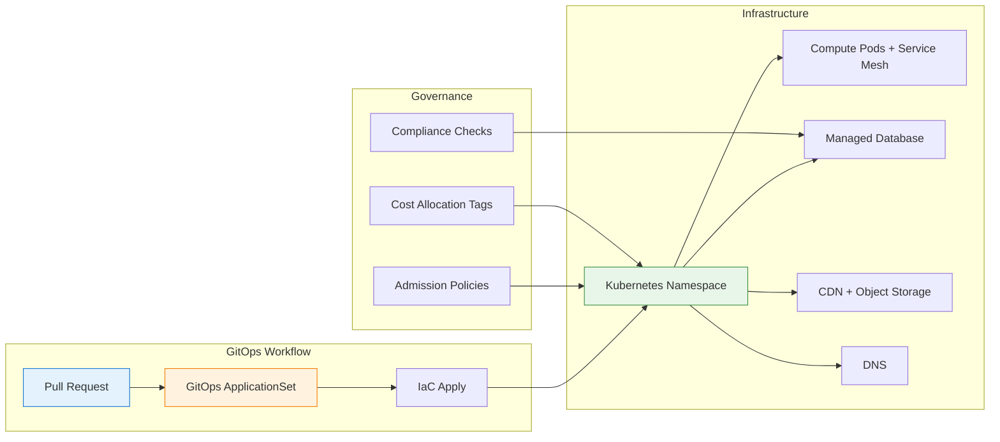

你的團隊開啟的每個 pull request——無論是簡單的 bug 修復還是橫跨多個微服務的複雜功能——都可以擁有自己獨立的、類生產環境：**按需環境** (EoD，Environment on Demand)。

這個模式讓團隊能夠：
- 在幾分鐘內（而非幾天）啟動預覽環境
- 在合併到 main 分支前，在隔離環境中測試變更
- 使用基礎設施即代碼 (IaC) 安全地驗證基礎設施變更
- 在 PR 關閉時自動清理，避免成本浪費

但這也是為什麼採用 EoD 的團隊會在**配置延遲**、**CDN 傳播延遲**、**成本超支**和**運營複雜性**方面遇到類似的痛點。以下是深入探討：什麼是按需環境、為什麼團隊需要它、如何架構設計它，以及現實中的挑戰。

有了這個概述，讓我們深入探討按需環境的真正含義，首先從其核心定義開始。

---

## 1 什麼是按需環境？

**按需環境** 是一種基礎設施模式，其中開發、staging 和預覽環境通過 GitOps 工作流**自動**配置，通常由 pull request 或分支推送觸發。

每個環境包括：
- 計算命名空間或集群（Kubernetes，使用 serverless 或節點組）
- 應用部署（微服務、前端、後端）
- 支持基礎設施（託管數據庫、消息隊列、對象存儲）
- 網絡（負載均衡器入口、DNS、CDN 分發）
- 策略（准入控制、IAM 角色、服務網格）

這種**拉取式**模型意味著基礎設施從 Git 流出，一次一個提交，直到環境準備好進行測試。

!!! info "第一次接觸這些概念？"
    *   **GitOps**：一種運營框架，將應用開發中使用的 DevOps 最佳實踐（如版本控制、協作、合規性和 CI/CD）應用於基礎設施自動化。這意味著使用 Git 作為單一事實來源來管理基礎設施和應用。
    *   **Argo CD**：一種用於 Kubernetes 的聲明式 GitOps 持續交付工具。它自動將 Git 倉庫中指定的期望應用狀態部署到 Kubernetes 集群。
    *   **Terraform**：一種開源的基礎設施即代碼 (IaC) 工具，允許使用聲明式配置語言定義和配置基礎設施。它可以管理廣泛的雲服務和本地資源。
    *   **PR (Pull Request)**：版本控制系統（如 Git）中的一種機制，開發人員用它通知團隊成員他們已完成功能或 bug 修復，並準備將他們從獨立分支的變更合併到主代碼庫中。它啟動審查流程。

有了這個基礎理解，正確分類按需環境至關重要。它是一個平台、一個模式，還是其他什麼？

### 它是一個平台？一個模式？還是其他什麼？

按需環境經常使用不同的術語來描述。以下是精確的分類：

| 術語 | EoD 是這個嗎？ | 為什麼 |
|------|--------------|-----|
| **部署模式** | ✅ **最準確** | 定義了*如何*創建和管理環境 |
| **架構模式** | ✅ **也正確** | 定義高層結構（GitOps 驅動、臨時資源） |
| **平台** | ⚠️ **部分** | 構建*在*Kubernetes + CI/CD 工具*之上*，但不僅僅是一個平台 |
| **軟件架構** | ❌ **太寬泛** | 它是團隊 DevOps 架構的*一部分*，而不是整個架構 |
| **方法論** | ❌ **不是** | 它是一個實現模式，而不是流程方法論 |

**關係：**

```
GitOps（方法論）
        ↓
    啟用
        ↓
Environment on Demand（部署模式 / 架構模式）
        ↓
    實現於
        ↓
Argo CD + Terraform + Kubernetes（平台棧）
```

**為什麼會混淆？**

| 來源 | 使用術語 | 原因 |
|--------|-----------|--------|
| **DevOps 博客** | "平台" | 營銷；聽起來更實質 |
| **工程團隊** | "模式" | 來自架構詞彙的熟悉感 |
| **供應商文檔** | "解決方案" | 產品導向的命名 |
| **SRE 團隊** | "工作流" | 運營導向的命名 |

**精確答案：**

按需環境最好描述為一種**基礎設施部署模式**，它：
- 使用 **GitOps 方法論** 作為基礎
- 定義**配置模型**（自動、臨時、每 PR）
- 是團隊整體 DevOps 架構的**一部分**

這樣理解：
- **GitOps** = "我如何通過 Git 管理基礎設施？"
- **按需環境** = "我如何為每個 PR 創建隔離環境？"
- **Argo CD + Terraform + Kubernetes** = "實現 EoD 的實際工具"

為了說明這個概念，讓我們通過一個簡單的按需環境配置流程示例。

---

**簡單示例：**

```yaml
# PR #123 開啟 → GitOps 工作流觸發
# 環境：pr-123.neo01.com
```

配置如下：



**配置流程：**

```
開發人員："開啟 PR #123"
  ↓
GitHub Actions："觸發 Terraform Cloud"
  ↓
Terraform："創建命名空間 + 資源"
  ↓
Argo CD："同步應用到命名空間"
  ↓
環境："就緒於 pr-123.neo01.com"
```

每個組件都是**獨立的**。命名空間不知道 pod 是運行在 Fargate 還是 EC2 上。DNS 不知道它是預覽環境還是 staging 環境。這種**模塊化**是 EoD 的超能力。

現在我們已經看到了高級概述，讓我們放大核心機制，首先從 GitOps 接口和 Argo CD ApplicationSets 開始。

---

## 2 GitOps 接口：Argo CD ApplicationSets

在 GitOps 驅動的设置中，每個環境都表示為一個 **Argo CD Application**（或 ApplicationSet，用於模板化環境）：

```yaml
# 簡化的 Argo CD ApplicationSet
apiVersion: argoproj.io/v1alpha1
kind: ApplicationSet
metadata:
  name: preview-environments
spec:
  generators:
    - pullRequest:
        github:
          api: https://api.github.com
          tokenRef:
            secretName: github-token
            key: token
          repo: neo01/neo01.com
          branch: main
  template:
    metadata:
      name: 'pr-{{number}}'
    spec:
      project: default
      source:
        repoURL: https://github.com/neo01/neo01.com
        targetRevision: 'pr-{{number}}'
        path: 'environments/preview'
      destination:
        server: https://kubernetes.default.svc
        namespace: 'pr-{{number}}'
      syncPolicy:
        automated:
          prune: true
          selfHeal: true
```

**合約：**

| 字段 | 含義 |
|-------|---------|
| `generators.pullRequest` | 監視 PR，為每個 PR 創建環境 |
| `template.metadata.name` | 環境名稱（例如 `pr-123`） |
| `destination.namespace` | Kubernetes 命名空間隔離 |
| `syncPolicy.automated` | Git 變更時自動同步，刪除時清理 |

**通用同步循環：**

```yaml
# Argo CD 持續協調
while true; do
  desired_state = git_repo.get_latest()
  current_state = k8s_cluster.get_current()

  if desired_state != current_state
    k8s_cluster.apply(desired_state)

  sleep 3s  # 協調間隔
end
```

這個循環——**將 Git 協調到集群，重複**——就是整個 GitOps 模型。每個環境，無論多麼複雜，都歸結為這個模式。

理解了 GitOps 同步機制，讓我們探討這些環境如何轉換為實際的雲資源，形成一個「基礎設施樹」。

---

## 3 基礎設施樹：環境如何成為資源

當你開啟 PR 時，Terraform 構建一個**基礎設施樹**。每個節點是一個具有特定依賴關係的資源類型。

### 常見資源類型

| 資源 | 作用 | 配置時間 |
|----------|--------------|-------------------|
| **Kubernetes Namespace** | 集群中的邏輯隔離 | < 1 分鐘 |
| **Serverless Pods** | 計算（無需節點管理） | 2-5 分鐘 |
| **Service Mesh Sidecars** | mTLS、流量整形 | 1-2 分鐘 |
| **Admission Policies** | 安全性、合規性 | < 1 分鐘 |
| **Managed Database** | PostgreSQL/MySQL（可以是 serverless） | 10-15 分鐘 |
| **Message Queue Topics** | Kafka/RabbitMQ（或使用共享集群） | 5-10 分鐘 |
| **Object Storage** | 桶（資產、上傳） | < 1 分鐘 |
| **CDN** | 靜態資產分發 | 5-15 分鐘 |
| **DNS Records** | 每個環境的 CNAME/ALIAS | 1-5 分鐘 |
| **Load Balancer** | 基於路徑的路由 | 2-5 分鐘 |

### 示例：完整預覽環境

```hcl
# 簡化的 Terraform 模組
module "preview_env" {
  source = "./modules/preview"

  pr_number      = var.pr_number
  namespace      = "pr-${var.pr_number}"
  domain         = "pr-${var.pr_number}.neo01.com"
  image_tag      = var.image_tag
  cloud_region   = "ap-east-1"

  # 共享資源（更便宜、更快）
  shared_mq_cluster_arn = data.aws_mq_cluster.shared.arn
  shared_vpc_id          = data.aws_vpc.main.id

  # 不活動後自動銷毀
  ttl_hours = 24
}
```

**基礎設施計劃（簡化）：**



**配置流程（第一個環境）：**

```
1. 開發人員開啟 PR #123
2. CI/CD 觸發 IaC apply
3. IaC 創建命名空間（1 分鐘）
4. IaC 配置託管數據庫（10-15 分鐘）← 阻塞
5. IaC 創建 CDN 分發（5-15 分鐘）← 阻塞
6. IaC 設置 DNS 記錄（1-5 分鐘）
7. GitOps 同步應用到命名空間（2-5 分鐘）
8. 帶有 sidecar 的計算 pod 啟動（2-5 分鐘）
9. 健康檢查通過，環境標記為就緒
10. 通知："pr-123.neo01.com 已就緒"
```

注意：**數據庫和 CDN 必須在環境可用之前完成**。這些是**阻塞資源**——它們破壞了快速反饋循環。

!!! question "🤔 為什麼這很重要？"
    像數據庫、CDN 和消息隊列這樣的阻塞資源迫使 IaC **等待雲提供商 API** 然後才能繼續。這意味著：

    - **開發人員等待時間** — 測試前等待 15-30 分鐘
    - **成本累積** — 資源在等待時也在計費
    - **反饋延遲** — 無法快速驗證變更

    當你在 IaC 計劃中看到這些時，問自己：*"我可以使用共享資源而不是每環境配置嗎？"*

掌握了配置流程，是時候通過檢視其優缺點來分析按需環境的有效性了。

---

## 4 配置模型：好的、壞的和慢的

### 好的：為什麼 EoD 運作良好

**1. 隔離**

每個 PR 獲得具有專用資源的自己命名空間：

```yaml
# pr-123 不能影響 pr-124
namespace: pr-123
resources:
  cpu_limit: 2
  memory_limit: 4Gi
  network_policy: deny-cross-namespace
```

**爆炸半徑：** 每個環境 O(1)（僅該命名空間）

---

**2. 模塊化**

環境由可重用模組組成。相同的 IaC 模組適用於：
- 預覽環境（每 PR）
- Staging 環境（共享、長期存在）
- 開發環境（持久、團隊特定）

不需要為每個層級編寫自定義代碼。

---

**3. 自動清理**

```yaml
# GitOps + cron job
when PR.closed OR TTL.expired:
  delete namespace
  destroy IaC resources
  invalidate CDN cache (if needed)
  notify team: "Environment pr-123 destroyed"
```

環境在不活動 24 小時後自毀——無需手動清理。

---

**4. 審計追蹤**

每個環境變更都在 Git 中追蹤：

```bash
$ git log --oneline environments/preview/
a1b2c3d  feat: Add payment service to pr-123
e4f5g6h  fix: Update database config for pr-122
i7j8k9l  chore: Bump TTL to 24h for all previews
```

約 3 行 Git 歷史。易於審計。易於回滾。

!!! tip "💡 關鍵洞察：簡單性實現治理"
    因為每個環境都在 Git 中定義，合規團隊可以像審查代碼變更一樣審查基礎設施變更。這就是為什麼 EoD 在受監管行業（金融、醫療保健、博彩）中有效。**GitOps 審計追蹤**是 EoD 合規的原因。

---

### 壞的：EoD 遇到困難的地方

**1. 配置延遲**

每個環境需要：
- IaC apply（5-30 分鐘）
- GitOps sync（2-5 分鐘）
- Health checks（1-3 分鐘）
- DNS propagation（1-5 分鐘，或 CDN 需 10-15 分鐘）

對於 10 個並發 PR：**累計等待時間 50-300 分鐘**。

---

**2. CDN 傳播**

靜態資產的 CDN 失效在全球範圍內幾秒到約 2-5 分鐘內完成，但可能飆升到 10-15+ 分鐘（或在雲提供商高峰/API 限流期間罕見地達到數小時）。

**EoD 中的挑戰：**

```
每個臨時環境需要：
  - 自定義域名：pr-123.neo01.com
  - CDN 行為：/assets/* → Object Storage
  - DNS 記錄：CNAME to CDN
  - 失效：/*（或使用版本化路徑）
```

當 CI/CD/GitOps 流程觸發每個 PR 的失效時：
- PR 合併 → 部署 → 失效 → 用戶看到舊內容
- "為什麼我的變更沒有上線？！"

---

**3. 成本累積**

```
10-30 個並發預覽環境：
  - Serverless compute: $0.04/vCPU-hour × 2 vCPU × 24h = ~$2/環境/天
  - Managed database: $0.12/unit-hour × 2 units × 24h = ~$6/環境/天
  - CDN: $0.085/GB (egress) + $0.009/10k requests
  - DNS: $0.50/hosted zone + $0.40/million queries
  - Load Balancer: $0.0225/hour + $0.008/LCU-hour
```

**20 個環境的月成本：** 約 $500-1500（如果積極清理）到 $3000-5000（如果留著運行）

---

**4. 依賴複雜性**

一些資源必須跨服務協調：

| 阻塞依賴 | 為什麼阻塞 |
|---------------------|---------------|
| **Database init** | 必須在應用啟動前完成遷移 |
| **CDN deploy** | 必須有有效的 SSL 證書（驗證可能需要幾分鐘） |
| **Message Queue topic creation** | 必須在生產者/消費者啟動前存在 |
| **Secrets sync** | 必須在 pod 啟動前有 secrets manager 條目 |

當計劃中存在阻塞依賴時，**上游資源無法繼續**——它們必須等待。

探討了權衡之後，讓我們看看按需環境的具體雲實現，重點關注 Kubernetes、serverless 和基礎設施即代碼。

---

## 5 雲實現：Kubernetes + Serverless + IaC 示例

在生產設置中，EoD 棧通常使用雲原生服務。以下示例使用 AWS，但這些模式適用於 Azure（AKS + Container Apps）、GCP（GKE + Cloud Run）或任何 Kubernetes 平台：

```hcl
# 簡化的 Kubernetes namespace Terraform
resource "kubernetes_namespace" "preview" {
  metadata {
    name = "pr-${var.pr_number}"

    labels = {
      "app.kubernetes.io/name"       = "preview"
      "app.kubernetes.io/instance"   = "pr-${var.pr_number}"
      "environment.on-demand/owner"  = var.github_user
      "environment.on-demand/ttl"    = var.ttl_hours
    }

    annotations = {
      "environment.on-demand/created-at" = timestamp()
      "environment.on-demand/pr-url"     = var.pr_url
    }
  }
}

resource "kubernetes_pod" "app" {
  # ... 帶有服務網格 sidecar 的 Serverless pod spec ...
}

resource "dns_record" "preview" {
  zone_id = data.dns_zone.main.zone_id
  name    = "pr-${var.pr_number}.neo01.com"
  type    = "A"

  alias {
    name                   = cdn_distribution.preview.domain_name
    zone_id                = cdn_distribution.preview.hosted_zone_id
    evaluate_target_health = true
  }
}
```

每個資源類型實現自己的配置邏輯：

| 資源類型 | IaC 資源 | 配置複雜度 |
|---------------|--------------|------------------------|
| Kubernetes Namespace | `kubernetes_namespace` | 低 (< 1 分鐘) |
| Serverless Pods | `kubernetes_pod` | 中 (2-5 分鐘) |
| Managed Database | `managed_database_cluster` | 高 (10-15 分鐘) |
| CDN | `cdn_distribution` | 高 (5-15 分鐘) |
| DNS | `dns_record` | 低 (1-5 分鐘) |
| Message Queue Topics | `mq_topic` (或共享) | 中 (5-10 分鐘) |

### 示例：使用版本化資產的 CDN

```hcl
# 使用版本化路徑避免 CDN 失效
resource "cdn_distribution" "preview" {
  origin {
    domain_name = object_storage.assets.bucket_regional_domain_name
    origin_id   = "Storage-pr-${var.pr_number}"

    # 每個 PR 的自定義 origin 路徑
    origin_path = "/pr-${var.pr_number}"
  }

  # 如果使用 /assets/v123/ 路徑，則不需要失效
  # 與其失效 /*，不如使用不可變緩存
  default_cache_behavior {
    # ... 版本化資產的 1 年 TTL 緩存策略 ...
  }

  # 僅在實際內容變更時失效
  # （由 CI/CD 處理，而不是每次部署）
}
```

**關鍵觀察：**

1. **版本化路徑** 完全避免 CDN 失效
2. **命名空間隔離** 防止跨環境污染
3. **TTL 註解** 實現自動清理
4. **通過 IaC 依賴委託給子** 資源

這個模式在每個環境的約 20-30 個資源類型中重複。

理解了 EoD 如何實現，讓我們現在分析其性能影響，並識別它真正擅長或掙扎的場景。

---

## 6 性能影響：EoD 何時擅長 vs. 掙扎

### EoD 擅長：

| 工作負載 | 為什麼 |
|----------|-----|
| **功能開發**（隔離測試） | 每個開發人員獲得自己的環境；無衝突 |
| **集成測試**（多服務） | 每個 PR 可用完整棧 |
| **利益相關者演示** | 可分享 URL (pr-123.neo01.com) |
| **基礎設施變更** | PR 中的 IaC plan，合併時 apply |

**示例：功能分支測試**

```yaml
# PR #123: 添加支付網關
environment: pr-123.neo01.com
services:
  - frontend:v1.2.3-pr123
  - backend:v1.2.3-pr123
  - payment-service:v2.0.0-pr123  # 新服務
database:
  - Managed database (migrated)
testing:
  - E2E tests pass
  - Stakeholder approval
```

- 開發人員開啟 PR → 環境在 15-30 分鐘內配置
- QA 在實時環境上測試
- 產品負責人在可分享 URL 上審查
- **總反饋時間：** 30-60 分鐘（包括配置）
- **EoD 開銷：** 對於功能工作可接受

---

### EoD 掙扎之處：

| 工作負載 | 為什麼 |
|----------|-----|
| **快速修復**（錯字、CSS 調整） | 5 分鐘的變更需要 15-30 分鐘配置 |
| **高頻迭代**（A/B 測試） | 配置時間超過開發時間 |
| **資源密集型測試**（負載測試） | 每個環境的計算/數據庫限制 |
| **跨 PR 依賴**（PR #123 需要 PR #124 的變更） | 協調開銷 |

**示例：熱修復部署**

```yaml
# Hotfix: 修復首頁錯字
# 預期：5 分鐘內部署
# 實際：20-30 分鐘（配置 + 測試）
```

- 開發人員開啟 PR → 環境在 15-20 分鐘內配置
- QA 驗證修復（2 分鐘）
- 合併 → 生產部署（5 分鐘）
- **總時間：** 25-30 分鐘
- **EoD 開銷：** 總時間的 80-90%

!!! warning "⚠️ 隱藏成本：不僅是等待時間"
    配置延遲只是問題的一部分。EoD 還引入了：

    1. **上下文切換** — 開發人員在等待環境時失去動力
    2. **調試複雜性** — 哪個環境有問題？
    3. **成本不確定性** — 孤兒環境的意外賬單
    4. **治理摩擦** — 合規門減慢「自助服務」

    對於快速迭代，這些工作流低效通常比配置時間本身更重要。

鑑於這些性能挑戰和潛在開銷，值得探討按需環境的替代方法並了解它們各自的權衡。

---

## 7 替代方法：權衡

**輕量級替代方案**（虛擬集群、僅命名空間、共享 staging）減少配置時間但犧牲隔離：

```yaml
# 替代方案 1：僅命名空間（無數據庫、無 CDN）
environment:
  type: namespace-isolation
  shared_resources:
    - database-cluster: shared-staging
    - cdn: shared-cdn
  provision_time: 2-5 分鐘
  isolation: medium
```

**執行：**

```yaml
while (pr = pull_request.opened) {
  # 僅創建命名空間（無新數據庫/CDN）
  kubectl.create_namespace(`pr-${pr.number}`)

  # 使用共享 DB 部署應用（schema 隔離）
  helm.install(apps, { namespace: `pr-${pr.number}` })

  # 就緒時通知（總共 2-5 分鐘）
  notify(`PR ${pr.number} env ready: pr-${pr.number}.neo01.com`)
}
```

**好處（示例）：**

| 方面 | 完整 EoD（每環境資源） | 輕量級（命名空間 + 共享） |
|--------|------------------------------|----------------------------------|
| 配置時間 | 15-30 分鐘 | 2-5 分鐘 |
| 隔離 | 高（專用數據庫、MQ） | 中（共享 DB、schema 隔離） |
| 成本每環境 | $25-75/天 | $5-15/天 |
| 複雜度 | 高（IaC + GitOps） | 中（僅 GitOps） |
| 使用場景 | 功能測試、合規 | 快速修復、高頻迭代 |

!!! question "🤔 那麼為什麼不總是使用輕量級？"
    如果僅命名空間快 6 倍且便宜 5 倍，為什麼要配置完整環境？

    - **數據隔離** — 一些測試需要專用 DB（遷移、數據播種）
    - **性能測試** — 共享資源扭曲負載測試結果
    - **合規** — 受監管行業需要環境隔離（審計追蹤）
    - **爆炸半徑** — 一個環境中的錯誤配置不應影響其他環境

    答案：**分層環境**（快速修復使用輕量級，功能使用完整 EoD）。

---

### 為什麼團隊不標準化於一種方法

**1. 權衡複雜性**

不同的 PR 需要不同的隔離級別：
- 錯字修復 → 僅命名空間（2 分鐘）
- 數據庫遷移 → 完整數據庫（20 分鐘）
- 前端調整 → 無 CDN（直接負載均衡器）
- 支付功能 → 完整隔離（合規）

**2. 成本耦合**

所有 PR 使用完整 EoD = 成本增加 10 倍，而簡單變更沒有速度增益。

**3. 治理要求**

受監管行業需要審計追蹤、某些資源的審批門（例如預覽中無公共存儲）。

自助服務理想與敏感變更「需要審查」衝突。

將所有這些概念結合在一起，讓我們總結按需環境的架構組件和關鍵特徵。

---

## 總結：按需環境架構



**關鍵要點：**

| 方面 | 按需環境 |
|--------|----------------------|
| **接口** | GitOps（ApplicationSets + IaC） |
| **結構** | 分層環境（輕量級到完整） |
| **數據流** | Git → IaC → Kubernetes → 環境 |
| **內存** | 臨時（基於 TTL 的清理） |
| **最適合** | 功能測試、集成、利益相關者演示 |
| **最不適合** | 快速修復、高頻迭代 |

按需環境並不完美——但對於在 Kubernetes 上快速交付的團隊（無論是 EKS、AKS、GKE 還是 vanilla），它是「等待幾天獲得環境」和「15 分鐘內測試」之間的區別。了解權衡有助於你構建與團隊工作流配合的 EoD，而不是對抗它。

!!! success "✅ 關鍵要點"
    按需環境是一種**權衡**，不是銀彈：

    - **收穫：** 隔離、自助服務、審計追蹤、更快反饋
    - **損失：** 配置延遲、成本累積、運營複雜性

    關鍵是根據你的團隊需求選擇正確的層級。

---

**下一篇文章：** [按需環境（第二篇）：生命週期、AI 編碼與優化](/zh-TW/2026/02/Environment-on-Demand-Part2-Lifecycle/)
