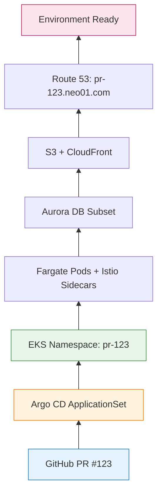
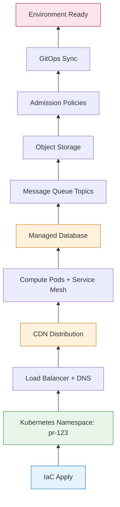
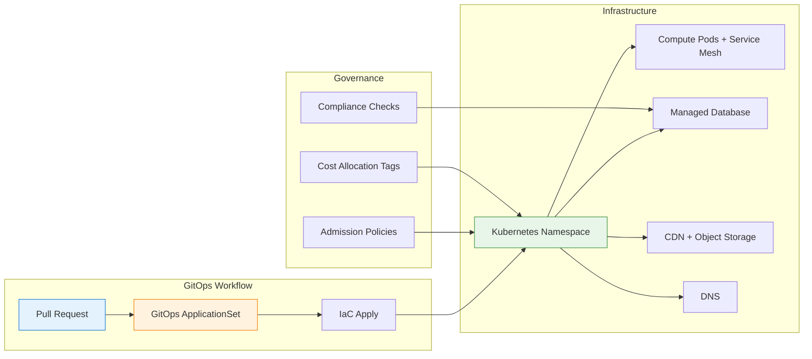

Every pull request your team opens—whether it's a simple bug fix or a complex feature spanning multiple microservices—can have its own isolated, production-like environment: **Environment on Demand** (EoD).

This pattern enables teams to:
- Spin up preview environments in minutes, not days
- Test changes in isolation before merging to main
- Validate infrastructure changes safely with Infrastructure as Code
- Automate cleanup when PRs close, avoiding cost waste

But it's also why teams adopting EoD hit similar pain points around **provisioning latency**, **CDN propagation delays**, **cost overruns**, and **operational complexity**. Here's the deep dive: what Environment on Demand is, why teams need it, how to architect it, and where reality bites back.

With this overview, let's dive deeper into what Environment on Demand truly entails, starting with its core definition.

---

## 1 What Is Environment on Demand?

**Environment on Demand** is an infrastructure pattern where development, staging, and preview environments are provisioned **automatically** via GitOps workflows, typically triggered by pull requests or branch pushes.

Each environment includes:
- Compute namespace or cluster (Kubernetes with serverless or node groups)
- Application deployments (microservices, frontend, backend)
- Supporting infrastructure (managed databases, message queues, object storage)
- Networking (load balancer ingress, DNS, CDN distributions)
- Policies (admission control, IAM roles, service mesh)

This **pull-based** model means infrastructure flows from Git, one commit at a time, until the environment is ready for testing.

!!! info "New to these concepts?"
    *   **GitOps**: An operational framework that takes DevOps best practices used for application development, like version control, collaboration, compliance, and CI/CD, and applies them to infrastructure automation. It means managing infrastructure and applications using Git as the single source of truth.
    *   **Argo CD**: A declarative, GitOps continuous delivery tool for Kubernetes. It automates the deployment of desired application states specified in Git repositories to Kubernetes clusters.
    *   **Terraform**: An open-source infrastructure as code (IaC) tool that allows you to define and provision infrastructure using a declarative configuration language. It can manage a wide range of cloud services and on-premise resources.
    *   **PR (Pull Request)**: A mechanism in version control systems (like Git) for a developer to notify team members that they have completed a feature or bug fix and are ready to merge their changes from a separate branch into the main codebase. It initiates a review process.

Given this foundational understanding, it's crucial to properly classify Environment on Demand. Is it a platform, a pattern, or something else entirely?

### Is It a Platform? A Pattern? Something Else?

Environment on Demand is often described using different terms. Here's the precise classification:

| Term | Is EoD This? | Why |
|------|--------------|-----|
| **Deployment Pattern** | ✅ **Most accurate** | Defines *how* environments are created and managed |
| **Architectural Pattern** | ✅ **Also correct** | Defines high-level structure (GitOps-driven, ephemeral resources) |
| **Platform** | ⚠️ **Partially** | Built *on top of* Kubernetes + CI/CD tools, but more than just a platform |
| **Software Architecture** | ❌ **Too broad** | It's *part of* a team's DevOps architecture, not the whole architecture |
| **Methodology** | ❌ **No** | It's an implementation pattern, not a process methodology |

**The Relationship:**

```
GitOps (Methodology)
        ↓
    Enables
        ↓
Environment on Demand (Deployment Pattern / Architectural Pattern)
        ↓
    Implemented with
        ↓
Argo CD + Terraform + Kubernetes (Platform Stack)
```

**Why the Confusion?**

| Source | Uses Term | Reason |
|--------|-----------|--------|
| **DevOps blogs** | "Platform" | Marketing; sounds more substantial |
| **Engineering teams** | "Pattern" | Familiar from architecture vocabulary |
| **Vendor docs** | "Solution" | Product-focused naming |
| **SRE teams** | "Workflow" | Operations-focused naming |

**The Precise Answer:**

Environment on Demand is best described as a **deployment pattern for infrastructure** that:
- Uses **GitOps methodology** as its foundation
- Defines a **provisioning model** (automatic, ephemeral, per-PR)
- Is **part of** a team's overall DevOps architecture

Think of it like this:
- **GitOps** = "How do I manage infrastructure via Git?"
- **Environment on Demand** = "How do I create isolated environments per PR?"
- **Argo CD + Terraform + Kubernetes** = "The actual tools that implement EoD"

To illustrate this concept, let's walk through a simple example of an Environment on Demand provisioning flow.

---

**Simple Example:**

```yaml
# PR #123 opens → GitOps workflow triggers
# Environment: pr-123.neo01.com
```

Provisions as:



**Provisioning Flow:**

```
Developer: "Open PR #123"
  ↓
GitHub Actions: "Trigger Terraform Cloud"
  ↓
Terraform: "Create namespace + resources"
  ↓
Argo CD: "Sync applications to namespace"
  ↓
Environment: "Ready at pr-123.neo01.com"
```

Each component is **independent**. The namespace doesn't know if pods run on Fargate or EC2. The DNS doesn't know if it's a preview or staging env. This **modularity** is EoD's superpower.

Now that we've seen a high-level overview, let's zoom in on the core mechanism enabling this, starting with the GitOps interface and Argo CD ApplicationSets.

---

## 2 The GitOps Interface: Argo CD ApplicationSets

In a GitOps-driven setup, every environment is represented as an **Argo CD Application** (or ApplicationSet for templated environments):

```yaml
# Simplified Argo CD ApplicationSet
apiVersion: argoproj.io/v1alpha1
kind: ApplicationSet
metadata:
  name: preview-environments
spec:
  generators:
    - pullRequest:
        github:
          api: https://api.github.com
          tokenRef:
            secretName: github-token
            key: token
          repo: neo01/neo01.com
          branch: main
  template:
    metadata:
      name: 'pr-{{number}}'
    spec:
      project: default
      source:
        repoURL: https://github.com/neo01/neo01.com
        targetRevision: 'pr-{{number}}'
        path: 'environments/preview'
      destination:
        server: https://kubernetes.default.svc
        namespace: 'pr-{{number}}'
      syncPolicy:
        automated:
          prune: true
          selfHeal: true
```

**The Contract:**

| Field | Meaning |
|-------|---------|
| `generators.pullRequest` | Watch for PRs, create env per PR |
| `template.metadata.name` | Environment name (e.g., `pr-123`) |
| `destination.namespace` | Kubernetes namespace isolation |
| `syncPolicy.automated` | Auto-sync on Git changes, prune on deletion |

**Generic Sync Loop:**

```yaml
# Argo CD continuously reconciles
while true; do
  desired_state = git_repo.get_latest()
  current_state = k8s_cluster.get_current()
  
  if desired_state != current_state
    k8s_cluster.apply(desired_state)
  
  sleep 3s  # Reconciliation interval
end
```

This loop—**reconcile Git to cluster, repeat**—is the entire GitOps model. Every environment, no matter how complex, reduces to this pattern.

Understanding the GitOps sync mechanism, let's explore how these environments translate into actual cloud resources, forming an 'infrastructure tree'.

---

## 3 Infrastructure Trees: How Environments Become Resources

When you open a PR, Terraform builds an **infrastructure tree**. Each node is a resource type with specific dependencies.

### Common Resource Types

| Resource | What It Does | Provisioning Time |
|----------|--------------|-------------------|
| **Kubernetes Namespace** | Logical isolation in cluster | < 1 minute |
| **Serverless Pods** | Compute (no node management) | 2-5 minutes |
| **Service Mesh Sidecars** | mTLS, traffic shaping | 1-2 minutes |
| **Admission Policies** | Security, compliance | < 1 minute |
| **Managed Database** | PostgreSQL/MySQL (can be serverless) | 10-15 minutes |
| **Message Queue Topics** | Kafka/RabbitMQ (or use shared cluster) | 5-10 minutes |
| **Object Storage** | Buckets (assets, uploads) | < 1 minute |
| **CDN** | Static asset distribution | 5-15 minutes |
| **DNS Records** | CNAME/ALIAS per environment | 1-5 minutes |
| **Load Balancer** | Path-based routing | 2-5 minutes |

### Example: Full Preview Environment

```hcl
# Simplified Terraform module
module "preview_env" {
  source = "./modules/preview"
  
  pr_number      = var.pr_number
  namespace      = "pr-${var.pr_number}"
  domain         = "pr-${var.pr_number}.neo01.com"
  image_tag      = var.image_tag
  cloud_region   = "ap-east-1"
  
  # Shared resources (cheaper, faster)
  shared_mq_cluster_arn = data.aws_mq_cluster.shared.arn
  shared_vpc_id          = data.aws_vpc.main.id
  
  # Auto-destroy after inactivity
  ttl_hours = 24
}
```

**Infrastructure Plan (Simplified):**



**Provisioning Flow (First Environment):**

```
1. Developer opens PR #123
2. CI/CD triggers IaC apply
3. IaC creates namespace (1 min)
4. IaC provisions managed database (10-15 min) ← Blocking
5. IaC creates CDN distribution (5-15 min) ← Blocking
6. IaC sets up DNS records (1-5 min)
7. GitOps syncs applications to namespace (2-5 min)
8. Compute pods start with sidecars (2-5 min)
9. Health checks pass, environment marked ready
10. Notification: "pr-123.neo01.com is ready"
```

Notice: **Database and CDN must complete before environment is usable**. These are **blocking resources**—they break the fast feedback loop.

!!! question "🤔 Why Does This Matter?"
    Blocking resources like databases, CDN, and message queues force IaC to **wait for cloud provider APIs** before proceeding. This means:

    - **Developer wait time** — 15-30 minutes before testing
    - **Cost accumulation** — Resources bill even while waiting
    - **Feedback delay** — Can't validate changes quickly

    When you see these in your IaC plan, ask: *"Can I use shared resources instead of per-env provisioning?"*

With a grasp of the provisioning process, it's time to analyze the effectiveness of Environment on Demand by examining its strengths and weaknesses.

---

## 4 Provisioning Models: The Good, The Bad, and The Slow

### The Good: Why EoD Works Well

**1. Isolation**

Each PR gets its own namespace with dedicated resources:

```yaml
# pr-123 can't affect pr-124
namespace: pr-123
resources:
  cpu_limit: 2
  memory_limit: 4Gi
  network_policy: deny-cross-namespace
```

**Blast Radius:** O(1) per environment (just that namespace)

---

**2. Modularity**

Environments compose from reusable modules. The same IaC module works with:
- Preview environments (per-PR)
- Staging environments (shared, long-lived)
- Development environments (persistent, team-specific)

No custom code needed for each tier.

---

**3. Automatic Cleanup**

```yaml
# GitOps + cron job
when PR.closed OR TTL.expired:
  delete namespace
  destroy IaC resources
  invalidate CDN cache (if needed)
  notify team: "Environment pr-123 destroyed"
```

Environments self-destruct after 24 hours of inactivity—no manual cleanup required.

---

**4. Audit Trail**

Every environment change is tracked in Git:

```bash
$ git log --oneline environments/preview/
a1b2c3d  feat: Add payment service to pr-123
e4f5g6h  fix: Update database config for pr-122
i7j8k9l  chore: Bump TTL to 24h for all previews
```

~3 lines of Git history. Easy to audit. Easy to rollback.

!!! tip "💡 Key Insight: Simplicity Enables Governance"
    Because every environment is defined in Git, compliance teams can review infrastructure changes just like code changes. This is why EoD works in regulated industries (finance, healthcare, wagering). The **GitOps audit trail** is what makes EoD compliant.

---

### The Bad: Where EoD Struggles

**1. Provisioning Latency**

Every environment requires:
- IaC apply (5-30 minutes)
- GitOps sync (2-5 minutes)
- Health checks (1-3 minutes)
- DNS propagation (1-5 minutes, or 10-15 for CDN)

For 10 concurrent PRs: **50-300 minutes of cumulative wait time**.

---

**2. CDN Propagation**

CDN invalidations for static assets complete in seconds to ~2-5 minutes globally, but can spike to 10-15+ minutes (or rarely hours during cloud provider peaks/API throttling).

**Challenges in EoD:**

```
Each ephemeral env needs:
  - Custom domain: pr-123.neo01.com
  - CDN behavior: /assets/* → Object Storage
  - DNS record: CNAME to CDN
  - Invalidation: /* (or use versioned paths)
```

When CI/CD/GitOps flows trigger invalidation per PR:
- PR merge → deploy → invalidate → user sees old content
- "Why isn't my change live?!"

---

**3. Cost Accumulation**

```
10-30 concurrent previews with:
  - Serverless compute: $0.04/vCPU-hour × 2 vCPU × 24h = ~$2/env/day
  - Managed database: $0.12/unit-hour × 2 units × 24h = ~$6/env/day
  - CDN: $0.085/GB (egress) + $0.009/10k requests
  - DNS: $0.50/hosted zone + $0.40/million queries
  - Load Balancer: $0.0225/hour + $0.008/LCU-hour
```

**Monthly cost for 20 envs:** ~$500-1500 (if aggressively torn down) to $3000-5000 (if left running)

---

**4. Dependency Complexity**

Some resources must coordinate across services:

| Blocking Dependency | Why It Blocks |
|---------------------|---------------|
| **Database init** | Must complete migrations before app starts |
| **CDN deploy** | Must have valid SSL cert (validation can take minutes) |
| **Message Queue topic creation** | Must exist before producers/consumers start |
| **Secrets sync** | Must have secrets manager entries before pods start |

When a blocking dependency is in the plan, **upstream resources can't proceed**—they must wait.

Having explored the trade-offs, let's look at a concrete cloud implementation of Environment on Demand, focusing on Kubernetes, serverless, and Infrastructure as Code.

---

## 5 Cloud Implementation: Example with Kubernetes + Serverless + IaC

In a production setup, the EoD stack typically uses cloud-native services. The following examples use AWS, but the patterns apply to Azure (AKS + Container Apps), GCP (GKE + Cloud Run), or any Kubernetes platform:

```hcl
# Simplified Terraform for Kubernetes namespace
resource "kubernetes_namespace" "preview" {
  metadata {
    name = "pr-${var.pr_number}"
    
    labels = {
      "app.kubernetes.io/name"       = "preview"
      "app.kubernetes.io/instance"   = "pr-${var.pr_number}"
      "environment.on-demand/owner"  = var.github_user
      "environment.on-demand/ttl"    = var.ttl_hours
    }
    
    annotations = {
      "environment.on-demand/created-at" = timestamp()
      "environment.on-demand/pr-url"     = var.pr_url
    }
  }
}

resource "kubernetes_pod" "app" {
  # ... Serverless pod spec with service mesh sidecar ...
}

resource "dns_record" "preview" {
  zone_id = data.dns_zone.main.zone_id
  name    = "pr-${var.pr_number}.neo01.com"
  type    = "A"
  
  alias {
    name                   = cdn_distribution.preview.domain_name
    zone_id                = cdn_distribution.preview.hosted_zone_id
    evaluate_target_health = true
  }
}
```

Each resource type implements its own provisioning logic:

| Resource Type | IaC Resource | Provisioning Complexity |
|---------------|--------------|------------------------|
| Kubernetes Namespace | `kubernetes_namespace` | Low (< 1 min) |
| Serverless Pods | `kubernetes_pod` | Medium (2-5 min) |
| Managed Database | `managed_database_cluster` | High (10-15 min) |
| CDN | `cdn_distribution` | High (5-15 min) |
| DNS | `dns_record` | Low (1-5 min) |
| Message Queue Topics | `mq_topic` (or shared) | Medium (5-10 min) |

### Example: CDN with Versioned Assets

```hcl
# Avoid invalidation by using versioned paths
resource "cdn_distribution" "preview" {
  origin {
    domain_name = object_storage.assets.bucket_regional_domain_name
    origin_id   = "Storage-pr-${var.pr_number}"
    
    # Custom origin path per PR
    origin_path = "/pr-${var.pr_number}"
  }
  
  # No invalidation needed if using /assets/v123/ paths
  # Instead of invalidating /*, use immutable caching
  default_cache_behavior {
    # ... cache policy with 1-year TTL for versioned assets ...
  }
  
  # Only invalidate on actual content changes
  # (handled by CI/CD, not per-deploy)
}
```

**Key Observations:**

1. **Versioned paths** avoid CDN invalidation entirely
2. **Namespace isolation** prevents cross-env contamination
3. **TTL annotations** enable automatic cleanup
4. **Delegates to child** resources via IaC dependencies

This pattern repeats across ~20-30 resource types per environment.

With an understanding of how EoD is implemented, let's now analyze its performance implications and identify scenarios where it truly shines or struggles.

---

## 6 Performance Implications: When EoD Shines vs. Struggles

### EoD Excels At:

| Workload | Why |
|----------|-----|
| **Feature development** (isolated testing) | Each dev gets their own env; no conflicts |
| **Integration testing** (multi-service) | Full stack available per PR |
| **Stakeholder demos** | Shareable URL (pr-123.neo01.com) |
| **Infrastructure changes** | IaC plan in PR, apply on merge |

**Example: Feature Branch Testing**

```yaml
# PR #123: Add payment gateway
environment: pr-123.neo01.com
services:
  - frontend:v1.2.3-pr123
  - backend:v1.2.3-pr123
  - payment-service:v2.0.0-pr123  # New service
database:
  - Managed database (migrated)
testing:
  - E2E tests pass
  - Stakeholder approval
```

- Developer opens PR → env provisions in 15-30 min
- QA tests on live environment
- Product owner reviews at shareable URL
- **Total feedback time:** 30-60 minutes (including provisioning)
- **EoD overhead:** Acceptable for feature work

---

### EoD Struggles At:

| Workload | Why |
|----------|-----|
| **Quick fixes** (typo, CSS tweak) | 15-30 min provisioning for 5-min change |
| **High-frequency iteration** (A/B testing) | Provisioning time exceeds dev time |
| **Resource-intensive testing** (load tests) | Compute/database limits per env |
| **Cross-PR dependencies** (PR #123 needs PR #124's changes) | Coordination overhead |

**Example: Hotfix Deployment**

```yaml
# Hotfix: Fix typo on homepage
# Expected: Deploy in 5 minutes
# Actual: 20-30 minutes (provisioning + testing)
```

- Developer opens PR → env provisions in 15-20 min
- QA validates fix (2 min)
- Merge → production deploy (5 min)
- **Total time:** 25-30 minutes
- **EoD overhead:** 80-90% of total time

!!! warning "⚠️ The Hidden Cost: Not Just Wait Time"
    The provisioning delay is only part of the problem. EoD also introduces:

    1. **Context switching** — Devs lose momentum waiting for envs
    2. **Debugging complexity** — Which env has the issue?
    3. **Cost uncertainty** — Unexpected bills from orphaned envs
    4. **Governance friction** — Compliance gates slow down "self-service"

    For quick iterations, these workflow inefficiencies often matter more than the provisioning time itself.

Given these performance challenges and potential overheads, it's worth exploring alternative approaches to Environment on Demand and understanding their respective trade-offs.

---

## 7 Alternative Approaches: The Trade-Offs

**Lightweight alternatives** (virtual clusters, namespace-only, shared staging) reduce provisioning time but sacrifice isolation:

```yaml
# Alternative 1: Namespace-only (no database, no CDN)
environment:
  type: namespace-isolation
  shared_resources:
    - database-cluster: shared-staging
    - cdn: shared-cdn
  provision_time: 2-5 minutes
  isolation: medium
```

**Execution:**

```yaml
while (pr = pull_request.opened) {
  # Create namespace only (no new database/CDN)
  kubectl.create_namespace(`pr-${pr.number}`)
  
  # Deploy apps with shared DB (schema-isolated)
  helm.install(apps, { namespace: `pr-${pr.number}` })
  
  # Notify when ready (2-5 min total)
  notify(`PR ${pr.number} env ready: pr-${pr.number}.neo01.com`)
}
```

**Benefits (Example):**

| Aspect | Full EoD (Per-Env Resources) | Lightweight (Namespace + Shared) |
|--------|------------------------------|----------------------------------|
| Provisioning time | 15-30 minutes | 2-5 minutes |
| Isolation | High (dedicated database, MQ) | Medium (shared DB, schema isolation) |
| Cost per env | $25-75/day | $5-15/day |
| Complexity | High (IaC + GitOps) | Medium (GitOps only) |
| Use case | Feature testing, compliance | Quick fixes, high-frequency iteration |

!!! question "🤔 So Why Not Always Use Lightweight?"
    If namespace-only is 6x faster and 5x cheaper, why provision full environments?

    - **Data isolation** — Some tests need dedicated DB (migrations, data seeding)
    - **Performance testing** — Shared resources skew load test results
    - **Compliance** — Regulated industries require env isolation (audit trails)
    - **Blast radius** — Bad config in one env shouldn't affect others

    The answer: **Tiered environments** (lightweight for quick fixes, full EoD for features).

---

### Why Teams Don't Standardize on One Approach

**1. Trade-Off Complexity**

Different PRs need different isolation levels:
- Typo fix → namespace-only (2 min)
- Database migration → full database (20 min)
- Frontend tweak → no CDN (direct load balancer)
- Payment feature → full isolation (compliance)

**2. Cost Coupling**

Full EoD for all PRs = 10x cost increase with no velocity gain for simple changes.

**3. Governance Requirements**

Regulated industries require audit trails, approval gates for certain resources (e.g., no public storage in previews).

Self-service ideal clashes with "needs review" for sensitive changes.

Bringing all these concepts together, let's summarize the architectural components and key characteristics of Environment on Demand.

---

## Summary: Environment on Demand Architecture



**Key Takeaways:**

| Aspect | Environment on Demand |
|--------|----------------------|
| **Interface** | GitOps (ApplicationSets + IaC) |
| **Structure** | Tiered environments (lightweight to full) |
| **Data flow** | Git → IaC → Kubernetes → Environment |
| **Memory** | Ephemeral (TTL-based cleanup) |
| **Best for** | Feature testing, integration, stakeholder demos |
| **Worst for** | Quick fixes, high-frequency iteration |

Environment on Demand isn't perfect—but for teams shipping fast on Kubernetes (whether EKS, AKS, GKE, or vanilla), it's the difference between "waiting days for an environment" and "testing in 15 minutes." Understanding the trade-offs helps you build EoD that works *with* your team's workflow, not against it.

!!! success "✅ Key Takeaway"
    Environment on Demand is a **trade-off**, not a silver bullet:

    - **Gains:** Isolation, self-service, audit trail, faster feedback
    - **Losses:** Provisioning latency, cost complexity, operational overhead

    For ~35-person teams in regulated industries, the gains outweigh the losses. For solo devs or simple apps, it's overkill.

    **Your job as a platform engineer:** Know which tier (lightweight vs. full) fits each use case—and automate the boring stuff (cleanup, notifications, cost tracking).

---

**What's Next?**

In **Part 2**, we'll dive into:
- **Environment Lifecycle Management** — Why staging should be permanent, previews ephemeral
- **The AI Coding Bottleneck** — Why agentic coding makes provisioning the new constraint
- **Deployment Strategies** — Blue-green vs. rolling vs. recreate for different tiers
- **ROI & Maturity Model** — How to measure success

[→ Read Part 2: Lifecycle, AI Coding & Optimization](/2026/02/Environment-on-Demand-Part2-Lifecycle/)

---

**Further Reading:**

- Argo CD Docs. ["ApplicationSet Generator"](https://argo-cd.readthedocs.io/en/stable/operator-manual/applicationset/Generators/) — PullRequest generator for per-PR envs
- Terraform/Cloud IaC. ["Run Triggers & Notifications"](https://developer.hashicorp.com/terraform/cloud-docs/workspaces/trigger/run-triggers) — Async provisioning workflows
- Admission Policies. ["Policies for Multi-Tenant Clusters"](https://kyverno.io/policies/) — Namespace isolation examples
