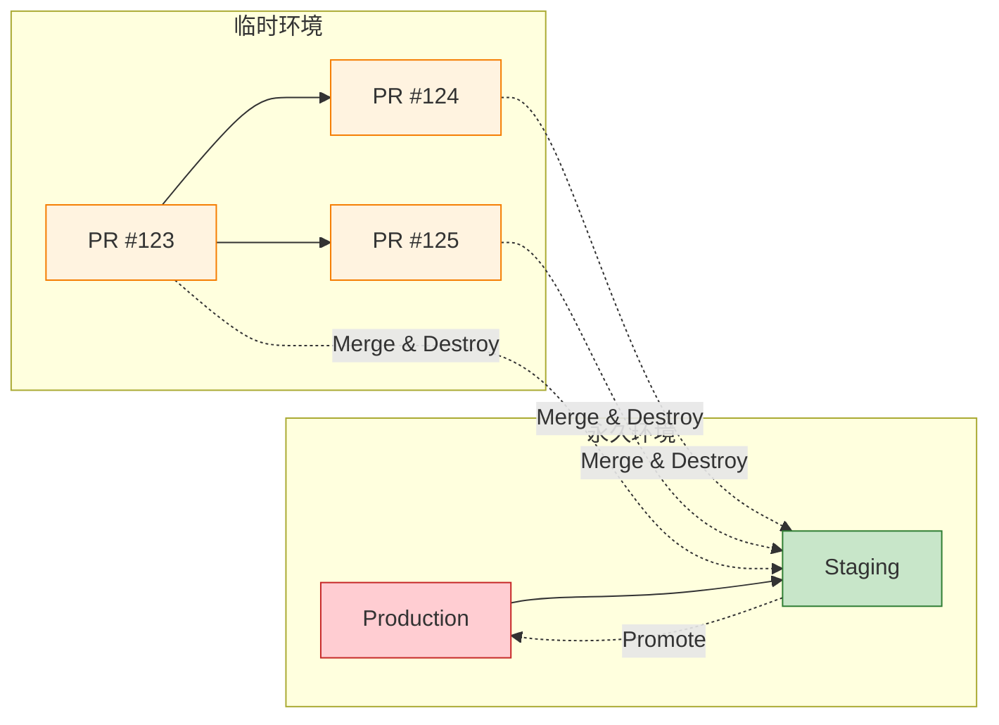

在 [第一篇](/zh-CN/2026/02/Environment-on-Demand-Part1-Architecture/) 中，我们涵盖了什么是按需环境以及如何架构设计它。现在我们深入探讨现实世界的挑战：管理环境生命周期、为什么 AI 辅助编码让资源配置成为新的瓶颈，以及不同部署层级的优化策略。

让我们首先检视 AI 辅助编码的快速演进如何在开发流程中创造新的瓶颈。

---

## 8 新的瓶颈：当 AI 编码超越配置速度

### Agentic Coding 和 Vibe Coding：10 倍开发人员速度

**AI 辅助开发**（Cursor、GitHub Copilot、Claude Code、Aider）的兴起已经从根本上改变了开发速度方程式：

| 时代 | 代码变更时间 | 环境等待 | 瓶颈 |
|-----|------------------|------------------|------------|
| **AI 前时代 (2020)** | 2-4 小时 | 5-10 分钟 | 编码 |
| **AI 辅助时代 (2024)** | 15-30 分钟 | 15-30 分钟 | **平衡** |
| **Agentic 编码时代 (2026)** | 2-5 分钟 | 15-30 分钟 | **资源配置** |

**Agentic coding（代理式编码）**（AI 代理自主编写、测试和重构代码）和 **vibe coding（感觉式编码）**（自然语言 → 几分钟内完成可运行代码）已经将某些任务的开发时间压缩了 **10-50 倍**：

```
开发人员："添加带有 OAuth2 的用户认证"

Pre-AI 工作流：
  - 研究 OAuth2 库：30 分钟
  - 实现认证流程：2-3 小时
  - 编写测试：1 小时
  - 总计：4-5 小时

Agentic coding 工作流 (2026)：
  - 提示 AI 代理：1 分钟
  - 审查生成的代码：5 分钟
  - 运行测试：2 分钟
  - 总计：8 分钟
```

!!! warning "⚠️ 新的挫折：8 分钟编码，25 分钟等待"
    当开发人员可以在 **5 分钟** 内实现功能但需要等待 **25 分钟** 获得环境时，EoD 的 ROI 崩溃：

    ```
    功能 A: 编码 (5 分钟) + 配置 (25 分钟) + 测试 (10 分钟) = 40 分钟
    功能 B: 编码 (5 分钟) + 配置 (25 分钟) + 测试 (10 分钟) = 40 分钟
    功能 C: 编码 (5 分钟) + 配置 (25 分钟) + 测试 (10 分钟) = 40 分钟

    总编码时间：15 分钟
    总等待时间：75 分钟
    效率：17% (编码) / 83% (等待)
    ```

    这就是为什么 **配置速度** 现在是使用 AI 编码工具团队的开发速度第一约束。

---

### 乘法效应：AI 编码 × EoD

当开发人员可以更快迭代时，他们会**更频繁地迭代**：

```
Pre-AI: 每个开发人员每周 2-3 个 PR
  → 35 人团队每月 60-90 个 PR
  → EoD 成本：约 $1,500-2,500/月

Agentic coding: 每个开发人员每周 10-15 个 PR
  → 35 人团队每月 300-500 个 PR
  → EoD 成本：约 $7,500-12,500/月（如果所有 PR 都使用完整 EoD）
```

**数学不会说谎：** AI 编码将 PR 数量增加 **5-7 倍**，这意味着：
- **配置队列** 成为瓶颈（云 API 速率限制、GitOps 并发）
- **成本爆炸** 如果每个 PR 都获得完整 EoD
- **开发人员挫折感** 增加，当环境花费比编码更长时间

**缓解策略：**

| 策略 | 描述 | 影响 |
|----------|-------------|--------|
| **分层环境** | 快速修复使用轻量级，功能使用完整 | 60-80% 成本降低 |
| **预热池** | 保持 5-10 个环境准备好克隆 | 5-10 分钟 → 1-2 分钟配置 |
| **共享预览基础设施** | 多个 PR 共享数据库/CDN | 50% 成本降低 |
| **异步配置** | PR 起草时开始配置 | 重叠编码 + 配置 |

理解了这个转变，有效管理环境生命周期和部署策略对于维持开发速度变得至关重要。

---

## 9 环境生命周期与部署策略

### 永久 vs. 临时：为什么这很重要

不是所有环境都是平等的。**生命周期** 和 **部署策略** 在永久和临时环境之间有根本不同：



| 方面 | Production | Staging | Preview (临时) |
|--------|------------|---------|---------------------|
| **生命期** | 永久（年） | 永久（月 - 年） | 临时（小时 - 天） |
| **部署** | 蓝绿、金丝雀 | 滚动、手动审批 | 自动、每 PR |
| **数据** | 真实用户数据 | 合成/脱敏生产数据 | 种子数据、测试固定数据 |
| **扩展** | 自动扩展到需求 | 固定、类生产 | 最小（仅用于测试） |
| **监控** | 24/7 警报、SLOs | 工作时间警报 | 按需调试 |
| **成本优先级** | 可靠性 > 成本 | 平衡 | 成本 > 可靠性 |
| **OPEX** | 高（合理） | 中 - 高 | 低（必须） |

---

### 为什么 Staging 应该是永久的

**Staging 是临时和生产之间的桥梁。** 它需要永久性来执行关键功能：

**1. 数据连续性**

```yaml
# Staging 需要稳定、类生产的数据
staging:
  database:
    - Managed database (production-sized)
    - Data refreshed weekly from prod (masked)
    - Schema migrations validated here first

# 临时环境无法维护这个
preview:
  database:
    - Serverless database (minimal units)
    - Seed data only (100-1000 rows)
    - Migrations run on each spin-up
```

**2. 集成验证**

```yaml
# 第三方集成需要稳定的端点
staging:
  integrations:
    - Payment gateway (sandbox mode)
    - Email provider (test templates)
    - SMS provider (whitelisted numbers)
    - Analytics (separate project ID)

# 这些集成需要几天/几周来设置
# 无法每个 PR 重新创建
```

**3. 性能基准**

```yaml
# Staging 提供一致的基准
staging:
  load_tests:
    - Run weekly with same parameters
    - Compare against historical baseline
    - Catch regressions before production

# 临时环境有可变资源
# 无法提供可靠的基准
```

**4. 利益相关者信心**

```yaml
# 产品、QA、高管需要「稳定」的环境
staging:
  url: staging.neo01.com (permanent)
  access: Shared with all stakeholders
  uptime: 99%+ target (not 95% like previews)

# 如果 staging URL 每周变更，信任侵蚀
```

---

### OPEX 权衡：永久 = 更高成本

**永久环境成本更高，但有充分理由：**

| 资源 | Staging (永久) | Preview (临时，24h TTL) |
|----------|---------------------|------------------------------|
| Managed Database | $150-300/月（固定） | $6-12/环境（仅活动时） |
| CDN | $50-100/月（持续） | $2-5/环境（短生命） |
| Compute | $200-400/月（始终开启） | $2-4/环境（仅测试时） |
| 工程时间 | 2-4 小时/月（维护） | 0（自动销毁） |
| **月成本** | **$400-800** | **$10-25 每环境** |

**关键洞察：** Staging 的较高 OPEX 被**摊销到所有 PR**。一个 staging 环境服务每月 300-500 个 PR，使每 PR 成本微不足道：

```
Staging 月成本：$600
每月 PR 数：400
每 PR 成本：$1.50

vs.

每 PR 完整 EoD: $25-75
使用 staging 节省：94-98%
```

---

鉴于永久 staging 的明显好处，让我们现在专注于如何有效管理临时环境的生命周期。

### 临时环境的生命周期管理

**临时环境必须有定义的生命周期以最小化 OPEX：**

```yaml
# 环境生命周期状态
lifecycle:
  states:
    - pending      # PR 开启，配置开始
    - ready        # 环境准备好测试
    - active       # 最近活动（TTL 内）
    - idle         # 无活动（接近 TTL）
    - expiring     # TTL 超过，发送警告
    - destroyed    # 资源清理

  transitions:
    pending → ready:     "配置完成"
    ready → active:      "首次部署成功"
    active → idle:       "12 小时无活动"
    idle → expiring:     "TTL 超过（24 小时）"
    expiring → destroyed: "清理完成"
    idle → active:       "检测到新活动（TTL 重置）"
```

**按环境层级的 TTL 策略：**

| 层级 | TTL | 重置触发 | 警告 | 自动销毁 |
|------|-----|---------------|---------|--------------|
| **Preview (轻量级)** | 4 小时 | 任何提交或测试 | 前 30 分钟 | 强制（无例外） |
| **Preview (完整)** | 24 小时 | 任何提交或测试 | 前 2 小时 | 强制（带快照） |
| **Preview (合规)** | 48 小时 | 手动扩展 | 前 4 小时 | 软性（需要审批） |
| **Staging** | 永久 | N/A | N/A | 从不（仅手动） |
| **Production** | 永久 | N/A | N/A | 从不（变更控制） |

---

### 部署策略差异

**永久和临时环境需要不同的部署策略：**

```yaml
# Production: 蓝绿（零停机，即时回滚）
production:
  strategy: blue-green
  health_check:
    - Readiness probe (30s interval)
    - Synthetic transactions
    - Error rate < 0.1%
  rollback:
    - Automatic on SLO breach
    - DNS switch (instant)

# Staging: 滚动（平衡速度和安全）
staging:
  strategy: rolling
  max_surge: 25%
  max_unavailable: 25%
  health_check:
    - Readiness probe (60s interval)
  rollback:
    - Manual approval
    - Revert Git commit

# Preview: 重建（最快，停机可接受）
preview:
  strategy: recreate
  health_check:
    - Readiness probe (30s interval, 3 failures)
  rollback:
    - Not needed (just push new commit)
  optimization:
    - Skip readiness for sidecars
    - Parallel pod startup
```

!!! tip "💡 关键洞察：策略匹配环境目的"
    部署策略应该匹配环境的**风险概况**和**生命期**：

    - **Production:** 零停机是强制性的 → 蓝绿
    - **Staging:** 在生产前捕捉问题 → 滚动（现实）
    - **Preview:** 速度超过可靠性 → 重建（最快）

    为预览环境使用蓝绿是**过度工程**，增加 5-10 分钟配置时间而无好处。

认识到没有单一策略适合所有情况，许多团队采用混合方法来利用永久和临时环境的优势。

---

## 10 混合方法：获得两者的最佳

一些团队将 EoD 与更轻量的替代方案混合：

### 分层环境策略

| 层级 | 配置 | 使用场景 | TTL |
|------|--------------|----------|-----|
| **Preview (轻量级)** | 命名空间 + 共享数据库 | 快速修复、WIP | 4 小时 |
| **Preview (完整)** | 命名空间 + 数据库 + CDN | 功能测试 | 24 小时 |
| **Staging (共享)** | 长期存在、类生产 | 最终验证 | 永久 |
| **Production** | 手动审批、蓝绿 | 实时流量 | 永久 |

### GitOps + IaC 编排

```yaml
# CI/CD 工作流
on:
  pull_request:
    types: [opened, synchronize, closed]
    paths:
      - 'services/**'
      - 'infrastructure/**'

jobs:
  provision:
    runs-on: ubuntu-latest
    steps:
      - name: Determine env tier
        id: tier
        run: |
          if [[ ${{ github.event.pull_request.labels }} == *"quick-fix"* ]]; then
            echo "tier=lightweight" >> $GITHUB_OUTPUT
          else
            echo "tier=full" >> $GITHUB_OUTPUT
          fi

      - name: IaC Apply
        uses: hashicorp/terraform-github-actions@v2
        with:
          cli_config_credentials_token: ${{ secrets.IAC_TOKEN }}
          workspace: preview-${{ steps.tier.outputs.tier }}

      - name: GitOps Sync
        uses: argoproj/argo-cd-action@v1
        with:
          app: pr-${{ github.event.pull_request.number }}

      - name: Notify Team
        uses: slackapi/slack-github-action@v1
        with:
          payload: |
            {
              "text": "✅ PR ${{ github.event.pull_request.number }} env ready: pr-${{ github.event.pull_request.number }}.neo01.com",
              "blocks": [
                {
                  "type": "section",
                  "text": {
                    "type": "mrkdwn",
                    "text": "*Environment Ready*\nPR: ${{ github.event.pull_request.title }}\nURL: <https://pr-${{ github.event.pull_request.number }}.neo01.com|Open>"
                  }
                }
              ]
            }
```

除了组合不同层级外，一些团队通过虚拟集群进一步增强隔离和速度。

### 虚拟集群实现更强隔离

```yaml
# 虚拟 Kubernetes 集群
# 提供命名空间级别隔离与集群级别抽象
# 运行在任何 Kubernetes 上（EKS、AKS、GKE、vanilla K8s）

apiVersion: v1
kind: Namespace
metadata:
  name: vcluster-pr-123
---
apiVersion: v1
kind: ServiceAccount
metadata:
  name: vcluster-pr-123
  namespace: vcluster-pr-123
---
# 部署虚拟集群
helm install vcluster-pr-123 vcluster/vcluster \
  --namespace vcluster-pr-123 \
  --set vcluster.image.tag=v0.18.0
```

**好处：**
- 每个 PR 获得自己的「虚拟集群」
- 比仅命名空间更强的隔离
- 比完整集群更快（无新控制平面）
- 成本：约 $5-10/天 vs. $25-75/天 完整 EoD

在这些混合模型的基础上，让我们探讨实际的优化策略，这些策略可以显著提高 EoD 的性能和成本效率。

---

## 11 实际优化策略

### 1. 使用版本化资产避免 CDN 失效

```yaml
# ❌ 错误：每次部署失效 /*
deploy:
  steps:
    - upload to object storage
    - cdn.invalidate(paths: ['/*'])  # 5-15 分钟等待

# ✅ 正确：版本化路径（不需要失效）
deploy:
  steps:
    - upload to object storage/pr-123/assets/v123/  # 不可变路径
    - update HTML to reference /assets/v123/
    # 不需要失效—新路径立即新鲜
```

!!! tip "💡 缓存策略很重要"
    CDN 缓存是「为什么我的变更没有上线？」挫折的第一来源。使用：

    - **版本化路径** (`/assets/v123/bundle.js`) — 从不失效
    - **Cache-Control headers** — 版本化 1 年，HTML 为 0
    - **Edge Functions** — 无需新分发的动态路由
    - **预览跳过 CDN** — 开发环境直接负载均衡器

    如果资产路径变更，CDN 将其视为新的—不需要失效。

---

### 2. 实施强制自动销毁

```yaml
# GitOps + cron job 用于清理
apiVersion: batch/v1
kind: CronJob
metadata:
  name: eod-cleanup
spec:
  schedule: "0 * * * *"  # 每小时
  jobTemplate:
    spec:
      template:
        spec:
          containers:
            - name: cleanup
              image: neo01/eod-cleanup:latest
              env:
                - name: TTL_HOURS
                  value: "24"
          restartPolicy: OnFailure
```

```python
# cleanup.py (简化)
import kubernetes
from datetime import datetime, timedelta

def is_expired(annotations, ttl_hours):
    created_at = datetime.fromisoformat(annotations['environment.on-demand/created-at'])
    return datetime.now() > created_at + timedelta(hours=ttl_hours)

namespaces = kubernetes.list_namespaces(label_selector='environment.on-demand/owner')
for ns in namespaces:
    if is_expired(ns.metadata.annotations, ttl_hours=24):
        kubernetes.delete_namespace(ns.metadata.name)
        iaC.destroy(workspace=f"pr-{ns.metadata.name}")
        notify(f"Environment {ns.metadata.name} destroyed (TTL expired)")
```

---

### 3. 使用预热模板

```hcl
# 保持「温热」命名空间模板准备好
resource "kubernetes_namespace" "template" {
  # 预创建的命名空间带有基础策略
  # PR 开启时克隆（比完整 IaC apply 更快）
}

# PR 开启时：
# 1. 克隆模板命名空间
# 2. 应用 PR 特定覆盖（image tags、DB 迁移）
# 3. 就绪时通知（5-10 分钟 vs. 20-30 分钟）
```

---

### 4. 实施异步通知

```yaml
# 不让开发人员等待—就绪时通知
ci_workflow:
  steps:
    - name: Start provisioning
      run: echo "Provisioning started for PR ${{ github.event.pull_request.number }}"

    - name: IaC Apply (async)
      run: |
        iaC apply -auto-approve &
        echo "Provisioning in background..."

    - name: Wait for GitOps sync
      run: |
        until gitops app wait pr-${{ github.event.pull_request.number }} --health; do
          sleep 30s
        done

    - name: Notify Team
      run: |
        notify-cli -d '#deployments' -m "✅ PR ${{ github.event.pull_request.number }} ready: pr-${{ github.event.pull_request.number }}.neo01.com"
```

有了各种优化技术可供使用，定义如何衡量 EoD 实施的成功和成熟度至关重要。

---

## 12 ROI & 成熟度模型：衡量 EoD 成功

### 定义 ROI

| 指标 | EoD 前 | EoD 后 | 改进 |
|--------|------------|-----------|-------------|
| **预览时间** | 1-2 天（手动设置） | 15-30 分钟（自动） | 95% 更快 |
| 环境/月 | 10-20（共享、争用） | 200-400（临时） | 10-20 倍更多 |
| **成本/环境** | $500-1000/月（长期） | $25-75/环境（临时） | 每环境便宜 80-90% |
| **总月成本** | $5,000-10,000 | $3,000-5,000 | 40-60% 降低 |
| **开发人员满意度** | 3.2/5（环境冲突） | 4.5/5（自助服务） | +40% |

**ROI 计算：**

```
好处：
  - 开发人员时间节省：10 devs × 2 hours/week × $100/hour = $2,000/week
  - 更快反馈循环：2x 部署频率 → 20% 更快上市时间
  - 减少环境冲突：80% 更少「在我的机器上可以运行」问题

成本：
  - 基础设施：$3,000-5,000/月（云账单）
  - 工具：$500-1,000/月（IaC 平台、监控）
  - 维护：0.2 FTE（自动化维护）

回收期：2-3 个月
年度 ROI: 200-400%
```

---

### 成熟度模型

| 级别 | 特征 | 配置时间 | 成本控制 | 治理 |
|-------|-----------------|-------------------|--------------|------------|
| **Level 0: 手动** | 手动环境设置、共享 staging | 1-2 天 | 低（孤儿资源） | 临时 |
| **Level 1: 自动** | IaC 脚本、手动触发 | 30-60 分钟 | 中（手动清理） | 基础（PR 审批） |
| **Level 2: GitOps** | GitOps 同步、每 PR 环境 | 15-30 分钟 | 高（自动销毁） | 基于策略（准入控制） |
| **Level 3: 优化** | 分层环境、异步通知 | 5-20 分钟 | 非常高（预算、警报） | 自动（策略 + 合规） |
| **Level 4: 自助服务** | 开发人员门户、一键环境 | 2-10 分钟 | 优秀（FinOps 集成） | 无形（内建到平台） |

**评估问题：**

```yaml
# 级别检查
provisioning_time:
  - "> 1 hour" → Level 0-1
  - "30-60 min" → Level 1
  - "15-30 min" → Level 2
  - "5-20 min" → Level 3
  - "< 10 min" → Level 4

cost_control:
  - "No auto-destroy" → Level 0-1
  - "Manual cleanup" → Level 1
  - "TTL-based destroy" → Level 2
  - "Budget alerts + auto-scaling" → Level 3
  - "Per-env cost allocation + chargeback" → Level 4

governance:
  - "No policies" → Level 0
  - "Manual review" → Level 1
  - "Admission control policies" → Level 2
  - "Automated compliance checks" → Level 3
  - "Audit trail + real-time monitoring" → Level 4
```

!!! info "📌 这对你的团队意味着什么"
    大多数约 35 人的团队从 **Level 1-2** 开始，在 6-12 个月内演进到 **Level 3**。关键是：

    - **简单开始** — 仅命名空间 + 共享资源
    - **添加自动化** — GitOps + IaC
    - **迭代优化** — 解决最大痛点（速度、成本、复杂性）
    - **衡量 ROI** — 追踪配置时间、每环境成本、开发人员满意度

    不要试图一次解决所有问题。先解决最大的挫折（通常是配置时间）。

---

## 总结：生命周期与优化

**关键要点：**

| 方面 | 洞察 |
|--------|---------|
| **AI 编码影响** | 10-50 倍更快编码 → 配置现在是瓶颈 |
| **Staging 策略** | 应该是永久（摊销成本、稳定验证） |
| **Preview 生命周期** | 必须有 TTL + 自动销毁（最小化 OPEX） |
| **部署策略** | 匹配风险概况（蓝绿 → 滚动 → 重建） |
| **ROI** | 年度 200-400%（对于约 35 人团队） |
| **成熟度旅程** | 4 个级别（手动 → 自助服务）超过 6-12 个月 |

---

**接下来是什么？**

在 **第三篇** 中，我们将探讨 EoD 的替代方案：
- **Mock Servers（模拟服务器）** — 何时模拟胜过配置
- **Feature Flags（功能标志）** — 在生产中测试无需环境
- **Dev Containers（开发容器）** — 一致的本地设置
- **CI/CD Optimization（CI/CD 优化）** — 更快流水线 vs. 更快环境
- **决策框架** — 为你的团队选择正确的加速器

[→ 阅读第三篇：替代生产力加速器](/zh-CN/2026/02/Environment-on-Demand-Part3-Alternatives/)

---

**进一步阅读：**

- [Mock 服务器：通过模拟加速开发](/zh-CN/2025/11/Mock-Servers-Accelerating-Development-Through-Simulation/) — 深入探讨基于模拟的开发
- LaunchDarkly. ["Feature Flag Best Practices"](https://docs.launchdarkly.com/guides/best-practices) — 何时使用标志 vs. 环境
- GitHub. ["Development Containers"](https://docs.github.com/en/codespaces/setting-up-your-project-for-codespaces/adding-a-dev-container-configuration) — 一致的本地环境
- Pact. ["Getting Started with Contract Testing"](https://docs.pact.io/getting_started) — 微服务的合约测试
