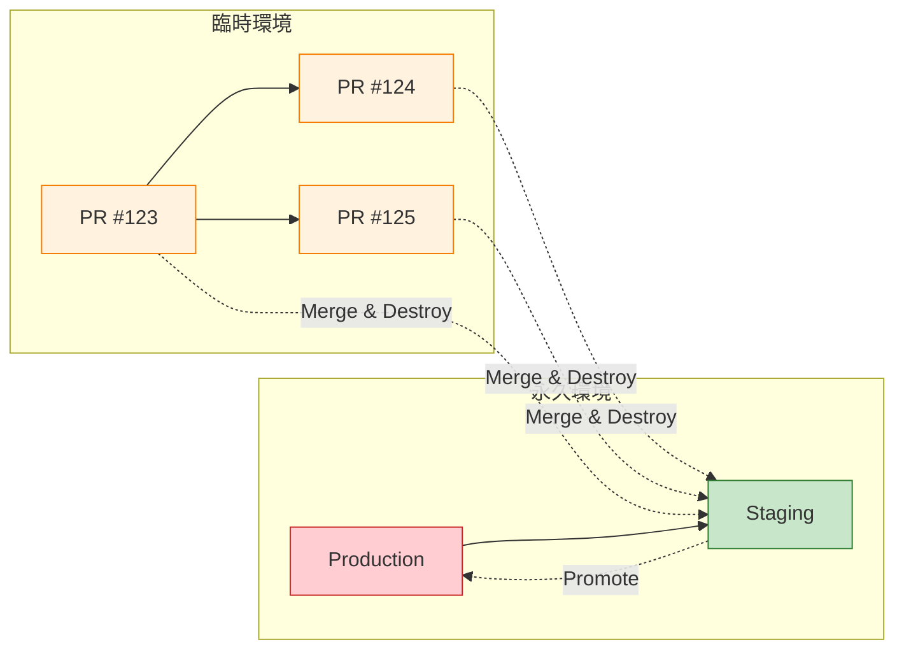

在 [第一篇](/2026/02/Environment-on-Demand-Part1-Architecture/) 中，我們涵蓋了什麼是按需環境以及如何架構設計它。現在我們深入探討現實世界的挑戰：管理環境生命週期、為什麼 AI 輔助編碼讓資源配置成為新的瓶頸，以及不同部署層級的優化策略。

讓我們首先檢視 AI 輔助編碼的快速演進如何在開發流程中創造新的瓶頸。

---

## 8 新的瓶頸：當 AI 編碼超越配置速度

### Agentic Coding 和 Vibe Coding：10 倍開發人員速度

**AI 輔助開發**（Cursor、GitHub Copilot、Claude Code、Aider）的興起已經從根本上改變了開發速度方程式：

| 時代 | 代碼變更時間 | 環境等待 | 瓶頸 |
|-----|------------------|------------------|------------|
| **AI 前時代 (2020)** | 2-4 小時 | 5-10 分鐘 | 編碼 |
| **AI 輔助時代 (2024)** | 15-30 分鐘 | 15-30 分鐘 | **平衡** |
| **Agentic 編碼時代 (2026)** | 2-5 分鐘 | 15-30 分鐘 | **資源配置** |

**Agentic coding（代理式編碼）**（AI 代理自主編寫、測試和重構代碼）和 **vibe coding（感覺式編碼）**（自然語言 → 幾分鐘內完成可運行代碼）已經將某些任務的開發時間壓縮了 **10-50 倍**：

```
開發人員："添加帶有 OAuth2 的用戶認證"

Pre-AI 工作流：
  - 研究 OAuth2 庫：30 分鐘
  - 實現認證流程：2-3 小時
  - 編寫測試：1 小時
  - 總計：4-5 小時

Agentic coding 工作流 (2026)：
  - 提示 AI 代理：1 分鐘
  - 審查生成的代碼：5 分鐘
  - 運行測試：2 分鐘
  - 總計：8 分鐘
```

!!! warning "⚠️ 新的挫折：8 分鐘編碼，25 分鐘等待"
    當開發人員可以在 **5 分鐘** 內實現功能但需要等待 **25 分鐘** 獲得環境時，EoD 的 ROI 崩潰：

    ```
    功能 A: 編碼 (5 分鐘) + 配置 (25 分鐘) + 測試 (10 分鐘) = 40 分鐘
    功能 B: 編碼 (5 分鐘) + 配置 (25 分鐘) + 測試 (10 分鐘) = 40 分鐘
    功能 C: 編碼 (5 分鐘) + 配置 (25 分鐘) + 測試 (10 分鐘) = 40 分鐘

    總編碼時間：15 分鐘
    總等待時間：75 分鐘
    效率：17% (編碼) / 83% (等待)
    ```

    這就是為什麼 **配置速度** 現在是使用 AI 編碼工具團隊的開發速度第一約束。

---

### 乘法效應：AI 編碼 × EoD

當開發人員可以更快迭代時，他們會**更頻繁地迭代**：

```
Pre-AI: 每個開發人員每週 2-3 個 PR
  → 35 人團隊每月 60-90 個 PR
  → EoD 成本：約 $1,500-2,500/月

Agentic coding: 每個開發人員每週 10-15 個 PR
  → 35 人團隊每月 300-500 個 PR
  → EoD 成本：約 $7,500-12,500/月（如果所有 PR 都使用完整 EoD）
```

**數學不會說謊：** AI 編碼將 PR 數量增加 **5-7 倍**，這意味著：
- **配置隊列** 成為瓶頸（雲 API 速率限制、GitOps 併發）
- **成本爆炸** 如果每個 PR 都獲得完整 EoD
- **開發人員挫折感** 增加，當環境花費比編碼更長時間

**緩解策略：**

| 策略 | 描述 | 影響 |
|----------|-------------|--------|
| **分層環境** | 快速修復使用輕量級，功能使用完整 | 60-80% 成本降低 |
| **預熱池** | 保持 5-10 個環境準備好克隆 | 5-10 分鐘 → 1-2 分鐘配置 |
| **共享預覽基礎設施** | 多個 PR 共享數據庫/CDN | 50% 成本降低 |
| **異步配置** | PR 起草時開始配置 | 重疊編碼 + 配置 |

理解了這個轉變，有效管理環境生命週期和部署策略對於維持開發速度變得至關重要。

---

## 9 環境生命週期與部署策略

### 永久 vs. 臨時：為什麼這很重要

不是所有環境都是平等的。**生命週期** 和 **部署策略** 在永久和臨時環境之間有根本不同：



| 方面 | Production | Staging | Preview (臨時) |
|--------|------------|---------|---------------------|
| **生命期** | 永久（年） | 永久（月 - 年） | 臨時（小時 - 天） |
| **部署** | 藍綠、金絲雀 | 滾動、手動審批 | 自動、每 PR |
| **數據** | 真實用戶數據 | 合成/脫敏生產數據 | 種子數據、測試固定數據 |
| **擴展** | 自動擴展到需求 | 固定、類生產 | 最小（僅用於測試） |
| **監控** | 24/7 警報、SLOs | 工作時間警報 | 按需調試 |
| **成本優先級** | 可靠性 > 成本 | 平衡 | 成本 > 可靠性 |
| **OPEX** | 高（合理） | 中 - 高 | 低（必須） |

---

### 為什麼 Staging 應該是永久的

**Staging 是臨時和生產之間的橋樑。** 它需要永久性來執行關鍵功能：

**1. 數據連續性**

```yaml
# Staging 需要穩定、類生產的數據
staging:
  database:
    - Managed database (production-sized)
    - Data refreshed weekly from prod (masked)
    - Schema migrations validated here first

# 臨時環境無法維護這個
preview:
  database:
    - Serverless database (minimal units)
    - Seed data only (100-1000 rows)
    - Migrations run on each spin-up
```

**2. 集成驗證**

```yaml
# 第三方集成需要穩定的端點
staging:
  integrations:
    - Payment gateway (sandbox mode)
    - Email provider (test templates)
    - SMS provider (whitelisted numbers)
    - Analytics (separate project ID)

# 這些集成需要幾天/幾週來設置
# 無法每個 PR 重新創建
```

**3. 性能基準**

```yaml
# Staging 提供一致的基準
staging:
  load_tests:
    - Run weekly with same parameters
    - Compare against historical baseline
    - Catch regressions before production

# 臨時環境有可變資源
# 無法提供可靠的基準
```

**4. 利益相關者信心**

```yaml
# 產品、QA、高管需要「穩定」的環境
staging:
  url: staging.neo01.com (permanent)
  access: Shared with all stakeholders
  uptime: 99%+ target (not 95% like previews)

# 如果 staging URL 每週變更，信任侵蝕
```

---

### OPEX 權衡：永久 = 更高成本

**永久環境成本更高，但有充分理由：**

| 資源 | Staging (永久) | Preview (臨時，24h TTL) |
|----------|---------------------|------------------------------|
| Managed Database | $150-300/月（固定） | $6-12/環境（僅活動時） |
| CDN | $50-100/月（持續） | $2-5/環境（短生命） |
| Compute | $200-400/月（始終開啟） | $2-4/環境（僅測試時） |
| 工程時間 | 2-4 小時/月（維護） | 0（自動銷毀） |
| **月成本** | **$400-800** | **$10-25 每環境** |

**關鍵洞察：** Staging 的較高 OPEX 被**攤銷到所有 PR**。一個 staging 環境服務每月 300-500 個 PR，使每 PR 成本微不足道：

```
Staging 月成本：$600
每月 PR 數：400
每 PR 成本：$1.50

vs.

每 PR 完整 EoD: $25-75
使用 staging 節省：94-98%
```

---

鑑於永久 staging 的明顯好處，讓我們現在專注於如何有效管理臨時環境的生命週期。

### 臨時環境的生命週期管理

**臨時環境必須有定義的生命週期以最小化 OPEX：**

```yaml
# 環境生命週期狀態
lifecycle:
  states:
    - pending      # PR 開啟，配置開始
    - ready        # 環境準備好測試
    - active       # 最近活動（TTL 內）
    - idle         # 無活動（接近 TTL）
    - expiring     # TTL 超過，發送警告
    - destroyed    # 資源清理

  transitions:
    pending → ready:     "配置完成"
    ready → active:      "首次部署成功"
    active → idle:       "12 小時無活動"
    idle → expiring:     "TTL 超過（24 小時）"
    expiring → destroyed: "清理完成"
    idle → active:       "檢測到新活動（TTL 重置）"
```

**按環境層級的 TTL 策略：**

| 層級 | TTL | 重置觸發 | 警告 | 自動銷毀 |
|------|-----|---------------|---------|--------------|
| **Preview (輕量級)** | 4 小時 | 任何提交或測試 | 前 30 分鐘 | 強制（無例外） |
| **Preview (完整)** | 24 小時 | 任何提交或測試 | 前 2 小時 | 強制（帶快照） |
| **Preview (合規)** | 48 小時 | 手動擴展 | 前 4 小時 | 軟性（需要審批） |
| **Staging** | 永久 | N/A | N/A | 從不（僅手動） |
| **Production** | 永久 | N/A | N/A | 從不（變更控制） |

---

### 部署策略差異

**永久和臨時環境需要不同的部署策略：**

```yaml
# Production: 藍綠（零停機，即時回滾）
production:
  strategy: blue-green
  health_check:
    - Readiness probe (30s interval)
    - Synthetic transactions
    - Error rate < 0.1%
  rollback:
    - Automatic on SLO breach
    - DNS switch (instant)

# Staging: 滾動（平衡速度和安全）
staging:
  strategy: rolling
  max_surge: 25%
  max_unavailable: 25%
  health_check:
    - Readiness probe (60s interval)
  rollback:
    - Manual approval
    - Revert Git commit

# Preview: 重建（最快，停機可接受）
preview:
  strategy: recreate
  health_check:
    - Readiness probe (30s interval, 3 failures)
  rollback:
    - Not needed (just push new commit)
  optimization:
    - Skip readiness for sidecars
    - Parallel pod startup
```

!!! tip "💡 關鍵洞察：策略匹配環境目的"
    部署策略應該匹配環境的**風險概況**和**生命期**：

    - **Production:** 零停機是強制性的 → 藍綠
    - **Staging:** 在生產前捕捉問題 → 滾動（現實）
    - **Preview:** 速度超過可靠性 → 重建（最快）

    為預覽環境使用藍綠是**過度工程**，增加 5-10 分鐘配置時間而無好處。

認識到沒有單一策略適合所有情況，許多團隊採用混合方法來利用永久和臨時環境的優勢。

---

## 10 混合方法：獲得兩者的最佳

一些團隊將 EoD 與更輕量的替代方案混合：

### 分層環境策略

| 層級 | 配置 | 使用場景 | TTL |
|------|--------------|----------|-----|
| **Preview (輕量級)** | 命名空間 + 共享數據庫 | 快速修復、WIP | 4 小時 |
| **Preview (完整)** | 命名空間 + 數據庫 + CDN | 功能測試 | 24 小時 |
| **Staging (共享)** | 長期存在、類生產 | 最終驗證 | 永久 |
| **Production** | 手動審批、藍綠 | 實時流量 | 永久 |

### GitOps + IaC 編排

```yaml
# CI/CD 工作流
on:
  pull_request:
    types: [opened, synchronize, closed]
    paths:
      - 'services/**'
      - 'infrastructure/**'

jobs:
  provision:
    runs-on: ubuntu-latest
    steps:
      - name: Determine env tier
        id: tier
        run: |
          if [[ ${{ github.event.pull_request.labels }} == *"quick-fix"* ]]; then
            echo "tier=lightweight" >> $GITHUB_OUTPUT
          else
            echo "tier=full" >> $GITHUB_OUTPUT
          fi

      - name: IaC Apply
        uses: hashicorp/terraform-github-actions@v2
        with:
          cli_config_credentials_token: ${{ secrets.IAC_TOKEN }}
          workspace: preview-${{ steps.tier.outputs.tier }}

      - name: GitOps Sync
        uses: argoproj/argo-cd-action@v1
        with:
          app: pr-${{ github.event.pull_request.number }}

      - name: Notify Team
        uses: slackapi/slack-github-action@v1
        with:
          payload: |
            {
              "text": "✅ PR ${{ github.event.pull_request.number }} env ready: pr-${{ github.event.pull_request.number }}.neo01.com",
              "blocks": [
                {
                  "type": "section",
                  "text": {
                    "type": "mrkdwn",
                    "text": "*Environment Ready*\nPR: ${{ github.event.pull_request.title }}\nURL: <https://pr-${{ github.event.pull_request.number }}.neo01.com|Open>"
                  }
                }
              ]
            }
```

除了組合不同層級外，一些團隊通過虛擬集群進一步增強隔離和速度。

### 虛擬集群實現更強隔離

```yaml
# 虛擬 Kubernetes 集群
# 提供命名空間級別隔離與集群級別抽象
# 運行在任何 Kubernetes 上（EKS、AKS、GKE、vanilla K8s）

apiVersion: v1
kind: Namespace
metadata:
  name: vcluster-pr-123
---
apiVersion: v1
kind: ServiceAccount
metadata:
  name: vcluster-pr-123
  namespace: vcluster-pr-123
---
# 部署虛擬集群
helm install vcluster-pr-123 vcluster/vcluster \
  --namespace vcluster-pr-123 \
  --set vcluster.image.tag=v0.18.0
```

**好處：**
- 每個 PR 獲得自己的「虛擬集群」
- 比僅命名空間更強的隔離
- 比完整集群更快（無新控制平面）
- 成本：約 $5-10/天 vs. $25-75/天 完整 EoD

在這些混合模型的基礎上，讓我們探討實際的優化策略，這些策略可以顯著提高 EoD 的性能和成本效率。

---

## 11 實際優化策略

### 1. 使用版本化資產避免 CDN 失效

```yaml
# ❌ 錯誤：每次部署失效 /*
deploy:
  steps:
    - upload to object storage
    - cdn.invalidate(paths: ['/*'])  # 5-15 分鐘等待

# ✅ 正確：版本化路徑（不需要失效）
deploy:
  steps:
    - upload to object storage/pr-123/assets/v123/  # 不可變路徑
    - update HTML to reference /assets/v123/
    # 不需要失效—新路徑立即新鮮
```

!!! tip "💡 緩存策略很重要"
    CDN 緩存是「為什麼我的變更沒有上線？」挫折的第一來源。使用：

    - **版本化路徑** (`/assets/v123/bundle.js`) — 從不失效
    - **Cache-Control headers** — 版本化 1 年，HTML 為 0
    - **Edge Functions** — 無需新分發的動態路由
    - **預覽跳過 CDN** — 開發環境直接負載均衡器

    如果資產路徑變更，CDN 將其視為新的—不需要失效。

---

### 2. 實施強制自動銷毀

```yaml
# GitOps + cron job 用於清理
apiVersion: batch/v1
kind: CronJob
metadata:
  name: eod-cleanup
spec:
  schedule: "0 * * * *"  # 每小時
  jobTemplate:
    spec:
      template:
        spec:
          containers:
            - name: cleanup
              image: neo01/eod-cleanup:latest
              env:
                - name: TTL_HOURS
                  value: "24"
          restartPolicy: OnFailure
```

```python
# cleanup.py (簡化)
import kubernetes
from datetime import datetime, timedelta

def is_expired(annotations, ttl_hours):
    created_at = datetime.fromisoformat(annotations['environment.on-demand/created-at'])
    return datetime.now() > created_at + timedelta(hours=ttl_hours)

namespaces = kubernetes.list_namespaces(label_selector='environment.on-demand/owner')
for ns in namespaces:
    if is_expired(ns.metadata.annotations, ttl_hours=24):
        kubernetes.delete_namespace(ns.metadata.name)
        iaC.destroy(workspace=f"pr-{ns.metadata.name}")
        notify(f"Environment {ns.metadata.name} destroyed (TTL expired)")
```

---

### 3. 使用預熱模板

```hcl
# 保持「溫熱」命名空間模板準備好
resource "kubernetes_namespace" "template" {
  # 預創建的命名空間帶有基礎策略
  # PR 開啟時克隆（比完整 IaC apply 更快）
}

# PR 開啟時：
# 1. 克隆模板命名空間
# 2. 應用 PR 特定覆蓋（image tags、DB 遷移）
# 3. 就緒時通知（5-10 分鐘 vs. 20-30 分鐘）
```

---

### 4. 實施異步通知

```yaml
# 不讓開發人員等待—就緒時通知
ci_workflow:
  steps:
    - name: Start provisioning
      run: echo "Provisioning started for PR ${{ github.event.pull_request.number }}"

    - name: IaC Apply (async)
      run: |
        iaC apply -auto-approve &
        echo "Provisioning in background..."

    - name: Wait for GitOps sync
      run: |
        until gitops app wait pr-${{ github.event.pull_request.number }} --health; do
          sleep 30s
        done

    - name: Notify Team
      run: |
        notify-cli -d '#deployments' -m "✅ PR ${{ github.event.pull_request.number }} ready: pr-${{ github.event.pull_request.number }}.neo01.com"
```

有了各種優化技術可供使用，定義如何衡量 EoD 實施的成功和成熟度至關重要。

---

## 12 ROI & 成熟度模型：衡量 EoD 成功

### 定義 ROI

| 指標 | EoD 前 | EoD 後 | 改進 |
|--------|------------|-----------|-------------|
| **預覽時間** | 1-2 天（手動設置） | 15-30 分鐘（自動） | 95% 更快 |
| 環境/月 | 10-20（共享、爭用） | 200-400（臨時） | 10-20 倍更多 |
| **成本/環境** | $500-1000/月（長期） | $25-75/環境（臨時） | 每環境便宜 80-90% |
| **總月成本** | $5,000-10,000 | $3,000-5,000 | 40-60% 降低 |
| **開發人員滿意度** | 3.2/5（環境衝突） | 4.5/5（自助服務） | +40% |

**ROI 計算：**

```
好處：
  - 開發人員時間節省：10 devs × 2 hours/week × $100/hour = $2,000/week
  - 更快反饋循環：2x 部署頻率 → 20% 更快上市時間
  - 減少環境衝突：80% 更少「在我的機器上可以運行」問題

成本：
  - 基礎設施：$3,000-5,000/月（雲賬單）
  - 工具：$500-1,000/月（IaC 平台、監控）
  - 維護：0.2 FTE（自動化維護）

回收期：2-3 個月
年度 ROI: 200-400%
```

---

### 成熟度模型

| 級別 | 特徵 | 配置時間 | 成本控制 | 治理 |
|-------|-----------------|-------------------|--------------|------------|
| **Level 0: 手動** | 手動環境設置、共享 staging | 1-2 天 | 低（孤兒資源） | 臨時 |
| **Level 1: 自動** | IaC 腳本、手動觸發 | 30-60 分鐘 | 中（手動清理） | 基礎（PR 審批） |
| **Level 2: GitOps** | GitOps 同步、每 PR 環境 | 15-30 分鐘 | 高（自動銷毀） | 基於策略（准入控制） |
| **Level 3: 優化** | 分層環境、異步通知 | 5-20 分鐘 | 非常高（預算、警報） | 自動（策略 + 合規） |
| **Level 4: 自助服務** | 開發人員門戶、一鍵環境 | 2-10 分鐘 | 優秀（FinOps 集成） | 無形（內建到平台） |

**評估問題：**

```yaml
# 級別檢查
provisioning_time:
  - "> 1 hour" → Level 0-1
  - "30-60 min" → Level 1
  - "15-30 min" → Level 2
  - "5-20 min" → Level 3
  - "< 10 min" → Level 4

cost_control:
  - "No auto-destroy" → Level 0-1
  - "Manual cleanup" → Level 1
  - "TTL-based destroy" → Level 2
  - "Budget alerts + auto-scaling" → Level 3
  - "Per-env cost allocation + chargeback" → Level 4

governance:
  - "No policies" → Level 0
  - "Manual review" → Level 1
  - "Admission control policies" → Level 2
  - "Automated compliance checks" → Level 3
  - "Audit trail + real-time monitoring" → Level 4
```

!!! info "📌 這對你的團隊意味著什麼"
    大多數約 35 人的團隊從 **Level 1-2** 開始，在 6-12 個月內演進到 **Level 3**。關鍵是：

    - **簡單開始** — 僅命名空間 + 共享資源
    - **添加自動化** — GitOps + IaC
    - **迭代優化** — 解決最大痛點（速度、成本、複雜性）
    - **衡量 ROI** — 追蹤配置時間、每環境成本、開發人員滿意度

    不要試圖一次解決所有問題。先解決最大的挫折（通常是配置時間）。

---

## 總結：生命週期與優化

**關鍵要點：**

| 方面 | 洞察 |
|--------|---------|
| **AI 編碼影響** | 10-50 倍更快編碼 → 配置現在是瓶頸 |
| **Staging 策略** | 應該是永久（攤銷成本、穩定驗證） |
| **Preview 生命週期** | 必須有 TTL + 自動銷毀（最小化 OPEX） |
| **部署策略** | 匹配風險概況（藍綠 → 滾動 → 重建） |
| **ROI** | 年度 200-400%（對於約 35 人團隊） |
| **成熟度旅程** | 4 個級別（手動 → 自助服務）超過 6-12 個月 |

---

**接下來是什麼？**

在 **第三篇** 中，我們將探討 EoD 的替代方案：
- **Mock Servers（模擬伺服器）** — 何時模擬勝過配置
- **Feature Flags（功能標誌）** — 在生產中測試無需環境
- **Dev Containers（開發容器）** — 一致的本地設置
- **CI/CD Optimization（CI/CD 優化）** — 更快流水線 vs. 更快環境
- **決策框架** — 為你的團隊選擇正確的加速器

[→ 閱讀第三篇：替代生產力加速器](/2026/02/Environment-on-Demand-Part3-Alternatives/)

---

**進一步閱讀：**

- [Mock 伺服器：透過模擬加速開發](/zh-TW/2025/11/Mock-Servers-Accelerating-Development-Through-Simulation/) — 深入探討基於模擬的開發
- LaunchDarkly. ["Feature Flag Best Practices"](https://docs.launchdarkly.com/guides/best-practices) — 何時使用標誌 vs. 環境
- GitHub. ["Development Containers"](https://docs.github.com/en/codespaces/setting-up-your-project-for-codespaces/adding-a-dev-container-configuration) — 一致的本地環境
- Pact. ["Getting Started with Contract Testing"](https://docs.pact.io/getting_started) — 微服務的合約測試
