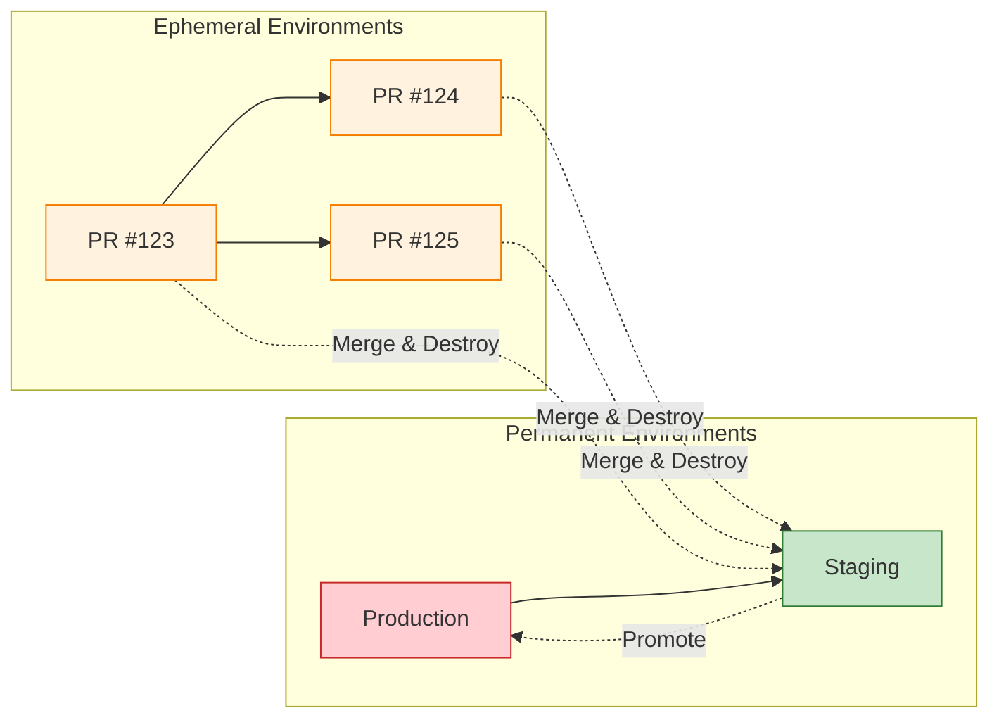

In [Part 1](/2026/02/Environment-on-Demand-Part1-Architecture/), we covered what Environment on Demand is and how to architect it. Now we dive into the real-world challenges: managing environment lifecycles, why AI-assisted coding has made provisioning the new bottleneck, and optimization strategies for different deployment tiers.

Let's begin by examining how the rapid evolution of AI-assisted coding has created a new bottleneck in the development process.

---

## 8 The New Bottleneck: When AI Coding Outpaces Provisioning

### Agentic Coding and Vibe Coding: 10x Developer Velocity

The rise of **AI-assisted development** (Cursor, GitHub Copilot, Claude Code, Aider) has fundamentally changed the development speed equation:

| Era | Code Change Time | Environment Wait | Bottleneck |
|-----|------------------|------------------|------------|
| **Pre-AI (2020)** | 2-4 hours | 5-10 minutes | Coding |
| **AI-Assisted (2024)** | 15-30 minutes | 15-30 minutes | **Balanced** |
| **Agentic Coding (2026)** | 2-5 minutes | 15-30 minutes | **Provisioning** |

**Agentic coding** (AI agents that write, test, and refactor code autonomously) and **vibe coding** (natural language → working code in minutes) have compressed development time by **10-50x** for certain tasks:

```
Developer: "Add user authentication with OAuth2"

Pre-AI workflow:
  - Research OAuth2 libraries: 30 min
  - Implement auth flow: 2-3 hours
  - Write tests: 1 hour
  - Total: 4-5 hours

Agentic coding workflow (2026):
  - Prompt AI agent: 1 min
  - Review generated code: 5 min
  - Run tests: 2 min
  - Total: 8 minutes
```

!!! warning "⚠️ The New Frustration: 8 Minutes Coding, 25 Minutes Waiting"
    When a developer can implement a feature in **5 minutes** but waits **25 minutes** for the environment, the ROI of EoD collapses:

    ```
    Feature A: Code (5 min) + Provision (25 min) + Test (10 min) = 40 min
    Feature B: Code (5 min) + Provision (25 min) + Test (10 min) = 40 min
    Feature C: Code (5 min) + Provision (25 min) + Test (10 min) = 40 min

    Total coding: 15 minutes
    Total waiting: 75 minutes
    Efficiency: 17% (coding) / 83% (waiting)
    ```

    This is why **provisioning speed** is now the #1 constraint on developer velocity for teams using AI coding tools.

---

### The Multiplication Effect: AI Coding × EoD

When developers can iterate faster, they **iterate more often**:

```
Pre-AI: 2-3 PRs per developer per week
  → 60-90 PRs/month for 35-person team
  → EoD cost: ~$1,500-2,500/month

Agentic coding: 10-15 PRs per developer per week
  → 300-500 PRs/month for 35-person team
  → EoD cost: ~$7,500-12,500/month (if full EoD for all)
```

**The math doesn't lie:** AI coding increases PR volume by **5-7x**, which means:
- **Provisioning queue** becomes a bottleneck (cloud API rate limits, GitOps concurrency)
- **Cost explodes** if every PR gets full EoD
- **Developer frustration** increases when environments take longer than coding

**Mitigation Strategies:**

| Strategy | Description | Impact |
|----------|-------------|--------|
| **Tiered environments** | Lightweight for quick fixes, full for features | 60-80% cost reduction |
| **Pre-warmed pools** | Keep 5-10 environments ready to clone | 5-10 min → 1-2 min provisioning |
| **Shared preview infrastructure** | Multiple PRs share database/CDN | 50% cost reduction |
| **Async provisioning** | Start provisioning when PR is drafted | Overlap coding + provisioning |

Understanding this shift, it becomes critical to effectively manage environment lifecycles and deployment strategies to maintain developer velocity.

---

## 9 Environment Lifecycle & Deployment Strategy

### Permanent vs. Ephemeral: Why It Matters

Not all environments are created equal. The **lifecycle** and **deployment strategy** differ fundamentally between permanent and ephemeral environments:



| Aspect | Production | Staging | Preview (Ephemeral) |
|--------|------------|---------|---------------------|
| **Lifetime** | Permanent (years) | Permanent (months-years) | Temporary (hours-days) |
| **Deployment** | Blue-green, canary | Rolling, manual approval | Automated, per-PR |
| **Data** | Real user data | Synthetic/masked prod data | Seed data, test fixtures |
| **Scaling** | Auto-scale to demand | Fixed, production-like | Minimal (just for testing) |
| **Monitoring** | 24/7 alerts, SLOs | Business hours alerts | On-demand debugging |
| **Cost priority** | Reliability > Cost | Balance | Cost > Reliability |
| **OPEX** | High (justified) | Medium-High | Low (must be) |

---

### Why Staging Should Be Permanent

**Staging is the bridge between ephemeral and production.** It serves critical functions that require permanence:

**1. Data Continuity**

```yaml
# Staging needs stable, production-like data
staging:
  database:
    - Managed database (production-sized)
    - Data refreshed weekly from prod (masked)
    - Schema migrations validated here first

# Ephemeral envs can't maintain this
preview:
  database:
    - Serverless database (minimal units)
    - Seed data only (100-1000 rows)
    - Migrations run on each spin-up
```

**2. Integration Validation**

```yaml
# Third-party integrations need stable endpoints
staging:
  integrations:
    - Payment gateway (sandbox mode)
    - Email provider (test templates)
    - SMS provider (whitelisted numbers)
    - Analytics (separate project ID)

# These integrations take days/weeks to set up
# Can't recreate per PR
```

**3. Performance Baseline**

```yaml
# Staging provides consistent benchmark
staging:
  load_tests:
    - Run weekly with same parameters
    - Compare against historical baseline
    - Catch regressions before production

# Ephemeral envs have variable resources
# Can't provide reliable benchmarks
```

**4. Stakeholder Confidence**

```yaml
# Product, QA, executives need a "stable" environment
staging:
  url: staging.neo01.com (permanent)
  access: Shared with all stakeholders
  uptime: 99%+ target (not 95% like previews)

# If staging URL changes weekly, trust erodes
```

---

### The OPEX Trade-Off: Permanent = Higher Cost

**Permanent environments cost more, but for good reasons:**

| Resource | Staging (Permanent) | Preview (Ephemeral, 24h TTL) |
|----------|---------------------|------------------------------|
| Managed Database | $150-300/month (fixed) | $6-12/env (only when active) |
| CDN | $50-100/month (continuous) | $2-5/env (short-lived) |
| Compute | $200-400/month (always on) | $2-4/env (only when testing) |
| Engineering time | 2-4 hours/month (maintenance) | 0 (auto-destroy) |
| **Monthly cost** | **$400-800** | **$10-25 per env** |

**The key insight:** Staging's higher OPEX is **amortized across all PRs**. One staging environment serves 300-500 PRs/month, making the per-PR cost negligible:

```
Staging monthly cost: $600
PRs per month: 400
Cost per PR: $1.50

vs.

Full EoD per PR: $25-75
Savings with staging: 94-98%
```

---

Given the clear benefits of permanent staging, let's now focus on how to efficiently manage the lifecycle of ephemeral environments.

### Lifecycle Management for Ephemeral Environments

**Ephemeral environments must have a defined lifecycle to minimize OPEX:**

```yaml
# Environment lifecycle states
lifecycle:
  states:
    - pending      # PR opened, provisioning started
    - ready        # Environment ready for testing
    - active       # Recent activity (within TTL)
    - idle         # No activity (approaching TTL)
    - expiring     # TTL exceeded, warning sent
    - destroyed    # Resources cleaned up

  transitions:
    pending → ready:     "Provisioning complete"
    ready → active:      "First deployment successful"
    active → idle:       "No activity for 12 hours"
    idle → expiring:     "TTL exceeded (24 hours)"
    expiring → destroyed: "Cleanup complete"
    idle → active:       "New activity detected (TTL reset)"
```

**TTL Strategy by Environment Tier:**

| Tier | TTL | Reset Trigger | Warning | Auto-Destroy |
|------|-----|---------------|---------|--------------|
| **Preview (Lightweight)** | 4 hours | Any commit or test | 30 min before | Hard (no exceptions) |
| **Preview (Full)** | 24 hours | Any commit or test | 2 hours before | Hard (with snapshot) |
| **Preview (Compliance)** | 48 hours | Manual extension | 4 hours before | Soft (requires approval) |
| **Staging** | Permanent | N/A | N/A | Never (manual only) |
| **Production** | Permanent | N/A | N/A | Never (change control) |

---

### Deployment Strategy Differences

**Permanent and ephemeral environments need different deployment strategies:**

```yaml
# Production: Blue-Green (zero downtime, instant rollback)
production:
  strategy: blue-green
  health_check:
    - Readiness probe (30s interval)
    - Synthetic transactions
    - Error rate < 0.1%
  rollback:
    - Automatic on SLO breach
    - DNS switch (instant)

# Staging: Rolling (balance speed and safety)
staging:
  strategy: rolling
  max_surge: 25%
  max_unavailable: 25%
  health_check:
    - Readiness probe (60s interval)
  rollback:
    - Manual approval
    - Revert Git commit

# Preview: Recreate (fastest, downtime acceptable)
preview:
  strategy: recreate
  health_check:
    - Readiness probe (30s interval, 3 failures)
  rollback:
    - Not needed (just push new commit)
  optimization:
    - Skip readiness for sidecars
    - Parallel pod startup
```

!!! tip "💡 Key Insight: Match Strategy to Environment Purpose"
    The deployment strategy should match the environment's **risk profile** and **lifetime**:

    - **Production:** Zero downtime is mandatory → Blue-green
    - **Staging:** Catch issues before prod → Rolling (realistic)
    - **Preview:** Speed over reliability → Recreate (fastest)

    Using blue-green for preview environments is **over-engineering** that adds 5-10 minutes to provisioning with no benefit.

Recognizing that no single strategy fits all, many teams adopt hybrid approaches to leverage the strengths of both permanent and ephemeral environments.

---

## 10 Hybrid Approaches: Getting the Best of Both

Some teams blend EoD with lighter alternatives:

### Tiered Environment Strategy

| Tier | Provisioning | Use Case | TTL |
|------|--------------|----------|-----|
| **Preview (Lightweight)** | Namespace + shared database | Quick fixes, WIP | 4 hours |
| **Preview (Full)** | Namespace + database + CDN | Feature testing | 24 hours |
| **Staging (Shared)** | Long-lived, production-like | Final validation | Permanent |
| **Production** | Manual approval, blue-green | Live traffic | Permanent |

### GitOps + IaC Orchestration

```yaml
# CI/CD workflow
on:
  pull_request:
    types: [opened, synchronize, closed]
    paths:
      - 'services/**'
      - 'infrastructure/**'

jobs:
  provision:
    runs-on: ubuntu-latest
    steps:
      - name: Determine env tier
        id: tier
        run: |
          if [[ ${{ github.event.pull_request.labels }} == *"quick-fix"* ]]; then
            echo "tier=lightweight" >> $GITHUB_OUTPUT
          else
            echo "tier=full" >> $GITHUB_OUTPUT
          fi
      
      - name: IaC Apply
        uses: hashicorp/terraform-github-actions@v2
        with:
          cli_config_credentials_token: ${{ secrets.IAC_TOKEN }}
          workspace: preview-${{ steps.tier.outputs.tier }}
      
      - name: GitOps Sync
        uses: argoproj/argo-cd-action@v1
        with:
          app: pr-${{ github.event.pull_request.number }}
      
      - name: Notify Team
        uses: slackapi/slack-github-action@v1
        with:
          payload: |
            {
              "text": "✅ PR ${{ github.event.pull_request.number }} env ready: pr-${{ github.event.pull_request.number }}.neo01.com",
              "blocks": [
                {
                  "type": "section",
                  "text": {
                    "type": "mrkdwn",
                    "text": "*Environment Ready*\nPR: ${{ github.event.pull_request.title }}\nURL: <https://pr-${{ github.event.pull_request.number }}.neo01.com|Open>"
                  }
                }
              }
              }
              ```

              Beyond combining different tiers, some teams further enhance isolation and speed through virtual clusters.

              ### Virtual Clusters for Stronger Isolation

```yaml
# Virtual Kubernetes cluster
# Provides namespace-level isolation with cluster-level abstraction
# Runs on any Kubernetes (EKS, AKS, GKE, vanilla K8s)

apiVersion: v1
kind: Namespace
metadata:
  name: vcluster-pr-123
---
apiVersion: v1
kind: ServiceAccount
metadata:
  name: vcluster-pr-123
  namespace: vcluster-pr-123
---
# Deploy virtual cluster
helm install vcluster-pr-123 vcluster/vcluster \
  --namespace vcluster-pr-123 \
  --set vcluster.image.tag=v0.18.0
```

**Benefits:**
- Each PR gets its own "virtual cluster"
- Stronger isolation than namespace-only
- Faster than full cluster (no new control plane)
- Cost: ~$5-10/day vs. $25-75/day for full EoD

Building on these hybrid models, let's explore practical optimization strategies that can significantly improve EoD's performance and cost-efficiency.

---

## 11 Practical Optimization Strategies
### 1. Use Versioned Assets to Avoid CDN Invalidation

```yaml
# ❌ Bad: Invalidate /* on every deploy
deploy:
  steps:
    - upload to object storage
    - cdn.invalidate(paths: ['/*'])  # 5-15 min wait

# ✅ Good: Versioned paths (no invalidation needed)
deploy:
  steps:
    - upload to object storage/pr-123/assets/v123/  # Immutable path
    - update HTML to reference /assets/v123/
    # No invalidation—new path is fresh immediately
```

!!! tip "💡 Cache Strategy Matters"
    CDN caching is the #1 source of "why isn't my change live?" frustration. Use:

    - **Versioned paths** (`/assets/v123/bundle.js`) — Never invalidate
    - **Cache-Control headers** — 1 year for versioned, 0 for HTML
    - **Edge Functions** — Dynamic routing without new distributions
    - **Skip CDN for previews** — Direct load balancer for dev envs

    If the asset path changes, CDN treats it as new—no invalidation needed.

---

### 2. Implement Hard Auto-Destroy

```yaml
# GitOps + cron job for cleanup
apiVersion: batch/v1
kind: CronJob
metadata:
  name: eod-cleanup
spec:
  schedule: "0 * * * *"  # Every hour
  jobTemplate:
    spec:
      template:
        spec:
          containers:
            - name: cleanup
              image: neo01/eod-cleanup:latest
              env:
                - name: TTL_HOURS
                  value: "24"
          restartPolicy: OnFailure
```

```python
# cleanup.py (simplified)
import kubernetes
from datetime import datetime, timedelta

def is_expired(annotations, ttl_hours):
    created_at = datetime.fromisoformat(annotations['environment.on-demand/created-at'])
    return datetime.now() > created_at + timedelta(hours=ttl_hours)

namespaces = kubernetes.list_namespaces(label_selector='environment.on-demand/owner')
for ns in namespaces:
    if is_expired(ns.metadata.annotations, ttl_hours=24):
        kubernetes.delete_namespace(ns.metadata.name)
        iaC.destroy(workspace=f"pr-{ns.metadata.name}")
        notify(f"Environment {ns.metadata.name} destroyed (TTL expired)")
```

---

### 3. Use Pre-Warmed Templates

```hcl
# Keep a "warm" namespace template ready
resource "kubernetes_namespace" "template" {
  # Pre-created namespace with base policies
  # Clone when PR opens (faster than full IaC apply)
}

# On PR open:
# 1. Clone template namespace
# 2. Apply PR-specific overrides (image tags, DB migrations)
# 3. Notify when ready (5-10 min vs. 20-30 min)
```

---

### 4. Implement Async Notifications

```yaml
# Don't make devs wait—notify when ready
ci_workflow:
  steps:
    - name: Start provisioning
      run: echo "Provisioning started for PR ${{ github.event.pull_request.number }}"
    
    - name: IaC Apply (async)
      run: |
        iaC apply -auto-approve &
        echo "Provisioning in background..."
    
    - name: Wait for GitOps sync
      run: |
        until gitops app wait pr-${{ github.event.pull_request.number }} --health; do
          sleep 30s
        done
    
    - name: Notify Team
      run: |
        notify-cli -d '#deployments' -m "✅ PR ${{ github.event.pull_request.number }} ready: pr-${{ github.event.pull_request.number }}.neo01.com"
```

With various optimization techniques at our disposal, it's essential to define how we measure the success and maturity of our Environment on Demand implementation.

---

## 12 ROI & Maturity Model: Measuring EoD Success

### Defining ROI

| Metric | Before EoD | After EoD | Improvement |
|--------|------------|-----------|-------------|
| **Time to preview** | 1-2 days (manual setup) | 15-30 min (automated) | 95% faster |
| **Environments/month** | 10-20 (shared, contested) | 200-400 (ephemeral) | 10-20x more |
| **Cost/environment** | $500-1000/month (long-lived) | $25-75/env (ephemeral) | 80-90% cheaper per env |
| **Total monthly cost** | $5,000-10,000 | $3,000-5,000 | 40-60% reduction |
| **Developer satisfaction** | 3.2/5 (env conflicts) | 4.5/5 (self-service) | +40% |

**ROI Calculation:**

```
Benefits:
  - Developer time saved: 10 devs × 2 hours/week × $100/hour = $2,000/week
  - Faster feedback loop: 2x deployment frequency → 20% faster time-to-market
  - Reduced env conflicts: 80% fewer "works on my machine" issues

Costs:
  - Infrastructure: $3,000-5,000/month (cloud bill)
  - Tooling: $500-1,000/month (IaC platform, monitoring)
  - Maintenance: 0.2 FTE (automation upkeep)

Payback period: 2-3 months
Annual ROI: 200-400%
```

---

### Maturity Model

| Level | Characteristics | Provisioning Time | Cost Control | Governance |
|-------|-----------------|-------------------|--------------|------------|
| **Level 0: Manual** | Manual env setup, shared staging | 1-2 days | Low (orphaned resources) | Ad-hoc |
| **Level 1: Automated** | IaC scripts, manual triggers | 30-60 min | Medium (manual cleanup) | Basic (PR approval) |
| **Level 2: GitOps** | GitOps sync, per-PR envs | 15-30 min | High (auto-destroy) | Policy-based (admission control) |
| **Level 3: Optimized** | Tiered envs, async notifications | 5-20 min | Very high (budgets, alerts) | Automated (policy + compliance) |
| **Level 4: Self-Service** | Developer portal, one-click envs | 2-10 min | Excellent (FinOps integration) | Invisible (baked into platform) |

**Assessment Questions:**

```yaml
# Level check
provisioning_time:
  - "> 1 hour" → Level 0-1
  - "30-60 min" → Level 1
  - "15-30 min" → Level 2
  - "5-20 min" → Level 3
  - "< 10 min" → Level 4

cost_control:
  - "No auto-destroy" → Level 0-1
  - "Manual cleanup" → Level 1
  - "TTL-based destroy" → Level 2
  - "Budget alerts + auto-scaling" → Level 3
  - "Per-env cost allocation + chargeback" → Level 4

governance:
  - "No policies" → Level 0
  - "Manual review" → Level 1
  - "Admission control policies" → Level 2
  - "Automated compliance checks" → Level 3
  - "Audit trail + real-time monitoring" → Level 4
```

!!! info "📌 What This Means for Your Team"
    Most ~35-person teams start at **Level 1-2** and evolve to **Level 3** over 6-12 months. The key is:

    - **Start simple** — Namespace-only + shared resources
    - **Add automation** — GitOps + IaC
    - **Optimize iteratively** — Address top pain points (speed, cost, complexity)
    - **Measure ROI** — Track provisioning time, cost per env, developer satisfaction

    Don't boil the ocean. Solve the biggest frustration first (usually provisioning time).

---

## Summary: Lifecycle & Optimization

**Key Takeaways:**

| Aspect | Insight |
|--------|---------|
| **AI Coding Impact** | 10-50x faster coding → provisioning is now the bottleneck |
| **Staging Strategy** | Should be permanent (amortized cost, stable for validation) |
| **Preview Lifecycle** | Must have TTL + auto-destroy (minimize OPEX) |
| **Deployment Strategy** | Match to risk profile (blue-green → rolling → recreate) |
| **ROI** | 200-400% annually (for ~35-person teams) |
| **Maturity Journey** | 4 levels (manual → self-service) over 6-12 months |

---

**What's Next?**

In **Part 3**, we'll explore alternatives to EoD:
- **Mock Servers** — When simulation beats provisioning
- **Feature Flags** — Test in production without environments
- **Dev Containers** — Consistent local setups
- **CI/CD Optimization** — Faster pipelines vs. faster environments
- **Decision Framework** — Choose the right accelerator for your team

[→ Read Part 3: Alternative Productivity Accelerators](/2026/02/Environment-on-Demand-Part3-Alternatives/)

---

**Further Reading:**

- **Mock Servers:** [Mock Servers: Accelerating Development Through Simulation](https://neo01.com/2025/11/Mock-Servers-Accelerating-Development-Through-Simulation/) — Deep dive into simulation-based development
- LaunchDarkly. ["Feature Flag Best Practices"](https://docs.launchdarkly.com/guides/best-practices) — When to use flags vs. environments
- GitHub. ["Development Containers"](https://docs.github.com/en/codespaces/setting-up-your-project-for-codespaces/adding-a-dev-container-configuration) — Consistent local environments
- Pact. ["Getting Started with Contract Testing"](https://docs.pact.io/getting_started) — Contract testing for microservices
