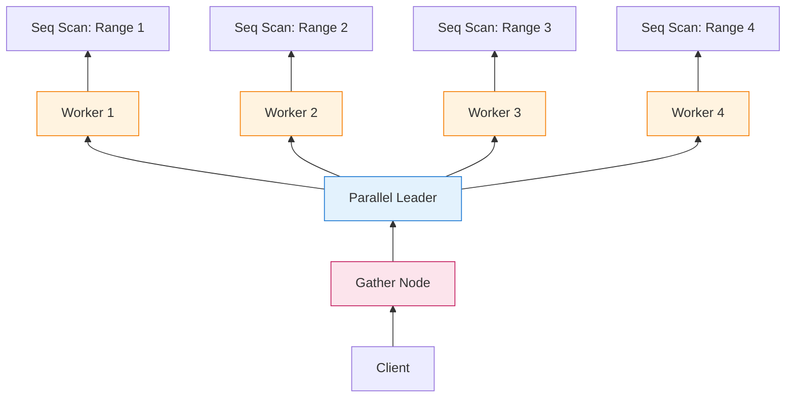
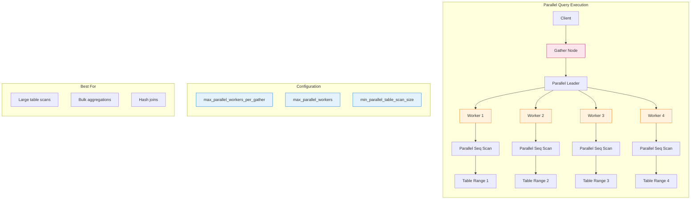

当 PostgreSQL 在 9.6 版本引入**并行查询执行**（parallel query execution）时，它解锁了一项基本能力：利用多核 CPU 来加速分析性工作负载。

在并行查询出现之前，PostgreSQL 是严格的**单线程**架构——一个查询，一个 CPU 核心。在 32 核心的服务器上，完整表扫描只使用 1 个核心达到 100% 利用率，其余 31 个核心闲置。对于 OLTP 工作负载（短暂、选择性查询），这没问题。但对于分析型查询（扫描数百万行），这成为瓶颈。

并行查询通过允许**顺序扫描**（Seq Scan）、**哈希连接**（Hash Join）和**聚合**（Aggregate）等运算拆分到多个**后台 worker 进程**来改变这种状况。**Gather** 或 **Gather Merge** 节点收集 worker 的结果并返回给客户端。

结果是什么？在适合的工作负载上可达到 **2 到 4 倍或更高的加速**。

但并行查询不是免费的。它会增加额外开销、消耗资源，如果使用不当甚至会*拖慢*查询。本指南将解释其运作原理、使用时机以及如何调整。

---

## 1 问题：单线程执行

### 9.6 版之前的现实

```sql
SELECT COUNT(*) FROM transactions;  -- 1 亿行
```

**执行（单线程）：**

```javascript
┌─────────────────────────────────────┐
│  Seq Scan: transactions             │
│  ─────────────────────────────────  │
│  Rows: 100,000,000                  │
│  Time: 12,000ms                     │
│  CPU: 1 core @ 100%                 │
│  Other 31 cores: Idle               │
└─────────────────────────────────────┘
```

**瓶颈：** 磁盘 I/O 和 CPU 密集型运算（过滤、聚合）无法并行化。一个核心完成所有工作。

---

### 并行解决方案

```sql
SET max_parallel_workers_per_gather = 4;
SELECT COUNT(*) FROM transactions;
```

**执行（并行）：**

```
┌─────────────────────────────────────────────────────────┐
│                    Gather (Aggregate)                   │
│                    ──────────────────                   │
│                    Combines partial results             │
└─────────────────────────────────────────────────────────┘
           │              │              │              │
    ┌──────┴─────┐ ┌─────┴──────┐ ┌─────┴──────┐ ┌─────┴──────┐
    │  Worker 1  │ │  Worker 2  │ │  Worker 3  │ │  Worker 4  │
    │  Scan 25M  │ │  Scan 25M  │ │  Scan 25M  │ │  Scan 25M  │
    │  rows      │ │  rows      │ │  rows      │ │  rows      │
    └────────────┘ └────────────┘ └────────────┘ └────────────┘
           │              │              │              │
    ┌──────┴──────────────┴──────────────┴──────────────┴──────┐
    │              Seq Scan: transactions                       │
    │              (table split into 4 ranges)                  │
    └───────────────────────────────────────────────────────────┘

Total Time: ~3,500ms (3.4x speedup)
CPU: 4 cores @ ~90% each
```

**关键洞察：** 表被划分为多个**范围**，每个 worker 扫描一部分，结果在顶层合并。

---

## 2 架构：并行查询如何运作

### 并行执行堆栈



**组件：**

| 组件 | 角色 |
|-----------|------|
| **Parallel Leader** | 协调 worker 的主要后端进程 |
| **Parallel Workers** | 执行部分计划的后台进程 |
| **Gather Node** | 收集 worker 的结果并返回给客户端 |
| **Gather Merge Node** | 类似 Gather，但保持排序顺序 |
| **Shared Memory** | leader 与 worker 之间的通信通道 |

---

### Gather 节点：收集结果

**Gather** 节点是并行 worker 与客户端之间的桥梁：

```c
/* Simplified from src/backend/executor/nodeGather.c */
typedef struct GatherState {
    PlanState ps;
    int nworkers;              /* Number of workers */
    struct ParallelExecutorContext *pei;  /* Communication context */
    TupleTableSlot *pending_result;  /* Next row from workers */
} GatherState;

static TupleTableSlot *
ExecGather(GatherState *node)
{
    /* Initialize workers on first call */
    if (!node->workers_initialized) {
        InitializeParallelWorkers(node);
        node->workers_initialized = true;
    }

    /* Get next row from any worker */
    while (node->pending_result == NULL) {
        if (all_workers_done(node))
            return NULL;  /* No more rows */

        node->pending_result = FetchRowFromWorker(node);
    }

    /* Return row to parent */
    TupleTableSlot *result = node->pending_result;
    node->pending_result = NULL;
    return result;
}
```

**契约：**

| 方法 | 目的 |
|--------|---------|
| `InitializeParallelWorkers()` | 启动 worker 进程 |
| `FetchRowFromWorker()` | 从任意 worker 获取下一行（轮询） |
| `all_workers_done()` | 检查所有 worker 是否完成 |

**Gather 与 Gather Merge 的比较：**

| 节点类型 | 使用场景 | 保持顺序？ |
|-----------|----------|------------------|
| **Gather** | 一般并行执行 | ❌ 否 |
| **Gather Merge** | 带有 ORDER BY 的并行执行 | ✅ 是（合并排序） |

```sql
-- 使用 Gather
SELECT COUNT(*) FROM large_table;

-- 使用 Gather Merge
SELECT * FROM large_table ORDER BY created_at;
-- Worker 返回排序后的区块；Gather Merge 合并它们
```

---

### Parallel Workers：后台进程

Worker 是**独立的 PostgreSQL 后端进程**：

```
postgres: parallel worker for database neo01              # Worker 1
postgres: parallel worker for database neo01              # Worker 2
postgres: parallel worker for database neo01              # Worker 3
postgres: parallel worker for database neo01              # Worker 4
postgres: neo01                                           # Parallel Leader
```

**关键特性：**

| 特性 | 说明 |
|----------|-------------|
| **独立进程** | 不是线程——是具有自己内存的完整操作系统进程 |
| **共享内存** | 通过 DSM（Dynamic Shared Memory）通信 |
| **继承事务** | Worker 看到相同的事务快照 |
| **无直接客户端访问** | 只有 leader 与客户端通信 |
| **暂时性** | 查询完成后 worker 退出 |

!!! warning "⚠️ 进程开销"
    由于 worker 是独立进程（而非线程），因此存在开销：

    - **进程创建：** 每个 worker 约 1-5ms
    - **DSM 设置：** 共享内存配置
    - **上下文切换：** 操作系统必须调度多个进程

    对于执行时间 < 100ms 的查询，并行开销通常超过其收益。

---

## 3 感知并行的算子

并非所有算子都能并行执行。PostgreSQL 仅支持特定节点类型的并行化：

### 支持并行的算子

| 算子 | 并行策略 | 加速潜力 |
|----------|-------------------|-------------------|
| **Seq Scan** | 将表划分为范围；每个 worker 扫描一个范围 | ⭐⭐⭐ 高 |
| **Hash Join** | 创建阶段：并行哈希；探测阶段：并行探测 | ⭐⭐⭐ 高 |
| **Aggregate** | 每个 worker 计算部分聚合；leader 合并 | ⭐⭐⭐ 高 |
| **Bitmap Heap Scan** | 将 bitmap 划分为范围 | ⭐⭐ 中 |
| **Index Scan** | 有限支持（仅限 index-only scans） | ⭐ 低 |
| **Sort** | 每个 worker 排序一个区块；Gather Merge 合并 | ⭐⭐ 中 |

### 不支持并行的算子

| 算子 | 无法并行的原因 |
|----------|-------------------|
| **Nested Loop Join** | 本质上是顺序的（内部依赖外部） |
| **Window Functions** | 需要有序输入；难以分割 |
| **CTEs（PG15 之前）** | 优化屏障；分别执行 |
| **函数（大多数）** | 未标记为 `PARALLEL SAFE` |
| **INSERT/UPDATE/DELETE** | 行级锁冲突 |

!!! info "📌 PARALLEL 安全等级"
    函数标记有并行安全性：

| 等级 | 意义 | 可以并行执行？ |
|-------|---------|---------------------|
| `PARALLEL UNSAFE` | 可能修改状态 | ❌ 否 |
| `PARALLEL RESTRICTED` | 仅只读，但不能执行并行计划 | ⚠️ 仅 leader |
| `PARALLEL SAFE` | 纯只读 | ✅ 是 |

```sql
-- 检查函数并行安全性
SELECT proname, proparallel
FROM pg_proc
WHERE proname = 'random';  -- 'u' = UNSAFE

-- random() 是 UNSAFE（使用全局 RNG 状态）
```

---

### 示例：并行 Seq Scan

```sql
EXPLAIN (ANALYZE, BUFFERS)
SELECT COUNT(*) FROM transactions
WHERE created_at >= '2025-01-01';
```

**计划：**

```
                                                    QUERY PLAN
-------------------------------------------------------------------------------------------------------------------
 Finalize Aggregate  (cost=1234567.89..1234568.01 rows=1 width=8) (actual time=3521.234..3521.456 rows=1 loops=1)
   Buffers: shared hit=123456, read=567890
   ->  Gather  (cost=1234567.00..1234567.89 rows=4 width=8) (actual time=3520.123..3521.234 rows=4 loops=1)
         Workers Planned: 4
         Workers Launched: 4
         Buffers: shared hit=123456, read=567890
         ->  Partial Aggregate  (cost=1234567.00..1234567.00 rows=1 width=8) (actual time=3510.567..3510.678 rows=1 loops=4)
               Buffers: shared hit=30864, read=141972
               ->  Parallel Seq Scan on transactions  (cost=0.00..1234000.00 rows=226667 width=0) (actual time=12.345..3450.123 rows=25000000 loops=4)
                     Filter: (created_at >= '2025-01-01'::date)
                     Rows Removed by Filter: 75000000
                     Buffers: shared hit=30864, read=141972
 Planning Time: 0.456 ms
 Workers Planned: 4
 Workers Launched: 4
 JIT:
   Functions: 8
   Options: inlining false, optimization true, expression_decomposition true, code_generation true
 Execution Time: 3545.678 ms
```

**关键观察：**

| 指标 | 值 | 意义 |
|--------|-------|---------|
| `Workers Planned` | 4 | 规划器请求 4 个 worker |
| `Workers Launched` | 4 | 所有 4 个 worker 已启动（未触及资源限制） |
| `loops=4` | 4 | 每个 worker 执行此节点一次 |
| `rows=25000000` | 每个 worker 2500 万行 | 总计：扫描 1 亿行 |
| `Partial Aggregate` | 每个 worker | 每个 worker 计算其部分的计数 |
| `Finalize Aggregate` | Leader | 合并 4 个部分计数 |

---

### 示例：并行 Hash Join

```sql
EXPLAIN (ANALYZE, BUFFERS)
SELECT u.name, COUNT(o.id)
FROM users u
JOIN orders o ON u.id = o.user_id
WHERE u.created_at > '2025-01-01'
GROUP BY u.name;
```

**计划：**

```
                                                               QUERY PLAN
-----------------------------------------------------------------------------------------------------------------------------------------
 Finalize GroupAggregate  (cost=5678901.23..5678912.34 rows=100000 width=40) (actual time=8234.567..8245.678 rows=95432 loops=1)
   Group Key: u.name
   Buffers: shared hit=234567, read=1234567
   ->  Gather Merge  (cost=5678901.23..5678909.87 rows=400000 width=40) (actual time=8230.123..8240.234 rows=381728 loops=1)
         Workers Planned: 4
         Workers Launched: 4
         Buffers: shared hit=234567, read=1234567
         ->  Partial GroupAggregate  (cost=5678901.23..5678905.45 rows=100000 width=40) (actual time=8200.456..8210.567 rows=95432 loops=4)
               Group Key: u.name
               Buffers: shared hit=58641, read=308641
               ->  Sort  (cost=5678901.23..5678902.34 rows=400000 width=40) (actual time=8190.345..8195.456 rows=95432 loops=4)
                     Sort Key: u.name
                     Sort Method: quicksort  Memory: 256kB
                     Buffers: shared hit=58641, read=308641
                     ->  Hash Join  (cost=123456.78..5678000.00 rows=400000 width=40) (actual time=456.789..8100.123 rows=95432 loops=4)
                           Hash Cond: (o.user_id = u.id)
                           Buffers: shared hit=58641, read=308641
                           ->  Parallel Seq Scan on orders o  (cost=0.00..5500000.00 rows=2500000 width=8) (actual time=12.345..7800.234 rows=625000 loops=4)
                                 Buffers: shared hit=45678, read=234567
                           ->  Hash  (cost=100000.00..100000.00 rows=250000 width=12) (actual time=440.123..440.234 rows=250000 loops=1)
                                 Buckets: 262144  Batches: 2  Memory Usage: 12288kB
                                 ->  Seq Scan on users u  (cost=0.00..100000.00 rows=250000 width=12) (actual time=0.123..350.456 rows=250000 loops=1)
                                       Filter: (created_at > '2025-01-01'::date)
                                       Rows Removed by Filter: 750000
                                       Buffers: shared hit=12345, read=67890
 Planning Time: 1.234 ms
 Workers Planned: 4
 Workers Launched: 4
 Execution Time: 8267.890 ms
```

**执行流程：**

```
┌─────────────────────────────────────────────────────────────────┐
│                    Finalize GroupAggregate                      │
│                    (Leader: combines 4 partial aggregates)      │
└─────────────────────────────────────────────────────────────────┘
                              │
                    ┌─────────┴─────────┐
                    │   Gather Merge    │  (Preserves sort order)
                    └─────────┬─────────┘
                              │
        ┌──────────┬──────────┼──────────┬──────────┐
        │          │          │          │          │
   ┌────┴───┐ ┌────┴───┐ ┌────┴───┐ ┌────┴───┐
   │Worker 1│ │Worker 2│ │Worker 3│ │Worker 4│
   │Partial │ │Partial │ │Partial │ │Partial │
   │Agg     │ │Agg     │ │Agg     │ │Agg     │
   └────┬───┘ └────┬───┘ └────┬───┘ └────┬───┘
        │          │          │          │
        └──────────┴──────────┴──────────┘
                   │
         ┌─────────┴─────────┐
         │   Parallel Hash   │
         │   (Shared hash    │
         │    table in DSM)  │
         └─────────┬─────────┘
                   │
        ┌──────────┴──────────┐
        │                     │
   ┌────┴────┐          ┌─────┴─────┐
   │Parallel │          │   Hash    │
   │Scan     │          │   Build   │
   │orders   │          │   (users) │
   └─────────┘          └───────────┘
```

**关键洞察：** 哈希表仅创建**一次**（由 leader 或 worker 共同创建）并存储在**共享内存**中。所有 worker 探测相同的哈希表。

---

## 4 设置：调整并行查询

PostgreSQL 提供多个 GUC（Grand Unified Configuration）来控制并行查询：

### 核心参数

| 参数 | 默认值 | 说明 |
|-----------|---------|-------------|
| `max_parallel_workers_per_gather` | 2 | 每个 Gather 节点的最大 worker 数 |
| `max_parallel_workers` | 8 | 系统范围可用的 worker 总数 |
| `max_parallel_maintenance_workers` | 2 | 用于维护的 worker（VACUUM、CREATE INDEX） |
| `parallel_leader_participation` | on | leader 是否也参与工作 |
| `min_parallel_table_scan_size` | 8MB | 并行扫描的最小表大小 |
| `min_parallel_index_scan_size` | 512kB | 并行扫描的最小索引大小 |
| `parallel_setup_cost` | 1000.0 | 规划器对并行设置的成本估算 |
| `parallel_tuple_cost` | 0.1 | 规划器对每个传输元组的成本 |

---

### 参数深入探讨

#### `max_parallel_workers_per_gather`

```sql
-- 默认：2
SET max_parallel_workers_per_gather = 4;

-- 对于单一大型查询
SET LOCAL max_parallel_workers_per_gather = 8;
SELECT COUNT(*) FROM huge_table;
```

**权衡：**

| 值 | 优点 | 缺点 |
|-------|------|------|
| 低 (1-2) | 开销较小，更可预测 | 加速有限 |
| 高 (8+) | 最大化并行化 | 报酬递减，资源竞争 |

**经验法则：** 从 4 开始，测量，调整。

---

#### `max_parallel_workers`

```sql
-- 系统范围限制（postgresql.conf）
max_parallel_workers = 16  -- 所有查询的 worker 总数

-- 检查当前使用情况
SELECT count(*)
FROM pg_stat_activity
WHERE backend_type = 'parallel worker';
```

**关系：**

```
max_parallel_workers_per_gather ≤ max_parallel_workers

示例：
  max_parallel_workers = 8
  max_parallel_workers_per_gather = 4

  → 最多 2 个并发并行查询（8 / 4 = 2）
```

---

#### `parallel_leader_participation`

```sql
-- 默认：on（leader 也参与工作）
SET parallel_leader_participation = on;

-- Leader 协调并扫描表的一部分
```

**何时禁用：**

| 场景 | 设置 | 原因 |
|----------|---------|-----|
| 许多并发查询 | `off` | Leader 处理协调，worker 执行所有扫描 |
| 少量 worker | `on` | 最大化并行化（leader + workers） |
| I/O 绑定工作负载 | `on` | Leader 可协助 I/O |
| CPU 绑定工作负载 | `off` | Leader 专注于协调 |

---

#### `min_parallel_table_scan_size`

```sql
-- 默认：8MB
SET min_parallel_table_scan_size = 16MB;

-- 小于 16MB 的表不会使用并行扫描
```

**存在原因：** 对于小表，并行开销（~5-10ms）超过收益。

**调整：**

| 工作负载 | 建议值 |
|----------|-------------------|
| OLTP（小查询） | 32MB+（不鼓励并行化） |
| 分析（大型扫描） | 4-8MB（鼓励并行化） |
| 混合 | 8-16MB（平衡） |

---

### 规划器成本参数

规划器使用成本估算来决定并行化是否值得：

```sql
-- 默认成本
parallel_setup_cost = 1000.0    -- 相当于 ~10ms 的工作
parallel_tuple_cost = 0.1       -- 每行传输成本
```

**规划器如何决定：**

```
Total Parallel Cost = parallel_setup_cost
                    + (parallel_tuple_cost × rows)
                    + (scan_cost / workers)

If Parallel Cost < Serial Cost → Choose Parallel
```

**调整：**

```sql
-- 让并行化更具吸引力
SET parallel_setup_cost = 500.0;   -- 降低设置惩罚
SET parallel_tuple_cost = 0.05;    -- 降低传输成本

-- 让并行化较不具吸引力
SET parallel_setup_cost = 2000.0;  -- 提高设置惩罚
```

!!! tip "💡 调试规划器决策"
    使用 `EXPLAIN (VERBOSE, COSTS)` 查看规划器为何选择（或拒绝）并行化：

    ```sql
    EXPLAIN (VERBOSE, COSTS)
    SELECT COUNT(*) FROM transactions;

    -- 寻找：
    -- "Workers Planned: 0" → 规划器拒绝并行化
    -- "Workers Planned: 4" → 规划器选择并行
    ```

---

## 5 何时并行查询有帮助（何时有害）

### 并行查询的理想工作负载

| 工作负载 | 特征 | 预期加速 |
|----------|-----------------|------------------|
| **大型表扫描** | >100MB 表，选择性过滤 | 2-4 倍 |
| **大量聚合** | 数百万行的 COUNT、SUM、AVG | 3-5 倍 |
| **哈希连接** | 大型事实表连接到维度表 | 2-4 倍 |
| **仅索引扫描** | 大型表的覆盖索引 | 2-3 倍 |
| **并行 CREATE INDEX** | `CREATE INDEX CONCURRENTLY`（PG11+） | 2-3 倍 |

**示例：大型聚合**

```sql
-- 之前：12 秒（单线程）
-- 之后：3.5 秒（4 个 worker）
SET max_parallel_workers_per_gather = 4;

SELECT
    DATE_TRUNC('hour', created_at) as hour,
    COUNT(*) as transactions,
    SUM(amount) as total_amount
FROM transactions
WHERE created_at >= '2025-01-01'
GROUP BY hour;
```

---

### 何时并行查询有害

| 场景 | 有害原因 | 替代方案 |
|----------|--------------|-------------|
| **小表（< 10MB）** | 开销 > 收益 | 禁用并行化 |
| **OLTP 查询（< 100ms）** | 设置时间主导 | 保持 `max_parallel_workers_per_gather = 0` |
| **许多并发查询** | Worker 饿死 | 限制 `max_parallel_workers` |
| **内存绑定工作负载** | Worker 竞争缓存 | 减少 worker |
| **标记为 UNSAFE 的函数** | 回退到串行 | 尽可能标记函数为 SAFE |

**示例：并行开销**

```sql
-- 小表：并行更慢
SELECT COUNT(*) FROM small_table;  -- 串行 50ms，并行 80ms

-- 为什么？
-- - 进程创建：5ms × 4 workers = 20ms
-- - DSM 设置：10ms
-- - 协调：5ms
-- - 实际扫描：5ms（表很小）
-- 总计并行：40ms 开销 + 5ms 扫描 = 45ms+（vs 50ms 串行）
```

!!! warning "⚠️ OLTP 陷阱"
    对于 OLTP 工作负载（短暂、频繁的查询），并行查询通常会**降低**性能：

```sql
-- 典型 OLTP 查询
SELECT * FROM users WHERE id = 12345;  -- 使用索引，返回 1 行

-- 并行开销：30-50ms
-- 串行执行：0.5ms
-- 结果：并行化慢 60-100 倍！
```

**解决方案：** 为 OLTP 禁用并行化：

```sql
-- 在 OLTP 数据库的 postgresql.conf 中
max_parallel_workers_per_gather = 0
max_parallel_workers = 0
```

---

## 6 调试并行查询问题

### 常见问题

#### 问题 1：Worker 未启动

```
Workers Planned: 4
Workers Launched: 2  -- 只启动了 2 个！
```

**原因：**

| 原因 | 检查 | 修复 |
|-------|-------|-----|
| 触及 worker 限制 | `SHOW max_parallel_workers;` | 增加限制 |
| 内存压力 | 检查 `work_mem × workers` | 减少 `max_parallel_workers` |
| 表太小 | 检查表大小与 `min_parallel_table_scan_size` | 降低阈值或接受串行 |
| 函数是 UNSAFE | 检查 `pg_proc` 中的 `proparallel` | 标记为 SAFE 或重写 |

---

#### 问题 2：并行扫描回退到索引扫描

```sql
-- 预期：Parallel Seq Scan
-- 实际：Index Scan（串行）
```

**原因：** 规划器确定索引扫描更便宜。

**强制并行扫描（仅测试）：**

```sql
SET enable_indexscan = off;
SET enable_seqscan = on;
SET max_parallel_workers_per_gather = 4;

EXPLAIN ANALYZE
SELECT COUNT(*) FROM large_table;
```

!!! warning "⚠️ 不要在生产环境强制"
    禁用索引扫描仅用于**调试**。规划器通常最清楚。如果并行顺序扫描确实更好，请改为调整成本参数。

---

#### 问题 3：Worker 负载不均

```
Worker 1: 50M rows, 3000ms
Worker 2: 30M rows, 1800ms
Worker 3: 15M rows, 900ms
Worker 4: 5M rows, 300ms
```

**原因：** 数据倾斜（worker 扫描不同大小的范围）。

**影响：** 最慢的 worker 决定总时间（Amdahl 定律）。

**缓解：**

| 策略 | 方法 |
|----------|-----|
| 更好的数据分布 | 重组表（PARTITION BY） |
| 更多 worker | 更细粒度的范围 |
| 接受不平衡 | 通常不值得优化 |

---

### 监控并行查询

```sql
-- 检查活跃的并行 worker
SELECT
    pid,
    usename,
    query,
    backend_type
FROM pg_stat_activity
WHERE backend_type = 'parallel worker';

-- 检查并行查询统计（PG14+）
SELECT
    datname,
    numbackends,
    xact_commit,
    xact_rollback
FROM pg_stat_database;

-- 查看并行 worker 内存使用情况
SELECT
    pid,
    usename,
    query,
    temp_blks_read,
    temp_blks_written
FROM pg_stat_activity
WHERE query LIKE '%parallel%';
```

---

## 7 高级：并行查询内部实现

### Dynamic Shared Memory (DSM)

Worker 通过**动态共享内存**通信：

```c
/* Simplified from src/backend/storage/ipc/dsm.c */
typedef struct dsm_segment {
    dsm_handle handle;      /* Unique identifier */
    void *mapped_address;   /* Mapped memory address */
    Size size;              /* Segment size */
} dsm_segment;

/* Create shared memory segment */
dsm_segment *
dsm_create(Size size, int flags)
{
    /* Allocate shared memory */
    /* Return segment handle */
}

/* Attach to shared memory (workers) */
void *
dsm_attach(dsm_handle handle)
{
    /* Map shared memory into worker's address space */
}
```

**DSM 中存储的内容：**

| 数据 | 大小 | 目的 |
|------|------|---------|
| 查询计划 | ~10-100KB | Worker 需要知道执行什么 |
| 表扫描范围 | 每个 worker ~1KB | 每个 worker 扫描哪些区块 |
| 哈希表 | 可变（MB） | 并行哈希连接的共享哈希 |
| 部分聚合 | 每个 worker ~1KB | 中间结果 |
| 元组队列 | 可变 | 从 worker 传输到 leader 的行 |

---

### 并行上下文切换

```
┌─────────────────────────────────────────────────────────────┐
│                     Parallel Leader                         │
│  ────────────────────────────────────────────────────────   │
│  1. Parse & analyze query                                   │
│  2. Generate parallel-aware plan                            │
│  3. Create DSM segment                                      │
│  4. Launch worker processes                                 │
│  5. Send plan + context to workers via DSM                  │
│  6. Wait for workers to start                               │
│  7. Begin execution (Gather node pulls from workers)        │
│  8. Collect results, return to client                       │
│  9. Clean up DSM, terminate workers                         │
└─────────────────────────────────────────────────────────────┘
```

**时间轴：**

```
0ms     5ms     10ms    15ms    20ms    100ms   3500ms
│───────│───────│───────│───────│───────│───────│───────│
│ DSM   │Worker │Workers│First  │       │       │Final  │
│ setup │launch │ready  │row    │Scan   │Scan   │result │
│       │       │       │       │       │       │       │
└───────────────┘
    Overhead (~20ms)
```

---

## 8 实用调整指南

### OLTP 数据库

```sql
-- postgresql.conf
max_parallel_workers_per_gather = 0  -- 禁用并行查询
max_parallel_workers = 0
max_parallel_maintenance_workers = 1  -- 保留用于维护

-- 原因：OLTP 查询很短；并行开销弊大于利
```

---

### 分析数据库

```sql
-- postgresql.conf
max_parallel_workers_per_gather = 8   -- 最大化并行化
max_parallel_workers = 32             -- 支持多个并发查询
max_parallel_maintenance_workers = 4  -- 并行 VACUUM、CREATE INDEX

min_parallel_table_scan_size = 4MB    -- 鼓励并行化
parallel_setup_cost = 500.0           -- 降低并行化门槛
parallel_tuple_cost = 0.05

-- 每个查询（用于关键报表）
SET LOCAL max_parallel_workers_per_gather = 16;
SELECT /* 复杂分析查询 */;
```

---

### 混合工作负载

```sql
-- postgresql.conf
max_parallel_workers_per_gather = 4   -- 适度并行化
max_parallel_workers = 16             -- 支持约 4 个并发并行查询
max_parallel_maintenance_workers = 2

min_parallel_table_scan_size = 16MB   -- 仅并行化大型扫描

-- 应用程序级别调整
-- OLTP 查询：使用默认（4 个 worker）
-- 分析查询：SET LOCAL max_parallel_workers_per_gather = 8
```

---

### 调整检查清单

```
□ 检查当前设置：
  SHOW max_parallel_workers_per_gather;
  SHOW max_parallel_workers;
  SHOW min_parallel_table_scan_size;

□ 识别候选查询：
  -- 寻找在大型表上具有顺序扫描的查询
  SELECT query, total_exec_time, calls
  FROM pg_stat_statements
  WHERE query LIKE '%Seq Scan%'
  ORDER BY total_exec_time DESC;

□ 测试并行化：
  SET max_parallel_workers_per_gather = 4;
  EXPLAIN (ANALYZE, BUFFERS) <query>;

□ 测量加速：
  -- 比较串行与并行执行时间
  -- 检查 Workers Launched 是否符合 Workers Planned

□ 根据结果调整：
  -- 良好的加速（2x+）：保持设置
  -- 边际加速（< 1.5x）：减少 worker 或禁用
  -- 更慢：为此类查询禁用并行化
```

---

## 总结：一张图看懂并行查询



**关键要点：**

| 面向 | 并行查询 |
|--------|----------------|
| **架构** | Leader + worker 通过 DSM |
| **Gather 节点** | 收集 worker 的结果 |
| **Gather Merge** | 保持排序顺序 |
| **最适合** | 大型扫描、聚合、哈希连接 |
| **避免用于** | OLTP、小表、低于 100ms 的查询 |
| **加速** | 通常 2-4 倍，理想工作负载可达 10 倍 |
| **开销** | 约 20-50ms 设置时间 |

---

**进一步阅读：**

- PostgreSQL Docs: ["Parallel Query"](https://www.postgresql.org/docs/current/parallel-query.html)
- Robert Haas: ["Parallel Query in PostgreSQL"](https://rhaas.blogspot.com/2015/10/parallel-query-in-postgresql.html) (2015)
- Andres Freund: ["Parallelism in PostgreSQL"](https://www.postgresql.org/message-id/flat/20160929183442.GA1210147%40alap3.anarazel.de)
- Source: [`src/backend/executor/nodeGather.c`](https://github.com/postgres/postgres/tree/master/src/backend/executor/nodeGather.c)
