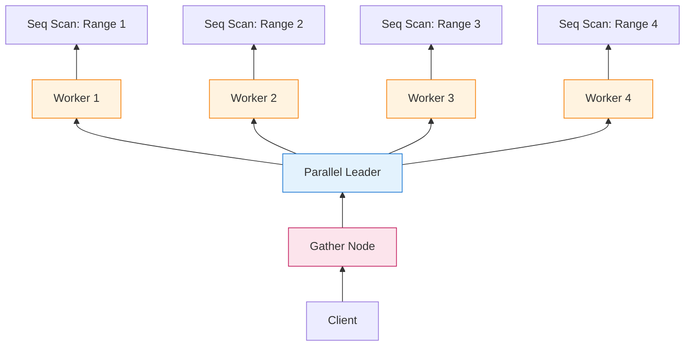
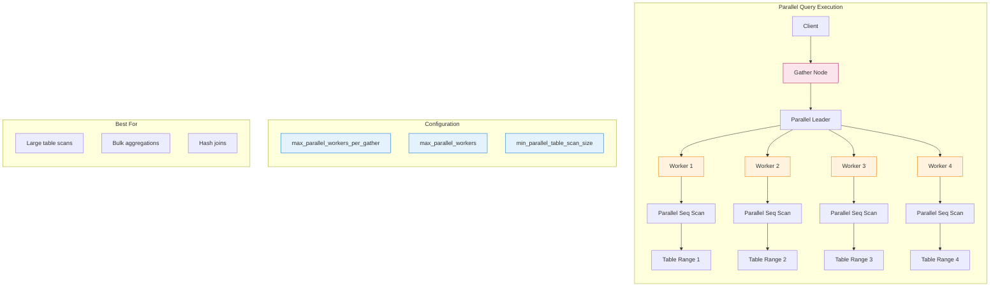

當 PostgreSQL 在 9.6 版本引入**平行查詢執行**（parallel query execution）時，它解鎖了一項基本能力：利用多核心 CPU 來加速分析性工作負載。

在平行查詢出現之前，PostgreSQL 是嚴格的**單執行緒**架構——一個查詢，一個 CPU 核心。在 32 核心的伺服器上，完整表掃描只使用 1 個核心達到 100% 利用率，其餘 31 個核心閒置。對於 OLTP 工作負載（短暫、選擇性查詢），這沒問題。但對於分析型查詢（掃描數百萬列），這成為瓶頸。

平行查詢透過允許**順序掃描**（Seq Scan）、**雜湊連接**（Hash Join）和**聚合**（Aggregate）等運算拆分到多個**背景 worker 程序**來改變這種狀況。**Gather** 或 **Gather Merge** 節點收集 worker 的結果並回傳給用戶端。

結果是什麼？在適合的工作負載上可達到 **2 到 4 倍或更高的加速**。

但平行查詢不是免費的。它會增加額外開銷、消耗資源，如果使用不當甚至會*拖慢*查詢。本指南將解釋其運作原理、使用時機以及如何調整。

---

## 1 問題：單執行緒執行

### 9.6 版之前的現實

```sql
SELECT COUNT(*) FROM transactions;  -- 1 億列
```

**執行（單執行緒）：**

```javascript
┌─────────────────────────────────────┐
│  Seq Scan: transactions             │
│  ─────────────────────────────────  │
│  Rows: 100,000,000                  │
│  Time: 12,000ms                     │
│  CPU: 1 core @ 100%                 │
│  Other 31 cores: Idle               │
└─────────────────────────────────────┘
```

**瓶頸：** 磁碟 I/O 和 CPU 密集型運算（過濾、聚合）無法平行化。一個核心完成所有工作。

---

### 平行解決方案

```sql
SET max_parallel_workers_per_gather = 4;
SELECT COUNT(*) FROM transactions;
```

**執行（平行）：**

```
┌─────────────────────────────────────────────────────────┐
│                    Gather (Aggregate)                   │
│                    ──────────────────                   │
│                    Combines partial results             │
└─────────────────────────────────────────────────────────┘
           │              │              │              │
    ┌──────┴─────┐ ┌─────┴──────┐ ┌─────┴──────┐ ┌─────┴──────┐
    │  Worker 1  │ │  Worker 2  │ │  Worker 3  │ │  Worker 4  │
    │  Scan 25M  │ │  Scan 25M  │ │  Scan 25M  │ │  Scan 25M  │
    │  rows      │ │  rows      │ │  rows      │ │  rows      │
    └────────────┘ └────────────┘ └────────────┘ └────────────┘
           │              │              │              │
    ┌──────┴──────────────┴──────────────┴──────────────┴──────┐
    │              Seq Scan: transactions                       │
    │              (table split into 4 ranges)                  │
    └───────────────────────────────────────────────────────────┘

Total Time: ~3,500ms (3.4x speedup)
CPU: 4 cores @ ~90% each
```

**關鍵洞察：** 表被劃分為多個**範圍**，每個 worker 掃描一部分，結果在頂層合併。

---

## 2 架構：平行查詢如何運作

### 平行執行堆疊



**元件：**

| 元件 | 角色 |
|-----------|------|
| **Parallel Leader** | 協調 worker 的主要後端程序 |
| **Parallel Workers** | 執行部分計畫的背景程序 |
| **Gather Node** | 收集 worker 的結果並回傳給用戶端 |
| **Gather Merge Node** | 類似 Gather，但保持排序順序 |
| **Shared Memory** | leader 與 worker 之間的通訊通道 |

---

### Gather 節點：收集結果

**Gather** 節點是平行 worker 與用戶端之間的橋樑：

```c
/* Simplified from src/backend/executor/nodeGather.c */
typedef struct GatherState {
    PlanState ps;
    int nworkers;              /* Number of workers */
    struct ParallelExecutorContext *pei;  /* Communication context */
    TupleTableSlot *pending_result;  /* Next row from workers */
} GatherState;

static TupleTableSlot *
ExecGather(GatherState *node)
{
    /* Initialize workers on first call */
    if (!node->workers_initialized) {
        InitializeParallelWorkers(node);
        node->workers_initialized = true;
    }

    /* Get next row from any worker */
    while (node->pending_result == NULL) {
        if (all_workers_done(node))
            return NULL;  /* No more rows */

        node->pending_result = FetchRowFromWorker(node);
    }

    /* Return row to parent */
    TupleTableSlot *result = node->pending_result;
    node->pending_result = NULL;
    return result;
}
```

**契約：**

| 方法 | 目的 |
|--------|---------|
| `InitializeParallelWorkers()` | 啟動 worker 程序 |
| `FetchRowFromWorker()` | 從任意 worker 取得下一列（輪詢） |
| `all_workers_done()` | 檢查所有 worker 是否完成 |

**Gather 與 Gather Merge 的比較：**

| 節點類型 | 使用情境 | 保持順序？ |
|-----------|----------|------------------|
| **Gather** | 一般平行執行 | ❌ 否 |
| **Gather Merge** | 帶有 ORDER BY 的平行執行 | ✅ 是（合併排序） |

```sql
-- 使用 Gather
SELECT COUNT(*) FROM large_table;

-- 使用 Gather Merge
SELECT * FROM large_table ORDER BY created_at;
-- Worker 回傳排序後的區塊；Gather Merge 合併它們
```

---

### Parallel Workers：背景程序

Worker 是**獨立的 PostgreSQL 後端程序**：

```
postgres: parallel worker for database neo01              # Worker 1
postgres: parallel worker for database neo01              # Worker 2
postgres: parallel worker for database neo01              # Worker 3
postgres: parallel worker for database neo01              # Worker 4
postgres: neo01                                           # Parallel Leader
```

**關鍵特性：**

| 特性 | 說明 |
|----------|-------------|
| **獨立程序** | 不是執行緒——是具有自己記憶體的完整作業系統程序 |
| **共享記憶體** | 透過 DSM（Dynamic Shared Memory）通訊 |
| **繼承事務** | Worker 看到相同的事務快照 |
| **無直接用戶端存取** | 只有 leader 與用戶端通訊 |
| **暫時性** | 查詢完成後 worker 退出 |

!!! warning "⚠️ 程序開銷"
    由於 worker 是獨立程序（而非執行緒），因此存在開銷：

    - **程序建立：** 每個 worker 約 1-5ms
    - **DSM 設定：** 共享記憶體配置
    - **上下文切換：** 作業系統必須排程多個程序

    對於執行時間 <100ms 的查詢，平行開銷通常超過其效益。

---

## 3 感知平行的運算子

並非所有運算子都能平行執行。PostgreSQL 僅支援特定節點類型的平行化：

### 支援平行的運算子

| 運算子 | 平行策略 | 加速潛力 |
|----------|-------------------|-------------------|
| **Seq Scan** | 將表劃分為範圍；每個 worker 掃描一個範圍 | ⭐⭐⭐ 高 |
| **Hash Join** | 建立階段：平行雜湊；探測階段：平行探測 | ⭐⭐⭐ 高 |
| **Aggregate** | 每個 worker 計算部分聚合；leader 合併 | ⭐⭐⭐ 高 |
| **Bitmap Heap Scan** | 將 bitmap 劃分為範圍 | ⭐⭐ 中 |
| **Index Scan** | 有限支援（僅限 index-only scans） | ⭐ 低 |
| **Sort** | 每個 worker 排序一個區塊；Gather Merge 合併 | ⭐⭐ 中 |

### 不支援平行的運算子

| 運算子 | 無法平行的原因 |
|----------|-------------------|
| **Nested Loop Join** | 本質上是順序的（內部依賴外部） |
| **Window Functions** | 需要有序輸入；難以分割 |
| **CTEs（PG15 之前）** | 優化圍欄；分別執行 |
| **函式（大多數）** | 未標記為 `PARALLEL SAFE` |
| **INSERT/UPDATE/DELETE** | 列級鎖定衝突 |

!!! info "📌 PARALLEL 安全等級"
    函式標記有平行安全性：

    | 等級 | 意義 | 可以平行執行？ |
    |-------|---------|---------------------|
    | `PARALLEL UNSAFE` | 可能修改狀態 | ❌ 否 |
    | `PARALLEL RESTRICTED` | 僅唯讀，但不能執行平行計畫 | ⚠️ 僅 leader |
    | `PARALLEL SAFE` | 純唯讀 | ✅ 是 |

    ```sql
    -- 檢查函式平行安全性
    SELECT proname, proparallel
    FROM pg_proc
    WHERE proname = 'random';  -- 'u' = UNSAFE

    -- random() 是 UNSAFE（使用全域 RNG 狀態）
    ```

---

### 範例：平行 Seq Scan

```sql
EXPLAIN (ANALYZE, BUFFERS)
SELECT COUNT(*) FROM transactions
WHERE created_at >= '2025-01-01';
```

**計畫：**

```
                                                    QUERY PLAN
-------------------------------------------------------------------------------------------------------------------
 Finalize Aggregate  (cost=1234567.89..1234568.01 rows=1 width=8) (actual time=3521.234..3521.456 rows=1 loops=1)
   Buffers: shared hit=123456, read=567890
   ->  Gather  (cost=1234567.00..1234567.89 rows=4 width=8) (actual time=3520.123..3521.234 rows=4 loops=1)
         Workers Planned: 4
         Workers Launched: 4
         Buffers: shared hit=123456, read=567890
         ->  Partial Aggregate  (cost=1234567.00..1234567.00 rows=1 width=8) (actual time=3510.567..3510.678 rows=1 loops=4)
               Buffers: shared hit=30864, read=141972
               ->  Parallel Seq Scan on transactions  (cost=0.00..1234000.00 rows=226667 width=0) (actual time=12.345..3450.123 rows=25000000 loops=4)
                     Filter: (created_at >= '2025-01-01'::date)
                     Rows Removed by Filter: 75000000
                     Buffers: shared hit=30864, read=141972
 Planning Time: 0.456 ms
 Workers Planned: 4
 Workers Launched: 4
 JIT:
   Functions: 8
   Options: inlining false, optimization true, expression_decomposition true, code_generation true
 Execution Time: 3545.678 ms
```

**關鍵觀察：**

| 指標 | 值 | 意義 |
|--------|-------|---------|
| `Workers Planned` | 4 | 規劃器請求 4 個 worker |
| `Workers Launched` | 4 | 所有 4 個 worker 已啟動（未觸及資源限制） |
| `loops=4` | 4 | 每個 worker 執行此節點一次 |
| `rows=25000000` | 每個 worker 2500 萬列 | 總計：掃描 1 億列 |
| `Partial Aggregate` | 每個 worker | 每個 worker 計算其部分的計數 |
| `Finalize Aggregate` | Leader | 合併 4 個部分計數 |

---

### 範例：平行 Hash Join

```sql
EXPLAIN (ANALYZE, BUFFERS)
SELECT u.name, COUNT(o.id)
FROM users u
JOIN orders o ON u.id = o.user_id
WHERE u.created_at > '2025-01-01'
GROUP BY u.name;
```

**計畫：**

```
                                                               QUERY PLAN
-----------------------------------------------------------------------------------------------------------------------------------------
 Finalize GroupAggregate  (cost=5678901.23..5678912.34 rows=100000 width=40) (actual time=8234.567..8245.678 rows=95432 loops=1)
   Group Key: u.name
   Buffers: shared hit=234567, read=1234567
   ->  Gather Merge  (cost=5678901.23..5678909.87 rows=400000 width=40) (actual time=8230.123..8240.234 rows=381728 loops=1)
         Workers Planned: 4
         Workers Launched: 4
         Buffers: shared hit=234567, read=1234567
         ->  Partial GroupAggregate  (cost=5678901.23..5678905.45 rows=100000 width=40) (actual time=8200.456..8210.567 rows=95432 loops=4)
               Group Key: u.name
               Buffers: shared hit=58641, read=308641
               ->  Sort  (cost=5678901.23..5678902.34 rows=400000 width=40) (actual time=8190.345..8195.456 rows=95432 loops=4)
                     Sort Key: u.name
                     Sort Method: quicksort  Memory: 256kB
                     Buffers: shared hit=58641, read=308641
                     ->  Hash Join  (cost=123456.78..5678000.00 rows=400000 width=40) (actual time=456.789..8100.123 rows=95432 loops=4)
                           Hash Cond: (o.user_id = u.id)
                           Buffers: shared hit=58641, read=308641
                           ->  Parallel Seq Scan on orders o  (cost=0.00..5500000.00 rows=2500000 width=8) (actual time=12.345..7800.234 rows=625000 loops=4)
                                 Buffers: shared hit=45678, read=234567
                           ->  Hash  (cost=100000.00..100000.00 rows=250000 width=12) (actual time=440.123..440.234 rows=250000 loops=1)
                                 Buckets: 262144  Batches: 2  Memory Usage: 12288kB
                                 ->  Seq Scan on users u  (cost=0.00..100000.00 rows=250000 width=12) (actual time=0.123..350.456 rows=250000 loops=1)
                                       Filter: (created_at > '2025-01-01'::date)
                                       Rows Removed by Filter: 750000
                                       Buffers: shared hit=12345, read=67890
 Planning Time: 1.234 ms
 Workers Planned: 4
 Workers Launched: 4
 Execution Time: 8267.890 ms
```

**執行流程：**

```
┌─────────────────────────────────────────────────────────────────┐
│                    Finalize GroupAggregate                      │
│                    (Leader: combines 4 partial aggregates)      │
└─────────────────────────────────────────────────────────────────┘
                              │
                    ┌─────────┴─────────┐
                    │   Gather Merge    │  (Preserves sort order)
                    └─────────┬─────────┘
                              │
        ┌──────────┬──────────┼──────────┬──────────┐
        │          │          │          │          │
   ┌────┴───┐ ┌────┴───┐ ┌────┴───┐ ┌────┴───┐
   │Worker 1│ │Worker 2│ │Worker 3│ │Worker 4│
   │Partial │ │Partial │ │Partial │ │Partial │
   │Agg     │ │Agg     │ │Agg     │ │Agg     │
   └────┬───┘ └────┬───┘ └────┬───┘ └────┬───┘
        │          │          │          │
        └──────────┴──────────┴──────────┘
                   │
         ┌─────────┴─────────┐
         │   Parallel Hash   │
         │   (Shared hash    │
         │    table in DSM)  │
         └─────────┬─────────┘
                   │
        ┌──────────┴──────────┐
        │                     │
   ┌────┴────┐          ┌─────┴─────┐
   │Parallel │          │   Hash    │
   │Scan     │          │   Build   │
   │orders   │          │   (users) │
   └─────────┘          └───────────┘
```

**關鍵洞察：** 雜湊表僅建立**一次**（由 leader 或 worker 共同建立）並儲存在**共享記憶體**中。所有 worker 探測相同的雜湊表。

---

## 4 設定：調整平行查詢

PostgreSQL 提供多個 GUC（Grand Unified Configuration）來控制平行查詢：

### 核心參數

| 參數 | 預設值 | 說明 |
|-----------|---------|-------------|
| `max_parallel_workers_per_gather` | 2 | 每個 Gather 節點的最大 worker 數 |
| `max_parallel_workers` | 8 | 系統範圍可用的 worker 總數 |
| `max_parallel_maintenance_workers` | 2 | 用於維護的 worker（VACUUM、CREATE INDEX） |
| `parallel_leader_participation` | on | leader 是否也參與工作 |
| `min_parallel_table_scan_size` | 8MB | 平行掃描的最小表大小 |
| `min_parallel_index_scan_size` | 512kB | 平行掃描的最小索引大小 |
| `parallel_setup_cost` | 1000.0 | 規劃器對平行設定的成本估計 |
| `parallel_tuple_cost` | 0.1 | 規劃器對每個傳輸元組的成本 |

---

### 參數深入探討

#### `max_parallel_workers_per_gather`

```sql
-- 預設：2
SET max_parallel_workers_per_gather = 4;

-- 對於單一大型查詢
SET LOCAL max_parallel_workers_per_gather = 8;
SELECT COUNT(*) FROM huge_table;
```

**取捨：**

| 值 | 優點 | 缺點 |
|-------|------|------|
| 低 (1-2) | 開銷較小，更可預測 | 加速有限 |
| 高 (8+) | 最大化平行化 | 報酬遞減，資源競爭 |

**經驗法則：** 從 4 開始，測量，調整。

---

#### `max_parallel_workers`

```sql
-- 系統範圍限制（postgresql.conf）
max_parallel_workers = 16  -- 所有查詢的 worker 總數

-- 檢查當前使用情況
SELECT count(*)
FROM pg_stat_activity
WHERE backend_type = 'parallel worker';
```

**關係：**

```
max_parallel_workers_per_gather ≤ max_parallel_workers

範例：
  max_parallel_workers = 8
  max_parallel_workers_per_gather = 4

  → 最多 2 個並發平行查詢（8 / 4 = 2）
```

---

#### `parallel_leader_participation`

```sql
-- 預設：on（leader 也參與工作）
SET parallel_leader_participation = on;

-- Leader 協調並掃描表的一部分
```

**何時停用：**

| 情境 | 設定 | 原因 |
|----------|---------|-----|
| 許多並發查詢 | `off` | Leader 處理協調，worker 執行所有掃描 |
| 少量 worker | `on` | 最大化平行化（leader + workers） |
| I/O 綁定工作負載 | `on` | Leader 可協助 I/O |
| CPU 綁定工作負載 | `off` | Leader 專注於協調 |

---

#### `min_parallel_table_scan_size`

```sql
-- 預設：8MB
SET min_parallel_table_scan_size = 16MB;

-- 小於 16MB 的表不會使用平行掃描
```

**存在原因：** 對於小表，平行開銷（~5-10ms）超過效益。

**調整：**

| 工作負載 | 建議值 |
|----------|-------------------|
| OLTP（小查詢） | 32MB+（不鼓勵平行化） |
| 分析（大型掃描） | 4-8MB（鼓勵平行化） |
| 混合 | 8-16MB（平衡） |

---

### 規劃器成本參數

規劃器使用成本估計來決定平行化是否值得：

```sql
-- 預設成本
parallel_setup_cost = 1000.0    -- 相當於 ~10ms 的工作
parallel_tuple_cost = 0.1       -- 每列傳輸成本
```

**規劃器如何決定：**

```
Total Parallel Cost = parallel_setup_cost
                    + (parallel_tuple_cost × rows)
                    + (scan_cost / workers)

If Parallel Cost < Serial Cost → Choose Parallel
```

**調整：**

```sql
-- 讓平行化更具吸引力
SET parallel_setup_cost = 500.0;   -- 降低設定懲罰
SET parallel_tuple_cost = 0.05;    -- 降低傳輸成本

-- 讓平行化較不具吸引力
SET parallel_setup_cost = 2000.0;  -- 提高設定懲罰
```

!!! tip "💡 除錯規劃器決策"
    使用 `EXPLAIN (VERBOSE, COSTS)` 查看規劃器為何選擇（或拒絕）平行化：

    ```sql
    EXPLAIN (VERBOSE, COSTS)
    SELECT COUNT(*) FROM transactions;

    -- 尋找：
    -- "Workers Planned: 0" → 規劃器拒絕平行化
    -- "Workers Planned: 4" → 規劃器選擇平行
    ```

---

## 5 何時平行查詢有幫助（何時有害）

### 平行查詢的理想工作負載

| 工作負載 | 特徵 | 預期加速 |
|----------|-----------------|------------------|
| **大型表掃描** | >100MB 表，選擇性過濾 | 2-4 倍 |
| **大量聚合** | 數百萬列的 COUNT、SUM、AVG | 3-5 倍 |
| **雜湊連接** | 大型事實表連接到維度表 | 2-4 倍 |
| **僅索引掃描** | 大型表的覆蓋索引 | 2-3 倍 |
| **平行 CREATE INDEX** | `CREATE INDEX CONCURRENTLY`（PG11+） | 2-3 倍 |

**範例：大型聚合**

```sql
-- 之前：12 秒（單執行緒）
-- 之後：3.5 秒（4 個 worker）
SET max_parallel_workers_per_gather = 4;

SELECT
    DATE_TRUNC('hour', created_at) as hour,
    COUNT(*) as transactions,
    SUM(amount) as total_amount
FROM transactions
WHERE created_at >= '2025-01-01'
GROUP BY hour;
```

---

### 何時平行查詢有害

| 情境 | 有害原因 | 替代方案 |
|----------|--------------|-------------|
| **小表（<10MB）** | 開銷 > 效益 | 停用平行化 |
| **OLTP 查詢（<100ms）** | 設定時間主導 | 保持 `max_parallel_workers_per_gather = 0` |
| **許多並發查詢** | Worker 飢餓 | 限制 `max_parallel_workers` |
| **記憶體綁定工作負載** | Worker 競爭快取 | 減少 worker |
| **標記為 UNSAFE 的函式** | 回退到序列 | 盡可能標記函式為 SAFE |

**範例：平行開銷**

```sql
-- 小表：平行更慢
SELECT COUNT(*) FROM small_table;  -- 序列 50ms，平行 80ms

-- 為什麼？
-- - 程序建立：5ms × 4 workers = 20ms
-- - DSM 設定：10ms
-- - 協調：5ms
-- - 實際掃描：5ms（表很小）
-- 總計平行：40ms 開銷 + 5ms 掃描 = 45ms+（vs 50ms 序列）
```

!!! warning "⚠️ OLTP 陷阱"
    對於 OLTP 工作負載（短暫、頻繁的查詢），平行查詢通常會**降低**效能：

```sql
-- 典型 OLTP 查詢
SELECT * FROM users WHERE id = 12345;  -- 使用索引，回傳 1 列

-- 平行開銷：30-50ms
-- 序列執行：0.5ms
-- 結果：平行化慢 60-100 倍！
```

**解決方案：** 為 OLTP 停用平行化：

```sql
-- 在 OLTP 資料庫的 postgresql.conf 中
max_parallel_workers_per_gather = 0
max_parallel_workers = 0
```

---

## 6 除錯平行查詢問題

### 常見問題

#### 問題 1：Worker 未啟動

```
Workers Planned: 4
Workers Launched: 2  -- 只啟動了 2 個！
```

**原因：**

| 原因 | 檢查 | 修復 |
|-------|-------|-----|
| 觸及 worker 限制 | `SHOW max_parallel_workers;` | 增加限制 |
| 記憶體壓力 | 檢查 `work_mem × workers` | 減少 `max_parallel_workers` |
| 表太小 | 檢查表大小與 `min_parallel_table_scan_size` | 降低閾值或接受序列 |
| 函式是 UNSAFE | 檢查 `pg_proc` 中的 `proparallel` | 標記為 SAFE 或重寫 |

---

#### 問題 2：平行掃描回退到索引掃描

```sql
-- 預期：Parallel Seq Scan
-- 實際：Index Scan（序列）
```

**原因：** 規劃器確定索引掃描更便宜。

**強制平行掃描（僅測試）：**

```sql
SET enable_indexscan = off;
SET enable_seqscan = on;
SET max_parallel_workers_per_gather = 4;

EXPLAIN ANALYZE
SELECT COUNT(*) FROM large_table;
```

!!! warning "⚠️ 不要在生產環境強制"
    停用索引掃描僅用於**除錯**。規劃器通常最清楚。如果平行序列掃描確實更好，請改為調整成本參數。

---

#### 問題 3：Worker 負載不均

```
Worker 1: 50M rows, 3000ms
Worker 2: 30M rows, 1800ms
Worker 3: 15M rows, 900ms
Worker 4: 5M rows, 300ms
```

**原因：** 數據偏斜（worker 掃描不同大小的範圍）。

**影響：** 最慢的 worker 決定總時間（Amdahl 定律）。

**緩解：**

| 策略 | 方法 |
|----------|-----|
| 更好的數據分佈 | 重組表（PARTITION BY） |
| 更多 worker | 更細粒度的範圍 |
| 接受不平衡 | 通常不值得優化 |

---

### 監控平行查詢

```sql
-- 檢查活躍的平行 worker
SELECT
    pid,
    usename,
    query,
    backend_type
FROM pg_stat_activity
WHERE backend_type = 'parallel worker';

-- 檢查平行查詢統計（PG14+）
SELECT
    datname,
    numbackends,
    xact_commit,
    xact_rollback
FROM pg_stat_database;

-- 查看平行 worker 記憶體使用情況
SELECT
    pid,
    usename,
    query,
    temp_blks_read,
    temp_blks_written
FROM pg_stat_activity
WHERE query LIKE '%parallel%';
```

---

## 7 進階：平行查詢內部實作

### Dynamic Shared Memory (DSM)

Worker 透過**動態共享記憶體**通訊：

```c
/* Simplified from src/backend/storage/ipc/dsm.c */
typedef struct dsm_segment {
    dsm_handle handle;      /* Unique identifier */
    void *mapped_address;   /* Mapped memory address */
    Size size;              /* Segment size */
} dsm_segment;

/* Create shared memory segment */
dsm_segment *
dsm_create(Size size, int flags)
{
    /* Allocate shared memory */
    /* Return segment handle */
}

/* Attach to shared memory (workers) */
void *
dsm_attach(dsm_handle handle)
{
    /* Map shared memory into worker's address space */
}
```

**DSM 中儲存的內容：**

| 數據 | 大小 | 目的 |
|------|------|---------|
| 查詢計畫 | ~10-100KB | Worker 需要知道執行什麼 |
| 表掃描範圍 | 每個 worker ~1KB | 每個 worker 掃描哪些區塊 |
| 雜湊表 | 可變（MB） | 平行雜湊連接的共享雜湊 |
| 部分聚合 | 每個 worker ~1KB | 中間結果 |
| 元組佇列 | 可變 | 從 worker 傳輸到 leader 的列 |

---

### 平行上下文切換

```
┌─────────────────────────────────────────────────────────────┐
│                     Parallel Leader                         │
│  ────────────────────────────────────────────────────────   │
│  1. Parse & analyze query                                   │
│  2. Generate parallel-aware plan                            │
│  3. Create DSM segment                                      │
│  4. Launch worker processes                                 │
│  5. Send plan + context to workers via DSM                  │
│  6. Wait for workers to start                               │
│  7. Begin execution (Gather node pulls from workers)        │
│  8. Collect results, return to client                       │
│  9. Clean up DSM, terminate workers                         │
└─────────────────────────────────────────────────────────────┘
```

**時間軸：**

```
0ms     5ms     10ms    15ms    20ms    100ms   3500ms
│───────│───────│───────│───────│───────│───────│───────│
│ DSM   │Worker │Workers│First  │       │       │Final  │
│ setup │launch │ready  │row    │Scan   │Scan   │result │
│       │       │       │       │       │       │       │
└───────────────┘
    Overhead (~20ms)
```

---

## 8 實用調整指南

### OLTP 資料庫

```sql
-- postgresql.conf
max_parallel_workers_per_gather = 0  -- 停用平行查詢
max_parallel_workers = 0
max_parallel_maintenance_workers = 1  -- 保留用於維護

-- 原因：OLTP 查詢很短；平行開銷弊大於利
```

---

### 分析資料庫

```sql
-- postgresql.conf
max_parallel_workers_per_gather = 8   -- 最大化平行化
max_parallel_workers = 32             -- 支援多個並發查詢
max_parallel_maintenance_workers = 4  -- 平行 VACUUM、CREATE INDEX

min_parallel_table_scan_size = 4MB    -- 鼓勵平行化
parallel_setup_cost = 500.0           -- 降低平行化門檻
parallel_tuple_cost = 0.05

-- 每個查詢（用於關鍵報表）
SET LOCAL max_parallel_workers_per_gather = 16;
SELECT /* 複雜分析查詢 */;
```

---

### 混合工作負載

```sql
-- postgresql.conf
max_parallel_workers_per_gather = 4   -- 適度平行化
max_parallel_workers = 16             -- 支援約 4 個並發平行查詢
max_parallel_maintenance_workers = 2

min_parallel_table_scan_size = 16MB   -- 僅平行化大型掃描

-- 應用程式層級調整
-- OLTP 查詢：使用預設（4 個 worker）
-- 分析查詢：SET LOCAL max_parallel_workers_per_gather = 8
```

---

### 調整檢查清單

```
□ 檢查當前設定：
  SHOW max_parallel_workers_per_gather;
  SHOW max_parallel_workers;
  SHOW min_parallel_table_scan_size;

□ 識別候選查詢：
  -- 尋找在大型表上具有順序掃描的查詢
  SELECT query, total_exec_time, calls
  FROM pg_stat_statements
  WHERE query LIKE '%Seq Scan%'
  ORDER BY total_exec_time DESC;

□ 測試平行化：
  SET max_parallel_workers_per_gather = 4;
  EXPLAIN (ANALYZE, BUFFERS) <query>;

□ 測量加速：
  -- 比較序列與平行執行時間
  -- 檢查 Workers Launched 是否符合 Workers Planned

□ 根據結果調整：
  -- 良好的加速（2x+）：保持設定
  -- 邊際加速（<1.5x）：減少 worker 或停用
  -- 更慢：為此類查詢停用平行化
```

---

## 總結：一張圖看懂平行查詢



**關鍵要點：**

| 面向 | 平行查詢 |
|--------|----------------|
| **架構** | Leader + worker 透過 DSM |
| **Gather 節點** | 收集 worker 的結果 |
| **Gather Merge** | 保持排序順序 |
| **最適合** | 大型掃描、聚合、雜湊連接 |
| **避免用於** | OLTP、小表、低於 100ms 的查詢 |
| **加速** | 通常 2-4 倍，理想工作負載可達 10 倍 |
| **開銷** | 約 20-50ms 設定時間 |

---

**進一步閱讀：**

- PostgreSQL Docs: ["Parallel Query"](https://www.postgresql.org/docs/current/parallel-query.html)
- Robert Haas: ["Parallel Query in PostgreSQL"](https://rhaas.blogspot.com/2015/10/parallel-query-in-postgresql.html) (2015)
- Andres Freund: ["Parallelism in PostgreSQL"](https://www.postgresql.org/message-id/flat/20160929183442.GA1210147%40alap3.anarazel.de)
- Source: [`src/backend/executor/nodeGather.c`](https://github.com/postgres/postgres/tree/master/src/backend/executor/nodeGather.c)
