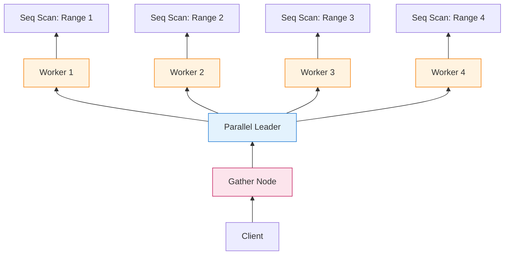
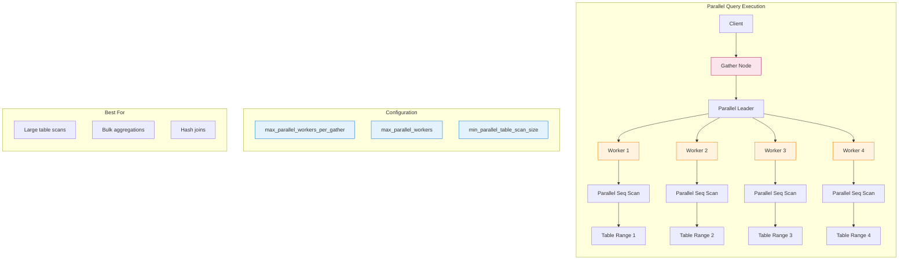

When PostgreSQL introduced **parallel query execution** in version 9.6, it unlocked a fundamental capability: leveraging multi-core CPUs to accelerate analytical workloads.

Before parallel query, PostgreSQL was strictly **single-threaded**—one query, one CPU core. On a 32-core server, a full table scan used 1 core at 100%, leaving 31 cores idle. For OLTP workloads (short, selective queries), this was fine. For analytics (scanning millions of rows), it was a bottleneck.

Parallel query changes this by allowing operations like **Seq Scan**, **Hash Join**, and **Aggregate** to split work across multiple **background worker processes**. A **Gather** or **Gather Merge** node collects results from workers and returns them to the client.

The result? **2x–4x speedup** (or more) on suitable workloads.

But parallel query isn't free. It adds overhead, consumes resources, and can *slow down* queries if misused. This guide explains how it works, when to use it, and how to tune it.

---

## 1 The Problem: Single-Threaded Execution

### The Pre-9.6 Reality

```sql
SELECT COUNT(*) FROM transactions;  -- 100 million rows
```

**Execution (single-threaded):**

```javascript
┌─────────────────────────────────────┐
│  Seq Scan: transactions             │
│  ─────────────────────────────────  │
│  Rows: 100,000,000                  │
│  Time: 12,000ms                     │
│  CPU: 1 core @ 100%                 │
│  Other 31 cores: Idle               │
└─────────────────────────────────────┘
```

**The bottleneck:** Disk I/O and CPU-bound operations (filtering, aggregation) can't be parallelized. One core does all the work.

---

### The Parallel Solution

```sql
SET max_parallel_workers_per_gather = 4;
SELECT COUNT(*) FROM transactions;
```

**Execution (parallel):**

```
┌─────────────────────────────────────────────────────────┐
│                    Gather (Aggregate)                   │
│                    ──────────────────                   │
│                    Combines partial results             │
└─────────────────────────────────────────────────────────┘
           │              │              │              │
    ┌──────┴─────┐ ┌─────┴──────┐ ┌─────┴──────┐ ┌─────┴──────┐
    │  Worker 1  │ │  Worker 2  │ │  Worker 3  │ │  Worker 4  │
    │  Scan 25M  │ │  Scan 25M  │ │  Scan 25M  │ │  Scan 25M  │
    │  rows      │ │  rows      │ │  rows      │ │  rows      │
    └────────────┘ └────────────┘ └────────────┘ └────────────┘
           │              │              │              │
    ┌──────┴──────────────┴──────────────┴──────────────┴──────┐
    │              Seq Scan: transactions                       │
    │              (table split into 4 ranges)                  │
    └───────────────────────────────────────────────────────────┘

Total Time: ~3,500ms (3.4x speedup)
CPU: 4 cores @ ~90% each
```

**Key insight:** The table is divided into **ranges**, each worker scans a portion, and results are combined at the top.

---

## 2 Architecture: How Parallel Query Works

### The Parallel Execution Stack



**Components:**

| Component | Role |
|-----------|------|
| **Parallel Leader** | Main backend that coordinates workers |
| **Parallel Workers** | Background processes that execute portions of the plan |
| **Gather Node** | Collects results from workers and returns to client |
| **Gather Merge Node** | Like Gather, but preserves sort order |
| **Shared Memory** | Communication channel between leader and workers |

---

### The Gather Node: Collecting Results

The **Gather** node is the bridge between parallel workers and the client:

```c
/* Simplified from src/backend/executor/nodeGather.c */
typedef struct GatherState {
    PlanState ps;
    int nworkers;              /* Number of workers */
    struct ParallelExecutorContext *pei;  /* Communication context */
    TupleTableSlot *pending_result;  /* Next row from workers */
} GatherState;

static TupleTableSlot *
ExecGather(GatherState *node)
{
    /* Initialize workers on first call */
    if (!node->workers_initialized) {
        InitializeParallelWorkers(node);
        node->workers_initialized = true;
    }
    
    /* Get next row from any worker */
    while (node->pending_result == NULL) {
        if (all_workers_done(node))
            return NULL;  /* No more rows */
        
        node->pending_result = FetchRowFromWorker(node);
    }
    
    /* Return row to parent */
    TupleTableSlot *result = node->pending_result;
    node->pending_result = NULL;
    return result;
}
```

**The Contract:**

| Method | Purpose |
|--------|---------|
| `InitializeParallelWorkers()` | Launch worker processes |
| `FetchRowFromWorker()` | Get next row from any worker (round-robin) |
| `all_workers_done()` | Check if all workers finished |

**Gather vs. Gather Merge:**

| Node Type | Use Case | Preserves Order? |
|-----------|----------|------------------|
| **Gather** | General parallel execution | ❌ No |
| **Gather Merge** | Parallel execution with ORDER BY | ✅ Yes (merge-sort) |

```sql
-- Uses Gather
SELECT COUNT(*) FROM large_table;

-- Uses Gather Merge
SELECT * FROM large_table ORDER BY created_at;
-- Workers return sorted chunks; Gather Merge combines them
```

---

### Parallel Workers: Background Processes

Workers are **separate PostgreSQL backend processes**:

```
postgres: parallel worker for database neo01              # Worker 1
postgres: parallel worker for database neo01              # Worker 2
postgres: parallel worker for database neo01              # Worker 3
postgres: parallel worker for database neo01              # Worker 4
postgres: neo01                                           # Parallel Leader
```

**Key properties:**

| Property | Description |
|----------|-------------|
| **Separate processes** | Not threads—full OS processes with own memory |
| **Shared memory** | Communicate via DSM (Dynamic Shared Memory) |
| **Inherit transaction** | Workers see the same transaction snapshot |
| **No direct client access** | Only the leader communicates with the client |
| **Temporary** | Workers exit when query completes |

!!! warning "⚠️ Process Overhead"
    Because workers are separate processes (not threads), there's overhead:
    
    - **Process creation:** ~1-5ms per worker
    - **DSM setup:** Shared memory allocation
    - **Context switching:** OS must schedule multiple processes
    
    For queries that run in <100ms, parallel overhead often exceeds the benefit.

---

## 3 Parallel-Aware Operators

Not all operators can run in parallel. PostgreSQL supports parallelism for specific node types:

### Parallel-Capable Operators

| Operator | Parallel Strategy | Speedup Potential |
|----------|-------------------|-------------------|
| **Seq Scan** | Split table into ranges; each worker scans a range | ⭐⭐⭐ High |
| **Hash Join** | Build phase: parallel hash; Probe phase: parallel probe | ⭐⭐⭐ High |
| **Aggregate** | Each worker computes partial aggregate; leader combines | ⭐⭐⭐ High |
| **Bitmap Heap Scan** | Split bitmap into ranges | ⭐⭐ Medium |
| **Index Scan** | Limited support (index-only scans) | ⭐ Low |
| **Sort** | Each worker sorts a chunk; Gather Merge combines | ⭐⭐ Medium |

### Non-Parallel Operators

| Operator | Why Not Parallel? |
|----------|-------------------|
| **Nested Loop Join** | Inherently sequential (inner depends on outer) |
| **Window Functions** | Require ordered input; hard to partition |
| **CTEs (pre-PG15)** | Optimization fence; executed separately |
| **Functions (most)** | Not marked `PARALLEL SAFE` |
| **INSERT/UPDATE/DELETE** | Row-level locking conflicts |

!!! info "📌 PARALLEL Safety Levels"
    Functions are marked with parallel safety:
    
| Level | Meaning | Can Run in Parallel? |
|-------|---------|---------------------|
| `PARALLEL UNSAFE` | May modify state | ❌ No |
| `PARALLEL RESTRICTED` | Read-only, but can't execute parallel plans | ⚠️ Leader only |
| `PARALLEL SAFE` | Pure read-only | ✅ Yes |

```sql
-- Check function parallel safety
SELECT proname, proparallel 
FROM pg_proc 
WHERE proname = 'random';  -- 'u' = UNSAFE

-- random() is UNSAFE (uses global RNG state)
```

---

### Example: Parallel Seq Scan

```sql
EXPLAIN (ANALYZE, BUFFERS)
SELECT COUNT(*) FROM transactions
WHERE created_at >= '2025-01-01';
```

**Plan:**

```
                                                    QUERY PLAN
-------------------------------------------------------------------------------------------------------------------
 Finalize Aggregate  (cost=1234567.89..1234568.01 rows=1 width=8) (actual time=3521.234..3521.456 rows=1 loops=1)
   Buffers: shared hit=123456, read=567890
   ->  Gather  (cost=1234567.00..1234567.89 rows=4 width=8) (actual time=3520.123..3521.234 rows=4 loops=1)
         Workers Planned: 4
         Workers Launched: 4
         Buffers: shared hit=123456, read=567890
         ->  Partial Aggregate  (cost=1234567.00..1234567.00 rows=1 width=8) (actual time=3510.567..3510.678 rows=1 loops=4)
               Buffers: shared hit=30864, read=141972
               ->  Parallel Seq Scan on transactions  (cost=0.00..1234000.00 rows=226667 width=0) (actual time=12.345..3450.123 rows=25000000 loops=4)
                     Filter: (created_at >= '2025-01-01'::date)
                     Rows Removed by Filter: 75000000
                     Buffers: shared hit=30864, read=141972
 Planning Time: 0.456 ms
 Workers Planned: 4
 Workers Launched: 4
 JIT:
   Functions: 8
   Options: inlining false, optimization true, expression_decomposition true, code_generation true
 Execution Time: 3545.678 ms
```

**Key observations:**

| Metric | Value | Meaning |
|--------|-------|---------|
| `Workers Planned` | 4 | Planner requested 4 workers |
| `Workers Launched` | 4 | All 4 workers started (no resource limits hit) |
| `loops=4` | 4 | Each worker executed this node once |
| `rows=25000000` | 25M per worker | Total: 100M rows scanned |
| `Partial Aggregate` | Per-worker | Each worker counts its portion |
| `Finalize Aggregate` | Leader | Combines 4 partial counts |

---

### Example: Parallel Hash Join

```sql
EXPLAIN (ANALYZE, BUFFERS)
SELECT u.name, COUNT(o.id)
FROM users u
JOIN orders o ON u.id = o.user_id
WHERE u.created_at > '2025-01-01'
GROUP BY u.name;
```

**Plan:**

```
                                                               QUERY PLAN
-----------------------------------------------------------------------------------------------------------------------------------------
 Finalize GroupAggregate  (cost=5678901.23..5678912.34 rows=100000 width=40) (actual time=8234.567..8245.678 rows=95432 loops=1)
   Group Key: u.name
   Buffers: shared hit=234567, read=1234567
   ->  Gather Merge  (cost=5678901.23..5678909.87 rows=400000 width=40) (actual time=8230.123..8240.234 rows=381728 loops=1)
         Workers Planned: 4
         Workers Launched: 4
         Buffers: shared hit=234567, read=1234567
         ->  Partial GroupAggregate  (cost=5678901.23..5678905.45 rows=100000 width=40) (actual time=8200.456..8210.567 rows=95432 loops=4)
               Group Key: u.name
               Buffers: shared hit=58641, read=308641
               ->  Sort  (cost=5678901.23..5678902.34 rows=400000 width=40) (actual time=8190.345..8195.456 rows=95432 loops=4)
                     Sort Key: u.name
                     Sort Method: quicksort  Memory: 256kB
                     Buffers: shared hit=58641, read=308641
                     ->  Hash Join  (cost=123456.78..5678000.00 rows=400000 width=40) (actual time=456.789..8100.123 rows=95432 loops=4)
                           Hash Cond: (o.user_id = u.id)
                           Buffers: shared hit=58641, read=308641
                           ->  Parallel Seq Scan on orders o  (cost=0.00..5500000.00 rows=2500000 width=8) (actual time=12.345..7800.234 rows=625000 loops=4)
                                 Buffers: shared hit=45678, read=234567
                           ->  Hash  (cost=100000.00..100000.00 rows=250000 width=12) (actual time=440.123..440.234 rows=250000 loops=1)
                                 Buckets: 262144  Batches: 2  Memory Usage: 12288kB
                                 ->  Seq Scan on users u  (cost=0.00..100000.00 rows=250000 width=12) (actual time=0.123..350.456 rows=250000 loops=1)
                                       Filter: (created_at > '2025-01-01'::date)
                                       Rows Removed by Filter: 750000
                                       Buffers: shared hit=12345, read=67890
 Planning Time: 1.234 ms
 Workers Planned: 4
 Workers Launched: 4
 Execution Time: 8267.890 ms
```

**Execution Flow:**

```
┌─────────────────────────────────────────────────────────────────┐
│                    Finalize GroupAggregate                      │
│                    (Leader: combines 4 partial aggregates)      │
└─────────────────────────────────────────────────────────────────┘
                              │
                    ┌─────────┴─────────┐
                    │   Gather Merge    │  (Preserves sort order)
                    └─────────┬─────────┘
                              │
        ┌──────────┬──────────┼──────────┬──────────┐
        │          │          │          │          │
   ┌────┴───┐ ┌────┴───┐ ┌────┴───┐ ┌────┴───┐
   │Worker 1│ │Worker 2│ │Worker 3│ │Worker 4│
   │Partial │ │Partial │ │Partial │ │Partial │
   │Agg     │ │Agg     │ │Agg     │ │Agg     │
   └────┬───┘ └────┬───┘ └────┬───┘ └────┬───┘
        │          │          │          │
        └──────────┴──────────┴──────────┘
                   │
         ┌─────────┴─────────┐
         │   Parallel Hash   │
         │   (Shared hash    │
         │    table in DSM)  │
         └─────────┬─────────┘
                   │
        ┌──────────┴──────────┐
        │                     │
   ┌────┴────┐          ┌─────┴─────┐
   │Parallel │          │   Hash    │
   │Scan     │          │   Build   │
   │orders   │          │   (users) │
   └─────────┘          └───────────┘
```

**Key insight:** The hash table is built **once** (by the leader or workers collectively) and stored in **shared memory**. All workers probe the same hash table.

---

## 4 Configuration: Tuning Parallel Query

PostgreSQL provides several GUCs (Grand Unified Configuration) to control parallel query:

### Core Parameters

| Parameter | Default | Description |
|-----------|---------|-------------|
| `max_parallel_workers_per_gather` | 2 | Max workers per Gather node |
| `max_parallel_workers` | 8 | Total workers available system-wide |
| `max_parallel_maintenance_workers` | 2 | Workers for maintenance (VACUUM, CREATE INDEX) |
| `parallel_leader_participation` | on | Whether leader also works |
| `min_parallel_table_scan_size` | 8MB | Minimum table size for parallel scan |
| `min_parallel_index_scan_size` | 512kB | Minimum index size for parallel scan |
| `parallel_setup_cost` | 1000.0 | Planner cost estimate for parallel setup |
| `parallel_tuple_cost` | 0.1 | Planner cost per tuple transferred |

---

### Parameter Deep Dive

#### `max_parallel_workers_per_gather`

```sql
-- Default: 2
SET max_parallel_workers_per_gather = 4;

-- For a single large query
SET LOCAL max_parallel_workers_per_gather = 8;
SELECT COUNT(*) FROM huge_table;
```

**Trade-off:**

| Value | Pros | Cons |
|-------|------|------|
| Low (1-2) | Less overhead, more predictable | Limited speedup |
| High (8+) | Maximum parallelism | Diminishing returns, resource contention |

**Rule of thumb:** Start with 4, measure, adjust.

---

#### `max_parallel_workers`

```sql
-- System-wide limit (postgresql.conf)
max_parallel_workers = 16  -- Total workers across all queries

-- Check current usage
SELECT count(*) 
FROM pg_stat_activity 
WHERE backend_type = 'parallel worker';
```

**Relationship:**

```
max_parallel_workers_per_gather ≤ max_parallel_workers

Example:
  max_parallel_workers = 8
  max_parallel_workers_per_gather = 4
  
  → Max 2 concurrent parallel queries (8 / 4 = 2)
```

---

#### `parallel_leader_participation`

```sql
-- Default: on (leader also does work)
SET parallel_leader_participation = on;

-- Leader coordinates AND scans a portion of the table
```

**When to disable:**

| Scenario | Setting | Why |
|----------|---------|-----|
| Many concurrent queries | `off` | Leader handles coordination, workers do all scanning |
| Small number of workers | `on` | Maximize parallelism (leader + workers) |
| I/O-bound workloads | `on` | Leader can help with I/O |
| CPU-bound workloads | `off` | Leader focuses on coordination |

---

#### `min_parallel_table_scan_size`

```sql
-- Default: 8MB
SET min_parallel_table_scan_size = 16MB;

-- Tables smaller than 16MB won't use parallel scan
```

**Why it exists:** Parallel overhead (~5-10ms) exceeds benefit for small tables.

**Tuning:**

| Workload | Recommended Value |
|----------|-------------------|
| OLTP (small queries) | 32MB+ (discourage parallelism) |
| Analytics (large scans) | 4-8MB (encourage parallelism) |
| Mixed | 8-16MB (balance) |

---

### Planner Cost Parameters

The planner uses cost estimates to decide whether parallelism is worthwhile:

```sql
-- Default costs
parallel_setup_cost = 1000.0    -- Equivalent to ~10ms of work
parallel_tuple_cost = 0.1       -- Per-row transfer cost
```

**How the planner decides:**

```
Total Parallel Cost = parallel_setup_cost 
                    + (parallel_tuple_cost × rows)
                    + (scan_cost / workers)

If Parallel Cost < Serial Cost → Choose Parallel
```

**Tuning:**

```sql
-- Make parallelism more attractive
SET parallel_setup_cost = 500.0;   -- Lower setup penalty
SET parallel_tuple_cost = 0.05;    -- Lower transfer cost

-- Make parallelism less attractive
SET parallel_setup_cost = 2000.0;  -- Higher setup penalty
```

!!! tip "💡 Debugging Planner Decisions"
    Use `EXPLAIN (VERBOSE, COSTS)` to see why the planner chose (or rejected) parallelism:
    
    ```sql
    EXPLAIN (VERBOSE, COSTS)
    SELECT COUNT(*) FROM transactions;
    
    -- Look for:
    -- "Workers Planned: 0" → Planner rejected parallelism
    -- "Workers Planned: 4" → Planner chose parallel
    ```

---

## 5 When Parallel Query Helps (and When It Hurts)

### Ideal Workloads for Parallel Query

| Workload | Characteristics | Expected Speedup |
|----------|-----------------|------------------|
| **Large table scans** | >100MB tables, selective filters | 2x-4x |
| **Bulk aggregations** | COUNT, SUM, AVG over millions of rows | 3x-5x |
| **Hash joins** | Large fact tables joining to dimensions | 2x-4x |
| **Index-only scans** | Covering indexes on large tables | 2x-3x |
| **Parallel CREATE INDEX** | `CREATE INDEX CONCURRENTLY` (PG11+) | 2x-3x |

**Example: Large Aggregation**

```sql
-- Before: 12 seconds (single-threaded)
-- After: 3.5 seconds (4 workers)
SET max_parallel_workers_per_gather = 4;

SELECT 
    DATE_TRUNC('hour', created_at) as hour,
    COUNT(*) as transactions,
    SUM(amount) as total_amount
FROM transactions
WHERE created_at >= '2025-01-01'
GROUP BY hour;
```

---

### When Parallel Query Hurts

| Scenario | Why It Hurts | Alternative |
|----------|--------------|-------------|
| **Small tables (<10MB)** | Overhead > benefit | Disable parallelism |
| **OLTP queries (<100ms)** | Setup time dominates | Keep `max_parallel_workers_per_gather = 0` |
| **Many concurrent queries** | Worker starvation | Limit `max_parallel_workers` |
| **Memory-bound workloads** | Workers compete for cache | Reduce workers |
| **Functions marked UNSAFE** | Falls back to serial | Mark functions SAFE if possible |

**Example: Parallel Overhead**

```sql
-- Small table: parallel is SLOWER
SELECT COUNT(*) FROM small_table;  -- 50ms serial, 80ms parallel

-- Why?
-- - Process creation: 5ms × 4 workers = 20ms
-- - DSM setup: 10ms
-- - Coordination: 5ms
-- - Actual scan: 5ms (table is tiny)
-- Total parallel: 40ms overhead + 5ms scan = 45ms+ (vs 50ms serial)
```

!!! warning "⚠️ The OLTP Trap"
    For OLTP workloads (short, frequent queries), parallel query often **degrades** performance:
    
```sql
-- Typical OLTP query
SELECT * FROM users WHERE id = 12345;  -- Uses index, returns 1 row

-- Parallel overhead: 30-50ms
-- Serial execution: 0.5ms
-- Result: 60-100x slower with parallelism!
```

**Solution:** Disable parallelism for OLTP:

```sql
-- In postgresql.conf for OLTP databases
max_parallel_workers_per_gather = 0
max_parallel_workers = 0
```

---

## 6 Debugging Parallel Query Issues

### Common Problems

#### Problem 1: Workers Not Launched

```
Workers Planned: 4
Workers Launched: 2  -- Only 2 started!
```

**Causes:**

| Cause | Check | Fix |
|-------|-------|-----|
| Worker limit hit | `SHOW max_parallel_workers;` | Increase limit |
| Memory pressure | Check `work_mem × workers` | Reduce `max_parallel_workers` |
| Table too small | Check table size vs `min_parallel_table_scan_size` | Lower threshold or accept serial |
| Function is UNSAFE | Check `proparallel` in `pg_proc` | Mark SAFE or rewrite |

---

#### Problem 2: Parallel Scan Falls Back to Index Scan

```sql
-- Expected: Parallel Seq Scan
-- Actual: Index Scan (serial)
```

**Why:** The planner determined index scan is cheaper.

**Force parallel scan (for testing):**

```sql
SET enable_indexscan = off;
SET enable_seqscan = on;
SET max_parallel_workers_per_gather = 4;

EXPLAIN ANALYZE
SELECT COUNT(*) FROM large_table;
```

!!! warning "⚠️ Don't Force in Production"
    Disabling index scans is for **debugging only**. The planner usually knows best. If parallel seq scan is truly better, adjust cost parameters instead.

---

#### Problem 3: Uneven Worker Load

```
Worker 1: 50M rows, 3000ms
Worker 2: 30M rows, 1800ms
Worker 3: 15M rows, 900ms
Worker 4: 5M rows, 300ms
```

**Why:** Data skew (workers scan different-sized ranges).

**Impact:** Slowest worker determines total time (Amdahl's Law).

**Mitigation:**

| Strategy | How |
|----------|-----|
| Better data distribution | Reorganize table (PARTITION BY) |
| More workers | More granular ranges |
| Accept imbalance | Often not worth optimizing |

---

### Monitoring Parallel Query

```sql
-- Check active parallel workers
SELECT 
    pid,
    usename,
    query,
    backend_type
FROM pg_stat_activity
WHERE backend_type = 'parallel worker';

-- Check parallel query statistics (PG14+)
SELECT 
    datname,
    numbackends,
    xact_commit,
    xact_rollback
FROM pg_stat_database;

-- View parallel worker memory usage
SELECT 
    pid,
    usename,
    query,
    temp_blks_read,
    temp_blks_written
FROM pg_stat_activity
WHERE query LIKE '%parallel%';
```

---

## 7 Advanced: Parallel Query Internals

### Dynamic Shared Memory (DSM)

Workers communicate via **Dynamic Shared Memory**:

```c
/* Simplified from src/backend/storage/ipc/dsm.c */
typedef struct dsm_segment {
    dsm_handle handle;      /* Unique identifier */
    void *mapped_address;   /* Mapped memory address */
    Size size;              /* Segment size */
} dsm_segment;

/* Create shared memory segment */
dsm_segment *
dsm_create(Size size, int flags)
{
    /* Allocate shared memory */
    /* Return segment handle */
}

/* Attach to shared memory (workers) */
void *
dsm_attach(dsm_handle handle)
{
    /* Map shared memory into worker's address space */
}
```

**What's stored in DSM:**

| Data | Size | Purpose |
|------|------|---------|
| Query plan | ~10-100KB | Workers need to know what to execute |
| Table scan ranges | ~1KB per worker | Which blocks each worker scans |
| Hash tables | Variable (MBs) | Shared hash for parallel hash join |
| Partial aggregates | ~1KB per worker | Intermediate results |
| Tuple queues | Variable | Rows transferred from workers to leader |

---

### Parallel Context Switching

```
┌─────────────────────────────────────────────────────────────┐
│                     Parallel Leader                         │
│  ────────────────────────────────────────────────────────   │
│  1. Parse & analyze query                                   │
│  2. Generate parallel-aware plan                            │
│  3. Create DSM segment                                      │
│  4. Launch worker processes                                 │
│  5. Send plan + context to workers via DSM                  │
│  6. Wait for workers to start                               │
│  7. Begin execution (Gather node pulls from workers)        │
│  8. Collect results, return to client                       │
│  9. Clean up DSM, terminate workers                         │
└─────────────────────────────────────────────────────────────┘
```

**Timeline:**

```
0ms     5ms     10ms    15ms    20ms    100ms   3500ms
│───────│───────│───────│───────│───────│───────│───────│
│ DSM   │Worker │Workers│First  │       │       │Final  │
│ setup │launch │ready  │row    │Scan   │Scan   │result │
│       │       │       │       │       │       │       │
└───────────────┘
    Overhead (~20ms)
```

---

## 8 Practical Tuning Guide

### OLTP Database

```sql
-- postgresql.conf
max_parallel_workers_per_gather = 0  -- Disable parallel query
max_parallel_workers = 0
max_parallel_maintenance_workers = 1  -- Keep for maintenance

-- Why: OLTP queries are short; parallel overhead hurts more than helps
```

---

### Analytics Database

```sql
-- postgresql.conf
max_parallel_workers_per_gather = 8   -- Maximize parallelism
max_parallel_workers = 32             -- Support multiple concurrent queries
max_parallel_maintenance_workers = 4  -- Parallel VACUUM, CREATE INDEX

min_parallel_table_scan_size = 4MB    -- Encourage parallelism
parallel_setup_cost = 500.0           -- Lower barrier to parallelism
parallel_tuple_cost = 0.05

-- Per-query (for critical reports)
SET LOCAL max_parallel_workers_per_gather = 16;
SELECT /* complex analytical query */;
```

---

### Mixed Workload

```sql
-- postgresql.conf
max_parallel_workers_per_gather = 4   -- Moderate parallelism
max_parallel_workers = 16             -- Support ~4 concurrent parallel queries
max_parallel_maintenance_workers = 2

min_parallel_table_scan_size = 16MB   -- Only parallelize large scans

-- Application-level tuning
-- OLTP queries: Use default (4 workers)
-- Analytical queries: SET LOCAL max_parallel_workers_per_gather = 8
```

---

### Tuning Checklist

```
□ Check current settings:
  SHOW max_parallel_workers_per_gather;
  SHOW max_parallel_workers;
  SHOW min_parallel_table_scan_size;

□ Identify candidate queries:
  -- Find queries with sequential scans on large tables
  SELECT query, total_exec_time, calls
  FROM pg_stat_statements
  WHERE query LIKE '%Seq Scan%'
  ORDER BY total_exec_time DESC;

□ Test with parallelism:
  SET max_parallel_workers_per_gather = 4;
  EXPLAIN (ANALYZE, BUFFERS) <query>;

□ Measure speedup:
  -- Compare serial vs parallel execution time
  -- Check Workers Launched matches Workers Planned

□ Adjust based on results:
  -- Good speedup (2x+): Keep settings
  -- Marginal speedup (<1.5x): Reduce workers or disable
  -- Slower: Disable parallelism for this query type
```

---

## Summary: Parallel Query in One Diagram



**Key Takeaways:**

| Aspect | Parallel Query |
|--------|----------------|
| **Architecture** | Leader + workers via DSM |
| **Gather node** | Collects results from workers |
| **Gather Merge** | Preserves sort order |
| **Best for** | Large scans, aggregations, hash joins |
| **Avoid for** | OLTP, small tables, sub-100ms queries |
| **Speedup** | 2x-4x typical, up to 10x for ideal workloads |
| **Overhead** | ~20-50ms setup time |

---

**Further Reading:**

- PostgreSQL Docs: ["Parallel Query"](https://www.postgresql.org/docs/current/parallel-query.html)
- Robert Haas: ["Parallel Query in PostgreSQL"](https://rhaas.blogspot.com/2015/10/parallel-query-in-postgresql.html) (2015)
- Andres Freund: ["Parallelism in PostgreSQL"](https://www.postgresql.org/message-id/flat/20160929183442.GA1210147%40alap3.anarazel.de)
- Source: [`src/backend/executor/nodeGather.c`](https://github.com/postgres/postgres/tree/master/src/backend/executor/nodeGather.c)
