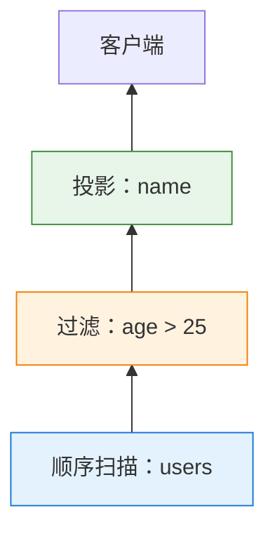
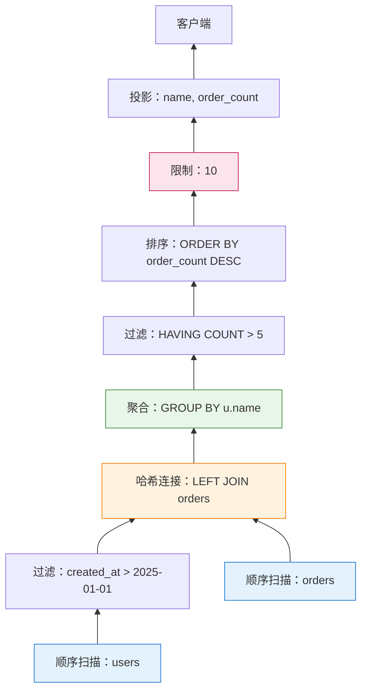
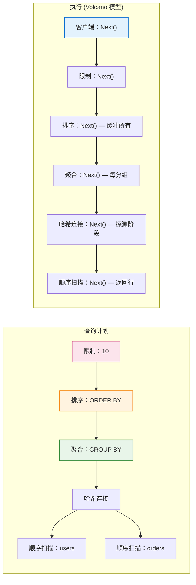

你在 PostgreSQL 中执行的每个 SQL 查询——无论是简单的 `SELECT * FROM users` 还是带有窗口函数的 20 表连接——都通过同一个优雅的机制执行：**Volcano 模型**（也称为迭代器模型）。

这个 1980 年代的架构让 PostgreSQL 能够：
- 串流数 GB 的结果而不必将所有内容载入内存
- 在 `LIMIT` 查询中提前停止，无需处理所有行
- 灵活地链接算子，无需为每种组合编写自定义代码

但这也是为什么 PostgreSQL 在某些分析工作负载上挣扎，而**向量化执行**在这些场景中表现出色。以下是深入探讨：Volcano 模型如何运作、为什么 PostgreSQL 选择它，以及它在哪里失效。

---

## 1 什么是 Volcano 模型？

**Volcano 模型**是一种执行架构，其中查询被表示为**算子树**，每个算子暴露一个标准接口：`Next()`（在 PostgreSQL 代码库中为 `GetNext()`）。

每个算子：
- 通过调用 `Next()` 向其子节点请求行
- 一次处理一行
- 向其父节点返回一行

这个**基于拉取**的模型意味着数据向上流经树，每次调用一行，直到顶部节点将结果返回给客户端。

### 它是架构？模式？还是其他什么？

Volcano 模型经常使用不同的术语来描述。以下是精确的分类：

| 术语 | Volcano 是这个吗？ | 为什么 |
|------|-------------------|--------|
| **执行模型** | ✅ **最准确** | 定义计算*如何*进行（逐行、基于拉取） |
| **架构模式** | ✅ **也正确** | 定义高层结构（带有标准接口的算子树） |
| **设计模式** | ⚠️ **部分** | 建立在*迭代器模式之上*，但不仅仅是一个模式 |
| **软件架构** | ❌ **太宽泛** | 它是数据库架构的*一部分*，不是整个架构 |
| **算法** | ❌ **不是** | 它是结构框架，不是特定的计算过程 |

**关系：**

```
迭代器模式 (GoF 设计模式)
        ↓
    被使用
        ↓
Volcano 模型 (架构模式 / 执行模型)
        ↓
    实作于
        ↓
PostgreSQL 执行器 (软件架构)
```

**为什么混淆？**

| 来源 | 使用术语 | 原因 |
|------|----------|------|
| **学术论文** | "执行模型" | 专注于计算语义 |
| **数据库供应商** | "架构" | 营销；听起来更实质 |
| **软件工程师** | "模式" | 熟悉设计模式词汇 |
| **PostgreSQL 文件** | "执行器" | 实作导向的命名 |

**精确答案：**

Volcano 模型最好描述为**用于查询执行的架构模式**：
- 使用**迭代器模式**作为基础
- 定义**执行模型**（基于拉取、一次一行）
- 是数据库整体软件架构的**一部分**

这样理解：
- **迭代器模式** = "我如何遍历集合？"
- **Volcano 模型** = "我如何组合算子来执行查询？"
- **PostgreSQL 执行器** = "实作 Volcano 的实际代码"

---

**简单范例：**

```sql
SELECT name FROM users WHERE age > 25;
```

执行为：



**执行流程：**

```
客户端："给我一行"
  ↓
投影："这是一行"（调用 Filter.Next()）
  ↓
过滤："这是过滤后的行"（调用 SeqScan.Next()）
  ↓
顺序扫描："这是来自磁盘的原始行"
```

每个算子都是**独立的**。过滤器不知道数据来自顺序扫描、索引扫描还是连接。投影不知道数据是否被过滤或原始。这种**模块化**是 Volcano 模型的超能力。

---

## 2 迭代器接口：Next() / GetNext()

在 PostgreSQL 的代码库中，每个执行器节点实作相同的核心接口：

```c
/* 简化自 postgres/src/include/nodes/execnodes.h */
typedef struct PlanState {
    /* ... 状态字段 ... */
} PlanState;

/* 每个节点类型实作这个模式 */
static inline TupleTableSlot *
ExecProcNode(PlanState *node)
{
    if (node->is_done)
        return NULL;  /* 没有更多行 */
    
    /* 节点特定逻辑 */
    return node->next_row;
}
```

**契约：**

| 返回值 | 意义 |
|--------|------|
| 有效的 `TupleTableSlot` | 一行数据 |
| `NULL` | 没有更多行（串流结束） |

**通用执行循环：**

```c
/* 伪代码—PostgreSQL 的实际执行器 */
while (true) {
    TupleTableSlot *slot = ExecProcNode(top_node);
    
    if (TupIsNull(slot))
        break;  /* 没有更多行 */
    
    /* 处理行（发送到客户端、聚合等） */
    send_to_client(slot);
}
```

这个循环——**调用 `Next()`、处理行、重复**——就是整个 Volcano 模型。每个查询，无论多复杂，都归结为这个模式。

---

## 3 算子树：查询如何变成执行计划

当你运行查询时，PostgreSQL 的规划器建立一个**算子树**。每个节点是一个具有特定逻辑的执行器类型。

### 常见算子类型

| 算子 | 做什么 | 调用子节点多少次？ |
|--------|--------|-------------------|
| **顺序扫描** | 从磁盘读取表页 | N/A（叶节点） |
| **索引扫描** | 读取索引，获取堆元组 | N/A（叶节点） |
| **过滤** | 应用 WHERE 子句 | 1+（直到行通过过滤） |
| **投影** | 选择/计算列 | 1 |
| **嵌套循环连接** | 对每个外部行，扫描内部 | 1 外部 + N 内部 |
| **哈希连接** | 建立哈希表，探测 | N（建立阶段）+ N（探测阶段） |
| **合并连接** | 合并排序的输入 | 每个排序输入 1 次 |
| **聚合** | 分组并计算聚合 | N（直到分组完成） |
| **排序** | 排序输入，按顺序返回 | N（缓冲全部，然后返回） |
| **限制** | 在 N 行后停止 | N（传递通过） |

### 范例：复杂查询

```sql
SELECT
    u.name,
    COUNT(o.id) as order_count
FROM users u
LEFT JOIN orders o ON u.id = o.user_id
WHERE u.created_at > '2025-01-01'
GROUP BY u.name
HAVING COUNT(o.id) > 5
ORDER BY order_count DESC
LIMIT 10;
```

**执行计划（简化）：**



**执行流程（第一行）：**

```
1. 客户端调用 Limit.Next()
2. Limit 调用 Sort.Next()
3. Sort 缓冲所有输入（调用 Aggregate.Next() 直到 NULL）
4. Aggregate 为每个分组调用 HAVING Filter.Next()
5. HAVING Filter 调用 Aggregate.Next()（已消耗连接）
6. Hash Join 从 orders 建立哈希表，然后用 users 探测
7. Users 顺序扫描读取行，Filter 应用 created_at > '2025-01-01'
8. Sort 返回第一行（最高 order_count）
9. Limit 将其返回给客户端
```

注意：**Sort 必须在返回任何内容之前消耗所有输入**。这是一个**阻塞算子**——它打破了纯串流模型。

!!! question "🤔 为什么这很重要？"
    像 `Sort`、`Hash Aggregate` 和 `Hash Join (建立阶段)` 这样的阻塞算子强制 PostgreSQL 在产生结果之前**缓冲数据**。这意味着：
    
    - **内存压力** — 必须适合 `work_mem` 或溢出到磁盘
    - **无法提前终止** — 即使有 `LIMIT` 也无法提前停止
    - **延迟影响** — 第一行需要更长时间才能返回
    
    当你在 `EXPLAIN ANALYZE` 中看到这些时，问：*"我能在这个算子之前减少输入大小吗？"*

---

## 4 逐行处理：好的、坏的和慢的

### 好的：为什么 Volcano 运作良好

**1. 内存效率**

非阻塞算子串流行而无需缓冲：

```sql
SELECT name FROM users WHERE age > 25 LIMIT 10;
```

PostgreSQL 可以在找到 10 个匹配行后停止——如果提前找到匹配，无需扫描整个表。

**内存使用：** 每个算子 O(1)（只是当前行状态）

---

**2. 模块化**

算子自由组合。相同的 Filter 可用于：
- 顺序扫描
- 索引扫描
- 任何连接类型
- 子查询结果

无需为每种组合编写自定义代码。

---

**3. 提前终止**

```sql
EXISTS (SELECT 1 FROM orders WHERE user_id = 42)
```

在第一个匹配行处停止。无需找到所有匹配。

---

**4. 简单实作**

每个算子是一个自包含函数：

```c
TupleTableSlot *
ExecFilter(FilterState *state)
{
    while (true) {
        TupleTableSlot *slot = ExecProcNode(outer_plan(state));
        
        if (TupIsNull(slot))
            return NULL;
        
        if (passes_qual(slot, state->qual))
            return slot;
        
        /* 行不匹配—尝试下一行 */
    }
}
```

约 30 行代码。易于理解。易于除错。

!!! tip "💡 关键洞察：简单性实现可扩展性"
    因为每个算子都很简单（约 30-100 行），PostgreSQL 可以新增算子类型而无需重写整个执行器。这就是为什么扩展功能可以新增自定义扫描方法、连接类型和聚合策略。Volcano 模型的**统一接口**使 PostgreSQL 可扩展。

---

### 坏的：Volcano 在哪里挣扎

**1. 函数调用开销**

每行需要：
- 调用子节点的 `Next()`
- 调用父节点的 `Next()`
- 虚拟函数分派（在某些实作中）

对于 100 万行：**200 万次函数调用**只是用于管道。

---

**2. 无向量化**

现代 CPU 擅长 **SIMD**（单指令多数据）：

```
纯量 (Volcano)：处理行 1，然后行 2，然后行 3...
向量化：       并行处理行 1-1024
```

Volcano 的逐行模型无法利用 SIMD，因为：
- 每行独立处理
- 没有用于向量化的批次上下文
- 状态是每行，不是每批次

---

**3. 缓存效率低**

```c
/* Volcano：分散的内存访问 */
while (row = Next()) {
    process(row->col1);  /* 可能在不同缓存行 */
    process(row->col2);  /* 又一次缓存未命中 */
    process(row->col3);  /* 又一次缓存未命中 */
}
```

列式/向量化引擎一起处理一列的所有值：

```c
/* 向量化：顺序内存访问 */
for (batch : batches) {
    process(batch.col1[0..1023]);  /* 顺序—缓存友好 */
    process(batch.col2[0..1023]);  /* 顺序—缓存友好 */
}
```

---

**4. 阻塞算子打破串流**

某些算子必须在产生输出之前消耗所有输入：

| 阻塞算子 | 为什么阻塞 |
|------------|------------|
| **Sort** | 必须看到所有行才能确定顺序 |
| **Hash Aggregate** | 必须看到分组中的所有行才能计算聚合 |
| **Hash Join (建立阶段)** | 必须建立整个哈希表才能探测 |
| **Distinct** | 必须看到所有行才能消除重复 |

当计划中有阻塞算子时，**上游算子无法串流**——它们必须缓冲。

---

## 5 PostgreSQL 的实作：ExecProcNode

在 PostgreSQL 的源代码中，Volcano 接口是 `ExecProcNode()`：

```c
/* 简化自 src/include/nodes/execnodes.h */
static inline TupleTableSlot *
ExecProcNode(PlanState *node)
{
    if (node->is_done)
        return NULL;
    
    /* 分派到节点特定函数 */
    return node->ExecProcNode(node);
}
```

每个节点类型实作自己的 `ExecProcNode`：

| 节点类型 | 实作函数 |
|----------|----------|
| 顺序扫描 | `ExecSeqScan()` |
| 索引扫描 | `ExecIndexScan()` |
| 哈希连接 | `ExecHashJoin()` |
| 聚合 | `ExecAggregate()` |
| 排序 | `ExecSort()` |
| 过滤 | `ExecFilter()` |

### 范例：过滤节点

```c
/* 简化自 src/backend/executor/nodeFilter.c */
TupleTableSlot *
ExecFilter(FilterState *node)
{
    ExprContext *econtext = node->ps.ps_ExprContext;
    ExprState *qual = node->filterqual;
    
    for (;;) {
        /* 从外部计划获取元组 */
        TupleTableSlot *slot = ExecProcNode(outerPlan(node));
        
        /* 没有更多行？ */
        if (TupIsNull(slot))
            return NULL;
        
        /* 设置表达式上下文 */
        econtext->ecxt_outertuple = slot;
        
        /* 检查限定条件 */
        if (ExecQual(qual, econtext))
            return slot;  /* 通过过滤—返回它 */
        
        /* 未通过—循环并尝试下一行 */
        InstrCountFiltered1(node, 1);  /* 统计追踪 */
    }
}
```

**关键观察：**

1. **无限循环** 直到行通过或没有更多行
2. **单进单出**
3. **无状态** 在调用之间（除了统计）
4. **委托给子节点** 通过 `ExecProcNode(outerPlan(node))`

这个模式在约 50 个执行器节点类型中重复。

---

## 6 性能影响：Volcano 何时发光何时挣扎

### Volcano 擅长：

| 工作负载 | 为什么 |
|----------|--------|
| **OLTP**（短、选择性查询） | 处理少量行；函数调用开销可忽略 |
| **带 LIMIT 的索引扫描** | 提前终止；最小 I/O |
| **串流大结果** | 无缓冲；恒定内存 |
| **带选择性过滤的复杂连接** | 过滤在昂贵连接前减少行 |

**范例：OLTP 查询**

```sql
SELECT * FROM orders
WHERE user_id = 12345
  AND status = 'pending'
LIMIT 1;
```

- 索引扫描在约 3 次 I/O 操作中找到匹配行
- 过滤应用 `status = 'pending'`
- Limit 在第一个匹配后停止
- **总处理行数：** 1-5
- **Volcano 开销：** 可忽略

---

### Volcano 挣扎：

| 工作负载 | 为什么 |
|----------|--------|
| **分析**（扫描数百万行） | 函数调用开销主导 |
| **列式访问模式** | 逐行阻止列向量化 |
| **批量聚合** | 无用于 SIMD 的批次处理 |
| **带简单过滤的全表扫描** | 90% 时间在 `Next()` 管道中 |

**范例：分析查询**

```sql
SELECT
    DATE_TRUNC('month', created_at) as month,
    SUM(amount) as total
FROM transactions
WHERE created_at >= '2020-01-01'
GROUP BY month;
```

- 扫描 1 亿行
- 每行：`Next()` 调用、过滤检查、日期截断、聚合
- **函数调用：** 2 亿+（每行 2 次）
- **Volcano 开销：** 总时间的 20-40%

!!! warning "⚠️ 隐藏成本：不只是函数调用"
    函数调用开销只是问题的一部分。逐行处理还意味着：
    
    1. **分支预测错误** — CPU 无法预测每行采取哪条路径
    2. **SIMD 利用不足** — 现代 CPU 可以并行处理 4-8 个值，但 Volcano 使用纯量操作
    3. **缓存抖动** — 每行可能触及不同的内存位置
    
    对于分析查询，这些 CPU 级别的低效率通常比函数调用计数本身更重要。

---

## 7 向量化执行：替代方案

**向量化引擎**（ClickHouse、DuckDB、Snowflake）以**批次**处理行（通常 1024-8192 行）：

```c
/* 向量化接口 */
struct VectorBatch {
    int32_t col1[1024];
    int32_t col2[1024];
    bool nulls[1024];
    int count;  /* 批次中的实际行数 */
};

VectorBatch* NextBatch(Operator* op);
```

**执行：**

```c
while (batch = NextBatch()) {
    /* 一次处理所有 1024 行 */
    for (int i = 0; i < batch->count; i++) {
        if (!batch->nulls[i] && batch->col1[i] > 25) {
            result->col1[result->count++] = batch->col1[i];
        }
    }
}
```

**好处：**

| 方面 | Volcano (行) | 向量化 (批次) |
|------|-------------|--------------|
| 每行函数调用 | 2+ | 2 / batch_size (~0.002) |
| SIMD 利用 | 无 | 高（每指令处理 4-8 个值） |
| 缓存效率 | 差（行布局） | 高（列布局） |
| 代码复杂性 | 低 | 高（批次管理、向量化） |

!!! question "🤔 那么为什么 PostgreSQL 不切换？"
    如果向量化对分析快 5-10 倍，为什么不采用？
    
    - **向后兼容** — 扩展功能依赖当前的 `ExecProcNode()` API
    - **代码复杂性** — 重写 50+ 个节点类型是巨大的工作
    - **OLTP 权衡** — 向量化帮助分析但可能伤害 OLTP 延迟
    - **哲学** — PostgreSQL 偏好稳定、渐进的改进
    
    答案：**通过扩展功能，不是核心变更**。见下一节。

---

### 为什么 PostgreSQL（还）不使用向量化

**1. 历史原因**

PostgreSQL 的执行器设计于 1980-1990 年代，在 SIMD 和列式储存成为主流之前。

**2. 架构耦合**

向量化需要：
- 列式储存（或行到列转换）
- 感知批次的算子（重写约 50 个节点类型）
- 向量化表达式评估（重写表达式引擎）

**3. OLTP 焦点**

PostgreSQL 优化混合工作负载，不仅仅是分析。

**4. 扩展功能方法**

PostgreSQL 支持扩展功能而不是重写核心：
- **列式储存：** Citus Columnar、Hydra
- **向量化执行：** 实验性补丁（未合并）

---

## 8 混合方法：两全其美

某些数据库混合 Volcano 与向量化：

### Apache Spark

- **Volcano 风格** 迭代器接口
- **向量化读取器**（Parquet、ORC）
- **全程代码生成**（融合算子、消除 `Next()` 调用）

### DuckDB

- **向量化执行** 作为预设
- **Volcano 风格** 算子树
- **基于区块** 处理（每区块 2048 行）

### PostgreSQL（当前）

- **Volcano 模型** 贯穿始终
- **即时编译**（LLVM）用于表达式评估
- **并行查询** 用于某些操作（并行顺序扫描、哈希连接、聚合）

**JIT 编译范例：**

```sql
SET jit = on;

SELECT sum(amount * 1.15)  /* 表达式编译为原生代码 */
FROM transactions
WHERE created_at >= '2025-01-01';
```

PostgreSQL 将表达式 `amount * 1.15` 编译为原生机器码，减少解释开销。这没有修复 Volcano 的逐行模型，但有帮助。

---

## 9 PostgreSQL 用户的实用要点

### Volcano 运作良好时：

```sql
/* ✅ 好：选择性索引扫描 */
SELECT * FROM users WHERE email = 'user@example.com';

/* ✅ 好：提前终止 */
SELECT EXISTS (SELECT 1 FROM orders WHERE user_id = 42);

/* ✅ 好：带 LIMIT 的串流 */
SELECT * FROM logs ORDER BY timestamp DESC LIMIT 100;

/* ✅ 好：流水线连接 */
SELECT * FROM users u
JOIN orders o ON u.id = o.user_id
WHERE u.country = 'US';  /* 过滤减少连接输入 */
```

---

### Volcano 挣扎时：

```sql
/* ⚠️ 差：带聚合的全表扫描 */
SELECT COUNT(*) FROM transactions;  /* 必须扫描所有行 */

/* ⚠️ 差：每行复杂表达式 */
SELECT UPPER(CONCAT(first_name, ' ', last_name)) FROM users;

/* ⚠️ 差：大数据集上的阻塞算子 */
SELECT DISTINCT category FROM products;  /* 必须缓冲所有 */

/* ⚠️ 差：分析窗口函数 */
SELECT
    user_id,
    AVG(amount) OVER (PARTITION BY user_id ORDER BY date)
FROM transactions;
```

---

### 优化策略：

**1. 向下推送过滤**

```sql
/* ❌ 差：连接后过滤 */
SELECT * FROM users u
JOIN orders o ON u.id = o.user_id
WHERE u.created_at > '2025-01-01';

/* ✅ 好：连接前过滤（PostgreSQL 自动执行） */
/* 规划器将过滤向下推送到 users 扫描 */
```

!!! tip "💡 信任但验证"
    PostgreSQL 的规划器擅长向下推送过滤，但**不总是最佳**。使用 `EXPLAIN (ANALYZE, BUFFERS)` 验证：
    
    - 过滤出现在昂贵操作**之前**（Join、Sort、Aggregate）
    - `Rows Removed by Filter` 合理（不是扫描数百万只过滤掉 99%）
    
    如果规划器出错，尝试：
    - **CTE**（在 PG14+ 中，它们作为优化栅栏）
    - **子查询** 强制评估顺序
    - **部分索引** 使过滤扫描更便宜

---

**2. 使用索引减少行**

```sql
/* ❌ 差：大表上的顺序扫描 */
SELECT * FROM transactions WHERE user_id = 42;

/* ✅ 好：索引扫描 */
CREATE INDEX ON transactions(user_id);
```

**3. 避免不必要的阻塞算子**

```sql
/* ❌ 差：大结果上的 DISTINCT */
SELECT DISTINCT category FROM million_row_table;

/* ✅ 好：GROUP BY（相同结果，更清晰的意图） */
SELECT category FROM million_row_table GROUP BY category;
```

**4. 利用并行查询**

```sql
/* 启用并行查询 */
SET max_parallel_workers_per_gather = 4;

/* 并行顺序扫描 + 哈希聚合 */
SELECT COUNT(*) FROM large_table;
```

---

## 10 未来：向量化会来到 PostgreSQL 吗？

**简短答案：** 不会到核心，但扩展功能正在实验。

### 当前努力：

| 专案 | 方法 | 状态 |
|------|------|------|
| **Citus Columnar** | 带逐行执行的列式储存 | 生产 |
| **Hydra** | 用于分析的列式储存 | 生产 |
| **pg_vectorize** | 向量化表达式评估 | 实验 |
| **LLVM JIT** | 编译表达式（未向量化） | 生产 (PG11+) |

### 为什么核心不会很快变更：

1. **向后兼容** — 扩展功能依赖当前执行器 API
2. **复杂性** — 重写 50+ 个节点类型是巨大的工作
3. **权衡** — 向量化帮助分析，伤害 OLTP 延迟
4. **哲学** — PostgreSQL 偏好稳定、渐进的改进

**最可能的路径：** 通过扩展功能向量化，不是核心变更。

!!! info "📌 这对你意味着什么"
    不要等待 PostgreSQL 核心的向量化。相反：
    
    - **对于 OLTP：** Volcano 运作良好—专注于索引和查询设计
    - **对于分析：** 使用扩展功能（Citus Columnar、Hydra）或专用工具（DuckDB、ClickHouse）
    - **对于混合工作负载：** 利用 JIT 编译和并行查询
    
    正确的工具取决于你的查询模式，不仅仅是原始性能基准。

---

## 总结：一张图中的 Volcano 模型



**关键要点：**

| 方面 | Volcano 模型 |
|------|-------------|
| **接口** | `Next()` / `GetNext()` — 一次一行 |
| **结构** | 算子树 |
| **数据流** | 基于拉取（子 → 父） |
| **内存** | 串流 O(1)，阻塞算子 O(N) |
| **最适合** | OLTP、选择性查询、串流 |
| **最不适合** | 分析、全扫描、批量聚合 |
| **PostgreSQL 状态** | 自成立以来的核心执行模型 |

Volcano 模型不完美——但经过 40+ 年，它仍然是大多数 SQL 数据库的基础。理解它帮助你编写*与* PostgreSQL 架构合作而不是对抗的查询。

!!! success "✅ 关键要点"
    Volcano 模型是**权衡**，不是错误：
    
    - **收益：** 简单性、可扩展性、串流、提前终止
    - **损失：** 函数调用开销、无 SIMD、缓存效率低
    
    对于 OLTP 和混合工作负载，收益大于损失。对于纯分析，考虑列式/向量化替代方案。
    
    **你作为 PostgreSQL 用户的工作：** 知道哪些查询发挥 Volcano 的优势——哪些与它对抗。

---

**进一步阅读：**

- Graefe, Goetz. ["Volcano—An Extensible and Parallel Query Evaluation System"](https://www.cs.du.edu/~snarayan/courses/comp_db/lecture11.pdf) (1994) — 原始论文
- PostgreSQL 源代码：[`src/backend/executor/`](https://github.com/postgres/postgres/tree/master/src/backend/executor) — 实际实作
- "PostgreSQL Internals" by Egor Rogov — 深入探讨执行器架构
- DuckDB 文件：["Vectorized Execution"](https://duckdb.org/docs/internals/vectorized_execution) — 替代方法
