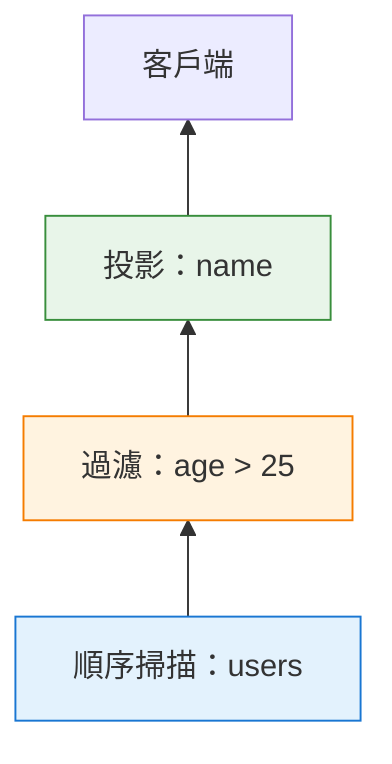
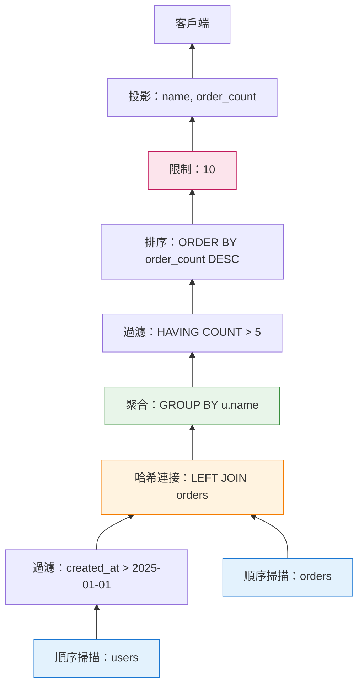
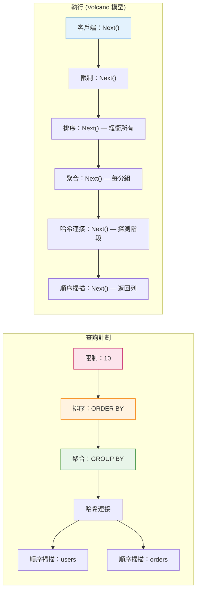

你在 PostgreSQL 中執行的每個 SQL 查詢——無論是簡單的 `SELECT * FROM users` 還是帶有視窗函數的 20 表連接——都通過同一個優雅的機制執行：**Volcano 模型**（也稱為迭代器模型）。

這個 1980 年代的架構讓 PostgreSQL 能夠：
- 串流數 GB 的結果而不必將所有内容載入記憶體
- 在 `LIMIT` 查詢中提前停止，無需處理所有列
- 靈活地鏈接運算子，無需為每種組合編寫自訂代碼

但這也是為什麼 PostgreSQL 在某些分析工作負載上掙扎，而**向量化執行**在這些場景中表現出色。以下是深入探討：Volcano 模型如何運作、為什麼 PostgreSQL 選擇它，以及它在哪裡失效。

---

## 1 什麼是 Volcano 模型？

**Volcano 模型**是一種執行架構，其中查詢被表示為**運算子樹**，每個運算子暴露一個標準介面：`Next()`（在 PostgreSQL 代碼庫中為 `GetNext()`）。

每個運算子：
- 通過調用 `Next()` 向其子節點請求列
- 一次處理一列
- 向其父節點返回一列

這個**基於拉取**的模型意味著數據向上流經樹，每次調用一列，直到頂部節點將結果返回給客戶端。

### 它是架構？模式？還是其他什麼？

Volcano 模型經常使用不同的術語來描述。以下是精確的分類：

| 術語 | Volcano 是這個嗎？ | 為什麼 |
|------|-------------------|--------|
| **執行模型** | ✅ **最準確** | 定義計算*如何*進行（逐列、基於拉取） |
| **架構模式** | ✅ **也正確** | 定義高層結構（帶有標準介面的運算子樹） |
| **設計模式** | ⚠️ **部分** | 建立在*迭代器模式之上*，但不僅僅是一個模式 |
| **軟體架構** | ❌ **太寬泛** | 它是資料庫架構的*一部分*，不是整個架構 |
| **演算法** | ❌ **不是** | 它是結構框架，不是特定的計算過程 |

**關係：**

```
迭代器模式 (GoF 設計模式)
        ↓
    被使用
        ↓
Volcano 模型 (架構模式 / 執行模型)
        ↓
    實作於
        ↓
PostgreSQL 執行器 (軟體架構)
```

**為什麼混淆？**

| 來源 | 使用術語 | 原因 |
|------|----------|------|
| **學術論文** | "執行模型" | 專注於計算語義 |
| **資料庫供應商** | "架構" | 行銷；聽起來更實質 |
| **軟體工程師** | "模式" | 熟悉設計模式詞彙 |
| **PostgreSQL 文件** | "執行器" | 實作導向的命名 |

**精確答案：**

Volcano 模型最好描述為**用於查詢執行的架構模式**：
- 使用**迭代器模式**作為基礎
- 定義**執行模型**（基於拉取、一次一列）
- 是資料庫整體軟體架構的**一部分**

這樣理解：
- **迭代器模式** = "我如何遍历集合？"
- **Volcano 模型** = "我如何組合運算子來執行查詢？"
- **PostgreSQL 執行器** = "實作 Volcano 的實際代碼"

---

**簡單範例：**

```sql
SELECT name FROM users WHERE age > 25;
```

執行為：



**執行流程：**

```
客戶端："給我一列"
  ↓
投影："這是一列"（調用 Filter.Next()）
  ↓
過濾："這是過濾後的列"（調用 SeqScan.Next()）
  ↓
順序掃描："這是來自磁碟的原始列"
```

每個運算子都是**獨立的**。過濾器不知道數據來自順序掃描、索引掃描還是連接。投影不知道數據是否被過濾或原始。這種**模組化**是 Volcano 模型的超能力。

---

## 2 迭代器介面：Next() / GetNext()

在 PostgreSQL 的代碼庫中，每個執行器節點實作相同的核心介面：

```c
/* 簡化自 postgres/src/include/nodes/execnodes.h */
typedef struct PlanState {
    /* ... 狀態欄位 ... */
} PlanState;

/* 每個節點類型實作這個模式 */
static inline TupleTableSlot *
ExecProcNode(PlanState *node)
{
    if (node->is_done)
        return NULL;  /* 沒有更多列 */
    
    /* 節點特定邏輯 */
    return node->next_row;
}
```

**契約：**

| 返回值 | 意義 |
|--------|------|
| 有效的 `TupleTableSlot` | 一列數據 |
| `NULL` | 沒有更多列（串流結束） |

**通用執行迴圈：**

```c
/* 偽代碼—PostgreSQL 的實際執行器 */
while (true) {
    TupleTableSlot *slot = ExecProcNode(top_node);
    
    if (TupIsNull(slot))
        break;  /* 沒有更多列 */
    
    /* 處理列（發送到客戶端、聚合等） */
    send_to_client(slot);
}
```

這個迴圈——**調用 `Next()`、處理列、重複**——就是整個 Volcano 模型。每個查詢，無論多複雜，都歸結為這個模式。

---

## 3 運算子樹：查詢如何變成執行計劃

當你運行查詢時，PostgreSQL 的規劃器建立一個**運算子樹**。每個節點是一個具有特定邏輯的執行器類型。

### 常見運算子類型

| 運算子 | 做什麼 | 調用子節點多少次？ |
|--------|--------|-------------------|
| **順序掃描** | 從磁碟讀取表頁 | N/A（葉節點） |
| **索引掃描** | 讀取索引，獲取堆元組 | N/A（葉節點） |
| **過濾** | 應用 WHERE 子句 | 1+（直到列通過過濾） |
| **投影** | 選擇/計算列 | 1 |
| **嵌套迴圈連接** | 對每個外部列，掃描內部 | 1 外部 + N 內部 |
| **哈希連接** | 建立哈希表，探測 | N（建立階段）+ N（探測階段） |
| **合併連接** | 合併排序的輸入 | 每個排序輸入 1 次 |
| **聚合** | 分組並計算聚合 | N（直到分組完成） |
| **排序** | 排序輸入，按順序返回 | N（緩衝全部，然後返回） |
| **限制** | 在 N 列後停止 | N（傳遞通過） |

### 範例：複雜查詢

```sql
SELECT
    u.name,
    COUNT(o.id) as order_count
FROM users u
LEFT JOIN orders o ON u.id = o.user_id
WHERE u.created_at > '2025-01-01'
GROUP BY u.name
HAVING COUNT(o.id) > 5
ORDER BY order_count DESC
LIMIT 10;
```

**執行計劃（簡化）：**



**執行流程（第一列）：**

```
1. 客戶端調用 Limit.Next()
2. Limit 調用 Sort.Next()
3. Sort 緩衝所有輸入（調用 Aggregate.Next() 直到 NULL）
4. Aggregate 為每個分組調用 HAVING Filter.Next()
5. HAVING Filter 調用 Aggregate.Next()（已消耗連接）
6. Hash Join 從 orders 建立哈希表，然後用 users 探測
7. Users 順序掃描讀取列，Filter 應用 created_at > '2025-01-01'
8. Sort 返回第一列（最高 order_count）
9. Limit 將其返回給客戶端
```

注意：**Sort 必須在返回任何内容之前消耗所有輸入**。這是一個**阻塞運算子**——它打破了純串流模型。

!!! question "🤔 為什麼這很重要？"
    像 `Sort`、`Hash Aggregate` 和 `Hash Join (建立階段)` 這樣的阻塞運算子強制 PostgreSQL 在產生結果之前**緩衝數據**。這意味著：
    
    - **記憶體壓力** — 必須適合 `work_mem` 或溢出到磁碟
    - **無法提前終止** — 即使有 `LIMIT` 也無法提前停止
    - **延遲影響** — 第一列需要更長時間才能返回
    
    當你在 `EXPLAIN ANALYZE` 中看到這些時，問：*"我能在這個運算子之前減少輸入大小嗎？"*

---

## 4 逐列處理：好的、壞的和慢的

### 好的：為什麼 Volcano 運作良好

**1. 記憶體效率**

非阻塞運算子串流列而无需緩衝：

```sql
SELECT name FROM users WHERE age > 25 LIMIT 10;
```

PostgreSQL 可以在找到 10 個匹配列後停止——如果提前找到匹配，無需掃描整個表。

**記憶體使用：** 每個運算子 O(1)（只是當前列狀態）

---

**2. 模組化**

運算子自由組合。相同的 Filter 可用於：
- 順序掃描
- 索引掃描
- 任何連接類型
- 子查詢結果

無需為每種組合編寫自訂代碼。

---

**3. 提前終止**

```sql
EXISTS (SELECT 1 FROM orders WHERE user_id = 42)
```

在第一個匹配列處停止。無需找到所有匹配。

---

**4. 簡單實作**

每個運算子是一個自包含函數：

```c
TupleTableSlot *
ExecFilter(FilterState *state)
{
    while (true) {
        TupleTableSlot *slot = ExecProcNode(outer_plan(state));
        
        if (TupIsNull(slot))
            return NULL;
        
        if (passes_qual(slot, state->qual))
            return slot;
        
        /* 列不匹配—嘗試下一列 */
    }
}
```

約 30 行代碼。易於理解。易於除錯。

!!! tip "💡 關鍵洞察：簡單性實現可擴展性"
    因為每個運算子都很簡單（約 30-100 行），PostgreSQL 可以新增運算子類型而無需重寫整個執行器。這就是為什麼擴充功能可以新增自訂掃描方法、連接類型和聚合策略。Volcano 模型的**統一介面**使 PostgreSQL 可擴展。

---

### 壞的：Volcano 在哪裡掙扎

**1. 函數調用開銷**

每列需要：
- 調用子節點的 `Next()`
- 調用父節點的 `Next()`
- 虛擬函數分派（在某些實作中）

對於 100 萬列：**200 萬次函數調用**只是用於管道。

---

**2. 無向量化**

現代 CPU 擅長 **SIMD**（單指令多數據）：

```
純量 (Volcano)：處理列 1，然後列 2，然後列 3...
向量化：       並行處理列 1-1024
```

Volcano 的逐列模型無法利用 SIMD，因為：
- 每列獨立處理
- 沒有用於向量化的批次上下文
- 狀態是每列，不是每批次

---

**3. 快取效率低**

```c
/* Volcano：分散的記憶體訪問 */
while (row = Next()) {
    process(row->col1);  /* 可能在不同快取行 */
    process(row->col2);  /* 又一次快取未命中 */
    process(row->col3);  /* 又一次快取未命中 */
}
```

列式/向量化引擎一起處理一列的所有值：

```c
/* 向量化：順序記憶體訪問 */
for (batch : batches) {
    process(batch.col1[0..1023]);  /* 順序—快取友好 */
    process(batch.col2[0..1023]);  /* 順序—快取友好 */
}
```

---

**4. 阻塞運算子打破串流**

某些運算子必須在產生輸出之前消耗所有輸入：

| 阻塞運算子 | 為什麼阻塞 |
|------------|------------|
| **Sort** | 必須看到所有列才能確定順序 |
| **Hash Aggregate** | 必須看到分組中的所有列才能計算聚合 |
| **Hash Join (建立階段)** | 必須建立整個哈希表才能探測 |
| **Distinct** | 必須看到所有列才能消除重複 |

當計劃中有阻塞運算子時，**上游運算子無法串流**——它們必須緩衝。

---

## 5 PostgreSQL 的實作：ExecProcNode

在 PostgreSQL 的原始碼中，Volcano 介面是 `ExecProcNode()`：

```c
/* 簡化自 src/include/nodes/execnodes.h */
static inline TupleTableSlot *
ExecProcNode(PlanState *node)
{
    if (node->is_done)
        return NULL;
    
    /* 分派到節點特定函數 */
    return node->ExecProcNode(node);
}
```

每個節點類型實作自己的 `ExecProcNode`：

| 節點類型 | 實作函數 |
|----------|----------|
| 順序掃描 | `ExecSeqScan()` |
| 索引掃描 | `ExecIndexScan()` |
| 哈希連接 | `ExecHashJoin()` |
| 聚合 | `ExecAggregate()` |
| 排序 | `ExecSort()` |
| 過濾 | `ExecFilter()` |

### 範例：過濾節點

```c
/* 簡化自 src/backend/executor/nodeFilter.c */
TupleTableSlot *
ExecFilter(FilterState *node)
{
    ExprContext *econtext = node->ps.ps_ExprContext;
    ExprState *qual = node->filterqual;
    
    for (;;) {
        /* 從外部計劃獲取元組 */
        TupleTableSlot *slot = ExecProcNode(outerPlan(node));
        
        /* 沒有更多列？ */
        if (TupIsNull(slot))
            return NULL;
        
        /* 設置表達式上下文 */
        econtext->ecxt_outertuple = slot;
        
        /* 檢查限定條件 */
        if (ExecQual(qual, econtext))
            return slot;  /* 通過過濾—返回它 */
        
        /* 未通過—迴圈並嘗試下一列 */
        InstrCountFiltered1(node, 1);  /* 統計追蹤 */
    }
}
```

**關鍵觀察：**

1. **無限迴圈** 直到列通過或沒有更多列
2. **單進單出**
3. **無狀態** 在調用之間（除了統計）
4. **委託給子節點** 通過 `ExecProcNode(outerPlan(node))`

這個模式在約 50 個執行器節點類型中重複。

---

## 6 效能影響：Volcano 何時發光何時掙扎

### Volcano 擅長：

| 工作負載 | 為什麼 |
|----------|--------|
| **OLTP**（短、選擇性查詢） | 處理少量列；函數調用開銷可忽略 |
| **帶 LIMIT 的索引掃描** | 提前終止；最小 I/O |
| **串流大結果** | 無緩衝；恆定記憶體 |
| **帶選擇性過濾的複雜連接** | 過濾在昂貴連接前減少列 |

**範例：OLTP 查詢**

```sql
SELECT * FROM orders
WHERE user_id = 12345
  AND status = 'pending'
LIMIT 1;
```

- 索引掃描在約 3 次 I/O 操作中找到匹配列
- 過濾應用 `status = 'pending'`
- Limit 在第一個匹配後停止
- **總處理列數：** 1-5
- **Volcano 開銷：** 可忽略

---

### Volcano 掙扎：

| 工作負載 | 為什麼 |
|----------|--------|
| **分析**（掃描數百萬列） | 函數調用開銷主導 |
| **列式訪問模式** | 逐列阻止列向量化 |
| **批量聚合** | 無用於 SIMD 的批次處理 |
| **帶簡單過濾的全表掃描** | 90% 時間在 `Next()` 管道中 |

**範例：分析查詢**

```sql
SELECT
    DATE_TRUNC('month', created_at) as month,
    SUM(amount) as total
FROM transactions
WHERE created_at >= '2020-01-01'
GROUP BY month;
```

- 掃描 1 億列
- 每列：`Next()` 調用、過濾檢查、日期截斷、聚合
- **函數調用：** 2 億+（每列 2 次）
- **Volcano 開銷：** 總時間的 20-40%

!!! warning "⚠️ 隱藏成本：不只是函數調用"
    函數調用開銷只是問題的一部分。逐列處理還意味著：
    
    1. **分支預測錯誤** — CPU 無法預測每列採取哪條路徑
    2. **SIMD 利用不足** — 現代 CPU 可以並行處理 4-8 個值，但 Volcano 使用純量操作
    3. **快取抖動** — 每列可能觸及不同的記憶體位置
    
    對於分析查詢，這些 CPU 級別的低效率通常比函數調用計數本身更重要。

---

## 7 向量化執行：替代方案

**向量化引擎**（ClickHouse、DuckDB、Snowflake）以**批次**處理列（通常 1024-8192 列）：

```c
/* 向量化介面 */
struct VectorBatch {
    int32_t col1[1024];
    int32_t col2[1024];
    bool nulls[1024];
    int count;  /* 批次中的實際列數 */
};

VectorBatch* NextBatch(Operator* op);
```

**執行：**

```c
while (batch = NextBatch()) {
    /* 一次處理所有 1024 列 */
    for (int i = 0; i < batch->count; i++) {
        if (!batch->nulls[i] && batch->col1[i] > 25) {
            result->col1[result->count++] = batch->col1[i];
        }
    }
}
```

**好處：**

| 方面 | Volcano (列) | 向量化 (批次) |
|------|-------------|--------------|
| 每列函數調用 | 2+ | 2 / batch_size (~0.002) |
| SIMD 利用 | 無 | 高（每指令處理 4-8 個值） |
| 快取效率 | 差（列佈局） | 高（列佈局） |
| 代碼複雜性 | 低 | 高（批次管理、向量化） |

!!! question "🤔 那麼為什麼 PostgreSQL 不切換？"
    如果向量化對分析快 5-10 倍，為什麼不採用？
    
    - **向後相容** — 擴充功能依賴當前的 `ExecProcNode()` API
    - **代碼複雜性** — 重寫 50+ 個節點類型是巨大的工作
    - **OLTP 權衡** — 向量化幫助分析但可能傷害 OLTP 延遲
    - **哲學** — PostgreSQL 偏好穩定、漸進的改進
    
    答案：**通過擴充功能，不是核心變更**。見下一節。

---

### 為什麼 PostgreSQL（還）不使用向量化

**1. 歷史原因**

PostgreSQL 的執行器設計於 1980-1990 年代，在 SIMD 和列式儲存成為主流之前。

**2. 架構耦合**

向量化需要：
- 列式儲存（或列到列轉換）
- 感知批次的運算子（重寫約 50 個節點類型）
- 向量化表達式評估（重寫表達式引擎）

**3. OLTP 焦點**

PostgreSQL 優化混合工作負載，不僅僅是分析。

**4. 擴充功能方法**

PostgreSQL 支援擴充功能而不是重寫核心：
- **列式儲存：** Citus Columnar、Hydra
- **向量化執行：** 實驗性補丁（未合併）

---

## 8 混合方法：兩全其美

某些資料庫混合 Volcano 與向量化：

### Apache Spark

- **Volcano 風格** 迭代器介面
- **向量化讀取器**（Parquet、ORC）
- **全程代碼生成**（融合運算子、消除 `Next()` 調用）

### DuckDB

- **向量化執行** 作為預設
- **Volcano 風格** 運算子樹
- **基於區塊** 處理（每區塊 2048 列）

### PostgreSQL（當前）

- **Volcano 模型** 貫穿始終
- **即時編譯**（LLVM）用於表達式評估
- **並行查詢** 用於某些操作（並行順序掃描、哈希連接、聚合）

**JIT 編譯範例：**

```sql
SET jit = on;

SELECT sum(amount * 1.15)  /* 表達式編譯為原生代碼 */
FROM transactions
WHERE created_at >= '2025-01-01';
```

PostgreSQL 將表達式 `amount * 1.15` 編譯為原生機器碼，減少解釋開銷。這沒有修復 Volcano 的逐列模型，但有幫助。

---

## 9 PostgreSQL 用戶的實用要點

### Volcano 運作良好時：

```sql
/* ✅ 好：選擇性索引掃描 */
SELECT * FROM users WHERE email = 'user@example.com';

/* ✅ 好：提前終止 */
SELECT EXISTS (SELECT 1 FROM orders WHERE user_id = 42);

/* ✅ 好：帶 LIMIT 的串流 */
SELECT * FROM logs ORDER BY timestamp DESC LIMIT 100;

/* ✅ 好：流水線連接 */
SELECT * FROM users u
JOIN orders o ON u.id = o.user_id
WHERE u.country = 'US';  /* 過濾減少連接輸入 */
```

---

### Volcano 掙扎時：

```sql
/* ⚠️ 差：帶聚合的全表掃描 */
SELECT COUNT(*) FROM transactions;  /* 必須掃描所有列 */

/* ⚠️ 差：每列複雜表達式 */
SELECT UPPER(CONCAT(first_name, ' ', last_name)) FROM users;

/* ⚠️ 差：大資料集上的阻塞運算子 */
SELECT DISTINCT category FROM products;  /* 必須緩衝所有 */

/* ⚠️ 差：分析視窗函數 */
SELECT
    user_id,
    AVG(amount) OVER (PARTITION BY user_id ORDER BY date)
FROM transactions;
```

---

### 優化策略：

**1. 向下推送過濾**

```sql
/* ❌ 差：連接後過濾 */
SELECT * FROM users u
JOIN orders o ON u.id = o.user_id
WHERE u.created_at > '2025-01-01';

/* ✅ 好：連接前過濾（PostgreSQL 自動執行） */
/* 規劃器將過濾向下推送到 users 掃描 */
```

!!! tip "💡 信任但驗證"
    PostgreSQL 的規劃器擅長向下推送過濾，但**不總是最佳**。使用 `EXPLAIN (ANALYZE, BUFFERS)` 驗證：
    
    - 過濾出現在昂貴操作**之前**（Join、Sort、Aggregate）
    - `Rows Removed by Filter` 合理（不是掃描數百萬只過濾掉 99%）
    
    如果規劃器出錯，嘗試：
    - **CTE**（在 PG14+ 中，它們作為優化柵欄）
    - **子查詢** 強制評估順序
    - **部分索引** 使過濾掃描更便宜

---

**2. 使用索引減少列**

```sql
/* ❌ 差：大表上的順序掃描 */
SELECT * FROM transactions WHERE user_id = 42;

/* ✅ 好：索引掃描 */
CREATE INDEX ON transactions(user_id);
```

**3. 避免不必要的阻塞運算子**

```sql
/* ❌ 差：大結果上的 DISTINCT */
SELECT DISTINCT category FROM million_row_table;

/* ✅ 好：GROUP BY（相同結果，更清晰的意圖） */
SELECT category FROM million_row_table GROUP BY category;
```

**4. 利用並行查詢**

```sql
/* 啟用並行查詢 */
SET max_parallel_workers_per_gather = 4;

/* 並行順序掃描 + 哈希聚合 */
SELECT COUNT(*) FROM large_table;
```

---

## 10 未來：向量化會來到 PostgreSQL 嗎？

**簡短答案：** 不會到核心，但擴充功能正在實驗。

### 當前努力：

| 專案 | 方法 | 狀態 |
|------|------|------|
| **Citus Columnar** | 帶逐列執行的列式儲存 | 生產 |
| **Hydra** | 用於分析的列式儲存 | 生產 |
| **pg_vectorize** | 向量化表達式評估 | 實驗 |
| **LLVM JIT** | 編譯表達式（未向量化） | 生產 (PG11+) |

### 為什麼核心不會很快變更：

1. **向後相容** — 擴充功能依賴當前執行器 API
2. **複雜性** — 重寫 50+ 個節點類型是巨大的工作
3. **權衡** — 向量化幫助分析，傷害 OLTP 延遲
4. **哲學** — PostgreSQL 偏好穩定、漸進的改進

**最可能的路徑：** 通過擴充功能向量化，不是核心變更。

!!! info "📌 這對你意味著什麼"
    不要等待 PostgreSQL 核心的向量化。相反：
    
    - **對於 OLTP：** Volcano 運作良好—專注於索引和查詢設計
    - **對於分析：** 使用擴充功能（Citus Columnar、Hydra）或專用工具（DuckDB、ClickHouse）
    - **對於混合工作負載：** 利用 JIT 編譯和並行查詢
    
    正確的工具取決於你的查詢模式，不僅僅是原始效能基準。

---

## 總結：一張圖中的 Volcano 模型



**關鍵要點：**

| 方面 | Volcano 模型 |
|------|-------------|
| **介面** | `Next()` / `GetNext()` — 一次一列 |
| **結構** | 運算子樹 |
| **數據流** | 基於拉取（子 → 父） |
| **記憶體** | 串流 O(1)，阻塞運算子 O(N) |
| **最適合** | OLTP、選擇性查詢、串流 |
| **最不適合** | 分析、全掃描、批量聚合 |
| **PostgreSQL 狀態** | 自成立以來的核心執行模型 |

Volcano 模型不完美——但經過 40+ 年，它仍然是大多數 SQL 資料庫的基礎。理解它幫助你編寫*與* PostgreSQL 架構合作而不是對抗的查詢。

!!! success "✅ 關鍵要點"
    Volcano 模型是**權衡**，不是錯誤：
    
    - **收益：** 簡單性、可擴展性、串流、提前終止
    - **損失：** 函數調用開銷、無 SIMD、快取效率低
    
    對於 OLTP 和混合工作負載，收益大於損失。對於純分析，考慮列式/向量化替代方案。
    
    **你作為 PostgreSQL 用戶的工作：** 知道哪些查詢發揮 Volcano 的優勢——哪些與它對抗。

---

**進一步閱讀：**

- Graefe, Goetz. ["Volcano—An Extensible and Parallel Query Evaluation System"](https://www.cs.du.edu/~snarayan/courses/comp_db/lecture11.pdf) (1994) — 原始論文
- PostgreSQL 原始碼：[`src/backend/executor/`](https://github.com/postgres/postgres/tree/master/src/backend/executor) — 實際實作
- "PostgreSQL Internals" by Egor Rogov — 深入探討執行器架構
- DuckDB 文件：["Vectorized Execution"](https://duckdb.org/docs/internals/vectorized_execution) — 替代方法
