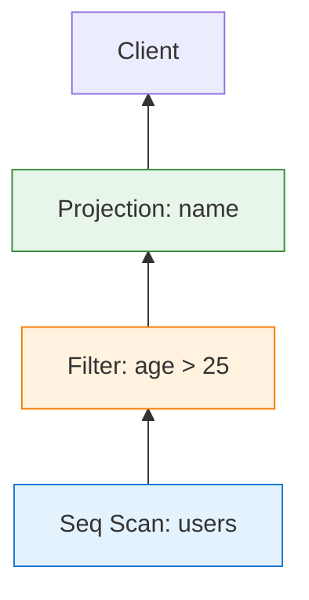
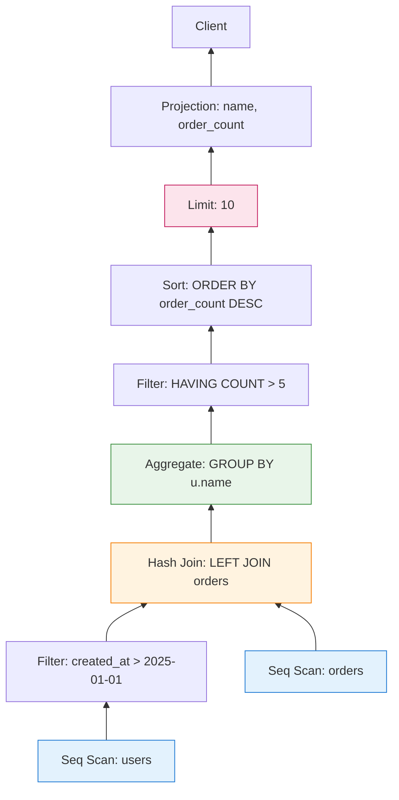
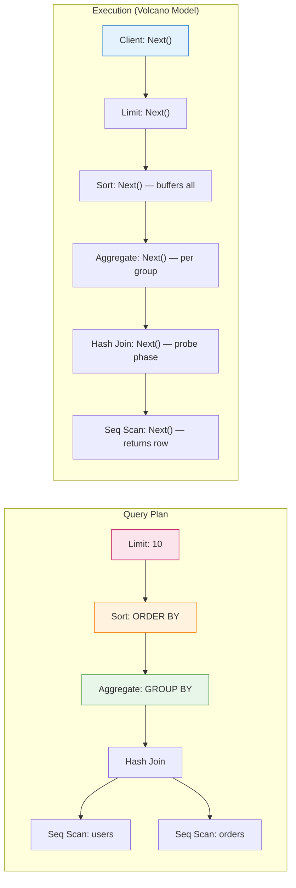

Every SQL query you run in PostgreSQL—whether a simple `SELECT * FROM users` or a 20-table join with window functions—executes through the same elegant mechanism: **the Volcano Model** (also known as the Iterator Model).

This 1980s architecture is why PostgreSQL can:
- Stream gigabytes of results without loading everything into memory
- Stop early on `LIMIT` queries without processing all rows
- Chain operators flexibly without custom code for each combination

But it's also why PostgreSQL struggles with certain analytical workloads where **vectorized execution** shines. Here's the deep dive: how the Volcano Model works, why PostgreSQL chose it, and where it breaks down.

---

## 1 What Is the Volcano Model?

The **Volcano Model** is an execution architecture where queries are represented as **trees of operators**, each exposing a standard interface: `Next()` (or `GetNext()` in PostgreSQL's codebase).

Each operator:
- Requests rows from its child(ren) by calling `Next()`
- Processes one row at a time
- Returns one row to its parent

This **pull-based** model means data flows up the tree, one row per call, until the top node returns results to the client.

**Simple Example:**

```sql
SELECT name FROM users WHERE age > 25;
```

Executes as:



**Execution Flow:**

```
Client: "Give me a row"
  ↓
Projection: "Here's a row" (calls Filter.Next())
  ↓
Filter: "Here's a filtered row" (calls SeqScan.Next())
  ↓
SeqScan: "Here's a raw row from disk"
```

Each operator is **independent**. The Filter doesn't know if data comes from a Seq Scan, Index Scan, or Join. The Projection doesn't know if data is filtered or raw. This **modularity** is the Volcano Model's superpower.

---

## 2 The Iterator Interface: Next() / GetNext()

In PostgreSQL's codebase, every executor node implements the same core interface:

```c
/* Simplified from postgres/src/include/nodes/execnodes.h */
typedef struct PlanState {
    /* ... state fields ... */
} PlanState;

/* Every node type implements this pattern */
static inline TupleTableSlot *
ExecProcNode(PlanState *node)
{
    if (node->is_done)
        return NULL;  /* No more rows */
    
    /* Node-specific logic */
    return node->next_row;
}
```

**The Contract:**

| Return Value | Meaning |
|--------------|---------|
| Valid `TupleTableSlot` | One row of data |
| `NULL` | No more rows (end of stream) |

**Generic Execution Loop:**

```c
/* Pseudocode—PostgreSQL's actual executor */
while (true) {
    TupleTableSlot *slot = ExecProcNode(top_node);
    
    if (TupIsNull(slot))
        break;  /* No more rows */
    
    /* Process the row (send to client, aggregate, etc.) */
    send_to_client(slot);
}
```

This loop—**call `Next()`, process row, repeat**—is the entire Volcano Model. Every query, no matter how complex, reduces to this pattern.

---

## 3 Operator Trees: How Queries Become Execution Plans

When you run a query, PostgreSQL's planner builds an **operator tree**. Each node is an executor type with specific logic.

### Common Operator Types

| Operator | What It Does | Calls Child How Many Times? |
|----------|--------------|----------------------------|
| **Seq Scan** | Reads table pages from disk | N/A (leaf node) |
| **Index Scan** | Reads index, fetches heap tuples | N/A (leaf node) |
| **Filter** | Applies WHERE clause | 1+ (until row passes filter) |
| **Projection** | Selects/computes columns | 1 |
| **Nested Loop Join** | For each outer row, scan inner | 1 outer + N inner |
| **Hash Join** | Build hash table, probe | N (build phase) + N (probe phase) |
| **Merge Join** | Merge-sorted inputs | 1 from each sorted input |
| **Aggregate** | Groups and computes aggregates | N (until group complete) |
| **Sort** | Sorts input, returns in order | N (buffer all, then return) |
| **Limit** | Stops after N rows | N (passes through) |

### Example: Complex Query

```sql
SELECT 
    u.name,
    COUNT(o.id) as order_count
FROM users u
LEFT JOIN orders o ON u.id = o.user_id
WHERE u.created_at > '2025-01-01'
GROUP BY u.name
HAVING COUNT(o.id) > 5
ORDER BY order_count DESC
LIMIT 10;
```

**Execution Plan (Simplified):**



**Execution Flow (First Row):**

```
1. Client calls Limit.Next()
2. Limit calls Sort.Next()
3. Sort buffers ALL input (calls Aggregate.Next() until NULL)
4. Aggregate calls HAVING Filter.Next() for each group
5. HAVING Filter calls Aggregate.Next() (which consumed the join)
6. Hash Join builds hash table from orders, then probes with users
7. Users Seq Scan reads rows, Filter applies created_at > 2025-01-01
8. Sort returns first row (highest order_count)
9. Limit returns it to client
```

Notice: **Sort must consume all input before returning anything**. This is a **blocking operator**—it breaks the pure streaming model.

---

## 4 Row-by-Row Processing: The Good, The Bad, and The Slow

### The Good: Why Volcano Works Well

**1. Memory Efficiency**

Non-blocking operators stream rows without buffering:

```sql
SELECT name FROM users WHERE age > 25 LIMIT 10;
```

PostgreSQL can stop after finding 10 matching rows—no need to scan the entire table if matches are found early.

**Memory Usage:** O(1) per operator (just current row state)

---

**2. Modularity**

Operators compose freely. The same Filter works with:
- Seq Scan
- Index Scan
- Any Join type
- Subquery results

No custom code needed for each combination.

---

**3. Early Termination**

```sql
EXISTS (SELECT 1 FROM orders WHERE user_id = 42)
```

Stops at the first matching row. No need to find all matches.

---

**4. Simple Implementation**

Each operator is a self-contained function:

```c
TupleTableSlot *
ExecFilter(FilterState *state)
{
    while (true) {
        TupleTableSlot *slot = ExecProcNode(outer_plan(state));
        
        if (TupIsNull(slot))
            return NULL;
        
        if (passes_qual(slot, state->qual))
            return slot;
        
        /* Row doesn't match—try next */
    }
}
```

~30 lines of code. Easy to reason about. Easy to debug.

---

### The Bad: Where Volcano Struggles

**1. Function Call Overhead**

Every row requires:
- `Next()` call to child
- `Next()` call from parent
- Virtual function dispatch (in some implementations)

For 1 million rows: **2 million function calls** just for plumbing.

---

**2. No Vectorization**

Modern CPUs excel at **SIMD** (Single Instruction, Multiple Data):

```
Scalar (Volcano):  Process row 1, then row 2, then row 3...
Vectorized:        Process rows 1-1024 in parallel
```

Volcano's row-by-row model can't exploit SIMD because:
- Each row is processed independently
- No batch context for vectorization
- State is per-row, not per-batch

---

**3. Cache Inefficiency**

```c
/* Volcano: scattered memory access */
while (row = Next()) {
    process(row->col1);  /* May be in different cache line */
    process(row->col2);  /* Another cache miss */
    process(row->col3);  /* Another cache miss */
}
```

Columnar/vectorized engines process all values of one column together:

```c
/* Vectorized: sequential memory access */
for (batch : batches) {
    process(batch.col1[0..1023]);  /* Sequential—cache friendly */
    process(batch.col2[0..1023]);  /* Sequential—cache friendly */
}
```

---

**4. Blocking Operators Break Streaming**

Some operators must consume all input before producing output:

| Blocking Operator | Why It Blocks |
|-------------------|---------------|
| **Sort** | Must see all rows to determine order |
| **Hash Aggregate** | Must see all rows in a group before computing aggregate |
| **Hash Join (build phase)** | Must build entire hash table before probing |
| **Distinct** | Must see all rows to eliminate duplicates |

When a blocking operator is in the plan, **upstream operators can't stream**—they must buffer.

---

## 5 PostgreSQL's Implementation: ExecProcNode

In PostgreSQL's source code, the Volcano interface is `ExecProcNode()`:

```c
/* Simplified from src/include/nodes/execnodes.h */
static inline TupleTableSlot *
ExecProcNode(PlanState *node)
{
    if (node->is_done)
        return NULL;
    
    /* Dispatch to node-specific function */
    return node->ExecProcNode(node);
}
```

Each node type implements its own `ExecProcNode`:

| Node Type | Implementation Function |
|-----------|------------------------|
| Seq Scan | `ExecSeqScan()` |
| Index Scan | `ExecIndexScan()` |
| Hash Join | `ExecHashJoin()` |
| Aggregate | `ExecAggregate()` |
| Sort | `ExecSort()` |
| Filter | `ExecFilter()` |

### Example: Filter Node

```c
/* Simplified from src/backend/executor/nodeFilter.c */
TupleTableSlot *
ExecFilter(FilterState *node)
{
    ExprContext *econtext = node->ps.ps_ExprContext;
    ExprState *qual = node->filterqual;
    
    for (;;) {
        /* Get tuple from outer plan */
        TupleTableSlot *slot = ExecProcNode(outerPlan(node));
        
        /* No more rows? */
        if (TupIsNull(slot))
            return NULL;
        
        /* Set up expression context */
        econtext->ecxt_outertuple = slot;
        
        /* Check qualification */
        if (ExecQual(qual, econtext))
            return slot;  /* Passes filter—return it */
        
        /* Doesn't pass—loop and try next row */
        InstrCountFiltered1(node, 1);  /* Stats tracking */
    }
}
```

**Key Observations:**

1. **Infinite loop** until a row passes or no more rows
2. **Single row in, single row out**
3. **Stateless** between calls (except for stats)
4. **Delegates to child** via `ExecProcNode(outerPlan(node))`

This pattern repeats across ~50 executor node types.

---

## 6 Performance Implications: When Volcano Shines vs. Struggles

### Volcano Excels At:

| Workload | Why |
|----------|-----|
| **OLTP** (short, selective queries) | Few rows processed; function call overhead negligible |
| **Index scans with LIMIT** | Early termination; minimal I/O |
| **Streaming large results** | No buffering; constant memory |
| **Complex joins with selective filters** | Filters reduce rows before expensive joins |

**Example: OLTP Query**

```sql
SELECT * FROM orders 
WHERE user_id = 12345 
  AND status = 'pending'
LIMIT 1;
```

- Index Scan finds matching row in ~3 I/O operations
- Filter applies `status = 'pending'`
- Limit stops after first match
- **Total rows processed:** 1-5
- **Volcano overhead:** Negligible

---

### Volcano Struggles At:

| Workload | Why |
|----------|-----|
| **Analytical** (scan millions of rows) | Function call overhead dominates |
| **Columnar access patterns** | Row-by-row prevents column vectorization |
| **Bulk aggregations** | No batch processing for SIMD |
| **Full table scans with simple filters** | 90% of time in `Next()` plumbing |

**Example: Analytical Query**

```sql
SELECT 
    DATE_TRUNC('month', created_at) as month,
    SUM(amount) as total
FROM transactions
WHERE created_at >= '2020-01-01'
GROUP BY month;
```

- Scans 100 million rows
- Each row: `Next()` call, filter check, date truncation, aggregation
- **Function calls:** 200+ million (2 per row)
- **Volcano overhead:** 20-40% of total time

---

## 7 Vectorized Execution: The Alternative

**Vectorized engines** (ClickHouse, DuckDB, Snowflake) process rows in **batches** (typically 1024-8192 rows):

```c
/* Vectorized interface */
struct VectorBatch {
    int32_t col1[1024];
    int32_t col2[1024];
    bool nulls[1024];
    int count;  /* Actual rows in batch */
};

VectorBatch* NextBatch(Operator* op);
```

**Execution:**

```c
while (batch = NextBatch()) {
    /* Process all 1024 rows at once */
    for (int i = 0; i < batch->count; i++) {
        if (!batch->nulls[i] && batch->col1[i] > 25) {
            result->col1[result->count++] = batch->col1[i];
        }
    }
}
```

**Benefits:**

| Aspect | Volcano (Row) | Vectorized (Batch) |
|--------|---------------|-------------------|
| Function calls per row | 2+ | 2 / batch_size (~0.002) |
| SIMD utilization | None | High (process 4-8 values per instruction) |
| Cache efficiency | Poor (row layout) | High (column layout) |
| Code complexity | Low | High (batch management, vectorization) |

---

### Why PostgreSQL Doesn't Use Vectorization (Yet)

**1. Historical Reasons**

PostgreSQL's executor was designed in the 1980s-1990s, before SIMD and columnar storage were mainstream.

**2. Architecture Coupling**

Vectorization requires:
- Columnar storage (or row-to-column conversion)
- Batch-aware operators (rewriting ~50 node types)
- Vectorized expression evaluation (rewriting expression engine)

**3. OLTP Focus**

PostgreSQL optimizes for mixed workloads, not just analytics.

**4. Extension Approach**

Instead of rewriting the core, PostgreSQL supports extensions:
- **Columnar storage:** Citus Columnar, Hydra
- **Vectorized execution:** Experimental patches (not merged)

---

## 8 Hybrid Approaches: Getting the Best of Both

Some databases blend Volcano with vectorization:

### Apache Spark

- **Volcano-style** iterator interface
- **Vectorized readers** (Parquet, ORC)
- **Whole-stage code generation** (fuses operators, eliminates `Next()` calls)

### DuckDB

- **Vectorized execution** as default
- **Volcano-style** operator trees
- **Chunk-based** processing (2048 rows per chunk)

### PostgreSQL (Current)

- **Volcano model** throughout
- **Just-in-Time compilation** (LLVM) for expression evaluation
- **Parallel query** for some operations (parallel Seq Scan, Hash Join, Aggregate)

**JIT Compilation Example:**

```sql
SET jit = on;

SELECT sum(amount * 1.15)  /* Expression compiled to native code */
FROM transactions
WHERE created_at >= '2025-01-01';
```

PostgreSQL compiles the expression `amount * 1.15` to native machine code, reducing interpretation overhead. This doesn't fix Volcano's row-by-row model, but it helps.

---

## 9 Practical Takeaways for PostgreSQL Users

### When Volcano Works Well:

```sql
/* ✅ Good: Selective index scan */
SELECT * FROM users WHERE email = 'user@example.com';

/* ✅ Good: Early termination */
SELECT EXISTS (SELECT 1 FROM orders WHERE user_id = 42);

/* ✅ Good: Streaming with LIMIT */
SELECT * FROM logs ORDER BY timestamp DESC LIMIT 100;

/* ✅ Good: Pipelined joins */
SELECT * FROM users u
JOIN orders o ON u.id = o.user_id
WHERE u.country = 'US';  /* Filter reduces join input */
```

---

### When Volcano Struggles:

```sql
/* ⚠️ Poor: Full table scan with aggregation */
SELECT COUNT(*) FROM transactions;  /* Must scan all rows */

/* ⚠️ Poor: Complex expression on every row */
SELECT UPPER(CONCAT(first_name, ' ', last_name)) FROM users;

/* ⚠️ Poor: Blocking operators on large datasets */
SELECT DISTINCT category FROM products;  /* Must buffer all */

/* ⚠️ Poor: Analytical window functions */
SELECT 
    user_id,
    AVG(amount) OVER (PARTITION BY user_id ORDER BY date)
FROM transactions;
```

---

### Optimization Strategies:

**1. Push Filters Down**

```sql
/* ❌ Bad: Filter after join */
SELECT * FROM users u
JOIN orders o ON u.id = o.user_id
WHERE u.created_at > '2025-01-01';

/* ✅ Good: Filter before join (PostgreSQL does this automatically) */
/* Planner pushes filter down to users scan */
```

**2. Use Indexes to Reduce Rows**

```sql
/* ❌ Bad: Seq Scan on large table */
SELECT * FROM transactions WHERE user_id = 42;

/* ✅ Good: Index Scan */
CREATE INDEX ON transactions(user_id);
```

**3. Avoid Unnecessary Blocking Operators**

```sql
/* ❌ Bad: DISTINCT on large result */
SELECT DISTINCT category FROM million_row_table;

/* ✅ Good: GROUP BY (same result, clearer intent) */
SELECT category FROM million_row_table GROUP BY category;
```

**4. Leverage Parallel Query**

```sql
/* Enable parallel query */
SET max_parallel_workers_per_gather = 4;

/* Parallel Seq Scan + Hash Aggregate */
SELECT COUNT(*) FROM large_table;
```

---

## 10 The Future: Is Vectorization Coming to PostgreSQL?

**Short answer:** Not to the core, but extensions are experimenting.

### Current Efforts:

| Project | Approach | Status |
|---------|----------|--------|
| **Citus Columnar** | Columnar storage with row-by-row execution | Production |
| **Hydra** | Columnar storage for analytics | Production |
| **pg_vectorize** | Vectorized expression evaluation | Experimental |
| **LLVM JIT** | Compiled expressions (not vectorized) | Production (PG11+) |

### Why Core Won't Change Soon:

1. **Backward compatibility** — Extensions rely on current executor API
2. **Complexity** — Rewriting 50+ node types is a massive undertaking
3. **Trade-offs** — Vectorization helps analytics, hurts OLTP latency
4. **Philosophy** — PostgreSQL prefers stable, incremental improvements

**Most likely path:** Vectorization via extensions, not core changes.

---

## Summary: The Volcano Model in One Diagram



**Key Takeaways:**

| Aspect | Volcano Model |
|--------|---------------|
| **Interface** | `Next()` / `GetNext()` — one row at a time |
| **Structure** | Tree of operators |
| **Data flow** | Pull-based (child → parent) |
| **Memory** | O(1) for streaming, O(N) for blocking operators |
| **Best for** | OLTP, selective queries, streaming |
| **Worst for** | Analytical, full scans, bulk aggregations |
| **PostgreSQL status** | Core execution model since inception |

The Volcano Model isn't perfect—but after 40+ years, it's still the foundation of most SQL databases. Understanding it helps you write queries that work *with* PostgreSQL's architecture, not against it.

---

**Further Reading:**

- Graefe, Goetz. ["Volcano—An Extensible and Parallel Query Evaluation System"](https://www.cs.du.edu/~snarayan/courses/comp_db/lecture11.pdf) (1994) — The original paper
- PostgreSQL Source: [`src/backend/executor/`](https://github.com/postgres/postgres/tree/master/src/backend/executor) — Actual implementation
- "PostgreSQL Internals" by Egor Rogov — Deep dive into executor architecture
- DuckDB Documentation: ["Vectorized Execution"](https://duckdb.org/docs/internals/vectorized_execution) — Alternative approach
