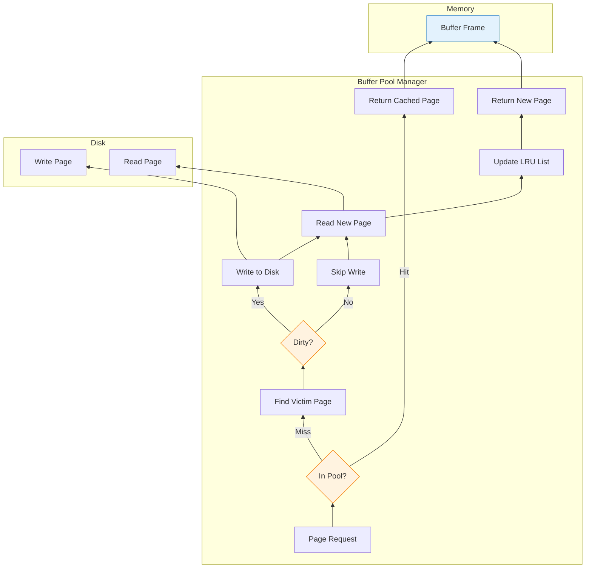
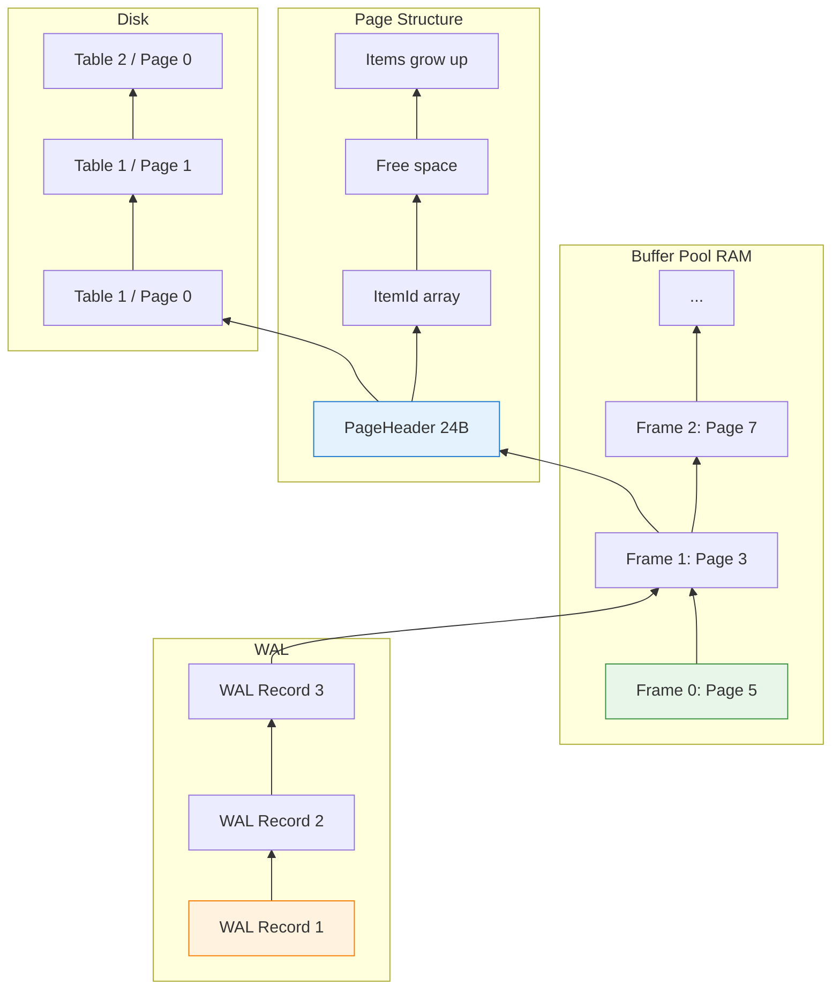

简单的网站已无法满足我对知识的渴望。

多年来，我一直在构建 Web 应用程序——REST API、GraphQL 服务、带有 AI 和 Agentic AI 的微服务——但我遇到了瓶颈。我能流利地*使用*数据库，却无法*构建*一个。内部机制对我来说仍是个黑盒子：PostgreSQL 究竟如何将数据存储在磁盘上？缓冲池如何管理内存？WAL 如何确保持久性？

因此，我开始构建 **[Vaultgres](https://github.com/neoalienson/Vaultgres)**——一个用 Rust 实现的 PostgreSQL 兼容数据库。

这不是另一个玩具级的键值存储。我们的目标是 PostgreSQL 兼容性：通信协议、查询语言，最终还包括存储格式。为什么？因为 PostgreSQL 的架构经过实战验证，兼容性意味着真正的应用程序可以（理论上）无需修改就能连接。

这个系列记录了这段旅程：设计决策、错误、那些“啊哈！”的顿悟时刻，以及我如何利用 AI 加速学习，同时仍然亲自完成艰苦的工作。

今天的主题：**页式存储和缓冲池**——每个数据库创建的基础。

---

## 1 为什么需要页式存储？

### 问题：原始字节很混乱

想象一下将数据作为连续流直接存储到磁盘：

```
Table: users
┌────────────────────────────────────────────────────────────┐
│ id=1,name=Alice,id=2,name=Bob,id=3,name=Charlie...         │
└────────────────────────────────────────────────────────────┘

Table: orders
┌────────────────────────────────────────────────────────────┐
│ id=101,user_id=1,amount=99.99,id=102,user_id=2,amount=...  │
└────────────────────────────────────────────────────────────┘
```

**问题：**

| 问题 | 为什么重要 |
|-------|----------------|
| **没有结构** | 无法找到第 N 列，必须从头开始扫描 |
| **没有并发性** | 一个写入者锁定整个文件 |
| **没有崩溃恢复** | 部分写入会破坏所有内容 |
| **没有缓存** | 必须读取整个文件才能访问一列 |

---

### 解决方案：固定大小页面

PostgreSQL 将数据划分为**固定大小的页面**（通常为 8KB）：

```
┌─────────────────────────────────────────────────────────────┐
│  Page 0 (8KB)  │  Page 1 (8KB)  │  Page 2 (8KB)  │  ...    │
└─────────────────────────────────────────────────────────────┘
```

**每个页面包含：**

```
┌─────────────────────────────────────────────────────────────┐
│ PageHeader (24 bytes)                                       │
├─────────────────────────────────────────────────────────────┤
│ ItemId array (4 bytes each)                                 │
├─────────────────────────────────────────────────────────────┤
│ Free space                                                  │
├─────────────────────────────────────────────────────────────┤
│ Items (actual row data, grows upward)                       │
└─────────────────────────────────────────────────────────────┘
```

**优势：**

| 优势 | 为什么重要 |
|---------|----------------|
| **随机访问** | 直接读取第 N 页：`seek(N * 8KB)` |
| **细粒度锁定** | 锁定单个页面，而非整个表 |
| **高效缓存** | 将热门页面缓存在内存中（缓冲池） |
| **崩溃恢复** | WAL 记录参考特定页面 |
| **标准化** | 所有页面大小相同——简化内存管理 |

!!! info "📌 为什么是 8KB？"
    PostgreSQL 默认使用 8KB 页面（编译时可用 `BLCKSZ` 配置）。

    **权衡：**

| 页面大小 | 优点 | 缺点 |
|-----------|------|------|
| 小 (4KB) | 较少内部碎片，更细的锁定 | 更多页面需管理，更大的标头 |
| 中 (8KB) | 平衡 | 默认值是有原因的 |
| 大 (32KB+) | 更少页面，更好的顺序扫描 | 每个页面浪费更多空间 |

Vaultgres 使用 8KB 以匹配 PostgreSQL——兼容性优先于优化。

---

## 2 页面布局：8KB 页面内部

### PostgreSQL PageHeader

每个页面都以标头开始：

```c
/* Simplified from PostgreSQL src/include/storage/bufpage.h */
typedef struct PageHeaderData {
    uint16      pd_lower;     /* Offset to start of free space */
    uint16      pd_upper;     /* Offset to end of free space */
    uint16      pd_special;   /* Offset to start of special space */
    uint16      pd_pagesize_version;  /* Page size and version */
    uint32      pd_checksum;  /* Page checksum (optional) */
    /* ... more fields ... */
} PageHeaderData;
```

**视觉布局：**

```
┌─────────────────────────────────────────────────────────────┐
│ 0                   PageHeader (24 bytes)                   │
│ ├── pd_lower ──┐                                            │
│ │              ▼                                            │
│ ├── ItemId[0]  │                                            │
│ ├── ItemId[1]  │  ItemId array (4 bytes each)               │
│ ├── ItemId[2]  │  (points to actual items below)            │
│ │              │                                            │
│ │         pd_upper ──┐                                      │
│ │                    ▼                                      │
│ │              ┌─────────────┐                              │
│ │              │  Free Space │  (grows/shrinks)             │
│ │              └─────────────┘                              │
│ │                    ▲                                      │
│ │              pd_special ──┘                               │
│ │                                                           │
│ │    ┌─────────────────────────────────┐                    │
│ └─►  │  Item 2 (row data)              │  Items grow UP     │
│      ├─────────────────────────────────┤                    │
│      │  Item 1 (row data)              │                    │
│      ├─────────────────────────────────┤                    │
│      │  Item 0 (row data)              │                    │
│      └─────────────────────────────────┘                    │
└─────────────────────────────────────────────────────────────┘
```

**关键洞察：** 项目从底部**向上**增长，ItemId 数组从顶部**向下**增长。空闲空间在中间。这最大化了空间利用率。

---

### ItemId：指向行数据的指针

每个 `ItemId` 是一个 4 字节的指针：

```c
typedef struct ItemIdData {
    uint16      lp_off;     /* Offset to item (from page start) */
    uint16      lp_len;     /* Length of item (including header) */
    /* ... flags ... */
} ItemIdData;
```

**为什么需要间接？**

| 原因 | 解释 |
|--------|-------------|
| **移动项目而不改变引用** | 当项目移动时更新 `lp_off` |
| **标记项目为已删除** | 设置 `lp_len = 0` 而不覆盖数据 |
| **支持 HOT (Heap Only Tuple)** | 对 PostgreSQL 性能至关重要 |

---

### Rust 实现：Page 结构体

以下是 Vaultgres 表示页面的方式：

```rust
// src/storage/page.rs
use std::mem;

pub const PAGE_SIZE: usize = 8192;  // 8KB
pub const PAGE_HEADER_SIZE: usize = 24;
pub const ITEM_ID_SIZE: usize = 4;

#[derive(Debug, Clone, Copy)]
#[repr(C)]
pub struct ItemId {
    pub offset: u16,  // Offset to item data
    pub length: u16,  // Length of item
}

impl ItemId {
    pub const fn new(offset: u16, length: u16) -> Self {
        Self { offset, length }
    }

    pub const fn is_unused(&self) -> bool {
        self.length == 0
    }
}

#[repr(C)]
pub struct PageHeader {
    pub pd_lower: u16,      // Start of free space (after ItemIds)
    pub pd_upper: u16,      // End of free space (before items)
    pub pd_special: u16,    // Start of special space (usually PAGE_SIZE)
    pub version: u16,
    pub checksum: u32,
    // Padding to reach 24 bytes
    _padding: [u8; 12],
}

pub struct Page {
    data: [u8; PAGE_SIZE],
}

impl Page {
    pub fn new() -> Self {
        let mut data = [0u8; PAGE_SIZE];

        // Initialize header
        let header = PageHeader {
            pd_lower: (PAGE_HEADER_SIZE) as u16,
            pd_upper: PAGE_SIZE as u16,
            pd_special: PAGE_SIZE as u16,
            version: 1,
            checksum: 0,
            _padding: [0; 12],
        };

        // Write header to data
        unsafe {
            std::ptr::write_unaligned(
                data.as_mut_ptr() as *mut PageHeader,
                header,
            );
        }

        Self { data }
    }

    pub fn header(&self) -> &PageHeader {
        unsafe { &*(self.data.as_ptr() as *const PageHeader) }
    }

    pub fn header_mut(&mut self) -> &mut PageHeader {
        unsafe { &mut *(self.data.as_mut_ptr() as *mut PageHeader) }
    }

    pub fn free_space(&self) -> usize {
        let header = self.header();
        header.pd_upper as usize - header.pd_lower as usize
    }

    pub fn insert(&mut self, item_data: &[u8]) -> Option<u16> {
        // Check if we have enough space
        let required = item_data.len() + ITEM_ID_SIZE;
        if self.free_space() < required {
            return None;  // Page full
        }

        let header = self.header_mut();

        // Calculate where to place the item (from bottom, growing up)
        let item_offset = header.pd_upper - item_data.len() as u16;

        // Write item data
        self.data[item_offset as usize..item_offset as usize + item_data.len()]
            .copy_from_slice(item_data);

        // Create ItemId
        let item_id_offset = header.pd_lower as usize;
        let item_id = ItemId::new(item_offset, item_data.len() as u16);

        unsafe {
            std::ptr::write_unaligned(
                self.data[item_id_offset..].as_mut_ptr() as *mut ItemId,
                item_id,
            );
        }

        // Update header
        header.pd_lower += ITEM_ID_SIZE as u16;
        header.pd_upper = item_offset;

        // Return ItemId index (0-based)
        Some((item_id_offset - PAGE_HEADER_SIZE) / ITEM_ID_SIZE as usize as u16)
    }
}
```

!!! warning "⚠️ 为了性能使用 Unsafe Rust"
    是的，这里使用了 `unsafe`。为什么？

    - **零拷贝访问** 页面数据
    - **精确的内存布局** 匹配 PostgreSQL 的磁盘上格式
    - **性能** 至关重要——页面被访问数百万次

    **安全保证：**

    - `#[repr(C)]` 确保可预测的布局
    - 所有访问都在范围内（由 `free_space()` 检查）
    - 页面在使用前总是已初始化

    这就是 AI 辅助无价的地方：我可以问“这个 `unsafe` 区块是否可靠？”并得到详细分析。

---

## 3 缓冲池：在内存中缓存页面

### 问题：磁盘很慢

| 存储 | 延迟 | 相对速度 |
|---------|---------|----------------|
| CPU 缓存 (L1) | ~1ns | 1x |
| RAM | ~100ns | 100x 更慢 |
| NVMe SSD | ~100μs | 100,000x 更慢 |
| HDD | ~10ms | 10,000,000x 更慢 |

**没有缓冲池：**

```
Query: SELECT * FROM users WHERE id = 42

1. Read page containing id=42 from disk (100μs on NVMe)
2. Parse page, find row
3. Return result

Next query: SELECT * FROM users WHERE id = 42

1. Read page from disk AGAIN (100μs)  ← Wasteful!
2. Parse page, find row
3. Return result
```

---

### 解决方案：缓冲池

**缓冲池** 将经常访问的页面缓存在 RAM 中：

```
┌─────────────────────────────────────────────────────────────┐
│                    Buffer Pool (RAM)                        │
│  ┌─────────┐ ┌─────────┐ ┌─────────┐ ┌─────────┐            │
│  │ Page 0  │ │ Page 5  │ │ Page 3  │ │ Page 7  │  ...       │
│  │ (dirty) │ │ (clean) │ │ (dirty) │ │ (clean) │            │
│  └─────────┘ └─────────┘ └─────────┘ └─────────┘            │
└─────────────────────────────────────────────────────────────┘
         │              │              │
         ▼              ▼              ▼
    ┌─────────┐    ┌─────────┐    ┌─────────┐
    │ Disk    │    │ Disk    │    │ Disk    │
    │ Page 0  │    │ Page 5  │    │ Page 3  │
    └─────────┘    └─────────┘    └─────────┘
```

**使用缓冲池：**

```
Query: SELECT * FROM users WHERE id = 42

1. Check buffer pool for page containing id=42
2. If hit: Return from RAM (~100ns)  ← 1000x faster!
3. If miss: Read from disk, cache in pool, return

Next query: SELECT * FROM users WHERE id = 42

1. Check buffer pool (HIT!)
2. Return from RAM (~100ns)  ← Cached!
```

---

### 缓冲池架构



**组件：**

| 组件 | 目的 |
|-----------|---------|
| **缓冲帧 (Buffer Frames)** | 固定大小的槽位持有页面（例如 1024 帧 × 8KB = 8MB） |
| **页表 (Page Table)** | 映射页面 ID → 缓冲帧（哈希表） |
| **LRU 列表** | 跟踪访问顺序以进行淘汰 |
| **脏位 (Dirty Bit)** | 标记需要写回的页面 |
| **钉选计数 (Pin Count)** | 防止使用中页面被淘汰 |

---

### Rust 实现：缓冲池

```rust
// src/storage/buffer_pool.rs
use std::collections::HashMap;
use std::sync::{Arc, Mutex};
use crate::storage::page::{Page, PAGE_SIZE};

pub struct BufferFrame {
    page: Option<Page>,
    page_id: Option<u64>,
    pin_count: u32,
    is_dirty: bool,
    last_accessed: u64,  // For LRU
}

pub struct BufferPool {
    frames: Vec<Mutex<BufferFrame>>,
    page_table: Mutex<HashMap<u64, usize>>,  // page_id → frame_index
    lru_list: Mutex<Vec<usize>>,  // frame indices, front = MRU
    disk: Arc<DiskManager>,
    access_counter: Mutex<u64>,
}

impl BufferPool {
    pub fn new(num_frames: usize, disk: Arc<DiskManager>) -> Self {
        let frames = (0..num_frames)
            .map(|_| Mutex::new(BufferFrame {
                page: None,
                page_id: None,
                pin_count: 0,
                is_dirty: false,
                last_accessed: 0,
            }))
            .collect();

        Self {
            frames,
            page_table: Mutex::new(HashMap::new()),
            lru_list: Mutex::new(Vec::new()),
            disk,
            access_counter: Mutex::new(0),
        }
    }

    pub fn get_page(&self, page_id: u64) -> Option<Arc<Mutex<Page>>> {
        // Check if page is in pool
        let mut page_table = self.page_table.lock().unwrap();

        if let Some(&frame_idx) = page_table.get(&page_id) {
            // Cache hit
            let mut frame = self.frames[frame_idx].lock().unwrap();
            frame.pin_count += 1;
            frame.last_accessed = *self.access_counter.lock().unwrap();

            // Move to front of LRU
            let mut lru = self.lru_list.lock().unwrap();
            if let Some(pos) = lru.iter().position(|&x| x == frame_idx) {
                lru.remove(pos);
                lru.push_front(frame_idx);
            }

            return Some(Arc::clone(&frame.page.as_ref().unwrap()));
        }

        drop(page_table);

        // Cache miss - need to load from disk
        self.load_page(page_id)
    }

    fn load_page(&self, page_id: u64) -> Option<Arc<Mutex<Page>>> {
        // Find victim frame using LRU
        let victim_idx = self.find_victim()?;

        let mut frame = self.frames[victim_idx].lock().unwrap();

        // Write back if dirty
        if frame.is_dirty {
            if let Some(old_page_id) = frame.page_id {
                self.disk.write_page(old_page_id, frame.page.as_ref().unwrap())
                    .ok()?;
            }
            frame.is_dirty = false;
        }

        // Read new page from disk
        let new_page = self.disk.read_page(page_id).ok()?;

        // Update frame
        frame.page = Some(new_page);
        frame.page_id = Some(page_id);
        frame.pin_count = 1;
        frame.last_accessed = *self.access_counter.lock().unwrap();

        // Update page table
        let mut page_table = self.page_table.lock().unwrap();
        page_table.insert(page_id, victim_idx);

        // Update LRU
        let mut lru = self.lru_list.lock().unwrap();
        lru.push_front(victim_idx);

        Some(Arc::clone(&frame.page.as_ref().unwrap()))
    }

    fn find_victim(&self) -> Option<usize> {
        let mut lru = self.lru_list.lock().unwrap();

        // Find unpinned page from back (LRU)
        for i in (0..lru.len()).rev() {
            let frame_idx = lru[i];
            let frame = self.frames[frame_idx].lock().unwrap();

            if frame.pin_count == 0 {
                lru.remove(i);
                return Some(frame_idx);
            }
        }

        // All pages pinned - need to wait or allocate more frames
        None
    }

    pub fn mark_dirty(&self, page_id: u64) {
        let page_table = self.page_table.lock().unwrap();
        if let Some(&frame_idx) = page_table.get(&page_id) {
            let mut frame = self.frames[frame_idx].lock().unwrap();
            frame.is_dirty = true;
        }
    }

    pub fn unpin_page(&self, page_id: u64) {
        let page_table = self.page_table.lock().unwrap();
        if let Some(&frame_idx) = page_table.get(&page_id) {
            let mut frame = self.frames[frame_idx].lock().unwrap();
            frame.pin_count = frame.pin_count.saturating_sub(1);
        }
    }

    pub fn flush_all(&self) -> std::io::Result<()> {
        for frame in &self.frames {
            let mut f = frame.lock().unwrap();
            if f.is_dirty {
                if let Some(page_id) = f.page_id {
                    self.disk.write_page(page_id, f.page.as_ref().unwrap())?;
                }
                f.is_dirty = false;
            }
        }
        Ok(())
    }
}
```

!!! tip "💡 关键设计决策"
    **1. 细粒度锁定：** 每个 `BufferFrame` 都有自己的 `Mutex`，而不是整个池只有一把锁。

    **2. ARC 用于共享访问：** `Arc<Mutex<Page>>` 允许多个线程持有同一页面。

    **3. 钉选计数：** 防止线程使用页面时被淘汰。

    **4. LRU 淘汰：** 最近最少使用的页面优先被淘汰。

    这些决策来自于询问 AI：“如何在 Rust 中设计线程安全的缓冲池？”然后根据 PostgreSQL 的实际实现迭代答案。

---

## 4 磁盘管理器：抽象化文件 I/O

### 单一文件 vs. 多个文件

PostgreSQL 将每个表/索引存储在单独的文件中：

```
$PGDATA/base/16384/      # Database OID
├── 16385                # Table: users
├── 16386                # Table: orders
├── 16387_idx            # Index: users_email_idx
└── ...
```

Vaultgres 遵循相同的模式：

```rust
// src/storage/disk.rs
use std::collections::HashMap;
use std::fs::{File, OpenOptions};
use std::io::{Read, Seek, SeekFrom, Write};
use std::path::{Path, PathBuf};
use std::sync::Mutex;

pub struct DiskManager {
    data_dir: PathBuf,
    files: Mutex<HashMap<u64, File>>,  # table_id → File
}

impl DiskManager {
    pub fn new(data_dir: &str) -> std::io::Result<Self> {
        std::fs::create_dir_all(data_dir)?;
        Ok(Self {
            data_dir: PathBuf::from(data_dir),
            files: Mutex::new(HashMap::new()),
        })
    }

    fn get_file(&self, table_id: u64) -> std::io::Result<std::fs::File> {
        let mut files = self.files.lock().unwrap();

        if let Some(file) = files.get(&table_id) {
            // File already open - need to handle this differently
            // (simplified for example)
        }

        let path = self.data_dir.join(table_id.to_string());
        let file = OpenOptions::new()
            .read(true)
            .write(true)
            .create(true)
            .open(&path)?;

        files.insert(table_id, file.try_clone()?);
        Ok(file)
    }

    pub fn read_page(&self, page_id: u64) -> std::io::Result<Page> {
        let table_id = page_id >> 32;  # High 32 bits
        let page_num = page_id as u32;  # Low 32 bits

        let mut file = self.get_file(table_id)?;
        let mut data = [0u8; PAGE_SIZE];

        file.seek(SeekFrom::Start(page_num as u64 * PAGE_SIZE as u64))?;
        file.read_exact(&mut data)?;

        Ok(Page::from_data(data))
    }

    pub fn write_page(&self, page_id: u64, page: &Page) -> std::io::Result<()> {
        let table_id = page_id >> 32;
        let page_num = page_id as u32;

        let mut file = self.get_file(table_id)?;

        file.seek(SeekFrom::Start(page_num as u64 * PAGE_SIZE as u64))?;
        file.write_all(page.as_bytes())?;
        file.sync_all()?;  # Force to disk

        Ok(())
    }
}
```

---

### 页面 ID 编码

Vaultgres 将表 ID 和页面编号编码为单个 `u64`：

```
┌─────────────────────────────────────────────────────────────┐
│  Page ID (u64)                                              │
│  ┌─────────────────┬─────────────────┐                      │
│  │  Table ID (32)  │  Page Num (32)  │                      │
│  └─────────────────┴─────────────────┘                      │
└─────────────────────────────────────────────────────────────┘

Example: page_id = 0x0000000100000005
  Table ID: 1
  Page Number: 5
```

**为什么？**

| 原因 | 解释 |
|--------|-------------|
| **单一标识符** | 简化缓冲池和页表 |
| **高效哈希** | `u64` 比 `(u32, u32)` 元组更快 |
| **PostgreSQL 兼容** | 类似于 PostgreSQL 的 `BlockId` |

---

## 5 预写日志 (WAL)：确保持久性

### 问题：崩溃会破坏数据

没有 WAL：

```
1. Buffer pool modifies page in memory
2. Before page is written to disk... CRASH!
3. Data lost forever
```

**更糟的是：**

```
1. Write page to disk (50% complete)... CRASH!
2. Page is now corrupted (torn page)
```

---

### 解决方案：预写日志

**WAL 原则：** 在修改页面之前，先将变更写入日志：

```
Transaction: UPDATE users SET balance = 100 WHERE id = 42

1. Write WAL record: "Page X, Offset Y, Old Value Z, New Value W"
2. Flush WAL to disk (fsync)
3. Modify page in buffer pool (mark dirty)
4. ACK to client
5. Later: Checkpoint writes dirty pages to disk
```

**崩溃后：**

```
1. Read last checkpoint position
2. Replay WAL records from checkpoint to end
3. Database is consistent
```

---

### WAL 记录格式

```rust
// src/storage/wal.rs
#[derive(Debug, Clone)]
pub struct WalRecord {
    pub lsn: u64,              // Log Sequence Number
    pub table_id: u64,
    pub page_num: u32,
    pub offset: u16,           // Offset within page
    pub old_data: Vec<u8>,     // Before image (for undo)
    pub new_data: Vec<u8>,     // After image (for redo)
    pub transaction_id: u64,
    pub record_type: WalRecordType,
}

#[derive(Debug, Clone)]
pub enum WalRecordType {
    Insert,
    Update,
    Delete,
    Checkpoint,
    Commit,
    Abort,
}

pub struct WalManager {
    wal_dir: PathBuf,
    current_lsn: u64,
    current_file: File,
    flush_lsn: u64,  // Last flushed LSN
}

impl WalManager {
    pub fn log_change(&mut self, record: WalRecord) -> std::io::Result<u64> {
        // Serialize record
        let mut data = Vec::new();
        data.extend_from_slice(&record.lsn.to_le_bytes());
        data.extend_from_slice(&(record.table_id.to_le_bytes()));
        // ... more fields

        // Write to WAL file
        self.current_file.write_all(&data)?;

        // Update LSN
        self.current_lsn += 1;

        Ok(record.lsn)
    }

    pub fn flush(&mut self) -> std::io::Result<()> {
        self.current_file.sync_all()?;
        self.flush_lsn = self.current_lsn;
        Ok(())
    }

    pub fn replay_from(&mut self, lsn: u64, buffer_pool: &BufferPool) -> std::io::Result<()> {
        // Seek to LSN
        // Read records
        // For each record:
        //   - Get page from buffer pool
        //   - Apply new_data to page
        //   - Mark page dirty
        Ok(())
    }
}
```

!!! warning "⚠️ WAL 很难"
    正确实现 WAL 是构建数据库最困难的部分之一：

    - **逻辑 vs. 实体 WAL：** 记录操作（INSERT 行）还是页面变更（字节 X→Y）？
    - **AR... [截断]
    - **检查点：** 多久一次？模糊还是清晰？
    - **日志截断：** 何时可以删除旧的 WAL 文件？

    Vaultgres 将从简单的实体 WAL（页面映像）开始，然后逐步演进。AI 对于理解这里的权衡取舍非常有帮助。

---

## 6 用 Rust 构建的挑战

### 挑战 1：所有权 vs. 共享访问

**问题：** 缓冲池需要在线程间共享页面，但 Rust 的所有权系统与此相抗。

```rust
// ❌ Doesn't work
pub fn get_page(&self, page_id: u64) -> Page {
    // Can't return owned Page - buffer pool needs to keep it
}

// ✅ Solution: Arc<Mutex<T>>
pub fn get_page(&self, page_id: u64) -> Arc<Mutex<Page>> {
    // Shared ownership, interior mutability
}
```

**权衡：**

| 方法 | 优点 | 缺点 |
|----------|------|------|
| `Arc<Mutex<T>>` | 安全、熟悉 | 锁定竞争 |
| `RwLock<T>` | 更适合读取负载 | 写入饥饿 |
| Lock-free (unsafe) | 最大性能 | 复杂、易出错 |

---

### 挑战 2：零拷贝 vs. 安全

**问题：** PostgreSQL 使用原始指针进行页面访问。Rust 想要边界检查。

```rust
// PostgreSQL (C)
Page page = buffer_pool->pages[frame_id];
Item item = (Item)(page + item_offset);  // No bounds check!

// Rust (safe)
let item = &page.data[item_offset..item_offset + item_len];  // Bounds checked

// Rust (unsafe, zero-copy)
let item = unsafe {
    &*(page.data.as_ptr().add(item_offset) as *const Item)
};  // Fast but requires safety analysis
```

**Vaultgres 方法：** 从安全开始，在性能分析后用 `unsafe` 优化热点路径。

---

### 挑战 3：错误处理

**问题：** PostgreSQL 使用 `elog(ERROR, ...)`。Rust 使用 `Result<T, E>`。

```rust
// PostgreSQL
if (page_full) {
    elog(ERROR, "page is full");  // Longjmp out
}

// Rust
if (page_full) {
    return Err(PageError::Full);  // Propagate up
}
```

**影响：** 每个函数签名都改变了。调用链变成 `Result` 金字塔。

**解决方案：** 大量使用 `?` 运算符，定义明确的错误类型：

```rust
#[derive(Debug)]
pub enum StorageError {
    PageFull,
    PageNotFound(u64),
    IoError(std::io::Error),
    CorruptedPage(u64),
}

impl From<std::io::Error> for StorageError {
    fn from(err: std::io::Error) -> Self {
        StorageError::IoError(err)
    }
}

pub fn insert(&mut self, data: &[u8]) -> Result<u16, StorageError> {
    if self.free_space() < data.len() {
        return Err(StorageError::PageFull);
    }
    // ...
    Ok(item_id)
}
```

---

## 7 AI 如何加速学习

### AI 擅长什么

| 任务 | 我如何使用 AI |
|------|--------------|
| **解释概念** | “解释 PostgreSQL 的缓冲池替换策略” |
| **代码审查** | “这个 unsafe 区块是否可靠？什么可能出错？” |
| **产生样板** | “为 PostgreSQL PageHeader 产生 Rust 结构体” |
| **除错协助** |“为什么会死锁？这是我的锁定顺序...” |
| **比较方法** | “LRU vs. Clock vs. FIFO 用于缓冲池淘汰” |

---

### AI 无法替代什么

| 技能 | 为什么仍取决于我 |
|-------|----------------------|
| **系统设计** | AI 无法决定整体架构 |
| **权衡分析** | “我应该优先考虑兼容性还是性能？” |
| **测试** | AI 无法执行基准测试或寻找竞争条件 |
| **除错** | AI 无法附加 gdb 或读取核心转储 |
| **学习** | 我仍然必须理解 AI 产生的每一行代码 |

---

### 范例：学习缓冲池淘汰

**我问 AI 的问题：**

> "PostgreSQL 使用 clock-sweep 算法进行缓冲池淘汰，而不是纯 LRU。为什么？有什么权衡取舍？"

**我学到的：**

1. **LRU 问题：** 顺序扫描会淘汰所有内容（扫描抵抗）
2. **Clock-sweep：** 近似 LRU 但更便宜（不需要链表更新）
3. **使用计数：** 页面在淘汰前获得多次机会
4. **PostgreSQL 的变体：** 还考虑钉选计数和脏页状态

**结果：** 我在 Vaultgres 中实现了 clock-sweep 而不是 LRU：

```rust
pub fn find_victim(&self) -> Option<usize> {
    let mut clock_hand = self.clock_hand.lock().unwrap();
    let frames = self.frames.len();

    for _ in 0..frames * 2 {  // Sweep at most twice
        let idx = *clock_hand as usize;
        let mut frame = self.frames[idx].lock().unwrap();

        if frame.pin_count == 0 {
            if frame.usage_count > 0 {
                frame.usage_count -= 1;  // Second chance
            } else {
                *clock_hand = (*clock_hand + 1) % frames as u32;
                return Some(idx);  // Evict this one
            }
        }

        drop(frame);
        *clock_hand = (*clock_hand + 1) % frames as u32;
    }

    None  // All pages pinned
}
```

这就是模式：AI 解释，我实现，我测试，我学习。

## 总结：页式存储一张图



**关键要点：**

| 概念 | 为什么重要 |
|---------|----------------|
| **页式存储** | 随机访问、细粒度锁定、高效缓存 |
| **缓冲池** | 热门页面比磁盘访问快 1000 倍 |
| **LRU/Clock 淘汰** | 保留常用页面，淘汰冷页面 |
| **WAL** | 不牺牲性能的持久性 |
| **Rust 挑战** | 所有权、安全、零拷贝——到处都是权衡取舍 |

---

**进一步阅读：**

- PostgreSQL Source: [`src/include/storage/bufpage.h`](https://github.com/postgres/postgres/blob/master/src/include/storage/bufpage.h)
- PostgreSQL Source: [`src/backend/storage/buffer/`](https://github.com/postgres/postgres/tree/master/src/backend/storage/buffer)
- "Database Management Systems" by Ramakrishnan & Gehrke (Ch. 9: Storage and Indexing)
- "Readings in Database Systems" (Red Book) - Buffer Pool chapter
- Vaultgres Repository: [github.com/neoalienson/Vaultgres](https://github.com/neoalienson/Vaultgres)
