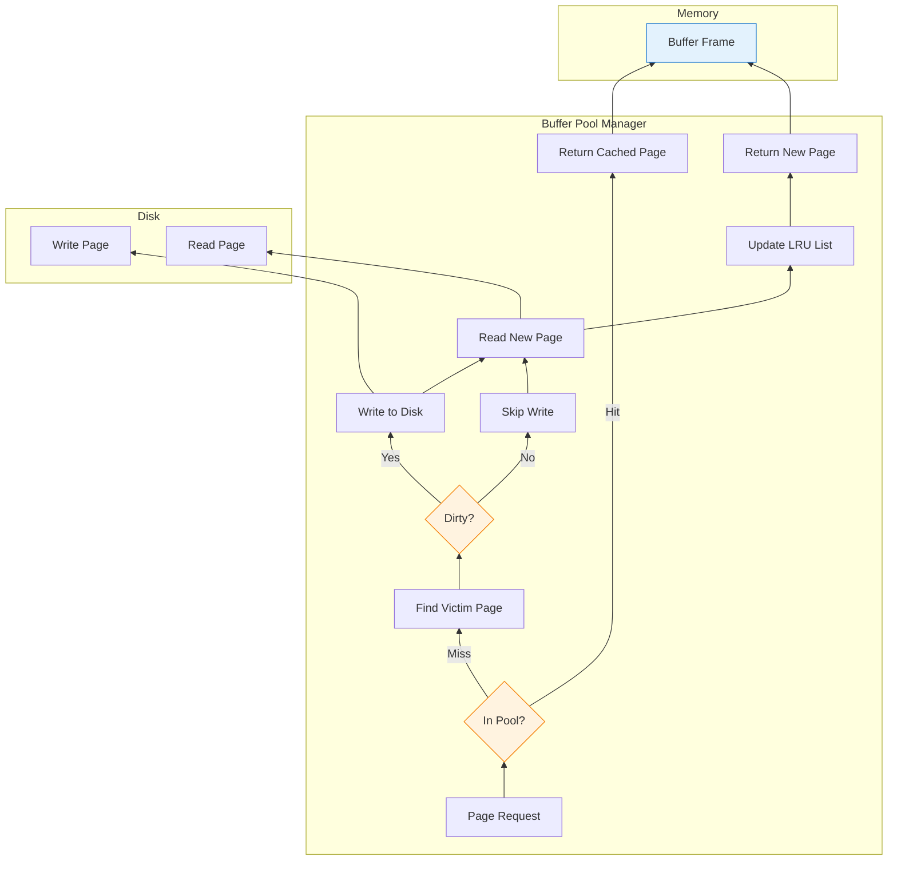
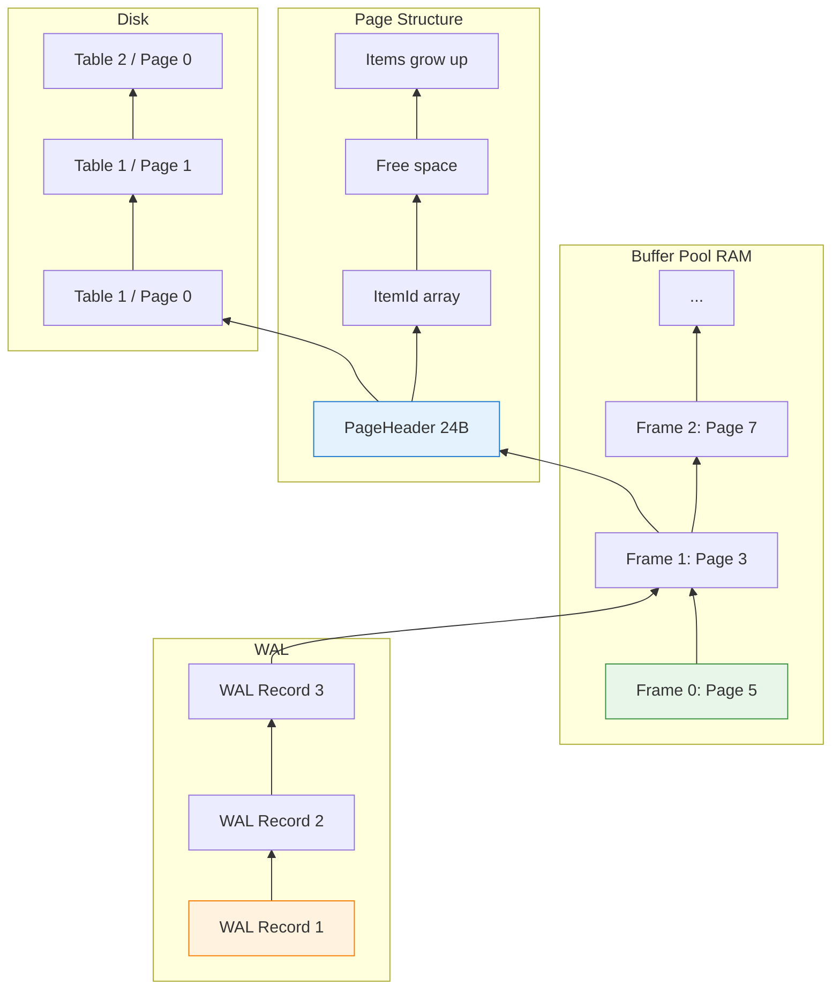

Simple websites no longer satisfy my hunger for knowledge.

After years of building web applications—REST APIs, GraphQL services, microservices with AI and Agentic AI—I hit a wall. I could *use* databases fluently, but I couldn't *build* one. The internals remained a black box: How does PostgreSQL actually store data on disk? How does the buffer pool manage memory? How does WAL ensure durability?

So I started building **[Vaultgres](https://github.com/neoalienson/Vaultgres)**—a PostgreSQL-compatible database in Rust.

This isn't another toy key-value store. The goal is PostgreSQL compatibility: wire protocol, query language, and eventually, storage format. Why? Because PostgreSQL's architecture is battle-tested, and compatibility means real applications could (theoretically) connect without modification.

This series documents the journey: the design decisions, the bugs, the "aha!" moments, and how I'm leveraging AI to accelerate learning while still doing the hard work myself.

Today: **page-based storage and buffer pool**—the foundation every database is built on.

---

## 1 Why Page-Based Storage?

### The Problem: Raw Bytes Are Messy

Imagine storing data directly to disk as a continuous stream:

```
Table: users
┌────────────────────────────────────────────────────────────┐
│ id=1,name=Alice,id=2,name=Bob,id=3,name=Charlie...         │
└────────────────────────────────────────────────────────────┘

Table: orders
┌────────────────────────────────────────────────────────────┐
│ id=101,user_id=1,amount=99.99,id=102,user_id=2,amount=...  │
└────────────────────────────────────────────────────────────┘
```

**Problems:**

| Issue | Why It Matters |
|-------|----------------|
| **No structure** | Can't find row N without scanning from the beginning |
| **No concurrency** | One writer locks the entire file |
| **No crash recovery** | Partial writes corrupt everything |
| **No caching** | Must read entire file to access one row |

---

### The Solution: Fixed-Size Pages

PostgreSQL divides data into **fixed-size pages** (typically 8KB):

```
┌─────────────────────────────────────────────────────────────┐
│  Page 0 (8KB)  │  Page 1 (8KB)  │  Page 2 (8KB)  │  ...    │
└─────────────────────────────────────────────────────────────┘
```

**Each page contains:**

```
┌─────────────────────────────────────────────────────────────┐
│ PageHeader (24 bytes)                                       │
├─────────────────────────────────────────────────────────────┤
│ ItemId array (4 bytes each)                                 │
├─────────────────────────────────────────────────────────────┤
│ Free space                                                  │
├─────────────────────────────────────────────────────────────┤
│ Items (actual row data, grows upward)                       │
└─────────────────────────────────────────────────────────────┘
```

**Benefits:**

| Benefit | Why It Matters |
|---------|----------------|
| **Random access** | Read page N directly: `seek(N * 8KB)` |
| **Fine-grained locking** | Lock individual pages, not entire tables |
| **Efficient caching** | Cache hot pages in memory (buffer pool) |
| **Crash recovery** | WAL records reference specific pages |
| **Standardization** | All pages same size—simplifies memory management |

!!! info "📌 Why 8KB?"
    PostgreSQL uses 8KB pages by default (configurable with `BLCKSZ` at compile time).
    
    **Trade-offs:**
    
| Page Size | Pros | Cons |
|-----------|------|------|
| Small (4KB) | Less internal fragmentation, finer locking | More pages to manage, larger headers |
| Medium (8KB) | Balanced | Default for good reason |
| Large (32KB+) | Fewer pages, better sequential scan | More wasted space per page |

Vaultgres uses 8KB to match PostgreSQL—compatibility over optimization.

---

## 2 Page Layout: Inside an 8KB Page

### PostgreSQL PageHeader

Every page starts with a header:

```c
/* Simplified from PostgreSQL src/include/storage/bufpage.h */
typedef struct PageHeaderData {
    uint16      pd_lower;     /* Offset to start of free space */
    uint16      pd_upper;     /* Offset to end of free space */
    uint16      pd_special;   /* Offset to start of special space */
    uint16      pd_pagesize_version;  /* Page size and version */
    uint32      pd_checksum;  /* Page checksum (optional) */
    /* ... more fields ... */
} PageHeaderData;
```

**Visual layout:**

```
┌─────────────────────────────────────────────────────────────┐
│ 0                   PageHeader (24 bytes)                   │
│ ├── pd_lower ──┐                                            │
│ │              ▼                                            │
│ ├── ItemId[0]  │                                            │
│ ├── ItemId[1]  │  ItemId array (4 bytes each)               │
│ ├── ItemId[2]  │  (points to actual items below)            │
│ │              │                                            │
│ │         pd_upper ──┐                                      │
│ │                    ▼                                      │
│ │              ┌─────────────┐                              │
│ │              │  Free Space │  (grows/shrinks)             │
│ │              └─────────────┘                              │
│ │                    ▲                                      │
│ │              pd_special ──┘                               │
│ │                                                           │
│ │    ┌─────────────────────────────────┐                    │
│ └─►  │  Item 2 (row data)              │  Items grow UP     │
│      ├─────────────────────────────────┤                    │
│      │  Item 1 (row data)              │                    │
│      ├─────────────────────────────────┤                    │
│      │  Item 0 (row data)              │                    │
│      └─────────────────────────────────┘                    │
└─────────────────────────────────────────────────────────────┘
```

**Key insight:** Items grow **upward** from the bottom, ItemId array grows **downward** from the top. Free space is between them. This maximizes space utilization.

---

### ItemId: Pointers to Row Data

Each `ItemId` is a 4-byte pointer:

```c
typedef struct ItemIdData {
    uint16      lp_off;     /* Offset to item (from page start) */
    uint16      lp_len;     /* Length of item (including header) */
    /* ... flags ... */
} ItemIdData;
```

**Why indirection?**

| Reason | Explanation |
|--------|-------------|
| **Move items without changing references** | Update `lp_off` when item moves |
| **Mark items as deleted** | Set `lp_len = 0` without overwriting data |
| **Support HOT (Heap Only Tuple)** | Critical for PostgreSQL performance |

---

### Rust Implementation: Page Struct

Here's how Vaultgres represents a page:

```rust
// src/storage/page.rs
use std::mem;

pub const PAGE_SIZE: usize = 8192;  // 8KB
pub const PAGE_HEADER_SIZE: usize = 24;
pub const ITEM_ID_SIZE: usize = 4;

#[derive(Debug, Clone, Copy)]
#[repr(C)]
pub struct ItemId {
    pub offset: u16,  // Offset to item data
    pub length: u16,  // Length of item
}

impl ItemId {
    pub const fn new(offset: u16, length: u16) -> Self {
        Self { offset, length }
    }

    pub const fn is_unused(&self) -> bool {
        self.length == 0
    }
}

#[repr(C)]
pub struct PageHeader {
    pub pd_lower: u16,      // Start of free space (after ItemIds)
    pub pd_upper: u16,      // End of free space (before items)
    pub pd_special: u16,    // Start of special space (usually PAGE_SIZE)
    pub version: u16,
    pub checksum: u32,
    // Padding to reach 24 bytes
    _padding: [u8; 12],
}

pub struct Page {
    data: [u8; PAGE_SIZE],
}

impl Page {
    pub fn new() -> Self {
        let mut data = [0u8; PAGE_SIZE];
        
        // Initialize header
        let header = PageHeader {
            pd_lower: (PAGE_HEADER_SIZE) as u16,
            pd_upper: PAGE_SIZE as u16,
            pd_special: PAGE_SIZE as u16,
            version: 1,
            checksum: 0,
            _padding: [0; 12],
        };
        
        // Write header to data
        unsafe {
            std::ptr::write_unaligned(
                data.as_mut_ptr() as *mut PageHeader,
                header,
            );
        }
        
        Self { data }
    }

    pub fn header(&self) -> &PageHeader {
        unsafe { &*(self.data.as_ptr() as *const PageHeader) }
    }

    pub fn header_mut(&mut self) -> &mut PageHeader {
        unsafe { &mut *(self.data.as_mut_ptr() as *mut PageHeader) }
    }

    pub fn free_space(&self) -> usize {
        let header = self.header();
        header.pd_upper as usize - header.pd_lower as usize
    }

    pub fn insert(&mut self, item_data: &[u8]) -> Option<u16> {
        // Check if we have enough space
        let required = item_data.len() + ITEM_ID_SIZE;
        if self.free_space() < required {
            return None;  // Page full
        }

        let header = self.header_mut();
        
        // Calculate where to place the item (from bottom, growing up)
        let item_offset = header.pd_upper - item_data.len() as u16;
        
        // Write item data
        self.data[item_offset as usize..item_offset as usize + item_data.len()]
            .copy_from_slice(item_data);
        
        // Create ItemId
        let item_id_offset = header.pd_lower as usize;
        let item_id = ItemId::new(item_offset, item_data.len() as u16);
        
        unsafe {
            std::ptr::write_unaligned(
                self.data[item_id_offset..].as_mut_ptr() as *mut ItemId,
                item_id,
            );
        }
        
        // Update header
        header.pd_lower += ITEM_ID_SIZE as u16;
        header.pd_upper = item_offset;
        
        // Return ItemId index (0-based)
        Some((item_id_offset - PAGE_HEADER_SIZE) / ITEM_ID_SIZE as usize as u16)
    }
}
```

!!! warning "⚠️ Unsafe Rust for Performance"
    Yes, this uses `unsafe`. Why?
    
    - **Zero-copy access** to page data
    - **Exact memory layout** matching PostgreSQL's on-disk format
    - **Performance** critical—pages are accessed millions of times
    
    **Safety guarantees:**
    
    - `#[repr(C)]` ensures predictable layout
    - All accesses are within bounds (checked by `free_space()`)
    - Page is always initialized before use
    
    This is the kind of code where AI assistance is invaluable: I can ask "Is this `unsafe` block sound?" and get a detailed analysis.

---

## 3 Buffer Pool: Caching Pages in Memory

### The Problem: Disk Is Slow

| Storage | Latency | Relative Speed |
|---------|---------|----------------|
| CPU Cache (L1) | ~1ns | 1x |
| RAM | ~100ns | 100x slower |
| NVMe SSD | ~100μs | 100,000x slower |
| HDD | ~10ms | 10,000,000x slower |

**Without a buffer pool:**

```
Query: SELECT * FROM users WHERE id = 42

1. Read page containing id=42 from disk (100μs on NVMe)
2. Parse page, find row
3. Return result

Next query: SELECT * FROM users WHERE id = 42

1. Read page from disk AGAIN (100μs)  ← Wasteful!
2. Parse page, find row
3. Return result
```

---

### The Solution: Buffer Pool

A **buffer pool** caches frequently accessed pages in RAM:

```
┌─────────────────────────────────────────────────────────────┐
│                    Buffer Pool (RAM)                        │
│  ┌─────────┐ ┌─────────┐ ┌─────────┐ ┌─────────┐            │
│  │ Page 0  │ │ Page 5  │ │ Page 3  │ │ Page 7  │  ...       │
│  │ (dirty) │ │ (clean) │ │ (dirty) │ │ (clean) │            │
│  └─────────┘ └─────────┘ └─────────┘ └─────────┘            │
└─────────────────────────────────────────────────────────────┘
         │              │              │
         ▼              ▼              ▼
    ┌─────────┐    ┌─────────┐    ┌─────────┐
    │ Disk    │    │ Disk    │    │ Disk    │
    │ Page 0  │    │ Page 5  │    │ Page 3  │
    └─────────┘    └─────────┘    └─────────┘
```

**With a buffer pool:**

```
Query: SELECT * FROM users WHERE id = 42

1. Check buffer pool for page containing id=42
2. If hit: Return from RAM (~100ns)  ← 1000x faster!
3. If miss: Read from disk, cache in pool, return

Next query: SELECT * FROM users WHERE id = 42

1. Check buffer pool (HIT!)
2. Return from RAM (~100ns)  ← Cached!
```

---

### Buffer Pool Architecture



**Components:**

| Component | Purpose |
|-----------|---------|
| **Buffer Frames** | Fixed-size slots holding pages (e.g., 1024 frames × 8KB = 8MB) |
| **Page Table** | Maps page ID → buffer frame (hash table) |
| **LRU List** | Tracks access order for eviction |
| **Dirty Bit** | Marks pages that need to be written back |
| **Pin Count** | Prevents eviction of in-use pages |

---

### Rust Implementation: Buffer Pool

```rust
// src/storage/buffer_pool.rs
use std::collections::HashMap;
use std::sync::{Arc, Mutex};
use crate::storage::page::{Page, PAGE_SIZE};

pub struct BufferFrame {
    page: Option<Page>,
    page_id: Option<u64>,
    pin_count: u32,
    is_dirty: bool,
    last_accessed: u64,  // For LRU
}

pub struct BufferPool {
    frames: Vec<Mutex<BufferFrame>>,
    page_table: Mutex<HashMap<u64, usize>>,  // page_id → frame_index
    lru_list: Mutex<Vec<usize>>,  // frame indices, front = MRU
    disk: Arc<DiskManager>,
    access_counter: Mutex<u64>,
}

impl BufferPool {
    pub fn new(num_frames: usize, disk: Arc<DiskManager>) -> Self {
        let frames = (0..num_frames)
            .map(|_| Mutex::new(BufferFrame {
                page: None,
                page_id: None,
                pin_count: 0,
                is_dirty: false,
                last_accessed: 0,
            }))
            .collect();
        
        Self {
            frames,
            page_table: Mutex::new(HashMap::new()),
            lru_list: Mutex::new(Vec::new()),
            disk,
            access_counter: Mutex::new(0),
        }
    }

    pub fn get_page(&self, page_id: u64) -> Option<Arc<Mutex<Page>>> {
        // Check if page is in pool
        let mut page_table = self.page_table.lock().unwrap();
        
        if let Some(&frame_idx) = page_table.get(&page_id) {
            // Cache hit
            let mut frame = self.frames[frame_idx].lock().unwrap();
            frame.pin_count += 1;
            frame.last_accessed = *self.access_counter.lock().unwrap();
            
            // Move to front of LRU
            let mut lru = self.lru_list.lock().unwrap();
            if let Some(pos) = lru.iter().position(|&x| x == frame_idx) {
                lru.remove(pos);
                lru.push_front(frame_idx);
            }
            
            return Some(Arc::clone(&frame.page.as_ref().unwrap()));
        }
        
        drop(page_table);
        
        // Cache miss - need to load from disk
        self.load_page(page_id)
    }

    fn load_page(&self, page_id: u64) -> Option<Arc<Mutex<Page>>> {
        // Find victim frame using LRU
        let victim_idx = self.find_victim()?;
        
        let mut frame = self.frames[victim_idx].lock().unwrap();
        
        // Write back if dirty
        if frame.is_dirty {
            if let Some(old_page_id) = frame.page_id {
                self.disk.write_page(old_page_id, frame.page.as_ref().unwrap())
                    .ok()?;
            }
            frame.is_dirty = false;
        }
        
        // Read new page from disk
        let new_page = self.disk.read_page(page_id).ok()?;
        
        // Update frame
        frame.page = Some(new_page);
        frame.page_id = Some(page_id);
        frame.pin_count = 1;
        frame.last_accessed = *self.access_counter.lock().unwrap();
        
        // Update page table
        let mut page_table = self.page_table.lock().unwrap();
        page_table.insert(page_id, victim_idx);
        
        // Update LRU
        let mut lru = self.lru_list.lock().unwrap();
        lru.push_front(victim_idx);
        
        Some(Arc::clone(&frame.page.as_ref().unwrap()))
    }

    fn find_victim(&self) -> Option<usize> {
        let mut lru = self.lru_list.lock().unwrap();
        
        // Find unpinned page from back (LRU)
        for i in (0..lru.len()).rev() {
            let frame_idx = lru[i];
            let frame = self.frames[frame_idx].lock().unwrap();
            
            if frame.pin_count == 0 {
                lru.remove(i);
                return Some(frame_idx);
            }
        }
        
        // All pages pinned - need to wait or allocate more frames
        None
    }

    pub fn mark_dirty(&self, page_id: u64) {
        let page_table = self.page_table.lock().unwrap();
        if let Some(&frame_idx) = page_table.get(&page_id) {
            let mut frame = self.frames[frame_idx].lock().unwrap();
            frame.is_dirty = true;
        }
    }

    pub fn unpin_page(&self, page_id: u64) {
        let page_table = self.page_table.lock().unwrap();
        if let Some(&frame_idx) = page_table.get(&page_id) {
            let mut frame = self.frames[frame_idx].lock().unwrap();
            frame.pin_count = frame.pin_count.saturating_sub(1);
        }
    }

    pub fn flush_all(&self) -> std::io::Result<()> {
        for frame in &self.frames {
            let mut f = frame.lock().unwrap();
            if f.is_dirty {
                if let Some(page_id) = f.page_id {
                    self.disk.write_page(page_id, f.page.as_ref().unwrap())?;
                }
                f.is_dirty = false;
            }
        }
        Ok(())
    }
}
```

!!! tip "💡 Key Design Decisions"
    **1. Fine-grained locking:** Each `BufferFrame` has its own `Mutex`, not one lock for the entire pool.
    
    **2. ARC for shared access:** `Arc<Mutex<Page>>` allows multiple threads to hold the same page.
    
    **3. Pin count:** Prevents eviction while a thread is using the page.
    
    **4. LRU eviction:** Least recently used pages are evicted first.
    
    These decisions came from asking AI: "How would you design a thread-safe buffer pool in Rust?" and then iterating on the answer based on PostgreSQL's actual implementation.

---

## 4 Disk Manager: Abstracting File I/O

### Single File vs. Multiple Files

PostgreSQL stores each table/index in a separate file:

```
$PGDATA/base/16384/      # Database OID
├── 16385                # Table: users
├── 16386                # Table: orders
├── 16387_idx            # Index: users_email_idx
└── ...
```

Vaultgres follows the same pattern:

```rust
// src/storage/disk.rs
use std::collections::HashMap;
use std::fs::{File, OpenOptions};
use std::io::{Read, Seek, SeekFrom, Write};
use std::path::{Path, PathBuf};
use std::sync::Mutex;

pub struct DiskManager {
    data_dir: PathBuf,
    files: Mutex<HashMap<u64, File>>,  # table_id → File
}

impl DiskManager {
    pub fn new(data_dir: &str) -> std::io::Result<Self> {
        std::fs::create_dir_all(data_dir)?;
        Ok(Self {
            data_dir: PathBuf::from(data_dir),
            files: Mutex::new(HashMap::new()),
        })
    }

    fn get_file(&self, table_id: u64) -> std::io::Result<std::fs::File> {
        let mut files = self.files.lock().unwrap();
        
        if let Some(file) = files.get(&table_id) {
            // File already open - need to handle this differently
            // (simplified for example)
        }
        
        let path = self.data_dir.join(table_id.to_string());
        let file = OpenOptions::new()
            .read(true)
            .write(true)
            .create(true)
            .open(&path)?;
        
        files.insert(table_id, file.try_clone()?);
        Ok(file)
    }

    pub fn read_page(&self, page_id: u64) -> std::io::Result<Page> {
        let table_id = page_id >> 32;  # High 32 bits
        let page_num = page_id as u32;  # Low 32 bits
        
        let mut file = self.get_file(table_id)?;
        let mut data = [0u8; PAGE_SIZE];
        
        file.seek(SeekFrom::Start(page_num as u64 * PAGE_SIZE as u64))?;
        file.read_exact(&mut data)?;
        
        Ok(Page::from_data(data))
    }

    pub fn write_page(&self, page_id: u64, page: &Page) -> std::io::Result<()> {
        let table_id = page_id >> 32;
        let page_num = page_id as u32;
        
        let mut file = self.get_file(table_id)?;
        
        file.seek(SeekFrom::Start(page_num as u64 * PAGE_SIZE as u64))?;
        file.write_all(page.as_bytes())?;
        file.sync_all()?;  # Force to disk
        
        Ok(())
    }
}
```

---

### Page ID Encoding

Vaultgres encodes table ID and page number into a single `u64`:

```
┌─────────────────────────────────────────────────────────────┐
│  Page ID (u64)                                              │
│  ┌─────────────────┬─────────────────┐                      │
│  │  Table ID (32)  │  Page Num (32)  │                      │
│  └─────────────────┴─────────────────┘                      │
└─────────────────────────────────────────────────────────────┘

Example: page_id = 0x0000000100000005
  Table ID: 1
  Page Number: 5
```

**Why?**

| Reason | Explanation |
|--------|-------------|
| **Single identifier** | Simplifies buffer pool and page table |
| **Efficient hashing** | `u64` is faster than `(u32, u32)` tuple |
| **PostgreSQL compatible** | Similar to PostgreSQL's `BlockId` |

---

## 5 Write-Ahead Logging (WAL): Ensuring Durability

### The Problem: Crashes Corrupt Data

Without WAL:

```
1. Buffer pool modifies page in memory
2. Before page is written to disk... CRASH!
3. Data lost forever
```

**Or worse:**

```
1. Write page to disk (50% complete)... CRASH!
2. Page is now corrupted (torn page)
```

---

### The Solution: Write-Ahead Logging

**WAL Principle:** Before modifying a page, write the change to a log:

```
Transaction: UPDATE users SET balance = 100 WHERE id = 42

1. Write WAL record: "Page X, Offset Y, Old Value Z, New Value W"
2. Flush WAL to disk (fsync)
3. Modify page in buffer pool (mark dirty)
4. ACK to client
5. Later: Checkpoint writes dirty pages to disk
```

**After crash:**

```
1. Read last checkpoint position
2. Replay WAL records from checkpoint to end
3. Database is consistent
```

---

### WAL Record Format

```rust
// src/storage/wal.rs
#[derive(Debug, Clone)]
pub struct WalRecord {
    pub lsn: u64,              // Log Sequence Number
    pub table_id: u64,
    pub page_num: u32,
    pub offset: u16,           // Offset within page
    pub old_data: Vec<u8>,     // Before image (for undo)
    pub new_data: Vec<u8>,     // After image (for redo)
    pub transaction_id: u64,
    pub record_type: WalRecordType,
}

#[derive(Debug, Clone)]
pub enum WalRecordType {
    Insert,
    Update,
    Delete,
    Checkpoint,
    Commit,
    Abort,
}

pub struct WalManager {
    wal_dir: PathBuf,
    current_lsn: u64,
    current_file: File,
    flush_lsn: u64,  // Last flushed LSN
}

impl WalManager {
    pub fn log_change(&mut self, record: WalRecord) -> std::io::Result<u64> {
        // Serialize record
        let mut data = Vec::new();
        data.extend_from_slice(&record.lsn.to_le_bytes());
        data.extend_from_slice(&(record.table_id.to_le_bytes()));
        // ... more fields
        
        // Write to WAL file
        self.current_file.write_all(&data)?;
        
        // Update LSN
        self.current_lsn += 1;
        
        Ok(record.lsn)
    }

    pub fn flush(&mut self) -> std::io::Result<()> {
        self.current_file.sync_all()?;
        self.flush_lsn = self.current_lsn;
        Ok(())
    }

    pub fn replay_from(&mut self, lsn: u64, buffer_pool: &BufferPool) -> std::io::Result<()> {
        // Seek to LSN
        // Read records
        // For each record:
        //   - Get page from buffer pool
        //   - Apply new_data to page
        //   - Mark page dirty
        Ok(())
    }
}
```

!!! warning "⚠️ WAL Is Hard"
    Implementing WAL correctly is one of the hardest parts of building a database:
    
    - **Logical vs. Physical WAL:** Log operations (INSERT row) or page changes (bytes X→Y)?
    - **ARIES recovery:** Undo uncommitted, redo committed (PhD thesis territory)
    - **Checkpointing:** How often? Fuzzy or sharp?
    - **Log truncation:** When can old WAL files be deleted?
    
    Vaultgres will start with a simple physical WAL (page images) and evolve from there. AI has been invaluable for understanding the trade-offs here.

---

## 6 Challenges Building in Rust

### Challenge 1: Ownership vs. Shared Access

**Problem:** Buffer pool needs to share pages across threads, but Rust's ownership system fights this.

```rust
// ❌ Doesn't work
pub fn get_page(&self, page_id: u64) -> Page {
    // Can't return owned Page - buffer pool needs to keep it
}

// ✅ Solution: Arc<Mutex<T>>
pub fn get_page(&self, page_id: u64) -> Arc<Mutex<Page>> {
    // Shared ownership, interior mutability
}
```

**Trade-offs:**

| Approach | Pros | Cons |
|----------|------|------|
| `Arc<Mutex<T>>` | Safe, familiar | Lock contention |
| `RwLock<T>` | Better for read-heavy | Write starvation |
| Lock-free (unsafe) | Maximum performance | Complex, error-prone |

---

### Challenge 2: Zero-Copy vs. Safety

**Problem:** PostgreSQL uses raw pointers for page access. Rust wants bounds checks.

```rust
// PostgreSQL (C)
Page page = buffer_pool->pages[frame_id];
Item item = (Item)(page + item_offset);  // No bounds check!

// Rust (safe)
let item = &page.data[item_offset..item_offset + item_len];  // Bounds checked

// Rust (unsafe, zero-copy)
let item = unsafe {
    &*(page.data.as_ptr().add(item_offset) as *const Item)
};  // Fast but requires safety analysis
```

**Vaultgres approach:** Start safe, optimize hot paths with `unsafe` after profiling.

---

### Challenge 3: Error Handling

**Problem:** PostgreSQL uses `elog(ERROR, ...)`. Rust uses `Result<T, E>`.

```rust
// PostgreSQL
if (page_full) {
    elog(ERROR, "page is full");  // Longjmp out
}

// Rust
if (page_full) {
    return Err(PageError::Full);  // Propagate up
}
```

**Impact:** Every function signature changes. Call chains become `Result` pyramids.

**Solution:** Use `?` operator liberally, define clear error types:

```rust
#[derive(Debug)]
pub enum StorageError {
    PageFull,
    PageNotFound(u64),
    IoError(std::io::Error),
    CorruptedPage(u64),
}

impl From<std::io::Error> for StorageError {
    fn from(err: std::io::Error) -> Self {
        StorageError::IoError(err)
    }
}

pub fn insert(&mut self, data: &[u8]) -> Result<u16, StorageError> {
    if self.free_space() < data.len() {
        return Err(StorageError::PageFull);
    }
    // ...
    Ok(item_id)
}
```

---

## 7 How AI Accelerates Learning

### What AI Does Well

| Task | How I Use AI |
|------|--------------|
| **Explaining concepts** | "Explain PostgreSQL's buffer pool replacement strategies" |
| **Code review** | "Is this unsafe block sound? What could go wrong?" |
| **Generating boilerplate** | "Generate a Rust struct for PostgreSQL PageHeader" |
| **Debugging help** | "Why does this deadlock? Here's my lock order..." |
| **Comparing approaches** | "LRU vs. Clock vs. FIFO for buffer pool eviction" |

---

### What AI Doesn't Replace

| Skill | Why It's Still On Me |
|-------|----------------------|
| **System design** | AI can't decide overall architecture |
| **Trade-off analysis** | "Should I prioritize compatibility or performance?" |
| **Testing** | AI can't run benchmarks or find race conditions |
| **Debugging** | AI can't attach gdb or read core dumps |
| **Learning** | I still have to understand every line AI generates |

---

### Example: Learning Buffer Pool Eviction

**My question to AI:**

> "PostgreSQL uses a clock-sweep algorithm for buffer pool eviction, not pure LRU. Why? What are the trade-offs?"

**What I learned:**

1. **LRU problem:** Sequential scans evict everything (scan resistance)
2. **Clock-sweep:** Approximates LRU but cheaper (no linked list updates)
3. **Usage count:** Pages get multiple chances before eviction
4. **PostgreSQL's variant:** Also considers pin count and dirty status

**Result:** I implemented clock-sweep instead of LRU in Vaultgres:

```rust
pub fn find_victim(&self) -> Option<usize> {
    let mut clock_hand = self.clock_hand.lock().unwrap();
    let frames = self.frames.len();
    
    for _ in 0..frames * 2 {  // Sweep at most twice
        let idx = *clock_hand as usize;
        let mut frame = self.frames[idx].lock().unwrap();
        
        if frame.pin_count == 0 {
            if frame.usage_count > 0 {
                frame.usage_count -= 1;  // Second chance
            } else {
                *clock_hand = (*clock_hand + 1) % frames as u32;
                return Some(idx);  // Evict this one
            }
        }
        
        drop(frame);
        *clock_hand = (*clock_hand + 1) % frames as u32;
    }
    
    None  // All pages pinned
}
```

This is the pattern: AI explains, I implement, I test, I learn.

## Summary: Page-Based Storage in One Diagram



**Key Takeaways:**

| Concept | Why It Matters |
|---------|----------------|
| **Page-based storage** | Random access, fine-grained locking, efficient caching |
| **Buffer pool** | 1000x faster than disk access for hot pages |
| **LRU/Clock eviction** | Keep frequently used pages, evict cold ones |
| **WAL** | Durability without sacrificing performance |
| **Rust challenges** | Ownership, safety, zero-copy—trade-offs everywhere |

---

**Further Reading:**

- PostgreSQL Source: [`src/include/storage/bufpage.h`](https://github.com/postgres/postgres/blob/master/src/include/storage/bufpage.h)
- PostgreSQL Source: [`src/backend/storage/buffer/`](https://github.com/postgres/postgres/tree/master/src/backend/storage/buffer)
- "Database Management Systems" by Ramakrishnan & Gehrke (Ch. 9: Storage and Indexing)
- "Readings in Database Systems" (Red Book) - Buffer Pool chapter
- Vaultgres Repository: [github.com/neoalienson/Vaultgres](https://github.com/neoalienson/Vaultgres)
