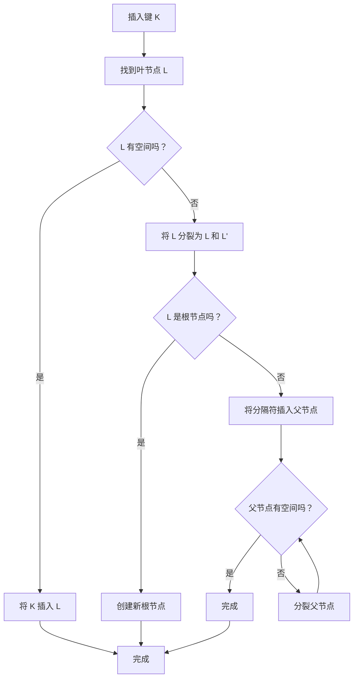
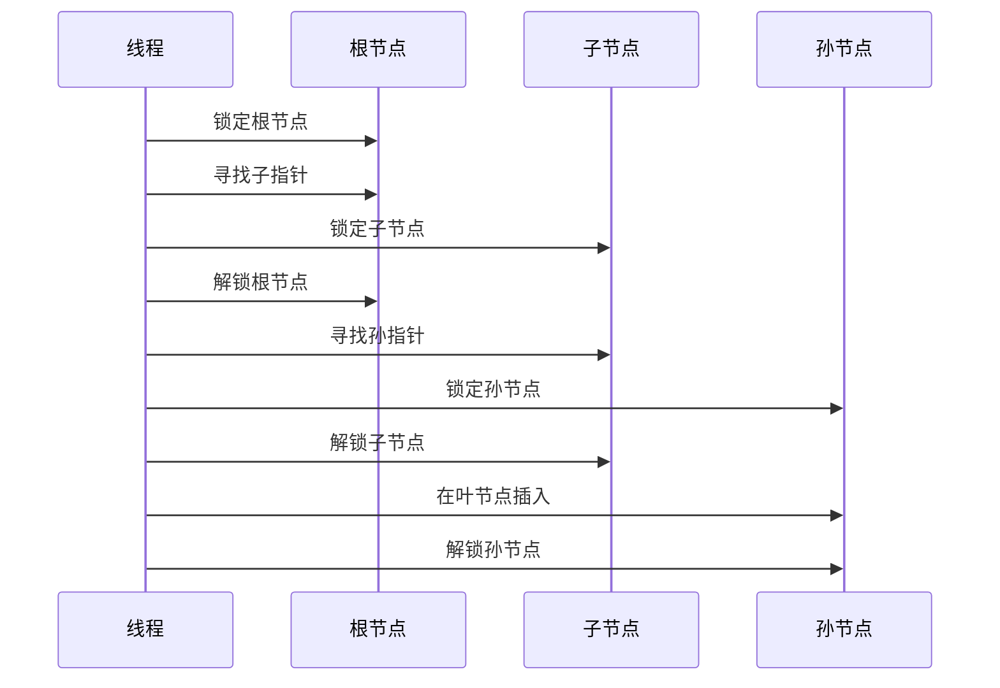
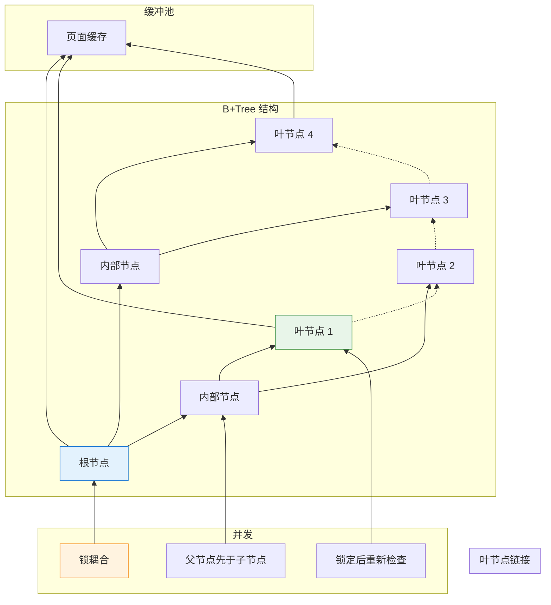

在 [第一部分](/zh-CN/2026/03/Database-Rust-Page-Storage-Buffer-Pool/) 中，我们建立了基础：页面式存储和缓冲池。但有个问题。

**寻找一列需要完整表扫描：**

```rust
// Without an index: O(n)
for page in table_pages {
    for row in page.rows {
        if row.id == 42 {
            return row;  // Found it! (maybe on the last page)
        }
    }
}
```

对于有 100 万列的表？那是 100 万次比较。在磁盘上？**无法接受。**

真正的数据库使用**索引**在 O(log n) 时间内找到列。PostgreSQL 的默认：**B+Tree**。

今天：在 Rust 中实现线程安全的 B+Tree 索引，并与我们的缓冲池集成。是的，并发访问和听起来一样困难。

---

## 1 为什么选择 B+Tree？

### 替代方案

| 索引类型 | 查询 | 范围扫描 | 插入 | 使用场景 |
|------------|--------|------------|--------|----------|
| **哈希表** | O(1) | ❌ 不支持 | O(1) | 仅精确匹配 |
| **B+Tree** | O(log n) | ✅ 优秀 | O(log n) | 通用 |
| **LSM Tree** | O(log n) | ⚠️ 需要压缩 | O(1) 平均 | 写入密集 (RocksDB) |
| **跳跃表** | O(log n) | ✅ 良好 | O(log n) | 内存中 (Redis) |

**PostgreSQL 选择 B+Tree 因为：**

| 原因 | 为什么重要 |
|--------|----------------|
| **平衡** | 所有叶节点在同一深度——可预测的性能 |
| **范围查询** | 叶节点链接——高效的 `WHERE id BETWEEN 10 AND 100` |
| **磁盘友好**  | 高扇出（每个节点数百个键）——浅树 |
| **自我平衡** | 不需要手动重组 |

---

### B+Tree 结构

```
                    ┌─────────────────┐
                    │   Root Node     │  ← 页面 0
                    │  [10] │ [50]    │
                    └────────┬────────┘
                             │
            ┌────────────────┼────────────────┐
            │                │                │
            ▼                ▼                ▼
    ┌──────────────┐ ┌──────────────┐ ┌──────────────┐
    │  Node [10]   │ │  Node [50]   │ │  Node [∞]    │  ← 页面 1, 2, 3
    │ [1,5,7]│[10] │ │ [20,30]│[50] │ │ [60,80,90]  │
    └──────────────┘ └──────────────┘ └──────────────┘
            │                │                │
            ▼                ▼                ▼
    ┌──────────────┐ ┌──────────────┐ ┌──────────────┐
    │ Leaf [1,5,7] │ │Leaf [10,20,30│ │Leaf [50,60,  │  ← 页面 4, 5, 6
    │ → next: 5    │ │ → next: 6    │ │     80,90]   │
    └──────────────┘ └──────────────┘ └──────────────┘
```

**关键属性：**

| 属性 | Vaultgres 中的值 |
|----------|-------------------|
| **阶数 (扇出)** | 每个内部节点约 500 个键 (8KB 页面) |
| **高度** | 10 亿个键需要 3-4 层 |
| **叶节点** | 包含实际数据指针 (TID) |
| **内部节点** | 仅键 + 子指针 (路由) |
| **链接叶子** | 每个叶子指向下一个——无需树遍历的范围扫描 |

---

## 2 节点布局：将 B+Tree 装入页面

### 内部节点结构

每个节点适合一个 8KB 页面：

```rust
// src/index/btree_node.rs
use crate::storage::page::{Page, PAGE_SIZE, PAGE_HEADER_SIZE};

pub const BTREE_NODE_HEADER_SIZE: usize = 32;
pub const MAX_KEYS_PER_NODE: usize = (PAGE_SIZE - BTREE_NODE_HEADER_SIZE) / 12;  // ~680 keys

#[repr(C)]
pub struct BTreeNodeHeader {
    pub is_leaf: bool,           // 1 byte
    pub key_count: u16,          // 2 bytes
    pub parent_page: u64,        // 8 bytes
    pub right_sibling: u64,      // 8 bytes (for leaf nodes)
    pub level: u16,              // 2 bytes (distance from leaf)
    _padding: [u8; 10],          // 填充到 32 字节
}

pub struct BTreeNode {
    page: Page,
}

impl BTreeNode {
    pub fn new_leaf() -> Self {
        let mut page = Page::new();
        let header = BTreeNodeHeader {
            is_leaf: true,
            key_count: 0,
            parent_page: 0,
            right_sibling: 0,
            level: 0,
            _padding: [0; 10],
        };
        // 将头部写入页面...
        Self { page }
    }

    pub fn new_internal(level: u16) -> Self {
        let mut page = Page::new();
        let header = BTreeNodeHeader {
            is_leaf: false,
            key_count: 0,
            parent_page: 0,
            right_sibling: 0,
            level,
            _padding: [0; 10],
        };
        Self { page }
    }
}
```

**页面内的关键布局：**

```
┌─────────────────────────────────────────────────────────────┐
│ PageHeader (24 bytes)                                       │
├─────────────────────────────────────────────────────────────┤
│ BTreeNodeHeader (32 bytes)                                  │
├─────────────────────────────────────────────────────────────┤
│ Keys (variable size, sorted)                                │
├─────────────────────────────────────────────────────────────┤
│ Child Pointers (8 bytes each)                               │
├─────────────────────────────────────────────────────────────┤
│ Free space                                                  │
└─────────────────────────────────────────────────────────────┘
```

---

### 键和值格式

对于 `users.id` (整数) 的索引：

```rust
pub struct BTreeKey {
    data: Vec<u8>,  // 序列化的键（例如，i32 为 4 字节）
}

impl BTreeKey {
    pub fn from_i32(value: i32) -> Self {
        Self {
            data: value.to_le_bytes().to_vec(),
        }
    }

    pub fn to_i32(&self) -> i32 {
        i32::from_le_bytes(self.data.try_into().unwrap())
    }
}

// 叶节点值：指向实际行 (TID = Table ID + Page + Offset)
pub struct BTreeValue {
    pub table_id: u64,
    pub page_num: u32,
    pub offset: u16,
}
```

---

## 3 基本 B+Tree 操作

### 搜索：寻找键

```rust
impl BTreeIndex {
    pub fn search(&self, key: &BTreeKey) -> Option<BTreeValue> {
        let mut current_page = self.root_page;

        loop {
            let node = self.get_node(current_page)?;

            if node.is_leaf() {
                // 找到叶节点—搜索键
                return node.search_leaf(key);
            } else {
                // 内部节点—寻找子节点以深入
                let child_idx = node.find_child_index(key);
                current_page = node.get_child_pointer(child_idx);
            }
        }
    }
}

impl BTreeNode {
    pub fn search_leaf(&self, key: &BTreeKey) -> Option<BTreeValue> {
        // 在叶节点内二分搜索
        let idx = self.binary_search(key)?;
        self.get_value(idx)
    }

    fn binary_search(&self, key: &BTreeKey) -> Option<usize> {
        let mut low = 0;
        let mut high = self.key_count();

        while low < high {
            let mid = (low + high) / 2;
            match self.get_key(mid).cmp(key) {
                std::cmp::Ordering::Equal => return Some(mid),
                std::cmp::Ordering::Less => low = mid + 1,
                std::cmp::Ordering::Greater => high = mid,
            }
        }

        None
    }
}
```

**复杂度：** O(log_f n)，其中 f = 扇出 (~500)。对于 10 亿个键：**约 4 次页面访问。**

---

### 插入：困难的部分

插入是 B+Tree 变得复杂的地方：



**逐步示例：**

```
初始状态 (为简化起见，阶数为 3):
┌─────────────────┐
│   根: [50]    │
└────────┬────────┘
         │
    ┌────┴────┐
    │         │
    ▼         ▼
┌───────┐ ┌───────┐
│[10,30]│ │[60,80]│  ← 叶节点已满！
└───────┘ └───────┘

插入 70:

1. 找到叶节点: [60,80]
2. 叶节点已满—分裂！
3. 新叶节点: [60] 和 [70,80]
4. 将 70 提升到父节点

结果:
┌───────────────────┐
│  根: [50]│[70]  │
└─────────┬─────────┘
          │
    ┌─────┼─────┐
    │     │     │
    ▼     ▼     ▼
┌────┐ ┌────┐ ┌──────┐
│[10]│ │[30]│ │[60,80│  ← 等等，这不对...
└────┘ └────┘ └──────┘
```

**正确的分裂：**

```rust
impl BTreeNode {
    pub fn split(&mut self) -> (BTreeNode, BTreeKey) {
        let mid = self.key_count() / 2;
        let separator = self.get_key(mid);

        // 创建新的兄弟节点
        let mut new_node = BTreeNode::new_leaf();

        // 将一半的键移动到新节点
        for i in mid..self.key_count() {
            new_node.insert(self.get_key(i), self.get_value(i));
        }

        // 截断原始节点
        self.truncate(mid);

        // 设置兄弟节点指针
        new_node.set_right_sibling(self.right_sibling());
        self.set_right_sibling(new_node.page_id());

        (new_node, separator)
    }
}
```

---

## 4 并发访问：真正的挑战

### 问题：锁定树

**天真方法：锁定整棵树**

```rust
// ❌ 性能极差
pub fn insert(&self, key: BTreeKey, value: BTreeValue) {
    let _guard = self.global_lock.lock().unwrap();
    // ... do insert ...
}
```

**结果：** 一次一个操作。违背了数据库的目的。

---

### 更好：锁耦合 (Crabbing)

**锁耦合：** 在遍历期间最多保持两个相邻节点的锁。



**Rust 实现：**

```rust
// src/index/btree_concurrent.rs
use std::sync::Arc;
use parking_lot::RwLock;  // 比 std::sync::RwLock 更好

pub struct BTreeIndex {
    root_page: u64,
    buffer_pool: Arc<BufferPool>,
    // 每个节点都由其自己的锁保护
    node_locks: Arc<DashMap<u64, Arc<RwLock<()>>>>,  // 页面ID → 锁
}

impl BTreeIndex {
    pub fn insert(&self, key: BTreeKey, value: BTreeValue) -> Result<(), BTreeError> {
        let mut current_page = self.root_page;
        let mut parent_lock: Option<Arc<RwLock<()>>> = None;
        let mut current_lock = self.get_node_lock(current_page);

        loop {
            // 获取当前节点的读锁
            let read_guard = current_lock.read();

            let node = self.get_node(current_page)?;

            if node.is_leaf() {
                // 升级为写锁
                drop(read_guard);
                let write_guard = current_lock.write();

                // 检查是否需要分裂
                if node.is_full() {
                    // 分裂需要父节点锁
                    if let Some(parent_lock) = parent_lock {
                        let _parent_guard = parent_lock.write();
                        self.split_leaf(current_page, parent_lock)?;
                    } else {
                        // 分裂根节点
                        self.split_root(current_page)?;
                    }
                }

                // 插入到叶节点
                self.insert_into_leaf(current_page, key, value)?;
                return Ok(());
            } else {
                // 内部节点—深入
                let child_idx = node.find_child_index(&key);
                let child_page = node.get_child_pointer(child_idx);

                // 释放当前节点前锁定子节点 (锁耦合)
                let child_lock = self.get_node_lock(child_page);
                let _child_read = child_lock.read();

                // 释放当前锁
                drop(read_guard);
                drop(current_lock);

                // 向下移动
                parent_lock = Some(child_lock.clone());
                current_lock = child_lock;
                current_page = child_page;
            }
        }
    }
}
```

!!! warning "⚠️ 锁升级死锁"
    **问题：** 在持有其他锁的同时从读锁升级到写锁可能会导致死锁。

    **Vaultgres 中的解决方案：** 使用 `parking_lot::RwLock` 搭配 `upgradable_read()` 或释放并重新获取（带有乐观重试）。

---

### 分裂噩梦

**情景：两个线程分裂同一个节点**

```
线程 A:                    线程 B:
1. 锁定父节点 P
2. 锁定叶节点 L
3. 分裂 L → L1, L2
4. 在 P 中插入分隔符
                           5. 锁定父节点 P (等待!)
                           5. 锁定叶节点 L (已分裂!)
                           6. ??? 数据损坏 ???
```

**解决方案：获取锁后检查条件**

```rust
pub fn split_leaf(&self, leaf_page: u64, parent_lock: Arc<RwLock<()>>) -> Result<(), BTreeError> {
    let parent_guard = parent_lock.write();

    // 重新检查：此叶节点是否仍然已满？
    let leaf = self.get_node(leaf_page)?;
    if !leaf.is_full() {
        // 另一个线程已经分裂了—无需任何操作！
        return Ok(());
    }

    // 继续分裂...
}
```

---

## 5 范围扫描：利用链接叶子

### 树遍历的问题

对于 `SELECT * FROM users WHERE id BETWEEN 10 AND 100`：

**没有叶子链接：** 必须为每个键遍历树。O(n log n)。

**有叶子链接：** 找到起始键一次，然后扫描叶子。O(log n + k)。

---

### 实现

```rust
pub struct BTreeScan {
    current_leaf: u64,
    current_idx: usize,
    end_key: BTreeKey,
    buffer_pool: Arc<BufferPool>,
}

impl Iterator for BTreeScan {
    type Item = BTreeValue;

    fn next(&mut self) -> Option<Self::Item> {
        loop {
            let leaf = self.get_leaf(self.current_leaf)?;

            if self.current_idx < leaf.key_count() {
                let key = leaf.get_key(self.current_idx);

                // 检查我们是否已经越过末尾
                if key > &self.end_key {
                    return None;
                }

                let value = leaf.get_value(self.current_idx);
                self.current_idx += 1;
                return Some(value);
            } else {
                // 移动到下一个叶节点
                self.current_leaf = leaf.right_sibling();
                self.current_idx = 0;

                if self.current_leaf == 0 {
                    return None;  // 树的末尾
                }
            }
        }
    }
}
```

**使用：**

```rust
let scan = index.scan_range(BTreeKey::from_i32(10), BTreeKey::from_i32(100));
for value in scan {
    let row = buffer_pool.get_page(value.page_num);
    // 处理行...
}
```

---

## 6 与缓冲池集成

### 页面类型

缓冲池现在处理多种页面类型：

```rust
// src/storage/page_type.rs
#[derive(Debug, Clone, Copy, PartialEq)]
pub enum PageType {
    Heap,       // 表数据 (来自第一部分)
    BTreeLeaf,  // B+Tree 叶节点
    BTreeInternal,  // B+Tree 内部节点
    BTreeRoot,  // B+Tree 根
}

impl Page {
    pub fn page_type(&self) -> PageType {
        // 从页面头部读取...
    }
}
```

---

### 内存压力

**问题：** 索引扫描可能会淘汰热门数据页面。

```
1. 索引扫描触及 1000 个叶页面
2. LRU 驱逐热门表页面以腾出空间
3. 查询需要表页面—磁盘 I/O！
```

**解决方案：带使用提示的时钟扫描**

```rust
// src/storage/buffer_pool.rs
pub struct BufferFrame {
    // ... 现有字段 ...
    pub usage_hint: UsageHint,  // 新!
}

#[derive(Debug, Clone, Copy)]
pub enum UsageHint {
    Normal,      // 标准 LRU
    IndexScan,   // 可能更早被驱逐
    Pinned,      // 保留在内存中 (热门表)
}

impl BufferPool {
    pub fn get_page_with_hint(&self, page_id: u64, hint: UsageHint) -> Option<Arc<Mutex<Page>>> {
        // ... 在帧上设置提示 ...
    }
}
```

---

## 7 用 Rust 构建的挑战

### 挑战 1：自引用结构

**问题：** 节点需要引用其父节点/子节点，但 Rust 的借用检查器讨厌这个。

```rust
// ❌ 无法编译
pub struct BTreeNode {
    parent: Option<&BTreeNode>,  // 对父节点的引用
    children: Vec<&BTreeNode>,   // 对子节点的引用
}
```

**解决方案：页面 ID 作为间接引用**

```rust
// ✅ 可行
pub struct BTreeNode {
    parent_page: Option<u64>,  // 页面 ID，而非引用
    children: Vec<u64>,        // 页面 ID
}

// 需要时将页面 ID 解析为节点
let parent = buffer_pool.get_page(self.parent_page?);
```

---

### 挑战 2：锁顺序

**问题：** 如果线程以不同顺序获取锁则会死锁。

```
线程 A：锁定页面 5，然后锁定页面 10
线程 B：锁定页面 10，然后锁定页面 5 ← 死锁！
```

**解决方案：始终以一致顺序锁定（父节点先于子节点）**

```rust
// 锁耦合自然地强制执行此操作
pub fn descend(&self, parent_page: u64, child_page: u64) {
    let parent_lock = self.get_lock(parent_page);
    let child_lock = self.get_lock(child_page);

    // 总是先获取父节点
    let _parent = parent_lock.read();
    let _child = child_lock.read();  // 安全—顺序一致
}
```

---

### 挑战 3：带 WAL 的分裂

**问题：** 分裂会触及多个页面。如何使其原子化？

```rust
// ❌ 非原子性
self.write_node(left);
self.write_node(right);  // ← 此处崩溃 = 数据损坏！
self.update_parent();
```

**解决方案：在修改页面前写入 WAL**

```rust
pub fn split_node(&self, node_page: u64) -> Result<(), BTreeError> {
    // 1. 写入描述分裂的 WAL 记录
    let lsn = self.wal.log_split(node_page, left_data, right_data)?;
    self.wal.flush()?;  // 继续前持久化

    // 2. 现在可以安全地修改页面
    self.write_node(left);
    self.write_node(right);
    self.update_parent();

    // 3. 记录完成
    self.wal.log_split_complete(lsn)?;

    Ok(())
}
```

---

## 8 AI 如何加速这项工作

### AI 做对了什么

| 任务 | AI 贡献 |
|------|-----------------|
| **锁耦合算法** | 用伪代码解释模式 |
| **分裂逻辑** | 生成正确的键重新分配 |
| **Rust 模式** | 建议使用 `parking_lot` 而非 `std::sync` |
| **调试协助** | “这个死锁发生是因为...” |

---

### AI 做错了什么

| 问题 | 发生了什么 |
|-------|---------------|
| **初始锁升级** | 建议使用 `RwLock::upgrade()` 但在 std 中不存在 |
| **页面布局** | 初稿将键和值交错（缓存不友好） |
| **分裂边界情况** | 忽略了“根分裂”特殊情况 |

**模式：** AI 提供 80% 的解决方案。剩余 20% 需要深入理解。

---

### 示例：调试竞争条件

**我问 AI 的问题：**

> "两个线程可以同时分裂同一个叶子，导致重复键。PostgreSQL 如何防止这种情况？"

**我学到的：**

1. PostgreSQL 在缓冲钉选上使用**基于闩锁的同步**
2. 分裂前，检查分裂是否已经发生
3. 使用**短期锁**，每层后释放

**结果：** 在 `split_leaf()` 中添加了重新检查逻辑：

```rust
// 获取所有锁后重新检查
if !leaf.is_full() {
    return Ok(());  // 另一个线程处理了它
}
```

---

## 总结：B+Tree 一张图



**关键要点：**

| 概念 | 为什么重要 |
|---------|----------------|
| **B+Tree** | O(log n) 查询，高效范围扫描 |
| **锁耦合** | 细粒度锁定无死锁 |
| **叶子链接** | 无需树遍历的范围扫描 |
| **WAL 集成** | 原子分裂，崩溃恢复 |
| **Rust 挑战** | 借用检查器、锁顺序、自引用结构 |

---

**进一步阅读：**

- PostgreSQL Source: [`src/backend/access/nbtree/`](https://github.com/postgres/postgres/tree/master/src/backend/access/nbtree)
- "The Art of Computer Programming, Vol. 3" by Knuth (B-Trees)
- "Database Management Systems" by Ramakrishnan (Ch. 10: Tree-Structured Indexing)
- "Efficient and Safe B+Tree Implementation" by PostgreSQL contributors
- Vaultgres Repository: [github.com/neoalienson/Vaultgres](https://github.com/neoalienson/Vaultgres)
