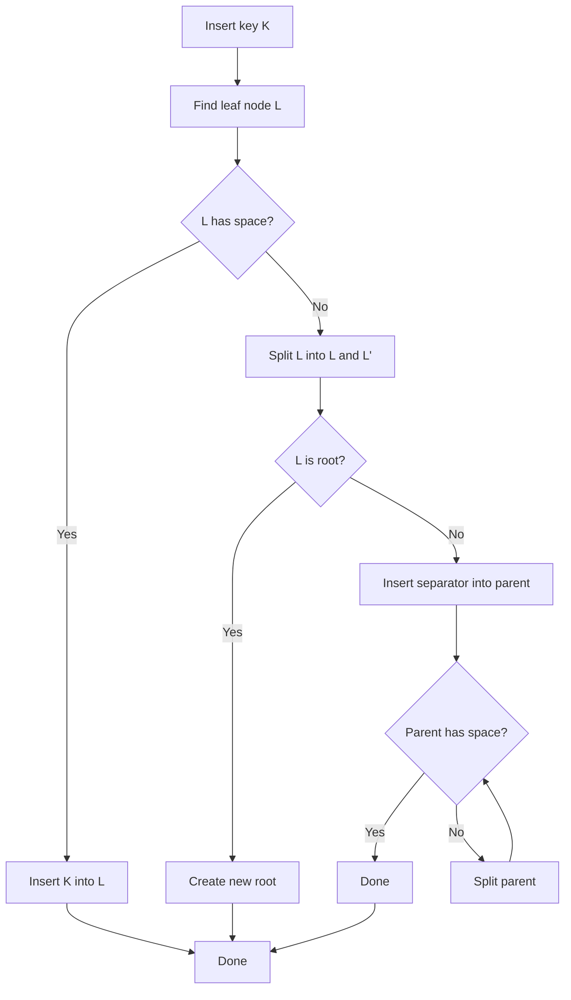
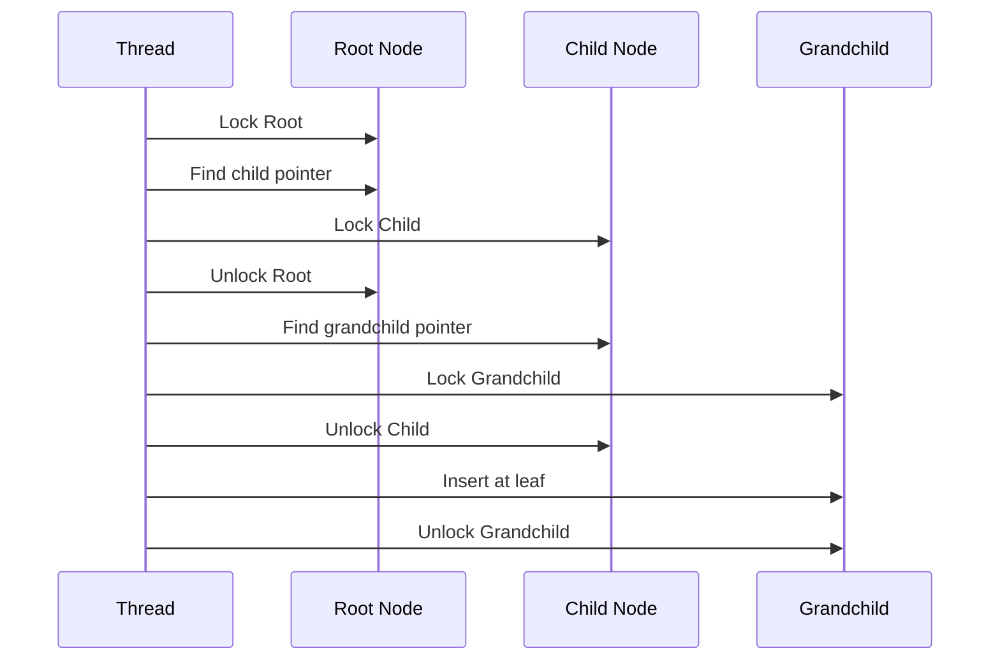
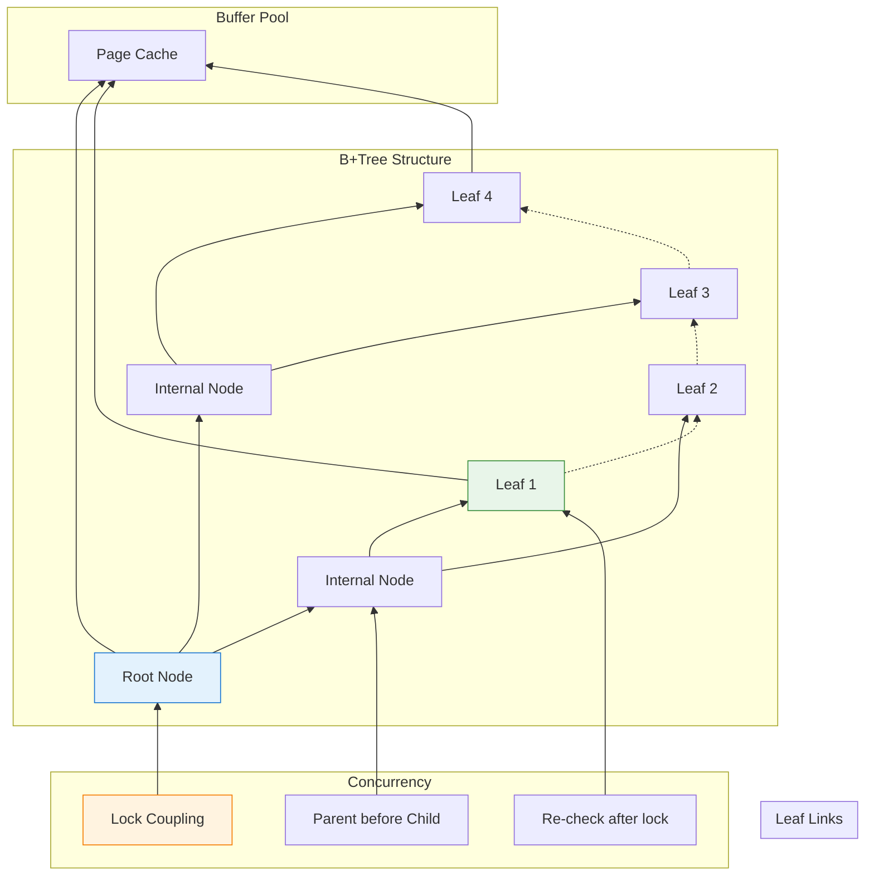

在 [第一部分](/zh-TW/2026/03/Building-PostgreSQL-Compatible-Database-Rust-Page-Storage-Buffer-Pool/) 中，我們建立了基礎：頁面式儲存和緩衝池。但有個問題。

**尋找一列需要完整表掃描：**

```rust
// Without an index: O(n)
for page in table_pages {
    for row in page.rows {
        if row.id == 42 {
            return row;  // Found it! (maybe on the last page)
        }
    }
}
```

對於有 100 萬列的表？那是 100 萬次比較。在磁碟上？**無法接受。**

真正的資料庫使用**索引**在 O(log n) 時間內找到列。PostgreSQL 的預設：**B+Tree**。

今天：在 Rust 中實作執行緒安全的 B+Tree 索引，並與我們的緩衝池整合。是的，併發存取和聽起來一樣困難。

---

## 1 為什麼選擇 B+Tree？

### 替代方案

| 索引類型 | 查詢 | 範圍掃描 | 插入 | 使用場景 |
|------------|--------|------------|--------|----------|
| **雜湊表** | O(1) | ❌ 不支援 | O(1) | 僅精確匹配 |
| **B+Tree** | O(log n) | ✅ 優秀 | O(log n) | 通用 |
| **LSM Tree** | O(log n) | ⚠️ 需要壓縮 | O(1) 平均 | 寫入密集 (RocksDB) |
| **跳躍表** | O(log n) | ✅ 良好 | O(log n) | 記憶體中 (Redis) |

**PostgreSQL 選擇 B+Tree 因為：**

| 原因 | 為什麼重要 |
|--------|----------------|
| **平衡** | 所有葉節點在同一深度——可預測的效能 |
| **範圍查詢** | 葉節點連結——高效的 `WHERE id BETWEEN 10 AND 100` |
| **磁碟友好**  | 高扇出（每個節點數百個鍵）——淺樹 |
| **自我平衡** | 不需要手動重組 |

---

### B+Tree 結構

```
                    ┌─────────────────┐
                    │   Root Node     │  ← Page 0
                    │  [10] │ [50]    │
                    └────────┬────────┘
                             │
            ┌────────────────┼────────────────┐
            │                │                │
            ▼                ▼                ▼
    ┌──────────────┐ ┌──────────────┐ ┌──────────────┐
    │  Node [10]   │ │  Node [50]   │ │  Node [∞]    │  ← Page 1, 2, 3
    │ [1,5,7]│[10] │ │ [20,30]│[50] │ │ [60,80,90]  │
    └──────────────┘ └──────────────┘ └──────────────┘
            │                │                │
            ▼                ▼                ▼
    ┌──────────────┐ ┌──────────────┐ ┌──────────────┐
    │ Leaf [1,5,7] │ │Leaf [10,20,30│ │Leaf [50,60,  │  ← Page 4, 5, 6
    │ → next: 5    │ │ → next: 6    │ │     80,90]   │
    └──────────────┘ └──────────────┘ └──────────────┘
```

**關鍵屬性：**

| 屬性 | Vaultgres 中的值 |
|----------|-------------------|
| **階數 (扇出)** | 每個內部節點約 500 個鍵 (8KB 頁面) |
| **高度** | 10 億個鍵需要 3-4 層 |
| **葉節點** | 包含實際資料指標 (TID) |
| **內部節點** | 僅鍵 + 子指標 (路由) |
| **連結葉子** | 每個葉子指向下一個——無需樹遍歷的範圍掃描 |

---

## 2 節點佈局：將 B+Tree 裝入頁面

### 內部節點結構

每個節點適合一個 8KB 頁面：

```rust
// src/index/btree_node.rs
use crate::storage::page::{Page, PAGE_SIZE, PAGE_HEADER_SIZE};

pub const BTREE_NODE_HEADER_SIZE: usize = 32;
pub const MAX_KEYS_PER_NODE: usize = (PAGE_SIZE - BTREE_NODE_HEADER_SIZE) / 12;  // ~680 keys

#[repr(C)]
pub struct BTreeNodeHeader {
    pub is_leaf: bool,           // 1 byte
    pub key_count: u16,          // 2 bytes
    pub parent_page: u64,        // 8 bytes
    pub right_sibling: u64,      // 8 bytes (for leaf nodes)
    pub level: u16,              // 2 bytes (distance from leaf)
    _padding: [u8; 10],          // Pad to 32 bytes
}

pub struct BTreeNode {
    page: Page,
}

impl BTreeNode {
    pub fn new_leaf() -> Self {
        let mut page = Page::new();
        let header = BTreeNodeHeader {
            is_leaf: true,
            key_count: 0,
            parent_page: 0,
            right_sibling: 0,
            level: 0,
            _padding: [0; 10],
        };
        // Write header to page...
        Self { page }
    }

    pub fn new_internal(level: u16) -> Self {
        let mut page = Page::new();
        let header = BTreeNodeHeader {
            is_leaf: false,
            key_count: 0,
            parent_page: 0,
            right_sibling: 0,
            level,
            _padding: [0; 10],
        };
        Self { page }
    }
}
```

**頁面內的關鍵佈局：**

```
┌─────────────────────────────────────────────────────────────┐
│ PageHeader (24 bytes)                                       │
├─────────────────────────────────────────────────────────────┤
│ BTreeNodeHeader (32 bytes)                                  │
├─────────────────────────────────────────────────────────────┤
│ Keys (variable size, sorted)                                │
├─────────────────────────────────────────────────────────────┤
│ Child Pointers (8 bytes each)                               │
├─────────────────────────────────────────────────────────────┤
│ Free space                                                  │
└─────────────────────────────────────────────────────────────┘
```

---

### 鍵和值格式

對於 `users.id` (整數) 的索引：

```rust
pub struct BTreeKey {
    data: Vec<u8>,  // Serialized key (e.g., 4 bytes for i32)
}

impl BTreeKey {
    pub fn from_i32(value: i32) -> Self {
        Self {
            data: value.to_le_bytes().to_vec(),
        }
    }

    pub fn to_i32(&self) -> i32 {
        i32::from_le_bytes(self.data.try_into().unwrap())
    }
}

// 葉節點值：指向實際列 (TID = Table ID + Page + Offset)
pub struct BTreeValue {
    pub table_id: u64,
    pub page_num: u32,
    pub offset: u16,
}
```

---

## 3 基本 B+Tree 操作

### 搜尋：尋找鍵

```rust
impl BTreeIndex {
    pub fn search(&self, key: &BTreeKey) -> Option<BTreeValue> {
        let mut current_page = self.root_page;

        loop {
            let node = self.get_node(current_page)?;

            if node.is_leaf() {
                // Found leaf—search for key
                return node.search_leaf(key);
            } else {
                // Internal node—find child to descend
                let child_idx = node.find_child_index(key);
                current_page = node.get_child_pointer(child_idx);
            }
        }
    }
}

impl BTreeNode {
    pub fn search_leaf(&self, key: &BTreeKey) -> Option<BTreeValue> {
        // Binary search within leaf
        let idx = self.binary_search(key)?;
        self.get_value(idx)
    }

    fn binary_search(&self, key: &BTreeKey) -> Option<usize> {
        let mut low = 0;
        let mut high = self.key_count();

        while low < high {
            let mid = (low + high) / 2;
            match self.get_key(mid).cmp(key) {
                std::cmp::Ordering::Equal => return Some(mid),
                std::cmp::Ordering::Less => low = mid + 1,
                std::cmp::Ordering::Greater => high = mid,
            }
        }

        None
    }
}
```

**複雜度：** O(log_f n)，其中 f = 扇出 (~500)。對於 10 億個鍵：**約 4 次頁面存取。**

---

### 插入：困難的部分

插入是 B+Tree 變得複雜的地方：



**逐步範例：**

```
Initial state (order = 3 for simplicity):
┌─────────────────┐
│   Root: [50]    │
└────────┬────────┘
         │
    ┌────┴────┐
    │         │
    ▼         ▼
┌───────┐ ┌───────┐
│[10,30]│ │[60,80]│  ← Leaf full!
└───────┘ └───────┘

Insert 70:

1. Find leaf: [60,80]
2. Leaf is full—split!
3. New leaves: [60] and [70,80]
4. Promote 70 to parent

Result:
┌───────────────────┐
│  Root: [50]│[70]  │
└─────────┬─────────┘
          │
    ┌─────┼─────┐
    │     │     │
    ▼     ▼     ▼
┌────┐ ┌────┐ ┌──────┐
│[10]│ │[30]│ │[60,80│  ← Wait, that's wrong...
└────┘ └────┘ └──────┘
```

**正確的分裂：**

```rust
impl BTreeNode {
    pub fn split(&mut self) -> (BTreeNode, BTreeKey) {
        let mid = self.key_count() / 2;
        let separator = self.get_key(mid);

        // Create new sibling node
        let mut new_node = BTreeNode::new_leaf();

        // Move half the keys to new node
        for i in mid..self.key_count() {
            new_node.insert(self.get_key(i), self.get_value(i));
        }

        // Truncate original node
        self.truncate(mid);

        // Set sibling pointers
        new_node.set_right_sibling(self.right_sibling());
        self.set_right_sibling(new_node.page_id());

        (new_node, separator)
    }
}
```

---

## 4 併發存取：真正的挑戰

### 問題：鎖定樹

**天真方法：鎖定整個樹**

```rust
// ❌ Terrible performance
pub fn insert(&self, key: BTreeKey, value: BTreeValue) {
    let _guard = self.global_lock.lock().unwrap();
    // ... do insert ...
}
```

**結果：** 一次一個操作。違背了資料庫的目的。

---

### 更好：鎖耦合 (Crabbing)

**鎖耦合：** 在遍歷期間最多保持兩個相鄰節點的鎖。



**Rust 實作：**

```rust
// src/index/btree_concurrent.rs
use std::sync::Arc;
use parking_lot::RwLock;  // Better than std::sync::RwLock

pub struct BTreeIndex {
    root_page: u64,
    buffer_pool: Arc<BufferPool>,
    // Each node is protected by its own lock
    node_locks: Arc<DashMap<u64, Arc<RwLock<()>>>>,  // page_id → lock
}

impl BTreeIndex {
    pub fn insert(&self, key: BTreeKey, value: BTreeValue) -> Result<(), BTreeError> {
        let mut current_page = self.root_page;
        let mut parent_lock: Option<Arc<RwLock<()>>> = None;
        let mut current_lock = self.get_node_lock(current_page);

        loop {
            // Acquire read lock on current node
            let read_guard = current_lock.read();

            let node = self.get_node(current_page)?;

            if node.is_leaf() {
                // Upgrade to write lock
                drop(read_guard);
                let write_guard = current_lock.write();

                // Check if split needed
                if node.is_full() {
                    // Need parent lock for split
                    if let Some(parent_lock) = parent_lock {
                        let _parent_guard = parent_lock.write();
                        self.split_leaf(current_page, parent_lock)?;
                    } else {
                        // Splitting root
                        self.split_root(current_page)?;
                    }
                }

                // Insert into leaf
                self.insert_into_leaf(current_page, key, value)?;
                return Ok(());
            } else {
                // Internal node—descend
                let child_idx = node.find_child_index(&key);
                let child_page = node.get_child_pointer(child_idx);

                // Lock child before releasing current (lock coupling)
                let child_lock = self.get_node_lock(child_page);
                let _child_read = child_lock.read();

                // Release current lock
                drop(read_guard);
                drop(current_lock);

                // Move down
                parent_lock = Some(child_lock.clone());
                current_lock = child_lock;
                current_page = child_page;
            }
        }
    }
}
```

!!! warning "⚠️ 鎖升級死結"
    **問題：** 在持有其他鎖的同時從讀鎖升級到寫鎖可能會死結。

    **Vaultgres 中的解決方案：** 使用 `parking_lot::RwLock` 搭配 `upgradable_read()` 或釋放並重新獲取（帶有樂觀重試）。

---

### 分裂噩夢

**情境：兩個執行緒分裂同一個節點**

```
Thread A:                    Thread B:
1. Lock parent P
2. Lock leaf L
3. Split L → L1, L2
4. Insert separator in P
                           5. Lock parent P (waits!)
                           5. Lock leaf L (already split!)
                           6. ??? CORRUPTION ???
```

**解決方案：獲取鎖後檢查條件**

```rust
pub fn split_leaf(&self, leaf_page: u64, parent_lock: Arc<RwLock<()>>) -> Result<(), BTreeError> {
    let parent_guard = parent_lock.write();

    // Re-check: is this leaf still full?
    let leaf = self.get_node(leaf_page)?;
    if !leaf.is_full() {
        // Another thread already split—nothing to do!
        return Ok(());
    }

    // Proceed with split...
}
```

---

## 5 範圍掃描：利用連結葉子

### 樹遍歷的問題

對於 `SELECT * FROM users WHERE id BETWEEN 10 AND 100`：

**沒有葉子連結：** 必須為每個鍵遍歷樹。O(n log n)。

**有葉子連結：** 找到起始鍵一次，然後掃描葉子。O(log n + k)。

---

### 實作

```rust
pub struct BTreeScan {
    current_leaf: u64,
    current_idx: usize,
    end_key: BTreeKey,
    buffer_pool: Arc<BufferPool>,
}

impl Iterator for BTreeScan {
    type Item = BTreeValue;

    fn next(&mut self) -> Option<Self::Item> {
        loop {
            let leaf = self.get_leaf(self.current_leaf)?;

            if self.current_idx < leaf.key_count() {
                let key = leaf.get_key(self.current_idx);

                // Check if we've passed the end
                if key > &self.end_key {
                    return None;
                }

                let value = leaf.get_value(self.current_idx);
                self.current_idx += 1;
                return Some(value);
            } else {
                // Move to next leaf
                self.current_leaf = leaf.right_sibling();
                self.current_idx = 0;

                if self.current_leaf == 0 {
                    return None;  // End of tree
                }
            }
        }
    }
}
```

**使用：**

```rust
let scan = index.scan_range(BTreeKey::from_i32(10), BTreeKey::from_i32(100));
for value in scan {
    let row = buffer_pool.get_page(value.page_num);
    // Process row...
}
```

---

## 6 與緩衝池整合

### 頁面類型

緩衝池現在處理多種頁面類型：

```rust
// src/storage/page_type.rs
#[derive(Debug, Clone, Copy, PartialEq)]
pub enum PageType {
    Heap,       // Table data (from Part 1)
    BTreeLeaf,  // B+Tree leaf node
    BTreeInternal,  // B+Tree internal node
    BTreeRoot,  // B+Tree root
}

impl Page {
    pub fn page_type(&self) -> PageType {
        // Read from page header...
    }
}
```

---

### 記憶體壓力

**問題：** 索引掃描可能會淘汰熱門資料頁面。

```
1. Index scan touches 1000 leaf pages
2. LRU evicts hot table pages to make room
3. Query needs table pages—disk I/O!
```

**解決方案：帶使用提示的時鐘掃描**

```rust
// src/storage/buffer_pool.rs
pub struct BufferFrame {
    // ... existing fields ...
    pub usage_hint: UsageHint,  // New!
}

#[derive(Debug, Clone, Copy)]
pub enum UsageHint {
    Normal,      // Standard LRU
    IndexScan,   // May be evicted sooner
    Pinned,      // Keep in memory (hot table)
}

impl BufferPool {
    pub fn get_page_with_hint(&self, page_id: u64, hint: UsageHint) -> Option<Arc<Mutex<Page>>> {
        // ... set hint on frame ...
    }
}
```

---

## 7 用 Rust 建構的挑戰

### 挑戰 1：自我參考結構

**問題：** 節點需要參考其父節點/子節點，但 Rust 的借用檢查器討厭這個。

```rust
// ❌ Doesn't compile
pub struct BTreeNode {
    parent: Option<&BTreeNode>,  // Reference to parent
    children: Vec<&BTreeNode>,   // References to children
}
```

**解決方案：頁面 ID 作為間接參考**

```rust
// ✅ Works
pub struct BTreeNode {
    parent_page: Option<u64>,  // Page ID, not reference
    children: Vec<u64>,        // Page IDs
}

// Resolve page ID to node when needed
let parent = buffer_pool.get_page(self.parent_page?);
```

---

### 挑戰 2：鎖順序

**問題：** 如果執行緒以不同順序獲取鎖則會死結。

```
Thread A: Lock page 5, then page 10
Thread B: Lock page 10, then page 5  ← Deadlock!
```

**解決方案：始終以一致順序鎖定（父節點先於子節點）**

```rust
// Lock coupling enforces this naturally
pub fn descend(&self, parent_page: u64, child_page: u64) {
    let parent_lock = self.get_lock(parent_page);
    let child_lock = self.get_lock(child_page);

    // Always acquire parent first
    let _parent = parent_lock.read();
    let _child = child_lock.read();  // Safe—consistent order
}
```

---

### 挑戰 3：帶 WAL 的分裂

**問題：** 分裂會觸及多個頁面。如何使其原子化？

```rust
// ❌ Not atomic
self.write_node(left);
self.write_node(right);  // ← Crash here = corruption!
self.update_parent();
```

**解決方案：在修改頁面前寫入 WAL**

```rust
pub fn split_node(&self, node_page: u64) -> Result<(), BTreeError> {
    // 1. Write WAL record describing the split
    let lsn = self.wal.log_split(node_page, left_data, right_data)?;
    self.wal.flush()?;  // Durable before proceeding

    // 2. Now safe to modify pages
    self.write_node(left);
    self.write_node(right);
    self.update_parent();

    // 3. Log completion
    self.wal.log_split_complete(lsn)?;

    Ok(())
}
```

---

## 8 AI 如何加速這項工作

### AI 做對了什么

| 任務 | AI 貢獻 |
|------|-----------------|
| **鎖耦合演算法** | 用偽程式碼解釋模式 |
| **分裂邏輯** | 產生正確的鍵重新分配 |
| **Rust 模式** | 建議使用 `parking_lot` 而非 `std::sync` |
| **除錯協助** | 「這個死結發生是因為...」 |

---

### AI 做錯了什么

| 問題 | 發生什麼事 |
|-------|---------------|
| **初始鎖升級** | 建議使用 `RwLock::upgrade()` 但在 std 中不存在 |
| **頁面佈局** | 初稿將鍵和值交錯（快取不友好） |
| **分裂邊界情況** | 忽略了「根分裂」特殊情況 |

**模式：** AI 提供 80% 的解決方案。剩餘 20% 需要深入理解。

---

### 範例：除錯競爭條件

**我問 AI 的問題：**

> "兩個執行緒可以同時分裂同一個葉子，導致重複鍵。PostgreSQL 如何防止這種情況？"

**我學到的：**

1. PostgreSQL 在緩衝釘選上使用**基於閂鎖的同步**
2. 分裂前，檢查分裂是否已經發生
3. 使用**短期鎖**，每層後釋放

**結果：** 在 `split_leaf()` 中添加了重新檢查邏輯：

```rust
// Re-check after acquiring all locks
if !leaf.is_full() {
    return Ok(());  // Another thread handled it
}
```

---

## 總結：B+Tree 一張圖



**關鍵要點：**

| 概念 | 為什麼重要 |
|---------|----------------|
| **B+Tree** | O(log n) 查詢，高效範圍掃描 |
| **鎖耦合** | 細粒度鎖定無死結 |
| **葉子連結** | 無需樹遍歷的範圍掃描 |
| **WAL 整合** | 原子分裂，崩潰恢復 |
| **Rust 挑戰** | 借用檢查器、鎖順序、自我參考結構 |

---

**進一步閱讀：**

- PostgreSQL Source: [`src/backend/access/nbtree/`](https://github.com/postgres/postgres/tree/master/src/backend/access/nbtree)
- "The Art of Computer Programming, Vol. 3" by Knuth (B-Trees)
- "Database Management Systems" by Ramakrishnan (Ch. 10: Tree-Structured Indexing)
- "Efficient and Safe B+Tree Implementation" by PostgreSQL contributors
- Vaultgres Repository: [github.com/neoalienson/Vaultgres](https://github.com/neoalienson/Vaultgres)
