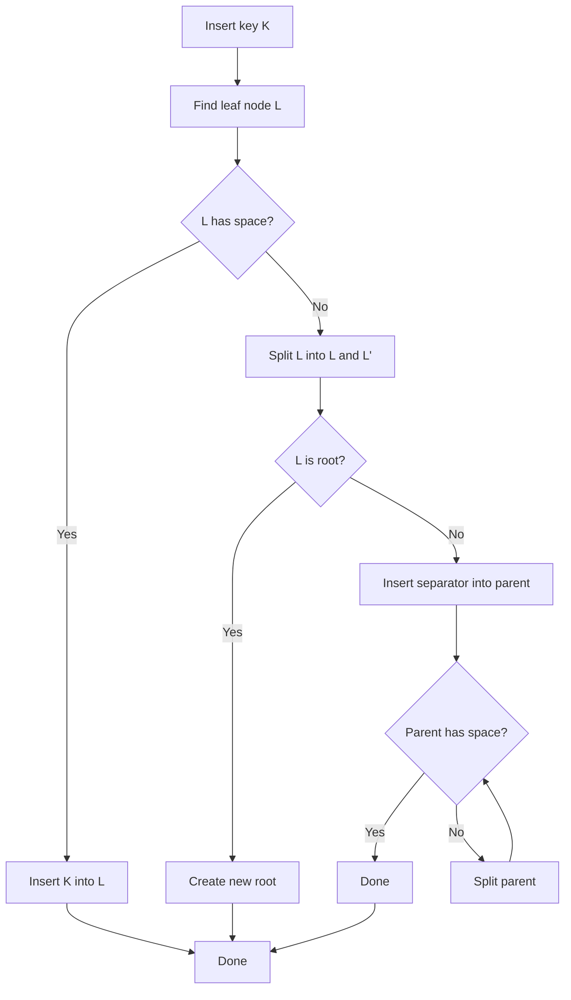
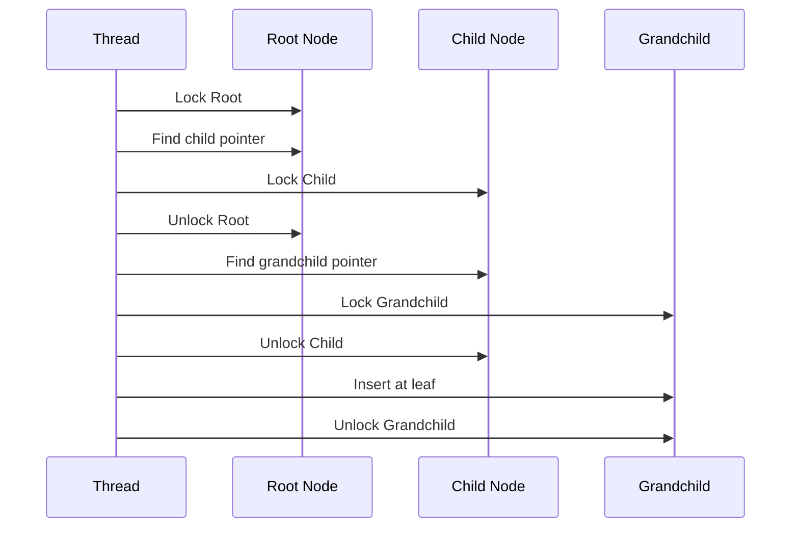
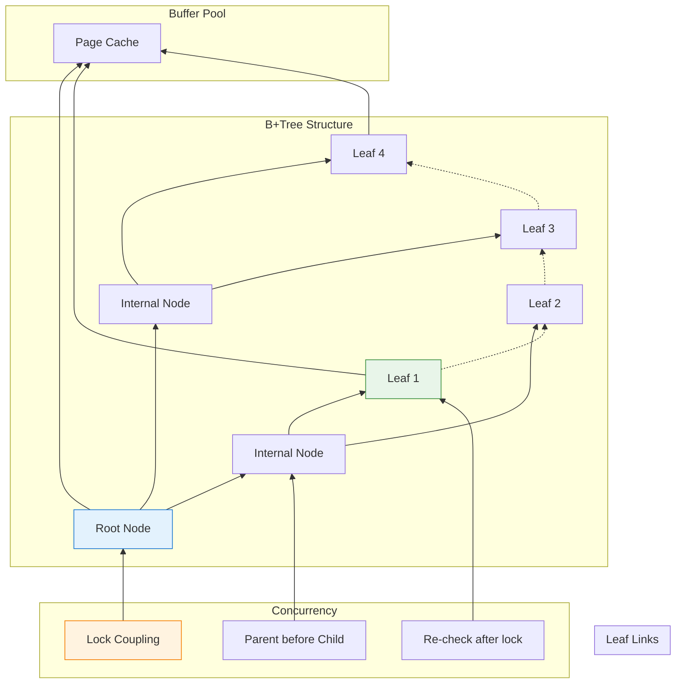

In [Part 1](/2026/03/Building-PostgreSQL-Compatible-Database-Rust-Page-Storage-Buffer-Pool/), we built the foundation: page-based storage and a buffer pool. But there's a problem.

**Finding a row requires a full table scan:**

```rust
// Without an index: O(n)
for page in table_pages {
    for row in page.rows {
        if row.id == 42 {
            return row;  // Found it! (maybe on the last page)
        }
    }
}
```

For a table with 1 million rows? That's 1 million comparisons. On disk? **Unacceptable.**

Real databases use **indexes** to find rows in O(log n) time. PostgreSQL's default: **B+Tree**.

Today: implementing a thread-safe B+Tree index in Rust, integrated with our buffer pool. And yes, concurrent access is as hard as it sounds.

---

## 1 Why B+Tree?

### The Alternatives

| Index Type | Lookup | Range Scan | Insert | Use Case |
|------------|--------|------------|--------|----------|
| **Hash Table** | O(1) | ❌ Not supported | O(1) | Exact match only |
| **B+Tree** | O(log n) | ✅ Excellent | O(log n) | General purpose |
| **LSM Tree** | O(log n) | ⚠️ Compaction needed | O(1) amortized | Write-heavy (RocksDB) |
| **Skip List** | O(log n) | ✅ Good | O(log n) | In-memory (Redis) |

**PostgreSQL chose B+Tree because:**

| Reason | Why It Matters |
|--------|----------------|
| **Balanced** | All leaf nodes at same depth—predictable performance |
| **Range queries** | Leaf nodes linked—efficient `WHERE id BETWEEN 10 AND 100` |
| **Disk-friendly** | High fanout (100s of keys per node)—shallow trees |
| **Self-balancing** | No manual reorganization needed |

---

### B+Tree Structure

```
                    ┌─────────────────┐
                    │   Root Node     │  ← Page 0
                    │  [10] │ [50]    │
                    └────────┬────────┘
                             │
            ┌────────────────┼────────────────┐
            │                │                │
            ▼                ▼                ▼
    ┌──────────────┐ ┌──────────────┐ ┌──────────────┐
    │  Node [10]   │ │  Node [50]   │ │  Node [∞]    │  ← Page 1, 2, 3
    │ [1,5,7]│[10] │ │ [20,30]│[50] │ │ [60,80,90]   │
    └──────────────┘ └──────────────┘ └──────────────┘
            │                │                │
            ▼                ▼                ▼
    ┌──────────────┐ ┌──────────────┐ ┌──────────────┐
    │ Leaf [1,5,7] │ │Leaf [10,20,30│ │Leaf [50,60,  │  ← Page 4, 5, 6
    │ → next: 5    │ │ → next: 6    │ │     80,90]   │
    └──────────────┘ └──────────────┘ └──────────────┘
```

**Key properties:**

| Property | Value in Vaultgres |
|----------|-------------------|
| **Order (fanout)** | ~500 keys per internal node (8KB page) |
| **Height** | 3-4 levels for 1 billion keys |
| **Leaf nodes** | Contain actual data pointers (TIDs) |
| **Internal nodes** | Only keys + child pointers (routing) |
| **Linked leaves** | Each leaf points to next—range scans without tree traversal |

---

## 2 Node Layout: Fitting B+Tree into Pages

### Internal Node Structure

Each node fits in one 8KB page:

```rust
// src/index/btree_node.rs
use crate::storage::page::{Page, PAGE_SIZE, PAGE_HEADER_SIZE};

pub const BTREE_NODE_HEADER_SIZE: usize = 32;
pub const MAX_KEYS_PER_NODE: usize = (PAGE_SIZE - BTREE_NODE_HEADER_SIZE) / 12;  // ~680 keys

#[repr(C)]
pub struct BTreeNodeHeader {
    pub is_leaf: bool,           // 1 byte
    pub key_count: u16,          // 2 bytes
    pub parent_page: u64,        // 8 bytes
    pub right_sibling: u64,      // 8 bytes (for leaf nodes)
    pub level: u16,              // 2 bytes (distance from leaf)
    _padding: [u8; 10],          // Pad to 32 bytes
}

pub struct BTreeNode {
    page: Page,
}

impl BTreeNode {
    pub fn new_leaf() -> Self {
        let mut page = Page::new();
        let header = BTreeNodeHeader {
            is_leaf: true,
            key_count: 0,
            parent_page: 0,
            right_sibling: 0,
            level: 0,
            _padding: [0; 10],
        };
        // Write header to page...
        Self { page }
    }

    pub fn new_internal(level: u16) -> Self {
        let mut page = Page::new();
        let header = BTreeNodeHeader {
            is_leaf: false,
            key_count: 0,
            parent_page: 0,
            right_sibling: 0,
            level,
            _padding: [0; 10],
        };
        Self { page }
    }
}
```

**Key layout inside a page:**

```
┌─────────────────────────────────────────────────────────────┐
│ PageHeader (24 bytes)                                       │
├─────────────────────────────────────────────────────────────┤
│ BTreeNodeHeader (32 bytes)                                  │
├─────────────────────────────────────────────────────────────┤
│ Keys (variable size, sorted)                                │
├─────────────────────────────────────────────────────────────┤
│ Child Pointers (8 bytes each)                               │
├─────────────────────────────────────────────────────────────┤
│ Free space                                                  │
└─────────────────────────────────────────────────────────────┘
```

---

### Key and Value Format

For an index on `users.id` (integer):

```rust
pub struct BTreeKey {
    data: Vec<u8>,  // Serialized key (e.g., 4 bytes for i32)
}

impl BTreeKey {
    pub fn from_i32(value: i32) -> Self {
        Self {
            data: value.to_le_bytes().to_vec(),
        }
    }

    pub fn to_i32(&self) -> i32 {
        i32::from_le_bytes(self.data.try_into().unwrap())
    }
}

// Leaf node value: points to actual row (TID = Table ID + Page + Offset)
pub struct BTreeValue {
    pub table_id: u64,
    pub page_num: u32,
    pub offset: u16,
}
```

---

## 3 Basic B+Tree Operations

### Search: Finding a Key

```rust
impl BTreeIndex {
    pub fn search(&self, key: &BTreeKey) -> Option<BTreeValue> {
        let mut current_page = self.root_page;

        loop {
            let node = self.get_node(current_page)?;

            if node.is_leaf() {
                // Found leaf—search for key
                return node.search_leaf(key);
            } else {
                // Internal node—find child to descend
                let child_idx = node.find_child_index(key);
                current_page = node.get_child_pointer(child_idx);
            }
        }
    }
}

impl BTreeNode {
    pub fn search_leaf(&self, key: &BTreeKey) -> Option<BTreeValue> {
        // Binary search within leaf
        let idx = self.binary_search(key)?;
        self.get_value(idx)
    }

    fn binary_search(&self, key: &BTreeKey) -> Option<usize> {
        let mut low = 0;
        let mut high = self.key_count();

        while low < high {
            let mid = (low + high) / 2;
            match self.get_key(mid).cmp(key) {
                std::cmp::Ordering::Equal => return Some(mid),
                std::cmp::Ordering::Less => low = mid + 1,
                std::cmp::Ordering::Greater => high = mid,
            }
        }

        None
    }
}
```

**Complexity:** O(log_f n) where f = fanout (~500). For 1 billion keys: **~4 page accesses.**

---

### Insert: The Hard Part

Insertion is where B+Trees get complicated:



**Step-by-step example:**

```
Initial state (order = 3 for simplicity):
┌─────────────────┐
│   Root: [50]    │
└────────┬────────┘
         │
    ┌────┴────┐
    │         │
    ▼         ▼
┌───────┐ ┌───────┐
│[10,30]│ │[60,80]│  ← Leaf full!
└───────┘ └───────┘

Insert 70:

1. Find leaf: [60,80]
2. Leaf is full—split!
3. New leaves: [60] and [70,80]
4. Promote 70 to parent

Result:
┌───────────────────┐
│  Root: [50]│[70]  │
└─────────┬─────────┘
          │
    ┌─────┼─────┐
    │     │     │
    ▼     ▼     ▼
┌────┐ ┌────┐ ┌──────┐
│[10]│ │[30]│ │[60,80│  ← Wait, that's wrong...
└────┘ └────┘ └──────┘
```

**Correct split:**

```rust
impl BTreeNode {
    pub fn split(&mut self) -> (BTreeNode, BTreeKey) {
        let mid = self.key_count() / 2;
        let separator = self.get_key(mid);

        // Create new sibling node
        let mut new_node = BTreeNode::new_leaf();

        // Move half the keys to new node
        for i in mid..self.key_count() {
            new_node.insert(self.get_key(i), self.get_value(i));
        }

        // Truncate original node
        self.truncate(mid);

        // Set sibling pointers
        new_node.set_right_sibling(self.right_sibling());
        self.set_right_sibling(new_node.page_id());

        (new_node, separator)
    }
}
```

---

## 4 Concurrent Access: The Real Challenge

### The Problem: Locking a Tree

**Naive approach: lock the entire tree**

```rust
// ❌ Terrible performance
pub fn insert(&self, key: BTreeKey, value: BTreeValue) {
    let _guard = self.global_lock.lock().unwrap();
    // ... do insert ...
}
```

**Result:** One operation at a time. Defeats the purpose of a database.

---

### Better: Lock Coupling (Crabbing)

**Lock coupling:** Hold locks on at most two adjacent nodes during traversal.



**Rust implementation:**

```rust
// src/index/btree_concurrent.rs
use std::sync::Arc;
use parking_lot::RwLock;  // Better than std::sync::RwLock

pub struct BTreeIndex {
    root_page: u64,
    buffer_pool: Arc<BufferPool>,
    // Each node is protected by its own lock
    node_locks: Arc<DashMap<u64, Arc<RwLock<()>>>>,  // page_id → lock
}

impl BTreeIndex {
    pub fn insert(&self, key: BTreeKey, value: BTreeValue) -> Result<(), BTreeError> {
        let mut current_page = self.root_page;
        let mut parent_lock: Option<Arc<RwLock<()>>> = None;
        let mut current_lock = self.get_node_lock(current_page);

        loop {
            // Acquire read lock on current node
            let read_guard = current_lock.read();

            let node = self.get_node(current_page)?;

            if node.is_leaf() {
                // Upgrade to write lock
                drop(read_guard);
                let write_guard = current_lock.write();

                // Check if split needed
                if node.is_full() {
                    // Need parent lock for split
                    if let Some(parent_lock) = parent_lock {
                        let _parent_guard = parent_lock.write();
                        self.split_leaf(current_page, parent_lock)?;
                    } else {
                        // Splitting root
                        self.split_root(current_page)?;
                    }
                }

                // Insert into leaf
                self.insert_into_leaf(current_page, key, value)?;
                return Ok(());
            } else {
                // Internal node—descend
                let child_idx = node.find_child_index(&key);
                let child_page = node.get_child_pointer(child_idx);

                // Lock child before releasing current (lock coupling)
                let child_lock = self.get_node_lock(child_page);
                let _child_read = child_lock.read();

                // Release current lock
                drop(read_guard);
                drop(current_lock);

                // Move down
                parent_lock = Some(child_lock.clone());
                current_lock = child_lock;
                current_page = child_page;
            }
        }
    }
}
```

!!! warning "⚠️ Lock Upgrade Deadlock"
    **Problem:** Upgrading from read lock to write lock while holding other locks can deadlock.

    **Solution in Vaultgres:** Use `parking_lot::RwLock` with `upgradable_read()` or release and re-acquire (with optimistic retry).

---

### The Split Nightmare

**Scenario: Two threads split the same node**

```
Thread A:                    Thread B:
1. Lock parent P
2. Lock leaf L
3. Split L → L1, L2
4. Insert separator in P
                           5. Lock parent P (waits!)
                           5. Lock leaf L (already split!)
                           6. ??? CORRUPTION ???
```

**Solution: Check conditions after acquiring locks**

```rust
pub fn split_leaf(&self, leaf_page: u64, parent_lock: Arc<RwLock<()>>) -> Result<(), BTreeError> {
    let parent_guard = parent_lock.write();

    // Re-check: is this leaf still full?
    let leaf = self.get_node(leaf_page)?;
    if !leaf.is_full() {
        // Another thread already split—nothing to do!
        return Ok(());
    }

    // Proceed with split...
}
```

---

## 5 Range Scans: Leveraging Linked Leaves

### The Problem with Tree Traversal

For `SELECT * FROM users WHERE id BETWEEN 10 AND 100`:

**Without leaf links:** Must traverse tree for each key. O(n log n).

**With leaf links:** Find start key once, then scan leaves. O(log n + k).

---

### Implementation

```rust
pub struct BTreeScan {
    current_leaf: u64,
    current_idx: usize,
    end_key: BTreeKey,
    buffer_pool: Arc<BufferPool>,
}

impl Iterator for BTreeScan {
    type Item = BTreeValue;

    fn next(&mut self) -> Option<Self::Item> {
        loop {
            let leaf = self.get_leaf(self.current_leaf)?;

            if self.current_idx < leaf.key_count() {
                let key = leaf.get_key(self.current_idx);

                // Check if we've passed the end
                if key > &self.end_key {
                    return None;
                }

                let value = leaf.get_value(self.current_idx);
                self.current_idx += 1;
                return Some(value);
            } else {
                // Move to next leaf
                self.current_leaf = leaf.right_sibling();
                self.current_idx = 0;

                if self.current_leaf == 0 {
                    return None;  // End of tree
                }
            }
        }
    }
}
```

**Usage:**

```rust
let scan = index.scan_range(BTreeKey::from_i32(10), BTreeKey::from_i32(100));
for value in scan {
    let row = buffer_pool.get_page(value.page_num);
    // Process row...
}
```

---

## 6 Integration with Buffer Pool

### Page Types

The buffer pool now handles multiple page types:

```rust
// src/storage/page_type.rs
#[derive(Debug, Clone, Copy, PartialEq)]
pub enum PageType {
    Heap,       // Table data (from Part 1)
    BTreeLeaf,  // B+Tree leaf node
    BTreeInternal,  // B+Tree internal node
    BTreeRoot,  // B+Tree root
}

impl Page {
    pub fn page_type(&self) -> PageType {
        // Read from page header...
    }
}
```

---

### Memory Pressure

**Problem:** Index scans can evict hot data pages.

```
1. Index scan touches 1000 leaf pages
2. LRU evicts hot table pages to make room
3. Query needs table pages—disk I/O!
```

**Solution: Clock-sweep with usage hints**

```rust
// src/storage/buffer_pool.rs
pub struct BufferFrame {
    // ... existing fields ...
    pub usage_hint: UsageHint,  // New!
}

#[derive(Debug, Clone, Copy)]
pub enum UsageHint {
    Normal,      // Standard LRU
    IndexScan,   // May be evicted sooner
    Pinned,      // Keep in memory (hot table)
}

impl BufferPool {
    pub fn get_page_with_hint(&self, page_id: u64, hint: UsageHint) -> Option<Arc<Mutex<Page>>> {
        // ... set hint on frame ...
    }
}
```

---

## 7 Challenges Building in Rust

### Challenge 1: Self-Referential Structures

**Problem:** Nodes need to reference their parent/children, but Rust's borrow checker hates this.

```rust
// ❌ Doesn't compile
pub struct BTreeNode {
    parent: Option<&BTreeNode>,  // Reference to parent
    children: Vec<&BTreeNode>,   // References to children
}
```

**Solution: Page IDs as indirect references**

```rust
// ✅ Works
pub struct BTreeNode {
    parent_page: Option<u64>,  // Page ID, not reference
    children: Vec<u64>,        // Page IDs
}

// Resolve page ID to node when needed
let parent = buffer_pool.get_page(self.parent_page?);
```

---

### Challenge 2: Lock Ordering

**Problem:** Deadlock if threads acquire locks in different order.

```
Thread A: Lock page 5, then page 10
Thread B: Lock page 10, then page 5  ← Deadlock!
```

**Solution: Always lock in consistent order (parent before child)**

```rust
// Lock coupling enforces this naturally
pub fn descend(&self, parent_page: u64, child_page: u64) {
    let parent_lock = self.get_lock(parent_page);
    let child_lock = self.get_lock(child_page);

    // Always acquire parent first
    let _parent = parent_lock.read();
    let _child = child_lock.read();  // Safe—consistent order
}
```

---

### Challenge 3: Splitting with WAL

**Problem:** A split touches multiple pages. How to make it atomic?

```rust
// ❌ Not atomic
self.write_node(left);
self.write_node(right);  // ← Crash here = corruption!
self.update_parent();
```

**Solution: WAL before modifying pages**

```rust
pub fn split_node(&self, node_page: u64) -> Result<(), BTreeError> {
    // 1. Write WAL record describing the split
    let lsn = self.wal.log_split(node_page, left_data, right_data)?;
    self.wal.flush()?;  // Durable before proceeding

    // 2. Now safe to modify pages
    self.write_node(left);
    self.write_node(right);
    self.update_parent();

    // 3. Log completion
    self.wal.log_split_complete(lsn)?;

    Ok(())
}
```

---

## 8 How AI Accelerated This

### What AI Got Right

| Task | AI Contribution |
|------|-----------------|
| **Lock coupling algorithm** | Explained the pattern with pseudocode |
| **Split logic** | Generated correct key redistribution |
| **Rust patterns** | Suggested `parking_lot` over `std::sync` |
| **Debugging help** | "This deadlock happens because..." |

---

### What AI Got Wrong

| Issue | What Happened |
|-------|---------------|
| **Initial lock upgrade** | Suggested `RwLock::upgrade()` which doesn't exist in std |
| **Page layout** | First draft had keys and values interleaved (cache-unfriendly) |
| **Split edge cases** | Missed the "root split" special case |

**Pattern:** AI provides 80% of the solution. The remaining 20% requires deep understanding.

---

### Example: Debugging a Race Condition

**My question to AI:**

> "Two threads can split the same leaf simultaneously, causing duplicate keys. How does PostgreSQL prevent this?"

**What I learned:**

1. PostgreSQL uses **latch-based synchronization** on buffer pins
2. Before splitting, check if the split has already happened
3. Use **short-term locks** released after each level

**Result:** Added the re-check logic in `split_leaf()`:

```rust
// Re-check after acquiring all locks
if !leaf.is_full() {
    return Ok(());  // Another thread handled it
}
```

---

## Summary: B+Tree in One Diagram



**Key Takeaways:**

| Concept | Why It Matters |
|---------|----------------|
| **B+Tree** | O(log n) lookups, efficient range scans |
| **Lock coupling** | Fine-grained locking without deadlocks |
| **Leaf links** | Range scans without tree traversal |
| **WAL integration** | Atomic splits, crash recovery |
| **Rust challenges** | Borrow checker, lock ordering, self-referential structs |

---

**Further Reading:**

- PostgreSQL Source: [`src/backend/access/nbtree/`](https://github.com/postgres/postgres/tree/master/src/backend/access/nbtree)
- "The Art of Computer Programming, Vol. 3" by Knuth (B-Trees)
- "Database Management Systems" by Ramakrishnan (Ch. 10: Tree-Structured Indexing)
- "Efficient and Safe B+Tree Implementation" by PostgreSQL contributors
- Vaultgres Repository: [github.com/neoalienson/Vaultgres](https://github.com/neoalienson/Vaultgres)

