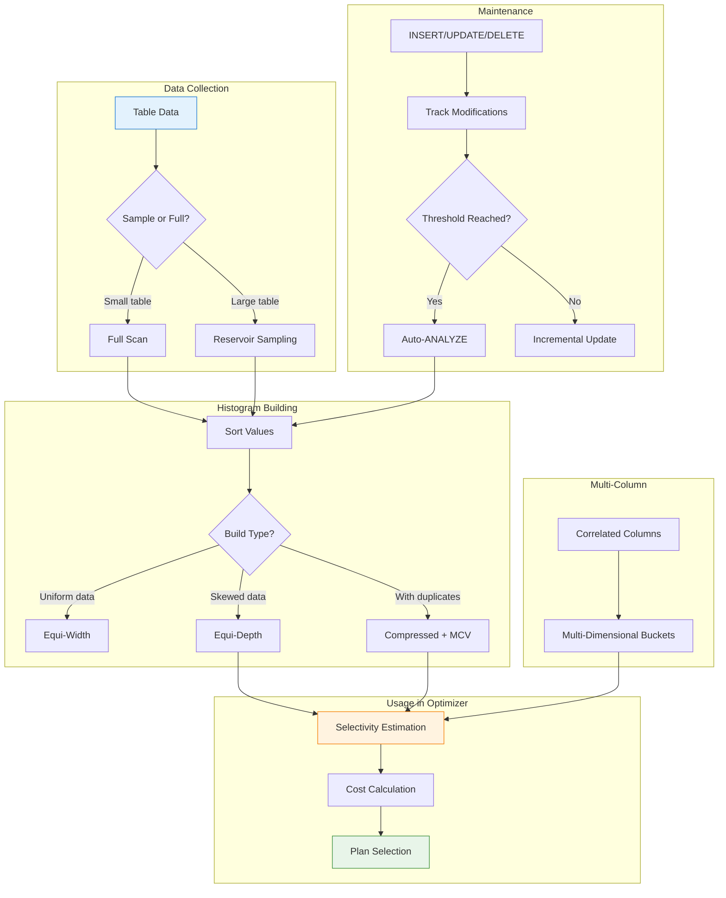

在 [第七部分](/zh-TW/2026/03/Database-Rust-Query-Optimizer/) 中，我們建構了一個基於成本的最佳化器。但有個問題。

**我們的選擇性估計是猜測：**

```rust
// From Part 7 - simplified (wrong!) estimates
fn estimate_selectivity(&self, expr: &Expression) -> f64 {
    match expr {
        BinaryOperator::Eq => 0.01,   // Always 1%? Wrong!
        BinaryOperator::Gt => 0.33,   // Always 33%? Wrong!
        _ => 0.5,                      // Always 50%? Very wrong!
    }
}
```

**真實資料不是均勻的：**

```
User balances in our database:

Balance Distribution:
$0-100:     ████████████████████████████████████████  80% of users
$100-1K:    ████████                                   15% of users
$1K-10K:    ██                                          4% of users
$10K-100K:  █                                           1% of users

Query: SELECT * FROM users WHERE balance > 100

Our estimate: 33% of rows (using fixed 0.33)
Actual: 20% of rows
→ Wrong plan chosen! Index scan would be better than seq scan.
```

**解決方案：** 捕捉實際資料分佈的直方圖。

今天：在 Rust 中實作直方圖統計以進行準確的選擇性估計。

---

## 1 為什麼直方圖很重要

### 均勻分佈謬誤

**沒有直方圖，最佳化器假設均勻分佈：**

```sql
-- Table: users (1,000,000 rows)
-- Column: account_type ('free', 'premium', 'enterprise')

-- Reality:
'free':       950,000 rows (95%)
'premium':     45,000 rows (4.5%)
'enterprise':   5,000 rows (0.5%)

-- Query 1:
SELECT * FROM users WHERE account_type = 'enterprise'
-- Optimizer estimate (uniform): 1,000,000 / 3 = 333,333 rows
-- Actual: 5,000 rows
-- Error: 67x overestimate!

-- Query 2:
SELECT * FROM users WHERE account_type = 'free'
-- Optimizer estimate (uniform): 333,333 rows
-- Actual: 950,000 rows
-- Error: 3x underestimate!
```

**有直方圖：** 我們知道實際分佈。

---

### 對連線順序的影響

```sql
SELECT u.name, o.total
FROM users u
JOIN orders o ON u.id = o.user_id
WHERE u.account_type = 'enterprise'
```

**沒有直方圖：**

```
Optimizer thinks 'enterprise' = 333,333 rows
Plan: SeqScan(users) → Hash Join → SeqScan(orders)
Cost: 5000 (wrong!)
```

**有直方圖：**

```
Histogram shows 'enterprise' = 5,000 rows
Plan: IndexScan(users) → Nested Loop → IndexScan(orders)
Cost: 100 (correct!)
```

**結果：** 查詢快 50 倍。

---

## 2 直方圖類型

### 等寬直方圖

**相等的桶範圍，不同的列數：**

```
Data: [1, 2, 3, 4, 5, 10, 11, 12, 13, 14]

Equi-Width (3 buckets, range 1-14):
┌─────────────────────────────────────────────────────────────┐
│ Bucket 1: [1-5]     → 5 rows  │████████████████████████████│
│ Bucket 2: [6-10]    → 1 row   │██████                      │
│ Bucket 3: [11-14]   → 4 rows  │██████████████████████      │
└─────────────────────────────────────────────────────────────┘
```

```rust
#[derive(Debug, Clone)]
pub struct EquiWidthHistogram {
    pub min_value: Value,
    pub max_value: Value,
    pub num_buckets: usize,
    pub buckets: Vec<WidthBucket>,
}

#[derive(Debug, Clone)]
pub struct WidthBucket {
    pub lower_bound: Value,
    pub upper_bound: Value,
    pub row_count: u64,
    pub distinct_count: u64,
    pub null_count: u64,
}

impl EquiWidthHistogram {
    pub fn build(values: &[Value], num_buckets: usize) -> Result<Self, HistogramError> {
        if values.is_empty() {
            return Err(HistogramError::EmptyData);
        }

        let (min, max) = Self::find_min_max(values)?;
        let bucket_width = max.subtract(&min).divide(num_buckets as f64);

        let mut buckets = vec![WidthBucket {
            lower_bound: min.clone(),
            upper_bound: min.clone(),
            row_count: 0,
            distinct_count: 0,
            null_count: 0,
        }; num_buckets];

        // Initialize bucket bounds
        for i in 0..num_buckets {
            buckets[i].lower_bound = min.add(bucket_width.multiply(i as f64));
            buckets[i].upper_bound = min.add(bucket_width.multiply((i + 1) as f64));
        }

        // Count rows in each bucket
        for value in values {
            if value.is_null() {
                buckets[0].null_count += 1;
                continue;
            }

            let bucket_idx = Self::find_bucket_index(value, &min, &bucket_width, num_buckets);
            if bucket_idx < num_buckets {
                buckets[bucket_idx].row_count += 1;
            }
        }

        Ok(Self {
            min_value: min,
            max_value: max,
            num_buckets,
            buckets,
        })
    }

    fn find_bucket_index(value: &Value, min: &Value, width: &Value, num_buckets: usize) -> usize {
        let offset = value.subtract(min);
        let bucket = offset.divide(width).to_f64().floor() as usize;
        bucket.min(num_buckets - 1)
    }
}
```

**優點：** 簡單，適合均勻資料。

**缺點：** 對於偏斜資料效果差（大多數桶為空，一個桶巨大）。

---

### 等深直方圖（PostgreSQL 風格）

**每個桶的列數相等，範圍不同：**

```
Data: [1, 2, 3, 4, 5, 10, 11, 12, 13, 14]

Equi-Depth (3 buckets, ~3-4 rows each):
┌─────────────────────────────────────────────────────────────┐
│ Bucket 1: [1-4]     → 4 rows  │████████████████████████████│
│ Bucket 2: [5-11]    → 3 rows  │████████████████████████████│
│ Bucket 3: [12-14]   → 3 rows  │████████████████████████████│
└─────────────────────────────────────────────────────────────┘
```

```rust
#[derive(Debug, Clone)]
pub struct EquiDepthHistogram {
    pub num_buckets: usize,
    pub total_rows: u64,
    pub buckets: Vec<DepthBucket>,
}

#[derive(Debug, Clone)]
pub struct DepthBucket {
    pub lower_bound: Value,
    pub upper_bound: Value,
    pub row_count: u64,
    pub distinct_count: u64,
    pub cumulative_count: u64,  // Rows <= upper_bound
}

impl EquiDepthHistogram {
    pub fn build(values: &[Value], num_buckets: usize) -> Result<Self, HistogramError> {
        if values.is_empty() {
            return Err(HistogramError::EmptyData);
        }

        // Sort values
        let mut sorted_values = values.to_vec();
        sorted_values.sort();

        let total_rows = sorted_values.len() as u64;
        let target_bucket_size = (total_rows as f64 / num_buckets as f64).ceil() as usize;

        let mut buckets = Vec::new();
        let mut cumulative = 0u64;

        for i in 0..num_buckets {
            let start = i * target_bucket_size;
            let end = ((i + 1) * target_bucket_size).min(sorted_values.len());

            if start >= sorted_values.len() {
                break;
            }

            let bucket_values = &sorted_values[start..end];
            let row_count = bucket_values.len() as u64;
            let distinct_count = bucket_values.iter().collect::<std::collections::HashSet<_>>().len() as u64;

            cumulative += row_count;

            buckets.push(DepthBucket {
                lower_bound: bucket_values.first().unwrap().clone(),
                upper_bound: bucket_values.last().unwrap().clone(),
                row_count,
                distinct_count,
                cumulative_count: cumulative,
            });
        }

        Ok(Self {
            num_buckets,
            total_rows,
            buckets,
        })
    }

    /// Estimate selectivity for equality predicate
    pub fn estimate_eq(&self, value: &Value) -> f64 {
        for bucket in &self.buckets {
            if value >= &bucket.lower_bound && value <= &bucket.upper_bound {
                // Assume uniform distribution within bucket
                let bucket_selectivity = 1.0 / bucket.distinct_count.max(1) as f64;
                return bucket_selectivity * (bucket.row_count as f64 / self.total_rows as f64);
            }
        }
        0.0  // Value outside histogram range
    }

    /// Estimate selectivity for range predicate (value > X)
    pub fn estimate_gt(&self, value: &Value) -> f64 {
        let mut selectivity = 0.0;

        for bucket in &self.buckets {
            if value < &bucket.lower_bound {
                // Entire bucket matches
                selectivity += bucket.row_count as f64 / self.total_rows as f64;
            } else if value >= &bucket.lower_bound && value < &bucket.upper_bound {
                // Partial bucket - assume uniform within bucket
                let bucket_range = bucket.upper_bound.subtract(&bucket.lower_bound).to_f64();
                let matching_range = bucket.upper_bound.subtract(value).to_f64();
                let fraction = (matching_range / bucket_range).clamp(0.0, 1.0);
                selectivity += fraction * (bucket.row_count as f64 / self.total_rows as f64);
            }
            // else: value >= bucket.upper_bound, no match
        }

        selectivity
    }

    /// Estimate selectivity for range predicate (value < X)
    pub fn estimate_lt(&self, value: &Value) -> f64 {
        1.0 - self.estimate_gte(value)
    }

    /// Estimate selectivity for range predicate (value >= X)
    pub fn estimate_gte(&self, value: &Value) -> f64 {
        let mut selectivity = 0.0;

        for bucket in &self.buckets {
            if value <= &bucket.lower_bound {
                // Entire bucket matches
                selectivity += bucket.row_count as f64 / self.total_rows as f64;
            } else if value > &bucket.lower_bound && value <= &bucket.upper_bound {
                // Partial bucket
                let bucket_range = bucket.upper_bound.subtract(&bucket.lower_bound).to_f64();
                let matching_range = bucket.upper_bound.subtract(value).to_f64();
                let fraction = (matching_range / bucket_range).clamp(0.0, 1.0);
                selectivity += fraction * (bucket.row_count as f64 / self.total_rows as f64);
            }
        }

        selectivity
    }
}
```

**優點：** 對於偏斜資料更好，每個桶有相等的權重。

**缺點：** 對於有大量重複的資料，桶邊界可能是任意的。

---

### 壓縮直方圖（處理重複）

**單獨處理最常见值（MCV）：**

```
Data: [1, 1, 1, 1, 1, 2, 3, 4, 5, 10, 11, 12, 13, 14]

Compressed Histogram:
┌─────────────────────────────────────────────────────────────┐
│ Most Common Values (MCV):                                   │
│   Value 1: frequency = 5/14 = 35.7%                        │
├─────────────────────────────────────────────────────────────┤
│ Histogram (for remaining values):                           │
│   Bucket 1: [2-5]   → 4 rows                                │
│   Bucket 2: [6-10]  → 1 row                                 │
│   Bucket 3: [11-14] → 4 rows                                │
└─────────────────────────────────────────────────────────────┘
```

```rust
#[derive(Debug, Clone)]
pub struct CompressedHistogram {
    pub mcv_list: MCVList,
    pub histogram: EquiDepthHistogram,
    pub null_fraction: f64,
}

#[derive(Debug, Clone)]
pub struct MCVList {
    pub values: Vec<(Value, f64)>,  // (value, frequency)
    pub total_mcv_frequency: f64,
}

impl CompressedHistogram {
    pub fn build(values: &[Value], num_buckets: usize, num_mcv: usize) -> Result<Self, HistogramError> {
        // Handle NULLs
        let null_count = values.iter().filter(|v| v.is_null()).count();
        let null_fraction = null_count as f64 / values.len() as f64;

        let non_null_values: Vec<_> = values.iter().filter(|v| !v.is_null()).collect();

        // Build MCV list
        let mcv_list = Self::build_mcv_list(&non_null_values, num_mcv);

        // Build histogram for non-MCV values
        let mcv_values: std::collections::HashSet<_> = 
            mcv_list.values.iter().map(|(v, _)| v).collect();
        let non_mcv_values: Vec<_> = non_null_values
            .iter()
            .filter(|v| !mcv_values.contains(v))
            .cloned()
            .collect();

        let histogram = if non_mcv_values.is_empty() {
            // All values are in MCV, create empty histogram
            EquiDepthHistogram {
                num_buckets: 0,
                total_rows: 0,
                buckets: Vec::new(),
            }
        } else {
            EquiDepthHistogram::build(&non_mcv_values, num_buckets)?
        };

        Ok(Self {
            mcv_list,
            histogram,
            null_fraction,
        })
    }

    fn build_mcv_list(values: &[Value], num_mcv: usize) -> MCVList {
        let mut value_counts: std::collections::HashMap<&Value, usize> = 
            std::collections::HashMap::new();

        for value in values {
            *value_counts.entry(value).or_insert(0) += 1;
        }

        let mut mcv: Vec<_> = value_counts.into_iter().collect();
        mcv.sort_by(|a, b| b.1.cmp(&a.1));  // Sort by count descending

        let total_mcv_frequency = mcv.iter().map(|(_, c)| *c as f64).sum::<f64>() / values.len() as f64;

        let mcv_values = mcv
            .into_iter()
            .take(num_mcv)
            .map(|(v, c)| (v.clone(), c as f64 / values.len() as f64))
            .collect();

        MCVList {
            values: mcv_values,
            total_mcv_frequency,
        }
    }

    /// Estimate selectivity with MCV awareness
    pub fn estimate_selectivity(&self, op: &BinaryOperator, value: &Value) -> f64 {
        // Check MCV first
        for (mcv_val, frequency) in &self.mcv_list.values {
            if mcv_val == value {
                return match op {
                    BinaryOperator::Eq => *frequency,
                    BinaryOperator::Neq => 1.0 - frequency,
                    _ => {
                        // For range ops, MCV exact match doesn't help much
                        // Fall through to histogram estimation
                        0.0
                    }
                };
            }
        }

        // Not in MCV, use histogram
        let histogram_selectivity = match op {
            BinaryOperator::Eq => self.histogram.estimate_eq(value),
            BinaryOperator::Gt => self.histogram.estimate_gt(value),
            BinaryOperator::Lt => self.histogram.estimate_lt(value),
            BinaryOperator::Gte => self.histogram.estimate_gte(value),
            BinaryOperator::Lte => 1.0 - self.histogram.estimate_gt(value),
            _ => 0.5,
        };

        // Adjust for non-MCV portion
        let non_mcv_fraction = 1.0 - self.mcv_list.total_mcv_frequency;
        histogram_selectivity * non_mcv_fraction
    }
}
```

**優點：** 兩全其美 - 對於常见值準確，對於其餘值有良好的分佈。

**缺點：** 更複雜，需要更多記憶體。

---

## 3 大型表的取樣

### 問題：完整表掃描很昂貴

```sql
-- Table: users (100 million rows)
-- Building histogram requires sorting all values

-- Full scan approach:
SELECT balance FROM users ORDER BY balance;
-- Time: 30 minutes (!)
-- I/O: Read entire table

-- Not practical for routine ANALYZE
```

### 解決方案：統計取樣

```rust
// src/optimizer/sampling.rs
use rand::seq::SliceRandom;
use rand::thread_rng;

pub struct Sampler {
    sample_size: usize,
    confidence: f64,
}

impl Sampler {
    pub fn new(sample_size: usize, confidence: f64) -> Self {
        Self { sample_size, confidence }
    }

    /// Reservoir sampling for streaming data
    pub fn reservoir_sample<T: Clone>(
        &self,
        stream: impl Iterator<Item = T>,
    ) -> Vec<T> {
        let mut reservoir = Vec::with_capacity(self.sample_size);
        let mut count = 0;

        for item in stream {
            count += 1;

            if reservoir.len() < self.sample_size {
                reservoir.push(item);
            } else {
                // Replace with probability sample_size / count
                let j = thread_rng().gen_range(0..count);
                if j < self.sample_size {
                    reservoir[j] = item;
                }
            }
        }

        reservoir
    }

    /// Simple random sampling for in-memory data
    pub fn simple_random_sample<T: Clone>(&self, values: &[T]) -> Vec<T> {
        let mut rng = thread_rng();
        let mut sample: Vec<T> = values.to_vec();
        sample.shuffle(&mut rng);
        sample.truncate(self.sample_size);
        sample
    }

    /// Calculate confidence interval for estimate
    pub fn confidence_interval(&self, sample_proportion: f64, sample_size: usize) -> (f64, f64) {
        // z-score for confidence level (1.96 for 95%)
        let z = match self.confidence {
            0.99 => 2.576,
            0.95 => 1.96,
            0.90 => 1.645,
            _ => 1.96,
        };

        let standard_error = (sample_proportion * (1.0 - sample_proportion) / sample_size as f64).sqrt();
        let margin = z * standard_error;

        (sample_proportion - margin, sample_proportion + margin)
    }
}

// Usage in histogram building
impl EquiDepthHistogram {
    pub fn build_from_sample(
        values: &[Value],
        num_buckets: usize,
        sample_size: usize,
    ) -> Result<Self, HistogramError> {
        let sampler = Sampler::new(sample_size, 0.95);
        let sample = sampler.simple_random_sample(values);

        // Build histogram from sample
        let mut histogram = Self::build(&sample, num_buckets)?;

        // Scale row counts to match full table
        let scale_factor = values.len() as f64 / sample.len() as f64;
        for bucket in &mut histogram.buckets {
            bucket.row_count = (bucket.row_count as f64 * scale_factor).round() as u64;
            bucket.cumulative_count = (bucket.cumulative_count as f64 * scale_factor).round() as u64;
        }
        histogram.total_rows = values.len() as u64;

        Ok(histogram)
    }
}
```

### 取樣大小指南

| 表大小 | 建議取樣 | 準確度 (95% CI) |
|------------|-------------------|-------------------|
| < 10K rows | 100% (full scan) | Exact |
| 10K-1M rows | 10% | ±1% |
| 1M-100M rows | 1% | ±0.1% |
| > 100M rows | 0.1% or 100K rows | ±0.03% |

---

## 4 多欄位統計

### 問題：欄位相關性

```sql
-- Table: users (1,000,000 rows)
-- Columns: country, city

-- Individual column statistics:
-- country: 'US' = 50%, 'UK' = 30%, 'DE' = 20%
-- city: 'London' = 5%, 'Berlin' = 10%, 'Munich' = 5%

-- Query:
SELECT * FROM users WHERE country = 'UK' AND city = 'London'

-- Optimizer (assuming independence):
-- Selectivity = 0.30 × 0.05 = 0.015 = 1.5%
-- Estimated rows: 15,000

-- Reality (London only exists in UK):
-- Actual selectivity = 5% (all London users are in UK)
-- Actual rows: 50,000

-- Error: 3.3x underestimate!
```

### 多欄位直方圖

```rust
#[derive(Debug, Clone)]
pub struct MultiColumnHistogram {
    pub columns: Vec<String>,
    pub num_buckets: usize,
    pub total_rows: u64,
    pub buckets: Vec<MultiColumnBucket>,
}

#[derive(Debug, Clone)]
pub struct MultiColumnBucket {
    pub bounds: Vec<(Value, Value)>,  // (min, max) for each column
    pub row_count: u64,
    pub distinct_count: u64,
}

impl MultiColumnHistogram {
    pub fn build(
        data: &[Vec<Value>],  // Each row is [col1_value, col2_value, ...]
        columns: Vec<String>,
        num_buckets: usize,
    ) -> Result<Self, HistogramError> {
        if data.is_empty() {
            return Err(HistogramError::EmptyData);
        }

        // Use k-d tree style partitioning for multi-dimensional buckets
        let buckets = Self::build_kd_histogram(data, num_buckets)?;

        Ok(Self {
            columns,
            num_buckets,
            total_rows: data.len() as u64,
            buckets,
        })
    }

    fn build_kd_histogram(
        data: &[Vec<Value>],
        num_buckets: usize,
    ) -> Result<Vec<MultiColumnBucket>, HistogramError> {
        // Simplified: split on dimension with highest variance
        let num_dims = data[0].len();
        let target_bucket_size = data.len() / num_buckets;

        let mut buckets = Vec::new();
        Self::partition_data(data, 0, num_buckets, &mut buckets, target_bucket_size)?;

        Ok(buckets)
    }

    fn partition_data(
        data: &[Vec<Value>],
        depth: usize,
        remaining_buckets: usize,
        buckets: &mut Vec<MultiColumnBucket>,
        target_size: usize,
    ) -> Result<(), HistogramError> {
        if remaining_buckets == 1 || data.len() <= target_size {
            // Create leaf bucket
            let bucket = Self::create_bucket(data)?;
            buckets.push(bucket);
            return Ok(());
        }

        // Split on dimension with highest range
        let dim = depth % data[0].len();
        let mut sorted = data.to_vec();
        sorted.sort_by(|a, b| a[dim].cmp(&b[dim]));

        let mid = sorted.len() / 2;
        let (left, right) = sorted.split_at(mid);

        Self::partition_data(left, depth + 1, remaining_buckets / 2, buckets, target_size)?;
        Self::partition_data(right, depth + 1, remaining_buckets - remaining_buckets / 2, buckets, target_size)?;

        Ok(())
    }

    fn create_bucket(data: &[Vec<Value>]) -> Result<MultiColumnBucket, HistogramError> {
        let num_dims = data[0].len();
        let mut bounds = Vec::new();

        for dim in 0..num_dims {
            let mut values: Vec<_> = data.iter().map(|row| &row[dim]).collect();
            values.sort();
            bounds.push((values.first().unwrap().clone(), values.last().unwrap().clone()));
        }

        let distinct_count = data.iter().collect::<std::collections::HashSet<_>>().len() as u64;

        Ok(MultiColumnBucket {
            bounds,
            row_count: data.len() as u64,
            distinct_count,
        })
    }

    pub fn estimate_selectivity(&self, predicates: &[(usize, BinaryOperator, Value)]) -> f64 {
        let mut selectivity = 0.0;

        for bucket in &self.buckets {
            let bucket_selectivity = self.estimate_bucket_selectivity(bucket, predicates);
            selectivity += bucket_selectivity * (bucket.row_count as f64 / self.total_rows as f64);
        }

        selectivity
    }

    fn estimate_bucket_selectivity(
        &self,
        bucket: &MultiColumnBucket,
        predicates: &[(usize, BinaryOperator, Value)],
    ) -> f64 {
        let mut bucket_selectivity = 1.0;

        for (col_idx, op, value) in predicates {
            if *col_idx >= bucket.bounds.len() {
                continue;
            }

            let (min, max) = &bucket.bounds[*col_idx];

            let col_selectivity = match op {
                BinaryOperator::Eq => {
                    if value >= min && value <= max {
                        1.0 / bucket.distinct_count.max(1) as f64
                    } else {
                        0.0
                    }
                }
                BinaryOperator::Gt => {
                    if value < min {
                        1.0
                    } else if value >= max {
                        0.0
                    } else {
                        let range = max.subtract(min).to_f64();
                        let matching = max.subtract(value).to_f64();
                        (matching / range).clamp(0.0, 1.0)
                    }
                }
                // ... handle other operators
                _ => 0.5,
            };

            bucket_selectivity *= col_selectivity;
        }

        bucket_selectivity
    }
}
```

**何時使用多欄位統計：**

| 情境 | 建議 |
|----------|----------------|
| Columns are independent | Single-column histograms |
| Strong correlation (city → country) | Multi-column histogram |
| Frequently used together in WHERE | Multi-column histogram |
| High cardinality combination | May not be worth it |

---

## 5 在最佳化器中使用直方圖

### 與成本模型整合

```rust
// src/optimizer/histogram_selectivity.rs
pub struct HistogramSelectivityEstimator {
    statistics: Arc<StatisticsCatalog>,
}

impl HistogramSelectivityEstimator {
    pub fn new(statistics: Arc<StatisticsCatalog>) -> Self {
        Self { statistics }
    }

    pub fn estimate(&self, table: &str, column: &str, expr: &Expression) -> f64 {
        let table_stats = match self.statistics.get_table(table) {
            Some(stats) => stats,
            None => return 0.5,  // No stats, use default
        };

        let col_stats = match table_stats.columns.get(column) {
            Some(stats) => stats,
            None => return 0.5,
        };

        match &col_stats.histogram {
            Some(Histogram::Compressed(comp)) => {
                match expr {
                    Expression::BinaryOp { op, right, .. } => {
                        comp.estimate_selectivity(op, right)
                    }
                    Expression::InList { list, .. } => {
                        // Sum selectivity for each value
                        list.iter()
                            .map(|v| comp.estimate_selectivity(&BinaryOperator::Eq, v))
                            .sum()
                    }
                    Expression::Between { low, high, .. } => {
                        let low_sel = comp.estimate_selectivity(&BinaryOperator::Gte, low);
                        let high_sel = comp.estimate_selectivity(&BinaryOperator::Lte, high);
                        (low_sel + high_sel - 1.0).max(0.0)
                    }
                    _ => 0.5,
                }
            }
            Some(Histogram::EquiDepth(equi)) => {
                match expr {
                    Expression::BinaryOp { op, right, .. } => {
                        match op {
                            BinaryOperator::Eq => equi.estimate_eq(right),
                            BinaryOperator::Gt => equi.estimate_gt(right),
                            BinaryOperator::Lt => equi.estimate_lt(right),
                            BinaryOperator::Gte => equi.estimate_gte(right),
                            BinaryOperator::Lte => 1.0 - equi.estimate_gt(right),
                            _ => 0.5,
                        }
                    }
                    _ => 0.5,
                }
            }
            None => {
                // No histogram, fall back to MCV or default
                self.estimate_from_mcv(col_stats, expr)
            }
        }
    }

    fn estimate_from_mcv(&self, col_stats: &ColumnStatistics, expr: &Expression) -> f64 {
        match expr {
            Expression::BinaryOp { op: BinaryOperator::Eq, right, .. } => {
                // Check if value is in MCV list
                for (mcv_val, frequency) in &col_stats.most_common_values {
                    if mcv_val == right {
                        return *frequency;
                    }
                }
                // Not in MCV, estimate based on distinct count
                1.0 / col_stats.distinct_count.max(1) as f64
            }
            _ => 0.5,  // Default for other operators
        }
    }
}

// Updated cost model using histograms
impl CostModel {
    pub fn estimate_selectivity_with_histograms(
        &self,
        estimator: &HistogramSelectivityEstimator,
        table: &str,
        expr: &Expression,
    ) -> f64 {
        match expr {
            Expression::BinaryOp { op, left, right, .. } => {
                // Find which side is a column reference
                if let Expression::Identifier(ident) = left.as_ref() {
                    return estimator.estimate(table, &ident.value, &Expression::BinaryOp {
                        op: op.clone(),
                        left: Box::new(Expression::Identifier(ident.clone())),
                        right: right.clone(),
                    });
                }
                // Default estimate
                0.5
            }
            Expression::InList { expr, list, negated } => {
                let base_selectivity = list.iter()
                    .map(|v| estimator.estimate(table, "column", v))
                    .sum::<f64>()
                    .min(1.0);
                if *negated { 1.0 - base_selectivity } else { base_selectivity }
            }
            _ => 0.5,
        }
    }
}
```

---

### 範例：真實查詢最佳化

```sql
-- Table statistics (from ANALYZE):
-- users: 1,000,000 rows
-- users.balance: histogram shows 80% have balance < $100

-- Query:
SELECT * FROM users WHERE balance > 100

-- Without histogram:
-- Selectivity estimate: 0.33 (fixed guess)
-- Estimated rows: 333,333
-- Chosen plan: SeqScan (cost: 5000)

-- With histogram:
-- Selectivity estimate: 0.20 (from histogram)
-- Estimated rows: 200,000
-- Chosen plan: IndexScan (cost: 2000) ← Better!
```

---

## 6 直方圖維護

### 何時更新統計

```rust
// src/optimizer/stats_maintenance.rs
pub struct StatsMaintenancePolicy {
    auto_analyze_threshold: u64,  // Rows modified before auto-analyze
    auto_analyze_scale_factor: f64,  // Fraction of table
    last_analyze_threshold: chrono::Duration,  // Max time since last analyze
}

impl Default for StatsMaintenancePolicy {
    fn default() -> Self {
        Self {
            auto_analyze_threshold: 50,  // PostgreSQL default
            auto_analyze_scale_factor: 0.2,  // 20% of table
            last_analyze_threshold: chrono::Duration::days(7),
        }
    }
}

pub struct StatsMaintenanceManager {
    catalog: Arc<Catalog>,
    policy: StatsMaintenancePolicy,
    modification_counts: HashMap<String, u64>,  // table → rows modified
}

impl StatsMaintenanceManager {
    pub fn check_and_analyze(&mut self, table: &str) -> Result<bool, AnalyzerError> {
        let table_stats = self.catalog.get_table_statistics(table);
        let modified_rows = self.modification_counts.get(table).copied().unwrap_or(0);

        let needs_analyze = if let Some(stats) = table_stats {
            let threshold = self.policy.auto_analyze_threshold
                + (stats.row_count as f64 * self.policy.auto_analyze_scale_factor) as u64;
            modified_rows >= threshold
        } else {
            true  // No stats, need initial analyze
        };

        if needs_analyze {
            self.analyze_table(table)?;
            self.modification_counts.insert(table.to_string(), 0);
            Ok(true)
        } else {
            Ok(false)
        }
    }

    pub fn record_modification(&mut self, table: &str, rows_affected: u64) {
        let count = self.modification_counts.entry(table.to_string()).or_insert(0);
        *count += rows_affected;
    }

    fn analyze_table(&self, table: &str) -> Result<(), AnalyzerError> {
        // Run ANALYZE on the table
        let analyzer = StatisticsAnalyzer::new(self.catalog.clone());
        let stats = analyzer.analyze_table(table)?;
        self.catalog.store_statistics(&stats)?;
        Ok(())
    }
}
```

---

### 增量直方圖更新

**問題：** 對於大型表，完整重建很昂貴。

**解決方案：** 對於小變更進行增量更新。

```rust
impl EquiDepthHistogram {
    /// Update histogram with new values (for small changes)
    pub fn update(&mut self, new_values: &[Value], deleted_values: &[Value]) {
        // Update total row count
        self.total_rows += new_values.len() as u64;
        self.total_rows -= deleted_values.len() as u64;

        // For each new value, find its bucket and increment count
        for value in new_values {
            for bucket in &mut self.buckets {
                if value >= &bucket.lower_bound && value <= &bucket.upper_bound {
                    bucket.row_count += 1;
                    bucket.cumulative_count += 1;
                    break;
                }
            }
        }

        // For deleted values, decrement counts
        for value in deleted_values {
            for bucket in &mut self.buckets {
                if value >= &bucket.lower_bound && value <= &bucket.upper_bound {
                    bucket.row_count = bucket.row_count.saturating_sub(1);
                    bucket.cumulative_count = bucket.cumulative_count.saturating_sub(1);
                    break;
                }
            }
        }

        // If too many changes, trigger full rebuild
        let total_changes = new_values.len() + deleted_values.len();
        if total_changes as f64 / self.total_rows as f64 > 0.1 {
            // Mark for full rebuild
            self.needs_rebuild = true;
        }
    }
}
```

---

## 7 用 Rust 建構的挑戰

### 挑戰 1：值比較

**問題：** SQL 值可以是不同類型（int、float、string、date）。

```rust
// ❌ Doesn't work - can't compare different types
pub enum Value {
    Integer(i64),
    Float(f64),
    String(String),
    Date(chrono::NaiveDate),
}

impl Ord for Value {
    fn cmp(&self, other: &Self) -> Ordering {
        // Can't compare Integer with String!
    }
}
```

**解決方案：類型感知比較**

```rust
// ✅ Works - handle type mismatches
impl Value {
    pub fn compare(&self, other: &Self) -> Result<Ordering, ValueError> {
        match (self, other) {
            (Value::Integer(a), Value::Integer(b)) => Ok(a.cmp(b)),
            (Value::Float(a), Value::Float(b)) => a.partial_cmp(b).ok_or(ValueError::NaN),
            (Value::String(a), Value::String(b)) => Ok(a.cmp(b)),
            (Value::Integer(a), Value::Float(b)) => (*a as f64).partial_cmp(b).ok_or(ValueError::NaN),
            (Value::Float(a), Value::Integer(b)) => a.partial_cmp(&(*b as f64)).ok_or(ValueError::NaN),
            _ => Err(ValueError::TypeMismatch),
        }
    }
}
```

---

### 挑戰 2：記憶體使用

**問題：** 許多欄位的直方圖可能使用大量記憶體。

```rust
// ❌ Memory explosion
// 1000 tables × 20 columns × 100 buckets × 32 bytes = 64 MB
```

**解決方案：壓縮桶邊界**

```rust
// ✅ Compressed representation
pub struct CompressedBucket {
    pub lower_bound_idx: u32,  // Index into shared value pool
    pub upper_bound_idx: u32,
    pub row_count: u32,
}

pub struct CompressedHistogram {
    shared_values: Vec<Value>,  // Deduplicated values
    buckets: Vec<CompressedBucket>,
}
```

---

### 挑戰 3：執行緒安全統計

**問題：** 統計需要在 ANALYZE 更新期間在查詢計劃期間讀取。

```rust
// ❌ Race condition
pub struct StatisticsCatalog {
    tables: HashMap<String, TableStatistics>,
}
```

**解決方案：Arc<RwLock<>> 用於併發存取**

```rust
// ✅ Thread-safe
pub struct StatisticsCatalog {
    tables: Arc<RwLock<HashMap<String, Arc<TableStatistics>>>>,
}

impl StatisticsCatalog {
    pub fn get_table(&self, name: &str) -> Option<Arc<TableStatistics>> {
        let tables = self.tables.read().unwrap();
        tables.get(name).cloned()
    }

    pub fn update_table(&self, stats: TableStatistics) {
        let mut tables = self.tables.write().unwrap();
        tables.insert(stats.table_name.clone(), Arc::new(stats));
    }
}
```

---

## 8 AI 如何加速這項工作

### AI 做對了什麼

| 任務 | AI 貢獻 |
|------|-----------------|
| **直方圖類型** | 解釋等寬 vs. 等深權衡 |
| **MCV 處理** | 建議單獨 MCV 串列用於常见值 |
| **取樣** | 用於串流的蓄水池取樣演算法 |
| **選擇性公式** | 桶內範圍估計的正確公式 |

---

### AI 做錯了什麼

| 問題 | 發生什麼事 |
|-------|---------------|
| **桶邊界** | 初稿在邊界計算中有差一錯誤 |
| **多欄位相關性** | 最初假設獨立（對於相關欄位錯誤） |
| **NULL 處理** | 忘記單獨追蹤 NULL 分數 |
| **增量更新** | 建議對任何變更進行完整重建（太昂貴） |

**模式：** AI 處理教科書案例良好。邊界情況（邊界、NULL、增量）需要手動精煉。

---

### 範例：除錯選擇性

**我問 AI 的問題：**

> "直方圖顯示 20% 的列有 balance > 100，但最佳化器估計 5%。為什麼？"

**我學到的：**

1. MCV 串列沒有被首先檢查
2. 缺少非 MCV 分數調整
3. 桶內範圍估計顛倒了

**結果：** 修復選擇性估計：

```rust
pub fn estimate_selectivity(&self, op: &BinaryOperator, value: &Value) -> f64 {
    // Check MCV first
    for (mcv_val, frequency) in &self.mcv_list.values {
        if mcv_val == value {
            return match op {
                BinaryOperator::Eq => *frequency,
                BinaryOperator::Neq => 1.0 - frequency,
                _ => 0.0  // Fall through for range ops
            };
        }
    }

    // Use histogram for non-MCV values
    let histogram_sel = self.histogram.estimate_gt(value);
    let non_mcv_fraction = 1.0 - self.mcv_list.total_mcv_frequency;
    histogram_sel * non_mcv_fraction  // ← Was missing this!
}
```

---

## 總結：直方圖統計一張圖



**關鍵要點：**

| 概念 | 為什麼重要 |
|---------|----------------|
| **等深直方圖** | 對於偏斜資料比等寬更好 |
| **MCV 串列** | 對於常见值準確 |
| **取樣** | 使 ANALYZE 對於大型表實用 |
| **多欄位統計** | 捕捉欄位相關性 |
| **增量更新** | 避免對小變更進行完整重建 |
| **執行緒安全存取** | 允許更新期間併發讀取 |

---

**進一步閱讀：**

- PostgreSQL Source: [`src/backend/commands/analyze.c`](https://github.com/postgres/postgres/blob/master/src/backend/commands/analyze.c)
- "Random Sampling for Histogram Construction" by Vitter et al.
- "Selectivity Estimation for Range Queries" by Ioannidis et al.
- PostgreSQL Documentation: "Statistics Used by the Planner"
- Vaultgres Repository: [github.com/neoalienson/Vaultgres](https://github.com/neoalienson/Vaultgres)
