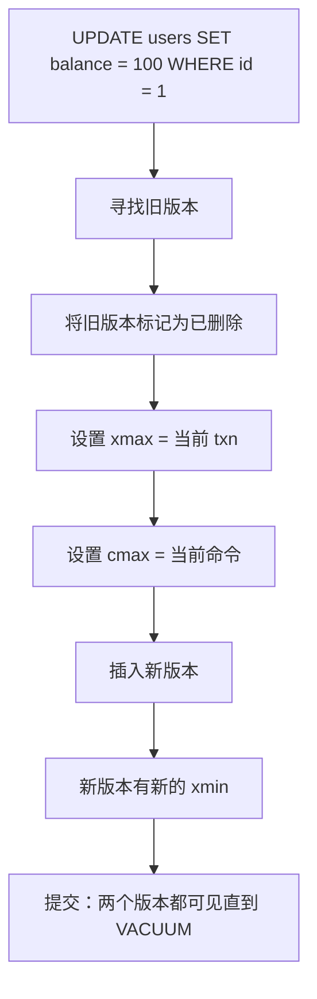
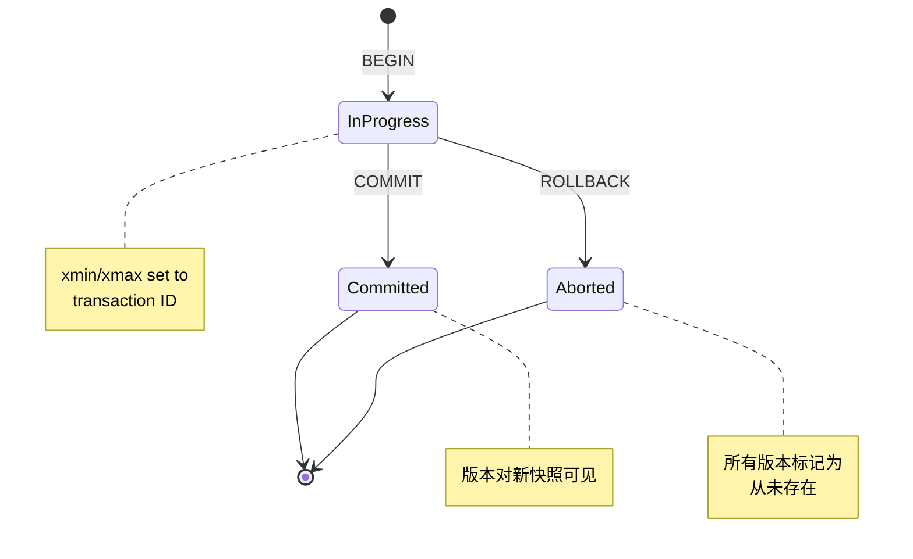
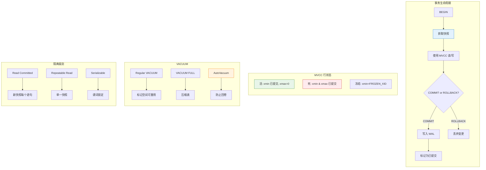

在 [第二部分](/zh-CN/2026/03/Database-Rust-BPlusTree-Index-Concurrent-Access/) 中，我们构建了并发 B+Tree 索引。但我们的方法有个根本问题。

**读者阻塞写入者。写入者阻塞读者。**

```rust
// Current implementation
let lock = page.read();  // Reader acquires lock
// Writer waits... and waits... and waits...
// Reader still holding lock (maybe computing something expensive)
// Writer: 😭
```

这对真正的数据库来说是无法接受的。PostgreSQL 处理**数千个并发事务**，读者永远不会阻塞写入者。如何做到？

**MVCC：多版本并发控制。**

今天：在 Rust 中实现带快照隔离的 MVCC、事务管理，并面对事务 ID 回卷的噩梦。

---

## 1 MVCC 的洞察

### 问题：锁定太严格

**传统锁定（2PL）：**

```
Transaction A: SELECT * FROM users WHERE id = 1  -- Reads row X
Transaction B: UPDATE users SET balance = 100 WHERE id = 1  -- Blocked!

Transaction A: (still reading, maybe for 10 seconds)
Transaction B: 😡 Still blocked!
```

**MVCC 方法：**

```
Transaction A: SELECT * FROM users WHERE id = 1
               -- 看见版本 1 的行 X（旧但一致）

Transaction B: UPDATE users SET balance = 100 WHERE id = 1
               -- 创建版本 2 的行 X
               -- 不被阻塞！

两个事务互不阻塞。
```

---

### MVCC 如何运作

**每行有多个版本：**

```
Row: users.id = 1

Version 1: {id: 1, balance: 50,  xmin: 100, xmax: NULL}
           ↑                    ↑       ↑
           Data                Created  Still visible
                             by txn 100  (not deleted)

Version 2: {id: 1, balance: 100, xmin: 200, xmax: NULL}
           ↑                     ↑
           New data          Created by txn 200

Version 3: {id: 1, balance: 150, xmin: 300, xmax: 400}
           ↑                     ↑        ↑
           Old data          Created   Deleted by
                             by txn 300  txn 400
```

**事务元数据：**

| 字段 | 意义 |
|-------|---------|
| `xmin` | 创建此版本的事务 ID |
| `xmax` | 删除此版本的事务 ID（NULL = 仍然存活） |
| `cmin` | 事务内的命令 ID（用于语句级可见性） |
| `cmax` | 删除此版本的命令 ID |

---

## 2 事务 ID 和快照

### 事务 ID 分配

```rust
// src/transaction/txn_id.rs
pub type TransactionId = u32;

pub const INVALID_XID: TransactionId = 0;
pub const FIRST_NORMAL_XID: TransactionId = 3;  // 0, 1, 2 are bootstrap

pub struct TransactionIdGenerator {
    next_xid: AtomicU32,
}

impl TransactionIdGenerator {
    pub fn new() -> Self {
        Self {
            next_xid: AtomicU32::new(FIRST_NORMAL_XID),
        }
    }

    pub fn next(&self) -> TransactionId {
        self.next_xid.fetch_add(1, Ordering::SeqCst)
    }

    pub fn current(&self) -> TransactionId {
        self.next_xid.load(Ordering::SeqCst)
    }
}
```

**问题：** `u32` 在 40 亿时会回卷。然后发生什么？

**答案：** 灾难。我们稍后处理。

---

### 快照：MVCC 的核心

**快照** 捕捉哪些事务是可见的：

```rust
// src/transaction/snapshot.rs
pub struct Snapshot {
    pub xmin: TransactionId,      // 最旧的活动事务
    pub xmax: TransactionId,      // 下一个事务 ID (任何 >= xmax 的都不可见)
    pub active_transactions: Vec<TransactionId>,  // 进行中的事务
}

impl Snapshot {
    pub fn is_visible(&self, row_xmin: TransactionId, row_xmax: Option<TransactionId>) -> bool {
        // 行由小于 xmin 的事务创建？永远可见
        if row_xmin < self.xmin {
            // 除非被大于等于 xmin 的事务删除
            return row_xmax.map_or(true, |xmax| xmax >= self.xmax);
        }

        // 行由大于等于 xmax 的事务创建？永远不可见
        if row_xmin >= self.xmax {
            return false;
        }

        // 行由活动事务创建？不可见 (除非是我们自己的)
        if self.active_transactions.contains(&row_xmin) {
            return false;
        }

        // 行由活动事务删除？仍然可见
        if let Some(xmax) = row_xmax {
            if xmax < self.xmax && !self.active_transactions.contains(&xmax) {
                return false;  // 被已提交的事务所删除
            }
        }

        true
    }
}
```

**视觉示例：**

```
Time:     100    150    200    250    300    350
          │      │      │      │      │      │
Txn 100:  [====== committed ======]
Txn 150:         [========= active =========]
Txn 200:                [== committed ==]
                          ↑
                    快照在此处拍摄
                    xmin=150, xmax=251, active=[150, 200]

Visibility rules:
- Row created by txn 100: VISIBLE (在快照前提交)
- Row created by txn 150: NOT VISIBLE (仍在活动)
- Row created by txn 200: NOT VISIBLE (在快照开始后提交)
- Row created by txn 250: NOT VISIBLE (>= xmax)
```

---

## 3 带 MVCC 的行布局

### 扩展页面标头

```rust
// src/storage/mvcc_page.rs
use crate::transaction::{TransactionId, CommandId};

pub const MVCC_ROW_HEADER_SIZE: usize = 16;

#[repr(C)]
pub struct MvccRowHeader {
    pub xmin: TransactionId,      // 4 bytes
    pub xmax: TransactionId,      // 4 bytes (0 = not deleted)
    pub cmin: CommandId,          // 4 bytes
    pub cmax: CommandId,          // 4 bytes
}

pub struct MvccRow {
    header: MvccRowHeader,
    data: [u8],  // 可变长度
}
```

**带 MVCC 的页面布局：**

```
┌─────────────────────────────────────────────────────────────┐
│ PageHeader (24 bytes)                                       │
├─────────────────────────────────────────────────────────────┤
│ ItemId array (4 bytes each)                                 │
├─────────────────────────────────────────────────────────────┤
│ 可用空间                                                    │
├─────────────────────────────────────────────────────────────┤
│ Row 0: {xmin, xmax, cmin, cmax} + data                      │
│ Row 1: {xmin, xmax, cmin, cmax} + data                      │
│ Row 2: {xmin, xmax, cmin, cmax} + data                      │
└─────────────────────────────────────────────────────────────┘
```

---

### 插入：创建新版本

```rust
// src/transaction/mvcc_operations.rs
impl MvccTable {
    pub fn insert(&self, txn: &Transaction, data: &[u8]) -> Result<(), TableError> {
        // 获取有空间的页面
        let mut page = self.get_page_for_insert()?;

        // 使用事务元数据创建行
        let header = MvccRowHeader {
            xmin: txn.xid,
            xmax: 0,  // Not deleted
            cmin: txn.current_command_id(),
            cmax: 0,
        };

        // 插入到页面
        let row_id = page.insert_mvcc_row(header, data)?;

        // 将页面标记为脏（需要 WAL）
        self.buffer_pool.mark_dirty(page.id());

        Ok(())
    }
}
```

**插入的 WAL 记录：**

```rust
#[derive(Debug, Clone)]
pub struct WalRecordInsert {
    pub page_id: u64,
    pub offset: u16,
    pub xmin: TransactionId,
    pub data: Vec<u8>,
}
```

---

### 更新：创建新版本并标记旧版本

**更新实际上是删除 + 插入：**



```rust
impl MvccTable {
    pub fn update<F>(&self, txn: &Transaction, row_id: RowId, modify: F) -> Result<(), TableError>
    where
        F: FnOnce(&[u8]) -> Vec<u8>,
    {
        // 1. 寻找旧版本
        let old_row = self.get_row(row_id)?;

        // 2. 检查可见性（只能更新可见的行）
        if !txn.snapshot.is_visible(old_row.xmin, old_row.xmax) {
            return Err(TableError::RowNotVisible);
        }

        // 3. 将旧版本标记为已删除
        let mut old_page = self.get_page(row_id.page_id)?;
        old_page.set_xmax(row_id.offset, txn.xid);
        old_page.set_cmax(row_id.offset, txn.current_command_id());

        // 4. 使用更新后的数据创建新版本
        let new_data = modify(&old_row.data);
        let new_row_id = self.insert(txn, &new_data)?;

        // 5. 记录到 WAL
        self.wal.log_update(old_row_id, new_row_id, txn.xid)?;

        Ok(())
    }
}
```

---

### 查询：可见性检查

```rust
impl MvccTable {
    pub fn scan(&self, txn: &Transaction) -> impl Iterator<Item = Row> + '_ {
        self.pages.iter().flat_map(move |page| {
            page.rows().filter_map(move |row| {
                if txn.snapshot.is_visible(row.xmin, row.xmax) {
                    Some(Row { data: row.data })
                } else {
                    None  // 不可见的版本
                }
            })
        })
    }
}
```

**示例情景：**

```
Transaction A (xid=100):          Transaction B (xid=200):
1. BEGIN;
2. INSERT INTO users VALUES (1, 50);
3. COMMIT;
                                   4. BEGIN; (snapshot: xmin=201, xmax=201)
                                   5. SELECT * FROM users;
                                      → Sees version from txn 100 ✓
6. BEGIN;
7. UPDATE users SET balance = 100 WHERE id = 1;
   (creates version 2, marks version 1 as deleted)
8. (not committed yet)
                                   9. SELECT * FROM users;
                                      → 仍然看到版本 1！ (txn 200 尚未提交)
10. COMMIT;
                                   11. SELECT * FROM users;
                                       → 现在看到版本 2 ✓
```

---

## 4 事务状态和可见性

### 事务生命周期



### 可见性矩阵

| 行状态 | 事务状态 | 可见？ |
|-----------|-------------------|----------|
| `xmin < snapshot.xmin`, `xmax = 0` | Committed | ✅ 是 |
| `xmin < snapshot.xmin`, `xmax < snapshot.xmin` | Committed | ❌ 否（已删除） |
| `xmin < snapshot.xmin`, `xmin in active` | In Progress | ❌ 否 |
| `xmin >= snapshot.xmax` | Any | ❌ 否（未来） |
| `xmin = current_txn` | Current | ✅ 是（自己的变更） |

---

## 5 VACUUM：清理死版本

### 问题：死元组累积

```
多次更新后:

Page:
┌─────────────────────────────────────────────────────────────┐
│ Row 0: {xmin: 100, xmax: 200} ← 死 (两者都已提交)       │
│ Row 1: {xmin: 300, xmax: 0}   ← 活                        │
│ Row 2: {xmin: 150, xmax: 250} ← 死                        │
│ Row 3: {xmin: 400, xmax: 0}   ← 活                        │
│ ...                                                         │
│ 50% 死空间!                                             │
└─────────────────────────────────────────────────────────────┘
```

**没有 VACUUM：** 表永远增长。性能下降。

---

### VACUUM 流程

```rust
// src/transaction/vacuum.rs
pub struct VacuumWorker {
    buffer_pool: Arc<BufferPool>,
    transaction_manager: Arc<TransactionManager>,
}

impl VacuumWorker {
    pub fn vacuum_table(&self, table_id: u64) -> Result<VacuumStats, VacuumError> {
        let mut stats = VacuumStats::default();

        for page_id in self.get_table_pages(table_id) {
            let mut page = self.buffer_pool.get_page(page_id)?;

            // 获取全局 xmin（最旧的活动事务）
            let global_xmin = self.transaction_manager.get_global_xmin();

            // 扫描所有行
            for row_id in page.rows() {
                let row = page.get_row(row_id);

                // 如果 xmax 已提交，则行已死
                if row.xmax != 0 && row.xmax < global_xmin {
                    // 标记为可重用
                    page.mark_row_free(row_id);
                    stats.dead_tuples_removed += 1;
                }
            }

            self.buffer_pool.mark_dirty(page_id);
        }

        Ok(stats)
    }
}
```

**VACUUM 不锁定：**

| 操作 | 锁定级别 |
|-----------|------------|
| Regular VACUUM | `ShareUpdateExclusiveLock`（允许读取/写入） |
| VACUUM FULL | `AccessExclusiveLock`（阻塞所有） |

---

### VACUUM FULL vs. Regular VACUUM

```
Regular VACUUM:
┌─────────────────────────────────────────────────────────────┐
│ 之前: [死][活][死][活][死][活]               │
│ 之后:  [空闲][活][空闲][活][空闲][活]               │
│         (空间可在同一页面中重用于新行)          │
└─────────────────────────────────────────────────────────────┘

VACUUM FULL:
┌─────────────────────────────────────────────────────────────┐
│ 之前: [死][活][死][活][死][活]               │
│ 之后:  [活][活][活][空闲][空闲][空闲]               │
│         (压缩，死元组物理移除)         │
└─────────────────────────────────────────────────────────────┘
```

```rust
pub fn vacuum_full(&self, table_id: u64) -> Result<(), VacuumError> {
    // 1. 获取排他锁
    let _lock = self.lock_table(table_id, LockMode::AccessExclusive);

    // 2. 创建新表文件
    let new_table_id = self.create_temp_table();

    // 3. 仅复制活元组
    for row in self.scan_live_rows(table_id) {
        self.insert_into_table(new_table_id, row);
    }

    // 4. 交换表（原子重命名）
    self.swap_tables(table_id, new_table_id);

    // 5. 释放锁
    Ok(())
}
```

---

## 6 事务 ID 回卷：40 亿行问题

### 数学计算

```rust
TransactionId = u32  // 0 to 4,294,967,295

At 1000 transactions/second:
4,294,967,295 / 1000 = 4,294,967 seconds = ~50 days

50 天后: OVERFLOW! 😱
```

---

### 回卷时发生什么

```
回卷前:
Transaction 4,294,967,294: INSERT INTO users VALUES (1, 100);
Transaction 4,294,967,295: INSERT INTO users VALUES (2, 200);
Transaction 0 (wrapped):   SELECT * FROM users;
                           → 将 xid 4B 视为比 0 “更旧”！
                           → 错误的可见性！损坏！
```

**PostgreSQL 的解决方案：2 相位事务 ID**

```rust
// 带回卷处理的事务 ID 比较
pub fn transaction_id_precedes(id1: TransactionId, id2: TransactionId) -> bool {
    // 视为带符号的 32 位整数
    // 这使得比较能够感知回卷
    (id1 as i32 - id2 as i32) < 0
}

// Example:
// 4,294,967,294 as i32 = -2
// 0 as i32 = 0
// -2 < 0 → true (4B precedes 0) ✓
```

---

### 冻结旧事务

**Vacuum freeze：** 标记非常旧的事务为“冻结”

```rust
pub const FROZEN_XID: TransactionId = 2;  // 特殊值

pub fn vacuum_freeze(&self, table_id: u64, freeze_limit: TransactionId) -> Result<(), VacuumError> {
    for page_id in self.get_table_pages(table_id) {
        let mut page = self.get_page(page_id)?;

        for row_id in page.rows() {
            let row = page.get_row(row_id);

            // 如果 xmin 足够旧，则冻结它
            if row.xmin < freeze_limit && row.xmin != FROZEN_XID {
                page.set_xmin(row_id, FROZEN_XID);
            }

            // 如果 xmax 足够旧，则冻结它
            if row.xmax != 0 && row.xmax < freeze_limit && row.xmax != FROZEN_XID {
                page.set_xmax(row_id, FROZEN_XID);
            }
        }
    }

    Ok(())
}
```

**冻结行永远可见：**

```rust
impl Snapshot {
    pub fn is_visible(&self, row_xmin: TransactionId, row_xmax: Option<TransactionId>) -> bool {
        // 冻结行永远可见
        if row_xmin == FROZEN_XID {
            return row_xmax.map_or(true, |xmax| xmax == FROZEN_XID);
        }

        // ... 正常的可见性逻辑 ...
    }
}
```

---

### Autovacuum：自动防止回卷

```rust
// src/transaction/autovacuum.rs
pub struct AutovacuumLauncher {
    transaction_manager: Arc<TransactionManager>,
    vacuum_worker: Arc<VacuumWorker>,
}

impl AutovacuumLauncher {
    pub fn run(&self) {
        loop {
            // 检查最旧的事务有多旧
            let oldest_xmin = self.transaction_manager.get_oldest_xmin();
            let current_xid = self.transaction_manager.current_xid();

            // 到回卷的距离
            let distance_to_wraparound = TransactionId::MAX - current_xid + oldest_xmin;

            // 如果接近，触发 vacuum
            if distance_to_wraparound < WRAPAROUND_EMERGENCY_THRESHOLD {
                self.vacuum_worker.vacuum_freeze_all_tables();
            }

            sleep(Duration::from_secs(60));
        }
    }
}
```

**PostgreSQL 的默认阈值：**

| 参数 | 默认值 | 意义 |
|-----------|---------|---------|
| `autovacuum_vacuum_threshold` | 50 | vacuum 前的最小死元组 |
| `autovacuum_vacuum_scale_factor` | 0.2 | +表大小的 20% |
| `autovacuum_freeze_max_age` | 200M | 强制冻结前的最大事务数 |

---

## 7 隔离级别

### ANSI SQL 隔离级别

| 隔离级别 | 脏读 | 不可重复读 | 幻读 |
|-----------------|------------|---------------------|--------------|
| Read Uncommitted | 可能 | 可能 | 可能 |
| Read Committed | ❌ 防止 | 可能 | 可能 |
| Repeatable Read | ❌ 防止 | ❌ 防止 | 可能 |
| Serializable | ❌ 防止 | ❌ 防止 | ❌ 防止 |

---

### PostgreSQL 的实现

**PostgreSQL 对所有隔离级别使用 MVCC：**

| 隔离级别 | 实现 |
|-----------------|----------------|
| Read Uncommitted | 同 Read Committed |
| Read Committed | 每个语句新快照 |
| Repeatable Read | 每个事务单一快照 |
| Serializable | 单一快照 + 谓词锁定 |

```rust
#[derive(Debug, Clone, Copy)]
pub enum IsolationLevel {
    ReadCommitted,
    RepeatableRead,
    Serializable,
}

impl Transaction {
    pub fn get_snapshot(&self) -> Snapshot {
        match self.isolation_level {
            IsolationLevel::ReadCommitted => {
                // 每个语句的新快照
                self.transaction_manager.create_snapshot()
            }
            IsolationLevel::RepeatableRead | IsolationLevel::Serializable => {
                // 为整个事务重用相同的快照
                self.cached_snapshot.clone()
            }
        }
    }
}
```

---

### 可序列化隔离：谓词锁定

```rust
// 简化的谓词锁定
pub struct SerializableTransaction {
    txn: Transaction,
    read_predicates: Vec<Predicate>,  // 读取的范围/条件
    write_set: Vec<RowId>,            // 写入的行
}

pub struct Predicate {
    pub page_id: u64,
    pub key_range: Option<(BTreeKey, BTreeKey)>,  // None = 完整扫描
}

impl TransactionManager {
    pub fn check_serializable_conflict(&self, txn: &SerializableTransaction) -> Result<(), SerializationError> {
        // 检查是否有任何已提交的写入与我们的读取冲突
        for predicate in &txn.read_predicates {
            for write in self.recent_writes() {
                if predicate.matches(&write) && write.committed_after(txn.snapshot.xmax) {
                    return Err(SerializationError::ReadWriteConflict);
                }
            }
        }

        Ok(())
    }
}
```

**冲突时：** 中止一个事务，带 `serialization_failure` 错误。

---

## 8 用 Rust 构建的挑战

### 挑战 1：快照生命周期

**问题：** 快照需要比创建它的事务更长寿。

```rust
// ❌ Doesn't work
pub fn begin_transaction(&self) -> Transaction {
    let snapshot = self.create_snapshot();  // 从 self 借用
    Transaction { snapshot, ... }  // 快照的生命周期不够长
}
```

**解决方案：owned 快照**

```rust
// ✅ Works
pub fn begin_transaction(&self) -> Transaction {
    let snapshot = self.create_snapshot();  // 返回 owned Snapshot
    Transaction {
        snapshot: Arc::new(snapshot),  // 可在线程间共享
        ...
    }
}
```

---

### 挑战 2：原子事务状态

**问题：** 多个线程需要看到一致的事务状态。

```rust
// ❌ 竞争条件
pub fn commit(&self, txn: &mut Transaction) {
    txn.state = TransactionState::Committed;  // 非原子!
    // 其他线程可能看到部分状态
}
```

**解决方案：带适当顺序的原子状态**

```rust
// ✅ Works
pub struct Transaction {
    pub xid: TransactionId,
    pub state: AtomicU8,  // 为状态使用原子
    pub snapshot: Arc<Snapshot>,
}

impl Transaction {
    pub fn commit(&self) {
        // 1. 先写 WAL（持久）
        self.wal.log_commit(self.xid)?;

        // 2. 然后标记为已提交（可见）
        self.state.store(TransactionState::Committed as u8, Ordering::Release);

        // 3. 通知等待的事务
        self.transaction_manager.notify_committed(self.xid);
    }
}
```

---

### 挑战 3：不阻塞的 VACUUM

**问题：** 如何在事务读取时进行 VACUUM？

```rust
// ❌ 阻塞读者
pub fn vacuum(&self) {
    let _lock = self.table_lock.write();  // 排他锁
    self.remove_dead_tuples();
}
```

**解决方案：两阶段 VACUUM**

```rust
// ✅ 不阻塞
pub fn vacuum(&self) {
    // 阶段 1：将元组标记为可修剪（无需锁）
    let global_xmin = self.get_global_xmin();
    self.mark_pruneable(global_xmin);

    // 阶段 2：回收空间（使用页级锁，非表锁）
    for page in self.pages.iter() {
        let _page_lock = page.lock.write();
        self.reclaim_space_on_page(page);
    }
}
```

---

## 9 AI 如何加速这项工作

### AI 做对了什么

| 任务 | AI 贡献 |
|------|-----------------|
| **可见性规则** | 生成正确的 xmin/xmax 逻辑 |
| **回卷处理** | 解释二补数技巧 |
| **快照结构** | 建议 xmin/xmax/active 模式 |
| **VACUUM 设计** | 概述两阶段方法 |

---

### AI 做错了什么

| 问题 | 发生了什么 |
|-------|---------------|
| **初始可见性** | 初稿没有处理自己未提交的写入 |
| **冻结逻辑** | 忽略了冻结行需要在可见性中特殊处理 |
| **可序列化隔离** | 建议没有谓词锁定的完全可序列化（错误！） |

**模式：** MVCC 很微妙。AI 掌握了 80% 的情况。边界情况需要深入理解。

---

### 示例：调试可见性错误

**我问 AI 的问题：**

> "事务 A 插入一行，然后查询它。但查询看不到该行。为什么？"

**我学到的：**

1. 事务必须看到**自己的**未提交写入
2. 需要在快照中跟踪 `current_transaction_id`
3. 可见性检查需要为 `row_xmin == my_xid` 特殊处理

**结果：** 修复 `is_visible()`：

```rust
pub fn is_visible(&self, row_xmin: TransactionId, row_xmax: Option<TransactionId>, my_xid: TransactionId) -> bool {
    // 特殊情况：看到你自己的写入
    if row_xmin == my_xid {
        return row_xmax.map_or(true, |xmax| xmax != my_xid);
    }

    // ... 可见性逻辑的其余部分 ...
}
```

---

## 总结：MVCC 一张图



**关键要点：**

| 概念 | 为什么重要 |
|---------|----------------|
| **MVCC** | 读者不阻塞写入者，写入者不阻塞读者 |
| **快照** | 在时间点一致的数据视图 |
| **事务 ID** | 跟踪版本创建/删除 |
| **VACUUM** | 从死版本回收空间 |
| **回卷** | 40 亿事务限制需要冻结 |
| **隔离级别** | 一致性与并发性之间的权衡 |

---

**进一步阅读：**

- PostgreSQL Source: [`src/backend/access/heap/heapam_visibility.c`](https://github.com/postgres/postgres/blob/master/src/backend/access/heap/heapam_visibility.c)
- PostgreSQL Source: [`src/backend/access/transam/`](https://github.com/postgres/tree/master/src/backend/access/transam)
- "A Critique of ANSI SQL Isolation Levels" by Berenson et al. (1995)
- "Database Management Systems" by Ramakrishnan (Ch. 16: Concurrency Control)
- "The PostgreSQL Book" by Worsley & Morin (Ch. 13: MVCC)
- Vaultgres Repository: [github.com/neoalienson/Vaultgres](https://github.com/neoalienson/Vaultgres)
