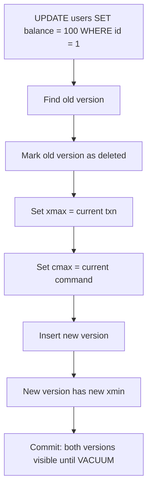
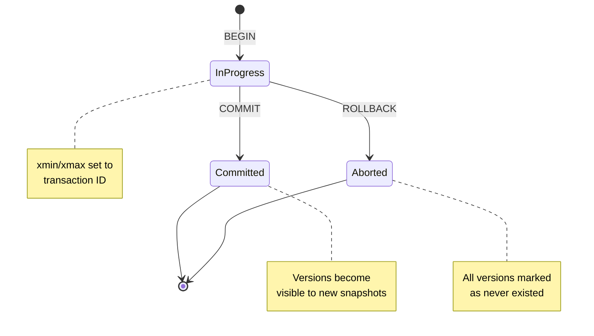
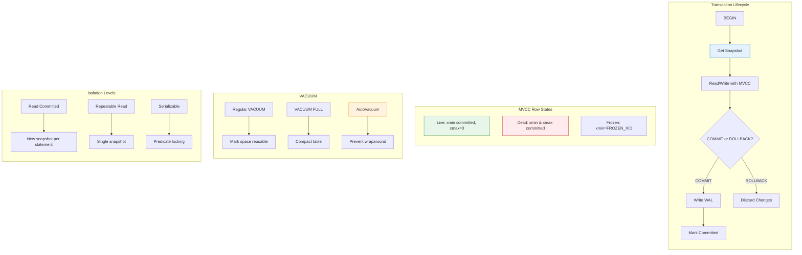

在 [第二部分](/zh-TW/2026/03/Database-Rust-BPlusTree-Index-Concurrent-Access/) 中，我們建構了併發 B+Tree 索引。但我們的方法有個根本問題。

**讀者阻塞寫入者。寫入者阻塞讀者。**

```rust
// Current implementation
let lock = page.read();  // Reader acquires lock
// Writer waits... and waits... and waits...
// Reader still holding lock (maybe computing something expensive)
// Writer: 😭
```

這對真正的資料庫來說是無法接受的。PostgreSQL 處理**數千個併發交易**，讀者永遠不會阻塞寫入者。如何做到？

**MVCC：多版本併發控制。**

今天：在 Rust 中實作帶快照隔離的 MVCC、交易管理，並面對交易 ID 環繞的噩夢。

---

## 1 MVCC 的洞察

### 問題：鎖定太嚴格

**傳統鎖定（2PL）：**

```
Transaction A: SELECT * FROM users WHERE id = 1  -- Reads row X
Transaction B: UPDATE users SET balance = 100 WHERE id = 1  -- Blocked!

Transaction A: (still reading, maybe for 10 seconds)
Transaction B: 😡 Still blocked!
```

**MVCC 方法：**

```
Transaction A: SELECT * FROM users WHERE id = 1
               -- 看見版本 1 的列 X（舊但一致）

Transaction B: UPDATE users SET balance = 100 WHERE id = 1
               -- 建立版本 2 的列 X
               -- 不被阻塞！

兩個交易互不阻塞。
```

---

### MVCC 如何運作

**每列有多個版本：**

```
Row: users.id = 1

Version 1: {id: 1, balance: 50,  xmin: 100, xmax: NULL}
           ↑                    ↑       ↑
           Data                Created  Still visible
                             by txn 100  (not deleted)

Version 2: {id: 1, balance: 100, xmin: 200, xmax: NULL}
           ↑                     ↑
           New data          Created by txn 200

Version 3: {id: 1, balance: 150, xmin: 300, xmax: 400}
           ↑                     ↑        ↑
           Old data          Created   Deleted by
                             by txn 300  txn 400
```

**交易中繼資料：**

| 欄位 | 意義 |
|-------|---------|
| `xmin` | 建立此版本的交易 ID |
| `xmax` | 刪除此版本的交易 ID（NULL = 仍然存活） |
| `cmin` | 交易內的命令 ID（用於語句級可見性） |
| `cmax` | 刪除此版本的命令 ID |

---

## 2 交易 ID 和快照

### 交易 ID 分配

```rust
// src/transaction/txn_id.rs
pub type TransactionId = u32;

pub const INVALID_XID: TransactionId = 0;
pub const FIRST_NORMAL_XID: TransactionId = 3;  // 0, 1, 2 are bootstrap

pub struct TransactionIdGenerator {
    next_xid: AtomicU32,
}

impl TransactionIdGenerator {
    pub fn new() -> Self {
        Self {
            next_xid: AtomicU32::new(FIRST_NORMAL_XID),
        }
    }

    pub fn next(&self) -> TransactionId {
        self.next_xid.fetch_add(1, Ordering::SeqCst)
    }

    pub fn current(&self) -> TransactionId {
        self.next_xid.load(Ordering::SeqCst)
    }
}
```

**問題：** `u32` 在 40 億時會環繞。然後發生什麼？

**答案：** 災難。我們稍後處理。

---

### 快照：MVCC 的核心

**快照** 捕捉哪些交易是可見的：

```rust
// src/transaction/snapshot.rs
pub struct Snapshot {
    pub xmin: TransactionId,      // Oldest active transaction
    pub xmax: TransactionId,      // Next transaction ID (nothing >= xmax is visible)
    pub active_transactions: Vec<TransactionId>,  // Transactions in progress
}

impl Snapshot {
    pub fn is_visible(&self, row_xmin: TransactionId, row_xmax: Option<TransactionId>) -> bool {
        // Row created by transaction < xmin? Always visible
        if row_xmin < self.xmin {
            // Unless deleted by transaction >= xmin
            return row_xmax.map_or(true, |xmax| xmax >= self.xmax);
        }

        // Row created by transaction >= xmax? Never visible
        if row_xmin >= self.xmax {
            return false;
        }

        // Row created by active transaction? Not visible (unless it's ours)
        if self.active_transactions.contains(&row_xmin) {
            return false;
        }

        // Row deleted by active transaction? Still visible
        if let Some(xmax) = row_xmax {
            if xmax < self.xmax && !self.active_transactions.contains(&xmax) {
                return false;  // Deleted by committed transaction
            }
        }

        true
    }
}
```

**視覺範例：**

```
Time:     100    150    200    250    300    350
          │      │      │      │      │      │
Txn 100:  [====== committed ======]
Txn 150:         [========= active =========]
Txn 200:                [== committed ==]
                          ↑
                    Snapshot taken here
                    xmin=150, xmax=251, active=[150, 200]

Visibility rules:
- Row created by txn 100: VISIBLE (committed before snapshot)
- Row created by txn 150: NOT VISIBLE (still active)
- Row created by txn 200: NOT VISIBLE (committed after snapshot started)
- Row created by txn 250: NOT VISIBLE (>= xmax)
```

---

## 3 帶 MVCC 的列佈局

### 擴展頁面標頭

```rust
// src/storage/mvcc_page.rs
use crate::transaction::{TransactionId, CommandId};

pub const MVCC_ROW_HEADER_SIZE: usize = 16;

#[repr(C)]
pub struct MvccRowHeader {
    pub xmin: TransactionId,      // 4 bytes
    pub xmax: TransactionId,      // 4 bytes (0 = not deleted)
    pub cmin: CommandId,          // 4 bytes
    pub cmax: CommandId,          // 4 bytes
}

pub struct MvccRow {
    header: MvccRowHeader,
    data: [u8],  // Variable length
}
```

**帶 MVCC 的頁面佈局：**

```
┌─────────────────────────────────────────────────────────────┐
│ PageHeader (24 bytes)                                       │
├─────────────────────────────────────────────────────────────┤
│ ItemId array (4 bytes each)                                 │
├─────────────────────────────────────────────────────────────┤
│ Free space                                                  │
├─────────────────────────────────────────────────────────────┤
│ Row 0: {xmin, xmax, cmin, cmax} + data                      │
│ Row 1: {xmin, xmax, cmin, cmax} + data                      │
│ Row 2: {xmin, xmax, cmin, cmax} + data                      │
└─────────────────────────────────────────────────────────────┘
```

---

### 插入：建立新版本

```rust
// src/transaction/mvcc_operations.rs
impl MvccTable {
    pub fn insert(&self, txn: &Transaction, data: &[u8]) -> Result<(), TableError> {
        // Get a page with space
        let mut page = self.get_page_for_insert()?;

        // Create row with transaction metadata
        let header = MvccRowHeader {
            xmin: txn.xid,
            xmax: 0,  // Not deleted
            cmin: txn.current_command_id(),
            cmax: 0,
        };

        // Insert into page
        let row_id = page.insert_mvcc_row(header, data)?;

        // Mark page as dirty (needs WAL)
        self.buffer_pool.mark_dirty(page.id());

        Ok(())
    }
}
```

**插入的 WAL 記錄：**

```rust
#[derive(Debug, Clone)]
pub struct WalRecordInsert {
    pub page_id: u64,
    pub offset: u16,
    pub xmin: TransactionId,
    pub data: Vec<u8>,
}
```

---

### 更新：建立新版本並標記舊版本

**更新實際上是刪除 + 插入：**



```rust
impl MvccTable {
    pub fn update<F>(&self, txn: &Transaction, row_id: RowId, modify: F) -> Result<(), TableError>
    where
        F: FnOnce(&[u8]) -> Vec<u8>,
    {
        // 1. Find old version
        let old_row = self.get_row(row_id)?;

        // 2. Check visibility (can only update visible rows)
        if !txn.snapshot.is_visible(old_row.xmin, old_row.xmax) {
            return Err(TableError::RowNotVisible);
        }

        // 3. Mark old version as deleted
        let mut old_page = self.get_page(row_id.page_id)?;
        old_page.set_xmax(row_id.offset, txn.xid);
        old_page.set_cmax(row_id.offset, txn.current_command_id());

        // 4. Create new version with updated data
        let new_data = modify(&old_row.data);
        let new_row_id = self.insert(txn, &new_data)?;

        // 5. Log to WAL
        self.wal.log_update(old_row_id, new_row_id, txn.xid)?;

        Ok(())
    }
}
```

---

### 查詢：可見性檢查

```rust
impl MvccTable {
    pub fn scan(&self, txn: &Transaction) -> impl Iterator<Item = Row> + '_ {
        self.pages.iter().flat_map(move |page| {
            page.rows().filter_map(move |row| {
                if txn.snapshot.is_visible(row.xmin, row.xmax) {
                    Some(Row { data: row.data })
                } else {
                    None  // Invisible version
                }
            })
        })
    }
}
```

**範例情境：**

```
Transaction A (xid=100):          Transaction B (xid=200):
1. BEGIN;
2. INSERT INTO users VALUES (1, 50);
3. COMMIT;
                                   4. BEGIN; (snapshot: xmin=201, xmax=201)
                                   5. SELECT * FROM users;
                                      → Sees version from txn 100 ✓
6. BEGIN;
7. UPDATE users SET balance = 100 WHERE id = 1;
   (creates version 2, marks version 1 as deleted)
8. (not committed yet)
                                   9. SELECT * FROM users;
                                      → Still sees version 1! (txn 200 not committed)
10. COMMIT;
                                   11. SELECT * FROM users;
                                       → Now sees version 2 ✓
```

---

## 4 交易狀態和可見性

### 交易生命週期



### 可見性矩陣

| 列狀態 | 交易狀態 | 可見？ |
|-----------|-------------------|----------|
| `xmin < snapshot.xmin`, `xmax = 0` | Committed | ✅ 是 |
| `xmin < snapshot.xmin`, `xmax < snapshot.xmin` | Committed | ❌ 否（已刪除） |
| `xmin < snapshot.xmin`, `xmin in active` | In Progress | ❌ 否 |
| `xmin >= snapshot.xmax` | Any | ❌ 否（未來） |
| `xmin = current_txn` | Current | ✅ 是（自己的變更） |

---

## 5 VACUUM：清理死版本

### 問題：死元組累積

```
After many updates:

Page:
┌─────────────────────────────────────────────────────────────┐
│ Row 0: {xmin: 100, xmax: 200} ← Dead (both committed)       │
│ Row 1: {xmin: 300, xmax: 0}   ← Live                        │
│ Row 2: {xmin: 150, xmax: 250} ← Dead                        │
│ Row 3: {xmin: 400, xmax: 0}   ← Live                        │
│ ...                                                         │
│ 50% dead space!                                             │
└─────────────────────────────────────────────────────────────┘
```

**沒有 VACUUM：** 表永遠增長。效能下降。

---

### VACUUM 流程

```rust
// src/transaction/vacuum.rs
pub struct VacuumWorker {
    buffer_pool: Arc<BufferPool>,
    transaction_manager: Arc<TransactionManager>,
}

impl VacuumWorker {
    pub fn vacuum_table(&self, table_id: u64) -> Result<VacuumStats, VacuumError> {
        let mut stats = VacuumStats::default();

        for page_id in self.get_table_pages(table_id) {
            let mut page = self.buffer_pool.get_page(page_id)?;

            // Get global xmin (oldest active transaction)
            let global_xmin = self.transaction_manager.get_global_xmin();

            // Scan all rows
            for row_id in page.rows() {
                let row = page.get_row(row_id);

                // Row is dead if xmax is committed
                if row.xmax != 0 && row.xmax < global_xmin {
                    // Mark as reusable
                    page.mark_row_free(row_id);
                    stats.dead_tuples_removed += 1;
                }
            }

            self.buffer_pool.mark_dirty(page_id);
        }

        Ok(stats)
    }
}
```

**VACUUM 不鎖定：**

| 操作 | 鎖定級別 |
|-----------|------------|
| Regular VACUUM | `ShareUpdateExclusiveLock`（允許讀取/寫入） |
| VACUUM FULL | `AccessExclusiveLock`（阻塞所有） |

---

### VACUUM FULL vs. Regular VACUUM

```
Regular VACUUM:
┌─────────────────────────────────────────────────────────────┐
│ Before: [Dead][Live][Dead][Live][Dead][Live]               │
│ After:  [Free][Live][Free][Live][Free][Live]               │
│         (space reusable for new rows in same page)          │
└─────────────────────────────────────────────────────────────┘

VACUUM FULL:
┌─────────────────────────────────────────────────────────────┐
│ Before: [Dead][Live][Dead][Live][Dead][Live]               │
│ After:  [Live][Live][Live][Free][Free][Free]               │
│         (compacted, dead tuples physically removed)         │
└─────────────────────────────────────────────────────────────┘
```

```rust
pub fn vacuum_full(&self, table_id: u64) -> Result<(), VacuumError> {
    // 1. Acquire exclusive lock
    let _lock = self.lock_table(table_id, LockMode::AccessExclusive);

    // 2. Create new table file
    let new_table_id = self.create_temp_table();

    // 3. Copy only live tuples
    for row in self.scan_live_rows(table_id) {
        self.insert_into_table(new_table_id, row);
    }

    // 4. Swap tables (atomic rename)
    self.swap_tables(table_id, new_table_id);

    // 5. Release lock
    Ok(())
}
```

---

## 6 交易 ID 環繞：40 億列問題

### 數學計算

```rust
TransactionId = u32  // 0 to 4,294,967,295

At 1000 transactions/second:
4,294,967,295 / 1000 = 4,294,967 seconds = ~50 days

After 50 days: OVERFLOW! 😱
```

---

### 環繞時發生什麼

```
Before wraparound:
Transaction 4,294,967,294: INSERT INTO users VALUES (1, 100);
Transaction 4,294,967,295: INSERT INTO users VALUES (2, 200);
Transaction 0 (wrapped):   SELECT * FROM users;
                           → Sees xid 4B as "older" than 0!
                           → Wrong visibility! CORRUPTION!
```

**PostgreSQL 的解決方案：2 相位交易 ID**

```rust
// Transaction ID comparison with wraparound handling
pub fn transaction_id_precedes(id1: TransactionId, id2: TransactionId) -> bool {
    // Treat as signed 32-bit integers
    // This makes the comparison wrap-aware
    (id1 as i32 - id2 as i32) < 0
}

// Example:
// 4,294,967,294 as i32 = -2
// 0 as i32 = 0
// -2 < 0 → true (4B precedes 0) ✓
```

---

### 冷凍舊交易

**Vacuum freeze：** 標記非常舊的交易為「冷凍」

```rust
pub const FROZEN_XID: TransactionId = 2;  // Special value

pub fn vacuum_freeze(&self, table_id: u64, freeze_limit: TransactionId) -> Result<(), VacuumError> {
    for page_id in self.get_table_pages(table_id) {
        let mut page = self.get_page(page_id)?;

        for row_id in page.rows() {
            let row = page.get_row(row_id);

            // If xmin is old enough, freeze it
            if row.xmin < freeze_limit && row.xmin != FROZEN_XID {
                page.set_xmin(row_id, FROZEN_XID);
            }

            // If xmax is old enough, freeze it
            if row.xmax != 0 && row.xmax < freeze_limit && row.xmax != FROZEN_XID {
                page.set_xmax(row_id, FROZEN_XID);
            }
        }
    }

    Ok(())
}
```

**冷凍列永遠可見：**

```rust
impl Snapshot {
    pub fn is_visible(&self, row_xmin: TransactionId, row_xmax: Option<TransactionId>) -> bool {
        // Frozen rows are always visible
        if row_xmin == FROZEN_XID {
            return row_xmax.map_or(true, |xmax| xmax == FROZEN_XID);
        }

        // ... normal visibility logic ...
    }
}
```

---

### Autovacuum：自動防止環繞

```rust
// src/transaction/autovacuum.rs
pub struct AutovacuumLauncher {
    transaction_manager: Arc<TransactionManager>,
    vacuum_worker: Arc<VacuumWorker>,
}

impl AutovacuumLauncher {
    pub fn run(&self) {
        loop {
            // Check how old the oldest transaction is
            let oldest_xmin = self.transaction_manager.get_oldest_xmin();
            let current_xid = self.transaction_manager.current_xid();

            // Distance to wraparound
            let distance_to_wraparound = TransactionId::MAX - current_xid + oldest_xmin;

            // If getting close, trigger vacuum
            if distance_to_wraparound < WRAPAROUND_EMERGENCY_THRESHOLD {
                self.vacuum_worker.vacuum_freeze_all_tables();
            }

            sleep(Duration::from_secs(60));
        }
    }
}
```

**PostgreSQL 的預設閾值：**

| 參數 | 預設值 | 意義 |
|-----------|---------|---------|
| `autovacuum_vacuum_threshold` | 50 | 真空前的最小死元組 |
| `autovacuum_vacuum_scale_factor` | 0.2 | +表大小的 20% |
| `autovacuum_freeze_max_age` | 200M | 強制冷凍前的最大交易數 |

---

## 7 隔離級別

### ANSI SQL 隔離級別

| 隔離級別 | 髒讀 | 不可重複讀 | 幻影讀 |
|-----------------|------------|---------------------|--------------|
| Read Uncommitted | 可能 | 可能 | 可能 |
| Read Committed | ❌ 防止 | 可能 | 可能 |
| Repeatable Read | ❌ 防止 | ❌ 防止 | 可能 |
| Serializable | ❌ 防止 | ❌ 防止 | ❌ 防止 |

---

### PostgreSQL 的實作

**PostgreSQL 對所有隔離級別使用 MVCC：**

| 隔離級別 | 實作 |
|-----------------|----------------|
| Read Uncommitted | 同 Read Committed |
| Read Committed | 每個語句新快照 |
| Repeatable Read | 每個交易單一笑快照 |
| Serializable | 單一笑快照 + 謂詞鎖定 |

```rust
#[derive(Debug, Clone, Copy)]
pub enum IsolationLevel {
    ReadCommitted,
    RepeatableRead,
    Serializable,
}

impl Transaction {
    pub fn get_snapshot(&self) -> Snapshot {
        match self.isolation_level {
            IsolationLevel::ReadCommitted => {
                // New snapshot for each statement
                self.transaction_manager.create_snapshot()
            }
            IsolationLevel::RepeatableRead | IsolationLevel::Serializable => {
                // Reuse same snapshot for entire transaction
                self.cached_snapshot.clone()
            }
        }
    }
}
```

---

### 可序列化隔離：謂詞鎖定

```rust
// Simplified predicate locking
pub struct SerializableTransaction {
    txn: Transaction,
    read_predicates: Vec<Predicate>,  // Ranges/conditions read
    write_set: Vec<RowId>,            // Rows written
}

pub struct Predicate {
    pub page_id: u64,
    pub key_range: Option<(BTreeKey, BTreeKey)>,  // None = full scan
}

impl TransactionManager {
    pub fn check_serializable_conflict(&self, txn: &SerializableTransaction) -> Result<(), SerializationError> {
        // Check if any committed write conflicts with our reads
        for predicate in &txn.read_predicates {
            for write in self.recent_writes() {
                if predicate.matches(&write) && write.committed_after(txn.snapshot.xmax) {
                    return Err(SerializationError::ReadWriteConflict);
                }
            }
        }

        Ok(())
    }
}
```

**衝突時：** 中止一個交易，帶 `serialization_failure` 錯誤。

---

## 8 用 Rust 建構的挑戰

### 挑戰 1：快照生命週期

**問題：** 快照需要比建立它的交易更長壽。

```rust
// ❌ Doesn't work
pub fn begin_transaction(&self) -> Transaction {
    let snapshot = self.create_snapshot();  // Borrowed from self
    Transaction { snapshot, ... }  // Snapshot doesn't live long
}
```

**解決方案： owned 快照**

```rust
// ✅ Works
pub fn begin_transaction(&self) -> Transaction {
    let snapshot = self.create_snapshot();  // Returns owned Snapshot
    Transaction {
        snapshot: Arc::new(snapshot),  // Shareable across threads
        ...
    }
}
```

---

### 挑戰 2：原子交易狀態

**問題：** 多個執行緒需要看到一致的交易狀態。

```rust
// ❌ Race condition
pub fn commit(&self, txn: &mut Transaction) {
    txn.state = TransactionState::Committed;  // Not atomic!
    // Other threads might see partial state
}
```

**解決方案：帶適當順序的原子狀態**

```rust
// ✅ Works
pub struct Transaction {
    pub xid: TransactionId,
    pub state: AtomicU8,  // Use atomic for state
    pub snapshot: Arc<Snapshot>,
}

impl Transaction {
    pub fn commit(&self) {
        // 1. Write WAL first (durable)
        self.wal.log_commit(self.xid)?;

        // 2. Then mark as committed (visible)
        self.state.store(TransactionState::Committed as u8, Ordering::Release);

        // 3. Notify waiting transactions
        self.transaction_manager.notify_committed(self.xid);
    }
}
```

---

### 挑戰 3：不阻塞的 VACUUM

**問題：** 如何在交易讀取時進行 VACUUM？

```rust
// ❌ Blocks readers
pub fn vacuum(&self) {
    let _lock = self.table_lock.write();  // Exclusive lock
    self.remove_dead_tuples();
}
```

**解決方案：兩階段 VACUUM**

```rust
// ✅ Non-blocking
pub fn vacuum(&self) {
    // Phase 1: Mark tuples as prune-able (no lock needed)
    let global_xmin = self.get_global_xmin();
    self.mark_pruneable(global_xmin);

    // Phase 2: Reclaim space (uses page-level locks, not table lock)
    for page in self.pages.iter() {
        let _page_lock = page.lock.write();
        self.reclaim_space_on_page(page);
    }
}
```

---

## 9 AI 如何加速這項工作

### AI 做對了什麼

| 任務 | AI 貢獻 |
|------|-----------------|
| **可見性規則** | 產生正確的 xmin/xmax 邏輯 |
| **環繞處理** | 解釋 2 的補數技巧 |
| **快照結構** | 建議 xmin/xmax/active 模式 |
| **VACUUM 設計** | 概述兩階段方法 |

---

### AI 做錯了什麼

| 問題 | 發生什麼事 |
|-------|---------------|
| **初始可見性** | 初稿沒有處理自己未提交的寫入 |
| **冷凍邏輯** | 忽略了冷凍列需要在可見性中特殊處理 |
| **可序列化隔離** | 建議沒有謂詞鎖定的完全可序列化（錯誤！） |

**模式：** MVCC 很微妙。AI 獲得 80% 的情況。邊界情況需要深入理解。

---

### 範例：除錯可見性錯誤

**我問 AI 的問題：**

> "交易 A 插入一列，然後查詢它。但查詢看不到該列。為什麼？"

**我學到的：**

1. 交易必須看到**自己的**未提交寫入
2. 需要在快照中追蹤 `current_transaction_id`
3. 可見性檢查需要為 `row_xmin == my_xid` 特殊處理

**結果：** 修復 `is_visible()`：

```rust
pub fn is_visible(&self, row_xmin: TransactionId, row_xmax: Option<TransactionId>, my_xid: TransactionId) -> bool {
    // Special case: see your own writes
    if row_xmin == my_xid {
        return row_xmax.map_or(true, |xmax| xmax != my_xid);
    }

    // ... rest of visibility logic ...
}
```

---

## 總結：MVCC 一張圖



**關鍵要點：**

| 概念 | 為什麼重要 |
|---------|----------------|
| **MVCC** | 讀者不阻塞寫入者，寫入者不阻塞讀者 |
| **快照** | 在時間點一致的資料視圖 |
| **交易 ID** | 追蹤版本建立/刪除 |
| **VACUUM** | 從死版本回收空間 |
| **環繞** | 40 億交易限制需要冷凍 |
| **隔離級別** | 一致性與併發性之間的權衡 |

---

**進一步閱讀：**

- PostgreSQL Source: [`src/backend/access/heap/heapam_visibility.c`](https://github.com/postgres/postgres/blob/master/src/backend/access/heap/heapam_visibility.c)
- PostgreSQL Source: [`src/backend/access/transam/`](https://github.com/postgres/tree/master/src/backend/access/transam)
- "A Critique of ANSI SQL Isolation Levels" by Berenson et al. (1995)
- "Database Management Systems" by Ramakrishnan (Ch. 16: Concurrency Control)
- "The PostgreSQL Book" by Worsley & Morin (Ch. 13: MVCC)
- Vaultgres Repository: [github.com/neoalienson/Vaultgres](https://github.com/neoalienson/Vaultgres)
