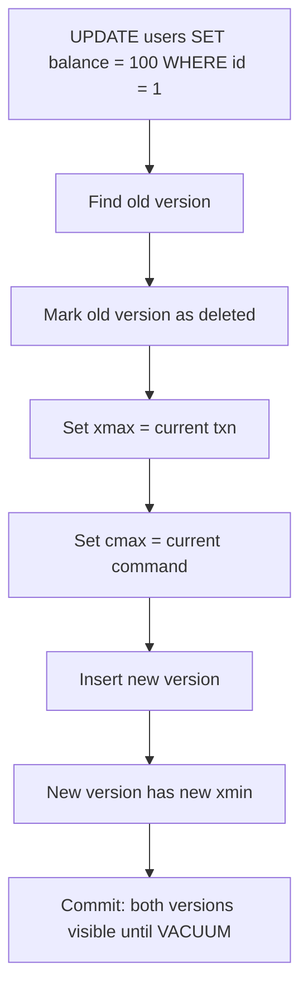
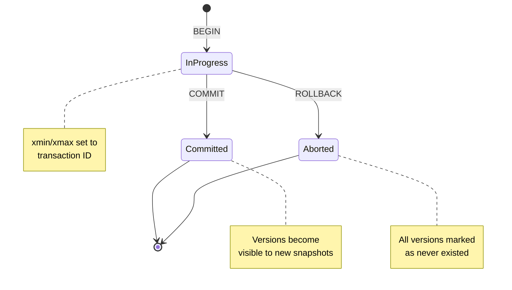
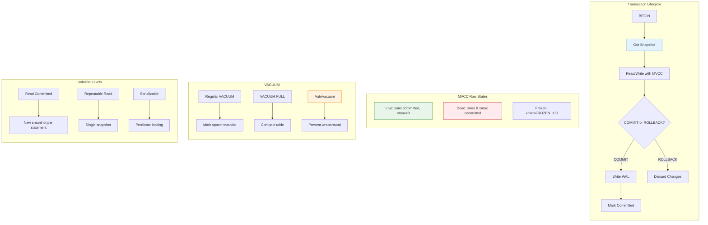

In [Part 2](/2026/03/Building-PostgreSQL-Compatible-Database-Rust-BPlusTree-Index-Concurrent-Access/), we built a concurrent B+Tree index. But there's a fundamental problem with our approach.

**Readers block writers. Writers block readers.**

```rust
// Current implementation
let lock = page.read();  // Reader acquires lock
// Writer waits... and waits... and waits...
// Reader still holding lock (maybe computing something expensive)
// Writer: 😭
```

This is unacceptable for a real database. PostgreSQL handles **thousands of concurrent transactions** with readers never blocking writers. How?

**MVCC: Multi-Version Concurrency Control.**

Today: implementing MVCC in Rust with snapshot isolation, transaction management, and confronting the nightmare of transaction ID wraparound.

---

## 1 The MVCC Insight

### The Problem: Locking Is Too Restrictive

**Traditional locking (2PL):**

```
Transaction A: SELECT * FROM users WHERE id = 1  -- Reads row X
Transaction B: UPDATE users SET balance = 100 WHERE id = 1  -- Blocked!

Transaction A: (still reading, maybe for 10 seconds)
Transaction B: 😡 Still blocked!
```

**MVCC approach:**

```
Transaction A: SELECT * FROM users WHERE id = 1
               -- Sees version 1 of row X (old but consistent)

Transaction B: UPDATE users SET balance = 100 WHERE id = 1
               -- Creates version 2 of row X
               -- Not blocked!

Both transactions proceed without blocking each other.
```

---

### How MVCC Works

**Every row has multiple versions:**

```
Row: users.id = 1

Version 1: {id: 1, balance: 50,  xmin: 100, xmax: NULL}
           ↑                    ↑       ↑
           Data                Created  Still visible
                             by txn 100  (not deleted)

Version 2: {id: 1, balance: 100, xmin: 200, xmax: NULL}
           ↑                     ↑
           New data          Created by txn 200

Version 3: {id: 1, balance: 150, xmin: 300, xmax: 400}
           ↑                     ↑        ↑
           Old data          Created   Deleted by
                             by txn 300  txn 400
```

**Transaction metadata:**

| Field | Meaning |
|-------|---------|
| `xmin` | Transaction ID that created this version |
| `xmax` | Transaction ID that deleted this version (NULL = still alive) |
| `cmin` | Command ID within transaction (for statement-level visibility) |
| `cmax` | Command ID that deleted this version |

---

## 2 Transaction IDs and Snapshots

### Transaction ID Allocation

```rust
// src/transaction/txn_id.rs
pub type TransactionId = u32;

pub const INVALID_XID: TransactionId = 0;
pub const FIRST_NORMAL_XID: TransactionId = 3;  // 0, 1, 2 are bootstrap

pub struct TransactionIdGenerator {
    next_xid: AtomicU32,
}

impl TransactionIdGenerator {
    pub fn new() -> Self {
        Self {
            next_xid: AtomicU32::new(FIRST_NORMAL_XID),
        }
    }

    pub fn next(&self) -> TransactionId {
        self.next_xid.fetch_add(1, Ordering::SeqCst)
    }

    pub fn current(&self) -> TransactionId {
        self.next_xid.load(Ordering::SeqCst)
    }
}
```

**Problem:** `u32` wraps at 4 billion. What happens then?

**Answer:** Catastrophe. We'll handle this later.

---

### Snapshots: The Heart of MVCC

A **snapshot** captures which transactions are visible:

```rust
// src/transaction/snapshot.rs
pub struct Snapshot {
    pub xmin: TransactionId,      // Oldest active transaction
    pub xmax: TransactionId,      // Next transaction ID (nothing >= xmax is visible)
    pub active_transactions: Vec<TransactionId>,  // Transactions in progress
}

impl Snapshot {
    pub fn is_visible(&self, row_xmin: TransactionId, row_xmax: Option<TransactionId>) -> bool {
        // Row created by transaction < xmin? Always visible
        if row_xmin < self.xmin {
            // Unless deleted by transaction >= xmin
            return row_xmax.map_or(true, |xmax| xmax >= self.xmax);
        }

        // Row created by transaction >= xmax? Never visible
        if row_xmin >= self.xmax {
            return false;
        }

        // Row created by active transaction? Not visible (unless it's ours)
        if self.active_transactions.contains(&row_xmin) {
            return false;
        }

        // Row deleted by active transaction? Still visible
        if let Some(xmax) = row_xmax {
            if xmax < self.xmax && !self.active_transactions.contains(&xmax) {
                return false;  // Deleted by committed transaction
            }
        }

        true
    }
}
```

**Visual example:**

```
Time:     100    150    200    250    300    350
          │      │      │      │      │      │
Txn 100:  [====== committed ======]
Txn 150:         [========= active =========]
Txn 200:                [== committed ==]
                          ↑
                    Snapshot taken here
                    xmin=150, xmax=251, active=[150, 200]

Visibility rules:
- Row created by txn 100: VISIBLE (committed before snapshot)
- Row created by txn 150: NOT VISIBLE (still active)
- Row created by txn 200: NOT VISIBLE (committed after snapshot started)
- Row created by txn 250: NOT VISIBLE (>= xmax)
```

---

## 3 Row Layout with MVCC

### Extended Page Header

```rust
// src/storage/mvcc_page.rs
use crate::transaction::{TransactionId, CommandId};

pub const MVCC_ROW_HEADER_SIZE: usize = 16;

#[repr(C)]
pub struct MvccRowHeader {
    pub xmin: TransactionId,      // 4 bytes
    pub xmax: TransactionId,      // 4 bytes (0 = not deleted)
    pub cmin: CommandId,          // 4 bytes
    pub cmax: CommandId,          // 4 bytes
}

pub struct MvccRow {
    header: MvccRowHeader,
    data: [u8],  // Variable length
}
```

**Page layout with MVCC:**

```
┌─────────────────────────────────────────────────────────────┐
│ PageHeader (24 bytes)                                       │
├─────────────────────────────────────────────────────────────┤
│ ItemId array (4 bytes each)                                 │
├─────────────────────────────────────────────────────────────┤
│ Free space                                                  │
├─────────────────────────────────────────────────────────────┤
│ Row 0: {xmin, xmax, cmin, cmax} + data                      │
│ Row 1: {xmin, xmax, cmin, cmax} + data                      │
│ Row 2: {xmin, xmax, cmin, cmax} + data                      │
└─────────────────────────────────────────────────────────────┘
```

---

### Insert: Creating a New Version

```rust
// src/transaction/mvcc_operations.rs
impl MvccTable {
    pub fn insert(&self, txn: &Transaction, data: &[u8]) -> Result<(), TableError> {
        // Get a page with space
        let mut page = self.get_page_for_insert()?;

        // Create row with transaction metadata
        let header = MvccRowHeader {
            xmin: txn.xid,
            xmax: 0,  // Not deleted
            cmin: txn.current_command_id(),
            cmax: 0,
        };

        // Insert into page
        let row_id = page.insert_mvcc_row(header, data)?;

        // Mark page as dirty (needs WAL)
        self.buffer_pool.mark_dirty(page.id());

        Ok(())
    }
}
```

**WAL record for insert:**

```rust
#[derive(Debug, Clone)]
pub struct WalRecordInsert {
    pub page_id: u64,
    pub offset: u16,
    pub xmin: TransactionId,
    pub data: Vec<u8>,
}
```

---

### Update: Creating a New Version and Marking Old

**Update is actually delete + insert:**



```rust
impl MvccTable {
    pub fn update<F>(&self, txn: &Transaction, row_id: RowId, modify: F) -> Result<(), TableError>
    where
        F: FnOnce(&[u8]) -> Vec<u8>,
    {
        // 1. Find old version
        let old_row = self.get_row(row_id)?;

        // 2. Check visibility (can only update visible rows)
        if !txn.snapshot.is_visible(old_row.xmin, old_row.xmax) {
            return Err(TableError::RowNotVisible);
        }

        // 3. Mark old version as deleted
        let mut old_page = self.get_page(row_id.page_id)?;
        old_page.set_xmax(row_id.offset, txn.xid);
        old_page.set_cmax(row_id.offset, txn.current_command_id());

        // 4. Create new version with updated data
        let new_data = modify(&old_row.data);
        let new_row_id = self.insert(txn, &new_data)?;

        // 5. Log to WAL
        self.wal.log_update(old_row_id, new_row_id, txn.xid)?;

        Ok(())
    }
}
```

---

### Select: Visibility Check

```rust
impl MvccTable {
    pub fn scan(&self, txn: &Transaction) -> impl Iterator<Item = Row> + '_ {
        self.pages.iter().flat_map(move |page| {
            page.rows().filter_map(move |row| {
                if txn.snapshot.is_visible(row.xmin, row.xmax) {
                    Some(Row { data: row.data })
                } else {
                    None  // Invisible version
                }
            })
        })
    }
}
```

**Example scenario:**

```
Transaction A (xid=100):          Transaction B (xid=200):
1. BEGIN;
2. INSERT INTO users VALUES (1, 50);
3. COMMIT;
                                   4. BEGIN; (snapshot: xmin=201, xmax=201)
                                   5. SELECT * FROM users;
                                      → Sees version from txn 100 ✓
6. BEGIN;
7. UPDATE users SET balance = 100 WHERE id = 1;
   (creates version 2, marks version 1 as deleted)
8. (not committed yet)
                                   9. SELECT * FROM users;
                                      → Still sees version 1! (txn 200 not committed)
10. COMMIT;
                                   11. SELECT * FROM users;
                                       → Now sees version 2 ✓
```

---

## 4 Transaction States and Visibility

### Transaction Lifecycle



### Visibility Matrix

| Row State | Transaction State | Visible? |
|-----------|-------------------|----------|
| `xmin < snapshot.xmin`, `xmax = 0` | Committed | ✅ Yes |
| `xmin < snapshot.xmin`, `xmax < snapshot.xmin` | Committed | ❌ No (deleted) |
| `xmin < snapshot.xmin`, `xmin in active` | In Progress | ❌ No |
| `xmin >= snapshot.xmax` | Any | ❌ No (future) |
| `xmin = current_txn` | Current | ✅ Yes (own changes) |

---

## 5 VACUUM: Cleaning Up Dead Versions

### The Problem: Dead Tuples Accumulate

```
After many updates:

Page:
┌─────────────────────────────────────────────────────────────┐
│ Row 0: {xmin: 100, xmax: 200} ← Dead (both committed)       │
│ Row 1: {xmin: 300, xmax: 0}   ← Live                        │
│ Row 2: {xmin: 150, xmax: 250} ← Dead                        │
│ Row 3: {xmin: 400, xmax: 0}   ← Live                        │
│ ...                                                         │
│ 50% dead space!                                             │
└─────────────────────────────────────────────────────────────┘
```

**Without VACUUM:** Table grows forever. Performance degrades.

---

### VACUUM Process

```rust
// src/transaction/vacuum.rs
pub struct VacuumWorker {
    buffer_pool: Arc<BufferPool>,
    transaction_manager: Arc<TransactionManager>,
}

impl VacuumWorker {
    pub fn vacuum_table(&self, table_id: u64) -> Result<VacuumStats, VacuumError> {
        let mut stats = VacuumStats::default();

        for page_id in self.get_table_pages(table_id) {
            let mut page = self.buffer_pool.get_page(page_id)?;

            // Get global xmin (oldest active transaction)
            let global_xmin = self.transaction_manager.get_global_xmin();

            // Scan all rows
            for row_id in page.rows() {
                let row = page.get_row(row_id);

                // Row is dead if xmax is committed
                if row.xmax != 0 && row.xmax < global_xmin {
                    // Mark as reusable
                    page.mark_row_free(row_id);
                    stats.dead_tuples_removed += 1;
                }
            }

            self.buffer_pool.mark_dirty(page_id);
        }

        Ok(stats)
    }
}
```

**VACUUM doesn't lock:**

| Operation | Lock Level |
|-----------|------------|
| Regular VACUUM | `ShareUpdateExclusiveLock` (allows reads/writes) |
| VACUUM FULL | `AccessExclusiveLock` (blocks everything) |

---

### VACUUM FULL vs. Regular VACUUM

```
Regular VACUUM:
┌─────────────────────────────────────────────────────────────┐
│ Before: [Dead][Live][Dead][Live][Dead][Live]               │
│ After:  [Free][Live][Free][Live][Free][Live]               │
│         (space reusable for new rows in same page)          │
└─────────────────────────────────────────────────────────────┘

VACUUM FULL:
┌─────────────────────────────────────────────────────────────┐
│ Before: [Dead][Live][Dead][Live][Dead][Live]               │
│ After:  [Live][Live][Live][Free][Free][Free]               │
│         (compacted, dead tuples physically removed)         │
└─────────────────────────────────────────────────────────────┘
```

```rust
pub fn vacuum_full(&self, table_id: u64) -> Result<(), VacuumError> {
    // 1. Acquire exclusive lock
    let _lock = self.lock_table(table_id, LockMode::AccessExclusive);

    // 2. Create new table file
    let new_table_id = self.create_temp_table();

    // 3. Copy only live tuples
    for row in self.scan_live_rows(table_id) {
        self.insert_into_table(new_table_id, row);
    }

    // 4. Swap tables (atomic rename)
    self.swap_tables(table_id, new_table_id);

    // 5. Release lock
    Ok(())
}
```

---

## 6 Transaction ID Wraparound: The 4 Billion Row Problem

### The Math

```rust
TransactionId = u32  // 0 to 4,294,967,295

At 1000 transactions/second:
4,294,967,295 / 1000 = 4,294,967 seconds = ~50 days

After 50 days: OVERFLOW! 😱
```

---

### What Happens on Wraparound

```
Before wraparound:
Transaction 4,294,967,294: INSERT INTO users VALUES (1, 100);
Transaction 4,294,967,295: INSERT INTO users VALUES (2, 200);
Transaction 0 (wrapped):   SELECT * FROM users;
                           → Sees xid 4B as "older" than 0!
                           → Wrong visibility! CORRUPTION!
```

**PostgreSQL's solution: 2-phase transaction IDs**

```rust
// Transaction ID comparison with wraparound handling
pub fn transaction_id_precedes(id1: TransactionId, id2: TransactionId) -> bool {
    // Treat as signed 32-bit integers
    // This makes the comparison wrap-aware
    (id1 as i32 - id2 as i32) < 0
}

// Example:
// 4,294,967,294 as i32 = -2
// 0 as i32 = 0
// -2 < 0 → true (4B precedes 0) ✓
```

---

### Freezing Old Transactions

**Vacuum freeze:** Mark very old transactions as "frozen"

```rust
pub const FROZEN_XID: TransactionId = 2;  // Special value

pub fn vacuum_freeze(&self, table_id: u64, freeze_limit: TransactionId) -> Result<(), VacuumError> {
    for page_id in self.get_table_pages(table_id) {
        let mut page = self.get_page(page_id)?;

        for row_id in page.rows() {
            let row = page.get_row(row_id);

            // If xmin is old enough, freeze it
            if row.xmin < freeze_limit && row.xmin != FROZEN_XID {
                page.set_xmin(row_id, FROZEN_XID);
            }

            // If xmax is old enough, freeze it
            if row.xmax != 0 && row.xmax < freeze_limit && row.xmax != FROZEN_XID {
                page.set_xmax(row_id, FROZEN_XID);
            }
        }
    }

    Ok(())
}
```

**Frozen rows are always visible:**

```rust
impl Snapshot {
    pub fn is_visible(&self, row_xmin: TransactionId, row_xmax: Option<TransactionId>) -> bool {
        // Frozen rows are always visible
        if row_xmin == FROZEN_XID {
            return row_xmax.map_or(true, |xmax| xmax == FROZEN_XID);
        }

        // ... normal visibility logic ...
    }
}
```

---

### Autovacuum: Preventing Wraparound Automatically

```rust
// src/transaction/autovacuum.rs
pub struct AutovacuumLauncher {
    transaction_manager: Arc<TransactionManager>,
    vacuum_worker: Arc<VacuumWorker>,
}

impl AutovacuumLauncher {
    pub fn run(&self) {
        loop {
            // Check how old the oldest transaction is
            let oldest_xmin = self.transaction_manager.get_oldest_xmin();
            let current_xid = self.transaction_manager.current_xid();

            // Distance to wraparound
            let distance_to_wraparound = TransactionId::MAX - current_xid + oldest_xmin;

            // If getting close, trigger vacuum
            if distance_to_wraparound < WRAPAROUND_EMERGENCY_THRESHOLD {
                self.vacuum_worker.vacuum_freeze_all_tables();
            }

            sleep(Duration::from_secs(60));
        }
    }
}
```

**PostgreSQL's default thresholds:**

| Parameter | Default | Meaning |
|-----------|---------|---------|
| `autovacuum_vacuum_threshold` | 50 | Min dead tuples before vacuum |
| `autovacuum_vacuum_scale_factor` | 0.2 | +20% of table size |
| `autovacuum_freeze_max_age` | 200M | Max transactions before forced freeze |

---

## 7 Isolation Levels

### ANSI SQL Isolation Levels

| Isolation Level | Dirty Read | Non-Repeatable Read | Phantom Read |
|-----------------|------------|---------------------|--------------|
| Read Uncommitted | Possible | Possible | Possible |
| Read Committed | ❌ Prevented | Possible | Possible |
| Repeatable Read | ❌ Prevented | ❌ Prevented | Possible |
| Serializable | ❌ Prevented | ❌ Prevented | ❌ Prevented |

---

### PostgreSQL's Implementation

**PostgreSQL uses MVCC for all isolation levels:**

| Isolation Level | Implementation |
|-----------------|----------------|
| Read Uncommitted | Same as Read Committed |
| Read Committed | Fresh snapshot per statement |
| Repeatable Read | Single snapshot per transaction |
| Serializable | Single snapshot + predicate locking |

```rust
#[derive(Debug, Clone, Copy)]
pub enum IsolationLevel {
    ReadCommitted,
    RepeatableRead,
    Serializable,
}

impl Transaction {
    pub fn get_snapshot(&self) -> Snapshot {
        match self.isolation_level {
            IsolationLevel::ReadCommitted => {
                // New snapshot for each statement
                self.transaction_manager.create_snapshot()
            }
            IsolationLevel::RepeatableRead | IsolationLevel::Serializable => {
                // Reuse same snapshot for entire transaction
                self.cached_snapshot.clone()
            }
        }
    }
}
```

---

### Serializable Isolation: Predicate Locking

```rust
// Simplified predicate locking
pub struct SerializableTransaction {
    txn: Transaction,
    read_predicates: Vec<Predicate>,  // Ranges/conditions read
    write_set: Vec<RowId>,            // Rows written
}

pub struct Predicate {
    pub page_id: u64,
    pub key_range: Option<(BTreeKey, BTreeKey)>,  // None = full scan
}

impl TransactionManager {
    pub fn check_serializable_conflict(&self, txn: &SerializableTransaction) -> Result<(), SerializationError> {
        // Check if any committed write conflicts with our reads
        for predicate in &txn.read_predicates {
            for write in self.recent_writes() {
                if predicate.matches(&write) && write.committed_after(txn.snapshot.xmax) {
                    return Err(SerializationError::ReadWriteConflict);
                }
            }
        }

        Ok(())
    }
}
```

**On conflict:** Abort one transaction with `serialization_failure` error.

---

## 8 Challenges Building in Rust

### Challenge 1: Snapshot Lifetime

**Problem:** Snapshots need to outlive the transaction that created them.

```rust
// ❌ Doesn't work
pub fn begin_transaction(&self) -> Transaction {
    let snapshot = self.create_snapshot();  // Borrowed from self
    Transaction { snapshot, ... }  // Snapshot doesn't live long
}
```

**Solution: Owned snapshots**

```rust
// ✅ Works
pub fn begin_transaction(&self) -> Transaction {
    let snapshot = self.create_snapshot();  // Returns owned Snapshot
    Transaction {
        snapshot: Arc::new(snapshot),  // Shareable across threads
        ...
    }
}
```

---

### Challenge 2: Atomic Transaction State

**Problem:** Multiple threads need to see consistent transaction state.

```rust
// ❌ Race condition
pub fn commit(&self, txn: &mut Transaction) {
    txn.state = TransactionState::Committed;  // Not atomic!
    // Other threads might see partial state
}
```

**Solution: Atomic state with proper ordering**

```rust
// ✅ Works
pub struct Transaction {
    pub xid: TransactionId,
    pub state: AtomicU8,  // Use atomic for state
    pub snapshot: Arc<Snapshot>,
}

impl Transaction {
    pub fn commit(&self) {
        // 1. Write WAL first (durable)
        self.wal.log_commit(self.xid)?;

        // 2. Then mark as committed (visible)
        self.state.store(TransactionState::Committed as u8, Ordering::Release);

        // 3. Notify waiting transactions
        self.transaction_manager.notify_committed(self.xid);
    }
}
```

---

### Challenge 3: Vacuum Without Blocking

**Problem:** How to vacuum while transactions are reading?

```rust
// ❌ Blocks readers
pub fn vacuum(&self) {
    let _lock = self.table_lock.write();  // Exclusive lock
    self.remove_dead_tuples();
}
```

**Solution: Two-phase vacuum**

```rust
// ✅ Non-blocking
pub fn vacuum(&self) {
    // Phase 1: Mark tuples as prune-able (no lock needed)
    let global_xmin = self.get_global_xmin();
    self.mark_pruneable(global_xmin);

    // Phase 2: Reclaim space (uses page-level locks, not table lock)
    for page in self.pages.iter() {
        let _page_lock = page.lock.write();
        self.reclaim_space_on_page(page);
    }
}
```

---

## 9 How AI Accelerated This

### What AI Got Right

| Task | AI Contribution |
|------|-----------------|
| **Visibility rules** | Generated correct xmin/xmax logic |
| **Wraparound handling** | Explained 2's complement trick |
| **Snapshot structure** | Suggested xmin/xmax/active pattern |
| **VACUUM design** | Outlined two-phase approach |

---

### What AI Got Wrong

| Issue | What Happened |
|-------|---------------|
| **Initial visibility** | First draft didn't handle own uncommitted writes |
| **Freeze logic** | Missed that frozen rows need special handling in visibility |
| **Serializable isolation** | Suggested full serializability without predicate locking (wrong!) |

**Pattern:** MVCC is subtle. AI gets the 80% case. Edge cases require deep understanding.

---

### Example: Debugging a Visibility Bug

**My question to AI:**

> "Transaction A inserts a row, then selects it. But the select doesn't see the row. Why?"

**What I learned:**

1. Transactions must see their **own** uncommitted writes
2. Need to track `current_transaction_id` in snapshot
3. Visibility check needs special case for `row_xmin == my_xid`

**Result:** Fixed `is_visible()`:

```rust
pub fn is_visible(&self, row_xmin: TransactionId, row_xmax: Option<TransactionId>, my_xid: TransactionId) -> bool {
    // Special case: see your own writes
    if row_xmin == my_xid {
        return row_xmax.map_or(true, |xmax| xmax != my_xid);
    }

    // ... rest of visibility logic ...
}
```

---

## Summary: MVCC in One Diagram



**Key Takeaways:**

| Concept | Why It Matters |
|---------|----------------|
| **MVCC** | Readers don't block writers, writers don't block readers |
| **Snapshots** | Consistent view of data at a point in time |
| **Transaction IDs** | Track version creation/deletion |
| **VACUUM** | Reclaim space from dead versions |
| **Wraparound** | 4 billion transaction limit requires freezing |
| **Isolation levels** | Trade-off between consistency and concurrency |

---

**Further Reading:**

- PostgreSQL Source: [`src/backend/access/heap/heapam_visibility.c`](https://github.com/postgres/postgres/blob/master/src/backend/access/heap/heapam_visibility.c)
- PostgreSQL Source: [`src/backend/access/transam/`](https://github.com/postgres/tree/master/src/backend/access/transam)
- "A Critique of ANSI SQL Isolation Levels" by Berenson et al. (1995)
- "Database Management Systems" by Ramakrishnan (Ch. 16: Concurrency Control)
- "The PostgreSQL Book" by Worsley & Morin (Ch. 13: MVCC)
- Vaultgres Repository: [github.com/neoalienson/Vaultgres](https://github.com/neoalienson/Vaultgres)
