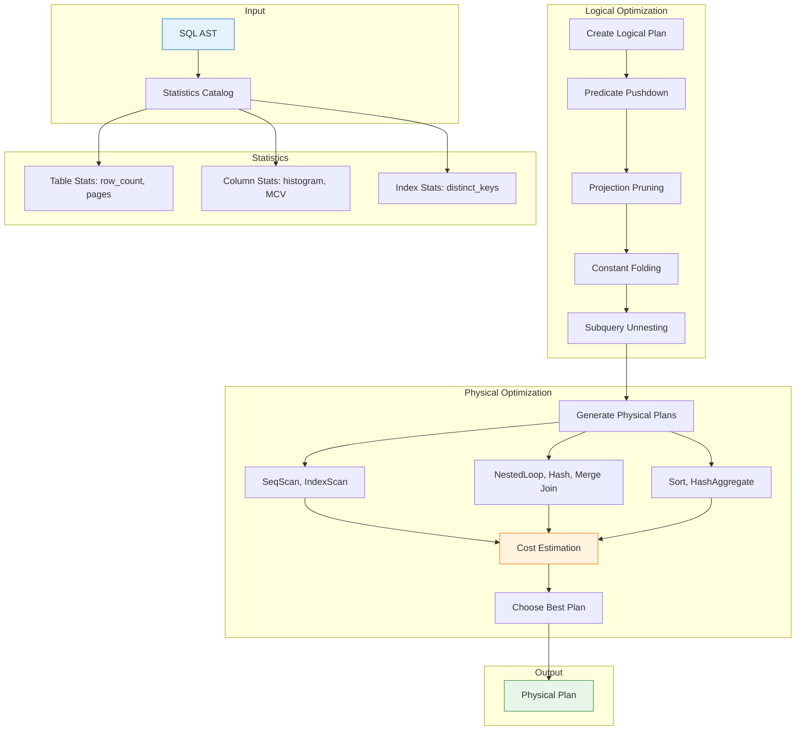

在 [第六部分](/zh-TW/2026/03/Database-Rust-SQL-Parser/) 中，我們建構了一個產生 AST 的 SQL 解析器。但有個問題。

**相同的查詢可以用許多不同的方式執行：**

```sql
SELECT u.name, o.total
FROM users u
JOIN orders o ON u.id = o.user_id
WHERE u.balance > 100
```

**可能的執行計劃：**

```
Plan A:                          Plan B:                          Plan C:
1. Scan users                    1. Scan orders                   1. Scan users (balance > 100)
2. Filter (balance > 100)        2. Filter (exists in users)      2. Index lookup on orders
3. Scan orders                   3. Scan users                    3. Hash join
4. Hash join                     4. Nested loop join              4. Sort by name
5. Sort                          5. Sort
Cost: 1500                       Cost: 800                        Cost: 200 ← 最佳！
```

**我們如何自動找到計劃 C？**

今天：在 Rust 中建構基於成本的查詢最佳化器——帶統計資料、成本模型和用於連線順序的動態規劃。

---

## 1 邏輯 vs. 物理計劃

### 兩階段方法

```
┌─────────────────────────────────────────────────────────────┐
│              Query Optimization Pipeline                     │
├─────────────────────────────────────────────────────────────┤
│                                                              │
│  SQL AST                                                     │
│     │                                                        │
│     ▼                                                        │
│  ┌──────────────────────────────────────────────────────┐   │
│  │  Logical Plan (WHAT to compute)                      │   │
│  │  - Logical Scan: users                               │   │
│  │  - Logical Filter: balance > 100                     │   │
│  │  - Logical Hash Join: u.id = o.user_id               │   │
│  └──────────────────────────────────────────────────────┘   │
│     │                                                        │
│     ▼ Optimization                                           │
│                                                              │
│  ┌──────────────────────────────────────────────────────┐   │
│  │  Physical Plan (HOW to compute)                      │   │
│  │  - Index Scan: users (balance > 100)                 │   │
│  │  - Index Scan: orders (user_id index)                │   │
│  │  - Nested Loop Join                                  │   │
│  └──────────────────────────────────────────────────────┘   │
│                                                              │
└─────────────────────────────────────────────────────────────┘
```

---

### 邏輯計劃運算子

```rust
// src/optimizer/logical_plan.rs
#[derive(Debug, Clone, PartialEq)]
pub enum LogicalPlan {
    /// Scan a table
    TableScan {
        table: String,
        alias: Option<String>,
        columns: Vec<String>,
        projection: Vec<usize>,  // Column indices
    },
    
    /// Filter rows
    Filter {
        input: Box<LogicalPlan>,
        predicate: Expression,
    },
    
    /// Project columns/expressions
    Projection {
        input: Box<LogicalPlan>,
        expressions: Vec<Expression>,
    },
    
    /// Join two relations
    Join {
        left: Box<LogicalPlan>,
        right: Box<LogicalPlan>,
        condition: JoinCondition,
        join_type: JoinType,
    },
    
    /// Aggregate (GROUP BY)
    Aggregate {
        input: Box<LogicalPlan>,
        group_by: Vec<Expression>,
        aggregates: Vec<AggregateFunction>,
    },
    
    /// Sort (ORDER BY)
    Sort {
        input: Box<LogicalPlan>,
        order_by: Vec<SortKey>,
    },
    
    /// Limit
    Limit {
        input: Box<LogicalPlan>,
        limit: usize,
        offset: usize,
    },
    
    /// Distinct
    Distinct {
        input: Box<LogicalPlan>,
    },
}

#[derive(Debug, Clone, PartialEq)]
pub enum JoinCondition {
    On(Expression),
    Using(Vec<String>),
}

#[derive(Debug, Clone, PartialEq)]
pub enum JoinType {
    Inner,
    LeftOuter,
    RightOuter,
    FullOuter,
}

#[derive(Debug, Clone, PartialEq)]
pub struct SortKey {
    pub expression: Expression,
    pub ascending: bool,
    pub nulls_first: bool,
}

#[derive(Debug, Clone, PartialEq)]
pub struct AggregateFunction {
    pub func: AggregateFunc,
    pub argument: Expression,
    pub alias: Option<String>,
}

#[derive(Debug, Clone, PartialEq)]
pub enum AggregateFunc {
    Count,
    Sum,
    Avg,
    Min,
    Max,
}
```

---

### 物理計劃運算子

```rust
// src/optimizer/physical_plan.rs
#[derive(Debug, Clone, PartialEq)]
pub enum PhysicalPlan {
    /// Full table scan
    SeqScan {
        table: String,
        alias: Option<String>,
        columns: Vec<String>,
        filter: Option<Expression>,
    },
    
    /// Index scan
    IndexScan {
        table: String,
        alias: Option<String>,
        index: String,
        columns: Vec<String>,
        condition: IndexCondition,
    },
    
    /// Nested loop join
    NestedLoopJoin {
        left: Box<PhysicalPlan>,
        right: Box<PhysicalPlan>,
        condition: Option<Expression>,
        join_type: JoinType,
    },
    
    /// Hash join
    HashJoin {
        left: Box<PhysicalPlan>,
        right: Box<PhysicalPlan>,
        condition: Expression,
        join_type: JoinType,
    },
    
    /// Merge join (requires sorted input)
    MergeJoin {
        left: Box<PhysicalPlan>,
        right: Box<PhysicalPlan>,
        condition: Expression,
        join_type: JoinType,
    },
    
    /// Sort
    Sort {
        input: Box<PhysicalPlan>,
        order_by: Vec<SortKey>,
    },
    
    /// Hash aggregate
    HashAggregate {
        input: Box<PhysicalPlan>,
        group_by: Vec<Expression>,
        aggregates: Vec<AggregateFunction>,
    },
    
    /// Stream aggregate (requires sorted input)
    StreamAggregate {
        input: Box<PhysicalPlan>,
        group_by: Vec<Expression>,
        aggregates: Vec<AggregateFunction>,
    },
    
    /// Limit
    Limit {
        input: Box<PhysicalPlan>,
        limit: usize,
        offset: usize,
    },
}

#[derive(Debug, Clone, PartialEq)]
pub enum IndexCondition {
    Eq(Expression),
    Range { low: Option<Expression>, high: Option<Expression> },
    InList(Vec<Expression>),
}
```

---

## 2 統計資料收集

### 為什麼統計資料很重要

**沒有統計資料：** 所有計劃看起來都一樣。

**有統計資料：** 我們可以準確估計成本。

```sql
-- Query
SELECT * FROM users WHERE balance > 100

-- Scenario A: balance is uniformly distributed 0-1000
-- → ~90% of rows match → SeqScan is better

-- Scenario B: balance is skewed, only 1% have > 100
-- → IndexScan is better
```

---

### 統計資料結構

```rust
// src/optimizer/statistics.rs
use std::collections::HashMap;

#[derive(Debug, Clone)]
pub struct TableStatistics {
    pub table_name: String,
    pub row_count: u64,
    pub page_count: u64,
    pub average_row_size: usize,
    pub columns: HashMap<String, ColumnStatistics>,
    pub indexes: Vec<IndexStatistics>,
    pub last_analyzed: chrono::DateTime<chrono::Utc>,
}

#[derive(Debug, Clone)]
pub struct ColumnStatistics {
    pub column_name: String,
    pub null_fraction: f64,      // Fraction of NULL values (0.0 - 1.0)
    pub distinct_count: u64,     // Number of distinct values
    pub most_common_values: Vec<(Value, f64)>,  // (value, frequency)
    pub histogram: Option<Histogram>,
    pub min_value: Option<Value>,
    pub max_value: Option<Value>,
}

#[derive(Debug, Clone)]
pub enum Histogram {
    /// Equi-width histogram (equal bucket sizes)
    EquiWidth {
        buckets: Vec<Bucket>,
        min: Value,
        max: Value,
    },
    /// Equi-depth histogram (equal rows per bucket)
    EquiDepth {
        buckets: Vec<Bucket>,
    },
}

#[derive(Debug, Clone)]
pub struct Bucket {
    pub lower_bound: Value,
    pub upper_bound: Value,
    pub row_count: u64,
    pub distinct_count: u64,
}

#[derive(Debug, Clone)]
pub struct IndexStatistics {
    pub index_name: String,
    pub columns: Vec<String>,
    pub is_unique: bool,
    pub is_primary: bool,
    pub leaf_pages: u64,
    pub distinct_keys: u64,
    pub average_leaf_per_key: f64,
}
```

---

### 收集統計資料

```rust
// src/optimizer/analyzer.rs
pub struct StatisticsAnalyzer {
    buffer_pool: Arc<BufferPool>,
    storage: Arc<StorageEngine>,
}

impl StatisticsAnalyzer {
    pub fn analyze_table(&self, table_name: &str) -> Result<TableStatistics, AnalyzerError> {
        let mut stats = TableStatistics {
            table_name: table_name.to_string(),
            row_count: 0,
            page_count: 0,
            average_row_size: 0,
            columns: HashMap::new(),
            indexes: Vec::new(),
            last_analyzed: chrono::Utc::now(),
        };

        // Scan all pages to collect statistics
        let mut total_size = 0;
        let mut column_values: HashMap<String, Vec<Value>> = HashMap::new();

        for page_id in self.storage.get_table_pages(table_name) {
            let page = self.buffer_pool.get_page(page_id)?;
            stats.page_count += 1;

            for row in page.rows() {
                stats.row_count += 1;
                total_size += row.size();

                // Collect column values
                for (col_name, value) in row.columns() {
                    column_values
                        .entry(col_name.clone())
                        .or_insert_with(Vec::new)
                        .push(value.clone());
                }
            }
        }

        if stats.row_count > 0 {
            stats.average_row_size = total_size / stats.row_count as usize;
        }

        // Compute column statistics
        for (col_name, values) in column_values {
            let col_stats = self.compute_column_statistics(&col_name, &values);
            stats.columns.insert(col_name, col_stats);
        }

        // Collect index statistics
        for index in self.storage.get_table_indexes(table_name) {
            let index_stats = self.analyze_index(&index)?;
            stats.indexes.push(index_stats);
        }

        // Store statistics in system catalog
        self.store_statistics(&stats)?;

        Ok(stats)
    }

    fn compute_column_statistics(&self, col_name: &str, values: &[Value]) -> ColumnStatistics {
        let null_count = values.iter().filter(|v| v.is_null()).count();
        let null_fraction = null_count as f64 / values.len() as f64;

        let non_null_values: Vec<_> = values.iter().filter(|v| !v.is_null()).collect();
        let distinct_count = non_null_values.iter().collect::<std::collections::HashSet<_>>().len() as u64;

        // Compute most common values
        let mut value_counts: HashMap<&Value, usize> = HashMap::new();
        for value in &non_null_values {
            *value_counts.entry(value).or_insert(0) += 1;
        }

        let mut most_common: Vec<_> = value_counts.into_iter().collect();
        most_common.sort_by(|a, b| b.1.cmp(&a.1));
        let mcv: Vec<(Value, f64)> = most_common
            .into_iter()
            .take(10)  // Keep top 10
            .map(|(v, c)| (v.clone(), c as f64 / non_null_values.len() as f64))
            .collect();

        // Compute histogram
        let histogram = self.compute_histogram(&non_null_values, distinct_count);

        // Min/Max
        let (min, max) = if non_null_values.is_empty() {
            (None, None)
        } else {
            let sorted = &mut non_null_values.clone();
            sorted.sort();
            (Some(sorted.first().unwrap().clone()), Some(sorted.last().unwrap().clone()))
        };

        ColumnStatistics {
            column_name: col_name.to_string(),
            null_fraction,
            distinct_count,
            most_common_values: mcv,
            histogram,
            min_value: min,
            max_value: max,
        }
    }

    fn compute_histogram(&self, values: &[Value], distinct_count: u64) -> Option<Histogram> {
        const NUM_BUCKETS: usize = 100;

        if values.is_empty() {
            return None;
        }

        // Use equi-depth histogram for better selectivity estimation
        let mut sorted = values.to_vec();
        sorted.sort();

        let bucket_size = sorted.len() / NUM_BUCKETS;
        if bucket_size == 0 {
            return None;
        }

        let mut buckets = Vec::new();
        for i in 0..NUM_BUCKETS {
            let start = i * bucket_size;
            let end = if i == NUM_BUCKETS - 1 { sorted.len() } else { (i + 1) * bucket_size };

            buckets.push(Bucket {
                lower_bound: sorted[start].clone(),
                upper_bound: sorted[end - 1].clone(),
                row_count: (end - start) as u64,
                distinct_count: distinct_count / NUM_BUCKETS as u64,
            });
        }

        Some(Histogram::EquiDepth { buckets })
    }
}
```

---

### 使用統計資料：ANALYZE 命令

```sql
-- Analyze a single table
ANALYZE users;

-- Analyze specific columns
ANALYZE users (id, balance, created_at);

-- Analyze all tables
ANALYZE;

-- Configure sampling (for large tables)
ANALYZE users WITH SAMPLE 0.1;  -- 10% sample
```

```rust
// src/sql_parser/ast.rs (extended)
#[derive(Debug, Clone, PartialEq)]
pub enum Statement {
    // ... existing statements ...
    Analyze(AnalyzeStatement),
}

#[derive(Debug, Clone, PartialEq)]
pub struct AnalyzeStatement {
    pub table: Option<ObjectName>,
    pub columns: Vec<Ident>,
    pub options: HashMap<String, Value>,
}

// src/optimizer/analyzer.rs
impl Database {
    pub fn analyze(&self, statement: AnalyzeStatement) -> Result<(), AnalyzerError> {
        if let Some(table) = statement.table {
            let stats = self.analyzer.analyze_table(&table.to_string())?;
            println!("Analyzed table {}: {} rows, {} pages", 
                     table, stats.row_count, stats.page_count);
        } else {
            // Analyze all tables
            for table in self.catalog.get_all_tables() {
                let stats = self.analyzer.analyze_table(&table)?;
                println!("Analyzed table {}: {} rows", table, stats.row_count);
            }
        }
        Ok(())
    }
}
```

---

## 3 成本模型

### 成本公式

```
Total Cost = CPU Cost + I/O Cost + Memory Cost

Where:
- CPU Cost: Operations per row × number of rows
- I/O Cost: Pages read/written × page cost
- Memory Cost: Sort/hash memory × memory cost factor
```

---

### 運算子成本模型

```rust
// src/optimizer/cost_model.rs
pub struct CostModel {
    // Cost constants (tunable)
    pub seq_page_cost: f64,      // Cost of sequential page read
    pub random_page_cost: f64,   // Cost of random page read
    pub cpu_tuple_cost: f64,     // CPU cost per tuple
    pub cpu_index_tuple_cost: f64,  // CPU cost per index tuple
    pub cpu_operator_cost: f64,  // CPU cost per operator evaluation
    pub memory_cost_per_kb: f64, // Memory cost per KB
}

impl Default for CostModel {
    fn default() -> Self {
        Self {
            seq_page_cost: 1.0,
            random_page_cost: 4.0,  // Random I/O is ~4x slower
            cpu_tuple_cost: 0.01,
            cpu_index_tuple_cost: 0.005,
            cpu_operator_cost: 0.0025,
            memory_cost_per_kb: 0.001,
        }
    }
}

impl CostModel {
    /// Cost of sequential scan
    pub fn seq_scan_cost(
        &self,
        num_pages: u64,
        num_rows: u64,
        filter: Option<&Expression>,
    ) -> Cost {
        let io_cost = num_pages as f64 * self.seq_page_cost;
        let cpu_cost = num_rows as f64 * self.cpu_tuple_cost;
        
        let filter_cost = if let Some(_filter) = filter {
            num_rows as f64 * self.cpu_operator_cost
        } else {
            0.0
        };

        Cost {
            startup: 0.0,
            total: io_cost + cpu_cost + filter_cost,
            rows: self.estimate_rows_after_filter(num_rows, filter),
            width: 0,  // Would be computed from schema
        }
    }

    /// Cost of index scan
    pub fn index_scan_cost(
        &self,
        index: &IndexStatistics,
        table_pages: u64,
        condition: &IndexCondition,
        num_rows: u64,
    ) -> Cost {
        // Estimate how many index pages we need to read
        let index_selectivity = self.estimate_index_selectivity(condition, index);
        let index_pages_to_read = (index.leaf_pages as f64 * index_selectivity).ceil() as u64;
        
        // Estimate how many table pages we need to read
        let table_pages_to_read = if index_selectivity > 0.3 {
            // High selectivity → sequential scan of table
            table_pages
        } else {
            // Low selectivity → random access
            (num_rows as f64 * index_selectivity).ceil() as u64
        };

        let io_cost = index_pages_to_read as f64 * self.random_page_cost
            + table_pages_to_read as f64 * self.random_page_cost;
        
        let cpu_cost = (num_rows as f64 * index_selectivity) * self.cpu_index_tuple_cost;

        Cost {
            startup: 0.0,
            total: io_cost + cpu_cost,
            rows: (num_rows as f64 * index_selectivity).ceil() as u64,
            width: 0,
        }
    }

    /// Cost of nested loop join
    pub fn nested_loop_join_cost(
        &self,
        outer_cost: &Cost,
        inner_cost: &Cost,
        join_selectivity: f64,
    ) -> Cost {
        // Outer is scanned once
        let outer_total = outer_cost.total;
        
        // Inner is scanned once per outer row
        let inner_total = inner_cost.total * outer_cost.rows as f64;
        
        // CPU cost for join condition evaluation
        let join_cpu_cost = outer_cost.rows as f64 * inner_cost.rows as f64 
            * join_selectivity * self.cpu_operator_cost;

        Cost {
            startup: outer_cost.startup,
            total: outer_total + inner_total + join_cpu_cost,
            rows: (outer_cost.rows as f64 * inner_cost.rows as f64 * join_selectivity).ceil() as u64,
            width: 0,
        }
    }

    /// Cost of hash join
    pub fn hash_join_cost(
        &self,
        left_cost: &Cost,
        right_cost: &Cost,
        join_selectivity: f64,
    ) -> Cost {
        // Build phase: scan and hash the smaller relation
        let build_cost = left_cost.total;
        let build_memory = left_cost.rows as f64 * 32.0;  // Estimate 32 bytes per row
        
        // Probe phase: scan the larger relation and probe hash table
        let probe_cost = right_cost.total;
        let probe_cpu = right_cost.rows as f64 * self.cpu_operator_cost;
        
        // Output cost
        let output_rows = left_cost.rows as f64 * right_cost.rows as f64 * join_selectivity;
        let output_cpu = output_rows * self.cpu_tuple_cost;

        Cost {
            startup: build_cost + build_memory * self.memory_cost_per_kb,
            total: build_cost + probe_cost + probe_cpu + output_cpu,
            rows: output_rows.ceil() as u64,
            width: 0,
        }
    }

    /// Cost of sort
    pub fn sort_cost(
        &self,
        input_cost: &Cost,
        num_rows: u64,
        sort_keys: &[SortKey],
    ) -> Cost {
        let input_total = input_cost.total;
        
        // Check if sort fits in memory
        let sort_memory = num_rows as f64 * 64.0;  // Estimate 64 bytes per row
        let work_mem = 4 * 1024 * 1024.0;  // 4MB work memory
        
        let sort_cpu = if sort_memory <= work_mem {
            // In-memory sort: O(n log n)
            num_rows as f64 * num_rows.log2() * self.cpu_operator_cost
        } else {
            // External sort: 2 passes
            (num_rows as f64 * num_rows.log2() * 2.0) * self.cpu_operator_cost
                + sort_memory * self.memory_cost_per_kb
        };

        let cpu_per_key = sort_keys.len() as f64 * self.cpu_operator_cost;

        Cost {
            startup: input_total + sort_cpu + num_rows as f64 * cpu_per_key,
            total: input_total + sort_cpu + num_rows as f64 * cpu_per_key,
            rows: num_rows,
            width: 0,
        }
    }

    /// Cost of hash aggregate
    pub fn hash_aggregate_cost(
        &self,
        input_cost: &Cost,
        num_groups: u64,
        num_aggregates: usize,
    ) -> Cost {
        let input_total = input_cost.total;
        
        // Build hash table of groups
        let build_memory = num_groups as f64 * 64.0;
        let build_cpu = input_cost.rows as f64 * self.cpu_operator_cost;
        
        // Aggregate computation
        let aggregate_cpu = num_groups as f64 * num_aggregates as f64 * self.cpu_operator_cost;

        Cost {
            startup: input_total + build_memory * self.memory_cost_per_kb,
            total: input_total + build_cpu + aggregate_cpu,
            rows: num_groups,
            width: 0,
        }
    }

    fn estimate_rows_after_filter(&self, num_rows: u64, filter: Option<&Expression>) -> u64 {
        match filter {
            None => num_rows,
            Some(expr) => {
                let selectivity = self.estimate_selectivity(expr);
                (num_rows as f64 * selectivity).ceil() as u64
            }
        }
    }

    fn estimate_selectivity(&self, expr: &Expression) -> f64 {
        // Simplified selectivity estimation
        // In practice, this would use statistics and histograms
        match expr {
            Expression::BinaryOp { op, .. } => match op {
                BinaryOperator::Eq => 0.01,  // Assume 1% match
                BinaryOperator::Lt | BinaryOperator::Gt => 0.33,  // Assume 1/3 match
                BinaryOperator::Lte | BinaryOperator::Gte => 0.5,  // Assume 1/2 match
                BinaryOperator::And => 0.1,
                BinaryOperator::Or => 0.5,
                _ => 0.5,
            },
            _ => 0.5,
        }
    }

    fn estimate_index_selectivity(&self, condition: &IndexCondition, index: &IndexStatistics) -> f64 {
        match condition {
            IndexCondition::Eq(_) => {
                // Equality: 1 / distinct_keys
                1.0 / index.distinct_keys.max(1) as f64
            }
            IndexCondition::Range { .. } => {
                // Range: estimate 10% of index
                0.1
            }
            IndexCondition::InList(values) => {
                // IN list: |values| / distinct_keys
                values.len() as f64 / index.distinct_keys.max(1) as f64
            }
        }
    }
}

#[derive(Debug, Clone)]
pub struct Cost {
    pub startup: f64,    // Cost to return first row
    pub total: f64,      // Cost to return all rows
    pub rows: u64,       // Estimated output rows
    pub width: usize,    // Estimated row width in bytes
}
```

---

## 4 帶動態規劃的連線順序

### 連線順序問題

**對於 n 個表，有 (n-1)! 種可能的連線順序：**

```
3 tables: 2! = 2 orders
5 tables: 4! = 24 orders
10 tables: 9! = 362,880 orders
```

**暴力破解是不可能的。** 我們需要動態規劃。

---

### DP 連線順序演算法

```rust
// src/optimizer/join_order.rs
use std::collections::HashMap;

pub struct JoinOrderOptimizer {
    cost_model: CostModel,
    statistics: Arc<StatisticsCatalog>,
}

impl JoinOrderOptimizer {
    /// Find the best join order using dynamic programming
    pub fn optimize(&self, tables: &[String], conditions: &[JoinCondition]) -> PhysicalPlan {
        let n = tables.len();
        
        // dp[i] = best plan for subset represented by bitmask i
        let mut dp: HashMap<u64, PhysicalPlan> = HashMap::new();
        let mut costs: HashMap<u64, f64> = HashMap::new();
        
        // Base case: single table scans
        for (i, table) in tables.iter().enumerate() {
            let mask = 1u64 << i;
            let plan = self.create_scan_plan(table);
            let cost = self.estimate_cost(&plan);
            
            dp.insert(mask, plan);
            costs.insert(mask, cost);
        }
        
        // Build up larger subsets
        for size in 2..=n {
            for subset in Self::subsets_of_size(n, size) {
                let subset_mask = Self::subset_to_mask(&subset);
                
                // Try all ways to split this subset
                let mut best_plan: Option<PhysicalPlan> = None;
                let mut best_cost = f64::INFINITY;
                
                for split in Self::split_subset(&subset) {
                    let left_mask = Self::subset_to_mask(&split.0);
                    let right_mask = Self::subset_to_mask(&split.1);
                    
                    if let (Some(left_plan), Some(right_plan)) = 
                        (dp.get(&left_mask), dp.get(&right_mask)) 
                    {
                        // Try different join algorithms
                        for join_plan in self.create_join_plans(
                            left_plan.clone(),
                            right_plan.clone(),
                            conditions,
                        ) {
                            let cost = self.estimate_cost(&join_plan);
                            if cost < best_cost {
                                best_cost = cost;
                                best_plan = Some(join_plan);
                            }
                        }
                    }
                }
                
                if let Some(plan) = best_plan {
                    dp.insert(subset_mask, plan);
                    costs.insert(subset_mask, best_cost);
                }
            }
        }
        
        // Return the best plan for all tables
        let all_mask = (1u64 << n) - 1;
        dp.remove(&all_mask).unwrap()
    }

    fn create_scan_plan(&self, table: &str) -> PhysicalPlan {
        // Check if we have useful indexes
        let stats = self.statistics.get_table(table);
        
        if let Some(index) = self.find_useful_index(table, &stats) {
            PhysicalPlan::IndexScan {
                table: table.to_string(),
                alias: None,
                index: index.name,
                columns: vec![],  // All columns
                condition: IndexCondition::Range { low: None, high: None },
            }
        } else {
            PhysicalPlan::SeqScan {
                table: table.to_string(),
                alias: None,
                columns: vec![],
                filter: None,
            }
        }
    }

    fn create_join_plans(
        &self,
        left: PhysicalPlan,
        right: PhysicalPlan,
        conditions: &[JoinCondition],
    ) -> Vec<PhysicalPlan> {
        let mut plans = Vec::new();
        
        // Get join condition
        let condition = self.find_join_condition(&left, &right, conditions);
        
        // Nested loop join (always possible)
        plans.push(PhysicalPlan::NestedLoopJoin {
            left: Box::new(left.clone()),
            right: Box::new(right.clone()),
            condition: condition.clone(),
            join_type: JoinType::Inner,
        });
        
        // Hash join (if equi-join)
        if self.is_equi_join(&condition) {
            plans.push(PhysicalPlan::HashJoin {
                left: Box::new(left.clone()),
                right: Box::new(right),
                condition: condition.unwrap(),
                join_type: JoinType::Inner,
            });
        }
        
        // Merge join (if inputs can be sorted on join keys)
        if self.can_merge_join(&left, &right, &condition) {
            plans.push(PhysicalPlan::MergeJoin {
                left: Box::new(left),
                right: Box::new(right),
                condition: condition.unwrap(),
                join_type: JoinType::Inner,
            });
        }
        
        plans
    }

    fn subsets_of_size(n: usize, size: usize) -> Vec<Vec<usize>> {
        // Generate all subsets of {0, 1, ..., n-1} with given size
        let mut result = Vec::new();
        Self::generate_subsets(0, n, size, &mut Vec::new(), &mut result);
        result
    }

    fn generate_subsets(
        start: usize,
        n: usize,
        size: usize,
        current: &mut Vec<usize>,
        result: &mut Vec<Vec<usize>>,
    ) {
        if current.len() == size {
            result.push(current.clone());
            return;
        }
        
        for i in start..n {
            current.push(i);
            Self::generate_subsets(i + 1, n, size, current, result);
            current.pop();
        }
    }

    fn split_subset(subset: &[usize]) -> Vec<(Vec<usize>, Vec<usize>)> {
        // Generate all non-empty proper splits of the subset
        let n = subset.len();
        let mut splits = Vec::new();
        
        // Use bitmask to generate all splits
        for mask in 1..(1 << (n - 1)) {
            let mut left = Vec::new();
            let mut right = Vec::new();
            
            for i in 0..n {
                if i == n - 1 {
                    right.push(subset[i]);
                } else if mask & (1 << i) != 0 {
                    left.push(subset[i]);
                } else {
                    right.push(subset[i]);
                }
            }
            
            if !left.is_empty() && !right.is_empty() {
                splits.push((left, right));
            }
        }
        
        splits
    }

    fn subset_to_mask(subset: &[usize]) -> u64 {
        let mut mask = 0u64;
        for &i in subset {
            mask |= 1u64 << i;
        }
        mask
    }
}
```

---

### 連線順序範例

```sql
SELECT *
FROM users u
JOIN orders o ON u.id = o.user_id
JOIN products p ON o.product_id = p.id
WHERE u.balance > 100
```

**動態規劃進度：**

```
Iteration 1 (single tables):
  {users}: SeqScan cost=100, rows=10000
  {orders}: IndexScan cost=50, rows=50000
  {products}: SeqScan cost=10, rows=1000

Iteration 2 (two tables):
  {users, orders}: 
    - users ⋈ orders (hash): cost=600, rows=5000
    - orders ⋈ users (nested): cost=800, rows=5000
    → Best: HashJoin cost=600
    
  {orders, products}:
    - orders ⋈ products (hash): cost=200, rows=10000
    → Best: HashJoin cost=200

Iteration 3 (three tables):
  {users, orders, products}:
    - {users, orders} ⋈ products: cost=800, rows=1000
    - {orders, products} ⋈ users: cost=700, rows=1000 ← Best!
    - users ⋈ {orders, products}: cost=900, rows=1000
    → Best: (orders ⋈ products) ⋈ users
```

**最終計劃：**

```
HashAggregate
  └─ HashJoin (u.id = o.user_id)
      ├─ SeqScan (users) [balance > 100]
      └─ HashJoin (o.product_id = p.id)
          ├─ IndexScan (orders)
          └─ SeqScan (products)
```

---

## 5 索引選擇

### 選擇正確的索引

```rust
// src/optimizer/index_selector.rs
pub struct IndexSelector {
    statistics: Arc<StatisticsCatalog>,
    cost_model: CostModel,
}

impl IndexSelector {
    /// Find the best index for a query
    pub fn select_index(
        &self,
        table: &str,
        predicates: &[Expression],
    ) -> Option<IndexSelection> {
        let indexes = self.statistics.get_table_indexes(table);
        
        let mut best_index: Option<IndexSelection> = None;
        let mut best_score = 0.0;
        
        for index in indexes {
            let score = self.score_index(&index, predicates);
            if score > best_score {
                best_score = score;
                best_index = Some(IndexSelection {
                    index: index.clone(),
                    score,
                    usable_predicates: self.find_usable_predicates(&index, predicates),
                });
            }
        }
        
        best_index
    }

    fn score_index(&self, index: &IndexStatistics, predicates: &[Expression]) -> f64 {
        let mut score = 0.0;
        
        // Check if index columns are used in predicates
        for (i, col) in index.columns.iter().enumerate() {
            for predicate in predicates {
                if self.predicate_uses_column(predicate, col) {
                    // Earlier columns in index are more valuable
                    let position_weight = 1.0 / (i + 1) as f64;
                    score += position_weight * 100.0;
                    
                    // Equality is more valuable than range
                    if self.is_equality_predicate(predicate) {
                        score *= 2.0;
                    }
                }
            }
        }
        
        // Bonus for covering indexes (all columns in index)
        if self.is_covering_index(index, predicates) {
            score *= 1.5;
        }
        
        // Bonus for unique indexes
        if index.is_unique {
            score *= 1.3;
        }
        
        score
    }

    fn find_usable_predicates(
        &self,
        index: &IndexStatistics,
        predicates: &[Expression],
    ) -> Vec<Expression> {
        predicates
            .iter()
            .filter(|p| self.predicate_uses_index_column(p, index))
            .cloned()
            .collect()
    }

    fn predicate_uses_column(&self, predicate: &Expression, column: &str) -> bool {
        match predicate {
            Expression::BinaryOp { left, right, .. } => {
                self.expr_references_column(left, column) ||
                self.expr_references_column(right, column)
            }
            Expression::Identifier(ident) => ident.value == column,
            Expression::CompoundIdentifier(idents) => {
                idents.iter().any(|i| i.value == column)
            }
            _ => false,
        }
    }

    fn is_equality_predicate(&self, predicate: &Expression) -> bool {
        match predicate {
            Expression::BinaryOp { op, .. } => {
                matches!(op, BinaryOperator::Eq)
            }
            _ => false,
        }
    }

    fn is_covering_index(&self, index: &IndexStatistics, predicates: &[Expression]) -> bool {
        // Check if all columns referenced in predicates are in the index
        let referenced_columns = self.extract_referenced_columns(predicates);
        referenced_columns.iter().all(|col| index.columns.contains(col))
    }
}

#[derive(Debug, Clone)]
pub struct IndexSelection {
    pub index: IndexStatistics,
    pub score: f64,
    pub usable_predicates: Vec<Expression>,
}
```

---

## 6 完整的最佳化管線

### 從 AST 到物理計劃

```rust
// src/optimizer/optimizer.rs
pub struct QueryOptimizer {
    catalog: Arc<Catalog>,
    statistics: Arc<StatisticsCatalog>,
    cost_model: CostModel,
    join_optimizer: JoinOrderOptimizer,
    index_selector: IndexSelector,
}

impl QueryOptimizer {
    pub fn optimize(&self, ast: SelectStatement) -> Result<PhysicalPlan, OptimizerError> {
        // Phase 1: Create logical plan
        let logical_plan = self.create_logical_plan(ast)?;
        
        // Phase 2: Apply logical optimizations
        let optimized_logical = self.apply_logical_optimizations(logical_plan);
        
        // Phase 3: Generate physical plans
        let physical_plans = self.generate_physical_plans(&optimized_logical);
        
        // Phase 4: Choose best plan based on cost
        let best_plan = self.choose_best_plan(physical_plans)?;
        
        Ok(best_plan)
    }

    fn create_logical_plan(&self, ast: SelectStatement) -> Result<LogicalPlan, OptimizerError> {
        // Start with FROM clause
        let mut plan = self.plan_table_with_joins(ast.from)?;
        
        // Add WHERE filter
        if let Some(where_clause) = ast.where_clause {
            plan = LogicalPlan::Filter {
                input: Box::new(plan),
                predicate: where_clause,
            };
        }
        
        // Add GROUP BY / aggregates
        if !ast.group_by.is_empty() || !ast.having.is_some() {
            plan = self.plan_aggregate(plan, ast.group_by, ast.having)?;
        }
        
        // Add SELECT projection
        plan = self.plan_projection(plan, ast.projections)?;
        
        // Add DISTINCT
        if ast.distinct {
            plan = LogicalPlan::Distinct {
                input: Box::new(plan),
            };
        }
        
        // Add ORDER BY
        if !ast.order_by.is_empty() {
            plan = LogicalPlan::Sort {
                input: Box::new(plan),
                order_by: ast.order_by,
            };
        }
        
        // Add LIMIT/OFFSET
        if ast.limit.is_some() || ast.offset.is_some() {
            plan = LogicalPlan::Limit {
                input: Box::new(plan),
                limit: ast.limit.unwrap_or(Expression::LiteralNumber(i64::MAX)),
                offset: ast.offset.unwrap_or(Expression::LiteralNumber(0)),
            };
        }
        
        Ok(plan)
    }

    fn apply_logical_optimizations(&self, plan: LogicalPlan) -> LogicalPlan {
        let mut optimized = plan;
        
        // Predicate pushdown
        optimized = self.predicate_pushdown(optimized);
        
        // Projection pruning
        optimized = self.projection_pruning(optimized);
        
        // Constant folding
        optimized = self.constant_folding(optimized);
        
        // Subquery unnesting
        optimized = self.unnest_subqueries(optimized);
        
        optimized
    }

    fn generate_physical_plans(&self, logical: &LogicalPlan) -> Vec<PhysicalPlan> {
        let mut plans = Vec::new();
        
        // Generate all reasonable physical alternatives
        self.generate_plans_recursive(logical, &mut plans);
        
        plans
    }

    fn choose_best_plan(&self, plans: Vec<PhysicalPlan>) -> Result<PhysicalPlan, OptimizerError> {
        if plans.is_empty() {
            return Err(OptimizerError::NoPlansGenerated);
        }
        
        let mut best_plan = plans[0].clone();
        let mut best_cost = self.cost_model.estimate_cost(&best_plan);
        
        for plan in plans.into_iter().skip(1) {
            let cost = self.cost_model.estimate_cost(&plan);
            if cost < best_cost {
                best_cost = cost;
                best_plan = plan;
            }
        }
        
        Ok(best_plan)
    }
}
```

---

## 7 用 Rust 建構的挑戰

### 挑戰 1：遞歸計劃類型

**問題：** PhysicalPlan 是深度遞歸的，難以模式匹配。

```rust
// ❌ Complex nested matching
match plan {
    PhysicalPlan::HashJoin { left, right, .. } => {
        match left.as_ref() {
            PhysicalPlan::IndexScan { .. } => { ... }
            PhysicalPlan::SeqScan { .. } => { ... }
            _ => { ... }
        }
    }
    _ => { ... }
}
```

**解決方案：訪問者模式**

```rust
// ✅ Clean traversal
pub trait PlanVisitor {
    fn visit(&mut self, plan: &PhysicalPlan);
}

pub fn collect_scan_tables(plan: &PhysicalPlan) -> Vec<String> {
    let mut visitor = TableCollector { tables: Vec::new() };
    visitor.visit(plan);
    visitor.tables
}
```

---

### 挑戰 2：成本類型精度

**問題：** 成本可能非常大或非常小。

```rust
// ❌ f32 loses precision
let cost: f32 = 1000000.0 + 0.0001;  // Loses 0.0001!
```

**解決方案：使用 f64**

```rust
// ✅ Better precision
let cost: f64 = 1000000.0 + 0.0001;  // Preserves both
```

---

### 挑戰 3：統計資料生命週期

**問題：** 統計資料需要在最佳化過程中共享。

```rust
// ❌ Doesn't work
pub struct Optimizer {
    statistics: StatisticsCatalog,  // Too large to clone
}
```

**解決方案：Arc 用於共享所有權**

```rust
// ✅ Works
pub struct Optimizer {
    statistics: Arc<StatisticsCatalog>,
}
```

---

## 8 AI 如何加速這項工作

### AI 做對了什麼

| 任務 | AI 貢獻 |
|------|-----------------|
| **成本模型結構** | CPU/IO/記憶體成本的良好分解 |
| **DP 連線順序** | 正確的基於位元遮罩的子集產生 |
| **統計資料設計** | 直方圖類型、MCV 串列 |
| **索引評分** | 位置權重、相等獎金 |

---

### AI 做錯了什麼

| 問題 | 發生什麼事 |
|-------|---------------|
| **選擇性估計** | 初稿使用固定值，不是直方圖 |
| **連線成本公式** | 忽略了內部每個外部列掃描一次 |
| **排序成本** | 沒有區分記憶體內與外部排序 |
| **覆蓋索引** | 初始設計沒有考慮僅索引掃描 |

**模式：** AI 處理結構良好。數值公式和邊界情況需要手動驗證。

---

### 範例：除錯連線成本

**我問 AI 的問題：**

> "Hash join 成本似乎錯誤。建立雜湊表應該是啟動成本，不是總成本。"

**我學到的：**

1. **啟動成本：** 返回第一列的成本
2. **總成本：** 返回所有列的成本
3. Hash 建立是啟動（必須在探測前完成）
4. 探測成本隨輸出行數擴展

**結果：** 修復成本模型：

```rust
Cost {
    startup: build_cost + build_memory * memory_factor,  // Before first row
    total: build_cost + probe_cost + output_cpu,         // All rows
    rows: output_rows,
}
```

---

## 總結：查詢最佳化器一張圖



**關鍵要點：**

| 概念 | 為什麼重要 |
|---------|----------------|
| **邏輯 vs. 物理** | 分離 WHAT 與 HOW |
| **統計資料** | 準確的成本估計需要資料 |
| **成本模型** | CPU + I/O + memory = total cost |
| **DP 連線順序** | 無需暴力破解找到最佳順序 |
| **索引選擇** | 為謂詞選擇最佳索引 |
| **啟動 vs. 總計** | 第一列延遲 vs. 吞吐量 |

---

**進一步閱讀：**

- "Database Management Systems" by Ramakrishnan (Ch. 15: Query Optimization)
- "Readings in Database Systems" (Red Book) - Query Optimization chapter
- PostgreSQL Source: [`src/backend/optimizer/`](https://github.com/postgres/postgres/tree/master/src/backend/optimizer)
- "Cost-Based Oracle Fundamentals" by Jonathan Lewis
- Vaultgres Repository: [github.com/neoalienson/Vaultgres](https://github.com/neoalienson/Vaultgres)
