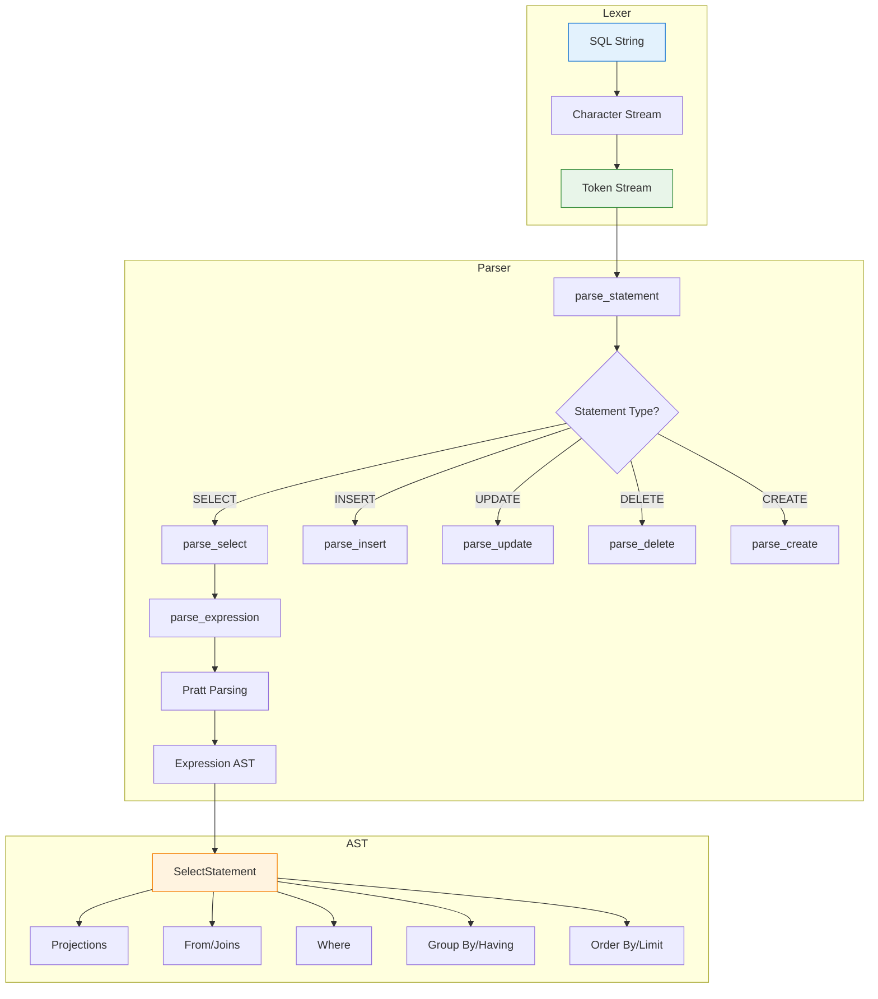

In [Part 5](/2026/03/Database-Rust-Wire-Protocol-Result-Set/), we built the PostgreSQL wire protocol. Clients can now connect and send queries. But there's a problem.

**We receive SQL strings. Now what?**

```
Client: "SELECT id, name FROM users WHERE balance > 100 ORDER BY name LIMIT 10"
Server: ???
```

We could use an existing parser (`sqlparser-rs`, `peg`, etc.). But building our own teaches us how SQL actually works.

Today: building a comprehensive SQL parser in Rust—from lexer to AST—for DDL, DML, and queries.

---

## 1 Why Build a SQL Parser?

### The Alternatives

| Approach | Pros | Cons |
|----------|------|------|
| **sqlparser-rs** | Production-ready, PostgreSQL dialect | Black box, hard to customize |
| **peg/lalrpop** | Generator handles grammar | Learning curve, debug complexity |
| **Hand-written** | Full control, educational | Time-consuming, error-prone |

**Vaultgres choice:** Hand-written recursive descent parser.

**Why?**

| Reason | Explanation |
|--------|-------------|
| **Learning** | Understand SQL grammar deeply |
| **Control** | Add custom extensions easily |
| **Error messages** | Better than generator defaults |
| **Integration** | Direct AST → execution plan |

---

### Parser Architecture

```
┌─────────────────────────────────────────────────────────────┐
│                    SQL Parser Pipeline                       │
├─────────────────────────────────────────────────────────────┤
│                                                              │
│  SQL String                                                  │
│     │                                                        │
│     ▼                                                        │
│  ┌─────────────┐                                            │
│  │   Lexer     │  Tokenize: "SELECT" → Token::SELECT        │
│  │ (Tokenizer) │  "123" → Token::Integer(123)               │
│  └──────┬──────┘                                            │
│         │                                                    │
│         ▼                                                    │
│  ┌─────────────┐                                            │
│  │   Parser    │  Recursive descent:                        │
│  │             │  parse_statement() → parse_select() → ...  │
│  └──────┬──────┘                                            │
│         │                                                    │
│         ▼                                                    │
│  ┌─────────────┐                                            │
│  │     AST     │  Structured representation:                │
│  │             │  SelectStatement { projections, from, ...} │
│  └─────────────┘                                            │
│                                                              │
└─────────────────────────────────────────────────────────────┘
```

---

## 2 Lexer: Tokenizing SQL

### Token Types

```rust
// src/sql_parser/lexer.rs
#[derive(Debug, Clone, PartialEq)]
pub enum Token {
    // Keywords
    Select,
    From,
    Where,
    Insert,
    Into,
    Values,
    Update,
    Set,
    Delete,
    Create,
    Table,
    Index,
    On,
    As,
    And,
    Or,
    Not,
    Null,
    True,
    False,
    Primary,
    Key,
    References,
    Default,
    Unique,
    Check,
    Constraint,
    Join,
    Inner,
    Left,
    Right,
    Outer,
    Order,
    By,
    Asc,
    Desc,
    Group,
    Having,
    Limit,
    Offset,
    Distinct,
    
    // Literals
    Integer(i64),
    Float(f64),
    String(String),
    Identifier(String),
    
    // Operators
    Plus,
    Minus,
    Star,
    Slash,
    Eq,
    Neq,
    Lt,
    Lte,
    Gt,
    Gte,
    Arrow,      // ->
    DoubleArrow, // ->>
    
    // Punctuation
    Comma,
    Semicolon,
    LParen,
    RParen,
    Dot,
    
    // Special
    Eof,
    Unknown(char),
}
```

---

### Lexer Implementation

```rust
// src/sql_parser/lexer.rs
pub struct Lexer {
    input: Vec<char>,
    pos: usize,
}

impl Lexer {
    pub fn new(input: &str) -> Self {
        Self {
            input: input.chars().collect(),
            pos: 0,
        }
    }
    
    pub fn tokenize(&mut self) -> Result<Vec<Token>, LexerError> {
        let mut tokens = Vec::new();
        
        while let Some(token) = self.next_token()? {
            if token == Token::Eof {
                break;
            }
            tokens.push(token);
        }
        
        tokens.push(Token::Eof);
        Ok(tokens)
    }
    
    fn next_token(&mut self) -> Result<Option<Token>, LexerError> {
        self.skip_whitespace();
        
        if self.pos >= self.input.len() {
            return Ok(Some(Token::Eof));
        }
        
        let ch = self.current_char();
        
        match ch {
            // Single-character tokens
            '+' => { self.advance(); Ok(Some(Token::Plus)) }
            '-' => { self.advance(); Ok(Some(Token::Minus)) }
            '*' => { self.advance(); Ok(Some(Token::Star)) }
            '/' => { self.advance(); Ok(Some(Token::Slash)) }
            ',' => { self.advance(); Ok(Some(Token::Comma)) }
            ';' => { self.advance(); Ok(Some(Token::Semicolon)) }
            '(' => { self.advance(); Ok(Some(Token::LParen)) }
            ')' => { self.advance(); Ok(Some(Token::RParen)) }
            '.' => { self.advance(); Ok(Some(Token::Dot)) }
            
            // Multi-character operators
            '=' => { self.advance(); Ok(Some(Token::Eq)) }
            '<' => {
                self.advance();
                match self.current_char() {
                    '=' => { self.advance(); Ok(Some(Token::Lte)) }
                    '>' => { self.advance(); Ok(Some(Token::Neq)) }
                    _ => Ok(Some(Token::Lt))
                }
            }
            '>' => {
                self.advance();
                match self.current_char() {
                    '=' => { self.advance(); Ok(Some(Token::Gte)) }
                    _ => Ok(Some(Token::Gt))
                }
            }
            '!' => {
                self.advance();
                if self.current_char() == '=' {
                    self.advance();
                    Ok(Some(Token::Neq))
                } else {
                    Err(LexerError::UnexpectedChar('!'))
                }
            }
            
            // String literals
            '\'' => self.read_string(),
            
            // Identifiers and keywords
            ch if ch.is_alphabetic() || ch == '_' => {
                self.read_identifier()
            }
            
            // Numbers
            ch if ch.is_numeric() => {
                self.read_number()
            }
            
            // Unknown
            ch => {
                self.advance();
                Ok(Some(Token::Unknown(ch)))
            }
        }
    }
    
    fn read_string(&mut self) -> Result<Option<Token>, LexerError> {
        self.advance(); // Skip opening quote
        
        let mut value = String::new();
        while self.pos < self.input.len() && self.current_char() != '\'' {
            value.push(self.current_char());
            self.advance();
        }
        
        if self.pos >= self.input.len() {
            return Err(LexerError::UnterminatedString);
        }
        
        self.advance(); // Skip closing quote
        Ok(Some(Token::String(value)))
    }
    
    fn read_identifier(&mut self) -> Result<Option<Token>, LexerError> {
        let start = self.pos;
        
        while self.pos < self.input.len() {
            let ch = self.current_char();
            if ch.is_alphanumeric() || ch == '_' {
                self.advance();
            } else {
                break;
            }
        }
        
        let value: String = self.input[start..self.pos].iter().collect();
        
        // Check if it's a keyword
        let token = match value.to_uppercase().as_str() {
            "SELECT" => Token::Select,
            "FROM" => Token::From,
            "WHERE" => Token::Where,
            "INSERT" => Token::Insert,
            "UPDATE" => Token::Update,
            "DELETE" => Token::Delete,
            "CREATE" => Token::Create,
            "TABLE" => Token::Table,
            "INDEX" => Token::Index,
            "PRIMARY" => Token::Primary,
            "KEY" => Token::Key,
            "NULL" => Token::Null,
            "TRUE" => Token::True,
            "FALSE" => Token::False,
            _ => Token::Identifier(value),
        };
        
        Ok(Some(token))
    }
    
    fn read_number(&mut self) -> Result<Option<Token>, LexerError> {
        let start = self.pos;
        let mut is_float = false;
        
        while self.pos < self.input.len() {
            let ch = self.current_char();
            if ch.is_numeric() {
                self.advance();
            } else if ch == '.' && !is_float {
                is_float = true;
                self.advance();
            } else {
                break;
            }
        }
        
        let value: String = self.input[start..self.pos].iter().collect();
        
        if is_float {
            Ok(Some(Token::Float(value.parse()?)))
        } else {
            Ok(Some(Token::Integer(value.parse()?)))
        }
    }
    
    fn skip_whitespace(&mut self) {
        while self.pos < self.input.len() && self.current_char().is_whitespace() {
            self.advance();
        }
    }
    
    fn current_char(&self) -> char {
        self.input[self.pos]
    }
    
    fn advance(&mut self) {
        self.pos += 1;
    }
}
```

---

### Lexer Example

```
Input: "SELECT id, name FROM users WHERE balance > 100"

Tokens:
[
    Select,
    Identifier("id"),
    Comma,
    Identifier("name"),
    From,
    Identifier("users"),
    Where,
    Identifier("balance"),
    Gt,
    Integer(100),
    Eof
]
```

---

## 3 AST: Abstract Syntax Tree

### Statement Types

```rust
// src/sql_parser/ast.rs
#[derive(Debug, Clone, PartialEq)]
pub enum Statement {
    Select(SelectStatement),
    Insert(InsertStatement),
    Update(UpdateStatement),
    Delete(DeleteStatement),
    CreateTable(CreateTableStatement),
    CreateIndex(CreateIndexStatement),
    DropTable(DropTableStatement),
    DropIndex(DropIndexStatement),
}
```

---

### SELECT Statement

```rust
#[derive(Debug, Clone, PartialEq)]
pub struct SelectStatement {
    pub distinct: bool,
    pub projections: Vec<SelectItem>,
    pub from: Option<TableWithJoins>,
    pub where_clause: Option<Expression>,
    pub group_by: Vec<Expression>,
    pub having: Option<Expression>,
    pub order_by: Vec<OrderByExpr>,
    pub limit: Option<Expression>,
    pub offset: Option<Expression>,
}

#[derive(Debug, Clone, PartialEq)]
pub enum SelectItem {
    UnnamedExpr(Expression),
    ExprWithAlias(Expression, Ident),
    Wildcard,  // SELECT *
}

#[derive(Debug, Clone, PartialEq)]
pub struct Ident {
    pub value: String,
    pub quote_style: Option<char>,  // "quoted" vs unquoted
}

#[derive(Debug, Clone, PartialEq)]
pub struct TableWithJoins {
    pub table: TableFactor,
    pub joins: Vec<Join>,
}

#[derive(Debug, Clone, PartialEq)]
pub enum TableFactor {
    Table { name: ObjectName, alias: Option<TableAlias> },
    Subquery { query: Box<SelectStatement>, alias: Option<TableAlias> },
}

#[derive(Debug, Clone, PartialEq)]
pub struct TableAlias {
    pub name: Ident,
    pub columns: Vec<Ident>,
}

#[derive(Debug, Clone, PartialEq)]
pub struct Join {
    pub relation: TableFactor,
    pub join_operator: JoinOperator,
}

#[derive(Debug, Clone, PartialEq)]
pub enum JoinOperator {
    Inner,
    LeftOuter,
    RightOuter,
    FullOuter,
    Cross,
}
```

---

### DML Statements

```rust
// INSERT
#[derive(Debug, Clone, PartialEq)]
pub struct InsertStatement {
    pub table: ObjectName,
    pub columns: Vec<Ident>,
    pub values: Vec<Vec<Expression>>,
    pub returning: Vec<SelectItem>,
}

// UPDATE
#[derive(Debug, Clone, PartialEq)]
pub struct UpdateStatement {
    pub table: ObjectName,
    pub assignments: Vec<Assignment>,
    pub where_clause: Option<Expression>,
    pub returning: Vec<SelectItem>,
}

#[derive(Debug, Clone, PartialEq)]
pub struct Assignment {
    pub column: Ident,
    pub value: Expression,
}

// DELETE
#[derive(Debug, Clone, PartialEq)]
pub struct DeleteStatement {
    pub table: ObjectName,
    pub where_clause: Option<Expression>,
    pub returning: Vec<SelectItem>,
}
```

---

### DDL Statements

```rust
// CREATE TABLE
#[derive(Debug, Clone, PartialEq)]
pub struct CreateTableStatement {
    pub name: ObjectName,
    pub columns: Vec<ColumnDef>,
    pub constraints: Vec<TableConstraint>,
    pub if_not_exists: bool,
}

#[derive(Debug, Clone, PartialEq)]
pub struct ColumnDef {
    pub name: Ident,
    pub data_type: DataType,
    pub options: Vec<ColumnOption>,
}

#[derive(Debug, Clone, PartialEq)]
pub enum DataType {
    Boolean,
    SmallInt,
    Integer,
    BigInt,
    Real,
    Double,
    Text,
    Varchar(Option<u32>),  // None = VARCHAR, Some(n) = VARCHAR(n)
    Timestamp,
    Date,
    Bytea,
}

#[derive(Debug, Clone, PartialEq)]
pub enum ColumnOption {
    NotNull,
    Null,
    Default(Expression),
    Unique,
    PrimaryKey,
    References { table: ObjectName, column: Ident },
}

#[derive(Debug, Clone, PartialEq)]
pub enum TableConstraint {
    PrimaryKey { columns: Vec<Ident> },
    Unique { columns: Vec<Ident> },
    Check { expression: Expression },
}

// CREATE INDEX
#[derive(Debug, Clone, PartialEq)]
pub struct CreateIndexStatement {
    pub name: Ident,
    pub table: ObjectName,
    pub columns: Vec<OrderByExpr>,
    pub unique: bool,
    pub if_not_exists: bool,
}
```

---

### Expressions: The Heart of SQL

```rust
// src/sql_parser/ast.rs
#[derive(Debug, Clone, PartialEq)]
pub enum Expression {
    // Literals
    Identifier(Ident),
    CompoundIdentifier(Vec<Ident>),  // table.column
    LiteralNumber(i64),
    LiteralFloat(f64),
    LiteralString(String),
    LiteralBoolean(bool),
    Null,
    
    // Operators
    BinaryOp {
        left: Box<Expression>,
        op: BinaryOperator,
        right: Box<Expression>,
    },
    UnaryOp {
        op: UnaryOperator,
        expr: Box<Expression>,
    },
    
    // Function calls
    Function {
        name: Ident,
        args: Vec<FunctionArg>,
        distinct: bool,
    },
    
    // Subqueries
    Subquery(Box<SelectStatement>),
    
    // CASE expressions
    Case {
        operand: Option<Box<Expression>>,
        conditions: Vec<WhenClause>,
        else_result: Option<Box<Expression>>,
    },
    
    // IN, BETWEEN, LIKE
    InList {
        expr: Box<Expression>,
        list: Vec<Expression>,
        negated: bool,
    },
    InSubquery {
        expr: Box<Expression>,
        subquery: Box<SelectStatement>,
        negated: bool,
    },
    Between {
        expr: Box<Expression>,
        low: Box<Expression>,
        high: Box<Expression>,
        negated: bool,
    },
    Like {
        expr: Box<Expression>,
        pattern: Box<Expression>,
        negated: bool,
    },
    
    // CAST
    Cast {
        expr: Box<Expression>,
        data_type: DataType,
    },
    
    // Parenthesized expressions
    Nested(Box<Expression>),
}

#[derive(Debug, Clone, PartialEq)]
pub enum BinaryOperator {
    Plus,
    Minus,
    Multiply,
    Divide,
    Eq,
    Neq,
    Lt,
    Lte,
    Gt,
    Gte,
    And,
    Or,
    Like,
    NotLike,
    Concat,  // ||
}

#[derive(Debug, Clone, PartialEq)]
pub enum UnaryOperator {
    Plus,
    Minus,
    Not,
}

#[derive(Debug, Clone, PartialEq)]
pub struct WhenClause {
    pub condition: Expression,
    pub result: Expression,
}

#[derive(Debug, Clone, PartialEq)]
pub enum FunctionArg {
    Named { name: Ident, arg: Expression },
    Unnamed(Expression),
}
```

---

## 4 Parser: Recursive Descent

### Parser Structure

```rust
// src/sql_parser/parser.rs
use crate::sql_parser::lexer::{Lexer, Token};
use crate::sql_parser::ast::*;

pub struct Parser {
    tokens: Vec<Token>,
    pos: usize,
}

impl Parser {
    pub fn new(tokens: Vec<Token>) -> Self {
        Self { tokens, pos: 0 }
    }
    
    pub fn parse_statement(&mut self) -> Result<Statement, ParserError> {
        match self.peek_token() {
            Token::Select => self.parse_select().map(Statement::Select),
            Token::Insert => self.parse_insert().map(Statement::Insert),
            Token::Update => self.parse_update().map(Statement::Update),
            Token::Delete => self.parse_delete().map(Statement::Delete),
            Token::Create => self.parse_create().map(Statement::Create),
            _ => Err(ParserError::UnexpectedToken(self.peek_token().clone())),
        }
    }
    
    fn parse_select(&mut self) -> Result<SelectStatement, ParserError> {
        self.expect_token(Token::Select)?;
        
        // DISTINCT
        let distinct = self.consume_token(Token::Distinct);
        
        // Projections
        let projections = self.parse_projection_list()?;
        
        // FROM clause
        let from = if self.consume_token(Token::From) {
            Some(self.parse_table_with_joins()?)
        } else {
            None
        };
        
        // WHERE clause
        let where_clause = if self.consume_token(Token::Where) {
            Some(self.parse_expression()?)
        } else {
            None
        };
        
        // GROUP BY
        let group_by = if self.consume_token(Token::Group) {
            self.expect_token(Token::By)?;
            self.parse_comma_separated(Parser::parse_expression)?
        } else {
            Vec::new()
        };
        
        // HAVING
        let having = if self.consume_token(Token::Having) {
            Some(self.parse_expression()?)
        } else {
            None
        };
        
        // ORDER BY
        let order_by = if self.consume_token(Token::Order) {
            self.expect_token(Token::By)?;
            self.parse_order_by_list()?
        } else {
            Vec::new()
        };
        
        // LIMIT
        let limit = if self.consume_token(Token::Limit) {
            Some(self.parse_expression()?)
        } else {
            None
        };
        
        // OFFSET
        let offset = if self.consume_token(Token::Offset) {
            Some(self.parse_expression()?)
        } else {
            None
        };
        
        Ok(SelectStatement {
            distinct,
            projections,
            from,
            where_clause,
            group_by,
            having,
            order_by,
            limit,
            offset,
        })
    }
}
```

---

### Expression Parsing with Precedence

**The challenge:** `1 + 2 * 3` should parse as `1 + (2 * 3)`, not `(1 + 2) * 3`.

**Solution:** Pratt parsing (precedence climbing).

```rust
// src/sql_parser/parser.rs
impl Parser {
    fn parse_expression(&mut self) -> Result<Expression, ParserError> {
        self.parse_precedence(Precedence::Lowest)
    }
    
    fn parse_precedence(&mut self, min_precedence: Precedence) -> Result<Expression, ParserError> {
        // Parse left side (prefix)
        let mut left = self.parse_prefix()?;
        
        loop {
            // Get operator precedence
            let op_precedence = self.get_operator_precedence();
            
            // Stop if operator has lower precedence
            if op_precedence < min_precedence {
                break;
            }
            
            // Parse operator and right side
            left = self.parse_infix(left, op_precedence)?;
        }
        
        Ok(left)
    }
    
    fn parse_prefix(&mut self) -> Result<Expression, ParserError> {
        match self.peek_token() {
            Token::Identifier(name) => {
                self.advance();
                // Check for compound identifier (table.column)
                if self.consume_token(Token::Dot) {
                    if let Token::Identifier(col) = self.next_token()? {
                        Ok(Expression::CompoundIdentifier(vec![
                            Ident { value: name, quote_style: None },
                            Ident { value: col, quote_style: None },
                        ]))
                    } else {
                        Err(ParserError::ExpectedIdentifier)
                    }
                } else {
                    Ok(Expression::Identifier(Ident { value: name, quote_style: None }))
                }
            }
            Token::Integer(n) => {
                self.advance();
                Ok(Expression::LiteralNumber(n))
            }
            Token::Float(n) => {
                self.advance();
                Ok(Expression::LiteralFloat(n))
            }
            Token::String(s) => {
                self.advance();
                Ok(Expression::LiteralString(s))
            }
            Token::True => {
                self.advance();
                Ok(Expression::LiteralBoolean(true))
            }
            Token::False => {
                self.advance();
                Ok(Expression::LiteralBoolean(false))
            }
            Token::Null => {
                self.advance();
                Ok(Expression::Null)
            }
            Token::Minus => {
                self.advance();
                let expr = self.parse_precedence(Precedence::Unary)?;
                Ok(Expression::UnaryOp {
                    op: UnaryOperator::Minus,
                    expr: Box::new(expr),
                })
            }
            Token::Not => {
                self.advance();
                let expr = self.parse_precedence(Precedence::Unary)?;
                Ok(Expression::UnaryOp {
                    op: UnaryOperator::Not,
                    expr: Box::new(expr),
                })
            }
            Token::LParen => {
                self.advance();
                let expr = self.parse_expression()?;
                self.expect_token(Token::RParen)?;
                Ok(Expression::Nested(Box::new(expr)))
            }
            Token::Star => {
                self.advance();
                Ok(Expression::Identifier(Ident { value: "*".to_string(), quote_style: None }))
            }
            _ => Err(ParserError::UnexpectedToken(self.peek_token().clone())),
        }
    }
    
    fn parse_infix(&mut self, left: Expression, precedence: Precedence) -> Result<Expression, ParserError> {
        let op_token = self.next_token()?;
        
        match op_token {
            Token::Plus => {
                let right = self.parse_precedence(precedence.next())?;
                Ok(Expression::BinaryOp {
                    left: Box::new(left),
                    op: BinaryOperator::Plus,
                    right: Box::new(right),
                })
            }
            Token::Minus => {
                let right = self.parse_precedence(precedence.next())?;
                Ok(Expression::BinaryOp {
                    left: Box::new(left),
                    op: BinaryOperator::Minus,
                    right: Box::new(right),
                })
            }
            Token::Star => {
                let right = self.parse_precedence(precedence.next())?;
                Ok(Expression::BinaryOp {
                    left: Box::new(left),
                    op: BinaryOperator::Multiply,
                    right: Box::new(right),
                })
            }
            Token::Slash => {
                let right = self.parse_precedence(precedence.next())?;
                Ok(Expression::BinaryOp {
                    left: Box::new(left),
                    op: BinaryOperator::Divide,
                    right: Box::new(right),
                })
            }
            Token::Eq => {
                let right = self.parse_precedence(precedence.next())?;
                Ok(Expression::BinaryOp {
                    left: Box::new(left),
                    op: BinaryOperator::Eq,
                    right: Box::new(right),
                })
            }
            Token::And => {
                let right = self.parse_precedence(precedence.next())?;
                Ok(Expression::BinaryOp {
                    left: Box::new(left),
                    op: BinaryOperator::And,
                    right: Box::new(right),
                })
            }
            Token::Or => {
                let right = self.parse_precedence(precedence.next())?;
                Ok(Expression::BinaryOp {
                    left: Box::new(left),
                    op: BinaryOperator::Or,
                    right: Box::new(right),
                })
            }
            // ... more operators
            _ => Err(ParserError::UnexpectedToken(op_token)),
        }
    }
}

// Precedence levels
#[derive(Debug, Clone, Copy, PartialEq, PartialOrd)]
pub enum Precedence {
    Lowest,
    Or,           // OR
    And,          // AND
    Comparison,   // =, <, >, <=, >=, <>
    Concat,       // ||
    AddSub,       // +, -
    MulDiv,       // *, /
    Unary,        // NOT, -
    Exponent,     // ^
}

impl Precedence {
    pub fn next(self) -> Precedence {
        match self {
            Precedence::Lowest => Precedence::Or,
            Precedence::Or => Precedence::And,
            Precedence::And => Precedence::Comparison,
            Precedence::Comparison => Precedence::Concat,
            Precedence::Concat => Precedence::AddSub,
            Precedence::AddSub => Precedence::MulDiv,
            Precedence::MulDiv => Precedence::Unary,
            Precedence::Unary => Precedence::Exponent,
            Precedence::Exponent => Precedence::Exponent,
        }
    }
}
```

---

### Parsing DDL: CREATE TABLE

```rust
// src/sql_parser/parser.rs
impl Parser {
    fn parse_create(&mut self) -> Result<Statement, ParserError> {
        self.expect_token(Token::Create)?;
        
        if self.consume_token(Token::Table) {
            self.parse_create_table()
        } else if self.consume_token(Token::Index) {
            self.parse_create_index()
        } else {
            Err(ParserError::ExpectedTableOrIndex)
        }
    }
    
    fn parse_create_table(&mut self) -> Result<Statement, ParserError> {
        let if_not_exists = self.consume_token(Token::If) && {
            self.expect_token(Token::Not)?;
            self.expect_token(Token::Exists)?;
            true
        };
        
        let name = self.parse_object_name()?;
        self.expect_token(Token::LParen)?;
        
        let mut columns = Vec::new();
        let mut constraints = Vec::new();
        
        loop {
            // Check for constraint
            if self.consume_token(Token::Constraint) {
                let constraint = self.parse_table_constraint()?;
                constraints.push(constraint);
            } else if self.consume_token(Token::Primary) {
                self.expect_token(Token::Key)?;
                self.expect_token(Token::LParen)?;
                let cols = self.parse_comma_separated_identifiers()?;
                self.expect_token(Token::RParen)?;
                constraints.push(TableConstraint::PrimaryKey { columns: cols });
            } else {
                // Column definition
                let column = self.parse_column_def()?;
                columns.push(column);
            }
            
            if !self.consume_token(Token::Comma) {
                break;
            }
        }
        
        self.expect_token(Token::RParen)?;
        
        Ok(Statement::CreateTable(CreateTableStatement {
            name,
            columns,
            constraints,
            if_not_exists,
        }))
    }
    
    fn parse_column_def(&mut self) -> Result<ColumnDef, ParserError> {
        let name = self.parse_identifier()?;
        let data_type = self.parse_data_type()?;
        
        let mut options = Vec::new();
        
        loop {
            if self.consume_token(Token::Not) {
                self.expect_token(Token::Null)?;
                options.push(ColumnOption::NotNull);
            } else if self.consume_token(Token::Null) {
                options.push(ColumnOption::Null);
            } else if self.consume_token(Token::Default) {
                let expr = self.parse_expression()?;
                options.push(ColumnOption::Default(expr));
            } else if self.consume_token(Token::Primary) {
                self.expect_token(Token::Key)?;
                options.push(ColumnOption::PrimaryKey);
            } else if self.consume_token(Token::Unique) {
                options.push(ColumnOption::Unique);
            } else if self.consume_token(Token::References) {
                let table = self.parse_object_name()?;
                self.expect_token(Token::LParen)?;
                let column = self.parse_identifier()?;
                self.expect_token(Token::RParen)?;
                options.push(ColumnOption::References { table, column });
            } else {
                break;
            }
        }
        
        Ok(ColumnDef {
            name,
            data_type,
            options,
        })
    }
    
    fn parse_data_type(&mut self) -> Result<DataType, ParserError> {
        match self.next_token()? {
            Token::Identifier(name) => {
                match name.to_uppercase().as_str() {
                    "BOOLEAN" | "BOOL" => Ok(DataType::Boolean),
                    "SMALLINT" | "INT2" => Ok(DataType::SmallInt),
                    "INTEGER" | "INT" | "INT4" => Ok(DataType::Integer),
                    "BIGINT" | "INT8" => Ok(DataType::BigInt),
                    "REAL" | "FLOAT4" => Ok(DataType::Real),
                    "DOUBLE" | "FLOAT8" => Ok(DataType::Double),
                    "TEXT" => Ok(DataType::Text),
                    "VARCHAR" | "CHARACTER VARYING" => {
                        if self.consume_token(Token::LParen) {
                            let size = self.parse_integer_literal()?;
                            self.expect_token(Token::RParen)?;
                            Ok(DataType::Varchar(Some(size)))
                        } else {
                            Ok(DataType::Varchar(None))
                        }
                    }
                    "TIMESTAMP" => Ok(DataType::Timestamp),
                    "DATE" => Ok(DataType::Date),
                    "BYTEA" => Ok(DataType::Bytea),
                    _ => Err(ParserError::UnknownDataType(name)),
                }
            }
            _ => Err(ParserError::ExpectedDataType),
        }
    }
}
```

---

## 5 Complete Parsing Example

### Parsing a Complex Query

```rust
// Example usage
let sql = r#"
    SELECT 
        u.id,
        u.name,
        COUNT(o.id) as order_count,
        SUM(o.amount) as total_amount
    FROM users u
    LEFT JOIN orders o ON u.id = o.user_id
    WHERE u.balance > 100 AND u.created_at > '2026-01-01'
    GROUP BY u.id, u.name
    HAVING COUNT(o.id) > 5
    ORDER BY total_amount DESC
    LIMIT 10
    OFFSET 5
"#;

let mut lexer = Lexer::new(sql);
let tokens = lexer.tokenize()?;

let mut parser = Parser::new(tokens);
let ast = parser.parse_statement()?;

// ast is now a SelectStatement with:
// - 4 projections (id, name, COUNT, SUM)
// - FROM users with LEFT JOIN orders
// - WHERE clause with AND
// - GROUP BY 2 columns
// - HAVING clause
// - ORDER BY with DESC
// - LIMIT and OFFSET
```

**Resulting AST (simplified):**

```rust
SelectStatement {
    distinct: false,
    projections: [
        ExprWithAlias(Identifier("u.id"), "order_count"),
        ExprWithAlias(Function("COUNT", [Identifier("o.id")]), "order_count"),
        ExprWithAlias(Function("SUM", [Identifier("o.amount")]), "total_amount"),
    ],
    from: Some(TableWithJoins {
        table: Table { name: "users", alias: Some("u") },
        joins: [
            Join {
                relation: Table { name: "orders", alias: Some("o") },
                join_operator: LeftOuter,
            }
        ],
    }),
    where_clause: Some(BinaryOp {
        left: BinaryOp { Identifier("u.balance"), Gt, LiteralNumber(100) },
        op: And,
        right: BinaryOp { Identifier("u.created_at"), Gt, LiteralString("2026-01-01") },
    }),
    group_by: [Identifier("u.id"), Identifier("u.name")],
    having: Some(BinaryOp {
        Function("COUNT", [Identifier("o.id")]), Gt, LiteralNumber(5)
    }),
    order_by: [OrderByExpr { expr: Identifier("total_amount"), asc: false }],
    limit: Some(LiteralNumber(10)),
    offset: Some(LiteralNumber(5)),
}
```

---

## 6 Error Handling and Recovery

### Parser Errors

```rust
// src/sql_parser/error.rs
#[derive(Debug, Clone, PartialEq)]
pub enum ParserError {
    // Lexer errors
    LexerError(LexerError),
    
    // Syntax errors
    UnexpectedToken(Token),
    ExpectedToken(Token),
    ExpectedIdentifier,
    ExpectedDataType,
    ExpectedTableOrIndex,
    
    // Semantic errors (detected during parsing)
    UnknownDataType(String),
    UnknownFunction(String),
    AmbiguousColumn(String),
    
    // Recovery
    UnexpectedEof,
    UnmatchedParenthesis,
}

#[derive(Debug, Clone, PartialEq)]
pub enum LexerError {
    UnterminatedString,
    InvalidNumber(String),
    UnexpectedChar(char),
}

impl From<LexerError> for ParserError {
    fn from(err: LexerError) -> Self {
        ParserError::LexerError(err)
    }
}
```

---

### Error Recovery Strategy

```rust
impl Parser {
    fn parse_statement_with_recovery(&mut self) -> Result<Statement, ParserError> {
        let start_pos = self.pos;
        
        match self.parse_statement() {
            Ok(stmt) => Ok(stmt),
            Err(err) => {
                // Try to recover: skip to next semicolon or EOF
                self.recover_to_statement_boundary();
                
                // Return error with context
                Err(ParserError::SyntaxError {
                    message: format!("Parse error: {}", err),
                    position: start_pos,
                })
            }
        }
    }
    
    fn recover_to_statement_boundary(&mut self) {
        while self.pos < self.tokens.len() {
            match self.peek_token() {
                Token::Semicolon | Token::Eof => {
                    self.advance();
                    return;
                }
                _ => self.advance(),
            }
        }
    }
}
```

---

## 7 Challenges Building in Rust

### Challenge 1: Recursive Types

**Problem:** AST has recursive types (Expression contains Expression).

```rust
// ❌ Doesn't compile - infinite size
pub enum Expression {
    BinaryOp {
        left: Expression,  // How big is this?
        op: BinaryOperator,
        right: Expression,
    },
    // ...
}
```

**Solution: Box for indirection**

```rust
// ✅ Works - known size (pointer size)
pub enum Expression {
    BinaryOp {
        left: Box<Expression>,
        op: BinaryOperator,
        right: Box<Expression>,
    },
    // ...
}
```

---

### Challenge 2: Lifetime Annotations

**Problem:** Tokens borrowed from input, parser needs to reference them.

```rust
// ❌ Doesn't compile - lifetime issues
pub struct Parser {
    tokens: &[Token],  // Borrowed slice
    pos: usize,
}
```

**Solution: Owned tokens**

```rust
// ✅ Works - owns its data
pub struct Parser {
    tokens: Vec<Token>,  // Owned vector
    pos: usize,
}
```

**Trade-off:** Extra allocation, but simpler lifetimes.

---

### Challenge 3: Error Type Complexity

**Problem:** Many error variants, hard to pattern match.

```rust
// ❌ Unwieldy
match err {
    ParserError::UnexpectedToken(Token::Select) => { ... }
    ParserError::UnexpectedToken(Token::From) => { ... }
    ParserError::ExpectedIdentifier => { ... }
    // ... 50 more cases
}
```

**Solution: Display trait and context**

```rust
// ✅ Clean
impl Display for ParserError {
    fn fmt(&self, f: &mut std::fmt::Formatter) -> std::fmt::Result {
        match self {
            ParserError::UnexpectedToken(token) => {
                write!(f, "Unexpected token: {}", token)
            }
            ParserError::ExpectedIdentifier => {
                write!(f, "Expected identifier")
            }
            // ...
        }
    }
}

// Usage
let result = parser.parse_statement()
    .map_err(|e| eprintln!("Parse error at position {}: {}", parser.pos, e));
```

---

## 8 How AI Accelerated This

### What AI Got Right

| Task | AI Contribution |
|------|-----------------|
| **Lexer structure** | Character-by-character tokenization pattern |
| **Precedence levels** | Correct operator precedence ordering |
| **AST design** | Comprehensive expression variants |
| **Error types** | Good categorization of error cases |

---

### What AI Got Wrong

| Issue | What Happened |
|-------|---------------|
| **Compound identifiers** | First draft didn't handle `table.column` |
| **JOIN parsing** | Missed ON vs. USING clause distinction |
| **CASE expressions** | Generated incomplete WHEN/THEN handling |
| **Precedence climbing** | Suggested recursive descent without precedence (wrong for expressions) |

**Pattern:** AI handles common cases well. Edge cases (compound identifiers, JOIN variants) require manual refinement.

---

### Example: Debugging Expression Parsing

**My question to AI:**

> "`1 + 2 * 3` parses as `(1 + 2) * 3`. Why?"

**What I learned:**

1. Simple recursive descent doesn't handle precedence
2. Need Pratt parsing or precedence climbing
3. Each operator needs a precedence level

**Result:** Implemented precedence-based parsing:

```rust
fn parse_expression(&mut self) -> Result<Expression, ParserError> {
    self.parse_precedence(Precedence::Lowest)
}

fn parse_precedence(&mut self, min_precedence: Precedence) -> Result<Expression, ParserError> {
    let mut left = self.parse_prefix()?;
    
    loop {
        let op_precedence = self.get_operator_precedence();
        if op_precedence < min_precedence {
            break;
        }
        left = self.parse_infix(left, op_precedence.next())?;
    }
    
    Ok(left)
}
```

---

## Summary: SQL Parser in One Diagram



**Key Takeaways:**

| Concept | Why It Matters |
|---------|----------------|
| **Lexer** | Tokenize SQL into meaningful units |
| **Recursive descent** | Top-down parsing, one function per grammar rule |
| **Pratt parsing** | Handle operator precedence correctly |
| **AST design** | Structured representation for query planning |
| **Error recovery** | Continue parsing after errors for better messages |
| **Box for recursion** | Rust needs known-size types |

---

**Further Reading:**

- "Crafting Interpreters" by Robert Nystrom (free online) - Excellent parser tutorial
- "Programming Language Pragmatics" by Scott - Compiler design fundamentals
- PostgreSQL Source: [`src/backend/parser/`](https://github.com/postgres/postgres/tree/master/src/backend/parser)
- sqlparser-rs: [github.com/sqlparser-rs/sqlparser-rs](https://github.com/sqlparser-rs/sqlparser-rs)
- Vaultgres Repository: [github.com/neoalienson/Vaultgres](https://github.com/neoalienson/Vaultgres)

