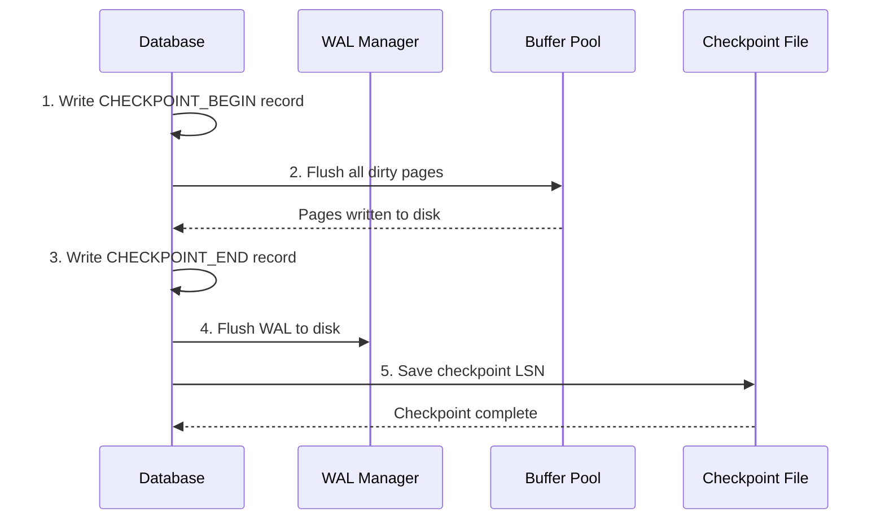

In [Part 3](/2026/03/Database-Rust-MVCC-Transaction-Manager/), we built MVCC for concurrent transactions. But there's a terrifying question we haven't answered.

**What happens when the power goes out?**

```
Transaction: UPDATE accounts SET balance = 1000 WHERE id = 1

1. Read page into buffer pool
2. Modify page in memory (balance = 1000)
3. Mark page as dirty
4. ACK to client: "Done!"
5. ⚡ POWER FAILURE ⚡
6. Dirty page never written to disk
7. Client's money: GONE 💸
```

This is why databases use **WAL: Write-Ahead Logging**.

Today: implementing WAL and the ARIES recovery algorithm in Rust. This is the code that ensures your data survives crashes, power failures, and kernel panics.

---

## 1 The WAL Principle

### The Fundamental Rule

**Write-Ahead Logging:** Before modifying any data page, you MUST write the change to the WAL.

```rust
// ❌ WRONG - data modification before WAL
pub fn update(&self, row_id: RowId, new_data: &[u8]) -> Result<(), Error> {
    let mut page = self.buffer_pool.get_page(row_id.page_id)?;
    page.write(row_id.offset, new_data);  // Modified in memory!
    page.mark_dirty();

    // WAL comes too late
    self.wal.log_update(row_id, new_data)?;  // Too late!

    Ok(())
}

// ✅ CORRECT - WAL first
pub fn update(&self, row_id: RowId, new_data: &[u8]) -> Result<(), Error> {
    // 1. Generate LSN (Log Sequence Number)
    let lsn = self.wal.log_update(row_id, new_data)?;

    // 2. Flush WAL to disk (fsync)
    self.wal.flush(lsn)?;

    // 3. NOW safe to modify page
    let mut page = self.buffer_pool.get_page(row_id.page_id)?;
    page.write(row_id.offset, new_data);
    page.set_lsn(lsn);  // Track which LSN modified this page
    page.mark_dirty();

    Ok(())
}
```

**Why this works:**

```
Crash at different points:

After WAL write, before page modify:
→ Recovery replays WAL, data is restored ✓

After page modify, before flush:
→ WAL on disk, recovery ensures durability ✓

After flush to disk:
→ Data is durable ✓
```

---

### Log Sequence Numbers (LSN)

Every WAL record gets a unique, monotonically increasing identifier:

```rust
// src/wal/lsn.rs
#[derive(Debug, Clone, Copy, PartialEq, Eq, PartialOrd, Ord)]
pub struct Lsn(u64);

impl Lsn {
    pub const INVALID: Lsn = Lsn(0);
    pub const fn new(value: u64) -> Self {
        Self(value)
    }

    pub const fn invalid(&self) -> bool {
        self.0 == 0
    }

    // LSN encoding: segment_id (high 32) + offset (low 32)
    pub const fn from_segment_offset(segment: u32, offset: u32) -> Self {
        Self(((segment as u64) << 32) | (offset as u64))
    }

    pub const fn segment(&self) -> u32 {
        (self.0 >> 32) as u32
    }

    pub const fn offset(&self) -> u32 {
        (self.0 & 0xFFFFFFFF) as u32
    }
}
```

**LSN ordering guarantees:**

```
LSN 100: BEGIN txn 1
LSN 101: INSERT row A (txn 1)
LSN 102: INSERT row B (txn 1)
LSN 103: COMMIT txn 1
LSN 104: BEGIN txn 2
LSN 105: UPDATE row A (txn 2)
...

LSN 100 < LSN 101 < LSN 102 < ...  (strictly increasing)
```

---

## 2 WAL Record Format

### Record Structure

```rust
// src/wal/record.rs
use crate::storage::PageId;
use crate::transaction::TransactionId;

#[derive(Debug, Clone)]
pub struct WalRecord {
    pub lsn: Lsn,
    pub prev_lsn: Lsn,  // Link to previous record from same transaction
    pub transaction_id: TransactionId,
    pub record_type: WalRecordType,
    pub page_id: PageId,
    pub offset: u16,
    pub data: WalData,
    pub checksum: u32,
}

#[derive(Debug, Clone)]
pub enum WalRecordType {
    Begin,
    Insert,
    Update { before_image: Vec<u8>, after_image: Vec<u8> },
    Delete { before_image: Vec<u8> },
    Commit,
    Abort,
    CheckpointBegin,
    CheckpointEnd,
    Compensation { undo_next_lsn: Lsn },  // For aborts
}

#[derive(Debug, Clone)]
pub enum WalData {
    PageImage(Vec<u8>),      // Full page image (for checkpoints)
    RowData(Vec<u8>),        // Row-level change
    IndexEntry { key: Vec<u8>, value: Vec<u8> },
}
```

**Physical layout on disk:**

```
┌─────────────────────────────────────────────────────────────┐
│ WAL Segment File (e.g., 000000010000000000000001)           │
├─────────────────────────────────────────────────────────────┤
│ PageHeader (16 bytes)                                       │
├─────────────────────────────────────────────────────────────┤
│ Record 1:                                                   │
│   ├─ Length (4 bytes)                                       │
│   ├─ LSN (8 bytes)                                          │
│   ├─ Prev LSN (8 bytes)                                     │
│   ├─ Transaction ID (4 bytes)                               │
│   ├─ Record Type (1 byte)                                   │
│   ├─ Page ID (8 bytes)                                      │
│   ├─ Offset (2 bytes)                                       │
│   ├─ Data Length (4 bytes)                                  │
│   ├─ Data (variable)                                        │
│   └─ Checksum (4 bytes)                                     │
├─────────────────────────────────────────────────────────────┤
│ Record 2:                                                   │
│   ...                                                       │
└─────────────────────────────────────────────────────────────┘
```

---

### Physical vs. Logical WAL

**PostgreSQL uses physical WAL** (page-level changes):

| Type | What's Logged | Pros | Cons |
|------|---------------|------|------|
| **Physical** | Byte ranges on pages | Simple replay, exact changes | Larger logs, page-format dependent |
| **Logical** | SQL operations (INSERT/UPDATE) | Smaller logs, format-independent | Complex replay, must re-execute |

**Vaultgres approach:** Physical WAL for simplicity (matching PostgreSQL):

```rust
pub struct PhysicalWalRecord {
    pub page_id: PageId,
    pub offset: u16,
    pub length: u16,
    pub before_image: Option<Vec<u8>>,  // For undo
    pub after_image: Vec<u8>,            // For redo
}
```

---

## 3 WAL Manager Implementation

### Writing WAL Records

```rust
// src/wal/manager.rs
use std::fs::{File, OpenOptions};
use std::io::{Write, Seek, SeekFrom};
use std::path::PathBuf;
use parking_lot::Mutex;

pub struct WalManager {
    wal_dir: PathBuf,
    current_segment: u32,
    current_file: Mutex<File>,
    current_offset: Mutex<u32>,
    flush_lsn: Mutex<Lsn>,
    last_lsn: AtomicU64,
}

impl WalManager {
    pub fn new(wal_dir: &str) -> Result<Self, WalError> {
        std::fs::create_dir_all(wal_dir)?;

        let mut manager = Self {
            wal_dir: PathBuf::from(wal_dir),
            current_segment: 0,
            current_file: Mutex::new(File::create("")?),  // Placeholder
            current_offset: Mutex::new(0),
            flush_lsn: Mutex::new(Lsn::INVALID),
            last_lsn: AtomicU64::new(0),
        };

        manager.open_or_create_segment(0)?;
        Ok(manager)
    }

    fn open_or_create_segment(&mut self, segment: u32) -> Result<(), WalError> {
        let path = self.wal_dir.join(format!("{:024X}", segment));

        let file = OpenOptions::new()
            .read(true)
            .write(true)
            .create(true)
            .open(&path)?;

        *self.current_file.lock() = file;
        self.current_segment = segment;
        *self.current_offset.lock() = 0;

        Ok(())
    }

    pub fn append(&self, record: WalRecord) -> Result<Lsn, WalError> {
        // Assign new LSN
        let lsn = Lsn::new(self.last_lsn.fetch_add(1, Ordering::SeqCst) + 1);

        // Serialize record
        let mut buffer = Vec::new();
        self.serialize_record(&record, lsn, &mut buffer)?;

        // Check if we need a new segment
        let mut offset = self.current_offset.lock();
        if *offset + buffer.len() as u32 > SEGMENT_SIZE {
            drop(offset);
            self.rotate_segment()?;
            offset = self.current_offset.lock();
        }

        // Write to file
        let mut file = self.current_file.lock();
        file.seek(SeekFrom::Start(*offset as u64))?;
        file.write_all(&buffer)?;

        *offset += buffer.len() as u32;

        Ok(lsn)
    }

    pub fn flush(&self, target_lsn: Lsn) -> Result<(), WalError> {
        let mut flush_lsn = self.flush_lsn.lock();

        // Already flushed?
        if *flush_lsn >= target_lsn {
            return Ok(());
        }

        // Sync to disk
        self.current_file.lock().sync_all()?;
        *flush_lsn = target_lsn;

        Ok(())
    }
}
```

---

### Reading WAL Records

```rust
impl WalManager {
    pub fn read_from(&self, start_lsn: Lsn) -> Result<WalIterator, WalError> {
        let segment = start_lsn.segment();
        let offset = start_lsn.offset();

        let path = self.wal_dir.join(format!("{:024X}", segment));
        let file = File::open(&path)?;

        Ok(WalIterator {
            current_file: file,
            current_segment: segment,
            current_offset: offset,
            wal_dir: self.wal_dir.clone(),
        })
    }
}

pub struct WalIterator {
    current_file: File,
    current_segment: u32,
    current_offset: u32,
    wal_dir: PathBuf,
}

impl Iterator for WalIterator {
    type Item = Result<WalRecord, WalError>;

    fn next(&mut self) -> Option<Self::Item> {
        // Try to read record at current position
        match self.read_record() {
            Ok(Some(record)) => Some(Ok(record)),
            Ok(None) => {
                // End of segment, try next segment
                self.current_segment += 1;
                self.current_offset = 0;

                let path = self.wal_dir.join(format!("{:024X}", self.current_segment));
                self.current_file = File::open(&path).ok()?;

                self.read_record().map(|r| r.ok()).flatten()
            }
            Err(e) => Some(Err(e)),
        }
    }
}
```

---

## 4 Checkpoints: Limiting Recovery Time

### The Problem: Unbounded Replay

**Without checkpoints:**

```
Day 1: Database created
Day 30: Crash!
Recovery: Replay 30 days of WAL records 😱
```

**Solution:** Periodic checkpoints.

---

### Checkpoint Process



```rust
// src/wal/checkpoint.rs
pub struct Checkpoint {
    pub checkpoint_lsn: Lsn,
    pub active_transactions: Vec<TransactionId>,
    pub dirty_pages: Vec<(PageId, Lsn)>,  // page_id → page_lsn
}

impl WalManager {
    pub fn create_checkpoint(&self, buffer_pool: &BufferPool) -> Result<Checkpoint, WalError> {
        // 1. Log checkpoint begin
        let begin_lsn = self.append(WalRecord::checkpoint_begin())?;

        // 2. Flush all dirty pages (this is the expensive part!)
        buffer_pool.flush_all()?;

        // 3. Get current state
        let checkpoint = Checkpoint {
            checkpoint_lsn: begin_lsn,
            active_transactions: self.get_active_transactions(),
            dirty_pages: buffer_pool.get_dirty_pages(),
        };

        // 4. Log checkpoint end
        let end_lsn = self.append(WalRecord::checkpoint_end(&checkpoint))?;

        // 5. Flush WAL
        self.flush(end_lsn)?;

        // 6. Save checkpoint to known location
        self.save_checkpoint_record(&checkpoint)?;

        Ok(checkpoint)
    }
}
```

---

### Fuzzy Checkpoints (PostgreSQL Style)

**Sharp checkpoint:** Blocks all writes during checkpoint. Simple but causes pauses.

**Fuzzy checkpoint:** Allows writes during checkpoint. Complex but no pauses.

```rust
// Fuzzy checkpoint approach
pub fn create_fuzzy_checkpoint(&self, buffer_pool: &BufferPool) -> Result<Checkpoint, WalError> {
    // 1. Record checkpoint start LSN
    let start_lsn = self.current_lsn();

    // 2. Write CHECKPOINT_BEGIN (don't block)
    self.append(WalRecord::checkpoint_begin())?;

    // 3. Get list of dirty pages (snapshot)
    let dirty_pages = buffer_pool.get_dirty_pages_snapshot();

    // 4. Flush dirty pages in background (don't block new writes)
    let checkpoint_lsn = self.current_lsn();

    for (page_id, page_lsn) in dirty_pages {
        if page_lsn < checkpoint_lsn {
            buffer_pool.flush_page(page_id)?;
        }
    }

    // 5. Write CHECKPOINT_END with final LSN
    let end_lsn = self.current_lsn();
    self.append(WalRecord::checkpoint_end_at(end_lsn))?;
    self.flush(end_lsn)?;

    Ok(Checkpoint {
        checkpoint_lsn: end_lsn,
        // ...
    })
}
```

---

## 5 ARIES: The Recovery Algorithm

### The Three Phases

ARIES = **A**lgorithm for **R**ecovery and **I**solation **E**xploiting **S**emantics

```
┌─────────────────────────────────────────────────────────────┐
│                    ARIES Recovery                           │
├─────────────────────────────────────────────────────────────┤
│ Phase 1: ANALYSIS                                           │
│ - Scan WAL from last checkpoint                             │
│ - Determine which transactions were active at crash         │
│ - Build dirty page table                                    │
├─────────────────────────────────────────────────────────────┤
│ Phase 2: REDO                                               │
│ - Replay ALL logged changes from analysis end               │
│ - Bring database to exact crash state                       │
│ - Skip pages already on disk (using page LSN)               │
├─────────────────────────────────────────────────────────────┤
│ Phase 3: UNDO                                               │
│ - Roll back all uncommitted transactions                    │
│ - Write Compensation Log Records (CLRs)                     │
│ - Database is now consistent                                │
└─────────────────────────────────────────────────────────────┘
```

---

### Phase 1: Analysis

```rust
// src/recovery/analysis.rs
pub struct AnalysisResult {
    pub transactions_at_crash: HashMap<TransactionId, TxnStatus>,
    pub dirty_page_table: HashMap<PageId, Lsn>,  // page → first LSN that dirtied it
    pub redo_start_lsn: Lsn,
}

pub fn analyze(wal: &WalManager, checkpoint: &Checkpoint) -> Result<AnalysisResult, RecoveryError> {
    let mut txn_status: HashMap<TransactionId, TxnStatus> = HashMap::new();
    let mut dirty_page_table: HashMap<PageId, Lsn> = HashMap::new();

    // Initialize from checkpoint
    for txn in &checkpoint.active_transactions {
        txn_status.insert(*txn, TxnStatus::Active);
    }
    for (page_id, page_lsn) in &checkpoint.dirty_pages {
        dirty_page_table.insert(*page_id, *page_lsn);
    }

    // Scan WAL from checkpoint
    let mut iterator = wal.read_from(checkpoint.checkpoint_lsn)?;

    for record_result in iterator {
        let record = record_result?;

        match record.record_type {
            WalRecordType::Begin => {
                txn_status.insert(record.transaction_id, TxnStatus::Active);
            }
            WalRecordType::Commit => {
                txn_status.insert(record.transaction_id, TxnStatus::Committed);
            }
            WalRecordType::Abort => {
                txn_status.insert(record.transaction_id, TxnStatus::Aborted);
            }
            WalRecordType::Insert | WalRecordType::Update | WalRecordType::Delete => {
                // Track first LSN that dirtied each page
                dirty_page_table.entry(record.page_id)
                    .or_insert(record.lsn);
            }
            _ => {}
        }
    }

    // Find minimum redo LSN
    let redo_start_lsn = dirty_page_table.values()
        .min()
        .copied()
        .unwrap_or(checkpoint.checkpoint_lsn);

    Ok(AnalysisResult {
        transactions_at_crash: txn_status,
        dirty_page_table,
        redo_start_lsn,
    })
}
```

---

### Phase 2: Redo

```rust
// src/recovery/redo.rs
pub fn redo(
    wal: &WalManager,
    buffer_pool: &BufferPool,
    analysis: &AnalysisResult,
) -> Result<(), RecoveryError> {
    let mut iterator = wal.read_from(analysis.redo_start_lsn)?;

    for record_result in iterator {
        let record = record_result?;

        // Only redo committed transactions' changes
        // (We redo ALL changes first, undo uncommitted later)
        match &record.record_type {
            WalRecordType::Insert | WalRecordType::Update | WalRecordType::Delete => {
                // Check if page needs redo
                let page = buffer_pool.get_page(record.page_id)?;
                let page_lsn = page.get_lsn();

                // Only apply if page is older than this LSN
                if page_lsn < record.lsn {
                    apply_redo(&record, &page)?;
                    page.set_lsn(record.lsn);
                }
                // Else: page already has this change (written before crash)
            }
            _ => {}
        }
    }

    Ok(())
}

fn apply_redo(record: &WalRecord, page: &Page) -> Result<(), RecoveryError> {
    match &record.data {
        WalData::PageImage(image) => {
            // Full page image (from checkpoint)
            page.copy_from_slice(image);
        }
        WalData::RowData(data) => {
            // Partial page update
            page.write(record.offset, data);
        }
        _ => {}
    }
    Ok(())
}
```

**Key insight:** Redo is **idempotent**. Running it multiple times produces the same result.

---

### Phase 3: Undo

```rust
// src/recovery/undo.rs
pub fn undo(
    wal: &mut WalManager,
    buffer_pool: &BufferPool,
    analysis: &AnalysisResult,
) -> Result<(), RecoveryError> {
    // Find transactions to undo (active at crash, not committed)
    let losers: Vec<TransactionId> = analysis.transactions_at_crash
        .iter()
        .filter(|(_, status)| **status == TxnStatus::Active)
        .map(|(txn, _)| *txn)
        .collect();

    // Undo in reverse order (LIFO - Last Committed, First Undone)
    for txn_id in losers.into_iter().rev() {
        undo_transaction(wal, buffer_pool, txn_id)?;
    }

    Ok(())
}

fn undo_transaction(
    wal: &mut WalManager,
    buffer_pool: &BufferPool,
    txn_id: TransactionId,
) -> Result<(), RecoveryError> {
    // Find all records for this transaction (in reverse)
    let records = wal.get_transaction_records(txn_id)?;

    for record in records.iter().rev() {
        // Write Compensation Log Record (CLR)
        let clr = WalRecord {
            lsn: wal.next_lsn(),
            prev_lsn: record.lsn,
            transaction_id: txn_id,
            record_type: WalRecordType::Compensation {
                undo_next_lsn: record.prev_lsn,
            },
            page_id: record.page_id,
            offset: record.offset,
            data: WalData::RowData(record.before_image.clone().unwrap_or_default()),
            checksum: 0,  // Calculate checksum
        };

        let clr_lsn = wal.append(clr)?;

        // Apply undo (restore before_image)
        if let Some(before_image) = &record.before_image {
            let page = buffer_pool.get_page(record.page_id)?;
            page.write(record.offset, before_image);
            page.set_lsn(clr_lsn);
        }
    }

    // Log transaction abort
    wal.append(WalRecord::abort(txn_id))?;
    wal.flush_all()?;

    Ok(())
}
```

---

### Complete Recovery Process

```rust
// src/recovery/mod.rs
pub fn recover(
    wal: &mut WalManager,
    buffer_pool: &BufferPool,
    data_dir: &str,
) -> Result<RecoveryStats, RecoveryError> {
    // 1. Find last checkpoint
    let checkpoint = find_last_checkpoint(wal, data_dir)?;

    println!("Starting recovery from checkpoint LSN {}", checkpoint.checkpoint_lsn);

    // 2. Phase 1: Analysis
    println!("Phase 1: Analysis...");
    let analysis = analyze(wal, &checkpoint)?;
    println!("  Found {} active transactions at crash",
             analysis.transactions_at_crash.len());
    println!("  Redo will start from LSN {}", analysis.redo_start_lsn);

    // 3. Phase 2: Redo
    println!("Phase 2: Redo...");
    redo(wal, buffer_pool, &analysis)?;
    println!("  Redo complete");

    // 4. Phase 3: Undo
    println!("Phase 3: Undo...");
    undo(wal, buffer_pool, &analysis)?;
    println!("  Undo complete");

    // 5. Truncate old WAL (optional)
    truncate_wal_before(wal, checkpoint.checkpoint_lsn)?;

    Ok(RecoveryStats {
        checkpoint_lsn: checkpoint.checkpoint_lsn,
        redo_start_lsn: analysis.redo_start_lsn,
        transactions_aborted: analysis.transactions_at_crash
            .iter()
            .filter(|(_, s)| **s == TxnStatus::Active)
            .count(),
    })
}
```

---

## 6 Recovery Example: Step by Step

### Crash Scenario

```
Time    LSN    Transaction    Action
─────────────────────────────────────────────────────
10:00   100    CKPT           Checkpoint created
10:01   101    T1 (xid=1)     BEGIN
10:02   102    T1             INSERT row A (balance=100)
10:03   103    T2 (xid=2)     BEGIN
10:04   104    T2             INSERT row B (balance=200)
10:05   105    T1             COMMIT
10:06   106    T2             UPDATE row B (balance=250)
10:07   ─────  ⚡ CRASH ⚡
```

**State at crash:**
- T1: Committed (LSN 105)
- T2: Active (not committed)
- Dirty pages: A (LSN 102), B (LSN 106)

---

### Recovery Execution

```
┌─────────────────────────────────────────────────────────────┐
│ Phase 1: ANALYSIS                                           │
├─────────────────────────────────────────────────────────────┤
│ Start from checkpoint LSN 100                               │
│ Scan records 100-106                                        │
│                                                             │
│ Result:                                                     │
│   - T1: Committed (LSN 105)                                 │
│   - T2: Active (loser!)                                     │
│   - Dirty pages: A→102, B→106                               │
│   - Redo start: LSN 102                                     │
└─────────────────────────────────────────────────────────────┘

┌─────────────────────────────────────────────────────────────┐
│ Phase 2: REDO                                               │
├─────────────────────────────────────────────────────────────┤
│ Replay from LSN 102:                                        │
│                                                             │
│ LSN 102: INSERT row A                                       │
│   → Check page A LSN                                        │
│   → If page LSN < 102: apply insert                         │
│   → Else: skip (already on disk)                            │
│                                                             │
│ LSN 104: INSERT row B                                       │
│   → Apply if needed                                         │
│                                                             │
│ LSN 106: UPDATE row B                                       │
│   → Apply if needed                                         │
│                                                             │
│ Result: Database at exact crash state                       │
└─────────────────────────────────────────────────────────────┘

┌─────────────────────────────────────────────────────────────┐
│ Phase 3: UNDO                                               │
├─────────────────────────────────────────────────────────────┤
│ Loser transactions: T2                                      │
│                                                             │
│ Undo T2 (in reverse order):                                 │
│   1. Undo LSN 106 (UPDATE B: 200→250)                       │
│      → Write CLR: undo_next_lsn = 104                       │
│      → Restore B to balance=200                             │
│                                                             │
│   2. Undo LSN 104 (INSERT B)                                │
│      → Write CLR: undo_next_lsn = 103                       │
│      → Delete row B                                         │
│                                                             │
│   3. Log T2 ABORT                                           │
│                                                             │
│ Result: T2's changes rolled back, T1's changes preserved    │
└─────────────────────────────────────────────────────────────┘
```

---

## 7 WAL Archiving and Point-in-Time Recovery

### WAL Archiving

**Continuous archiving:** Copy WAL segments to safe storage before reuse.

```rust
// src/wal/archiver.rs
pub struct WalArchiver {
    wal_dir: PathBuf,
    archive_dir: PathBuf,
    archive_timeout: Duration,
    last_archived_segment: u32,
}

impl WalArchiver {
    pub fn archive_ready_segments(&mut self) -> Result<(), WalError> {
        // Find completed segments (can't be overwritten)
        for segment in self.get_ready_segments() {
            let src = self.wal_dir.join(format!("{:024X}", segment));
            let dst = self.archive_dir.join(format!("{:024X}.backup", segment));

            // Copy to archive (could be remote storage like S3)
            std::fs::copy(&src, &dst)?;

            self.last_archived_segment = segment;
        }

        Ok(())
    }
}
```

---

### Point-in-Time Recovery (PITR)

```
Goal: Restore database to state at 2026-03-22 14:30:00

1. Restore base backup from 2026-03-22 00:00:00
2. Replay WAL segments from archive
3. Stop replay at target time (14:30:00)
4. Database restored to exact point in time
```

```rust
// src/recovery/pitr.rs
pub fn recover_to_point_in_time(
    base_backup: &str,
    archive_dir: &str,
    target_time: chrono::DateTime<chrono::Utc>,
) -> Result<(), RecoveryError> {
    // 1. Restore base backup
    restore_base_backup(base_backup)?;

    // 2. Find WAL segments to replay
    let segments = find_wal_segments_for_time_range(archive_dir, target_time)?;

    // 3. Replay WAL up to target time
    for segment in segments {
        let records = read_wal_segment(&segment)?;

        for record in records {
            // Check if we've passed target time
            if record.timestamp > target_time {
                println!("Reached target time, stopping recovery");
                return Ok(());
            }

            apply_redo_record(&record)?;
        }
    }

    Ok(())
}
```

---

## 8 Challenges Building in Rust

### Challenge 1: fsync and Durability

**Problem:** Rust's `File::sync_all()` is correct, but easy to forget.

```rust
// ❌ Missing fsync - data NOT durable!
pub fn commit(&self, txn_id: TransactionId) -> Result<(), Error> {
    let record = WalRecord::commit(txn_id);
    self.wal.append(record)?;
    // Forgot to flush!
    Ok(())
}

// ✅ Correct
pub fn commit(&self, txn_id: TransactionId) -> Result<(), Error> {
    let record = WalRecord::commit(txn_id);
    let lsn = self.wal.append(record)?;
    self.wal.flush(lsn)?;  // fsync!
    Ok(())
}
```

**Lesson:** Wrap WAL operations in safe abstractions that enforce flushing.

---

### Challenge 2: LSN Ordering and Concurrency

**Problem:** Multiple threads appending WAL records must get monotonically increasing LSNs.

```rust
// ❌ Race condition - LSNs not ordered!
pub fn append(&self, record: WalRecord) -> Lsn {
    let lsn = self.current_lsn + 1;  // Not atomic!
    self.current_lsn = lsn;
    // ...
}

// ✅ Correct - atomic LSN allocation
pub fn append(&self, record: WalRecord) -> Result<Lsn, WalError> {
    let lsn = Lsn::new(self.last_lsn.fetch_add(1, Ordering::SeqCst) + 1);
    // ...
}
```

---

### Challenge 3: Partial Writes and Checksums

**Problem:** Crash during WAL write = partial record on disk.

```rust
// Solution: Checksums + length prefix
pub fn serialize_record(record: &WalRecord, buffer: &mut Vec<u8>) {
    let data_start = buffer.len();

    // Write placeholder for length (fill in later)
    buffer.extend_from_slice(&[0u8; 4]);

    // Write record fields
    buffer.extend_from_slice(&record.lsn.to_le_bytes());
    // ... more fields ...
    buffer.extend_from_slice(&record.data);

    // Calculate checksum over everything except checksum field
    let checksum = crc32::calculate(&buffer[data_start + 4..]);
    buffer.extend_from_slice(&checksum.to_le_bytes());

    // Fill in length
    let total_len = buffer.len() - data_start;
    buffer[data_start..data_start + 4]
        .copy_from_slice(&(total_len as u32).to_le_bytes());
}

pub fn deserialize_record(buffer: &[u8]) -> Result<WalRecord, WalError> {
    // Read length
    let length = u32::from_le_bytes(buffer[0..4].try_into()?) as usize;

    // Verify we have enough data
    if buffer.len() < length {
        return Err(WalError::PartialWrite);
    }

    // Verify checksum
    let stored_checksum = u32::from_le_bytes(
        buffer[length - 4..length].try_into()?
    );
    let calculated = crc32::calculate(&buffer[4..length - 4]);

    if stored_checksum != calculated {
        return Err(WalError::ChecksumMismatch);
    }

    // ... parse record ...
}
```

---

## 9 How AI Accelerated This

### What AI Got Right

| Task | AI Contribution |
|------|-----------------|
| **ARIES phases** | Explained analysis/redo/undo clearly |
| **LSN structure** | Suggested segment/offset encoding |
| **Checkpoint design** | Outlined fuzzy vs. sharp trade-offs |
| **CLR records** | Explained compensation log record purpose |

---

### What AI Got Wrong

| Issue | What Happened |
|-------|---------------|
| **Redo logic** | First draft redid only committed txns (wrong! Redo ALL, then undo) |
| **Undo order** | Suggested forward order instead of reverse (LIFO) |
| **Page LSN** | Missed that page LSN is used to skip redundant redos |

**Pattern:** ARIES is subtle. The "redo all, undo some" insight is counterintuitive.

---

### Example: Understanding Redo Philosophy

**My question to AI:**

> "Why does ARIES redo uncommitted transactions? Shouldn't we only redo committed ones?"

**What I learned:**

1. **Redo phase:** Bring database to exact crash state (including uncommitted changes)
2. **Undo phase:** Roll back uncommitted transactions
3. **Why?** Simpler than tracking dependencies during redo
4. **Key insight:** Redo is idempotent, undo must be logged (CLRs)

**Result:** Correct redo implementation:

```rust
// Redo ALL records, not just committed
if page_lsn < record.lsn {
    apply_redo(&record, &page)?;  // Apply regardless of txn status
}
// Undo phase will handle uncommitted transactions
```

---

## Summary: WAL and ARIES in One Diagram


**Key Takeaways:**

| Concept | Why It Matters |
|---------|----------------|
| **WAL** | Durability without sacrificing performance |
| **LSN** | Total ordering of all changes |
| **Checkpoints** | Bound recovery time |
| **ARIES Analysis** | Determine what needs recovery |
| **ARIES Redo** | Replay to exact crash state |
| **ARIES Undo** | Roll back uncommitted work |
| **CLRs** | Idempotent undo, prevents re-undo |

---

**Further Reading:**

- "ARIES: A Transaction Recovery Method Supporting Fine Granularity Locking" by Mohan et al. (1992)
- PostgreSQL Source: [`src/backend/access/transam/xlog.c`](https://github.com/postgres/postgres/blob/master/src/backend/access/transam/xlog.c)
- PostgreSQL Source: [`src/backend/access/transam/xlogfuncs.c`](https://github.com/postgres/postgres/blob/master/src/backend/access/transam/xlogfuncs.c)
- "Database Management Systems" by Ramakrishnan (Ch. 17: Recovery)
- "Readings in Database Systems" (Red Book) - ARIES chapter
- Vaultgres Repository: [github.com/neoalienson/Vaultgres](https://github.com/neoalienson/Vaultgres)
