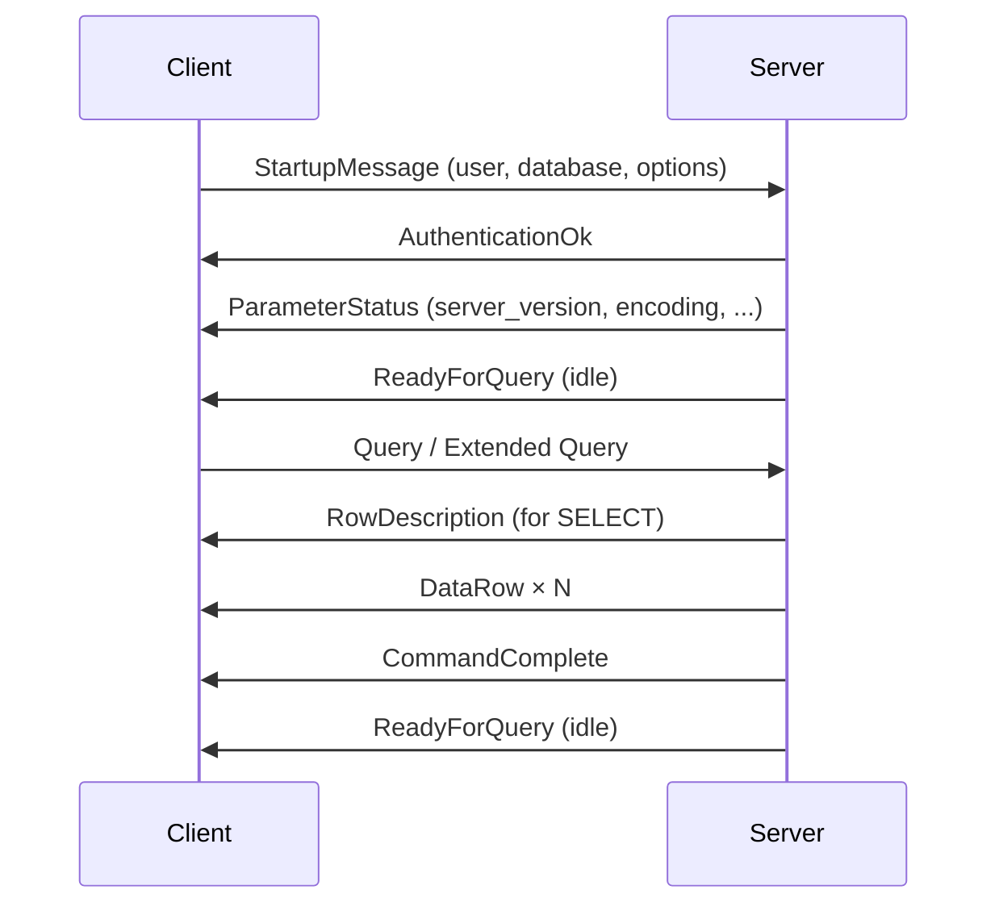
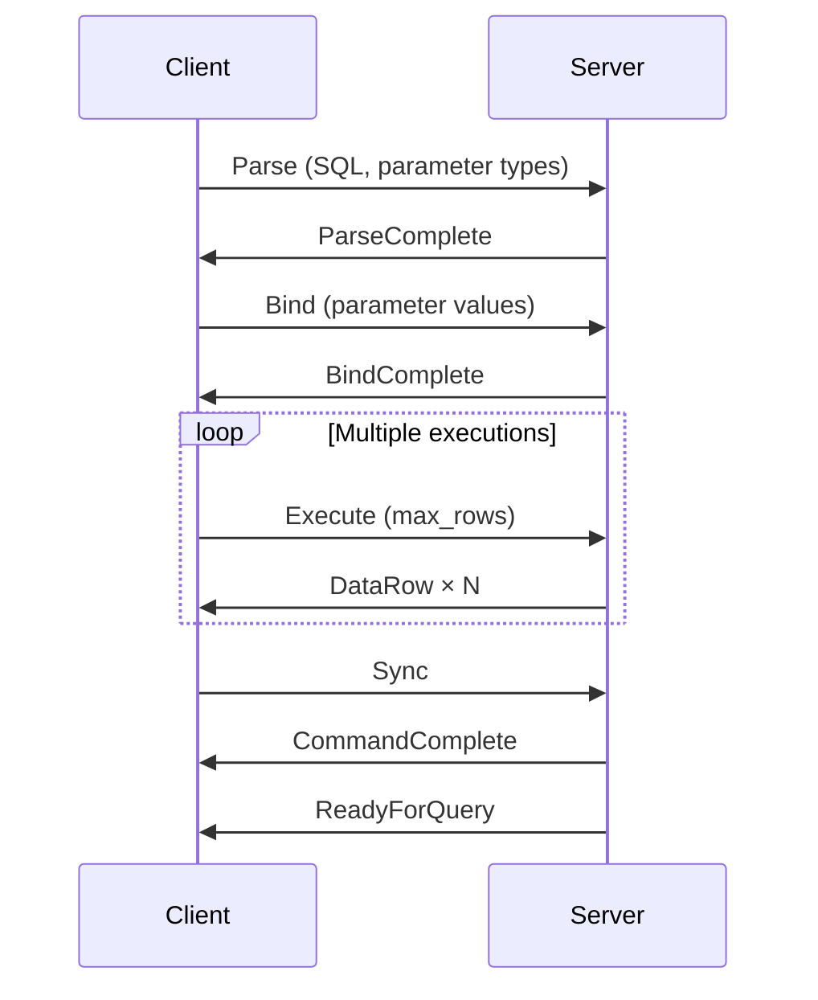
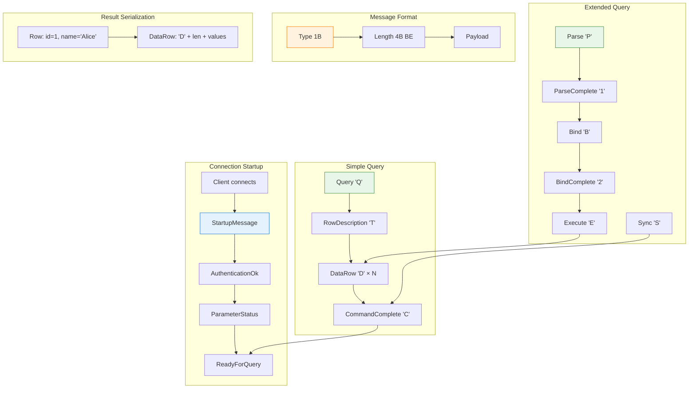

在 [第四部分](/zh-TW/2026/03/Building-PostgreSQL-Compatible-Database-Rust-WAL-Crash-Recovery-ARIES/) 中，我們建構了 WAL 和崩潰恢復。我們的資料庫現在可以在停電中存活。但有個問題。

**客戶端實際上如何與我們的資料庫對話？**

```
┌─────────────┐                          ┌─────────────┐
│   psql      │                          │  Vaultgres  │
│   client    │                          │   server    │
│             │     ??? How to talk ???  │             │
└─────────────┘                          └─────────────┘
```

我們可以發明自己的協定。但那樣我們就必須從頭建構客戶端。

**更好的方法：** 說 PostgreSQL 的通訊協定。然後 `psql`、JDBC、libpq——所有現有工具——都能直接用。

今天：在 Rust 中實作 PostgreSQL 通訊協定，從啟動握手到結果集序列化。

---

## 1 通訊協定概述

### Frontend/Backend 模型

PostgreSQL 使用 **frontend/backend** 架構：

```
┌─────────────────────────────────────────────────────────────┐
│                    PostgreSQL Protocol                       │
├─────────────────────────────────────────────────────────────┤
│                                                              │
│  Frontend (Client)          Backend (Server)                │
│  - psql                     - Vaultgres                     │
│  - libpq (C driver)         - Query processor               │
│  - JDBC/ODBC              - Storage engine                 │
│  - psycopg (Python)         - Transaction manager           │
│                                                              │
│  Communication: TCP/IP (usually port 5432)                  │
│  Message format: Length-prefixed binary protocol            │
│                                                              │
└─────────────────────────────────────────────────────────────┘
```

---

### 訊息結構

每個訊息都有相同的格式：

```
┌─────────────────────────────────────────────────────────────┐
│ Message Format                                              │
├─────────────────────────────────────────────────────────────┤
│ ┌─────────────┬─────────────────────────────────────────┐   │
│ │ Type (1B)   │ Length (4B, includes itself)            │   │
│ ├─────────────┴─────────────────────────────────────────┤   │
│ │ Payload (variable)                                     │   │
│ └─────────────────────────────────────────────────────────┘   │
└─────────────────────────────────────────────────────────────┘

Example: SimpleQuery ('Q')
┌─────────────────────────────────────────────────────────────┐
│ 'Q' │ 0x00 0x00 0x00 0x1A │ "SELECT * FROM users\0"        │
│  1B │      4B (26 bytes)   │ variable (null-terminated)     │
└─────────────────────────────────────────────────────────────┘
```

**關鍵洞察：** 長度是**大端序**（網路位元組順序）且**包含自身**（不包含類型位元組）。

---

### 訊息類型

| 類型 | 代碼 | 方向 | 目的 |
|------|------|-----------|---------|
| **StartupMessage** | (none) | F→B | 初始連接（無類型位元組） |
| **AuthenticationOk** | 'R' | B→F | 登入成功 |
| **Query** | 'Q' | F→B | 簡單查詢（SQL 字串） |
| **RowDescription** | 'T' | B→F | 欄位元資料 |
| **DataRow** | 'D' | B→F | 實際列資料 |
| **CommandComplete** | 'C' | B→F | 查詢完成 |
| **ReadyForQuery** | 'Z' | B→F | 伺服器準備好下一個查詢 |
| **ErrorResponse** | 'E' | B→F | 出錯了 |
| **Parse** | 'P' | F→B | 擴充查詢：準備 |
| **Bind** | 'B' | F→B | 擴充查詢：綁定參數 |
| **Execute** | 'E' | F→B | 擴充查詢：執行 |
| **Sync** | 'S' | F→B | 擴充查詢：完成批次 |

F→B = Frontend to Backend, B→F = Backend to Frontend

---

## 2 連接啟動

### 握手流程



---

### StartupMessage

第一個訊息很特殊——**沒有類型位元組**，只有長度：

```
┌─────────────────────────────────────────────────────────────┐
│ StartupMessage                                              │
├─────────────────────────────────────────────────────────────┤
│ Length (4B): 8 + parameters                                 │
│ Protocol Version (4B): 196608 (3.0)                         │
│ Parameters (null-terminated key=value pairs):               │
│   "user\0neo\0database\0vaultgres\0\0"                      │
└─────────────────────────────────────────────────────────────┘
```

```rust
// src/wire_protocol/startup.rs
use tokio::io::{AsyncReadExt, AsyncWriteExt};
use tokio::net::TcpStream;

pub struct StartupMessage {
    pub user: String,
    pub database: String,
    pub options: HashMap<String, String>,
}

impl StartupMessage {
    pub async fn read_from(stream: &mut TcpStream) -> Result<Self, ProtocolError> {
        // Read length (4 bytes, big-endian)
        let mut len_buf = [0u8; 4];
        stream.read_exact(&mut len_buf).await?;
        let len = u32::from_be_bytes(len_buf);

        // Read protocol version
        let mut version_buf = [0u8; 4];
        stream.read_exact(&mut version_buf).await?;
        let version = u32::from_be_bytes(version_buf);

        if version != 196608 {
            return Err(ProtocolError::UnsupportedVersion(version));
        }

        // Read parameters (null-terminated key=value pairs)
        let mut params = HashMap::new();
        let mut remaining = len - 8;  // Subtract length and version bytes

        while remaining > 1 {
            let mut key = Vec::new();
            let mut byte = [0u8; 1];
            
            loop {
                stream.read_exact(&mut byte).await?;
                remaining -= 1;
                if byte[0] == 0 { break; }
                key.push(byte[0]);
            }

            if key.is_empty() { break; }  // Empty key = end of parameters

            let mut value = Vec::new();
            loop {
                stream.read_exact(&mut byte).await?;
                remaining -= 1;
                if byte[0] == 0 { break; }
                value.push(byte[0]);
            }

            let key = String::from_utf8(key)?;
            let value = String::from_utf8(value)?;
            params.insert(key, value);
        }

        Ok(Self {
            user: params.remove("user").unwrap_or_default(),
            database: params.remove("database").unwrap_or_default(),
            options: params,
        })
    }
}
```

---

### Authentication 和 ParameterStatus

```rust
// src/wire_protocol/messages.rs
pub struct MessageBuilder {
    buffer: Vec<u8>,
}

impl MessageBuilder {
    pub fn new() -> Self {
        Self { buffer: Vec::new() }
    }

    pub fn authentication_ok(&mut self) -> &[u8] {
        // 'R' (1B) + Length (4B) + Auth Type (4B = 0 for Ok)
        self.buffer.clear();
        self.buffer.push(b'R');
        self.buffer.extend_from_slice(&12u32.to_be_bytes());  // Length
        self.buffer.extend_from_slice(&0u32.to_be_bytes());   // AuthOk
        &self.buffer
    }

    pub fn parameter_status(&mut self, name: &str, value: &str) -> &[u8] {
        // 'S' (1B) + Length (4B) + name\0 + value\0
        self.buffer.clear();
        self.buffer.push(b'S');
        
        let payload_len = 4 + name.len() + 1 + value.len() + 1;
        self.buffer.extend_from_slice(&(payload_len as u32).to_be_bytes());
        self.buffer.extend_from_slice(name.as_bytes());
        self.buffer.push(0);
        self.buffer.extend_from_slice(value.as_bytes());
        self.buffer.push(0);
        
        &self.buffer
    }

    pub fn ready_for_query(&mut self, status: TransactionStatus) -> &[u8] {
        // 'Z' (1B) + Length (4B) + Status (1B)
        self.buffer.clear();
        self.buffer.push(b'Z');
        self.buffer.extend_from_slice(&5u32.to_be_bytes());
        self.buffer.push(status as u8);
        &self.buffer
    }
}

#[derive(Debug, Clone, Copy)]
#[repr(u8)]
pub enum TransactionStatus {
    Idle = b'I',
    InTransaction = b'T',
    InFailedTransaction = b'E',
}
```

**伺服器發送這些參數：**

| 參數 | 值 | 目的 |
|-----------|-------|---------|
| `server_version` | `16.0` | 我們模擬的 PostgreSQL 版本 |
| `server_encoding` | `UTF8` | 字元編碼 |
| `client_encoding` | `UTF8` | 客戶端的編碼 |
| `integer_datetimes` | `on` | 64 位元整數時間戳 |

---

## 3 簡單查詢協定

### 查詢流程

```
Client: Query("SELECT id, name FROM users WHERE id = 1")
Server: RowDescription (column metadata)
Server: DataRow (row 1)
Server: DataRow (row 2)
...
Server: CommandComplete ("SELECT 2")
Server: ReadyForQuery ('I')
```

---

### RowDescription：告訴客戶端關於欄位

```rust
// src/wire_protocol/row_description.rs
pub struct FieldDescription {
    pub name: String,
    pub table_oid: u32,
    pub column_attr_num: i16,
    pub type_oid: u32,
    pub type_size: i16,
    pub type_modifier: i32,
    pub format_code: i16,  // 0 = text, 1 = binary
}

pub struct RowDescription {
    pub fields: Vec<FieldDescription>,
}

impl RowDescription {
    pub fn serialize(&self, builder: &mut MessageBuilder) -> &[u8] {
        // 'T' (1B) + Length (4B) + Num Fields (2B) + Fields...
        builder.buffer.clear();
        builder.buffer.push(b'T');
        
        // Calculate payload length
        let payload_len = 2 + (self.fields.len() * 19) + 
            self.fields.iter().map(|f| f.name.len() + 1).sum::<usize>();
        
        builder.buffer.extend_from_slice(&(payload_len as u32).to_be_bytes());
        builder.buffer.extend_from_slice(&(self.fields.len() as i16).to_be_bytes());
        
        for field in &self.fields {
            builder.buffer.extend_from_slice(field.name.as_bytes());
            builder.buffer.push(0);  // Null terminator
            builder.buffer.extend_from_slice(&field.table_oid.to_be_bytes());
            builder.buffer.extend_from_slice(&field.column_attr_num.to_be_bytes());
            builder.buffer.extend_from_slice(&field.type_oid.to_be_bytes());
            builder.buffer.extend_from_slice(&field.type_size.to_be_bytes());
            builder.buffer.extend_from_slice(&field.type_modifier.to_be_bytes());
            builder.buffer.extend_from_slice(&field.format_code.to_be_bytes());
        }
        
        &builder.buffer
    }
}
```

**範例輸出：**

```
SELECT id, name FROM users

RowDescription:
┌─────────────────────────────────────────────────────────────┐
│ 'T' │ Length │ 2 fields                                     │
├─────────────────────────────────────────────────────────────┤
│ Field 1: "id"                                               │
│   table_oid: 16384                                          │
│   column_attr_num: 1                                        │
│   type_oid: 23 (INT4)                                       │
│   type_size: 4                                              │
│   type_modifier: -1                                         │
│   format_code: 0 (text)                                     │
├─────────────────────────────────────────────────────────────┤
│ Field 2: "name"                                             │
│   table_oid: 16384                                          │
│   column_attr_num: 2                                        │
│   type_oid: 25 (TEXT)                                       │
│   type_size: -1 (variable)                                  │
│   type_modifier: -1                                         │
│   format_code: 0 (text)                                     │
└─────────────────────────────────────────────────────────────┘
```

---

### DataRow：序列化實際列

```rust
// src/wire_protocol/data_row.rs
pub struct DataRow {
    pub values: Vec<Option<Vec<u8>>>,  // None = NULL
    pub format_codes: Vec<i16>,
}

impl DataRow {
    pub fn serialize(&self, builder: &mut MessageBuilder) -> &[u8] {
        // 'D' (1B) + Length (4B) + Num Values (2B) + Values...
        builder.buffer.clear();
        builder.buffer.push(b'D');
        
        // Calculate payload length
        let mut payload_len = 2u32;  // Num values
        for value in &self.values {
            payload_len += 4;  // Length prefix
            if let Some(data) = value {
                payload_len += data.len() as u32;
            }
        }
        
        builder.buffer.extend_from_slice(&payload_len.to_be_bytes());
        builder.buffer.extend_from_slice(&(self.values.len() as i16).to_be_bytes());
        
        for value in &self.values {
            match value {
                None => {
                    // NULL: length = -1
                    builder.buffer.extend_from_slice(&(-1i32).to_be_bytes());
                }
                Some(data) => {
                    // Non-NULL: length + data
                    builder.buffer.extend_from_slice(&(data.len() as i32).to_be_bytes());
                    builder.buffer.extend_from_slice(data);
                }
            }
        }
        
        &builder.buffer
    }
}
```

**範例：**

```
Row: id=1, name="Alice", email=NULL

DataRow:
┌─────────────────────────────────────────────────────────────┐
│ 'D' │ Length │ 3 values                                     │
├─────────────────────────────────────────────────────────────┤
│ Value 1: 4 bytes │ "1"                                      │
│ Value 2: 5 bytes │ "Alice"                                  │
│ Value 3: -1 (NULL)                                          │
└─────────────────────────────────────────────────────────────┘
```

---

### 文字 vs. 二進位格式

**文字格式（format_code = 0）：** 可讀字串

```
INT4: "42"
TEXT: "Alice"
TIMESTAMP: "2026-03-29 14:30:00.123456+00"
```

**二進位格式（format_code = 1）：** 原生表示

```rust
// src/wire_protocol/type_encoding.rs
pub fn encode_int4(value: i32, format: i16) -> Vec<u8> {
    match format {
        0 => value.to_string().into_bytes(),  // Text
        1 => value.to_be_bytes().to_vec(),    // Binary
        _ => panic!("Invalid format code"),
    }
}

pub fn encode_text(value: &str, format: i16) -> Vec<u8> {
    match format {
        0 => value.as_bytes().to_vec(),       // Text (UTF-8)
        1 => {
            // Binary: 4-byte length prefix + data
            let mut buf = Vec::new();
            buf.extend_from_slice(&(value.len() as i32).to_be_bytes());
            buf.extend_from_slice(value.as_bytes());
            buf
        }
        _ => panic!("Invalid format code"),
    }
}

pub fn encode_timestamp(value: chrono::DateTime<chrono::Utc>, format: i16) -> Vec<u8> {
    match format {
        0 => value.format("%Y-%m-%d %H:%M:%S%.6f%z").to_string().into_bytes(),
        1 => {
            // PostgreSQL epoch: 2000-01-01 00:00:00 UTC
            let epoch = chrono::DateTime::from_timestamp(946684800, 0).unwrap();
            let micros = value.signed_duration_since(epoch).num_microseconds().unwrap();
            micros.to_be_bytes().to_vec()
        }
        _ => panic!("Invalid format code"),
    }
}
```

---

## 4 擴充查詢協定

### 為什麼需要擴充查詢？

**簡單查詢：** SQL 注入風險，無預備語句

```
Client: Query("SELECT * FROM users WHERE id = " + user_input)
→ SQL injection vulnerability!
```

**擴充查詢：** 預備語句，參數綁定

```
Client: Parse("SELECT * FROM users WHERE id = $1")
Client: Bind([42])
Client: Execute()
→ Safe from SQL injection!
```

---

### 擴充查詢流程



---

### Parse：準備語句

```rust
// src/wire_protocol/parse.rs
pub struct ParseMessage {
    pub statement_name: String,
    pub query: String,
    pub parameter_types: Vec<u32>,  // OID for each parameter
}

impl ParseMessage {
    pub async fn read_from(stream: &mut TcpStream) -> Result<Self, ProtocolError> {
        // statement_name (null-terminated)
        let statement_name = read_null_terminated(stream).await?;
        
        // query (null-terminated)
        let query = read_null_terminated(stream).await?;
        
        // num_parameter_types (2B)
        let mut num_types_buf = [0u8; 2];
        stream.read_exact(&mut num_types_buf).await?;
        let num_types = i16::from_be_bytes(num_types_buf);
        
        // parameter_types (4B each)
        let mut parameter_types = Vec::new();
        for _ in 0..num_types {
            let mut type_buf = [0u8; 4];
            stream.read_exact(&mut type_buf).await?;
            parameter_types.push(u32::from_be_bytes(type_buf));
        }
        
        Ok(Self {
            statement_name,
            query,
            parameter_types,
        })
    }
}

// Server response
pub fn parse_complete(builder: &mut MessageBuilder) -> &[u8] {
    // '1' (1B) + Length (4B = 4)
    builder.buffer.clear();
    builder.buffer.push(b'1');
    builder.buffer.extend_from_slice(&4u32.to_be_bytes());
    &builder.buffer
}
```

---

### Bind：建立 Portal

```rust
// src/wire_protocol/bind.rs
pub struct BindMessage {
    pub portal_name: String,
    pub statement_name: String,
    pub parameter_format_codes: Vec<i16>,
    pub parameter_values: Vec<Option<Vec<u8>>>,
    pub result_format_codes: Vec<i16>,
}

impl BindMessage {
    pub async fn read_from(stream: &mut TcpStream) -> Result<Self, ProtocolError> {
        // portal_name (null-terminated)
        let portal_name = read_null_terminated(stream).await?;
        
        // statement_name (null-terminated)
        let statement_name = read_null_terminated(stream).await?;
        
        // num_parameter_format_codes (2B)
        let num_formats = read_i16(stream).await?;
        
        // parameter_format_codes
        let mut parameter_format_codes = Vec::new();
        for _ in 0..num_formats {
            parameter_format_codes.push(read_i16(stream).await?);
        }
        
        // num_parameter_values (2B)
        let num_values = read_i16(stream).await?;
        
        // parameter_values
        let mut parameter_values = Vec::new();
        for _ in 0..num_values {
            let len = read_i32(stream).await?;
            if len == -1 {
                parameter_values.push(None);  // NULL
            } else {
                let mut data = vec![0u8; len as usize];
                stream.read_exact(&mut data).await?;
                parameter_values.push(Some(data));
            }
        }
        
        // num_result_format_codes (2B)
        let num_result_formats = read_i16(stream).await?;
        
        // result_format_codes
        let mut result_format_codes = Vec::new();
        for _ in 0..num_result_formats {
            result_format_codes.push(read_i16(stream).await?);
        }
        
        Ok(Self {
            portal_name,
            statement_name,
            parameter_format_codes,
            parameter_values,
            result_format_codes,
        })
    }
}

// Server response
pub fn bind_complete(builder: &mut MessageBuilder) -> &[u8] {
    // '2' (1B) + Length (4B = 4)
    builder.buffer.clear();
    builder.buffer.push(b'2');
    builder.buffer.extend_from_slice(&4u32.to_be_bytes());
    &builder.buffer
}
```

---

### Execute：執行預備語句

```rust
// src/wire_protocol/execute.rs
pub struct ExecuteMessage {
    pub portal_name: String,
    pub max_rows: i32,  // 0 = all rows
}

impl ExecuteMessage {
    pub async fn read_from(stream: &mut TcpStream) -> Result<Self, ProtocolError> {
        let portal_name = read_null_terminated(stream).await?;
        let max_rows = read_i32(stream).await?;
        
        Ok(Self { portal_name, max_rows })
    }
}
```

**伺服器回應：** DataRow 訊息（沒有特定的 "ExecuteComplete" 訊息）

---

### Sync：完成批次

```rust
// src/wire_protocol/sync.rs
pub struct SyncMessage;

impl SyncMessage {
    pub async fn read_from(_stream: &mut TcpStream) -> Result<Self, ProtocolError> {
        // Sync has no body, just the message header
        Ok(SyncMessage)
    }
}

// Server response
pub fn sync_complete(builder: &mut MessageBuilder, status: TransactionStatus) -> &[u8] {
    // CommandComplete + ReadyForQuery
    builder.buffer.clear();
    
    // CommandComplete: 'C' + Length + "SELECT 2\0"
    builder.buffer.push(b'C');
    let cmd = b"SELECT 2";
    builder.buffer.extend_from_slice(&((cmd.len() + 1) as u32).to_be_bytes());
    builder.buffer.extend_from_slice(cmd);
    builder.buffer.push(0);
    
    &builder.buffer
}
```

---

## 5 完整的查詢執行流程

### 整合在一起

```rust
// src/wire_protocol/handler.rs
use tokio::net::TcpStream;
use crate::query_executor::QueryExecutor;
use crate::storage::buffer_pool::BufferPool;

pub struct ProtocolHandler {
    stream: TcpStream,
    executor: QueryExecutor,
    builder: MessageBuilder,
    prepared_statements: HashMap<String, PreparedStatement>,
    portals: HashMap<String, Portal>,
}

impl ProtocolHandler {
    pub async fn handle_connection(mut stream: TcpStream) -> Result<(), ProtocolError> {
        // 1. Read startup message
        let startup = StartupMessage::read_from(&mut stream).await?;
        
        // 2. Send authentication
        stream.write_all(self.builder.authentication_ok()).await?;
        
        // 3. Send parameter status
        stream.write_all(self.builder.parameter_status("server_version", "16.0")).await?;
        stream.write_all(self.builder.parameter_status("server_encoding", "UTF8")).await?;
        stream.write_all(self.builder.parameter_status("client_encoding", "UTF8")).await?;
        
        // 4. Send ready for query
        stream.write_all(self.builder.ready_for_query(TransactionStatus::Idle)).await?;
        
        // 5. Main message loop
        loop {
            let mut type_buf = [0u8; 1];
            stream.read_exact(&mut type_buf).await?;
            
            match type_buf[0] as char {
                'Q' => self.handle_simple_query(&mut stream).await?,
                'P' => self.handle_parse(&mut stream).await?,
                'B' => self.handle_bind(&mut stream).await?,
                'E' => self.handle_execute(&mut stream).await?,
                'S' => self.handle_sync(&mut stream).await?,
                'X' => {
                    // Terminate
                    return Ok(());
                }
                _ => return Err(ProtocolError::UnknownMessage(type_buf[0])),
            }
        }
    }
    
    async fn handle_simple_query(&mut self, stream: &mut TcpStream) -> Result<(), ProtocolError> {
        // Read query string
        let query = read_null_terminated(stream).await?;
        
        // Execute query
        let result = self.executor.execute(&query).await?;
        
        // Send RowDescription (if SELECT)
        if let Some(columns) = result.columns {
            let row_desc = self.create_row_description(&columns);
            stream.write_all(row_desc.serialize(&mut self.builder)).await?;
            
            // Send DataRows
            for row in result.rows {
                let data_row = self.create_data_row(&row);
                stream.write_all(data_row.serialize(&mut self.builder)).await?;
            }
        }
        
        // Send CommandComplete
        self.builder.command_complete(&result.command_tag);
        stream.write_all(&self.builder.buffer).await?;
        
        // Send ReadyForQuery
        stream.write_all(self.builder.ready_for_query(TransactionStatus::Idle)).await?;
        
        Ok(())
    }
}
```

---

### 結果集序列化範例

```rust
// src/wire_protocol/result_set.rs
pub struct ResultSet {
    pub columns: Vec<Column>,
    pub rows: Vec<Row>,
    pub command_tag: String,
}

pub struct Column {
    pub name: String,
    pub type_oid: u32,
    pub type_size: i16,
}

pub struct Row {
    pub values: Vec<Option<String>>,
}

impl ResultSet {
    pub fn send_to(&self, stream: &mut TcpStream, builder: &mut MessageBuilder) -> Result<(), io::Error> {
        // RowDescription
        let fields: Vec<FieldDescription> = self.columns.iter().map(|col| {
            FieldDescription {
                name: col.name.clone(),
                table_oid: 0,
                column_attr_num: 0,
                type_oid: col.type_oid,
                type_size: col.type_size,
                type_modifier: -1,
                format_code: 0,  // Text format
            }
        }).collect();
        
        let row_desc = RowDescription { fields };
        stream.write_all(row_desc.serialize(builder))?;
        
        // DataRows
        for row in &self.rows {
            let values: Vec<Option<Vec<u8>>> = row.values.iter()
                .map(|v| v.as_ref().map(|s| s.as_bytes().to_vec()))
                .collect();
            
            let data_row = DataRow {
                values,
                format_codes: vec![0; self.columns.len()],
            };
            stream.write_all(data_row.serialize(builder))?;
        }
        
        // CommandComplete
        builder.command_complete(&self.command_tag);
        stream.write_all(&builder.buffer)?;
        
        Ok(())
    }
}

// Usage example
let result = ResultSet {
    columns: vec![
        Column { name: "id".to_string(), type_oid: 23, type_size: 4 },
        Column { name: "name".to_string(), type_oid: 25, type_size: -1 },
    ],
    rows: vec![
        Row { values: vec![Some("1".to_string()), Some("Alice".to_string())] },
        Row { values: vec![Some("2".to_string()), Some("Bob".to_string())] },
    ],
    command_tag: "SELECT 2".to_string(),
};

result.send_to(&mut stream, &mut builder)?;
```

**psql 接收的內容：**

```
┌─────────────────────────────────────────────────────────────┐
│ T (RowDescription)                                          │
│   2 columns: id (INT4), name (TEXT)                         │
├─────────────────────────────────────────────────────────────┤
│ D (DataRow)                                                 │
│   id=1, name="Alice"                                        │
├─────────────────────────────────────────────────────────────┤
│ D (DataRow)                                                 │
│   id=2, name="Bob"                                          │
├─────────────────────────────────────────────────────────────┤
│ C (CommandComplete)                                         │
│   "SELECT 2"                                                │
├─────────────────────────────────────────────────────────────┤
│ Z (ReadyForQuery)                                           │
│   Status: Idle                                              │
└─────────────────────────────────────────────────────────────┘
```

---

## 6 PostgreSQL 類型 OID

### 常見類型

| 類型名稱 | OID | 大小 | 說明 |
|-----------|-----|------|-------------|
| `BOOL` | 16 | 1 | 布林值 |
| `INT2` (SMALLINT) | 21 | 2 | 2 位元組整數 |
| `INT4` (INTEGER) | 23 | 4 | 4 位元組整數 |
| `INT8` (BIGINT) | 20 | 8 | 8 位元組整數 |
| `TEXT` | 25 | -1 | 可變長度文字 |
| `VARCHAR` | 1043 | -1 | 可變長度字元 |
| `TIMESTAMP` | 1114 | 8 | 無時區時間戳 |
| `TIMESTAMPTZ` | 1184 | 8 | 有時區時間戳 |
| `FLOAT4` (REAL) | 700 | 4 | 4 位元組浮點數 |
| `FLOAT8` (DOUBLE) | 701 | 8 | 8 位元組浮點數 |
| `NUMERIC` | 1700 | -1 | 任意精度 |
| `BYTEA` | 17 | -1 | 二進位資料 |
| `OID` | 26 | 4 | 物件識別符 |

```rust
// src/wire_protocol/oids.rs
pub mod oid {
    pub const BOOL: u32 = 16;
    pub const INT2: u32 = 21;
    pub const INT4: u32 = 23;
    pub const INT8: u32 = 20;
    pub const TEXT: u32 = 25;
    pub const VARCHAR: u32 = 1043;
    pub const TIMESTAMP: u32 = 1114;
    pub const TIMESTAMPTZ: u32 = 1184;
    pub const FLOAT4: u32 = 700;
    pub const FLOAT8: u32 = 701;
    pub const NUMERIC: u32 = 1700;
    pub const BYTEA: u32 = 17;
    pub const OID: u32 = 26;
}
```

---

## 7 用 Rust 建構的挑戰

### 挑戰 1：非同步 I/O 和借用

**問題：** tokio 需要 `&mut self` 進行非同步 I/O，但我們需要從 self 借用。

```rust
// ❌ Doesn't compile
impl ProtocolHandler {
    pub async fn handle_query(&mut self) -> Result<(), Error> {
        let query = self.read_query().await?;  // Borrows self
        let result = self.executor.execute(&query).await?;  // Also borrows self!
        // Error: cannot borrow as mutable more than once
    }
}
```

**解決方案：重構以避免同時借用**

```rust
// ✅ Works
impl ProtocolHandler {
    pub async fn handle_query(&mut self) -> Result<(), Error> {
        let query = self.read_query().await?;
        
        // Release borrow before next operation
        let result = {
            self.executor.execute(&query).await?
        };
        
        self.send_result(result).await?;
        Ok(())
    }
}
```

---

### 挑戰 2：零拷貝 vs. 配置

**問題：** 通訊協定訊息需要序列化。拷貝很昂貴。

```rust
// ❌ Allocates on every message
pub fn serialize_row(&self) -> Vec<u8> {
    let mut buffer = Vec::new();
    buffer.push(b'D');
    // ... lots of allocations ...
    buffer
}
```

**解決方案：重用緩衝區**

```rust
// ✅ Reuses allocated buffer
pub struct MessageBuilder {
    buffer: Vec<u8>,  // Pre-allocated, reused
}

impl MessageBuilder {
    pub fn with_capacity(capacity: usize) -> Self {
        Self {
            buffer: Vec::with_capacity(capacity),
        }
    }
    
    pub fn data_row(&mut self, row: &Row) -> &[u8] {
        self.buffer.clear();  // Reuse capacity
        self.buffer.push(b'D');
        // ... write to buffer ...
        &self.buffer  // Return reference, not owned
    }
}
```

---

### 挑戰 3：跨層錯誤處理

**問題：** 通訊協定錯誤、查詢錯誤、儲存錯誤——所有不同的類型。

```rust
// ❌ Error type explosion
pub enum Error {
    Io(io::Error),
    Protocol(ProtocolError),
    Query(QueryError),
    Storage(StorageError),
    Transaction(TransactionError),
    // ... 20 more variants ...
}
```

**解決方案：使用 `thiserror` 和轉換特性**

```rust
// ✅ Clean error handling
#[derive(Debug, thiserror::Error)]
pub enum ProtocolError {
    #[error("IO error: {0}")]
    Io(#[from] io::Error),
    
    #[error("Invalid message type: {0}")]
    UnknownMessage(u8),
    
    #[error("Query error: {0}")]
    Query(#[from] QueryError),
}

// Use ? operator for automatic conversion
pub async fn handle_query(&mut self) -> Result<(), ProtocolError> {
    let query = self.read_query().await?;  // io::Error → ProtocolError
    let result = self.executor.execute(&query).await?;  // QueryError → ProtocolError
    Ok(())
}
```

---

## 8 AI 如何加速這項工作

### AI 做對了什麼

| 任務 | AI 貢獻 |
|------|-----------------|
| **訊息格式** | 正確的大端序編碼 |
| **擴充查詢流程** | Parse → Bind → Execute 順序 |
| **類型 OID** | 準確的 PostgreSQL 類型 OID |
| **NULL 處理** | NULL 的 -1 長度前綴 |

---

### AI 做錯了什麼

| 問題 | 發生什麼事 |
|-------|---------------|
| **長度計算** | 初稿沒有在長度中包含長度位元組 |
| **啟動訊息** | 嘗試添加類型位元組（啟動沒有！） |
| **二進位格式** | 建議小端序（PostgreSQL 使用大端序） |
| **Portal 生命週期** | 忽略了 portal 在 Execute 後被銷毀 |

**模式：** 通訊協定很精確。差一錯誤會破壞一切。

---

### 範例：除錯 psql 連接

**我問 AI 的問題：**

> "psql 連接但立即斷開。什麼錯了？"

**我學到的：**

1. psql 期望特定的 ParameterStatus 訊息
2. 缺少 `server_version` 會導致無聲斷開
3. ReadyForQuery 必須在驗證後發送

**結果：** 添加了必需的參數：

```rust
stream.write_all(self.builder.parameter_status("server_version", "16.0")).await?;
stream.write_all(self.builder.parameter_status("server_encoding", "UTF8")).await?;
stream.write_all(self.builder.parameter_status("client_encoding", "UTF8")).await?;
stream.write_all(self.builder.ready_for_query(TransactionStatus::Idle)).await?;
```

**現在 psql 連接成功！**

```
$ psql -h localhost -p 5432 -U neo vaultgres
psql (16.0, server 16.0 (Vaultgres))
Type "help" for help.

vaultgres=> SELECT 1;
 ?column? 
----------
        1
(1 row)
```

---

## 總結：通訊協定一張圖



**關鍵要點：**

| 概念 | 為什麼重要 |
|---------|----------------|
| **通訊協定** | 與現有 PostgreSQL 工具相容 |
| **訊息框架** | 長度前綴二進位協定 |
| **簡單 vs. 擴充** | 快速查詢 vs. 預備語句 |
| **RowDescription** | 客戶端的欄位元資料 |
| **DataRow** | 實際列資料（文字或二進位） |
| **類型 OID** | PostgreSQL 類型識別 |
| **NULL 編碼** | -1 長度前綴 |

---

**進一步閱讀：**

- PostgreSQL Source: [`src/backend/tcop/postgres.c`](https://github.com/postgres/postgres/blob/master/src/backend/tcop/postgres.c)
- PostgreSQL Source: [`src/include/libpq/pqformat.h`](https://github.com/postgres/postgres/blob/master/src/include/libpq/pqformat.h)
- "PostgreSQL Wire Protocol" documentation: https://www.postgresql.org/docs/current/protocol.html
- libpq source: [`src/interfaces/libpq/`](https://github.com/postgres/postgres/tree/master/src/interfaces/libpq)
- Vaultgres Repository: [github.com/neoalienson/Vaultgres](https://github.com/neoalienson/Vaultgres)

