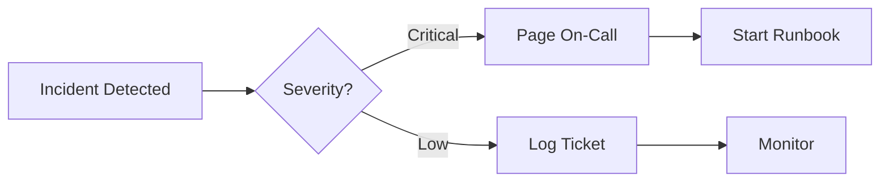
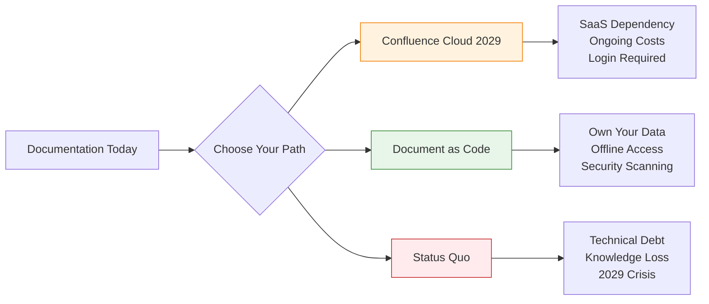

Picture this: It's 3 AM. Your production system is on fire. The on-call engineer grabs the laptop, opens the runbook... and hits a login screen. No internet. No VPN. No access.

Meanwhile, the "final" version of the procedure lives in a Word document on someone's desktop from 2023. The Confluence page? It's out of date. The wiki? Nobody knows the password.

This isn't a hypothetical nightmare. It's Tuesday for thousands of teams still treating documentation like a **destination** instead of a **deliverable**.

Here's the uncomfortable truth: **Your documentation strategy is a single point of failure.** And in 2029, when Atlassian shuts down Confluence on-premises forever, that failure becomes mandatory.

But there's a way out. It's called **Document as Code** (DaC). And no, it's not just "writing in Markdown." It's a fundamental shift in how teams think about knowledge.

---

## 1 The Problem: Documentation Graveyards

Let's name the elephants in the room.

### The Word Document Cemetery

```
📁 Shared Drive/
  📁 Operations/
    📄 Runbook_FINAL.docx
    📄 Runbook_FINAL_v2.docx
    📄 Runbook_FINAL_v2_UPDATED.docx
    📄 Runbook_FINAL_v3_ACTUAL_FINAL.docx
    📄 Runbook_FINAL_v3_ACTUAL_FINAL_REALLY.docx
```

**The Reality:**
- Nobody knows which version is authoritative
- Changes require "Track Changes" and email chains
- Search? Good luck with that
- Access control? Either everyone or nobody

### The Confluence Trap

Confluence promised organized, searchable knowledge. What it delivered:

| Problem | Impact |
|---------|--------|
| **Vendor lock-in** | Your knowledge lives in a proprietary format |
| **Login required** | Can't read docs without network + credentials |
| **Search is... optimistic** | Finding the right page feels like archaeology |
| **2029 Sunset** | On-premises version ends support. SaaS or nothing. |

!!! warning "⚠️ The 2029 Deadline"
    Atlassian has announced **Confluence Data Center reaches end-of-life on March 28, 2029**. After that:
    - Licenses expire and environments become **read-only**
    - No security patches or bug fixes
    - No technical support
    - **You can view data but cannot edit or add new content**
    - Running read-only mode while connected to internet is strongly discouraged (no security updates)

    **Timeline:**
    - **March 30, 2026**: New customers can no longer purchase Data Center subscriptions
    - **March 30, 2028**: Existing customers can no longer purchase new subscriptions or expand
    - **March 28, 2029**: All Data Center subscriptions expire

    For enterprises with compliance, data sovereignty, or air-gapped environments, this isn't an upgrade—it's an ultimatum. Extended maintenance may be available by exception, but requires direct negotiation with Atlassian.

### The Wiki Wild West

Wikis started as "everyone can edit!" and became "nobody owns this."

```
🌐 Internal Wiki
  ├── 📄 Getting Started (last updated: 2021)
  ├── 📄 Architecture Overview (broken images)
  ├── 📄 On-Call Procedures (password: ???)
  └── 📄 [404 Page Not Found]
```

**The Pattern:** All three approaches share the same fatal flaw—**documentation is separate from the work**.

---

## 2 What Is Document as Code?

**Document as Code** treats documentation like software:

| Software Development | Document as Code |
|---------------------|------------------|
| Code in Git | Docs in Git |
| Pull requests for changes | Pull requests for edits |
| Code review | Content review |
| CI/CD pipelines | Build & deploy pipelines |
| Version tags | Release versions |
| Rollback capability | Full history, instant revert |

But here's what makes DaC different from "just using Markdown":

### It's Not Just Markdown. It's Git.

```
❌ "We use Markdown" → Files on a shared drive
✅ "We use Document as Code" → Git-based workflow with version control
```

### What Is Git? (For Non-Technical Readers)

**Git** is a tool that tracks changes to files over time. Think of it like a **time machine for documents**.

Every time you save a change, Git takes a snapshot. You can travel back to any snapshot later—yesterday's version, last week's, even from a year ago. Nothing is ever lost.

### Why Git Was Built

```
Problem (before Git):
  👤 Person A: "I'm editing the file!"
  👤 Person B: "Me too!"
  → Both save → One person's changes are lost 😱

Solution (with Git):
  👤 Person A: "I'm editing on my own copy"
  👤 Person B: "Me too on my own copy"
  → Both finish → Git combines changes safely ✅
```

### Real-World Analogy

**Google Docs version history** works similarly—every save is recorded with who changed what. Git does this too, but with three key differences:

1. **Works offline** — No internet needed
2. **Full copy on your computer** — Every version, ever
3. **No vendor lock-in** — Your data stays yours

### What This Means for You

- **No internet?** No problem. Everything is local.
- **Server goes down?** You have a full backup.
- **Vendor disappears?** Your data is yours.
- **Made a mistake?** Instant undo to any point in time.

### Is Git Hard to Learn?

For developers, Git is daily work—they already know it.

For non-technical users, you don't need to learn Git commands. Modern tools (GitHub Web UI, AI assistants) handle the complexity. You just edit—Git works in the background.

### The Security Superpower: Git Is Like a Blockchain for Documents

Here's the powerful part: **Git uses cryptography to make history tamper-proof**.

Every change gets a unique fingerprint (called a "hash"). This fingerprint is calculated from:
- The content you changed
- The fingerprint of the previous change
- Who made the change and when

This creates a **chain of fingerprints**—just like blockchain. If someone tries to alter history (say, delete evidence of who approved a change), the fingerprints no longer match. The tampering is **instantly detectable**.

Confluence and Word can't do this. Their logs can be modified by admins. Git's history **cannot be silently changed**.

### Commit Signing: Digital Signatures for Changes

Git has an even stronger security feature: **commit signing**.

Every person gets a **personal certificate** (like a digital ID card). When you save a change, Git signs it with your certificate. The signature proves: *"This change came from me, and I approve it."*

**Real-World Analogy:**

```
Traditional Git commit:
  👤 "John approved this change"
  → You trust the system recorded this correctly

Signed Git commit:
  👤 "John approved this change" ✍️ [digitally signed]
  → Cryptographically proven John approved it
  → John's certificate validates the signature
  → Cannot be faked without John's private key
```

**Why signing matters:**

- **Prevents impersonation** — Nobody can pretend to be you
- **Legal validity** — Signed commits hold up in court (like a wet signature)
- **Supply chain security** — Know exactly who approved each change
- **Compliance** — Required for some regulated industries

**What you see in practice:**

```
✅ Verified commit abc123 by John Doe (john@company.com)
⚠️ Unverified commit def456 by unknown@example.com
```

GitHub and GitLab show a green "Verified" badge on signed commits. If someone tries to fake a commit from you, the signature won't match—instantly exposed.

### The Git Difference

**Plain Markdown Files (without Git):**

- Version history: File timestamps only
- Collaboration: Overwrite conflicts
- Offline access: Yes (local files)
- Audit trail: Manual logging
- Rollback: "Does anyone have the old version?"
- Distributed: Centralized file server

**Document as Code with Git:**

- Version history: Every change tracked, who/when/why
- Collaboration: Branches, merge, resolve conflicts
- Offline access: Yes (full repo clone)
- Audit trail: Immutable commit history (cryptographically secured)
- Rollback: `git revert` — instant recovery
- Distributed: Every clone is a complete backup

### The Key Insight

Git is **decentralized by design**. Every developer has a complete copy of the documentation repository. This means:

- No single point of failure
- Works offline (crucial for sandboxed/air-gapped environments)
- No login required to read
- No vendor can hold your knowledge hostage

Now that we understand the foundation, let's explore why this architecture matters when systems fail.

---

## 3 The Runbook Test: What Happens at 3 AM?

Let's replay our opening scenario with Document as Code.

**3 AM. Production incident. No internet access (sandboxed environment).**

### With Traditional Documentation:

```
Engineer: "Let me check the runbook..."
  ↓
Opens browser → Confluence login → No network
  ↓
Calls teammate → "What's the wiki password?"
  ↓
Teammate: "I think it's in LastPass..."
  ↓
LastPass → No network → Can't sync
  ↓
[Incident escalates while hunting for credentials]
```

**Time to resolution:** 45 minutes (including 38 minutes finding docs)

### With Document as Code:

```
Engineer: "Let me check the runbook..."
  ↓
Opens terminal → `cd runbooks` → Already cloned locally
  ↓
`grep "database failover" *.md` → Instant search
  ↓
Follows procedure → System recovered
  ↓
Commits incident notes → `git commit -m "Incident #2026-0329"`
```

**Time to resolution:** 7 minutes (all of it fixing the problem)

!!! question "🤔 Why Does Offline Matter?"
    You might think: *"We always have internet. This won't happen to us."*

    Consider these scenarios:
    - **Security incidents** → Network access restricted during investigation
    - **Cloud outages** → Your docs are in the cloud... that's down
    - **Air-gapped environments** → Government, finance, healthcare sandboxes
    - **Travel** → Airplane mode, poor hotel WiFi, international roaming
    - **Disaster recovery** → When everything is broken, including internet

    **The principle:** Critical documentation should work when you need it most—not when conditions are ideal.

Having seen how DaC performs under pressure, let's examine the practical advantages that make it worth adopting.

---

## 4 Why Document as Code Wins

### 1. Export to Any Format

Your stakeholders want Word? PDF? Confluence? No problem.

**Here's how the automation works:**

```
You save changes to Git
        ↓
Automation detects the change
        ↓
Builds PDF version
        ↓
Builds Word version
        ↓
Updates website
        ↓
(Optionally) Syncs to Confluence
        ↓
Done — all formats updated automatically
```

**What this replaces:**

| Manual Process | Automated Process |
|----------------|-------------------|
| Open document → Export as PDF → Save | One save triggers everything |
| Open document → Export as Word → Email | Files generated and stored automatically |
| Log into Confluence → Copy/paste → Publish | Sync happens in background |
| Repeat for every change | Runs consistently, no forgetting |

**The actual automation configuration looks like this:**

```yaml
# CI/CD pipeline builds multiple formats
on:
  push:
    branches: [main]

jobs:
  build-docs:
    runs-on: ubuntu-latest
    steps:
      - uses: actions/checkout@v4
      
      # Convert to PDF
      - name: Build PDF
        uses: docker://pandoc/core
        with:
          args: runbook.md -o runbook.pdf
      
      # Convert to Word (for stakeholders who insist)
      - name: Build Word
        uses: docker://pandoc/core
        with:
          args: runbook.md -o runbook.docx
      
      # Sync to Confluence (for teams not ready to quit)
      - name: Sync to Confluence
        uses: docker://confluence-publisher
        with:
          args: --source ./docs --space OPS
```

**What Is CI/CD?** It's automation that runs whenever your documentation changes. Think of it like a robot assistant: you save your changes to Git, and it automatically builds the PDF, Word document, and website—no manual steps required.

**The Magic:** Write once (Markdown), publish everywhere (PDF, Word, HTML, Confluence).

| Format | Use Case |
|--------|----------|
| **Markdown (source)** | Authors, version control, diffing |
| **PDF** | Formal reports, compliance submissions |
| **Word** | Stakeholders who need Track Changes |
| **HTML** | Internal documentation site |
| **Confluence** | Teams still migrating (temporary bridge) |

---

### 2. Security That Scans

Traditional docs are **security blind spots**:

```
🔍 Security Team: "Can we scan the Word documents for secrets?"
👤 IT Admin: "They're on a file server. We'd need to..."
🔍 Security Team: "What about Confluence?"
👤 IT Admin: "That's SaaS. You'd need API access and..."
🔍 Security Team: *sighs*
```

Document as Code is **security-transparent**:

**Example: Scanning for accidental secrets**

```bash
# Scan all documentation for leaked passwords or API keys
$ gitleaks detect --source ./docs --report-path secrets.json

# Search for common sensitive patterns
$ grep -r "password\|api_key\|secret" ./docs/*.md

# Run checks automatically before saving changes
$ pre-commit run --all-files
```

**What these commands do:** The first command runs a security scanner that looks for passwords, API keys, and tokens. The second searches for common sensitive words. The third runs automatically every time someone tries to save changes—blocking anything suspicious before it's stored.

**What Gets Caught:**

| Risk | Detection Method |
|------|------------------|
| Accidental API keys | Regex patterns in CI pipeline |
| Hardcoded passwords | Secret scanning tools (gitleaks, truffleHog) |
| Outdated credentials | Automated rotation alerts |
| Compliance violations | Policy-as-code checks |

!!! tip "💡 The Compliance Bonus"
    Auditors love Document as Code because:
    - **Immutable history** → Who changed what, when (cryptographically secured, like blockchain)
    - **Tamper-evident** → Altered history is instantly detectable
    - **Approval workflow** → Pull requests require review
    - **Automated checks** → Policy violations block merges
    - **Easy export** → Generate audit reports on demand
    - **Non-repudiation** → Can't deny changes you made

---

### 3. The 2029 Confluence Exodus

Let's address the elephant: **Confluence Data Center becomes read-only on March 28, 2029**.

**Your Options:**

| Option | Pros | Cons |
|--------|------|------|
| **Migrate to Confluence Cloud** | Familiar UI, minimal retraining | ☠️ Vendor lock-in deepens, SaaS pricing, data sovereignty concerns |
| **Migrate to Document as Code** | Own your data, offline access, no vendor risk | Learning curve for non-technical users |
| **Migrate to Another Wiki** | Similar UX | Same fundamental problems (login, search, lock-in) |
| **Negotiate Extended Maintenance** | Buy more time | Temporary fix, costly, still need eventual migration |

**The Real Cost of Confluence Cloud:**

```
Enterprise (1000 users):
  - Confluence Cloud: ~$120,000/year
  - Required add-ons: ~$30,000/year
  - Migration services: ~$50,000 (one-time)
  - Training: ~$20,000
  
  Total Year 1: ~$220,000
  Total Year 3: ~$410,000
```

**Document as Code Cost:**

```
Enterprise (1000 users):
  - Git hosting (GitHub/GitLab): ~$20,000/year (often already paid)
  - Static site generator: $0 (open source)
  - CI/CD: $0-$10,000/year (often included)
  - Training: ~$20,000 (one-time)
  
  Total Year 1: ~$50,000
  Total Year 3: ~$80,000
```

**Savings over 3 years: ~$330,000** (and you own your data)

With the financial and strategic advantages clear, let's examine where Document as Code faces genuine challenges.

---

## 5 The AI Advantage: Why DaC Is Perfect for AI Assistants

Here's the plot twist: **Document as Code is the most AI-friendly documentation format you can choose.**

### Low Cost, High Impact

**The Token Economy:**

AI assistants charge by the token (roughly 1 token = 1 word). Compare:

| Format | Token Count | Cost to Process |
|--------|-------------|-----------------|
| **Markdown file** | ~500 tokens | $0.001 |
| **Word document** (with formatting XML) | ~5,000 tokens | $0.010 |
| **Confluence page** (HTML + metadata) | ~3,000 tokens | $0.006 |
| **PDF** (binary, needs extraction) | Variable + extraction cost | $$$ |

**Why Markdown Wins:**

```
Markdown:     "# Runbook: Database Failover" → Clean, minimal tokens
Word DOCX:    "<w:document><w:p><w:r><w:t>Runbook...</w:t></w:r></w:p>..." → XML bloat
Confluence:   "<div class='content'><h1>Runbook</h1><span data-...>..." → HTML noise
```

**The Math:** Updating 100 documentation pages with AI:
- **Markdown:** ~$0.10 in API costs
- **Word/Confluence:** ~$0.60-1.00 in API costs
- **Savings:** 80-90% lower AI processing costs

---

### Command Line + AI Agents = Perfect Match

**AI agents love command-line tools.** Here's why:

```
🤖 AI Agent: "I'll update the runbook for PostgreSQL 16"

Step 1: Clone repository          → `git clone ...`
Step 2: Find relevant files       → `grep -r "PostgreSQL" docs/`
Step 3: Read current content      → `cat docs/runbooks/db-failover.md`
Step 4: Generate updated content  → (AI writes new version)
Step 5: Save changes              → `git add && git commit`
Step 6: Create pull request       → `gh pr create ...`

✅ Done in 30 seconds
```

**Why This Works:**

| Tool Type | AI Integration | Example |
|-----------|----------------|---------|
| **Git commands** | Native text I/O | AI reads/writes via CLI |
| **grep/sed/awk** | Simple transformations | AI finds and updates patterns |
| **pandoc** | Format conversion | AI exports to any format |
| **Static site generators** | Build automation | AI previews changes locally |

**Contrast with Confluence:**

```
🤖 AI Agent: "I'll update the Confluence page..."

Step 1: Authenticate via OAuth    → Token exchange, API keys
Step 2: Fetch page via REST API   → HTTP request, rate limits
Step 3: Parse HTML content        → Strip tags, handle encoding
Step 4: Generate updated content  → (AI writes new version)
Step 5: Convert back to HTML      → Re-add formatting, macros
Step 6: Publish via API           → HTTP POST, handle conflicts

❌ 10x more complex, 5x slower, API rate limits
```

---

### Visual Diagrams: Mermaid Charts

**Markdown now supports diagrams natively:**

````markdown
flowchart LR
    A[Incident Detected] --> B{Severity?}
    B -->|Critical| C[Page On-Call]
    B -->|Low| D[Log Ticket]
    C --> E[Start Runbook]
    D --> F[Monitor]
````

**Renders as:**



**AI + Mermaid = Instant Diagrams:**

```
👤 User: "Create a flowchart of our deployment process"
🤖 AI: *generates Mermaid code*
✅ Result: Professional diagram, no design skills needed
```

**Supported Diagram Types:**

| Type | Use Case |
|------|----------|
| Flowcharts | Process documentation |
| Sequence diagrams | API interactions |
| Gantt charts | Project timelines |
| Class diagrams | System architecture |
| Mind maps | Brainstorming |

---

### The Learning Curve Is Flattening

**Then (2020):**

```
👤 Non-tech user: "What's Markdown?"
🔧 Engineer: "It's like plain text with symbols..."
👤 Non-tech user: "Where do I edit?"
🔧 Engineer: "You need a text editor, or maybe..."
😓 Friction: High
```

**Now (2026):**

```
👤 Non-tech user: "How do I edit?"

Option 1: GitHub Web UI (WYSIWYG mode)
  - Click edit → See formatted view → Save

Option 2: Notion (exports to Markdown)
  - Write visually → Export as .md

Option 3: Google Docs (with Markdown converter)
  - Write in Docs → Auto-convert to .md

Option 4: Microsoft Word (Save as Markdown)
  - Native support built-in

😓 Friction: Low and decreasing
```

**The Trend:** WYSIWYG editors are **adding Markdown support**, not replacing it.

| Platform | Markdown Support |
|----------|------------------|
| GitHub/GitLab | ✅ Native editor with preview |
| Notion | ✅ Import/export Markdown |
| Obsidian | ✅ Markdown-first knowledge base |
| Microsoft Word | ✅ Save as Markdown (2024+) |
| Google Docs | ✅ Add-ons for Markdown |
| Slack | ✅ Markdown formatting |
| Discord | ✅ Markdown formatting |

---

### AI Agents Democratize Markdown

**The Reality:** Non-technical users don't need to learn Git commands anymore.

```
👤 Marketing Manager: "Update the homepage copy"

2020 Workflow:
  - Learn Git basics
  - Clone repository
  - Edit file in text editor
  - Run git commands
  - Open pull request
  - Wait for review

2026 Workflow:
  - Tell AI agent: "Update homepage copy to say X"
  - AI creates branch, edits file, opens PR
  - Review notification arrives in Slack
  - Click "Approve" → Done
```

**AI Tools That Bridge the Gap:**

| Tool | What It Does |
|------|--------------|
| **GitHub Copilot** | Suggests edits, explains Git commands |
| **Cursor** | AI-powered editor with Git integration |
| **Claude Code** | Natural language → Git operations |
| **Warp** | AI terminal that explains commands |

**The Bottom Line:** Markdown + Git was once a "developer skill." With AI agents, it's becoming a **universal skill**—just like typing.

---

## 6 The Honest Truth: Where DaC Struggles

Document as Code isn't perfect. Here's where it genuinely falls short:

### Challenge 1: Non-Technical Collaboration

**The Problem:**

```
👤 Marketing Manager: "How do I suggest an edit?"
🔧 Engineer: "Fork the repo, create a branch, commit, open a PR..."
👤 Marketing Manager: *quietly sends a Slack message instead*
```

**Reality Check:** Git has a learning curve. For teams without development experience, the workflow feels foreign.

**!!! success "✅ The AI Silver Lining"**
    AI agents are rapidly reducing this friction. Tools like **Claude Code**, **GitHub Copilot**, and **Cursor** can now:
    - Execute Git commands from natural language ("Create a branch and update the runbook")
    - Explain what each command does in plain English
    - Auto-generate commit messages and pull request descriptions
    
**The gap is closing faster than expected.** What required Git training in 2023 can be done via chat in 2026.

**Mitigation Strategies:**

| Approach | How It Helps | Trade-off |
|----------|--------------|-----------|
| **GitHub/GitLab Web UI** | Edit files in browser, no Git knowledge needed | Limited to simple changes |
| **VS Code + GitLens** | Visual Git tools, point-and-click commits | Still requires tool installation |
| **Designated Doc Owners** | Tech writers manage Git, SMEs provide content | Bottleneck at doc owners |
| **Hybrid workflow** | Accept Word/Google Docs, convert to Markdown | Extra translation step |

---

### Challenge 2: No Inline Comments

**The Problem:**

Confluence and Google Docs excel at inline commenting:

```
📄 Confluence Page:
  "Restart the database service"
  └─ 💬 Comment: "Which service? postgresql.service or mysqld.service?"
  └─ 💬 Comment: "This step failed for me in staging"
  └─ 💬 Comment: "Updated command in PR #452"
```

Markdown files don't have native inline comments.

**Workarounds:**

| Method | How It Works | Limitations |
|--------|--------------|-------------|
| **Pull Request Comments** | Comment on specific lines during review | Only visible during PR, not in final doc |
| **GitHub/GitLab Issues** | Link issues to documentation sections | Requires navigation between systems |
| **HTML Annotations** | Add comment blocks in Markdown | Clutters source, not rendered |
| **External Tools** | Tools like GitBook, ReadMe add commenting | Reintroduces vendor dependency |

---

### Challenge 3: Visual Collaboration

**The Problem:**

Some teams thrive on visual collaboration:

```
🎨 Google Docs:
  - Highlight text → Add comment → Assign to person
  - See cursors of others editing in real-time
  - Suggestion mode → Accept/reject changes visually
```

Git is **asynchronous by design**. Real-time collaboration isn't its strength.

**When This Matters:**

| Scenario | DaC Fit | Better Alternative |
|----------|---------|-------------------|
| Technical runbooks | ✅ Excellent | — |
| API documentation | ✅ Excellent | — |
| Policy documents | ⚠️ Moderate | Google Docs (draft) → DaC (final) |
| Marketing content | ❌ Poor | Google Docs, Notion |
| Brainstorming sessions | ❌ Poor | Whiteboard, Miro, FigJam |

---

### Challenge 4: The "Where Do I Edit?" Problem

**The Problem:**

New contributors face friction:

```
👤 New Team Member: "I found a typo in the runbook. How do I fix it?"

Traditional:
  - Click "Edit" button → Type → Save → Done

Document as Code:
  - Clone repo (or navigate to web UI)
  - Create branch (or edit in web)
  - Make change
  - Write commit message
  - Create pull request
  - Wait for review
  - Merge (or request merge)
```

**The Friction Tax:** Each edit requires ~5-10 extra steps compared to wiki-style editing.

**Mitigation:**

**Example: A simple guide for contributors**

```markdown
# .github/CONTRIBUTING.md

## How to Update Documentation

### Quick Fix (Typo, small change)
1. Navigate to the file on GitHub
2. Click the ✏️ pencil icon
3. Make your change
4. Write a brief description
5. Click "Propose changes"
6. Done! We'll review and merge.

### Larger Changes
1. Fork the repository
2. Create a branch: `git checkout -b fix/my-change`
3. Edit the files
4. Commit: `git commit -m "fix: describe your change"`
5. Push: `git push origin fix/my-change`
6. Open a Pull Request
```

Clear guidance reduces friction significantly.

Having acknowledged the challenges, let's explore practical strategies for teams adopting Document as Code.

---

## 7 Making DaC Work: A Practical Guide

### Start Small, Win Fast

**Week 1-2: Pilot Project**

```
📁 docs/
  └── runbooks/
      ├── incident-response.md
      ├── database-failover.md
      └── deployment-procedure.md
```

Pick **one high-value, technical audience** (e.g., on-call engineers). Get their buy-in. Let them experience the offline benefit firsthand.

---

### Build the Bridge, Not the Wall

**Don't:** "Confluence is dead to us now."

**Do:** "Let's run both in parallel during migration."

**Example: Automatically sync to Confluence while transitioning**

```yaml
# CI/CD syncs DaC → Confluence (temporary)
- name: Publish to Confluence
  if: github.ref == 'refs/heads/main'
  uses: confluence-publisher@v1
  with:
    space: OPS
    parent: "Operations Runbooks"
```

**What this does:** Every time documentation is updated, it automatically publishes a copy to Confluence. This lets teams keep using Confluence while gradually adopting Document as Code—no sudden disruption.

This gives stakeholders time to adapt while proving DaC's value.

---

### Invest in Tooling

**Essential Stack:**

| Tool | Purpose | Cost |
|------|---------|------|
| **VS Code + Markdown All in One** | Authoring experience | Free |
| **MkDocs + Material Theme** | Static site generation | Free |
| **GitHub Actions / GitLab CI** | Build & deploy pipeline | Free-$ |
| **pandoc** | Format conversion (PDF, Word) | Free |
| **gitleaks** | Secret scanning | Free |

**Nice to Have:**

| Tool | Purpose | Cost |
|------|---------|------|
| **GitLens** | Visual Git history | Free-$ |
| **Markdownlint** | Style enforcement | Free |
| **Vale** | Grammar & style checking | Free |

---

### Define the Workflow

**For Engineers:**

**What this looks like in practice:**

```bash
# 1. Create a new branch for your changes
git checkout -b docs/update-failover-procedure

# 2. Open and edit the documentation file
code docs/runbooks/database-failover.md

# 3. Preview how it looks in your browser
mkdocs serve  # Opens at http://localhost:8000

# 4. Save your changes to version control
git add docs/runbooks/database-failover.md
git commit -m "docs: update failover steps for PostgreSQL 16"
git push origin docs/update-failover-procedure

# 5. Request a review from your team
gh pr create --title "docs: update failover steps" --body "Updated for PG16 compatibility"
```

**Translation:** Each command does one thing—create a workspace, edit the file, preview it, save it, and ask teammates to review. The bash symbols like `#` are just notes explaining what each step does.

**For Non-Engineers:**

```
1. Navigate to the file on GitHub/GitLab
2. Click "Edit" (pencil icon)
3. Make your changes
4. Write a brief description of what changed
5. Click "Propose changes"
6. A team member will review and merge
```

---

### Measure Success

Track these metrics:

| Metric | Before DaC | After DaC | Target |
|--------|------------|-----------|--------|
| Time to find runbook | 5-10 min | < 1 min | < 30 sec |
| Documentation freshness | Months outdated | Updated with each incident | Same-day |
| Offline accessibility | ❌ No | ✅ Yes | ✅ Yes |
| Security scan coverage | 0% | 100% | 100% |
| Contributor count | 3-5 "owners" | 10-15 team members | 20+ |

Now that we have practical implementation strategies, let's examine the strategic implications for different types of organizations.

---

## 8 The Strategic View: Who Should Adopt DaC?

### Perfect Fit ✅

| Organization Type | Why |
|-------------------|-----|
| **DevOps/SRE Teams** | Already use Git, value offline access |
| **Security-Conscious** | Need audit trails, secret scanning |
| **Regulated Industries** | Compliance requires version control |
| **Distributed Teams** | Async collaboration across timezones |
| **Air-Gapped Environments** | Offline access is mandatory |

### Good Fit with Training ⚠️

| Organization Type | Considerations |
|-------------------|----------------|
| **Traditional IT Operations** | Invest in Git training, start with pilot team |
| **Mixed Technical/Non-Technical** | Hybrid workflow (Google Docs → DaC conversion) |
| **Heavy Confluence Users** | Run parallel during migration period |

### Poor Fit ❌

| Organization Type | Why |
|-------------------|-----|
| **Marketing-First Documentation** | Visual collaboration is core requirement |
| **No Git Experience + No Training Budget** | Friction will kill adoption |
| **Already Committed to SaaS Wiki Long-Term** | Migration cost may not justify benefits |

---

## Summary: The Documentation Crossroads



**The Choice:**

| Path | 2026 | 2027 | 2028 | 2029 |
|------|------|------|------|------|
| **Document as Code** | Pilot & learn | Expand adoption | Mature workflow | Competitive advantage |
| **Confluence Cloud** | Migrate | Pay increases | Dependency deepens | Locked in |
| **Status Quo** | Comfortable | Growing pain | Urgent problem | Crisis mode |

---

**The Bottom Line:**

Document as Code isn't about Markdown. It's about **ownership**.

When your documentation lives in Git:
- 📖 **You own the data** — No vendor can hold it hostage
- 🔓 **It works offline** — Critical when networks fail
- 🔍 **It's scannable** — Security and compliance built-in
- 📦 **It exports anywhere** — PDF, Word, Confluence (if you must)
- 📜 **It has history** — Every change tracked, reversible, auditable
- 🔒 **It's tamper-proof** — Cryptographically secured like blockchain
- 🤖 **It's AI-ready** — Lowest token costs, command-line friendly, Mermaid diagrams

The challenges are real—non-technical collaboration, inline comments, visual workflows. But these are **solvable problems**, not fundamental flaws.

And in 2029, when Confluence on-premises reaches end-of-life and your compliance team asks *"Where is our documentation?"*—you'll want an answer that doesn't involve a panic migration.

**Start small. Pick one runbook. Clone one repo. Experience the offline benefit firsthand.**

Because the best time to plant a tree was 20 years ago. The second-best time is before the vendor shuts off your server.

---

## Further Reading

- [GitHub Docs: Documentation as Code](https://docs.github.com/)
- [Atlassian Confluence End-of-Life Announcement](https://www.atlassian.com/licensing/data-center-end-of-life#data-center-eol-general-questions)
- [gitleaks: Secret Scanning Tool](https://github.com/gitleaks/gitleaks)
- [Mermaid: Diagrams and Flowcharts in Markdown](https://mermaid.js.org/)
