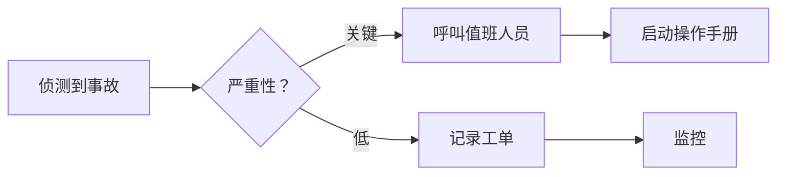
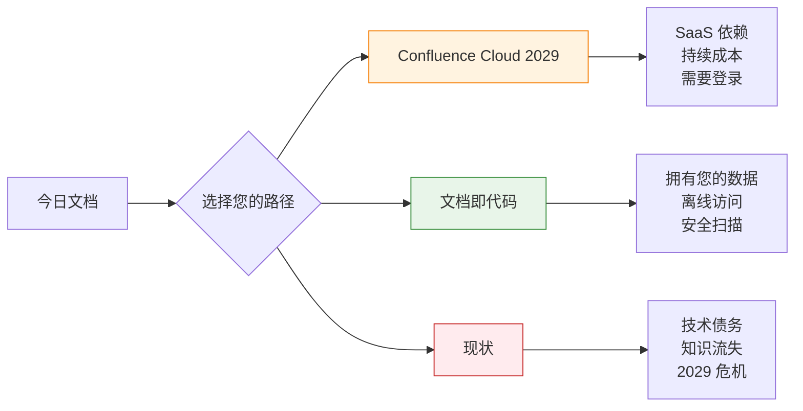

想象一下：凌晨三点。您的生产系统发生严重事故。值班工程师抓起笔记本电脑，打开操作手册……然后遇到登录画面。没有网络。没有 VPN。没有访问权限。

与此同时，程序的「最终」版本存放在某人 2023 年桌上的 Word 文件中。Confluence 页面？过期了。Wiki？没人知道密码。

这不是假设性的噩梦。对于数千个仍然将文档视为**目的地**而非**交付物**的团队来说，这是家常便饭。

令人不安的事实是：**您的文档策略是单一故障点。** 而在 2029 年，当 Atlassian 永久关闭 Confluence 本地版时，这个故障将成为强制性的。

但有一条出路。它叫做**文档即代码**（Document as Code，DaC）。不，这不仅仅是「用 Markdown 写作」。这是团队思考知识方式的根本转变。

---

## 1 问题：文档坟墓

让我们点明房间里的大象。

### Word 文档墓地

```
📁 共享硬盘/
  📁 Operations/
    📄 Runbook_FINAL.docx
    📄 Runbook_FINAL_v2.docx
    📄 Runbook_FINAL_v2_UPDATED.docx
    📄 Runbook_FINAL_v3_ACTUAL_FINAL.docx
    📄 Runbook_FINAL_v3_ACTUAL_FINAL_REALLY.docx
```

**现实情况：**
- 没人知道哪个版本是权威的
- 变更需要「追踪修订」和电子邮件往来
- 搜索？祝你好运
- 访问控制？要么每个人都有，要么完全没有

### Confluence 陷阱

Confluence 承诺提供有组织、可搜索的知识。但它带来的是：

| 问题 | 影响 |
|---------|--------|
| **厂商锁定** | 您的知识存放在专有格式中 |
| **需要登录** | 没有网络和凭证就无法阅读文档 |
| **搜索……很乐观** | 找到正确的页面感觉像考古 |
| **2029 年终止** | 本地版结束支持。要么 SaaS，要么什么都没有。 |

!!! warning "⚠️ 2029 年最后期限"
    Atlassian 已宣布**Confluence Data Center 将于 2029 年 3 月 28 日终止**。之后：
    - 授权过期，环境变为**只读**
    - 没有安全补丁或错误修正
    - 没有技术支持
    - **您可以查看数据但无法编辑或新增内容**
    - 强烈不建议在连接至互联网时以只读模式执行（无安全更新）

    **时间表：**
    - **2026 年 3 月 30 日**：新客户无法再购买 Data Center 订阅
    - **2028 年 3 月 30 日**：现有客户无法再购买新订阅或扩展
    - **2029 年 3 月 28 日**：所有 Data Center 订阅过期

    对于具有合规性、数据主权或气隙环境的企业来说，这不是升级——这是最后通牒。延长维护可能需要例外协商，但需要直接与 Atlassian 谈判。

### Wiki 的狂野西部

Wiki 始于「每个人都可以编辑！」，变成了「没人拥有这个。」

```
🌐 内部 Wiki
  ├── 📄 入门指南（最后更新：2021 年）
  ├── 📄 架构概览（图片损坏）
  ├── 📄 值班程序（密码：？？？）
  └── 📄 [404 页面未找到]
```

**模式：** 所有这三种方法都共享同一个致命缺陷——**文档与工作分离**。

---

## 2 什么是文档即代码？

**文档即代码**将文档视为软件：

| 软件开发 | 文档即代码 |
|---------------------|------------------|
| 代码在 Git 中 | 文档在 Git 中 |
| 变更的拉取请求 | 编辑的拉取请求 |
| 代码审查 | 内容审查 |
| CI/CD 管线 | 构建与部署管线 |
| 版本标签 | 发布版本 |
| 回滚能力 | 完整历史记录，即时还原 |

但 DaC 与「仅使用 Markdown」的不同之处在于：

### 不仅仅是 Markdown。是 Git。

```
❌ 「我们使用 Markdown」→ 共享硬盘上的文件
✅ 「我们使用文档即代码」→ 基于 Git 的工作流程，具有版本控制
```

### 什么是 Git？（给非技术读者）

**Git** 是一个随时间追踪文件变更的工具。把它想象成**文档的时光机**。

每次您保存变更时，Git 都会拍摄快照。您以后可以回到任何快照——昨天的版本、上周的，甚至一年前的。没有什么会丢失。

### 为什么 Git 被建立

```
问题（Git 之前）：
  👤 人员 A：「我正在编辑文件！」
  👤 人员 B：「我也是！」
  → 两人都保存 → 一个人的变更为丢失 😱

解决方案（使用 Git）：
  👤 人员 A：「我在自己的副本上编辑」
  👤 人员 B：「我也在自己的副本上编辑」
  → 两人都完成 → Git 安全地合并变更 ✅
```

### 现实类比

**Google 文档版本历史** 的工作原理类似——每次保存都会记录谁变更了什么。Git 也这样做，但有三个关键差异：

1. **离线运作** — 不需要互联网
2. **电脑上的完整副本** — 每个版本，永远
3. **没有厂商锁定** — 您的数据保持属于您

### 这对您意味着什么

- **没有互联网？** 没问题。一切都是本地的。
- **服务器宕机？** 您有完整的备份。
- **厂商消失？** 您的数据是您的。
- **犯了错误？** 即时还原到任何时间点。

### Git 很难学吗？

对开发者来说，Git 是日常工作——他们已经知道了。

对非技术用户来说，您不需要学习 Git 命令。现代工具（GitHub Web UI、AI 助理）处理复杂性。您只需编辑——Git 在后台运作。

### 安全超能力：Git 就像文档的区块链

这是强大的部分：**Git 使用密码学使历史记录防篡改**。

每次变更都会获得一个独特的指纹（称为「哈希」）。这个指纹是根据以下内容计算的：
- 您变更的内容
- 上次变更的指纹
- 谁进行了变更以及何时

这创建了一个**指纹链**——就像区块链一样。如果有人试图篡改历史记录（比如删除谁批准变更的证据），指纹就不再匹配。篡改行为**会立即被检测到**。

Confluence 和 Word 无法做到这一点。它们的日志可以由管理员修改。Git 的历史记录**无法被静默更改**。

### 提交签署：变更的数字签章

Git 有一个更强大的安全功能：**提交签署**。

每个人都获得一个**个人证书**（就像数字身份证）。当您保存变更时，Git 会用您的证书签署它。签名证明：*「这个变更来自我，我批准它。」*

**现实类比：**

```
传统 Git 提交：
  👤 「John 批准了此变更」
  → 您相信系统正确记录了这个

签署的 Git 提交：
  👤 「John 批准了此变更」✍️ [数字签署]
  → 密码学证明 John 批准了它
  → John 的证书验证签名
  → 没有 John 的私钥就无法伪造
```

**为什么签署很重要：**

- **防止冒充** — 没人能假装是您
- **法律有效性** — 签署的提交在法庭上有效（就像亲笔签名）
- **供应链安全** — 确切知道谁批准了每次变更
- **合规性** — 某些受监管产业需要

**实际情况：**

```
✅ 已验证提交 abc123 由 John Doe (john@company.com)
⚠️ 未验证提交 def456 由 unknown@example.com
```

GitHub 和 GitLab 在签署的提交上显示绿色「Verified」徽章。如果有人试图伪造您的提交，签名将不匹配——立即暴露。

### Git 的差异

**纯 Markdown 文件（没有 Git）：**

- 版本历史记录：仅文件时间戳
- 协作：覆盖冲突
- 离线访问：是（本地文件）
- 审核追踪：手动记录
- 回滚：「有人有旧版本吗？」
- 分布式：集中式文件服务器

**使用 Git 的文档即代码：**

- 版本历史记录：每次变更都被追踪，谁/何时/为什么
- 协作：分支、合并、解决冲突
- 离线访问：是（完整的 repo 克隆）
- 审核追踪：不可变的提交历史记录（密码学保护）
- 回滚：`git revert` — 即时恢复
- 分布式：每个克隆都是完整的备份

### 关键洞察

Git 本质上是**去中心化的**。每个开发者都有文档存储库的完整副本。这意味着：

- 没有单一故障点
- 离线运作（对沙盒/气隙环境至关重要）
- 无需登录即可阅读
- 没有厂商能挟持您的知识

现在我们了解了基础，让我们探讨为什么这种架构在系统故障时很重要。

---

## 3 操作手册测试：凌晨三点会发生什么？

让我们用文档即代码重播我们的开场情境。

**凌晨三点。生产事故。无法访问互联网（沙盒环境）。**

### 使用传统文档：

```
工程师：「让我检查操作手册……」
  ↓
开启浏览器 → Confluence 登录 → 没有网络
  ↓
致电队友 → 「Wiki 密码是什么？」
  ↓
队友：「我想在 LastPass 里……」
  ↓
LastPass → 没有网络 → 无法同步
  ↓
[事故升级，同时寻找凭证]
```

**解决时间：** 45 分钟（包括 38 分钟寻找文档）

### 使用文档即代码：

```
工程师：「让我检查操作手册……」
  ↓
开启终端机 → `cd runbooks` → 已经本地克隆
  ↓
`grep "database failover" *.md` → 即时搜索
  ↓
遵循程序 → 系统恢复
  ↓
提交事故笔记 → `git commit -m "Incident #2026-0329"`
```

**解决时间：** 7 分钟（全部用于修复问题）

!!! question "🤔 为什么离线很重要？"
    您可能会想：*「我们一直有互联网。这不会发生在我们身上。」*

    考虑这些情境：
    - **安全事故** → 调查期间限制网络访问
    - **云端停机** → 您的文档在云端……停机了
    - **气隙环境** → 政府、金融、医疗保健沙盒
    - **旅行** → 飞行模式、饭店 WiFi 不佳、国际漫游
    - **灾难恢复** → 当一切都坏了，包括互联网

    **原则：** 关键文档应该在您最需要的时候运作——而不是在条件理想时。

看到了 DaC 在压力下的表现，让我们检查使其值得采用的实际优势。

---

## 4 为什么文档即代码获胜

### 1. 导出为任何格式

您的利益相关者想要 Word？PDF？Confluence？没问题。

**自动化运作方式：**

```
您将变更保存到 Git
        ↓
自动化检测变更
        ↓
构建 PDF 版本
        ↓
构建 Word 版本
        ↓
更新网站
        ↓
（可选）同步到 Confluence
        ↓
完成 — 所有格式自动更新
```

**这取代了什么：**

| 手动流程 | 自动化流程 |
|----------------|-------------------|
| 开启文档 → 导出为 PDF → 保存 | 一次保存触发所有操作 |
| 开启文档 → 导出为 Word → 电子邮件 | 文件自动生成和保存 |
| 登入 Confluence → 复制/贴上 → 发布 | 同步在后台发生 |
| 每次变更加以重复 | 一致执行，不会遗忘 |

**实际自动化配置如下：**

```yaml
# CI/CD 管线构建多种格式
on:
  push:
    branches: [main]

jobs:
  build-docs:
    runs-on: ubuntu-latest
    steps:
      - uses: actions/checkout@v4

      # 转换为 PDF
      - name: Build PDF
        uses: docker://pandoc/core
        with:
          args: runbook.md -o runbook.pdf

      # 转换为 Word（给坚持的利益相关者）
      - name: Build Word
        uses: docker://pandoc/core
        with:
          args: runbook.md -o runbook.docx

      # 同步到 Confluence（给还没准备好放弃的团队）
      - name: Sync to Confluence
        uses: docker://confluence-publisher
        with:
          args: --source ./docs --space OPS
```

**什么是 CI/CD？** 这是每当您的文档变更时执行的自动化。把它想象成机器人助理：您将变更保存到 Git，它会自动构建 PDF、Word 文档和网站——无需手动步骤。

**魔法：** 写一次（Markdown），发布到各处（PDF、Word、HTML、Confluence）。

| 格式 | 使用案例 |
|--------|----------|
| **Markdown（源代码）** | 作者、版本控制、差异比较 |
| **PDF** | 正式报告、合规提交 |
| **Word** | 需要追踪修订的利益相关者 |
| **HTML** | 内部文档网站 |
| **Confluence** | 仍在迁移的团队（临时桥梁） |

---

### 2. 可扫描的安全性

传统文档是**安全盲点**：

```
🔍 安全团队：「我们可以扫描 Word 文档是否有机密吗？」
👤 IT 管理员：「它们在文件服务器上。我们需要……」
🔍 安全团队：「那 Confluence 呢？」
👤 IT 管理员：「那是 SaaS。您需要 API 访问和……」
🔍 安全团队：*叹息*
```

文档即代码是**安全透明**的：

**范例：扫描意外机密**

```bash
# 扫描所有文档是否泄漏的密码或 API 密钥
$ gitleaks detect --source ./docs --report-path secrets.json

# 搜索常见的敏感模式
$ grep -r "password\|api_key\|secret" ./docs/*.md

# 在保存变更前自动执行检查
$ pre-commit run --all-files
```

**这些命令的作用：** 第一个命令执行安全性扫描器，寻找密码、API 密钥和令牌。第二个搜索常见的敏感字词。第三个在每次有人尝试保存变更时自动执行——在保存之前封锁任何可疑内容。

**会抓到什么：**

| 风险 | 检测方法 |
|------|------------------|
| 意外 API 密钥 | CI 管线中的正则表达式模式 |
| 硬编码密码 | 机密扫描工具（gitleaks、truffleHog） |
| 过期凭证 | 自动轮换警报 |
| 合规违规 | 策略即代码检查 |

!!! tip "💡 合规红利"
    审核员喜欢文档即代码，因为：
    - **不可变的历史记录** → 谁变更了什么，何时（密码学保护，像区块链）
    - **防篡改** → 被篡改的历史记录会立即被检测到
    - **批准工作流程** → 拉取请求需要审查
    - **自动检查** → 策略违规会封锁合并
    - **轻松导出** → 按需生成审核报告
    - **不可否認性** → 无法否认您所做的变更

---

### 3. 2029 Confluence 迁移

让我们面对现实：**Confluence Data Center 将于 2029 年 3 月 28 日变为只读**。

**您的选项：**

| 选项 | 优点 | 缺点 |
|--------|------|------|
| **迁移到 Confluence Cloud** | 熟悉的 UI，最少重新培训 | ☠️ 厂商锁定加深，SaaS 定价，数据主权问题 |
| **迁移到文档即代码** | 拥有您的数据，离线访问，无厂商风险 | 非技术用户的学习曲线 |
| **迁移到另一个 Wiki** | 类似的 UX | 相同的基本问题（登录、搜索、锁定） |
| **协商延长维护** | 争取更多时间 | 临时修复，昂贵，仍需最终迁移 |

**Confluence Cloud 的实际成本：**

```
企业（1000 用户）：
  - Confluence Cloud：~$120,000/年
  - 必要附加组件：~$30,000/年
  - 迁移服务：~$50,000（一次性）
  - 培训：~$20,000

  第 1 年总计：~$220,000
  第 3 年总计：~$410,000
```

**文档即代码成本：**

```
企业（1000 用户）：
  - Git 托管（GitHub/GitLab）：~$20,000/年（通常已支付）
  - 静态网站生成器：$0（开源）
  - CI/CD：$0-$10,000/年（通常包含）
  - 培训：~$20,000（一次性）

  第 1 年总计：~$50,000
  第 3 年总计：~$80,000
```

**3 年节省：~$330,000**（而且您拥有您的数据）

财务和战略优势明确后，让我们检查文档即代码面临真正挑战的地方。

---

## 5 AI 优势：为什么 DaC 是 AI 助理的完美选择

这是转折：**文档即代码是您能选择的最 AI 友好的文件格式。**

### 低成本，高影响

**代币经济：**

AI 助理按代币收费（大约 1 代币 = 1 个单词）。比较：

| 格式 | 代币数量 | 处理成本 |
|--------|-------------|-----------------|
| **Markdown 文件** | ~500 代币 | $0.001 |
| **Word 文档**（具有格式 XML） | ~5,000 代币 | $0.010 |
| **Confluence 页面**（HTML + 元数据） | ~3,000 代币 | $0.006 |
| **PDF**（二进制，需要提取） | 可变 + 提取成本 | $$$ |

**为什么 Markdown 获胜：**

```
Markdown：     "# Runbook：Database Failover" → 干净，最少代币
Word DOCX：    "<w:document><w:p><w:r><w:t>Runbook...</w:t></w:r></w:p>..." → XML 膨胀
Confluence：   "<div class='content'><h1>Runbook</h1><span data-...>..." → HTML 噪声
```

**计算：** 使用 AI 更新 100 个文档页面：
- **Markdown：** API 成本约 $0.10
- **Word/Confluence：** API 成本约 $0.60-1.00
- **节省：** AI 处理成本降低 80-90%

---

### 命令行 + AI 代理 = 完美搭配

**AI 代理喜欢命令行工具。** 原因如下：

```
🤖 AI 代理：「我将更新 PostgreSQL 16 的操作手册」

步骤 1：克隆存储库          → `git clone ...`
步骤 2：寻找相关文件        → `grep -r "PostgreSQL" docs/`
步骤 3：阅读当前内容        → `cat docs/runbooks/db-failover.md`
步骤 4：产生更新的内容      → （AI 写新版本）
步骤 5：保存变更            → `git add && git commit`
步骤 6：建立拉取请求         → `gh pr create ...`

✅ 30 秒内完成
```

**为什么这有效：**

| 工具类型 | AI 整合 | 范例 |
|-----------|----------------|---------|
| **Git 命令** | 本机文字 I/O | AI 透过 CLI 读取/写入 |
| **grep/sed/awk** | 简单转换 | AI 寻找和更新模式 |
| **pandoc** | 格式转换 | AI 导出为任何格式 |
| **静态网站生成器** | 构建自动化 | AI 本机预览变更 |

**与 Confluence 对比：**

```
🤖 AI 代理：「我将更新 Confluence 页面……」

步骤 1：透过 OAuth 验证     → 代币交换，API 密钥
步骤 2：透过 REST API 取得页面   → HTTP 请求，速率限制
步骤 3：解析 HTML 内容        → 移除标签，处理编码
步骤 4：产生更新的内容      → （AI 写新版本）
步骤 5：转换回 HTML          → 重新新增格式，宏
步骤 6：透过 API 发布         → HTTP POST，处理冲突

❌ 复杂度增加 10 倍，速度慢 5 倍，API 速率限制
```

---

### 视觉图表：Mermaid 图表

**Markdown 现在本机支持图表：**

````markdown
flowchart LR
    A[侦测到事故] --> B{严重性？}
    B -->|关键| C[呼叫值班人员]
    B -->|低| D[记录工单]
    C --> E[启动操作手册]
    D --> F[监控]
````

**渲染为：**



**AI + Mermaid = 即时图表：**

```
👤 用户：「建立我们部署流程的流程图」
🤖 AI：*产生 Mermaid 代码*
✅ 结果：专业图表，无需设计技能
```

**支持的图表类型：**

| 类型 | 使用案例 |
|------|----------|
| 流程图 | 流程文档 |
| 序列图 | API 互动 |
| 甘特图 | 项目时程 |
| 类别图 | 系统架构 |
| 心智图 | 头脑风暴 |

---

### 学习曲线正在变平

**当时（2020）：**

```
👤 非技术用户：「什么是 Markdown？」
🔧 工程师：「就像是带有符号的纯文字……」
👤 非技术用户：「我在哪里编辑？」
🔧 工程师：「您需要文字编辑器，或者也许……」
😓 摩擦：高
```

**现在（2026）：**

```
👤 非技术用户：「我如何编辑？」

选项 1：GitHub Web UI（所见即所得模式）
  - 点击编辑 → 看到格式化视图 → 保存

选项 2：Notion（导出为 Markdown）
  - 视觉化写作 → 导出为 .md

选项 3：Google Docs（具有 Markdown 转换器）
  - 在 Docs 中写作 → 自动转换为 .md

选项 4：Microsoft Word（保存为 Markdown）
  - 内建支持

😓 摩擦：低且正在减少
```

**趋势：** 所见即所得编辑器正在**新增 Markdown 支持**，而不是取代它。

| 平台 | Markdown 支持 |
|----------|------------------|
| GitHub/GitLab | ✅ 具有预览的本机编辑器 |
| Notion | ✅ 导入/导出 Markdown |
| Obsidian | ✅ Markdown 优先的知识库 |
| Microsoft Word | ✅ 保存为 Markdown（2024+） |
| Google Docs | ✅ Markdown 附加组件 |
| Slack | ✅ Markdown 格式化 |
| Discord | ✅ Markdown 格式化 |

---

### AI 代理普及 Markdown

**现实：** 非技术用户不再需要学习 Git 命令。

```
👤 营销经理：「更新首页文案」

2020 工作流程：
  - 学习 Git 基础
  - 克隆存储库
  - 在文字编辑器中编辑文件
  - 执行 Git 命令
  - 开启拉取请求
  - 等待审查

2026 工作流程：
  - 告诉 AI 代理：「更新首页文案为 X」
  - AI 建立分支，编辑文件，开启 PR
  - 审查通知到达 Slack
  - 点击「批准」→ 完成
```

**弥合差距的 AI 工具：**

| 工具 | 作用 |
|------|--------------|
| **GitHub Copilot** | 建议编辑，解释 Git 命令 |
| **Cursor** | 具有 Git 整合的 AI 驱动编辑器 |
| **Claude Code** | 自然语言 → Git 操作 |
| **Warp** | 解释命令的 AI 终端机 |

**结论：** Markdown + Git 曾经是「开发者技能」。随着 AI 代理，它正在成为**通用技能**——就像打字一样。

---

## 6 残酷的真相：DaC 的挣扎之处

文档即代码并不完美。以下是它真正不足的地方：

### 挑战 1：非技术协作

**问题：**

```
👤 营销经理：「我如何建议编辑？」
🔧 工程师：「Fork 存储库，建立分支，提交，开启 PR……」
👤 营销经理：*默默地发送 Slack 讯息*
```

**现实检查：** Git 有学习曲线。对于没有开发经验的团队，工作流程感觉陌生。

**!!! success "✅ AI 的一线希望」**
    AI 代理正在迅速减少这种摩擦。像**Claude Code**、**GitHub Copilot**和**Cursor**这样的工具现在可以：
    - 从自然语言执行 Git 命令（「建立分支并更新操作手册」）
    - 用简单的英语解释每个命令的作用
    - 自动产生提交讯息和拉取请求描述

**差距比预期更快地缩小。** 2023 年需要 Git 培训的内容，2026 年可以透过聊天完成。

**缓解策略：**

| 方法 | 如何帮助 | 权衡 |
|----------|--------------|-----------|
| **GitHub/GitLab Web UI** | 在浏览器中编辑文件，无需 Git 知识 | 限于简单的变更 |
| **VS Code + GitLens** | 视觉化 Git 工具，点按提交 | 仍需安装工具 |
| **指定的文档负责人** | 技术作家管理 Git，主题专家提供内容 | 文档负责人的瓶颈 |
| **混合工作流程** | 接受 Word/Google Docs，转换为 Markdown | 额外的转换步骤 |

---

### 挑战 2：没有内嵌评论

**问题：**

Confluence 和 Google Docs 擅长内嵌评论：

```
📄 Confluence 页面：
  「重新启动数据库服务」
  └─ 💬 评论：「哪个服务？postgresql.service 还是 mysqld.service？」
  └─ 💬 评论：「这个步骤在 staging 中对我失败了」
  └─ 💬 评论：「在 PR #452 中更新了命令」
```

Markdown 文件没有本机的内嵌评论。

**解决方案：**

| 方法 | 运作方式 | 限制 |
|--------|--------------|-------------|
| **拉取请求评论** | 在审查期间评论特定行 | 仅在 PR 期间可见，最终文件中不可见 |
| **GitHub/GitLab Issues** | 将 issue 链接到文档部分 | 需要在系统之间导航 |
| **HTML 注释** | 在 Markdown 中新增评论区块 | 弄乱源代码，未渲染 |
| **外部工具** | 像 GitBook、ReadMe 这样的工具新增评论 | 重新引入厂商依赖 |

---

### 挑战 3：视觉协作

**问题：**

一些团队在视觉协作中茁壮成长：

```
🎨 Google Docs：
  - 高亮文字 → 新增评论 → 分配给人员
  - 看到其他人即时编辑的游标
  - 建议模式 → 视觉化接受/拒绝变更
```

Git 本质上是**异步的**。即时协作不是它的强项。

**什么时候重要：**

| 情境 | DaC 适合度 | 更好的替代方案 |
|----------|---------|-------------------|
| 技术操作手册 | ✅ 优秀 | — |
| API 文档 | ✅ 优秀 | — |
| 策略文档 | ⚠️ 中等 | Google Docs（草稿）→ DaC（最终） |
| 营销内容 | ❌ 差 | Google Docs、Notion |
| 头脑风暴会议 | ❌ 差 | 白板、Miro、FigJam |

---

### 挑战 4：「我在哪里编辑？」问题

**问题：**

新贡献者面临摩擦：

```
👤 新团队成员：「我发现操作手册中有错字。我如何修复它？」

传统：
  - 点击「编辑」按钮 → 输入 → 保存 → 完成

文档即代码：
  - 克隆存储库（或导航到网页……）
  - 建立分支（或在网页上编辑）
  - 进行变更
  - 写提交讯息
  - 建立拉取请求
  - 等待审查
  - 合并（或请求合并）
```

**摩擦税：** 与 wiki 式编辑相比，每次编辑需要约 5-10 个额外步骤。

**缓解：**

**范例：贡献者的简单指南**

```markdown
# .github/CONTRIBUTING.md

## 如何更新文档

### 快速修正（错字，小变更）
1. 在 GitHub 上导航到文件
2. 点击 ✏️ 铅笔图示
3. 进行您的变更
4. 写简短描述
5. 点击「建议变更」
6. 完成！我们将审查并合并。

### 较大的变更
1. Fork 存储库
2. 建立分支：`git checkout -b fix/my-change`
3. 编辑文件
4. 提交：`git commit -m "fix：描述您的变更"`
5. 推送：`git push origin fix/my-change`
6. 开启拉取请求
```

明确的指导显著减少摩擦。

承认挑战后，让我们探讨采用文档即代码的团队的实际策略。

---

## 7 让 DaC 运作：实用指南

### 从小处开始，快速获胜

**第 1-2 周：试点项目**

```
📁 docs/
  └── runbooks/
      ├── incident-response.md
      ├── database-failover.md
      └── deployment-procedure.md
```

选择**一个高价值、技术受众**（例如，值班工程师）。获得他们的支持。让他们亲身体验离线优势。

---

### 建立桥梁，而不是墙

**不要：** 「Confluence 现在对我们来说死了。」

**要：** 「让我们在迁移期间同时执行两者。」

**范例：在过渡期间自动同步到 Confluence**

```yaml
# CI/CD 同步 DaC → Confluence（临时）
- name: Publish to Confluence
  if: github.ref == 'refs/heads/main'
  uses: confluence-publisher@v1
  with:
    space: OPS
    parent: "Operations Runbooks"
```

**这的作用：** 每当文档更新时，它会自动发布副本到 Confluence。这让团队可以继续使用 Confluence，同时逐渐采用文档即代码——没有突然的中断。

这给利益相关者时间适应，同时证明 DaC 的价值。

---

### 投资工具

**基本堆叠：**

| 工具 | 目的 | 成本 |
|------|---------|------|
| **VS Code + Markdown All in One** | 作者体验 | 免费 |
| **MkDocs + Material Theme** | 静态网站生成 | 免费 |
| **GitHub Actions / GitLab CI** | 构建与部署管线 | 免费-$ |
| **pandoc** | 格式转换（PDF、Word） | 免费 |
| **gitleaks** | 机密扫描 | 免费 |

**可有可无：**

| 工具 | 目的 | 成本 |
|------|---------|------|
| **GitLens** | 视觉化 Git 历史记录 | 免费-$ |
| **Markdownlint** | 样式执行 | 免费 |
| **Vale** | 语法和样式检查 | 免费 |

---

### 定义工作流程

**给工程师：**

**实际情况：**

```bash
# 1. 为您的变更建立新分支
git checkout -b docs/update-failover-procedure

# 2. 开启并编辑文档文件
code docs/runbooks/database-failover.md

# 3. 在浏览器中预览外观
mkdocs serve  # 开启在 http://localhost:8000

# 4. 将您的变更保存到版本控制
git add docs/runbooks/database-failover.md
git commit -m "docs：更新 PostgreSQL 16 的故障转移步骤"
git push origin docs/update-failover-procedure

# 5. 请求团队审查
gh pr create --title "docs：更新故障转移步骤" --body "更新 PG16 兼容性"
```

**翻译：** 每个命令做一件事——建立工作区、编辑文件、预览、保存它，并请求队友审查。bash 符号如 `#` 只是解释每个步骤作用的注释。

**给非工程师：**

```
1. 在 GitHub/GitLab 上导航到文件
2. 点击「编辑」（铅笔图示）
3. 进行您的变更
4. 写下变更的简短描述
5. 点击「建议变更」
6. 团队成员将审查并合并
```

---

### 衡量成功

追踪这些指标：

| 指标 | DaC 之前 | DaC 之后 | 目标 |
|--------|------------|-----------|--------|
| 寻找操作手册的时间 | 5-10 分钟 | < 1 分钟 | < 30 秒 |
| 文档新颖度 | 数月过时 | 每次事故更新 | 同日 |
| 离线可访问性 | ❌ 否 | ✅ 是 | ✅ 是 |
| 安全扫描覆盖率 | 0% | 100% | 100% |
| 贡献者数量 | 3-5 个「负责人」 | 10-15 个团队成员 | 20+ |

现在我们有了实际实施策略，让我们检查不同类型组织的战略影响。

---

## 8 战略视角：谁应该采用 DaC？

### 完美适合 ✅

| 组织类型 | 为什么 |
|-------------------|-----|
| **DevOps/SRE 团队** | 已经使用 Git，重视离线访问 |
| **安全意识强的** | 需要审核追踪、机密扫描 |
| **受监管的产业** | 合规需要版本控制 |
| **分布式团队** | 跨时区异步协作 |
| **气隙环境** | 离线访问是强制性的 |

### 需要培训的良好适合 ⚠️

| 组织类型 | 考虑因素 |
|-------------------|----------------|
| **传统 IT 营运** | 投资 Git 培训，从试点团队开始 |
| **混合技术/非技术** | 混合工作流程（Google Docs → DaC 转换） |
| **Confluence 重度用户** | 在迁移期间并行执行 |

### 不适合 ❌

| 组织类型 | 为什么 |
|-------------------|-----|
| **营销优先文档** | 视觉协作是核心需求 |
| **没有 Git 经验 + 没有培训预算** | 摩擦将扼杀采用 |
| **已长期承诺 SaaS Wiki** | 迁移成本可能不合理 |

---

## 总结：文档的十字路口



**选择：**

| 路径 | 2026 | 2027 | 2028 | 2029 |
|------|------|------|------|------|
| **文档即代码** | 试点与学习 | 扩展采用 | 成熟工作流程 | 竞争优势 |
| **Confluence Cloud** | 迁移 | 定价增加 | 依赖加深 | 锁定 |
| **现状** | 舒适 | 增长痛苦 | 紧急问题 | 危机模式 |

---

**结论：**

文档即代码不是关于 Markdown。是关于**所有权**。

当您的文档存放在 Git 中：
- 📖 **您拥有数据** — 没有厂商能挟持它
- 🔓 **离线运作** — 关键时刻网络故障时
- 🔍 **可扫描** — 内建安全和合规
- 📦 **可导出到任何地方** — PDF、Word、Confluence（如果您必须）
- 📜 **有历史记录** — 每次变更被追踪、可还原、可审核
- 🔒 **防篡改** — 密码学保护，像区块链
- 🤖 **AI 就绪** — 最低代币成本，命令行友好，Mermaid 图表

挑战是真实的——非技术协作、内嵌评论、视觉工作流程。但这些是**可解决的问题**，不是根本缺陷。

而在 2029 年，当 Confluence 本地版终止，您的合规团队问*「我们的文档在哪里？」*——您会想要一个不涉及恐慌迁移的答案。

**从小处开始。选择一个操作手册。克隆一个存储库。亲身体验离线优势。**

因为种树最好的时间是 20 年前。第二好的时间是在厂商关闭您的服务器之前。

---

## 进一步阅读

- [GitHub Docs：Documentation as Code](https://docs.github.com/)
- [Atlassian Confluence End-of-Life Announcement](https://www.atlassian.com/licensing/data-center-end-of-life#data-center-eol-general-questions)
- [gitleaks：Secret Scanning Tool](https://github.com/gitleaks/gitleaks)
- [Mermaid：Diagrams and Flowcharts in Markdown](https://mermaid.js.org/)
