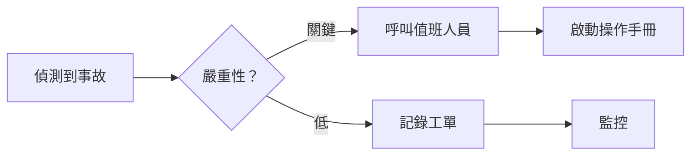
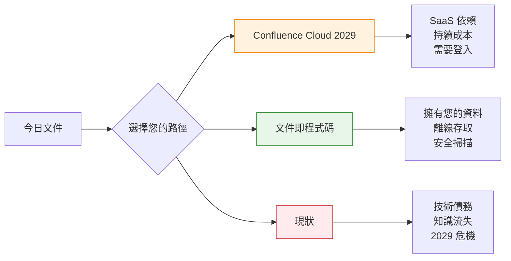

想像一下：凌晨三點。您的生產系統發生嚴重事故。值班工程師抓起筆記型電腦，打開操作手冊……然後遇到登入畫面。沒有網路。沒有 VPN。沒有存取權限。

與此同時，程序的「最終」版本存放在某人 2023 年桌上的 Word 文件中。Confluence 頁面？過期了。Wiki？沒人知道密碼。

這不是假設性的噩夢。對於數千個仍然將文件視為**目的地**而非**交付物**的團隊來說，這是家常便飯。

令人不安的事實是：**您的文件策略是單一故障點。** 而在 2029 年，當 Atlassian 永久關閉 Confluence 本機版時，這個故障將成為強制性的。

但有一條出路。它叫做**文件即程式碼**（Document as Code，DaC）。不，這不僅僅是「用 Markdown 寫作」。這是團隊思考知識方式的根本轉變。

---

## 1 問題：文件墳墓

讓我們點明房間裡的大象。

### Word 文件墓地

```
📁 共用硬碟/
  📁 Operations/
    📄 Runbook_FINAL.docx
    📄 Runbook_FINAL_v2.docx
    📄 Runbook_FINAL_v2_UPDATED.docx
    📄 Runbook_FINAL_v3_ACTUAL_FINAL.docx
    📄 Runbook_FINAL_v3_ACTUAL_FINAL_REALLY.docx
```

**現實情況：**
- 沒人知道哪個版本是權威的
- 變更需要「追蹤修訂」和電子郵件往來
- 搜尋？祝你好運
- 存取控制？要嘛每個人都有，要嘛完全沒有

### Confluence 陷阱

Confluence 承諾提供有組織、可搜尋的知識。但它帶來的是：

| 問題 | 影響 |
|---------|--------|
| **廠商鎖定** | 您的知識存放在專有格式中 |
| **需要登入** | 沒有網路和憑證就無法閱讀文件 |
| **搜尋……很樂觀** | 找到正確的頁面感覺像考古 |
| **2029 年終止** | 本機版結束支援。要嘛 SaaS，要嘛什麼都沒有。 |

!!! warning "⚠️ 2029 年最後期限"
    Atlassian 已宣布**Confluence Data Center 將於 2029 年 3 月 28 日終止**。之後：
    - 授權過期，環境變為**唯讀**
    - 沒有安全性修補程式或錯誤修正
    - 沒有技術支援
    - **您可以檢視資料但無法編輯或新增內容**
    - 強烈不建議在連線至網際網路時以唯讀模式執行（無安全性更新）

    **時程表：**
    - **2026 年 3 月 30 日**：新客戶無法再購買 Data Center 訂閱
    - **2028 年 3 月 30 日**：現有客戶無法再購買新訂閱或擴展
    - **2029 年 3 月 28 日**：所有 Data Center 訂閱過期

    對於具有合規性、資料主權或氣隙環境的企業來說，這不是升級——這是最後通牒。延長維護可能需要例外協商，但需要直接與 Atlassian 談判。

### Wiki 的狂野西部

Wiki 始於「每個人都可以編輯！」，變成了「沒人擁有這個。」

```
🌐 內部 Wiki
  ├── 📄 入門指南（最後更新：2021 年）
  ├── 📄 架構概覽（圖片損壞）
  ├── 📄 值班程序（密碼：？？？）
  └── 📄 [404 頁面未找到]
```

**模式：** 所有這三種方法都共享同一個致命缺陷——**文件與工作分離**。

---

## 2 什麼是文件即程式碼？

**文件即程式碼**將文件視為軟體：

| 軟體開發 | 文件即程式碼 |
|---------------------|------------------|
| 程式碼在 Git 中 | 文件在 Git 中 |
| 變更的拉取請求 | 編輯的拉取請求 |
| 程式碼審查 | 內容審查 |
| CI/CD 管線 | 建構與部署管線 |
| 版本標籤 | 發布版本 |
| 回滾能力 | 完整歷史記錄，即時還原 |

但 DaC 與「僅使用 Markdown」的不同之處在於：

### 不僅僅是 Markdown。是 Git。

```
❌ 「我們使用 Markdown」→ 共用硬碟上的檔案
✅ 「我們使用文件即程式碼」→ 基於 Git 的工作流程，具有版本控制
```

### 什麼是 Git？（給非技術讀者）

**Git** 是一個隨時間追蹤檔案變更的工具。把它想像成**文件的時光機**。

每次您儲存變更時，Git 都會拍攝快照。您以後可以回到任何快照——昨天的版本、上週的，甚至一年前的。沒有什麼會丟失。

### 為什麼 Git 被建立

```
問題（Git 之前）：
  👤 人員 A：「我正在編輯檔案！」
  👤 人員 B：「我也是！」
  → 兩人都儲存 → 一個人的變更為遺失 😱

解決方案（使用 Git）：
  👤 人員 A：「我在自己的副本上編輯」
  👤 人員 B：「我也在自己的副本上編輯」
  → 兩人都完成 → Git 安全地合併變更 ✅
```

### 現實類比

**Google 文件版本歷史** 的工作原理類似——每次儲存都會記錄誰變更了什麼。Git 也這樣做，但有三個關鍵差異：

1. **離線運作** — 不需要網際網路
2. **電腦上的完整副本** — 每個版本，永遠
3. **沒有廠商鎖定** — 您的資料保持屬於您

### 這對您意味著什麼

- **沒有網際網路？** 沒問題。一切都是本機的。
- **伺服器當機？** 您有完整的備份。
- **廠商消失？** 您的資料是您的。
- **犯了錯誤？** 即時還原到任何時間點。

### Git 很難學嗎？

對開發者來說，Git 是日常工作——他們已經知道了。

對非技術使用者來說，您不需要學習 Git 命令。現代工具（GitHub Web UI、AI 助理）處理複雜性。您只需編輯——Git 在背景運作。

### 安全超能力：Git 就像文件的區塊鏈

這是強大的部分：**Git 使用密碼學使歷史記錄防篡改**。

每次變更都會獲得一個獨特的指紋（稱為「雜湊」）。這個指紋是根據以下內容計算的：
- 您變更的內容
- 上次變更的指紋
- 誰進行了變更以及何時

這創建了一個**指紋鏈**——就像區塊鏈一樣。如果有人試圖篡改歷史記錄（比如刪除誰批准變更的證據），指紋就不再匹配。篡改行為**會立即被檢測到**。

Confluence 和 Word 無法做到這一點。它們的日誌可以由管理員修改。Git 的歷史記錄**無法被靜默更改**。

### 提交簽署：變更的數位簽章

Git 有一個更強大的安全功能：**提交簽署**。

每個人都獲得一個**個人憑證**（就像數位身分證）。当您儲存變更時，Git 會用您的憑證簽署它。簽名證明：*「這個變更來自我，我批准它。」*

**現實類比：**

```
傳統 Git 提交：
  👤 「John 批准了此變更」
  → 您相信系統正確記錄了這個

簽署的 Git 提交：
  👤 「John 批准了此變更」✍️ [數位簽署]
  → 密碼學證明 John 批准了它
  → John 的憑證驗證簽名
  → 沒有 John 的私鑰就無法偽造
```

**為什麼簽署很重要：**

- **防止冒充** — 沒人能假裝是您
- **法律有效性** — 簽署的提交在法庭上有效（就像親筆簽名）
- **供應鏈安全** — 確切知道誰批准了每次變更
- **合規性** — 某些受監管產業需要

**實際情況：**

```
✅ 已驗證提交 abc123 由 John Doe (john@company.com)
⚠️ 未驗證提交 def456 由 unknown@example.com
```

GitHub 和 GitLab 在簽署的提交上顯示綠色「Verified」徽章。如果有人試圖偽造您的提交，簽名將不匹配——立即暴露。

### Git 的差異

**純 Markdown 檔案（沒有 Git）：**

- 版本歷史記錄：僅檔案時間戳
- 協作：覆蓋衝突
- 離線存取：是（本機檔案）
- 審核追蹤：手動記錄
- 回滾：「有人有舊版本嗎？」
- 分散式：集中式檔案伺服器

**使用 Git 的文件即程式碼：**

- 版本歷史記錄：每次變更都被追蹤，誰/何時/為什麼
- 協作：分支、合併、解決衝突
- 離線存取：是（完整的 repo 克隆）
- 審核追蹤：不可變的提交歷史記錄（密碼學保護）
- 回滾：`git revert` — 即時恢復
- 分散式：每個克隆都是完整的備份

### 關鍵洞察

Git 本質上是**去中心化的**。每個開發者都有文件儲存庫的完整副本。這意味著：

- 沒有單一故障點
- 離線運作（對沙盒/氣隙環境至關重要）
- 無需登入即可閱讀
- 沒有廠商能挾持您的知識

現在我們了解了基礎，讓我們探討為什麼這種架構在系統故障時很重要。

---

## 3 操作手冊測試：凌晨三點會發生什麼？

讓我們用文件即程式碼重播我們的開場情境。

**凌晨三點。生產事故。無法存取網際網路（沙盒環境）。**

### 使用傳統文件：

```
工程師：「讓我檢查操作手冊……」
  ↓
開啟瀏覽器 → Confluence 登入 → 沒有網路
  ↓
致電隊友 → 「Wiki 密碼是什麼？」
  ↓
隊友：「我想在 LastPass 裡……」
  ↓
LastPass → 沒有網路 → 無法同步
  ↓
[事故升級，同時尋找憑證]
```

**解決時間：** 45 分鐘（包括 38 分鐘尋找文件）

### 使用文件即程式碼：

```
工程師：「讓我檢查操作手冊……」
  ↓
開啟終端機 → `cd runbooks` → 已經本機克隆
  ↓
`grep "database failover" *.md` → 即時搜尋
  ↓
遵循程序 → 系統恢復
  ↓
提交事故筆記 → `git commit -m "Incident #2026-0329"`
```

**解決時間：** 7 分鐘（全部用於修復問題）

!!! question "🤔 為什麼離線很重要？P
    您可能會想：*「我們一直有網際網路。這不會發生在我們身上。」*

    考慮這些情境：
    - **安全事故** → 調查期間限制網路存取
    - **雲端停機** → 您的文件在雲端……停機了
    - **氣隙環境** → 政府、金融、醫療保健沙盒
    - **旅行** → 飛行模式、飯店 WiFi 不佳、國際漫遊
    - **災難恢復** → 當一切都壞了，包括網際網路

    **原則：** 關鍵文件應該在您最需要的時候運作——而不是在條件理想時。

看到了 DaC 在壓力下的表現，讓我們檢查使其值得採用的實際優勢。

---

## 4 為什麼文件即程式碼獲勝

### 1. 匯出為任何格式

您的利害關係人想要 Word？PDF？Confluence？沒問題。

**自動化運作方式：**

```
您將變更儲存到 Git
        ↓
自動化檢測變更
        ↓
建構 PDF 版本
        ↓
建構 Word 版本
        ↓
更新網站
        ↓
（可選）同步到 Confluence
        ↓
完成 — 所有格式自動更新
```

**這取代了什麼：**

| 手動流程 | 自動化流程 |
|----------------|-------------------|
| 開啟文件 → 匯出為 PDF → 儲存 | 一次儲存觸發所有操作 |
| 開啟文件 → 匯出為 Word → 電子郵件 | 檔案自動產生和儲存 |
| 登入 Confluence → 複製/貼上 → 發布 | 同步在背景發生 |
| 每次變更加以重複 | 一致執行，不會遺忘 |

**實際自動化配置如下：**

```yaml
# CI/CD 管線建構多種格式
on:
  push:
    branches: [main]

jobs:
  build-docs:
    runs-on: ubuntu-latest
    steps:
      - uses: actions/checkout@v4

      # 轉換為 PDF
      - name: Build PDF
        uses: docker://pandoc/core
        with:
          args: runbook.md -o runbook.pdf

      # 轉換為 Word（給堅持的利害關係人）
      - name: Build Word
        uses: docker://pandoc/core
        with:
          args: runbook.md -o runbook.docx

      # 同步到 Confluence（給還沒準備好放棄的團隊）
      - name: Sync to Confluence
        uses: docker://confluence-publisher
        with:
          args: --source ./docs --space OPS
```

**什麼是 CI/CD？** 這是每當您的文件變更時執行的自動化。把它想像成機器人助理：您將變更儲存到 Git，它會自動建構 PDF、Word 文件和網站——無需手動步驟。

**魔法：** 寫一次（Markdown），發布到各處（PDF、Word、HTML、Confluence）。

| 格式 | 使用案例 |
|--------|----------|
| **Markdown（原始碼）** | 作者、版本控制、差異比較 |
| **PDF** | 正式報告、合規提交 |
| **Word** | 需要追蹤修訂的利害關係人 |
| **HTML** | 內部文件網站 |
| **Confluence** | 仍在遷移的團隊（臨時橋樑） |

---

### 2. 可掃描的安全性

傳統文件是**安全盲點**：

```
🔍 安全團隊：「我們可以掃描 Word 文件是否有機密嗎？」
👤 IT 管理員：「它們在檔案伺服器上。我們需要……」
🔍 安全團隊：「那 Confluence 呢？」
👤 IT 管理員：「那是 SaaS。您需要 API 存取和……」
🔍 安全團隊：*嘆息*
```

文件即程式碼是**安全透明**的：

**範例：掃描意外機密**

```bash
# 掃描所有文件是否有洩漏的密碼或 API 金鑰
$ gitleaks detect --source ./docs --report-path secrets.json

# 搜尋常見的敏感模式
$ grep -r "password\|api_key\|secret" ./docs/*.md

# 在儲存變更前自動執行檢查
$ pre-commit run --all-files
```

**這些命令的作用：** 第一個命令執行安全性掃描器，尋找密碼、API 金鑰和權杖。第二個搜尋常見的敏感字詞。第三個在每次有人嘗試儲存變更時自動執行——在儲存之前封鎖任何可疑內容。

**會抓到什麼：**

| 風險 | 檢測方法 |
|------|------------------|
| 意外 API 金鑰 | CI 管線中的正則表達式模式 |
| 硬編碼密碼 | 機密掃描工具（gitleaks、truffleHog） |
| 過期憑證 | 自動輪換警報 |
| 合規違規 | 策略即程式碼檢查 |

!!! tip "💡 合規紅利"
    審核員喜歡文件即程式碼，因為：
    - **不可變的歷史記錄** → 誰變更了什麼，何時（密碼學保護，像區塊鏈）
    - **防篡改** → 被篡改的歷史記錄會立即被檢測到
    - **批准工作流程** → 拉取請求需要審查
    - **自動檢查** → 策略違規會封鎖合併
    - **輕鬆匯出** → 按需產生審核報告
    - **不可否認性** → 無法否認您所做的變更

---

### 3. 2029 Confluence 遷移

讓我們面對現實：**Confluence Data Center 將於 2029 年 3 月 28 日變為唯讀**。

**您的選項：**

| 選項 | 優點 | 缺點 |
|--------|------|------|
| **遷移到 Confluence Cloud** | 熟悉的 UI，最少重新培訓 | ☠️ 廠商鎖定加深，SaaS 定價，資料主權問題 |
| **遷移到文件即程式碼** | 擁有您的資料，離線存取，無廠商風險 | 非技術使用者的學習曲線 |
| **遷移到另一個 Wiki** | 類似的 UX | 相同的基本問題（登入、搜尋、鎖定） |
| **協商延長維護** | 爭取更多時間 | 臨時修復，昂貴，仍需最終遷移 |

**Confluence Cloud 的實際成本：**

```
企業（1000 使用者）：
  - Confluence Cloud：~$120,000/年
  - 必要附加元件：~$30,000/年
  - 遷移服務：~$50,000（一次性）
  - 培訓：~$20,000

  第 1 年總計：~$220,000
  第 3 年總計：~$410,000
```

**文件即程式碼成本：**

```
企業（1000 使用者）：
  - Git 託管（GitHub/GitLab）：~$20,000/年（通常已支付）
  - 靜態網站產生器：$0（開源）
  - CI/CD：$0-$10,000/年（通常包含）
  - 培訓：~$20,000（一次性）

  第 1 年總計：~$50,000
  第 3 年總計：~$80,000
```

**3 年節省：~$330,000**（而且您擁有您的資料）

財務和戰略優勢明確後，讓我們檢查文件即程式碼面臨真正挑戰的地方。

---

## 5 AI 優勢：為什麼 DaC 是 AI 助理的完美選擇

這是轉折：**文件即程式碼是您能選擇的最 AI 友好的文件格式。**

### 低成本，高影響

**代幣經濟：**

AI 助理按代幣收費（大約 1 代幣 = 1 個單字）。比較：

| 格式 | 代幣數量 | 處理成本 |
|--------|-------------|-----------------|
| **Markdown 檔案** | ~500 代幣 | $0.001 |
| **Word 文件**（具有格式 XML） | ~5,000 代幣 | $0.010 |
| **Confluence 頁面**（HTML + 中繼資料） | ~3,000 代幣 | $0.006 |
| **PDF**（二進位，需要擷取） | 可變 + 擷取成本 | $$$ |

**為什麼 Markdown 獲勝：**

```
Markdown：     "# Runbook：Database Failover" → 乾淨，最少代幣
Word DOCX：    "<w:document><w:p><w:r><w:t>Runbook...</w:t></w:r></w:p>..." → XML 膨脹
Confluence：   "<div class='content'><h1>Runbook</h1><span data-...>..." → HTML 雜訊
```

**計算：** 使用 AI 更新 100 個文件頁面：
- **Markdown：** API 成本約 $0.10
- **Word/Confluence：** API 成本約 $0.60-1.00
- **節省：** AI 處理成本降低 80-90%

---

### 命令列 + AI 代理 = 完美搭配

**AI 代理喜歡命令列工具。** 原因如下：

```
🤖 AI 代理：「我將更新 PostgreSQL 16 的操作手冊」

步驟 1：克隆儲存庫          → `git clone ...`
步驟 2：尋找相關檔案        → `grep -r "PostgreSQL" docs/`
步驟 3：閱讀當前內容        → `cat docs/runbooks/db-failover.md`
步驟 4：產生更新的內容      → （AI 寫新版本）
步驟 5：儲存變更            → `git add && git commit`
步驟 6：建立拉取請求         → `gh pr create ...`

✅ 30 秒內完成
```

**為什麼這有效：**

| 工具類型 | AI 整合 | 範例 |
|-----------|----------------|---------|
| **Git 命令** | 本機文字 I/O | AI 透過 CLI 讀取/寫入 |
| **grep/sed/awk** | 簡單轉換 | AI 尋找和更新模式 |
| **pandoc** | 格式轉換 | AI 匯出為任何格式 |
| **靜態網站產生器** | 建構自動化 | AI 本機預覽變更 |

**與 Confluence 對比：**

```
🤖 AI 代理：「我將更新 Confluence 頁面……」

步驟 1：透過 OAuth 驗證     → 代幣交換，API 金鑰
步驟 2：透過 REST API 取得頁面   → HTTP 請求，速率限制
步驟 3：解析 HTML 內容        → 移除標籤，處理編碼
步驟 4：產生更新的內容      → （AI 寫新版本）
步驟 5：轉換回 HTML          → 重新新增格式，巨集
步驟 6：透過 API 發布         → HTTP POST，處理衝突

❌ 複雜度增加 10 倍，速度慢 5 倍，API 速率限制
```

---

### 視覺圖表：Mermaid 圖表

**Markdown 現在本機支援圖表：**

````markdown
flowchart LR
    A[偵測到事故] --> B{嚴重性？}
    B -->|關鍵| C[呼叫值班人員]
    B -->|低| D[記錄工單]
    C --> E[啟動操作手冊]
    D --> F[監控]
````

**渲染為：**



**AI + Mermaid = 即時圖表：**

```
👤 使用者：「建立我們部署流程的流程圖」
🤖 AI：*產生 Mermaid 程式碼*
✅ 結果：專業圖表，無需設計技能
```

**支援的圖表類型：**

| 類型 | 使用案例 |
|------|----------|
| 流程圖 | 流程文件 |
| 序列圖 | API 互動 |
| 甘特圖 | 專案時程 |
| 類別圖 | 系統架構 |
| 心智圖 | 頭腦風暴 |

---

### 學習曲線正在變平

**當時（2020）：**

```
👤 非技術使用者：「什麼是 Markdown？」
🔧 工程師：「就像是帶有符號的純文字……」
👤 非技術使用者：「我在哪裡編輯？」
🔧 工程師：「您需要文字編輯器，或者也許……」
😓 摩擦：高
```

**現在（2026）：**

```
👤 非技術使用者：「我如何編輯？」

選項 1：GitHub Web UI（所見即所得模式）
  - 點擊編輯 → 看到格式化視圖 → 儲存

選項 2：Notion（匯出為 Markdown）
  - 視覺化寫作 → 匯出為 .md

選項 3：Google Docs（具有 Markdown 轉換器）
  - 在 Docs 中寫作 → 自動轉換為 .md

選項 4：Microsoft Word（儲存為 Markdown）
  - 內建支援

😓 摩擦：低且正在減少
```

**趨勢：** 所見即所得編輯器正在**新增 Markdown 支援**，而不是取代它。

| 平台 | Markdown 支援 |
|----------|------------------|
| GitHub/GitLab | ✅ 具有預覽的本機編輯器 |
| Notion | ✅ 匯入/匯出 Markdown |
| Obsidian | ✅ Markdown 優先的知識庫 |
| Microsoft Word | ✅ 儲存為 Markdown（2024+） |
| Google Docs | ✅ Markdown 附加元件 |
| Slack | ✅ Markdown 格式化 |
| Discord | ✅ Markdown 格式化 |

---

### AI 代理普及 Markdown

**現實：** 非技術使用者不再需要學習 Git 命令。

```
👤 行銷經理：「更新首頁文案」

2020 工作流程：
  - 學習 Git 基礎
  - 克隆儲存庫
  - 在文字編輯器中編輯檔案
  - 執行 Git 命令
  - 開啟拉取請求
  - 等待審查

2026 工作流程：
  - 告訴 AI 代理：「更新首頁文案為 X」
  - AI 建立分支，編輯檔案，開啟 PR
  - 審查通知到達 Slack
  - 點擊「批准」→ 完成
```

**彌合差距的 AI 工具：**

| 工具 | 作用 |
|------|--------------|
| **GitHub Copilot** | 建議編輯，解釋 Git 命令 |
| **Cursor** | 具有 Git 整合的 AI 驅動編輯器 |
| **Claude Code** | 自然語言 → Git 操作 |
| **Warp** | 解釋命令的 AI 終端機 |

**結論：** Markdown + Git 曾經是「開發者技能」。隨著 AI 代理，它正在成為**通用技能**——就像打字一樣。

---

## 6 殘酷的真相：DaC 的掙扎之處

文件即程式碼並不完美。以下是它真正不足的地方：

### 挑戰 1：非技術協作

**問題：**

```
👤 行銷經理：「我如何建議編輯？」
🔧 工程師：「Fork 儲存庫，建立分支，提交，開啟 PR……」
👤 行銷經理：*默默地發送 Slack 訊息*
```

**現實檢查：** Git 有學習曲線。對於沒有開發經驗的團隊，工作流程感覺陌生。

**!!! success "✅ AI 的一線希望」**
    AI 代理正在迅速減少這種摩擦。像**Claude Code**、**GitHub Copilot**和**Cursor**這樣的工具現在可以：
    - 從自然語言執行 Git 命令（「建立分支並更新操作手冊」）
    - 用簡單的英語解釋每個命令的作用
    - 自動產生提交訊息和拉取請求描述

**差距比預期更快地縮小。** 2023 年需要 Git 培訓的內容，2026 年可以透過聊天完成。

**緩解策略：**

| 方法 | 如何幫助 | 權衡 |
|----------|--------------|-----------|
| **GitHub/GitLab Web UI** | 在瀏覽器中編輯檔案，無需 Git 知識 | 限於簡單的變更 |
| **VS Code + GitLens** | 視覺化 Git 工具，點按提交 | 仍需安裝工具 |
| **指定的文件負責人** | 技術作家管理 Git，主題專家提供內容 | 文件負責人的瓶頸 |
| **混合工作流程** | 接受 Word/Google Docs，轉換為 Markdown | 額外的轉換步驟 |

---

### 挑戰 2：沒有內嵌評論

**問題：**

Confluence 和 Google Docs 擅長內嵌評論：

```
📄 Confluence 頁面：
  「重新啟動資料庫服務」
  └─ 💬 評論：「哪個服務？postgresql.service 還是 mysqld.service？」
  └─ 💬 評論：「這個步驟在 staging 中對我失敗了」
  └─ 💬 評論：「在 PR #452 中更新了命令」
```

Markdown 檔案沒有本機的內嵌評論。

**解決方案：**

| 方法 | 運作方式 | 限制 |
|--------|--------------|-------------|
| **拉取請求評論** | 在審查期間評論特定行 | 僅在 PR 期間可見，最終文件中不可見 |
| **GitHub/GitLab Issues** | 將 issue 連結到文件部分 | 需要在系統之間導航 |
| **HTML 註釋** | 在 Markdown 中新增評論區塊 | 弄亂原始碼，未渲染 |
| **外部工具** | 像 GitBook、ReadMe 這樣的工具新增評論 | 重新引入廠商依賴 |

---

### 挑戰 3：視覺協作

**問題：**

一些團隊在視覺協作中茁壯成長：

```
🎨 Google Docs：
  - 高亮文字 → 新增評論 → 分配給人員
  - 看到其他人即時編輯的游標
  - 建議模式 → 視覺化接受/拒絕變更
```

Git 本質上是**非同步的**。即時協作不是它的強項。

**什麼時候重要：**

| 情境 | DaC 適合度 | 更好的替代方案 |
|----------|---------|-------------------|
| 技術操作手冊 | ✅ 優秀 | — |
| API 文件 | ✅ 優秀 | — |
| 策略文件 | ⚠️ 中等 | Google Docs（草稿）→ DaC（最終） |
| 行銷內容 | ❌ 差 | Google Docs、Notion |
| 頭腦風暴會議 | ❌ 差 | 白板、Miro、FigJam |

---

### 挑戰 4：「我在哪裡編輯？」問題

**問題：**

新貢獻者面臨摩擦：

```
👤 新團隊成員：「我發現操作手冊中有錯字。我如何修復它？」

傳統：
  - 點擊「編輯」按鈕 → 輸入 → 儲存 → 完成

文件即程式碼：
  - 克隆儲存庫（或導航到網頁……）
  - 建立分支（或在網頁上編輯）
  - 進行變更
  - 寫提交訊息
  - 建立拉取請求
  - 等待審查
  - 合併（或請求合併）
```

**摩擦稅：** 與 wiki 式編輯相比，每次編輯需要約 5-10 個額外步驟。

**緩解：**

**範例：貢獻者的簡單指南**

```markdown
# .github/CONTRIBUTING.md

## 如何更新文件

### 快速修正（錯字，小變更）
1. 在 GitHub 上導航到檔案
2. 點擊 ✏️ 鉛筆圖示
3. 進行您的變更
4. 寫簡短描述
5. 點擊「建議變更」
6. 完成！我們將審查並合併。

### 較大的變更
1. Fork 儲存庫
2. 建立分支：`git checkout -b fix/my-change`
3. 編輯檔案
4. 提交：`git commit -m "fix：描述您的變更"`
5. 推送：`git push origin fix/my-change`
6. 開啟拉取請求
```

明確的指導顯著減少摩擦。

承認挑戰後，讓我們探討採用文件即程式碼的團隊的實際策略。

---

## 7 讓 DaC 運作：實用指南

### 從小處開始，快速獲勝

**第 1-2 週：試點專案**

```
📁 docs/
  └── runbooks/
      ├── incident-response.md
      ├── database-failover.md
      └── deployment-procedure.md
```

選擇**一個高價值、技術受眾**（例如，值班工程師）。獲得他們的支持。讓他們親身體驗離線優勢。

---

### 建立橋樑，而不是牆

**不要：** 「Confluence 現在對我們來說死了。」

**要：** 「讓我們在遷移期間同時執行兩者。」

**範例：在過渡期間自動同步到 Confluence**

```yaml
# CI/CD 同步 DaC → Confluence（臨時）
- name: Publish to Confluence
  if: github.ref == 'refs/heads/main'
  uses: confluence-publisher@v1
  with:
    space: OPS
    parent: "Operations Runbooks"
```

**這的作用：** 每當文件更新時，它會自動發布副本到 Confluence。這讓團隊可以繼續使用 Confluence，同時逐漸採用文件即程式碼——沒有突然的中斷。

這給利害關係人時間適應，同時證明 DaC 的價值。

---

### 投資工具

**基本堆疊：**

| 工具 | 目的 | 成本 |
|------|---------|------|
| **VS Code + Markdown All in One** | 作者體驗 | 免費 |
| **MkDocs + Material Theme** | 靜態網站產生 | 免費 |
| **GitHub Actions / GitLab CI** | 建構與部署管線 | 免費-$ |
| **pandoc** | 格式轉換（PDF、Word） | 免費 |
| **gitleaks** | 機密掃描 | 免費 |

**可有可無：**

| 工具 | 目的 | 成本 |
|------|---------|------|
| **GitLens** | 視覺化 Git 歷史記錄 | 免費-$ |
| **Markdownlint** | 樣式執行 | 免費 |
| **Vale** | 語法和樣式檢查 | 免費 |

---

### 定義工作流程

**給工程師：**

**實際情況：**

```bash
# 1. 為您的變更建立新分支
git checkout -b docs/update-failover-procedure

# 2. 開啟並編輯文件檔案
code docs/runbooks/database-failover.md

# 3. 在瀏覽器中預覽外觀
mkdocs serve  # 開啟在 http://localhost:8000

# 4. 將您的變更儲存到版本控制
git add docs/runbooks/database-failover.md
git commit -m "docs：更新 PostgreSQL 16 的故障轉移步驟"
git push origin docs/update-failover-procedure

# 5. 請求團隊審查
gh pr create --title "docs：更新故障轉移步驟" --body "更新 PG16 相容性"
```

**翻譯：** 每個命令做一件事——建立工作區、編輯檔案、預覽、儲存它，並請求隊友審查。bash 符號如 `#` 只是解釋每個步驟作用的註釋。

**給非工程師：**

```
1. 在 GitHub/GitLab 上導航到檔案
2. 點擊「編輯」（鉛筆圖示）
3. 進行您的變更
4. 寫下變更的簡短描述
5. 點擊「建議變更」
6. 團隊成員將審查並合併
```

---

### 衡量成功

追蹤這些指標：

| 指標 | DaC 之前 | DaC 之後 | 目標 |
|--------|------------|-----------|--------|
| 尋找操作手冊的時間 | 5-10 分鐘 | < 1 分鐘 | < 30 秒 |
| 文件新穎度 | 數月過時 | 每次事故更新 | 同日 |
| 離線可存取性 | ❌ 否 | ✅ 是 | ✅ 是 |
| 安全掃描覆蓋率 | 0% | 100% | 100% |
| 貢獻者數量 | 3-5 個「負責人」 | 10-15 個團隊成員 | 20+ |

現在我們有了實際實施策略，讓我們檢查不同類型組織的戰略影響。

---

## 8 戰略視角：誰應該採用 DaC？

### 完美適合 ✅

| 組織類型 | 為什麼 |
|-------------------|-----|
| **DevOps/SRE 團隊** | 已經使用 Git，重視離線存取 |
| **安全意識強的** | 需要審核追蹤、機密掃描 |
| **受監管的產業** | 合規需要版本控制 |
| **分散式團隊** | 跨時區非同步協作 |
| **氣隙環境** | 離線存取是強制性的 |

### 需要培訓的良好適合 ⚠️

| 組織類型 | 考慮因素 |
|-------------------|----------------|
| **傳統 IT 營運** | 投資 Git 培訓，從試點團隊開始 |
| **混合技術/非技術** | 混合工作流程（Google Docs → DaC 轉換） |
| **Confluence 重度使用者** | 在遷移期間並行執行 |

### 不適合 ❌

| 組織類型 | 為什麼 |
|-------------------|-----|
| **行銷優先文件** | 視覺協作是核心需求 |
| **沒有 Git 經驗 + 沒有培訓預算** | 摩擦將扼殺採用 |
| **已長期承諾 SaaS Wiki** | 遷移成本可能不合理 |

---

## 總結：文件的十字路口



**選擇：**

| 路徑 | 2026 | 2027 | 2028 | 2029 |
|------|------|------|------|------|
| **文件即程式碼** | 試點與學習 | 擴展採用 | 成熟工作流程 | 競爭優勢 |
| **Confluence Cloud** | 遷移 | 定價增加 | 依賴加深 | 鎖定 |
| **現狀** | 舒適 | 增長痛苦 | 緊急問題 | 危機模式 |

---

**結論：**

文件即程式碼不是關於 Markdown。是關於**所有權**。

當您的文件存放在 Git 中：
- 📖 **您擁有資料** — 沒有廠商能挾持它
- 🔓 **離線運作** — 關鍵時刻網路故障時
- 🔍 **可掃描** — 內建安全和合規
- 📦 **可匯出到任何地方** — PDF、Word、Confluence（如果您必須）
- 📜 **有歷史記錄** — 每次變更被追蹤、可還原、可審核
- 🔒 **防篡改** — 密碼學保護，像區塊鏈
- 🤖 **AI 就緒** — 最低代幣成本，命令列友好，Mermaid 圖表

挑戰是真實的——非技術協作、內嵌評論、視覺工作流程。但這些是**可解決的問題**，不是根本缺陷。

而在 2029 年，當 Confluence 本機版終止，您的合規團隊問*「我們的文件在哪裡？」*——您會想要一個不涉及恐慌遷移的答案。

**從小處開始。選擇一個操作手冊。克隆一個儲存庫。親身體驗離線優勢。**

因為種樹最好的時間是 20 年前。第二好的時間是在廠商關閉您的伺服器之前。

---

## 進一步閱讀

- [GitHub Docs：Documentation as Code](https://docs.github.com/)
- [Atlassian Confluence End-of-Life Announcement](https://www.atlassian.com/licensing/data-center-end-of-life#data-center-eol-general-questions)
- [gitleaks：Secret Scanning Tool](https://github.com/gitleaks/gitleaks)
- [Mermaid：Diagrams and Flowcharts in Markdown](https://mermaid.js.org/)
