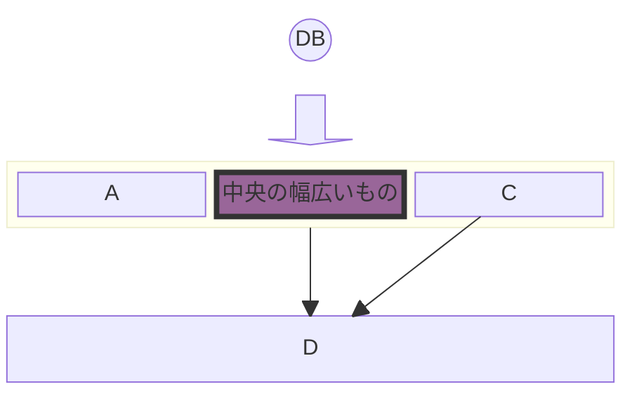

このページは、投稿やページで使用されるコンポーネントのテストにも使用されます。

## 便利なリンク

* [Hexo Docs](https://hexo.io/docs)
* [WikipediaのXMLおよびHTML文字エンティティ参照のリスト](https://en.wikipedia.org/wiki/List_of_XML_and_HTML_character_entity_references)

## 私のブログの情報

* [私のドメインが中国本土でブロックされているかチェック](http://www.viewdns.info/chinesefirewall/?domain=neo01.com)

## デザイン

* [Font Awesome](http://fontawesome.io/icons/#brand)

## よく使う絵文字
|                         |                                |        |
| ----------------------- | ------------------------------ | ------ |
| :D ````:D````(ショートカット)||
| :smile: ````:smile:```` | :blush: ````:blush:```` | :heart_eyes: ````:heart_eyes:```` |
| :sweat: ````:sweat:```` | :thumbsup: ````:thumbsup:```` | :yum: ````:yum:```` |
| :cold_sweat: ````:cold_sweat:```` | :scream: ````:scream:```` | :sob: ````:sob:```` |
| :stuck_out_tongue_winking_eye: ````:stuck_out_tongue_winking_eye:```` | :kissing: ````:kissing:```` | :sleepy: ````:sleepy:```` |
| :poop: ````:poop:````   | :v: ````:v:```` | :100: ````:100:```` |
| :see_no_evil: ````:see_no_evil:```` | :hear_no_evil: ````:hear_no_evil:```` | :speak_no_evil: ````:speak_no_evil:```` |
| :kiss: ````:kiss:````   | :skull: ````:skull:```` | :droplet: ````:droplet:```` |
| :fireworks: ````:fireworks:```` | :loudspeaker: ````:loudspeaker:```` | :warning: ````:warning:```` |
| :no_entry_sign: ````:no_entry_sign:```` | :white_check_mark: ````:white_check_mark:```` | :x: ````:x:```` |
| :secret: ````:secret:```` | :interrobang: ````:interrobang:```` | :bangbang: ````:bangbang:```` |

その他は[Emoji Cheatsheet](https://www.webpagefx.com/tools/emoji-cheat-sheet/)から

## CSS
### キー
* <kbd>Control</kbd> &lt;kbd&gt;Contro&lt;/kbd&gt;
* <kbd>Shift &#x21E7;</kbd> &lt;kbd&gt;Shift &amp;#x21E7;&lt;/kbd&gt; - Unicode文字を使用

## Markdown（プラグイン付き）
* `++挿入++` ++挿入++
* 脚注 ```[^1]```マーク用[^1]、```[^1]:```注釈用
* を使用（markdownが{{}}またはで問題を起こす場合）
* Youtube動画 

[^1]: 脚注サンプル

| アクション | Markdown | サンプル |
| ------ | -------- | ------ |
| 下付き | `H~2~0` | H~2~0 |
| 上付き | `x^2^` | x^2^ |
| 太字 | `**太字**` | **太字** |
| 斜体 | `*斜体*` | *斜体* |
| 太字と斜体 | `***太字と斜体***` | ***太字と斜体*** |
| マーク | `==マーク==` | ==マーク== |
| 取り消し線 | `~~取り消し線~~` | ~~取り消し線~~ |
| インラインコード | `` `インラインコード` `` | `インラインコード` |
| リンク | `[リンクテキスト](https://neo01.com)` | [リンクテキスト](https://neo01.com) |
| 画像 | `` |  |

スタイルクラスを持つ属性、例：

```
# ヘッダー {.style-me}
段落 {data-toggle=modal}
段落 *スタイルを適用*{.red} さらにテキスト
```

出力
```
<h1 class="style-me">ヘッダー</h1>
<p data-toggle="modal">段落</p>
<p>段落 <em class="red">スタイルを適用</em> さらにテキスト</p>
```

### テーブル列の配置
コード：

| デフォルト | 左 | 中央 | 右 |
| --- | :-- | :-: | --: |
| 1 | 1 | 1 | 1 |
| 22 | 22 | 22 | 22 |
| 333 | 333 | 333 | 333 |


結果：
| デフォルト | 左 | 中央 | 右 |
| --- | :-- | :-: | --: |
| 1 | 1 | 1 | 1 |
| 22 | 22 | 22 | 22 |
| 333 | 333 | 333 | 333 |

### 引用
コード：

> 引用テキスト


結果：
> 引用テキスト

### 順序付きリスト
コード：

1. アイテム1
2. アイテム2


結果：
1. アイテム1
2. アイテム2

### 順序なしリスト
コード：

- アイテム1
- アイテム2


結果：
- アイテム1
- アイテム2

### 水平線
コード：
`---`

結果：

---

### コードブロック

結果：
~~~
コードブロック
~~~

コード：

~~~
コードブロック
~~~


## Githubカード

**ユーザー**

コード：






**リポジトリ**

コード：




結果：


## Mermaid JS

事前レンダリング。

コード：

```mermaid
block-beta
columns 1
  db(("DB"))
  blockArrowId6<["&nbsp;&nbsp;&nbsp;"]>(down)
  block:ID
    A
    B["中央の幅広いもの"]
    C
  end
  space
  D
  ID --> D
  C --> D
  style B fill:#969,stroke:#333,stroke-width:4px
```


結果：


ライブレンダリング

<pre class="mermaid">
block-beta
columns 1
  db(("DB"))
  blockArrowId6<["&nbsp;&nbsp;&nbsp;"]>(down)
  block:ID
    A
    B["中央の幅広いもの"]
    C
  end
  space
  D
  ID --> D
  C --> D
  style B fill:#969,stroke:#333,stroke-width:4px
</pre>

## 棒グラフ

結果：

{
  "title": {
    "text": "オペレーティングシステム別エフェメラルポート範囲"
  },
  "tooltip": {},
  "xAxis": {
    "type": "category",
    "data": ["Linux (旧)", "Linux (新)", "Windows", "FreeBSD", "macOS"]
  },
  "yAxis": {
    "type": "value",
    "name": "ポート数"
  },
  "series": [{
    "type": "bar",
    "data": [28233, 28232, 16384, 55536, 16384],
    "itemStyle": {
      "color": "#1976d2"
    }
  }]
}


コード：


{
  "title": {
    "text": "オペレーティングシステム別エフェメラルポート範囲"
  },
  "tooltip": {},
  "xAxis": {
    "type": "category",
    "data": ["Linux (旧)", "Linux (新)", "Windows", "FreeBSD", "macOS"]
  },
  "yAxis": {
    "type": "value",
    "name": "ポート数"
  },
  "series": [{
    "type": "bar",
    "data": [28233, 28232, 16384, 55536, 16384],
    "itemStyle": {
      "color": "#1976d2"
    }
  }]
}


