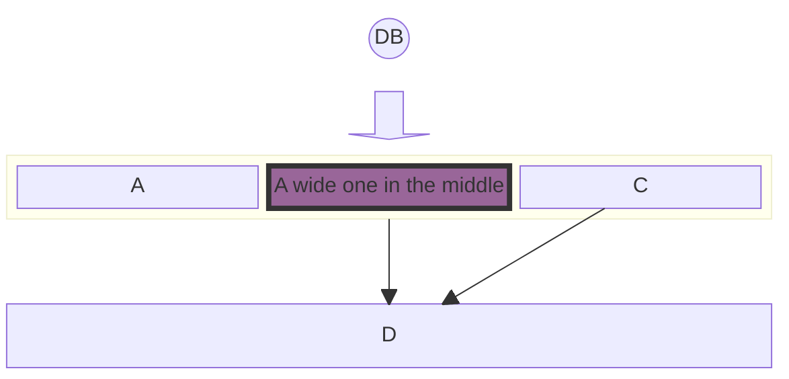

This page also used for testing components used in the posts and pages.

## Useful links

* [Hexo Docs](https://hexo.io/docs)
* [List of XML and HTML character entity references on Wikipedia](https://en.wikipedia.org/wiki/List_of_XML_and_HTML_character_entity_references)

## My blog's information

* [Check if my domain is blocked in mainland](http://www.viewdns.info/chinesefirewall/?domain=neo01.com)

## Design

* [Font Awesome](http://fontawesome.io/icons/#brand)

## Frequently used Emoji
|                         |                                |        |
| ----------------------- | ------------------------------ | ------ |
| :D ````:D````(shortcut)|||
| :smile: ````:smile:```` | :blush: ````:blush:```` | :heart_eyes: ````:heart_eyes:```` |
| :sweat: ````:sweat:```` | :thumbsup: ````:thumbsup:```` | :yum: ````:yum:```` |
| :cold_sweat: ````:cold_sweat:```` | :scream: ````:scream:```` | :sob: ````:sob:```` |
| :stuck_out_tongue_winking_eye: ````:stuck_out_tongue_winking_eye:```` | :kissing: ````:kissing:```` | :sleepy: ````:sleepy:```` |
| :poop: ````:poop:````   | :v: ````:v:```` | :100: ````:100:```` |
| :see_no_evil: ````:see_no_evil:```` | :hear_no_evil: ````:hear_no_evil:```` | :speak_no_evil: ````:speak_no_evil:```` |
| :kiss: ````:kiss:````   | :skull: ````:skull:```` | :droplet: ````:droplet:```` |
| :fireworks: ````:fireworks:```` | :loudspeaker: ````:loudspeaker:```` | :warning: ````:warning:```` |
| :no_entry_sign: ````:no_entry_sign:```` | :white_check_mark: ````:white_check_mark:```` | :x: ````:x:```` |
| :secret: ````:secret:```` | :interrobang: ````:interrobang:```` | :bangbang: ````:bangbang:```` |

and more from [Emoji Cheatsheet](https://www.webpagefx.com/tools/emoji-cheat-sheet/)

## CSS
### Keys
* <kbd>Control</kbd> &lt;kbd&gt;Contro&lt;/kbd&gt;
* <kbd>Shift &#x21E7;</kbd> &lt;kbd&gt;Shift &amp;#x21E7;&lt;/kbd&gt; - use Unicode characters

## Markdown (with plugins)
* `++Inserted++` ++Inserted++
* Footnote ```[^1]``` for the mark[^1], ```[^1]:``` for the note
* Use  if the markdown cause you trouble on {{}} or 
* Youtube Video 

[^1]: Footnote sample

| Action | Markdown | Sample |
| ------ | -------- | ------ |
| sub | `H~2~0` | H~2~0 |
| sup | `x^2^` | x^2^ |
| Bold | `**bold**` | **bold** |
| Italic | `*italic*` | *italic* |
| Bold and Italic | `***bold and italic***` | ***bold and italic*** |
| Marked | `==marked==` | ==marked== |
| Strikethrough | `~~strikethrough~~` | ~~strikethrough~~ |
| Inline code | `` `inline code` `` | `inline code` |
| Link | `[link text](https://neo01.com)` | [link text](https://neo01.com) |
| Image | `` |  |

Attributes with style class, eg:

```
# header {.style-me}
paragraph {data-toggle=modal}
paragraph *style me*{.red} more text
```

output
```
<h1 class="style-me">header</h1>
<p data-toggle="modal">paragraph</p>
<p>paragraph <em class="red">style me</em> more text</p>
```

### Table Column Alignment
Code:

| Default | Left | Center | Right |
| --- | :-- | :-: | --: |
| 1 | 1 | 1 | 1 |
| 22 | 22 | 22 | 22 |
| 333 | 333 | 333 | 333 |


Result:
| Default | Left | Center | Right |
| --- | :-- | :-: | --: |
| 1 | 1 | 1 | 1 |
| 22 | 22 | 22 | 22 |
| 333 | 333 | 333 | 333 |

### Blockquote
Code:

> Some quote text


Result:
> Some quote text

### Ordered list 
Code:

1. item 1
2. item 2


Result:
1. item 1
2. item 2

### Unordered list 
Code:

- item 1
- item 2


Result:
- item 1
- item 2

### Horizontal rule
Code:
`---`

Result:

---


## Github Card

**User**

Code:






**A repository**

Code:




Result:


## Mermaid JS



## Admonition Blocks

### anote - General Notes

!!!anote "📝 Quick Note"
    This is a general note block for observations and additional context.

### info - Additional Information

!!!info "💡 Pro Tip"
    Use absolute paths when referencing assets in localized content.

### todo - Task Reminders

!!!todo "✅ Action Items"
    - Add excerpt to all blog posts
    - Verify tag capitalization
    - Test mermaid diagrams

### warning - Important Warnings

!!!warning "⚠️ Breaking Change"
    Hexo 8.x requires Node.js 14.0.0 or higher. Update your environment before upgrading.

### error - Critical Issues

!!!error "❌ Common Mistake"
    Do not use `note` type - it conflicts with CSS. Always use `anote` instead.

### success - Positive Outcomes

!!!success "✅ Build Successful"
    Your site has been generated successfully and is ready for deployment.

### tip - Best Practices

!!!tip "💡 Performance Optimization"
    Enable lazy loading for images to improve page load times.

### question - Considerations

!!!question "🤔 Design Decision"
    Should we use Git Flow or GitHub Flow for this project?

### quote - Citations

!!!quote "💬 Linus Torvalds"
    Talk is cheap. Show me the code.

### Advanced Formatting Inside Blocks

**Lists Inside Admonition**

!!!warning "⚠️ Security Checklist"
    Before deploying:
    
    1. Remove all API keys and secrets
    2. Enable HTTPS
    3. Update dependencies
       - Check for vulnerabilities
       - Run `npm audit fix`
    4. Test in staging environment

**Blockquote Inside Admonition**

!!!anote "📋 Design Philosophy"
    > Simplicity is the ultimate sophistication.
    > — Leonardo da Vinci
    
    This principle applies to code architecture and user interface design.

**Mixed Content**

!!!example "💻 Complete Setup Guide"
    **Step 1:** Install dependencies
    
    `npm install hexo-cli -g`
    
    **Step 2:** Create new project
    
    - Initialize: `hexo init blog`
    - Navigate: `cd blog`
    - Install: `npm install`
    
    **Step 3:** Configuration checklist
    
    1. Update `_config.yml`
    2. Set site title and description
    3. Configure deployment settings
    
    > **Note:** Always backup your configuration before major changes.

## Barchart

Result:

{
  "title": {
    "text": "Ephemeral Port Ranges by Operating System"
  },
  "tooltip": {},
  "xAxis": {
    "type": "category",
    "data": ["Linux (Old)", "Linux (New)", "Windows", "FreeBSD", "macOS"]
  },
  "yAxis": {
    "type": "value",
    "name": "Number of Ports"
  },
  "series": [{
    "type": "bar",
    "data": [28233, 28232, 16384, 55536, 16384],
    "itemStyle": {
      "color": "#1976d2"
    }
  }]
}


Code:


{
  "title": {
    "text": "Ephemeral Port Ranges by Operating System"
  },
  "tooltip": {},
  "xAxis": {
    "type": "category",
    "data": ["Linux (Old)", "Linux (New)", "Windows", "FreeBSD", "macOS"]
  },
  "yAxis": {
    "type": "value",
    "name": "Number of Ports"
  },
  "series": [{
    "type": "bar",
    "data": [28233, 28232, 16384, 55536, 16384],
    "itemStyle": {
      "color": "#1976d2"
    }
  }]
}


